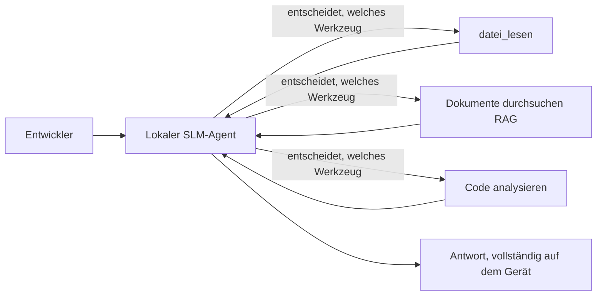
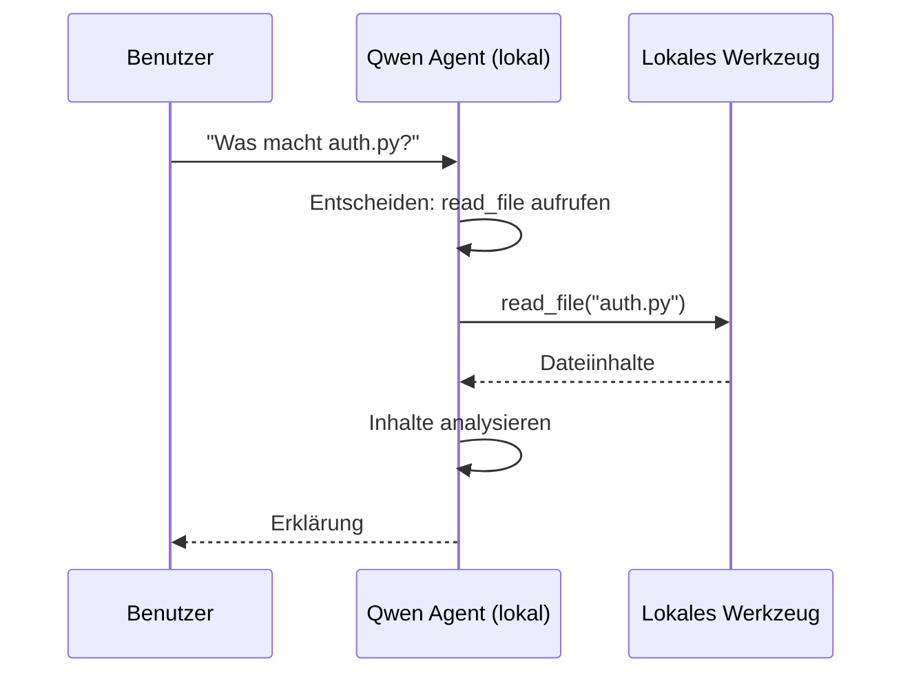
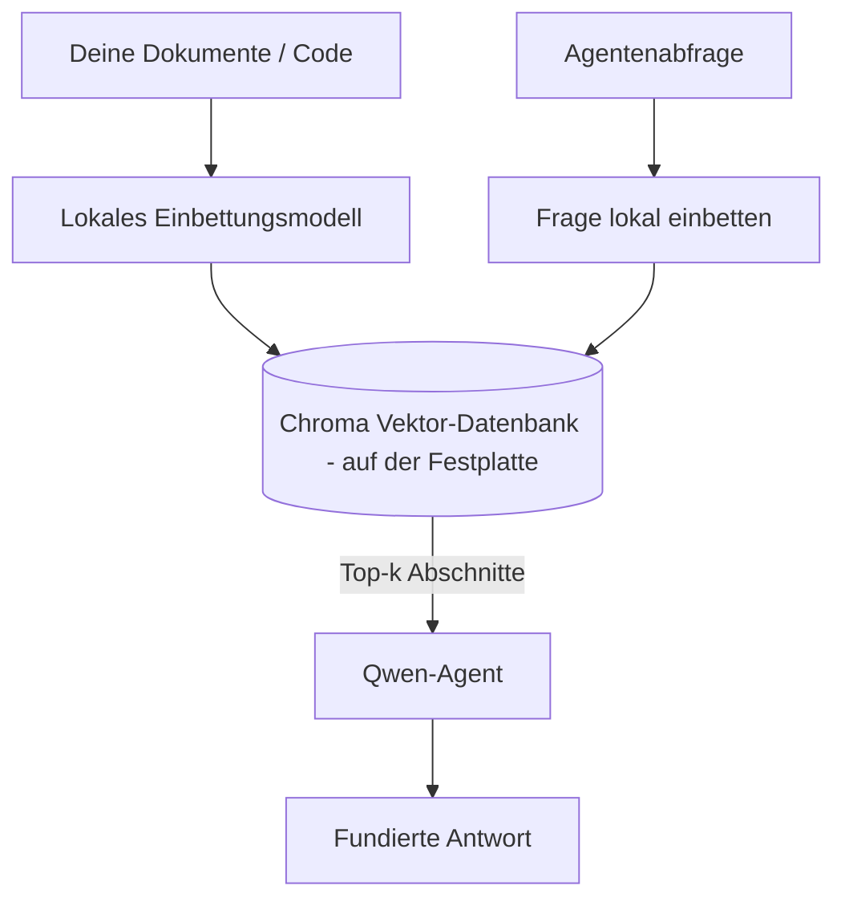
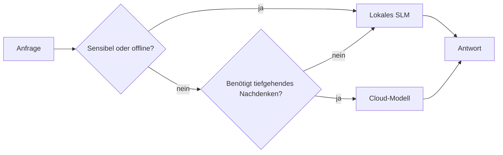

# Lokale KI-Agenten erstellen mit Microsoft Foundry Local und Qwen


Die vorherige Lektion hat Agenten *hochskaliert* in die Cloud. Diese bringt sie *herunter* auf eine einzelne Maschine. Am Ende wirst du einen funktionierenden Engineering-Assistenten haben, der logisch denkt, Werkzeuge aufruft, deine Dateien liest und deine Dokumentation durchsucht — **ohne einen einzigen Cloud-Inferenzaufruf.**

Warum sollte man das wollen? Drei Gründe, die in der echten Ingenieurarbeit ständig auftauchen:

- **Datenschutz.** Code und Dokumente verlassen niemals die Maschine. Kein Prompt, kein Ausschnitt, keine Kundendaten überschreiten die Netzwerkgrenze.
- **Kosten.** Lokale Inferenz verursacht keine Gebühren pro Token. Du kannst den ganzen Tag iterieren zum Preis des Stroms.
- **Offline.** Im Flugzeug, in einer sicheren Einrichtung oder bei einem Ausfall funktioniert der Agent trotzdem.

Der Haken ist, dass du ein Cloud-Frontier-Modell gegen ein **Small Language Model (SLM)** eintauschst, das auf deiner CPU, GPU oder NPU läuft. Diese Lektion handelt davon, Agenten zu bauen, die *gut* innerhalb dieser Einschränkung sind und nicht so tun, als gäbe es sie nicht.

## Einführung

Diese Lektion behandelt:

- **Small Language Models (SLMs)** — was sie sind, wo sie glänzen und wo nicht.
- **Microsoft Foundry Local** — eine Laufzeitumgebung, die Modelle auf dem Gerät herunterlädt und über eine **OpenAI-kompatible API** bereitstellt.
- **Qwen Function-Calling-Modelle** — SLMs, die zuverlässig Werkzeugaufrufe erzeugen, was lokale *Agenten* (nicht nur lokale Chats) ermöglicht.
- **Lokale Werkzeuge, lokales RAG und lokales MCP** — um dem Agenten Fähigkeiten ohne Cloud zu geben.
- **Hybride Muster** — wann man lokal bleibt und wann man die Cloud nutzt.

## Lernziele

Nach Abschluss dieser Lektion wirst du wissen, wie man:

- die Kompromisse von SLMs erklärt und passende lokale Agent-Anwendungsfälle auswählt.
- ein Qwen-Modell lokal mit Foundry Local bedient und über den OpenAI-kompatiblen Endpunkt verbindet.
- einen Werkzeug-aufrufenden Agenten baut, der vollständig auf deinem Arbeitsplatz läuft.
- lokales RAG über eigene Dokumente mit einer lokalen Vektordatenbank (Chroma) hinzufügt.
- den Agenten mit einem lokalen MCP-Server verbindet und über hybride lokal/Cloud-Designs nachdenkt.

## Voraussetzungen

Diese Lektion setzt voraus, dass du frühere Lektionen abgeschlossen hast und sicher bist in:

- [Werkzeugnutzung](../04-tool-use/README.md) (Lektion 4) und [Agentic RAG](../05-agentic-rag/README.md) (Lektion 5).
- [Agentic Protocols / MCP](../11-agentic-protocols/README.md) (Lektion 11).
- Dem [Microsoft Agent Framework](../14-microsoft-agent-framework/README.md) (Lektion 14).

Du benötigst außerdem:

- Eine Entwickler-Workstation. **8 GB RAM sind ein realistisches Minimum**; 16 GB+ sind angenehm. Eine GPU oder NPU hilft, ist aber nicht zwingend erforderlich.
- **Microsoft Foundry Local** installiert (siehe Abschnitt Einrichtung unten).
- Python 3.12+ und die Pakete im Repositorium [`requirements.txt`](../../../requirements.txt) sowie `foundry-local-sdk`, `openai` und `chromadb` für diese Lektion.

## Small Language Models: Das richtige Werkzeug für lokale Arbeit

Ein Frontier-Cloud-Modell hat hunderte Milliarden Parameter und ein Rechenzentrum dahinter. Ein SLM hat wenige Milliarden Parameter und muss in den RAM deines Laptops passen. Dieser Unterschied setzt klare Erwartungen.

**SLMs sind gut bei:**

- Strukturierten, begrenzten Aufgaben — Klassifikation, Extraktion, Zusammenfassung eines bekannten Dokuments.
- **Werkzeugaufruf** — entscheiden, welche Funktion mit welchen Argumenten aufgerufen wird.
- Schneller, günstiger, privater Iteration mit eigenen Daten.

**SLMs sind schwächer bei:**

- Offener, mehrstufiger Schlussfolgerung über großen Kontext.
- Umfassendes Weltwissen (sie haben weniger gesehen und vergessen mehr).

Die erfolgreiche Strategie für lokale Agenten ist deshalb: **lass das SLM orchestrieren und die Werkzeuge die schwere Arbeit machen.** Das Modell muss deinen Code nicht *kennen* — es muss wissen, wann es `read_file` und `search_docs` aufruft. Das spielt direkt in die Stärken eines SLM.



## Microsoft Foundry Local

**Microsoft Foundry Local** ist eine leichte Laufzeitumgebung, die Modelle komplett auf deinem Gerät herunterlädt, verwaltet und bereitstellt. Das wichtigste Merkmal für uns ist, dass es einen **OpenAI-kompatiblen HTTP-Endpunkt** bereitstellt — das bedeutet, das OpenAI SDK und der OpenAI-Client des Microsoft Agent Frameworks funktionieren damit mit nur einem Wechsel der `base_url`. Alles, was du über das Bauen von Agenten gelernt hast, lässt sich eins zu eins übertragen; nur der Endpunkt verschiebt sich von der Cloud auf `localhost`.

Foundry Local wählt außerdem automatisch die beste Modellversion für deine Hardware — eine CPU-Version, eine CUDA/GPU-Version oder eine NPU-Version — so musst du deine Maschine nicht manuell optimieren.

### Einrichtung

Installiere Foundry Local (siehe die [Dokumentation](https://learn.microsoft.com/azure/ai-foundry/foundry-local/) für dein Betriebssystem), und verifiziere dann, dass es funktioniert:

```bash
# Installieren (Beispiel; folgen Sie der Dokumentation für Ihre Plattform)
winget install Microsoft.FoundryLocal      # Windows
# brew install microsoft/foundrylocal/foundrylocal   # macOS

# Laden Sie ein Qwen-Modell herunter und führen Sie es aus, starten Sie dann den lokalen Dienst
foundry model run qwen2.5-7b-instruct
foundry service status
```

Sobald der Dienst läuft, hast du einen lokalen, OpenAI-kompatiblen Endpunkt (typischerweise `http://localhost:PORT/v1`). Das Notebook verwendet das `foundry-local-sdk`, um den Endpunkt automatisch zu finden, sodass du den Port nicht hartkodieren musst.

## Qwen Function Calling: Warum es wichtig ist

Ein Agent ist nur ein Agent, wenn er Werkzeuge aufrufen kann. Viele SLMs können chatten, erzeugen aber unzuverlässige, fehlerhafte Werkzeugaufrufe. **Qwen**-Modelle sind für den Funktionsaufruf trainiert und geben konsistent wohlgeformte Werkzeugaufrufstrukturen aus — genau das macht aus einem lokalen Chatmodell einen lokalen *Agenten*.

Der Ablauf ist die bekannte Werkzeugaufrufschleife, nur eben lokal ausgeführt:



## Lokales RAG

Dokumentensuche ist der Ort, an dem lokale Agenten ihren Mehrwert zeigen. Anstatt zu hoffen, dass das SLM sich die Dokumentation deines Frameworks gemerkt hat, bettest du diese Dokumente in eine **lokale Vektordatenbank** ein und lässt den Agenten die relevanten Abschnitte bei Bedarf abrufen.

Wir verwenden **Chroma**, einen eingebetteten Vektorstore, der im Prozess ohne Server läuft. Die Pipeline ist komplett lokal: lokales Einbettungsmodell → lokale Vektoren → lokale Suche → lokales SLM.



Das ist das gleiche Agentic RAG-Muster aus Lektion 5 — der einzige Unterschied ist, dass jede Komponente auf deiner Maschine läuft.

## Lokale MCP-Server

[MCP](../11-agentic-protocols/README.md) ist ein Transport, kein Cloud-Service. Ein MCP-Server kann lokal als Prozess über `stdio` laufen und Werkzeuge über das Standardprotokoll für deinen Agenten bereitstellen. So kannst du das wachsende Ökosystem an MCP-Servern wiederverwenden — Dateisystemzugriff, Git-Operationen, Datenbankabfragen — komplett offline.

Die Sicherheitslage unterscheidet sich von der Cloud, ist aber nicht absent: ein lokaler MCP-Server läuft immer noch mit den Berechtigungen deines Nutzers, also begrenze, was er erreichen kann (ein Projektordner, nicht dein gesamtes Heimatverzeichnis) und behandle seine Ausgaben als Eingaben, die du validieren solltest.

## Hybride Cloud-und-Lokal-Muster

Local-first heißt nicht lokal-allein. Reife Systeme routen nach Sensibilität und Schwierigkeit:

| Situation | Wo es läuft |
| --- | --- |
| Sensibler Code / Daten oder offline | **Lokales SLM** |
| Einfache, begrenzte Aufgabe | **Lokales SLM** (günstig, schnell) |
| Komplexe mehrstufige Schlussfolgerungen bei nicht-sensiblen Daten | **Cloud-Modell** |
| Alles, während eines Ausfalls | **Lokales SLM** (sanfter Abbau) |

Das spiegelt die **Modell-Routing**-Idee aus Lektion 16 wider — nur dass eines der "Modelle" jetzt deine eigene Maschine ist. Ein robustes Design weicht auf lokal aus, wenn die Cloud nicht verfügbar ist, so dass der Agent in der Qualität abnimmt statt komplett auszufallen.



## Praxislabor: Ein lokaler Engineering-Assistent

Öffne [`code_samples/17-local-agent-foundry-local.ipynb`](./code_samples/17-local-agent-foundry-local.ipynb) und bearbeite es Schritt für Schritt. Du baust einen **lokalen Engineering-Assistenten**, der vollständig auf deinem Arbeitsplatz läuft und kann:

1. **Werkzeuge aufrufen** — via Qwen Function Calling durch Foundry Local.
2. **Lokale Dateioperationen ausführen** — Dateien in einem Projektverzeichnis listen und lesen.
3. **Code analysieren** — grundlegende Metriken zu einer Quelldatei melden.
4. **Dokumentation durchsuchen** — lokales RAG über einen Docs-Ordner mit Chroma.
5. **MCP verwenden** — Verbindung zu einem lokalen MCP-Server (mit sanftem Überspringen, falls keiner konfiguriert ist).

Zu keinem Zeitpunkt wird Cloud-Inferenz genutzt.

### Durchgang

Der Assistent verbindet sich über den OpenAI-kompatiblen Endpunkt mit Foundry Local, sodass der Agenten-Code fast identisch mit den Cloud-Lektionen aussieht — nur der Client ändert sich:

```python
from foundry_local import FoundryLocalManager
from openai import OpenAI

# Foundry Local entdeckt/lädt das Modell herunter und stellt uns einen lokalen Endpunkt zur Verfügung.
manager = FoundryLocalManager(\"qwen2.5-7b-instruct\")
client = OpenAI(base_url=manager.endpoint, api_key=manager.api_key)  # api_key ist ein lokaler Platzhalter
```

Die Werkzeuge sind übliche Python-Funktionen mit Geltungsbereich auf ein Projektverzeichnis:

```python
def read_file(path: str) -> str:
    \"\"\"Read a file, but only inside the sandboxed project directory.\"\"\"
    full = (PROJECT_ROOT / path).resolve()
    if PROJECT_ROOT not in full.parents and full != PROJECT_ROOT:
        return \"Access denied: path is outside the project directory.\"
    return full.read_text(encoding=\"utf-8\")
```

Beachte die Sandbox-Prüfung — selbst lokal ist ein Werkzeug, das beliebige Pfade liest, ein Risiko. Das Notebook hält alle Werkzeuge strikt auf einen Projekt-Stammordner begrenzt.

## Wissenscheck

Teste dein Verständnis, bevor du zur Übung weitergehst.

**1. Nenne zwei konkrete Gründe, einen Agenten lokal statt in der Cloud laufen zu lassen.**

<details>
<summary>Antwort</summary>

Jeweils zwei von: **Datenschutz** (Code und Daten verlassen nie die Maschine), **Kosten** (keine Abrechnung pro Token) und **Offline-Fähigkeit** (funktioniert ohne Netzwerk — im Flugzeug, in einer sicheren Einrichtung oder bei einem Ausfall). Regulatorische/Compliance-Einschränkungen, die das Versenden von Daten außerhalb des Geräts verbieten, sind ein häufiger Grund für den Datenschutzaspekt.
</details>

**2. Wie ist die empfohlene Arbeitsteilung zwischen einem SLM und seinen Werkzeugen in einem lokalen Agenten, und warum?**

<details>
<summary>Antwort</summary>

Lass das SLM **orchestrieren** (entscheiden, welches Werkzeug mit welchen Argumenten aufzurufen ist) und die **Werkzeuge die schwere Arbeit erledigen** (Dateien lesen, Dokumente abrufen, Ergebnisse berechnen). SLMs sind stark bei begrenzten Entscheidungen wie Werkzeugauswahl, aber schwächer beim breiten Wissen und langen mehrstufigen Schlussfolgerungen, daher spielt das Nutzen von Werkzeugen ihre Stärken aus.
</details>

**3. Was macht es möglich, Cloud-Agenten-Code mit Foundry Local wiederzuverwenden?**

<details>
<summary>Antwort</summary>

Foundry Local bietet einen **OpenAI-kompatiblen HTTP-Endpunkt**. Das OpenAI SDK und der OpenAI-Client des Agent Frameworks funktionieren damit, indem sie nur die `base_url` ändern (und einen lokalen Platzhalter-API-Schlüssel verwenden). Alles andere am Agenten-Code bleibt gleich.
</details>

**4. Warum verwenden wir speziell ein Qwen Function-Calling-Modell statt irgendeines SLM?**

<details>
<summary>Antwort</summary>

Weil ein Agent zuverlässige, wohlgeformte **Werkzeugaufrufe** erzeugen muss. Viele SLMs können chatten, erzeugen aber fehlerhafte oder inkonsistente Werkzeugaufrufstrukturen. Qwen-Modelle sind für Funktionsaufrufe trainiert und produzieren konsistente Werkzeugaufrufe, was aus einem lokalen Chatmodell einen funktionierenden lokalen Agenten macht.
</details>

**5. Welche Komponenten laufen in der lokalen RAG-Pipeline auf der Maschine?**

<details>
<summary>Antwort</summary>

Alle: das Einbettungsmodell, die Vektordatenbank (Chroma, auf der Festplatte), der Retrieval-Schritt und das SLM. Dokumente werden lokal eingebettet, lokal gespeichert, lokal abgerufen und von einem lokalen Modell verarbeitet — keine Komponente berührt die Cloud.
</details>

**6. Ein lokaler MCP-Server läuft auf deiner Maschine. Macht ihn das automatisch sicher? Welche Vorsichtsmaßnahme solltest du trotzdem ergreifen?**

<details>
<summary>Antwort</summary>

Nein. Ein lokaler MCP-Server läuft mit den Berechtigungen deines Nutzers, somit kann er alles erreichen, was du auch kannst. Begrenze ihn auf das, was er braucht (zum Beispiel ein einzelnes Projektverzeichnis statt deines gesamten Heimordners) und behandle seine Ausgaben als Eingaben, die du validieren solltest, bevor du darauf reagierst.
</details>

**7. Beschreibe eine sinnvolle hybride Routing-Regel, die ein lokales Modell einbezieht.**

<details>
<summary>Antwort</summary>

Route sensible oder Offline-Anfragen an das lokale SLM; routen einfache begrenzte Aufgaben an das lokale SLM für Geschwindigkeit und Kosten; routen schwierige mehrstufige Schlussfolgerungen bei nicht-sensiblen Daten an ein Cloud-Modell; und fall zurück auf das lokale SLM, falls die Cloud nicht verfügbar ist, damit der Agent sanft degradiert statt auszufallen. Das ist Modell-Routing (Lektion 16) mit der lokalen Maschine als einem der Modelle.
</details>

**8. Was ist eine realistische Mindest-RAM-Größe für den lokalen Agenten in dieser Lektion, und was bringt mehr RAM?**

<details>
<summary>Antwort</summary>

Etwa **8 GB** sind ein realistisches Minimum; 16 GB+ sind bequem. Mehr RAM ermöglicht das Ausführen größerer, fähigerer Modelle und mehr Kontext im Speicher zu behalten. Eine GPU oder NPU beschleunigt die Inferenz, ist aber nicht zwingend erforderlich — Foundry Local wählt eine CPU-Version, wenn kein Beschleuniger verfügbar ist.
</details>

## Aufgabe

Erweitere den lokalen Engineering-Assistenten zu einem **lokalen Dokumentationsprüfer** für ein kleines Projekt deiner Wahl (verwende bei Bedarf einen der Lektionen-Ordner aus diesem Repo).

Deine Abgabe sollte:

1. Einen echten Docs-/Code-Ordner in Chroma indexieren (mindestens fünf Dateien).
2. Ein `find_todos`-Werkzeug hinzufügen, das das Projekt nach `TODO`-/`FIXME`-Kommentaren durchsucht und diese mit Datei- und Zeilennummer zurückgibt — dabei die gleiche Sandbox-Prüfung wie `read_file` einhalten.

3. **Stellen Sie dem Agenten drei Fragen**, die ihn zwingen, Werkzeuge zu kombinieren: eine reine RAG-Frage, eine, die das Lesen einer bestimmten Datei erfordert, und eine, die das Finden von TODOs erfordert.
4. **Messen Sie es**: messen Sie die Zeit jeder der drei Antworten und notieren Sie sie in einer Markdown-Zelle. Kommentieren Sie, ob die Latenz für Ihren beabsichtigten Arbeitsablauf akzeptabel ist.

Schreiben Sie dann einen kurzen Absatz darüber, **was Sie für diesen Reviewer in die Cloud verlagern und was Sie lokal behalten würden**, und warum. Bewertet wird, ob die lokalen Komponenten korrekt verbunden sind und ob Ihr hybrides Denken stichhaltig ist – nicht die Modellqualität.

## Zusammenfassung

In dieser Lektion haben Sie einen Agenten gebaut, der vollständig auf Ihrem eigenen Rechner läuft:

- **SLMs** tauschen Breite gegen Privatsphäre, Kosten und Offline-Betrieb — und glänzen, wenn sie **Werkzeuge orchestrieren**, anstatt das gesamte Wissen selbst zu tragen.
- **Foundry Local** stellt Modelle auf dem Gerät hinter einem **OpenAI-kompatiblen Endpunkt** bereit, sodass Ihr Cloud-Agenten-Code mit einer einzigen Zeilenänderung übertragen wird.
- **Qwen-Funktionsaufruf-Modelle** ermöglichen zuverlässige lokale Werkzeugaufrufe — und damit lokale *Agenten*.
- **Lokaler RAG** (Chroma) und **lokaler MCP** geben dem Agenten Fähigkeiten, ohne die Maschine zu verlassen.
- **Hybride Muster** erlauben es, nach Sensitivität und Schwierigkeit zu routen, mit lokal als elegante Rückfalloption.

Dies schließt den Bereitstellungsbogen ab: Lektion 16 hat Agenten in Microsoft Foundry skaliert, und diese Lektion hat sie auf einen einzelnen Arbeitsplatz herunter skaliert. Die nächste Lektion beschäftigt sich damit, bereitgestellte Agenten sicher zu halten.

## Zusätzliche Ressourcen

- <a href="https://learn.microsoft.com/azure/ai-foundry/foundry-local/" target="_blank">Microsoft Foundry Local Dokumentation</a>
- <a href="https://learn.microsoft.com/azure/ai-foundry/what-is-azure-ai-foundry" target="_blank">Microsoft Foundry Dokumentation</a>
- <a href="https://learn.microsoft.com/en-us/agent-framework/overview/?wt.mc_id=youtube_26688_organicsocial_reactor&pivots=programming-language-python" target="_blank">Microsoft Agent Framework</a>
- <a href="https://qwen.readthedocs.io/en/latest/framework/function_call.html" target="_blank">Qwen Funktionsaufruf-Dokumentation</a>
- <a href="https://modelcontextprotocol.io/" target="_blank">Model Context Protocol (MCP)</a>
- <a href="https://docs.trychroma.com/" target="_blank">Chroma Vektordatenbank</a>

## Vorherige Lektion

[Bereitstellen skalierbarer Agenten](../16-deploying-scalable-agents/README.md)

## Nächste Lektion

[KI-Agenten sichern](../18-securing-ai-agents/README.md)

---

<!-- CO-OP TRANSLATOR DISCLAIMER START -->
**Haftungsausschluss**:
Dieses Dokument wurde mit dem KI-Übersetzungsdienst [Co-op Translator](https://github.com/Azure/co-op-translator) übersetzt. Obwohl wir uns um Genauigkeit bemühen, beachten Sie bitte, dass automatisierte Übersetzungen Fehler oder Ungenauigkeiten enthalten können. Das Originaldokument in seiner Ursprungssprache gilt als maßgebliche Quelle. Bei kritischen Informationen wird eine professionelle menschliche Übersetzung empfohlen. Wir übernehmen keine Haftung für Missverständnisse oder Fehlinterpretationen, die aus der Verwendung dieser Übersetzung entstehen.
<!-- CO-OP TRANSLATOR DISCLAIMER END -->