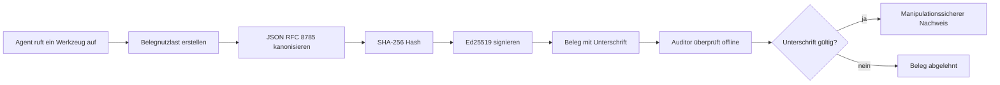
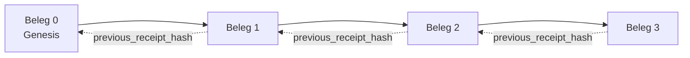

[Sehen Sie das Lernvideo: Absicherung von KI-Agenten mit kryptografischen Belegen](https://youtu.be/PLACEHOLDER_VIDEO_ID)

> _(Lernvideo und Miniaturansicht werden vom Microsoft Content-Team nach dem Merge hinzugefügt, entsprechend dem Muster Lektion 14 / 15.)_

# Absicherung von KI-Agenten mit kryptografischen Belegen

## Einführung

Diese Lektion behandelt:

- Warum Audit-Trails für KI-Agenten für Compliance, Debugging und Vertrauen wichtig sind.
- Was ein kryptografischer Beleg ist und wie er sich von einer ununterschriebenen Protokollzeile unterscheidet.
- Wie man in einfachem Python einen signierten Beleg für einen Tool-Aufruf eines Agenten erzeugt.
- Wie man einen Beleg offline verifiziert und Manipulationen erkennt.
- Wie man Belege verkettet, sodass das Entfernen oder Umordnen eines Belegs die Kette zerstört.
- Was Belege beweisen und was sie explizit nicht beweisen.

## Lernziele

Nach Abschluss dieser Lektion können Sie:

- Fehlermodi identifizieren, die kryptografische Herkunft für Agentenaktionen motivieren.
- Einen Ed25519-signierten Beleg über eine kanonische JSON-Nutzlast erzeugen.
- Einen Beleg unabhängig nur mit dem öffentlichen Schlüssel des Unterzeichners verifizieren.
- Manipulation durch erneute Verifikation eines modifizierten Belegs erkennen.
- Eine hash-verknüpfte Sequenz von Belegen aufbauen und erklären, warum die Kette wichtig ist.
- Die Grenze erkennen zwischen dem, was Belege beweisen (Zurechnung, Integrität, Reihenfolge) und dem, was sie nicht beweisen (Korrektheit der Aktion, Gültigkeit der Richtlinie).

## Das Problem: Der Audit-Trail Ihres Agenten

Stellen Sie sich vor, Sie haben einen KI-Agenten für Contoso Travel bereitgestellt. Der Agent liest Kundenanfragen, ruft eine Flug-API zur Abfrage von Optionen auf und bucht Plätze im Namen des Kunden. Im letzten Quartal hat der Agent 50.000 Buchungen verarbeitet.

Heute kommt ein Prüfer. Er stellt eine einfache Frage: „Zeigen Sie mir, was Ihr Agent gemacht hat.“

Sie übergeben Ihre Protokolldateien. Der Prüfer schaut sie sich an und stellt die schwierigere Frage: „Woher weiß ich, dass diese Protokolle nicht manipuliert wurden?“

Das ist das Problem des Audit-Trails. Die meisten Agentenbereitstellungen heute verlassen sich auf:

- **Anwendungsprotokolle**: vom Agenten selbst geschrieben, von jedem mit Dateisystemzugriff bearbeitbar.
- **Cloud-Logging-Dienste**: manipulationssicher auf Plattformebene, aber nur wenn der Prüfer dem Plattformbetreiber vertraut.
- **Datenbank-Transaktionsprotokolle**: gut geeignet für Datenbankänderungen, aber nicht für beliebige Tool-Aufrufe.

Keines dieser Verfahren kann die Frage des Prüfers beantworten, ohne dass dieser jemandem vertrauen muss (Ihnen, Ihrem Cloud-Anbieter, Ihrem Datenbankanbieter). Für den internen Gebrauch ist dieses Vertrauen oft akzeptabel. Für regulierte Arbeitslasten (Finanzen, Gesundheit, alles, was dem EU-KI-Gesetz unterliegt) ist es das nicht.

Kryptografische Belege lösen dieses Problem, indem jede Agentenaktion unabhängig verifizierbar wird. Der Prüfer muss Ihnen nicht vertrauen. Er benötigt nur Ihren öffentlichen Schlüssel und den Beleg selbst.

## Was ist ein kryptografischer Beleg?

Ein Beleg ist ein JSON-Objekt, das aufzeichnet, was ein Agent getan hat, signiert mit einer digitalen Signatur.



Ein minimaler Beleg sieht so aus:

```json
{
  "type": "agent.tool_call.v1",
  "agent_id": "contoso-travel-bot",
  "tool_name": "lookup_flights",
  "tool_args_hash": "sha256:a3f9c1...",
  "result_hash": "sha256:7b2e1d...",
  "policy_id": "contoso-travel-policy-v3",
  "timestamp": "2026-04-25T14:30:00Z",
  "sequence": 47,
  "previous_receipt_hash": "sha256:9d4e6a...",
  "signature": {
    "alg": "EdDSA",
    "sig": "c5af83...",
    "public_key": "8f3b2c..."
  }
}
```

Drei Eigenschaften sorgen für die Sicherheit:

1. **Die Signatur**. Der Beleg wird vom Gateway des Agenten mit einem Ed25519-Privatschlüssel signiert. Jeder mit dem zugehörigen öffentlichen Schlüssel kann die Signatur offline verifizieren. Jede Manipulation an einem Feld macht die Signatur ungültig.

2. **Kanonische Kodierung**. Vor der Signatur wird der Beleg mit JSON Canonicalization Scheme (JCS, RFC 8785) serialisiert. Das stellt sicher, dass zwei Implementierungen, die den gleichen logischen Beleg erzeugen, exakt identische Bytes ausgeben. Ohne Kanonisierung würden verschiedene JSON-Serializer unterschiedliche Signaturen für denselben Inhalt erzeugen.

3. **Hash-Verkettung**. Das Feld `previous_receipt_hash` verbindet jeden Beleg mit dem vorherigen. Das Entfernen oder Umordnen eines Belegs bricht jede nachfolgende Signaturkette. Manipulationen werden auf der Kettenebene sichtbar, selbst wenn individuelle Signaturen umgangen werden.

Gemeinsam bieten diese Eigenschaften drei Garantien:

- **Zurechnung**: Dieser Schlüssel hat diesen Inhalt signiert.
- **Integrität**: Der Inhalt hat sich seit der Signatur nicht geändert.
- **Reihenfolge**: Dieser Beleg folgt diesem anderen Beleg in der Kette.

## Einen Beleg in Python erzeugen

Zum Erzeugen eines Belegs brauchen Sie keine spezielle Bibliothek. Die kryptografischen Primitive sind breit verfügbar und die Logik umfasst nur einige Dutzend Zeilen Python.

Die praxisnahen Übungen in `code_samples/18-signed-receipts.ipynb` führen durch den kompletten Ablauf. Die Kurzfassung:

```python
import json
import hashlib
import base64
from nacl import signing
from jcs import canonicalize  # RFC 8785 kanonisches JSON

def b64url_nopad(data: bytes) -> str:
    return base64.urlsafe_b64encode(data).decode("ascii").rstrip("=")

def sha256_canonical(obj) -> str:
    """SHA-256 of a Python object's JCS-canonical JSON form."""
    return f"sha256:{hashlib.sha256(canonicalize(obj)).hexdigest()}"

# Einen Signierschlüssel generieren oder laden (in der Produktion in einem Schlüsselsafe speichern)
signing_key = signing.SigningKey.generate()
verify_key = signing_key.verify_key

# Die Belegnutzlast erstellen (noch keine Signatur)
tool_args = {"origin": "SYD", "destination": "LAX"}
tool_result = [{"flight": "QF11", "price": 1850, "stops": 0}]

payload = {
    "type": "agent.tool_call.v1",
    "agent_id": "contoso-travel-bot",
    "tool_name": "lookup_flights",
    "tool_args_hash": sha256_canonical(tool_args),
    "result_hash": sha256_canonical(tool_result),
    "policy_id": "contoso-travel-policy-v3",
    "timestamp": "2026-04-25T14:30:00Z",
    "sequence": 0,
    "previous_receipt_hash": None,
}

# Kanonisieren, hashen, signieren.
canonical_bytes = canonicalize(payload)
message_hash = hashlib.sha256(canonical_bytes).digest()
signature_bytes = signing_key.sign(message_hash).signature

# Ein strukturiertes Signaturobjekt anhängen.
receipt = {
    **payload,
    "signature": {
        "alg": "EdDSA",
        "sig": b64url_nopad(signature_bytes),
        "public_key": b64url_nopad(bytes(verify_key)),
    },
}
```

Das ist die gesamte Signatur-Pipeline. Die Übungen im Notebook erklären jeden Schritt.

## Einen Beleg verifizieren und Manipulation erkennen

Verifikation ist der Umkehrprozess:

```python
import base64
import hashlib
from nacl import signing
from nacl.exceptions import BadSignatureError
from jcs import canonicalize

def b64url_decode(s: str) -> bytes:
    padding = "=" * ((4 - len(s) % 4) % 4)
    return base64.urlsafe_b64decode(s + padding)

def verify_receipt(receipt: dict) -> bool:
    # Die Signatur ist ein strukturiertes Objekt: {"alg", "sig", "public_key"}.
    sig_obj = receipt.get("signature")
    if not sig_obj or sig_obj.get("alg") != "EdDSA":
        return False

    # Rekonstruieren Sie die Nutzlast, die tatsächlich signiert wurde (alles außer der Signatur).
    payload = {k: v for k, v in receipt.items() if k != "signature"}

    canonical_bytes = canonicalize(payload)
    message_hash = hashlib.sha256(canonical_bytes).digest()

    try:
        verify_key = signing.VerifyKey(b64url_decode(sig_obj["public_key"]))
        verify_key.verify(message_hash, b64url_decode(sig_obj["sig"]))
        return True
    except BadSignatureError:
        return False
```

Diese Funktion nimmt einen Beleg und gibt `True` zurück, wenn die Signatur gültig ist, sonst `False`. Kein Netzwerkaufruf, keine Service-Abhängigkeit und kein Vertrauen in Dritte erforderlich.

Um die Manipulationserkennung zu demonstrieren, zeigt das Notebook:

1. Einen gültigen Beleg erzeugen und bestätigen, dass die Verifikation erfolgreich ist.
2. Ein Byte im Feld `tool_args_hash` ändern.
3. Die Verifikation erneut ausführen und sehen, dass sie fehlschlägt.

Das ist der praktische Beweis, dass Belege manipulationssicher sind: jede Änderung, egal wie klein, bricht die Signatur.

## Verkettung von Belegen für mehrstufige Agenten

Ein einzelner signierter Beleg schützt eine Aktion. Eine Kette von Belegen schützt eine Sequenz.



Jeder Beleg speichert den Hash des vorhergehenden Belegs. Um Beleg 2 unbemerkt zu entfernen, müsste ein Angreifer entweder:

- Das Feld `previous_receipt_hash` in Beleg 3 ändern (was die Signatur von Beleg 3 bricht) oder
- Eine neue Signatur auf dem modifizierten Beleg 3 fälschen (benötigt den privaten Schlüssel des Agenten).

Wenn der private Schlüssel in einem Hardware-Schlüsselvault liegt und der öffentliche Schlüssel mit jedem Beleg veröffentlicht wird, ist keine der beiden Attacken ohne Entdeckung möglich.

Das Notebook zeigt:

1. Aufbau einer Kette aus drei Belegen.
2. Verifikation, dass das Feld `previous_receipt_hash` jedes Belegs mit dem tatsächlichen Hash des vorherigen Belegs übereinstimmt.
3. Manipulation eines Belegs in der Mitte und Beobachtung, dass die Kette an genau dieser Stelle unterbrochen wird.

So erzeugen Sie einen Audit-Trail, den ein externer Prüfer ohne Ihr Vertrauen verifizieren kann.

## Was Belege beweisen (und was nicht)

Das ist der wichtigste Abschnitt dieser Lektion. Belege sind mächtig, aber ihre Macht ist begrenzt.

**Belege beweisen drei Dinge:**

1. **Zurechnung**: Ein bestimmter Schlüssel hat eine bestimmte Nutzlast signiert.
2. **Integrität**: Die Nutzlast hat sich seit der Signatur nicht geändert.
3. **Reihenfolge**: Dieser Beleg folgt diesem anderen in der Hash-Kette.

**Belege BEWEISEN NICHT:**

1. **Korrektheit**: Dass die Aktion des Agenten die richtige war. Ein Beleg kann für eine falsche Antwort genauso sauber signiert werden wie für eine richtige.
2. **Einhalten von Richtlinien**: Dass die in `policy_id` referenzierte Richtlinie tatsächlich ausgewertet wurde oder diese Aktion erlaubt hätte, falls geprüft. Der Beleg dokumentiert, was behauptet wurde, nicht was durchgesetzt wurde.
3. **Identität über den Schlüssel hinaus**: Der Beleg sagt „dieser Schlüssel hat diesen Inhalt signiert.“ Er sagt nicht „dieser Mensch hat das autorisiert.“ Die Verbindung eines Schlüssels zu einer Person oder Organisation erfordert separate Identitätsinfrastruktur (ein Verzeichnis, ein öffentlicher Schlüsselregister usw.).
4. **Wahrhaftigkeit der Eingaben**: Wenn der Agent eine manipulierte Eingabe erhält und danach handelt, zeichnet der Beleg diese Aktion getreu auf. Belege sind nachgelagert zur Eingabevalidierung, kein Ersatz dafür.

Diese Grenze ist aus zwei Gründen wichtig:

- Sie zeigt, wofür Belege nützlich sind: Agentenverhalten überprüfbar und manipulationssicher machen, auch über Organisationsgrenzen hinweg.
- Sie zeigt, welche zusätzlichen Schichten noch benötigt werden: Eingabevalidierung (Lektion 6), Richtliniendurchsetzung (weiter unten kurz angesprochen) und Identitätsinfrastruktur (nicht Thema dieser Lektion).

Ein häufiger Fehler ist anzunehmen, „wir haben Belege“ bedeutet „wir sind kontrolliert.“ Das ist es nicht. Belege sind das Fundament. Governance ist das System, das oben drauf aufgebaut wird.

## Produktionshinweise

Der Python-Code in dieser Lektion ist absichtlich minimal, damit Sie jede Zeile lesen und genau verstehen, was passiert. In der Produktion haben Sie zwei Möglichkeiten:

1. **Direkt auf kryptografischen Primitiven aufbauen.** Die 50 Zeilen oben sind für viele Anwendungsfälle ausreichend. PyNaCl (Ed25519) und das `jcs`-Paket (kanonisches JSON) sind gut gepflegte und geprüfte Bibliotheken.

2. **Eine Produktionsbibliothek für Belege verwenden.** Mehrere Open-Source-Projekte implementieren dasselbe Muster mit zusätzlichen Features (Schlüsselrotation, Batch-Verifikation, JWK-Set-Verteilung, Integration mit Policy-Engines):
   - Das in dieser Lektion verwendete Belegformat folgt einem IETF Internet-Draft (`draft-farley-acta-signed-receipts`), der sich im Standardisierungsprozess befindet.
   - Das Microsoft Agent Governance Toolkit kombiniert Belege mit Cedar-basierten Richtlinienentscheidungen; siehe Tutorial 33 in diesem Repository für ein vollständiges Beispiel.
   - Die Packages `protect-mcp` (npm) und `@veritasacta/verify` (npm) bieten eine Node-basierte Implementierung von Beleg-Signatur und Offline-Verifikation, gedacht zum Einhüllen jeglicher MCP-Server mit manipulationssicherem Audit-Trail.
   - Das **[nobulex](https://github.com/arian-gogani/nobulex)** Python SDK (`pip install nobulex`) bietet dasselbe Ed25519 + JCS-Signiermuster in Python mit LangChain- und CrewAI-Integrationen, inklusive veröffentlichter Kreuzvalidierungstestvektoren und einer Compliance-Mapping-Beitrag via [OWASP PR #2210](https://github.com/OWASP/CheatSheetSeries/pull/2210).

Die Entscheidung zwischen Eigenbau und Verwendung einer Bibliothek gleicht der Entscheidung, eine eigene JWT-Bibliothek zu schreiben oder eine bewährte zu verwenden: beides ist vernünftig; die Bibliothek spart Zeit und reduziert das Audit-Risiko; Eigenbau zwingt zum Verständnis jeder Primitive. Diese Lektion lehrt den Eigenbau, damit Sie die Grundlage für beide Wege haben.

## Wissenscheck

Testen Sie Ihr Verständnis, bevor Sie zur Praxisübung übergehen.

**1. Ein Beleg wird mit dem privaten Ed25519-Schlüssel des Agenten signiert. Der Prüfer hat nur den öffentlichen Schlüssel. Kann der Prüfer den Beleg offline verifizieren?**

<details>
<summary>Antwort</summary>

Ja. Die Ed25519-Verifikation benötigt nur den öffentlichen Schlüssel und die signierten Bytes. Kein Netzwerkaufruf, keine Service-Abhängigkeit. Diese Eigenschaft macht Belege in luftdichten, multi-organisationalen oder vertrauensarmen Prüfsettings nützlich.
</details>

**2. Ein Angreifer ändert das Feld `policy_id` eines Belegs, um zu behaupten, dass eine nachsichtigere Richtlinie galt. Die Signatur war über die ursprüngliche Nutzlast. Was passiert bei der Verifikation?**

<details>
<summary>Antwort</summary>

Die Verifikation schlägt fehl. Die Signatur wurde über die kanonischen Bytes der ursprünglichen Nutzlast berechnet; jede Feldänderung ändert diese Bytes und damit den SHA-256-Hash. Die Signatur ist ungültig. Der Angreifer bräuchte den privaten Schlüssel, um eine frische gültige Signatur zu erzeugen, die er nicht hat.
</details>

**3. Warum enthält der Beleg `tool_args_hash` und `result_hash` statt die rohen Argumente und das Ergebnis?**

<details>
<summary>Antwort</summary>

Aus zwei Gründen. Erstens muss der Beleg eventuell archiviert oder übertragen werden in Umgebungen, wo das Leaken roher Inhalte (PII, Geschäftsdaten) problematisch ist. Hashing hält den Beleg klein und den Inhalt privat; der Prüfer verifiziert, dass der Hash zu einer separat gespeicherten Kopie des tatsächlichen Inhalts passt. Zweitens haben Hashes eine feste Größe; ein Beleg mit Hashes ist in der Größe begrenzt, unabhängig von der Größe der Eingaben und Ausgaben.
</details>

**4. Das Feld `previous_receipt_hash` verbindet jeden Beleg mit seinem Vorgänger. Wenn ein Angreifer stillschweigend einen Beleg in der Mitte einer Kette löscht, was wird ungültig?**

<details>
<summary>Antwort</summary>

Jeder Beleg, der nach dem gelöschten kommt. Deren `previous_receipt_hash`-Felder stimmen dann nicht mehr mit der tatsächlichen Kette überein (weil der referenzierte Beleg nicht mehr existiert oder die Kette jetzt auf einen anderen Vorgänger zeigt). Um die Löschung zu verbergen, müsste der Angreifer jeden späteren Beleg neu signieren, was den privaten Schlüssel erfordert.
</details>

**5. Ein Beleg verifiziert sauber. Beweist das, dass die Aktion des Agenten korrekt, plausibel oder richtlinienkonform war?**

<details>
<summary>Antwort</summary>

Nein. Ein gültiger Beleg beweist drei Dinge: Zurechnung (dieser Schlüssel hat diesen Inhalt signiert), Integrität (der Inhalt hat sich nicht geändert) und Reihenfolge (dieser Beleg folgte diesem). Er beweist NICHT, dass die Aktion korrekt war, dass die in `policy_id` genannte Richtlinie tatsächlich ausgewertet wurde oder dass der Agent jede Regel befolgte. Belege machen das Agentenverhalten prüfbar, nicht unbedingt korrekt. Das ist die wichtigste Grenze dieser Lektion.
</details>

## Praxisübung

Öffnen Sie `code_samples/18-signed-receipts.ipynb` und bearbeiten Sie alle vier Abschnitte:

1. **Abschnitt 1**: Signieren Sie Ihren ersten Beleg und verifizieren Sie ihn.
2. **Abschnitt 2**: Manipulieren Sie den Beleg und beobachten Sie den Verifikationsfehlschlag.
3. **Abschnitt 3**: Erstellen Sie eine Kette aus drei Belegen und verifizieren Sie die Integrität der Kette.
4. **Abschnitt 4**: Wenden Sie das Muster auf einen mit dem Microsoft Agent Framework gebauten Agenten an: Hüllen Sie einen Tool-Aufruf mit Belegsignierung ein und verifizieren Sie den Beleg anschließend unabhängig.
**Stretch-Herausforderung 1:** Erweitern Sie das Belegschema um ein zusätzliches Feld Ihrer Wahl (z. B. eine Anforderungs-ID zur Nachverfolgung), aktualisieren Sie die kanonische Signaturlogik, um dieses einzubeziehen, und bestätigen Sie, dass der Beleg weiterhin durch die Verifizierung hindurchläuft. Ändern Sie dann das Feld nach der Signierung und bestätigen Sie, dass die Verifizierung fehlschlägt. Dies zwingt Sie dazu zu verstehen, wie jedes Byte der kanonischen Codierung zur Signatur beiträgt.

**Stretch-Herausforderung 2:** Hashen Sie zwei Ihrer Belege mit SHA-256 zusammen (konkatenieren Sie deren kanonische Bytes in einer deterministischen Reihenfolge) und betten Sie die resultierende Prüfsumme als neues Feld in einen dritten Beleg ein, bevor Sie ihn signieren. Verifizieren Sie, dass alle drei Belege weiterhin round-trips bestehen. Sie haben gerade einen einstufigen Einschlussnachweis erstellt: Jeder, der den dritten Beleg besitzt, kann beweisen, dass die ersten beiden zum Zeitpunkt der Signatur existierten, ohne deren Inhalte offenlegen zu müssen. Dies ist das Muster, das selektiv-offenlegende Belege in großem Maßstab verwenden (Merkle-Commitments, RFC 6962).

## Fazit

Kryptografische Belege liefern KI-Agenten eine Prüfkette, die:

- **Unabhängig verifizierbar** ist: jede Partei mit dem öffentlichen Schlüssel kann verifizieren, keine Serviceabhängigkeit.
- **Manipulationserkennend** ist: jede Änderung macht die Signatur ungültig.
- **Portabel** ist: ein Beleg ist eine kleine JSON-Datei; er kann archiviert, übertragen und überall verifiziert werden.
- **Standardskonform** ist: basiert auf Ed25519 (RFC 8032), JCS (RFC 8785) und SHA-256, alles weit verbreitete Primitive.

Sie ersetzen keine Eingabevalidierung, Richtliniendurchsetzung oder Identitätsinfrastruktur. Sie sind die Grundlage für diese Schichten. Wenn Sie Agenten in regulierte Workloads, Multi-Organisation-Workflows oder jegliche Umgebung einführen, in der ein zukünftiger Prüfer Ihnen nicht vertrauen kann, sind Belege der Weg, um die Prüfkette ehrlich zu machen.

Die wichtigste Erkenntnis: Belege beweisen, wer was wann gesagt hat. Sie beweisen nicht, dass das Gesagte wahr oder richtig war. Halten Sie diese Unterscheidung fest. Es ist der Unterschied zwischen einem ehrlichen Herkunftssystem und einem irreführenden.

## Produktions-Checkliste

Wenn Sie bereit sind, von dieser Lektion zur Bereitstellung von belegsignierten Agenten in einer echten Umgebung überzugehen:

- [ ] **Bewegung des Signierschlüssels vom Entwickler-Laptop.** Verwenden Sie Azure Key Vault, AWS KMS oder ein Hardware-Sicherheitsmodul. Der private Schlüssel, der Ihre Belege signiert, darf niemals im Quellcode oder in Klartext auf Anwendungssystemen gespeichert sein.
- [ ] **Veröffentlichung des Verifikations-Öffentlichen Schlüssels.** Prüfer benötigen ihn zur Offline-Verifikation. Das Standardmuster ist ein JWK-Set an einer bekannten URL (RFC 7517), z. B. `https://your-org.example.com/.well-known/agent-keys.json`.
- [ ] **Externe Ankerung der Kette.** Schreiben Sie periodisch den neuesten Kettenkopf-Hash in ein Transparenzprotokoll (Sigstore Rekor, RFC 3161 Zeitstempelbehörde oder ein zweites internes System), damit eine externe Partei bestätigen kann: „Diese Kette existierte zu diesem Zeitpunkt.“
- [ ] **Unveränderliche Speicherung der Belege.** Append-only Blob Storage (Azure Storage mit Unveränderbarkeitsrichtlinien, AWS S3 Object Lock) verhindert, dass ein Insider die Historie auf Speicherebene umschreibt.
- [ ] **Festlegen der Aufbewahrungspflichten.** Viele Compliance-Regelwerke verlangen mehrjährige Aufbewahrung. Planen Sie das Wachstum der Belege (jeder Beleg ist ca. 500 Bytes; ein Agent, der 10.000 Aufrufe pro Tag tätigt, erzeugt ca. 1,8 GB pro Jahr).
- [ ] **Dokumentieren, was Belege nicht abdecken.** Belege beweisen Zuordnung, Integrität und Reihenfolge. Ihr Runbook sollte explizit aufführen, welche zusätzlichen Kontrollen (Eingabevalidierung, Richtliniendurchsetzung, Ratenbegrenzung, Identitätsinfrastruktur) neben Belegen in Ihrer Governance-Strategie stehen.

### Haben Sie weitere Fragen zur Sicherung von KI-Agenten?

Treten Sie dem [Microsoft Foundry Discord](https://aka.ms/ai-agents/discord) bei, um sich mit anderen Lernenden zu treffen, an Sprechstunden teilzunehmen und Ihre Fragen zu KI-Agenten zu stellen.

## Über diese Lektion hinaus

Diese Lektion behandelt einzelne Belegsignaturen und hash-verkettete Sequenzen. Dieselben Primitiven setzen sich zu mehreren fortgeschritteneren Mustern zusammen, denen Sie begegnen können, wenn Ihre Governance-Strategie reift:

- **Selektive Offenlegung.** Wenn die Felder eines Belegs unabhängig festgelegt sind (RFC 6962-artiger Merkle-Baum), können Sie bestimmte Felder für bestimmte Prüfer offenlegen und nachweisen, dass die übrigen unverändert sind, ohne sie offenzulegen. Nützlich, wenn derselbe Beleg sowohl eine umfassende Prüfung (die Vollständigkeit verlangt) als auch Datenschutzvorschriften wie DSGVO (die den Prüfer möglichst wenig sehen lassen wollen) erfüllen muss.
- **Belegwiderruf.** Wenn ein Signierschlüssel kompromittiert wird, benötigen Sie eine Möglichkeit, alle mit diesem Schlüssel signierten Belege ab einem Zeitpunkt als nicht vertrauenswürdig zu kennzeichnen. Standardmuster: kurzlebige Signierschlüssel plus veröffentlichte Widerrufslisten oder ein Transparenzlog mit Widerrufseinträgen.
- **Bilaterale / Split-Signatur Belege.** Einige Implementierungen teilen die signierte Nutzlast in eine Vor-Ausführungs-Hälfte (`authorization_*`) und eine Nach-Ausführungs-Hälfte (`result_*`) mit unabhängigen Signaturen, nützlich, wenn die Autorisierungsentscheidung und das beobachtete Ergebnis von unterschiedlichen Akteuren oder zu unterschiedlichen Zeiten stammen. Dies baut additiv auf dem in dieser Lektion gelehrten Belegformat auf.
- **Zusammensetzung der Nutzlast.** Ein Beleg versiegelt alle Bytes, die Sie in `result_hash` setzen. Reale Nutzlasten sind oft reichhaltiger als nur ein einzelnes Tool-Ergebnis: Vorentscheidungsbegründung (Modellvorhersage, erwogene Optionen, Evidenz und deren Vollständigkeit, Risikoposition, Verantwortlichkeitskette, Ergebnis der Gate-Bewertung) kann alles in der Nutzlast enthalten sein, versiegelt durch einen einzigen Beleg. Dies hält das Belegformat minimal, während sich die Nutzlastschemas domänenabhängig weiterentwickeln können.
- **Konformität zwischen Implementierungen.** Mehrere unabhängige Implementierungen desselben Belegformats (Python, TypeScript, Rust, Go) verifizieren sich wechselseitig anhand gemeinsamer Testvektoren. Wenn Sie selbst eine Implementierung bauen, bestätigt das Validieren anhand der veröffentlichten Vektoren die Kompatibilität.
- **Postquantum-Migration.** Ed25519 ist heute weithin verbreitet, aber nicht quantensicher. Das Belegformat ist algorithmus-agil: das Feld `signature.alg` kann `ML-DSA-65` (den NIST Postquantum-Signaturstandard) tragen, wenn die Migration erforderlich ist. Planen Sie eine Übergangsphase, in der Belege doppelt signiert sind.

## Zusätzliche Ressourcen

- <a href="https://datatracker.ietf.org/doc/draft-farley-acta-signed-receipts/" target="_blank">IETF Internet-Draft: Signed Decision Receipts for Machine-to-Machine Access Control</a>
- <a href="https://learn.microsoft.com/azure/ai-studio/responsible-use-of-ai-overview" target="_blank">Verantwortungsbewusste KI Übersicht (Azure KI)</a>
- <a href="https://datatracker.ietf.org/doc/html/rfc8032" target="_blank">RFC 8032: Edwards-Kurven Digital Signature Algorithm (EdDSA)</a>
- <a href="https://datatracker.ietf.org/doc/html/rfc8785" target="_blank">RFC 8785: JSON Canonicalization Scheme (JCS)</a>
- <a href="https://datatracker.ietf.org/doc/html/rfc6962" target="_blank">RFC 6962: Zertifikatstransparenz</a> (Merkle-Baum-Konstruktion, verwendet von selektiv-offenlegenden Belegen)
- <a href="https://github.com/microsoft/agent-governance-toolkit/blob/main/docs/tutorials/33-offline-verifiable-receipts.md" target="_blank">Microsoft Agent Governance Toolkit, Tutorial 33: Offline-verifizierbare Entscheidungsbelege</a>
- <a href="https://github.com/ScopeBlind/agent-governance-testvectors" target="_blank">Konformitäts-Testvektoren zur Implementierung</a> des in dieser Lektion verwendeten Belegformats (Apache-2.0)
- <a href="https://pynacl.readthedocs.io/" target="_blank">PyNaCl-Dokumentation</a> (Ed25519 in Python)

## Vorherige Lektion

[Aufbau von Computer Use Agents (CUA)](../15-browser-use/README.md)

## Nächste Lektion

_(Wird von den Kurator*innen des Curriculums bestimmt)_

---

<!-- CO-OP TRANSLATOR DISCLAIMER START -->
**Haftungsausschluss**:
Dieses Dokument wurde mit dem KI-Übersetzungsdienst [Co-op Translator](https://github.com/Azure/co-op-translator) übersetzt. Obwohl wir uns um Genauigkeit bemühen, beachten Sie bitte, dass automatisierte Übersetzungen Fehler oder Ungenauigkeiten enthalten können. Das Originaldokument in seiner Ursprungssprache gilt als maßgebliche Quelle. Bei kritischen Informationen wird eine professionelle menschliche Übersetzung empfohlen. Wir übernehmen keine Haftung für Missverständnisse oder Fehlinterpretationen, die aus der Verwendung dieser Übersetzung entstehen.
<!-- CO-OP TRANSLATOR DISCLAIMER END -->