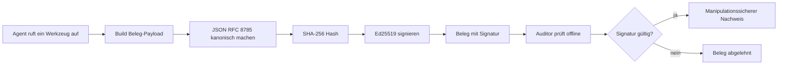
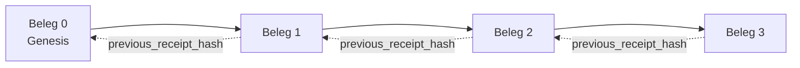

[Sehen Sie sich das Lektion-Video an: Sichern von KI-Agenten mit kryptografischen Belegen](https://youtu.be/PLACEHOLDER_VIDEO_ID)

> _(Lektionsvideo und Miniaturansicht werden vom Microsoft Content-Team nach dem Zusammenführen ergänzt, entsprechend dem Muster der Lektion 14 / 15.)_

# Sichern von KI-Agenten mit kryptografischen Belegen

## Einführung

Diese Lektion behandelt:

- Warum Prüfpfade für KI-Agenten für Compliance, Debugging und Vertrauen wichtig sind.
- Was ein kryptografischer Beleg ist und wie er sich von einer ungezeichneten Protokollzeile unterscheidet.
- Wie man in einfachem Python einen signierten Beleg für den Werkzeugaufruf eines Agenten erzeugt.
- Wie man einen Beleg offline überprüft und Manipulationen erkennt.
- Wie man Belege verknüpft, sodass das Entfernen oder Umordnen eines Belegs die Kette zerstört.
- Was Belege beweisen und was sie ausdrücklich nicht beweisen.

## Lernziele

Nach Abschluss dieser Lektion wissen Sie, wie Sie:

- Die Fehlerursachen erkennen, die eine kryptografische Nachverfolgbarkeit von Agentenaktionen motivieren.
- Einen Ed25519-signierten Beleg über eine kanonische JSON-Nutzlast erstellen.
- Einen Beleg eigenständig mit nur dem öffentlichen Schlüssel des Unterzeichners verifizieren.
- Manipulation erkennen, indem die Verifikation eines modifizierten Belegs erneut ausgeführt wird.
- Eine hash-verkettete Folge von Belegen erstellen und erklären, warum die Kette wichtig ist.
- Die Grenze erkennen zwischen dem, was Belege beweisen (Zuschreibung, Integrität, Reihenfolge) und was sie nicht beweisen (Korrektheit der Aktion, Korrektheit der Richtlinie).

## Das Problem: Der Prüfpfad Ihres Agenten

Stellen Sie sich vor, Sie haben einen KI-Agenten für Contoso Travel bereitgestellt. Der Agent liest Kundenanfragen, ruft eine Flug-API auf, um Optionen zu prüfen, und bucht Sitzplätze im Namen des Kunden. Im letzten Quartal hat der Agent 50.000 Buchungen verarbeitet.

Heute kommt ein Prüfer. Er stellt eine einfache Frage: „Zeigen Sie mir, was Ihr Agent gemacht hat.“

Sie übergeben Ihre Protokolldateien. Der Prüfer schaut sie sich an und stellt die schwerere Frage: „Woher weiß ich, dass diese Protokolle nicht bearbeitet wurden?“

Dies ist das Problem des Prüfpfads. Die meisten Agenteneinsätze heute vertrauen auf:

- **Anwendungsprotokolle**: vom Agenten selbst geschrieben, von jedem mit Dateisystemzugriff änderbar.
- **Cloud-Protokollierungsdienste**: manipulationssicher auf Plattformebene, aber nur, wenn der Prüfer dem Plattformbetreiber vertraut.
- **Datenbank-Transaktionsprotokolle**: gut geeignet für Datenbankänderungen, aber nicht für beliebige Werkzeugaufrufe.

Keiner dieser Ansätze kann die Frage des Prüfers beantworten, ohne dass der Prüfer jemandem vertrauen muss (Ihnen, Ihrem Cloud-Anbieter, Ihrem Datenbankanbieter). Für den internen Gebrauch ist dieses Vertrauen oft akzeptabel. Für regulierte Arbeitslasten (Finanzen, Gesundheitswesen, alles unter der EU-AI-Verordnung) ist es das nicht.

Kryptografische Belege lösen dieses Problem, indem jede Agentenaktion unabhängig verifizierbar gemacht wird. Der Prüfer muss Ihnen nicht vertrauen. Er benötigt nur Ihren öffentlichen Schlüssel und den Beleg selbst.

## Was ist ein kryptografischer Beleg?

Ein Beleg ist ein JSON-Objekt, das dokumentiert, was ein Agent getan hat, und digital signiert ist.


  
Ein minimaler Beleg sieht so aus:

```json
{
  "type": "agent.tool_call.v1",
  "agent_id": "contoso-travel-bot",
  "tool_name": "lookup_flights",
  "tool_args_hash": "sha256:a3f9c1...",
  "result_hash": "sha256:7b2e1d...",
  "policy_id": "contoso-travel-policy-v3",
  "timestamp": "2026-04-25T14:30:00Z",
  "sequence": 47,
  "previous_receipt_hash": "sha256:9d4e6a...",
  "signature": {
    "alg": "EdDSA",
    "sig": "c5af83...",
    "public_key": "8f3b2c..."
  }
}
```
  
Drei Eigenschaften leisten die Arbeit:

1. **Die Signatur**. Der Beleg wird vom Gateway des Agenten mit einem Ed25519-Privatschlüssel signiert. Jeder mit dem entsprechenden öffentlichen Schlüssel kann die Signatur offline verifizieren. Eine Manipulation an irgendeinem Feld macht die Signatur ungültig.

2. **Kanonische Codierung**. Vor der Signierung wird der Beleg mit dem JSON Canonicalization Scheme (JCS, RFC 8785) serialisiert. Das stellt sicher, dass zwei Implementierungen, die denselben logischen Beleg erzeugen, exakt identische Bytes ausgeben. Ohne Kanonisierung würden verschiedene JSON-Serializer unterschiedliche Signaturen für den gleichen Inhalt erzeugen.

3. **Hash-Verkettung**. Das Feld `previous_receipt_hash` verknüpft jeden Beleg mit dem vorherigen. Das Entfernen oder Umordnen eines Belegs zerstört alle nachfolgenden Belege. Manipulationen werden auf Kettenebene sichtbar, auch wenn einzelne Signaturen umgangen werden.

Gemeinsam bieten diese Eigenschaften drei Garantien:

- **Zuschreibung**: Dieser Schlüssel hat diesen Inhalt signiert.
- **Integrität**: Der Inhalt wurde seit der Signierung nicht verändert.
- **Reihenfolge**: Dieser Beleg folgte in der Kette auf jenen Beleg.

## Einen Beleg in Python erzeugen

Sie benötigen keine spezielle Bibliothek, um einen Beleg zu erzeugen. Die kryptografischen Grundbausteine sind weit verbreitet, und die Logik umfasst nur wenige Dutzend Zeilen Python.

Die praktischen Übungen in `code_samples/18-signed-receipts.ipynb` führen Sie durch den kompletten Ablauf. Hier die Zusammenfassung:

```python
import json
import hashlib
import base64
from nacl import signing
from jcs import canonicalize  # RFC 8785 kanonisches JSON

def b64url_nopad(data: bytes) -> str:
    return base64.urlsafe_b64encode(data).decode("ascii").rstrip("=")

def sha256_canonical(obj) -> str:
    """SHA-256 of a Python object's JCS-canonical JSON form."""
    return f"sha256:{hashlib.sha256(canonicalize(obj)).hexdigest()}"

# Erzeuge oder lade einen Signaturschlüssel (im Produktivbetrieb in einem Schlüsselspeicher ablegen)
signing_key = signing.SigningKey.generate()
verify_key = signing_key.verify_key

# Baue die Beleg-Nutzlast auf (noch keine Signatur)
tool_args = {"origin": "SYD", "destination": "LAX"}
tool_result = [{"flight": "QF11", "price": 1850, "stops": 0}]

payload = {
    "type": "agent.tool_call.v1",
    "agent_id": "contoso-travel-bot",
    "tool_name": "lookup_flights",
    "tool_args_hash": sha256_canonical(tool_args),
    "result_hash": sha256_canonical(tool_result),
    "policy_id": "contoso-travel-policy-v3",
    "timestamp": "2026-04-25T14:30:00Z",
    "sequence": 0,
    "previous_receipt_hash": None,
}

# Kanonisiere, hashe, signiere.
canonical_bytes = canonicalize(payload)
message_hash = hashlib.sha256(canonical_bytes).digest()
signature_bytes = signing_key.sign(message_hash).signature

# Füge ein strukturiertes Signaturobjekt hinzu.
receipt = {
    **payload,
    "signature": {
        "alg": "EdDSA",
        "sig": b64url_nopad(signature_bytes),
        "public_key": b64url_nopad(bytes(verify_key)),
    },
}
```
  
Das ist die gesamte Signier-Pipeline. Die Übungen im Notebook erläutern jeden Schritt im Detail.

## Einen Beleg verifizieren und Manipulation erkennen

Die Verifizierung ist die Umkehroperation:

```python
import base64
import hashlib
from nacl import signing
from nacl.exceptions import BadSignatureError
from jcs import canonicalize

def b64url_decode(s: str) -> bytes:
    padding = "=" * ((4 - len(s) % 4) % 4)
    return base64.urlsafe_b64decode(s + padding)

def verify_receipt(receipt: dict) -> bool:
    # Die Signatur ist ein strukturiertes Objekt: {"alg", "sig", "public_key"}.
    sig_obj = receipt.get("signature")
    if not sig_obj or sig_obj.get("alg") != "EdDSA":
        return False

    # Rekonstruieren Sie die tatsächlich signierte Nutzlast (alles außer der Signatur).
    payload = {k: v for k, v in receipt.items() if k != "signature"}

    canonical_bytes = canonicalize(payload)
    message_hash = hashlib.sha256(canonical_bytes).digest()

    try:
        verify_key = signing.VerifyKey(b64url_decode(sig_obj["public_key"]))
        verify_key.verify(message_hash, b64url_decode(sig_obj["sig"]))
        return True
    except BadSignatureError:
        return False
```
  
Diese Funktion nimmt einen Beleg entgegen und liefert `True` zurück, wenn die Signatur gültig ist, sonst `False`. Kein Netzwerkaufruf, keine Dienstabhängigkeit, kein Vertrauen in Dritte erforderlich.

Um die Manipulationserkennung in Aktion zu sehen, zeigt das Notebook:

1. Erzeugen eines gültigen Belegs und Bestätigung, dass er verifiziert wird.
2. Änderung eines Bytes im Feld `tool_args_hash`.
3. Erneute Verifizierung und Beobachtung des Scheiterns.

Das ist der praktische Beweis, dass Belege manipulationssicher sind: jede noch so kleine Änderung zerstört die Signatur.

## Verketten von Belegen für Mehrschritt-Agenten

Ein einzelner signierter Beleg schützt eine Aktion. Eine Kette von Belegen schützt eine Abfolge.


  
Jeder Beleg speichert den Hash des vorherigen Belegs. Um Beleg 2 heimlich zu löschen, müsste ein Angreifer entweder:

- Das Feld `previous_receipt_hash` von Beleg 3 ändern (dann ist die Signatur von Beleg 3 ungültig), ODER
- Eine neue Signatur für einen modifizierten Beleg 3 fälschen (setzt den privaten Schlüssel des Agenten voraus).

Wenn der private Schlüssel in einem Hardware-Schlüsseltresor liegt und Sie den öffentlichen Schlüssel mit jedem Beleg veröffentlichen, ist keiner dieser Angriffe machbar, ohne entdeckt zu werden.

Das Notebook erläutert:

1. Aufbau einer Kette aus drei Belegen.
2. Verifizierung, dass das `previous_receipt_hash` jedes Belegs mit dem tatsächlichen Hash des vorherigen Belegs übereinstimmt.
3. Manipulation eines Belegs in der Mitte der Kette und Beobachtung, wie die Kette genau an dieser Stelle bricht.

So erzeugen Sie einen Prüfpfad, den ein externer Prüfer ohne Ihr Vertrauen verifizieren kann.

## Was Belege beweisen (und was nicht)

Dies ist der wichtigste Abschnitt dieser Lektion. Belege sind mächtig, aber ihre Macht ist begrenzt.

**Belege beweisen drei Dinge:**

1. **Zuschreibung**: Ein bestimmter Schlüssel hat eine bestimmte Nutzlast signiert.
2. **Integrität**: Die Nutzlast hat sich seit der Signierung nicht geändert.
3. **Reihenfolge**: Dieser Beleg folgte in der Hash-Kette auf jenen Beleg.

**Belege BEWEISEN NICHT:**

1. **Korrektheit**: Dass die Aktion des Agenten die richtige war. Ein Beleg kann für eine falsche wie für eine richtige Antwort gleichermaßen sauber signiert werden.
2. **Einhaltung der Richtlinie**: Dass die im Feld `policy_id` referenzierte Richtlinie tatsächlich ausgewertet wurde oder dass sie diese Aktion erlaubt hätte, wenn geprüft. Der Beleg zeichnet auf, was behauptet wurde, nicht was durchgesetzt wurde.
3. **Identität über den Schlüssel hinaus**: Der Beleg sagt „dieser Schlüssel hat diesen Inhalt signiert“. Er sagt nicht „diese Person hat das genehmigt“. Um einen Schlüssel mit einer Person oder Organisation zu verbinden, ist eine separate Identitätsinfrastruktur erforderlich (ein Verzeichnis, ein öffentlicher Schlüsselregister usw.).
4. **Wahrhaftigkeit der Eingaben**: Wenn der Agent eine manipulierte Eingabe erhält und darauf reagiert, zeichnet der Beleg die Aktion korrekt auf. Belege sind nachgelagert zur Eingabevalidierung, kein Ersatz.

Diese Grenze ist aus zwei Gründen wichtig:

- Sie zeigt, wofür Belege nützlich sind: Agentenverhalten prüfbar und manipulationssicher zu machen, auch organisationenübergreifend.
- Sie zeigt, welche weiteren Schichten noch nötig sind: Eingabevalidierung (Lektion 6), Richtliniendurchsetzung (unten kurz behandelt) und Identitätsinfrastruktur (nicht Gegenstand dieser Lektion).

Ein verbreiteter Fehler ist anzunehmen, „wir haben Belege“ bedeute „wir sind reguliert“. Das stimmt nicht. Belege sind eine Grundlage. Governance ist das System, das Sie darauf aufbauen.

## Produktionsreferenzen

Der Python-Code in dieser Lektion ist bewusst minimal gehalten, damit Sie jede Zeile lesen und genau verstehen können, was passiert. Für den produktiven Einsatz haben Sie zwei Optionen:

1. **Direkt auf kryptografischen Grundbausteinen aufbauen.** Die 50 Zeilen oben reichen für viele Anwendungsfälle aus. PyNaCl (Ed25519) und das `jcs`-Paket (kanonisches JSON) sind gut gepflegte und geprüfte Bibliotheken.

2. **Eine Produktionsbibliothek für Belege verwenden.** Verschiedene Open-Source-Projekte implementieren dieses Muster mit zusätzlichen Funktionen (Schlüsselrotation, Batch-Verifikation, JWK-Set-Verteilung, Integration mit Policy-Engines):
   - Das in dieser Lektion verwendete Belegformat folgt einem IETF Internet-Draft (`draft-farley-acta-signed-receipts`), der derzeit im Standardisierungsprozess ist.
   - Das Microsoft Agent Governance Toolkit kombiniert Belege mit Cedar-basierten Richtlinienentscheidungen; siehe Tutorial 33 in diesem Repository für ein End-to-End-Beispiel.
   - Die Pakete `protect-mcp` (npm) und `@veritasacta/verify` (npm) bieten eine Node-basierte Implementierung von Belegsignierung und Offline-Verifikation, gedacht zum Einbetten eines manipulationssicheren Prüfpfads in jeden MCP-Server.

Die Entscheidung zwischen Eigenentwicklung und Bibliotheksnutzung spiegelt die Wahl wider, ob man eine eigene JWT-Bibliothek schreibt oder eine getestete verwendet: Beides ist vertretbar; Bibliotheken sparen Zeit und reduzieren die Prüfoberfläche; der Eigenbau erfordert das Verständnis jeder primitive. Diese Lektion vermittelt den Eigenbauweg, damit Sie die Grundlage für beide Optionen haben.

## Wissensüberprüfung

Testen Sie Ihr Verständnis vor der Praxisübung.

**1. Ein Beleg wird mit dem privaten Ed25519-Schlüssel des Agenten signiert. Der Prüfer hat nur den öffentlichen Schlüssel. Kann der Prüfer den Beleg offline verifizieren?**

<details>
<summary>Antwort</summary>

Ja. Die Ed25519-Verifikation benötigt nur den öffentlichen Schlüssel und die signierten Bytes. Kein Netzwerkaufruf, keine Dienstabhängigkeit. Dies ist die Eigenschaft, die Belege nützlich in luftgetrennten, multi-organisationalen oder vertrauensarmen Prüfumgebungen macht.
</details>

**2. Ein Angreifer ändert das Feld `policy_id` eines Belegs, um zu behaupten, es sei eine permissivere Richtlinie angewandt worden. Die Signatur wurde über die ursprüngliche Nutzlast erzeugt. Was passiert bei der Verifikation?**

<details>
<summary>Antwort</summary>

Die Verifikation schlägt fehl. Die Signatur wurde über die kanonischen Bytes der ursprünglichen Nutzlast berechnet; jede Feldänderung verändert die kanonischen Bytes, ändert den SHA-256-Hash und macht die Signatur ungültig. Der Angreifer bräuchte den privaten Schlüssel, um eine neue gültige Signatur zu erzeugen, die er nicht hat.
</details>

**3. Warum enthält der Beleg einen `tool_args_hash` und `result_hash` statt der rohen Argumente und Ergebnisse?**

<details>
<summary>Antwort</summary>

Zwei Gründe. Erstens kann der Beleg archiviert oder in Umgebungen übertragen werden, in denen die Offenlegung des rohen Inhalts (personenbezogene Daten, Geschäftsdaten) ein Problem darstellt. Hashing hält den Beleg klein und den Inhalt privat; der Prüfer verifiziert, dass der Hash mit einer separat gespeicherten Kopie des tatsächlichen Inhalts übereinstimmt. Zweitens haben Hashes eine feste Größe; ein Beleg mit Hashes hat eine begrenzte Größe, unabhängig davon, wie groß Eingaben und Ausgaben waren.
</details>

**4. Das Feld `previous_receipt_hash` verknüpft jeden Beleg mit seinem Vorgänger. Wenn ein Angreifer einen Beleg mittendrin in der Kette heimlich löscht, was wird ungültig?**

<details>
<summary>Antwort</summary>

Jeder Beleg nach dem gelöschten. Ihre `previous_receipt_hash`-Felder stimmen nicht mehr mit der tatsächlichen Kette überein (weil der referenzierte Beleg nicht mehr existiert oder die Kette jetzt auf einen anderen Vorgänger zeigt). Um die Löschung zu verbergen, müsste der Angreifer alle späteren Belege erneut signieren, was den privaten Schlüssel voraussetzt.
</details>

**5. Ein Beleg wird einwandfrei verifiziert. Beweist das, dass die Aktion des Agenten korrekt, fundiert oder richtlinienkonform war?**

<details>
<summary>Antwort</summary>

Nein. Ein gültiger Beleg beweist drei Dinge: Zuschreibung (dieser Schlüssel signierte diesen Inhalt), Integrität (der Inhalt hat sich nicht geändert) und Reihenfolge (dieser Beleg folgte auf jenen in der Kette). Er beweist NICHT, dass die Aktion korrekt war, dass die in `policy_id` genannte Richtlinie tatsächlich geprüft wurde oder dass der Agent alle Regeln befolgt hat. Belege machen Agentenverhalten prüfbar, nicht unbedingt korrekt. Dies ist die wichtigste Grenze der Lektion.
</details>

## Praxisübung

Öffnen Sie `code_samples/18-signed-receipts.ipynb` und bearbeiten Sie alle vier Abschnitte:

1. **Abschnitt 1**: Signieren Sie Ihren ersten Beleg und verifizieren Sie ihn.
2. **Abschnitt 2**: Manipulieren Sie den Beleg und beobachten Sie, wie die Verifikation fehlschlägt.
3. **Abschnitt 3**: Bauen Sie eine Kette aus drei Belegen und verifizieren Sie die Integrität der Kette.
4. **Abschnitt 4**: Wenden Sie das Muster auf einen mit dem Microsoft Agent Framework gebauten Agenten an: Verpacken Sie einen Werkzeugaufruf im Signieren von Belegen und verifizieren Sie diese anschließend unabhängig.

**Stretch-Challenge 1:** Erweitern Sie das Belegschema um ein weiteres von Ihnen gewähltes Feld (z. B. eine Anfrage-ID zum Nachverfolgen), aktualisieren Sie die kanonische Signierlogik, um es einzubeziehen, und bestätigen Sie, dass der Beleg weiterhin durch die Verifikation kommt. Ändern Sie dann das Feld nach der Signatur und bestätigen Sie, dass die Verifikation fehlschlägt. So verstehen Sie, wie jedes Byte der kanonischen Codierung zur Signatur beiträgt.
**Stretch-Herausforderung 2:** Erzeugen Sie einen SHA-256-Hash aus zwei Ihrer Belege (indem Sie deren kanonische Bytes in einer deterministischen Reihenfolge zusammenfügen) und betten Sie den resultierenden Digest als neues Feld in einen dritten Beleg ein, bevor Sie ihn signieren. Verifizieren Sie, dass alle drei Belege weiterhin rundlaufen. Sie haben gerade einen einstufigen Einbeweis gebaut: Jeder, der den dritten Beleg besitzt, kann beweisen, dass die ersten beiden zum Zeitpunkt der Signierung existierten, ohne deren Inhalte offenlegen zu müssen. Dies ist das Muster, das selektiv-offenlegende Belege in großem Maßstab verwenden (Merkle-Verpflichtungen, RFC 6962).

## Fazit

Kryptografische Belege geben KI-Agenten eine Prüfspur, die:

- **Unabhängig verifizierbar** ist: Jede Partei mit dem öffentlichen Schlüssel kann verifizieren, keine Dienstabhängigkeit.
- **Manipulationserkennend** ist: Jede Änderung macht die Signatur ungültig.
- **Tragbar** ist: Ein Beleg ist eine kleine JSON-Datei; er kann archiviert, übertragen und überall verifiziert werden.
- **Standards-konform** ist: basierend auf Ed25519 (RFC 8032), JCS (RFC 8785) und SHA-256, alles weit verbreitete Primitiven.

Sie sind kein Ersatz für Eingabevalidierung, Durchsetzung von Richtlinien oder Identitätsinfrastruktur. Sie sind die Grundlage für diese Ebenen. Wenn Sie Agenten in regulierten Workloads, Multi-Organisations-Workflows oder jeder Umgebung einsetzen, in der ein zukünftiger Prüfer Ihnen nicht automatisch vertraut, sind Belege die Art, wie Sie die Prüfspur ehrlich machen.

Die wichtigste Erkenntnis: Belege beweisen, wer was wann gesagt hat. Sie beweisen nicht, dass das Gesagte wahr oder richtig war. Diese Unterscheidung ist wesentlich. Es ist der Unterschied zwischen einem ehrlichen Herkunftssystem und einem irreführenden.

## Produktions-Checkliste

Wenn Sie bereit sind, von dieser Lektion zur Bereitstellung von belegsignierten Agenten in einer realen Umgebung überzugehen:

- [ ] **Verschieben Sie den Signierschlüssel vom Entwickler-Laptop.** Nutzen Sie Azure Key Vault, AWS KMS oder ein Hardware-Sicherheitsmodul. Der private Schlüssel, der Ihre Belege signiert, darf niemals im Quellcode oder im Klartext auf Anwendungsmaschinen gespeichert sein.
- [ ] **Veröffentlichen Sie den Verifikations-Public-Key.** Prüfer benötigen ihn für Offline-Überprüfung. Das Standardmuster ist ein JWK Set an einer bekannten URL (RFC 7517), z. B. `https://your-org.example.com/.well-known/agent-keys.json`.
- [ ] **Verankern Sie die Kette extern.** Schreiben Sie periodisch den neuesten Kettenkopf-Hash in ein Transparenzlog (Sigstore Rekor, RFC 3161 Timestamp Authority oder ein zweites internes System), sodass eine externe Partei bestätigen kann "diese Kette existierte zu diesem Zeitpunkt."
- [ ] **Speichern Sie Belege unveränderlich.** Anhängfähiger Blob-Speicher (Azure Storage mit Unveränderlichkeitsrichtlinien, AWS S3 Object Lock) verhindert, dass Insider die Historie auf der Speicher-Ebene umschreiben.
- [ ] **Entscheiden Sie Über Aufbewahrungsfristen.** Viele Compliance-Vorschriften verlangen mehrjährige Aufbewahrung. Planen Sie das Wachstum der Belege ein (jeder Beleg ist ~500 Bytes; ein Agent, der 10.000 Aufrufe pro Tag macht, produziert ca. 1,8 GB pro Jahr).
- [ ] **Dokumentieren Sie, was Belege nicht abdecken.** Belege beweisen Zuordnung, Integrität und Reihenfolge. Ihr Runbook sollte explizit auflisten, welche zusätzlichen Kontrollen (Eingabevalidierung, Richtliniendurchsetzung, Ratenbegrenzung, Identitätsinfrastruktur) neben Belegen in Ihrer Governance-Position liegen.

### Haben Sie weitere Fragen zur Absicherung von KI-Agenten?

Treten Sie dem [Microsoft Foundry Discord](https://aka.ms/ai-agents/discord) bei, um andere Lernende zu treffen, an Sprechstunden teilzunehmen und Ihre Fragen zu KI-Agenten zu klären.

## Über diese Lektion hinaus

Diese Lektion behandelt die Signierung einzelner Belege und hash-verkettete Sequenzen. Dieselben Primitiven ergeben mehrere weiterführende Muster, denen Sie begegnen könnten, wenn Ihre Governance-Reife steigt:

- **Selektive Offenlegung.** Wenn die Felder eines Belegs unabhängig verpflichtet sind (RFC 6962-artiger Merkle-Baum), können Sie spezifische Felder spezifischen Prüfern offenlegen und beweisen, dass der Rest unverändert ist, ohne ihn preiszugeben. Nützlich, wenn derselbe Beleg sowohl eine umfassende Prüfung (mit Vollständigkeit) als auch datenschutzrechtliche Vorschriften wie GDPR (wenig Einsicht durch Prüfer) erfüllen muss.
- **Belegwiderruf.** Wenn ein Signierschlüssel kompromittiert wird, benötigen Sie eine Möglichkeit, alle ab diesem Zeitpunkt mit diesem Schlüssel signierten Belege als nicht vertrauenswürdig zu kennzeichnen. Standardmuster: kurzlebige Signierschlüssel plus veröffentlichte Sperrliste oder ein Transparenzlog mit Sperreinträgen.
- **Bilateral / Geteilte Signatur-Belege.** Einige Implementierungen teilen die signierte Nutzlast in vor-Ausführungs- (`authorization_*`) und nach-Ausführungs- (`result_*`) Hälften mit unabhängigen Signaturen auf, nützlich wenn Autorisierungsentscheidungen und beobachtete Ergebnisse von unterschiedlichen Akteuren oder zu unterschiedlichen Zeiten stammen. Dies baut additiv auf dem in dieser Lektion gelehrten Belegformat auf.
- **Zusammensetzung der Nutzlast.** Ein Beleg versiegelt die Bytes in `result_hash`. Reale Nutzlasten sind oft detaillierter als ein einziges Werkzeugaufruf-Ergebnis: Vorentscheidungs-Argumente (Modellvorhersage, berücksichtigte Optionen, Beweise und deren Vollständigkeit, Risikoposition, Verantwortlichkeitskette, Ausgang des Gateways) können alle in der Nutzlast leben, versiegelt von einem einzigen Beleg. So bleibt das Belegformat minimal, während die Schemas der Nutzlast fachspezifisch weiterentwickelt werden.
- **Konzernübergreifende Übereinstimmung.** Mehrere unabhängige Implementierungen desselben Belegformats (Python, TypeScript, Rust, Go) verifizieren sich gegenseitig anhand gemeinsamer Testvektoren. Wenn Sie Ihre eigene Implementierung bauen, bestätigt die Validierung gegen veröffentlichte Vektoren die Kompatibilität.
- **Migration zu Post-Quantum.** Ed25519 ist heute weit verbreitet, aber nicht quantensicher. Das Belegformat ist algorithmus-flexibel: Das Feld `signature.alg` kann `ML-DSA-65` (der NIST Post-Quantum-Signaturstandard) tragen, wenn Sie migrieren müssen. Planen Sie eine Übergangsphase ein, in der Belege doppelt signiert sind.

## Weiterführende Ressourcen

- <a href="https://datatracker.ietf.org/doc/draft-farley-acta-signed-receipts/" target="_blank">IETF Internet-Draft: Signed Decision Receipts for Machine-to-Machine Access Control</a>
- <a href="https://learn.microsoft.com/azure/ai-studio/responsible-use-of-ai-overview" target="_blank">Verantwortungsbewusster Umgang mit KI (Azure AI)</a>
- <a href="https://datatracker.ietf.org/doc/html/rfc8032" target="_blank">RFC 8032: Edwards-Curve Digital Signature Algorithm (EdDSA)</a>
- <a href="https://datatracker.ietf.org/doc/html/rfc8785" target="_blank">RFC 8785: JSON Canonicalization Scheme (JCS)</a>
- <a href="https://datatracker.ietf.org/doc/html/rfc6962" target="_blank">RFC 6962: Certificate Transparency</a> (Merkle-Baum-Konstruktion, verwendet von selektiv-offenlegenden Belegen)
- <a href="https://github.com/microsoft/agent-governance-toolkit/blob/main/docs/tutorials/33-offline-verifiable-receipts.md" target="_blank">Microsoft Agent Governance Toolkit, Tutorial 33: Offline-verifizierbare Entscheidungsbelege</a>
- <a href="https://github.com/ScopeBlind/agent-governance-testvectors" target="_blank">Konzernübergreifende Übereinstimmungs-Testvektoren</a> für das in dieser Lektion verwendete Belegformat (Apache-2.0)
- <a href="https://pynacl.readthedocs.io/" target="_blank">PyNaCl Dokumentation</a> (Ed25519 in Python)

## Vorherige Lektion

[Computer Use Agents (CUA) bauen](../15-browser-use/README.md)

## Nächste Lektion

_(Noch festzulegen durch Curriculum-Betreuer)_

---

<!-- CO-OP TRANSLATOR DISCLAIMER START -->
**Haftungsausschluss**:
Dieses Dokument wurde mit dem KI-Übersetzungsdienst [Co-op Translator](https://github.com/Azure/co-op-translator) übersetzt. Obwohl wir uns um Genauigkeit bemühen, beachten Sie bitte, dass automatisierte Übersetzungen Fehler oder Ungenauigkeiten enthalten können. Das Originaldokument in seiner Ursprungssprache gilt als maßgebliche Quelle. Bei kritischen Informationen wird eine professionelle menschliche Übersetzung empfohlen. Wir übernehmen keine Haftung für Missverständnisse oder Fehlinterpretationen, die aus der Verwendung dieser Übersetzung entstehen.
<!-- CO-OP TRANSLATOR DISCLAIMER END -->