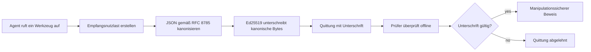
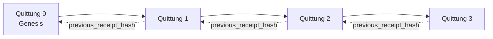

[Sehen Sie sich das Unterrichtsvideo an: Sicherung von KI-Agenten mit kryptografischen Belegen](https://youtu.be/PLACEHOLDER_VIDEO_ID)

> _(Unterrichtsvideo und Thumbnail werden vom Microsoft-Inhaltsteam nach dem Merge hinzugefügt, entsprechend dem Muster für Lektion 14 / 15.)_

# Sicherung von KI-Agenten mit kryptografischen Belegen

## Einführung

Diese Lektion behandelt:

- Warum Prüfnachweise für KI-Agenten wichtig sind für Compliance, Debugging und Vertrauen.
- Was ein kryptografischer Beleg ist und wie er sich von einer unsignierten Protokollzeile unterscheidet.
- Wie man einen signierten Beleg für einen Tool-Aufruf eines Agenten in reinem Python erzeugt.
- Wie man einen Beleg offline überprüft und Manipulationen erkennt.
- Wie man Belege verkettet, sodass das Entfernen oder Umordnen eines Belegs die Kette bricht.
- Was Belege beweisen und was sie ausdrücklich nicht beweisen.

## Lernziele

Nach Abschluss dieser Lektion werden Sie wissen, wie man:

- Fehlerfälle erkennt, die eine kryptografische Herkunftsnachweisführung für Agentenaktionen motivieren.
- Einen Ed25519-signierten Beleg über eine kanonische JSON-Nutzlast erzeugt.
- Einen Beleg unabhängig nur mit dem öffentlichen Schlüssel des Unterzeichners verifiziert.
- Manipulationen erkennt, indem die Verifikation eines veränderten Belegs erneut durchgeführt wird.
- Eine hash-verkettete Folge von Belegen erstellt und erklärt, warum die Kette wichtig ist.
- Die Grenze erkennt zwischen dem, was Belege beweisen (Zuordnung, Integrität, Reihenfolge) und was sie nicht beweisen (Korrektheit der Aktion, Stichhaltigkeit der Richtlinie).

## Das Problem: Die Prüfspur Ihres Agenten

Stellen Sie sich vor, Sie haben einen KI-Agenten für Contoso Travel eingesetzt. Der Agent liest Kundenanfragen, ruft eine Flug-API auf, um Optionen zu suchen, und bucht im Namen des Kunden Sitze. Im letzten Quartal hat der Agent 50.000 Buchungen verarbeitet.

Heute kommt ein Prüfer. Er stellt eine einfache Frage: "Zeigen Sie mir, was Ihr Agent getan hat."

Sie übergeben Ihre Protokolldateien. Der Prüfer sieht sie sich an und stellt die schwierigere Frage: "Woher weiß ich, dass diese Protokolle nicht bearbeitet wurden?"

Dies ist das Problem der Prüfspur. Die meisten Agenteneinsätze heute basieren auf:

- **Anwendungsprotokolle**: vom Agenten selbst geschrieben, von jedem mit Dateisystemzugriff bearbeitbar.
- **Cloud-Logging-Dienste**: manipulationssicher auf Plattformebene, aber nur wenn der Prüfer dem Plattformbetreiber vertraut.
- **Datenbank-Transaktionsprotokolle**: gut geeignet für Datenbankänderungen, aber nicht für beliebige Tool-Aufrufe.

Keines davon kann die Frage des Prüfers beantworten, ohne dass der Prüfer jemandem vertrauen muss (Ihnen, Ihrem Cloud-Anbieter, Ihrem Datenbankanbieter). Für den internen Gebrauch ist dieses Vertrauen oft akzeptabel. Für regulierte Arbeitslasten (Finanzen, Gesundheitswesen, alles unter dem EU KI-Gesetz) ist es das nicht.

Kryptografische Belege lösen dies, indem jede Agentenaktion einzeln überprüfbar wird. Der Prüfer muss Ihnen nicht vertrauen. Er benötigt nur Ihren öffentlichen Schlüssel und den Beleg selbst.

## Was ist ein kryptografischer Beleg?

Ein Beleg ist ein JSON-Objekt, das aufzeichnet, was ein Agent getan hat, signiert mit einer digitalen Signatur.


```mermaid
flowchart LR
    A[Agent ruft ein Werkzeug auf] --> B[Empfangsnutzlast erstellen]
    B --> C[JSON gemäß RFC 8785 kanonisieren]
    C --> E[Ed25519 unterschreibt kanonische Bytes]
    E --> F[Quittung mit Unterschrift]
    F --> G[Prüfer überprüft offline]
    G --> H{Unterschrift gültig?}
    H -- yes --> I[Manipulationssicherer Beweis]
    H -- no --> J[Quittung abgelehnt]
```

Ein minimaler Beleg sieht so aus:

```json
{
  "type": "agent.tool_call.v1",
  "agent_id": "contoso-travel-bot",
  "tool_name": "lookup_flights",
  "tool_args_hash": "sha256:a3f9c1...",
  "result_hash": "sha256:7b2e1d...",
  "policy_id": "contoso-travel-policy-v3",
  "timestamp": "2026-04-25T14:30:00Z",
  "sequence": 47,
  "previous_receipt_hash": "sha256:9d4e6a...",
  "signature": {
    "alg": "EdDSA",
    "sig": "c5af83...",
    "public_key": "8f3b2c..."
  }
}
```

Drei Eigenschaften sind hier wirksam:

1. **Die Signatur**. Der Beleg wird vom Gateway des Agenten mit einem Ed25519-Private-Key signiert. Jeder mit dem entsprechenden öffentlichen Schlüssel kann die Signatur offline überprüfen. Jegliche Manipulation an einem Feld macht die Signatur ungültig.

2. **Kanonische Kodierung**. Vor dem Signieren wird der Beleg mit dem JSON Canonicalization Scheme (JCS, RFC 8785) serialisiert. Dies stellt sicher, dass zwei Implementierungen, die denselben logischen Beleg erzeugen, ein byte-identisches Ergebnis liefern. Ohne Kanonisierung würden unterschiedliche JSON-Serializer für denselben Inhalt verschiedene Signaturen erzeugen.

3. **Hash-Verkettung**. Das Feld `previous_receipt_hash` verbindet jeden Beleg mit dem vorherigen. Das Entfernen oder Umordnen eines Belegs bricht jeden nachfolgenden Beleg. Manipulationen werden auf Kettenebene sichtbar, selbst wenn einzelne Signaturen umgangen würden.

Zusammen liefern diese Eigenschaften drei Garantien:

- **Zuordnung**: Dieser Schlüssel hat diesen Inhalt signiert.
- **Integrität**: Der Inhalt wurde seit der Signatur nicht verändert.
- **Reihenfolge**: Dieser Beleg folgte auf den angegebenen Beleg in der Kette.

## Einen Beleg in Python erzeugen

Sie benötigen keine spezielle Bibliothek, um einen Beleg zu erzeugen. Die kryptografischen Primitiven sind weit verbreitet und die Logik umfasst nur wenige Dutzend Zeilen Python.

Die praktischen Übungen in `code_samples/18-signed-receipts.ipynb` führen durch den gesamten Ablauf. Die Kurzfassung:

```python
import json
import hashlib
import base64
from nacl import signing
from jcs import canonicalize  # RFC 8785 kanonisches JSON

def b64url_nopad(data: bytes) -> str:
    return base64.urlsafe_b64encode(data).decode("ascii").rstrip("=")

def sha256_canonical(obj) -> str:
    """SHA-256 of a Python object's JCS-canonical JSON form."""
    return f"sha256:{hashlib.sha256(canonicalize(obj)).hexdigest()}"

# Erzeugen oder laden Sie einen Signaturschlüssel (in der Produktion in einem Schlüsseltresor speichern)
signing_key = signing.SigningKey.generate()
verify_key = signing_key.verify_key

# Erstellen Sie die Beleg-Nutzlast (noch keine Signatur)
tool_args = {"origin": "SYD", "destination": "LAX"}
tool_result = [{"flight": "QF11", "price": 1850, "stops": 0}]

payload = {
    "type": "agent.tool_call.v1",
    "agent_id": "contoso-travel-bot",
    "tool_name": "lookup_flights",
    "tool_args_hash": sha256_canonical(tool_args),
    "result_hash": sha256_canonical(tool_result),
    "policy_id": "contoso-travel-policy-v3",
    "timestamp": "2026-04-25T14:30:00Z",
    "sequence": 0,
    "previous_receipt_hash": None,
}

# Kanonicalisieren und signieren Sie die JCS-Bytes direkt. PureEdDSA hasht intern.
canonical_bytes = canonicalize(payload)
signature_bytes = signing_key.sign(canonical_bytes).signature

# Fügen Sie ein strukturiertes Signaturobjekt hinzu.
receipt = {
    **payload,
    "signature": {
        "alg": "EdDSA",
        "sig": b64url_nopad(signature_bytes),
        "public_key": b64url_nopad(bytes(verify_key)),
    },
}
```

Das ist die gesamte Signierungspipeline. Die Übungen im Notebook erläutern jeden Schritt.

## Einen Beleg verifizieren und Manipulationen erkennen

Die Verifikation ist die Umkehrung des Vorgangs:

```python
import base64
import hashlib
from nacl import signing
from nacl.exceptions import BadSignatureError
from jcs import canonicalize

def b64url_decode(s: str) -> bytes:
    padding = "=" * ((4 - len(s) % 4) % 4)
    return base64.urlsafe_b64decode(s + padding)

def verify_receipt(receipt: dict) -> bool:
    # Die Signatur ist ein strukturiertes Objekt: {"alg", "sig", "public_key"}.
    sig_obj = receipt.get("signature")
    if not sig_obj or sig_obj.get("alg") != "EdDSA":
        return False

    # Rekonstruieren Sie die Nutzlast, die tatsächlich signiert wurde (alles außer der Signatur).
    payload = {k: v for k, v in receipt.items() if k != "signature"}

    canonical_bytes = canonicalize(payload)

    try:
        verify_key = signing.VerifyKey(b64url_decode(sig_obj["public_key"]))
        verify_key.verify(canonical_bytes, b64url_decode(sig_obj["sig"]))
        return True
    except BadSignatureError:
        return False
```

Diese Funktion nimmt einen Beleg und gibt `True` zurück, wenn die Signatur gültig ist, andernfalls `False`. Kein Netzwerkaufruf, keine Serviceabhängigkeit, kein Vertrauen in Dritte erforderlich.

Um die Erkennung von Manipulationen in der Praxis zu sehen, zeigt das Notebook:

1. Erzeugung eines gültigen Belegs und Bestätigung, dass die Verifikation funktioniert.
2. Änderung eines Bytes im Feld `tool_args_hash`.
3. Erneutes Durchführen der Verifikation und Beobachtung des Fehlschlags.

Dies ist der praktische Beweis, dass Belege manipulationssicher sind: Jede Änderung, wie klein sie auch sein mag, bricht die Signatur.

## Verkettung von Belegen für mehrstufige Agenten

Ein einzelner signierter Beleg schützt eine Aktion. Eine Kette von Belegen schützt eine Folge von Aktionen.


```mermaid
flowchart LR
    R0[Quittung 0<br/>Genesis] --> R1[Quittung 1]
    R1 --> R2[Quittung 2]
    R2 --> R3[Quittung 3]
    R1 -. previous_receipt_hash .-> R0
    R2 -. previous_receipt_hash .-> R1
    R3 -. previous_receipt_hash .-> R2
```

Jeder Beleg speichert den Hash des vorherigen Belegs. Um Beleg 2 unbemerkt zu entfernen, müsste ein Angreifer entweder:

- Das Feld `previous_receipt_hash` von Beleg 3 ändern (bricht die Signatur von Beleg 3), ODER
- Eine neue Signatur für einen veränderten Beleg 3 fälschen (benötigt den privaten Schlüssel des Agenten).

Befindet sich der Private Key in einem Hardware-Key-Tresor und veröffentlichen Sie den öffentlichen Schlüssel mit jedem Beleg, ist keine dieser Attacken ohne Erkennung machbar.

Das Notebook zeigt:

1. Wie eine Kette von drei Belegen aufgebaut wird.
2. Wie bestätigt wird, dass jeder Beleg mit seinem `previous_receipt_hash` auf den tatsächlichen Hash des vorherigen Belegs verweist.
3. Wie eine Manipulation eines Belegs in der Mitte die Kette an genau dieser Stelle bricht.

So erzeugen Sie eine Prüfspur, die ein externer Prüfer verifizieren kann, ohne Ihnen vertrauen zu müssen.

## Was Belege beweisen (und was nicht)

Dies ist der wichtigste Abschnitt dieser Lektion. Belege sind mächtig, aber ihre Macht ist begrenzt.

**Belege beweisen drei Dinge:**

1. **Zuordnung**: Ein bestimmter Schlüssel hat eine bestimmte Nutzlast signiert.
2. **Integrität**: Die Nutzlast wurde seit der Signatur nicht verändert.
3. **Reihenfolge**: Dieser Beleg folgte auf den angegebenen Beleg in der Hash-Kette.

**Belege beweisen NICHT:**

1. **Korrektheit**: Dass die Aktion des Agenten die richtige war. Ein Beleg kann ebenso sauber für eine falsche Antwort unterzeichnet werden wie für eine richtige.
2. **Richtlinienkonformität**: Dass die im `policy_id` referenzierte Richtlinie tatsächlich ausgewertet wurde oder dass sie diese Aktion erlaubt hätte, wenn überprüft. Der Beleg dokumentiert nur, was behauptet wurde, nicht was durchgesetzt wurde.
3. **Identität über den Schlüssel hinaus**: Der Beleg sagt „Dieser Schlüssel hat diesen Inhalt signiert.“ Er sagt nicht „Dieser Mensch hat das autorisiert.“ Die Verbindung eines Schlüssels mit einer Person oder Organisation erfordert eine separate Identitätsinfrastruktur (Verzeichnis, öffentlicher Schlüssel-Register usw.).
4. **Wahrhaftigkeit der Eingaben**: Wenn der Agent eine manipulierte Eingabe erhält und darauf reagiert, dokumentiert der Beleg die Aktion korrekt. Belege sind nachgelagert zur Eingabeverifizierung, kein Ersatz dafür.

Diese Grenze ist aus zwei Gründen wichtig:

- Sie zeigt, wofür Belege nützlich sind: Um das Verhalten von Agenten prüfbar und manipulationssicher zu machen, auch über Organisationsgrenzen hinweg.
- Sie zeigt, welche zusätzlichen Schichten Sie noch benötigen: Eingabeverifizierung (Lektion 6), Richtliniendurchsetzung (kurz weiter unten behandelt) und Identitätsinfrastruktur (nicht Gegenstand dieser Lektion).

Ein häufiger Fehler ist die Annahme, „wir haben Belege“ bedeutet „wir haben Governance“. Dem ist nicht so. Belege sind die Grundlage. Governance ist das System, das Sie darauf aufbauen.

## Nachweis, dass ein Mensch die genaue Aktion genehmigt hat

Punkt 3 oben verdient einen eigenen Abschnitt: Ein Aktionsbeleg sagt „Dieser Schlüssel hat diesen Inhalt signiert“, niemals „Ein Mensch hat das genehmigt.“ Für risikoreiche Aktionen (Rückerstattungen, Löschungen, Überweisungen) verlangen Governance-Rahmenwerke zunehmend genau diese fehlende Aussage, und sie ist mit denselben Primitiven herstellbar, die Sie in dieser Lektion bereits gebaut haben.

Das Anschluss-Notebook `code_samples/human-authorization-receipts.ipynb` fügt eine zweite Belegart hinzu, `human.approval.v1`, in derselben Umschlagstruktur wie die Belege dieser Lektion (eine typisierte Nutzlast, signiert mit Ed25519 über ihre kanonischen JCS-Bytes, mit dem `signature`-Objekt außerhalb der signierten Bytes). Ein benannter Genehmiger signiert die **vollständige kanonische Aktion und deren Digest** vor der Ausführung; der Aktionsbeleg des Agenten trägt denselben **Aktionsdigest** und eine `parent_approval_ref`, den `receipt_hash` der Genehmigung, dieselbe Konvention wie `previous_receipt_hash` in der oben gebauten Kette. Eine `verify_chain` prüft beide Artefakte unter **getrennten festgelegten Schlüsselregistern** (Genehmiger-Schlüssel vs Agent-Schlüssel), sodass der Code-Pfad geteilt ist, die Autoritäten aber nie.

Die hierdurch gewährte Eigenschaft, sorgfältig formuliert: *Der Mensch hat diese genaue Aktion genehmigt, und der Agent hat genau diese genehmigte Aktion ausgeführt.* Die Weigerungsfälle im Notebook machen die Eigenschaft real statt nur behauptet:

- Die klassische Palette: Manipulation, verwirrter Stellvertreter, Wiederholung, gefälschte Schlüssel auf beiden Seiten, fehlerhafte Eingaben;
- **Veraltete Autorität**: Eine Signatur, die immer noch verifiziert, aber trotzdem abgelehnt wird, weil sich die Richtlinienversion geändert hat, der Genehmigerschlüssel aus dem festgelegten Register entfernt wurde oder die Genehmigung vor Ausführung abgelaufen ist;
- **Digest-Austausch**: Ein gültig signierter Aktionsbeleg, der auf eine *echte* Genehmigung verweist, die eine *andere* kanonische Aktion bindet.

Jeder Fehler wird mit einem eindeutigen Grund abgelehnt, sodass ein Prüfer beim Lesen erkennen kann, ob die Autorität veraltet ist oder die ausgeführte Aktion geändert wurde. Die Regel, die das Notebook lehrt: Eine signierte Genehmigung ist nicht automatisch Autorität. Autorität existiert nur, wenn beide Belege zur Ausführungszeit dieselbe kanonische Aktion binden. Der Human-Approval-Beleg ist eine durch diese Lektion definierte Bildungszusammensetzung, keine von `draft-farley-acta-signed-receipts` definierte Belegart.

## Produktionsreferenzen

Der Python-Code in dieser Lektion ist absichtlich minimal, damit Sie jede Zeile lesen und genau verstehen können, was passiert. Für den produktiven Einsatz haben Sie zwei Optionen:

1. **Direkt auf kryptografischen Primitiven aufbauen.** Die oben gezeigten 50 Zeilen reichen für viele Anwendungsfälle. PyNaCl (Ed25519) und das `jcs`-Paket (kanonisches JSON) sind gut gepflegte und geprüfte Bibliotheken.

2. **Eine produktive Belegbibliothek verwenden.** Verschiedene Open-Source-Projekte implementieren dasselbe Muster mit zusätzlichen Funktionen (Schlüsselrotation, Batch-Verifikation, JWK-Set-Verteilung, Integration mit Richtlinien-Engines):
   - Die Signierungspipeline verwendet die JCS- und Signaturbereich-Konventionen in einem unabhängigen IETF-Internet-Draft ([`draft-farley-acta-signed-receipts`](https://datatracker.ietf.org/doc/draft-farley-acta-signed-receipts/), Revision 02). Der flache, pädagogische Beleg dieser Lektion unterscheidet sich vom Draft-Umschlag `{payload, signature}` und wird nicht als konforme Implementierung präsentiert. Das Draft veröffentlicht eine gemeinsame Konformitätssuite ([agent-governance-testvectors](https://github.com/ScopeBlind/agent-governance-testvectors)) für Implementierungen, die auf dessen Wire-Format abzielen.
   - Das Microsoft Agent Governance Toolkit kombiniert Belege mit Cedar-basierten Richtlinienentscheidungen; siehe Tutorial 33 im Repository für ein Ende-zu-Ende-Beispiel.
   - Die Pakete `protect-mcp` (npm) und `@veritasacta/verify` (npm) bieten eine auf Node basierende Implementierung zur Belegs-Signierung und Offline-Verifikation, gedacht zur Umhüllung jedes MCP-Servers mit manipulationssicherer Prüfspur, einschließlich eines Hold-for-Co-Sign-Flows, bei dem eine pausierte Aktion einen Genehmigungsbeleg mit dem Aktionsdigest ausgibt (WebAuthn-gestützt im Desktop-Flow), dasselbe Genehmigungsbeleg-Muster wie das oben genannte Human-Authorization-Notebook.
   - Das **[nobulex](https://github.com/arian-gogani/nobulex)** Python-SDK (`pip install nobulex`) bietet dasselbe Ed25519 + JCS-Signiermuster in Python mit LangChain- und CrewAI-Integrationen, einschließlich veröffentlichter Cross-Validation-Testvektoren und einer Compliance-Abbildung, beigetragen via [OWASP PR #2210](https://github.com/OWASP/CheatSheetSeries/pull/2210).

Die Entscheidung zwischen Eigenbau und Nutzung einer Bibliothek entspricht der Frage, ob man eine eigene JWT-Bibliothek schreibt oder eine geprüfte verwendet: Beides ist vernünftig; die Bibliothek spart Zeit und reduziert die Prüfoberfläche; der Eigenbau zwingt zum Verständnis jeder primitiven Funktion. Diese Lektion vermittelt den Eigenbau-Weg, damit Sie die Grundlage für beides haben.

## Wissensüberprüfung

Testen Sie Ihr Verständnis, bevor Sie zur Übung übergehen.

**1. Ein Beleg wird mit dem privaten Ed25519-Schlüssel des Agenten signiert. Der Prüfer besitzt nur den öffentlichen Schlüssel. Kann der Prüfer den Beleg offline verifizieren?**

<details>
<summary>Antwort</summary>

Ja. Die Ed25519-Verifikation benötigt nur den öffentlichen Schlüssel und die signierten Bytes. Kein Netzwerkaufruf, keine Serviceabhängigkeit. Diese Eigenschaft macht Belege in abgekoppelten, organisationsübergreifenden oder gering-vertrauenswürdigen Prüfungsszenarien nützlich.
</details>

**2. Ein Angreifer ändert das Feld `policy_id` eines Belegs, um zu behaupten, er sei von einer permissiveren Richtlinie geregelt worden. Die Signatur wurde über die ursprüngliche Nutzlast erzeugt. Was passiert bei der Verifikation?**

<details>
<summary>Antwort</summary>


Die Verifizierung schlägt fehl. Die Signatur wurde über die kanonischen Bytes der ursprünglichen Nutzlast berechnet; jede Änderung eines Feldes ändert diese Bytes, wodurch die Signatur ungültig wird. Der Angreifer bräuchte den privaten Schlüssel, um eine neue gültige Signatur zu erzeugen, den er jedoch nicht besitzt.
</details>

**3. Warum enthält der Beleg einen `tool_args_hash` und `result_hash` anstelle der Rohargumente und des Ergebnisses?**

<details>
<summary>Antwort</summary>

Zwei Gründe. Erstens muss der Beleg möglicherweise in Umgebungen archiviert oder übertragen werden, in denen das Offenlegen des Rohinhalts (personenbezogene Daten, Geschäftsdaten) problematisch ist. Das Hashen hält den Beleg klein und den Inhalt privat; der Prüfer überprüft, ob der Hash mit einer separat gespeicherten Kopie des tatsächlichen Inhalts übereinstimmt. Zweitens haben Hashes eine feste Größe; ein Beleg mit Hashes ist in der Größe begrenzt, unabhängig davon, wie groß die Eingaben und Ausgaben waren.
</details>

**4. Das Feld `previous_receipt_hash` verbindet jeden Beleg mit seinem Vorgänger. Wenn ein Angreifer stillschweigend einen Beleg mitten in einer Kette löscht, was wird dann ungültig?**

<details>
<summary>Antwort</summary>

Jeder Beleg, der nach dem gelöschten kam. Deren `previous_receipt_hash`-Felder stimmen nicht mehr mit der tatsächlichen Kette überein (weil der referenzierte Beleg nicht mehr existiert oder die Kette jetzt auf einen anderen Vorgänger zeigt). Um die Löschung zu verschleiern, müsste der Angreifer jeden späteren Beleg neu signieren, was den privaten Schlüssel erfordert.
</details>

**5. Ein Beleg verifiziert sauber. Beweist das, dass die Aktion des Agenten korrekt, fundiert oder regelkonform war?**

<details>
<summary>Antwort</summary>

Nein. Ein gültiger Beleg beweist drei Dinge: Zuordnung (diesen Schlüssel hat diesen Inhalt signiert), Integrität (der Inhalt wurde nicht geändert) und Reihenfolge (dieser Beleg kam nach jenem Beleg). Er beweist NICHT, dass die Aktion korrekt war, dass die in `policy_id` genannte Richtlinie tatsächlich bewertet wurde oder dass der Agent jede Regel befolgt hat. Belege machen das Verhalten des Agenten prüfbar, nicht unbedingt korrekt. Dies ist die wichtigste Abgrenzung in der Lektion.
</details>

## Übungsaufgabe

Öffnen Sie `code_samples/18-signed-receipts.ipynb` und vervollständigen Sie alle vier Abschnitte:

1. **Abschnitt 1**: Signieren Sie Ihren ersten Beleg und verifizieren Sie ihn.
2. **Abschnitt 2**: Manipulieren Sie den Beleg und beobachten Sie das Scheitern der Verifizierung.
3. **Abschnitt 3**: Erstellen Sie eine Kette aus drei Belegen und verifizieren Sie die Integrität der Kette.
4. **Abschnitt 4**: Wenden Sie das Muster auf einen mit dem Microsoft Agent Framework gebauten Agenten an: Umwickeln Sie einen Tool-Aufruf mit Beleg-Signierung und verifizieren Sie den Beleg anschließend unabhängig.

**Stretch-Challenge 1:** Erweitern Sie das Belegschema um ein zusätzliches Feld Ihrer Wahl (zum Beispiel eine Anfrage-ID zur Nachverfolgung), aktualisieren Sie die kanonische Signierlogik, um es einzubeziehen, und bestätigen Sie, dass der Beleg weiterhin durch Verifizierung durchläuft. Ändern Sie dann das Feld nach dem Signieren und bestätigen Sie, dass die Verifizierung fehlschlägt. Das zwingt Sie zu verstehen, wie jedes Byte der kanonischen Kodierung zur Signatur beiträgt.

**Stretch-Challenge 2:** Hashen Sie zwei Ihrer Belege zusammen mit SHA-256 (konkatenieren Sie deren kanonische Bytes in einer deterministischen Reihenfolge) und betten Sie den resultierenden Digest als neues Feld in einen dritten Beleg ein, bevor Sie ihn signieren. Verifizieren Sie, dass alle drei Belege weiterhin durchlaufen. Sie haben gerade einen Einschlussnachweis in einem Schritt gebaut: Jeder, der den dritten Beleg besitzt, kann beweisen, dass die ersten beiden zum Signierzeitpunkt existierten, ohne deren Inhalte preisgeben zu müssen. Dies ist das Muster, das selektiv-offenlegende Belege im großen Maßstab verwenden (Merkle-Verpflichtungen, RFC 6962).

## Fazit

Kryptografische Belege geben KI-Agenten eine Prüfkette, die:

- **Unabhängig verifizierbar**: jede Partei mit dem öffentlichen Schlüssel kann verifizieren, keine Dienstabhängigkeit.
- **Manipulationssicher**: jede Änderung macht die Signatur ungültig.
- **Portabel**: ein Beleg ist eine kleine JSON-Datei; er kann archiviert, übertragen und überall verifiziert werden.
- **Standardkonform**: basiert auf Ed25519 (RFC 8032), JCS (RFC 8785) und SHA-256, alle weit verbreitete Primitive.

Sie sind kein Ersatz für Eingabevalidierung, Durchsetzung von Richtlinien oder Identitätsinfrastruktur. Sie sind eine Grundlage für diese Schichten. Wenn Sie Agenten in regulierten Workloads, organisationsübergreifenden Workflows oder jeder Umgebung einsetzen, in der ein zukünftiger Prüfer Ihnen nicht vertraut, sorgen Belege dafür, dass die Prüfkette ehrlich bleibt.

Die wichtigste Erkenntnis: Belege beweisen, wer was wann gesagt hat. Sie beweisen nicht, dass das Gesagte wahr oder richtig war. Halten Sie diese Unterscheidung fest. Sie ist der Unterschied zwischen einem ehrlichen und einem irreführenden Herkunftssystem.

## Produktions-Checkliste

Wenn Sie bereit sind, von dieser Lektion zum Einsatz von beleg-signierten Agenten in einer realen Umgebung überzugehen:

- [ ] **Bewegung des Signierschlüssels vom Entwickler-Laptop.** Verwenden Sie Azure Key Vault, AWS KMS oder ein Hardware-Sicherheitsmodul. Der private Schlüssel, der Ihre Belege signiert, darf niemals im Quellcode oder Klartext auf Anwendungssystemen liegen.
- [ ] **Veröffentlichen Sie den Verifikations-Öffentlichen Schlüssel.** Prüfer brauchen ihn für Offline-Verifikation. Das Standardmuster ist ein JWK-Set unter einer bekannten URL (RFC 7517), z.B. `https://your-org.example.com/.well-known/agent-keys.json`.
- [ ] **Verankern Sie die Kette extern.** Schreiben Sie periodisch den Hash des aktuellsten Kettenkopfs in ein Transparenzprotokoll (Sigstore Rekor, RFC 3161 Zeitstempelbehörde oder ein zweites internes System), sodass eine externe Partei bestätigen kann, dass „diese Kette zu diesem Zeitpunkt existierte“.
- [ ] **Speichern Sie Belege unveränderlich.** Append-only-Blob-Speicher (Azure Storage mit Unveränderlichkeitspolitiken, AWS S3 Object Lock) verhindert, dass ein Insider die Historie in der Speicherebene umschreibt.
- [ ] **Planen Sie die Aufbewahrung.** Viele Compliance-Standards verlangen mehrjährige Aufbewahrung. Planen Sie das Wachstum der Belege (jeder Beleg ist ~500 Bytes; ein Agent, der 10.000 Aufrufe pro Tag macht, erzeugt ~1,8 GB pro Jahr).
- [ ] **Dokumentieren Sie, was Belege nicht abdecken.** Belege beweisen Zuordnung, Integrität und Reihenfolge. Ihr Runbook sollte explizit aufführen, welche zusätzlichen Kontrollen (Eingabevalidierung, Richtliniendurchsetzung, Ratenbegrenzung, Identitätsinfrastruktur) neben Belegen Bestandteil Ihrer Governance sind.

### Haben Sie weitere Fragen zur Sicherung von KI-Agenten?

Treten Sie dem [Microsoft Foundry Discord](https://aka.ms/ai-agents/discord) bei, um andere Lernende zu treffen, an Sprechstunden teilzunehmen und Ihre Fragen zu KI-Agenten beantworten zu lassen.

## Über diese Lektion hinaus

Diese Lektion behandelt Einzelsignatur-Belege und hashverkettete Reihenfolgen. Dieselben Primitive setzen sich zu mehreren fortgeschrittenen Mustern zusammen, die Sie möglicherweise kennenlernen, wenn Ihre Governance reift:

- **Selektive Offenlegung.** Wenn die Felder eines Belegs unabhängig verknüpft sind (RFC 6962-ähnlicher Merkle-Baum), können Sie bestimmte Felder ausgewählten Prüfern offenlegen und beweisen, dass die übrigen unverändert sind, ohne sie preiszugeben. Nützlich, wenn derselbe Beleg sowohl für eine umfassende Prüfung (die Vollständigkeit will) als auch für Datenschutzregelungen wie DSGVO (die möchten, dass der Prüfer so wenig wie möglich sieht) geeignet sein muss.
- **Beleg-Widerruf.** Wenn ein Signaturschlüssel kompromittiert wird, brauchen Sie eine Möglichkeit, alle damit signierten Belege ab einem Zeitpunkt als nicht vertrauenswürdig zu kennzeichnen. Standardmuster: kurzlebige Signaturschlüssel plus veröffentlichte Widerrufsliste oder ein Transparenzprotokoll mit Widerrufseinträgen.
- **Zweiseitige / Split-Signatur-Belege.** Einige Implementierungen teilen die signierte Nutzlast in vor-Execution (`authorization_*`) und nach-Execution (`result_*`) Hälften mit unabhängigen Signaturen, nützlich, wenn die Autorisierungsentscheidung und das beobachtete Ergebnis von verschiedenen Akteuren bzw. zu verschiedenen Zeiten kommen. Das baut auf dem in dieser Lektion gelehrten Belegformat aufsummierend auf.
- **Nutzlastkomposition.** Ein Beleg versiegelt beliebige Bytes in `result_hash`. Realwelt-Nutzlasten sind oft reicher als das Ergebnis eines einzelnen Tool-Aufrufs: Vor-Entscheidungsgründe (Modellvorhersage, erwogene Optionen, Beweise und deren Vollständigkeit, Risikoposition, Verantwortlichkeitskette, Tor-Ausgang) können alle in der Nutzlast drin sein, versiegelt durch einen einzelnen Beleg. Das hält das Belegformat minimal und lässt Nutzlastschemata domänenspezifisch evolvieren.
- **Implementierungsübergreifende Konformität.** Mehrere unabhängige Implementierungen desselben Belegformats (Python, TypeScript, Rust, Go) prüfen sich anhand geteilter Test-Vektoren gegenseitig. Wenn Sie eine eigene Implementierung bauen, bestätigt das Validieren gegen veröffentlichte Vektoren die Drahtkompatibilität.
- **Post-Quanten-Migration.** Ed25519 ist heute weit verbreitet, aber nicht quantensicher. Das Belegformat ist algorithmus-flexibel: das Feld `signature.alg` kann `ML-DSA-65` tragen (der NIST-Post-Quanten-Signaturstandard), wenn Sie migrieren müssen. Planen Sie eine Übergangszeit mit doppelt signierten Belegen ein.

## Zusätzliche Ressourcen

- <a href="https://datatracker.ietf.org/doc/draft-farley-acta-signed-receipts/" target="_blank">IETF Internet-Draft: Signed Decision Receipts for Machine-to-Machine Access Control</a>
- <a href="https://learn.microsoft.com/azure/ai-studio/responsible-use-of-ai-overview" target="_blank">Übersicht zu Responsible AI (Azure AI)</a>
- <a href="https://datatracker.ietf.org/doc/html/rfc8032" target="_blank">RFC 8032: Digitales Signaturalgorithmus für Edwards-Kurven (EdDSA)</a>
- <a href="https://datatracker.ietf.org/doc/html/rfc8785" target="_blank">RFC 8785: JSON Canonicalization Scheme (JCS)</a>
- <a href="https://datatracker.ietf.org/doc/html/rfc6962" target="_blank">RFC 6962: Zertifikatstransparenz</a> (Merkle-Baum-Konstruktion, verwendet von selektiv-offenlegenden Belegen)
- <a href="https://github.com/microsoft/agent-governance-toolkit/blob/main/docs/tutorials/33-offline-verifiable-receipts.md" target="_blank">Microsoft Agent Governance Toolkit, Tutorial 33: Offline-verifizierbare Entscheidungsbelege</a>
- <a href="https://github.com/ScopeBlind/agent-governance-testvectors" target="_blank">Implementierungsübergreifende Test-Vektoren</a> für das in dieser Lektion verwendete Belegformat (Apache-2.0)
- <a href="https://pynacl.readthedocs.io/" target="_blank">PyNaCl-Dokumentation</a> (Ed25519 in Python)

## Vorherige Lektion

[Lokale KI-Agenten erstellen](../17-creating-local-ai-agents/README.md)

---

<!-- CO-OP TRANSLATOR DISCLAIMER START -->
**Haftungsausschluss**:
Dieses Dokument wurde mit dem KI-Übersetzungsdienst [Co-op Translator](https://github.com/Azure/co-op-translator) übersetzt. Obwohl wir uns um Genauigkeit bemühen, beachten Sie bitte, dass automatisierte Übersetzungen Fehler oder Ungenauigkeiten enthalten können. Das Originaldokument in seiner Ursprungssprache gilt als maßgebliche Quelle. Bei kritischen Informationen wird eine professionelle menschliche Übersetzung empfohlen. Wir übernehmen keine Haftung für Missverständnisse oder Fehlinterpretationen, die aus der Verwendung dieser Übersetzung entstehen.
<!-- CO-OP TRANSLATOR DISCLAIMER END -->