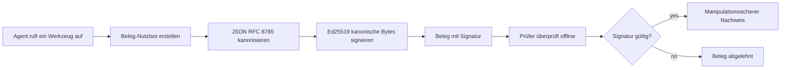
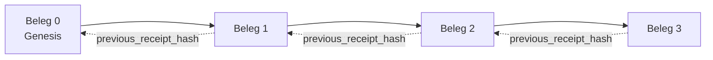

[Sehen Sie sich das Lektionenvideo an: Absicherung von KI-Agenten mit kryptografischen Belegen](https://youtu.be/PLACEHOLDER_VIDEO_ID)

> _(Lektionenvideo und Miniaturansicht werden vom Microsoft Content-Team nach dem Zusammenführen hinzugefügt, passend zum Muster der Lektionen 14 / 15.)_

# Absicherung von KI-Agenten mit kryptografischen Belegen

## Einführung

Diese Lektion behandelt:

- Warum Prüfpfade für KI-Agenten für Compliance, Fehlerbehebung und Vertrauen wichtig sind.
- Was ein kryptografischer Beleg ist und wie er sich von einer nicht signierten Protokollzeile unterscheidet.
- Wie man eine signierte Quittung für den Toolaufruf eines Agenten in einfachem Python erzeugt.
- Wie man einen Beleg offline überprüft und Manipulationen erkennt.
- Wie man Belege verknüpft, sodass das Entfernen oder Neuordnen eines Belegs die Kette zerstört.
- Was Belege beweisen und was sie explizit nicht beweisen.

## Lernziele

Nach Abschluss dieser Lektion wissen Sie, wie man:

- Fehlerursachen identifiziert, die kryptografische Herkunft für Agentenaktionen motivieren.
- Eine mit Ed25519 signierte Quittung über eine kanonische JSON-Nutzlast erzeugt.
- Eine Quittung unabhängig mit nur dem öffentlichen Schlüssel des Signierers verifiziert.
- Manipulation erkennt, indem die Verifikation einer modifizierten Quittung erneut ausgeführt wird.
- Eine hash-verkettete Folge von Quittungen aufbaut und erklärt, warum die Kette wichtig ist.
- Die Grenzen erkennt zwischen dem, was Quittungen beweisen (Zuschreibung, Integrität, Reihenfolge) und dem, was sie nicht beweisen (Korrektheit der Aktion, Gültigkeit der Richtlinie).

## Das Problem: Der Prüfpfad Ihres Agenten

Stellen Sie sich vor, Sie haben einen KI-Agenten für Contoso Travel bereitgestellt. Der Agent liest Kundenanfragen, ruft eine Flug-API zur Suche nach Optionen auf und bucht Sitzplätze im Namen des Kunden. Im letzten Quartal hat der Agent 50.000 Buchungen verarbeitet.

Heute kommt ein Prüfer. Er stellt eine einfache Frage: "Zeigen Sie mir, was Ihr Agent getan hat."

Sie übergeben Ihre Protokolldateien. Der Prüfer schaut sie an und stellt die schwierigere Frage: "Woher weiß ich, dass diese Protokolle nicht bearbeitet wurden?"

Dies ist das Prüfpfadproblem. Die meisten Agenten-Deployments basieren heute auf:

- **Anwendungsprotokollen**: vom Agenten selbst geschrieben, von jedem mit Dateisystemzugriff änderbar.
- **Cloud-Logging-Diensten**: manipulationssicher auf Plattformebene, aber nur, wenn der Prüfer dem Plattformbetreiber vertraut.
- **Datenbank-Transaktionsprotokollen**: gut geeignet für Datenbankänderungen, aber nicht für beliebige Toolaufrufe.

Keiner dieser Ansätze kann die Frage des Prüfers beantworten, ohne dass der Prüfer jemandem vertrauen muss (Ihnen, Ihrem Cloud-Anbieter, Ihrem Datenbankanbieter). Für den internen Gebrauch ist dieses Vertrauen oft akzeptabel. Für regulierte Arbeitslasten (Finanzen, Gesundheitswesen, alles, was dem EU-KI-Gesetz unterliegt) nicht.

Kryptografische Belege lösen dies, indem jede Agentenaktion unabhängig verifizierbar wird. Der Prüfer muss Ihnen nicht vertrauen. Er braucht nur Ihren öffentlichen Schlüssel und den Beleg selbst.

## Was ist ein kryptografischer Beleg?

Ein Beleg ist ein JSON-Objekt, das aufzeichnet, was ein Agent getan hat, signiert mit einer digitalen Signatur.


```mermaid
flowchart LR
    A[Agent ruft ein Werkzeug auf] --> B[Beleg-Nutzlast erstellen]
    B --> C[JSON RFC 8785 kanonisieren]
    C --> E[Ed25519 kanonische Bytes signieren]
    E --> F[Beleg mit Signatur]
    F --> G[Prüfer überprüft offline]
    G --> H{Signatur gültig?}
    H -- yes --> I[Manipulationssicherer Nachweis]
    H -- no --> J[Beleg abgelehnt]
```

Ein minimaler Beleg sieht so aus:

```json
{
  "type": "agent.tool_call.v1",
  "agent_id": "contoso-travel-bot",
  "tool_name": "lookup_flights",
  "tool_args_hash": "sha256:a3f9c1...",
  "result_hash": "sha256:7b2e1d...",
  "policy_id": "contoso-travel-policy-v3",
  "timestamp": "2026-04-25T14:30:00Z",
  "sequence": 47,
  "previous_receipt_hash": "sha256:9d4e6a...",
  "signature": {
    "alg": "EdDSA",
    "sig": "c5af83...",
    "public_key": "8f3b2c..."
  }
}
```

Drei Eigenschaften sind hier maßgeblich:

1. **Die Signatur**. Der Beleg wird vom Gateway des Agenten mit einem Ed25519-Privatschlüssel signiert. Jeder mit dem entsprechenden öffentlichen Schlüssel kann die Signatur offline verifizieren. Eine Manipulation eines Feldes macht die Signatur ungültig.

2. **Kanonische Kodierung**. Vor der Signatur wird der Beleg mit dem JSON Canonicalization Scheme (JCS, RFC 8785) serialisiert. Dies stellt sicher, dass zwei Implementierungen, die denselben logischen Beleg erzeugen, ein byte-identisches Ergebnis liefern. Ohne Kanonisierung würden verschiedene JSON-Serializer für denselben Inhalt unterschiedliche Signaturen erzeugen.

3. **Hash-Verkettung**. Das Feld `previous_receipt_hash` verbindet jeden Beleg mit dem vorherigen. Entfernt oder ordnet man einen Beleg um, wird jeder danach folgende Beleg ungültig. Manipulationen werden auf Kettenebene sichtbar, selbst wenn einzelne Signaturen umgangen werden.

Zusammen bieten diese Eigenschaften drei Garantien:

- **Zuschreibung**: Dieser Schlüssel hat diesen Inhalt signiert.
- **Integrität**: Der Inhalt hat sich seit der Signatur nicht verändert.
- **Reihenfolge**: Dieser Beleg kam in der Kette nach jenem Beleg.

## Erzeugen eines Belegs in Python

Sie benötigen keine spezielle Bibliothek, um einen Beleg zu erzeugen. Die kryptografischen Grundbausteine sind weit verbreitet und die Logik umfasst nur einige Dutzend Zeilen Python.

Die praktischen Übungen in `code_samples/18-signed-receipts.ipynb` führen durch den gesamten Ablauf. Die Kurzfassung:

```python
import json
import hashlib
import base64
from nacl import signing
from jcs import canonicalize  # RFC 8785 kanonisches JSON

def b64url_nopad(data: bytes) -> str:
    return base64.urlsafe_b64encode(data).decode("ascii").rstrip("=")

def sha256_canonical(obj) -> str:
    """SHA-256 of a Python object's JCS-canonical JSON form."""
    return f"sha256:{hashlib.sha256(canonicalize(obj)).hexdigest()}"

# Generieren oder Laden eines Signaturschlüssels (in der Produktion im Tresor speichern)
signing_key = signing.SigningKey.generate()
verify_key = signing_key.verify_key

# Aufbau der Belegdaten (noch keine Signatur)
tool_args = {"origin": "SYD", "destination": "LAX"}
tool_result = [{"flight": "QF11", "price": 1850, "stops": 0}]

payload = {
    "type": "agent.tool_call.v1",
    "agent_id": "contoso-travel-bot",
    "tool_name": "lookup_flights",
    "tool_args_hash": sha256_canonical(tool_args),
    "result_hash": sha256_canonical(tool_result),
    "policy_id": "contoso-travel-policy-v3",
    "timestamp": "2026-04-25T14:30:00Z",
    "sequence": 0,
    "previous_receipt_hash": None,
}

# Kanonisierung und direkte Signatur der JCS-Bytes. PureEdDSA hasht intern.
canonical_bytes = canonicalize(payload)
signature_bytes = signing_key.sign(canonical_bytes).signature

# Anfügen eines strukturierten Signaturobjekts.
receipt = {
    **payload,
    "signature": {
        "alg": "EdDSA",
        "sig": b64url_nopad(signature_bytes),
        "public_key": b64url_nopad(bytes(verify_key)),
    },
}
```

Das ist die komplette Signier-Pipeline. Die Übungen im Notebook erläutern jeden Schritt.

## Verifizierung eines Belegs und Erkennung von Manipulationen

Die Verifizierung ist die Umkehroperation:

```python
import base64
import hashlib
from nacl import signing
from nacl.exceptions import BadSignatureError
from jcs import canonicalize

def b64url_decode(s: str) -> bytes:
    padding = "=" * ((4 - len(s) % 4) % 4)
    return base64.urlsafe_b64decode(s + padding)

def verify_receipt(receipt: dict) -> bool:
    # Die Signatur ist ein strukturiertes Objekt: {"alg", "sig", "public_key"}.
    sig_obj = receipt.get("signature")
    if not sig_obj or sig_obj.get("alg") != "EdDSA":
        return False

    # Rekonstruieren Sie die Nutzlast, die tatsächlich signiert wurde (alles außer der Signatur).
    payload = {k: v for k, v in receipt.items() if k != "signature"}

    canonical_bytes = canonicalize(payload)

    try:
        verify_key = signing.VerifyKey(b64url_decode(sig_obj["public_key"]))
        verify_key.verify(canonical_bytes, b64url_decode(sig_obj["sig"]))
        return True
    except BadSignatureError:
        return False
```

Diese Funktion nimmt einen Beleg und gibt `True` zurück, wenn die Signatur gültig ist, sonst `False`. Kein Netzwerkaufruf, keine Serviceabhängigkeit, kein Vertrauen in Dritte erforderlich.

Um die Erkennung von Manipulationen praktisch zu sehen, behandelt das Notebook:

1. Erzeugen eines gültigen Belegs und Bestätigen der Verifizierung.
2. Ändern eines Bytes im Feld `tool_args_hash`.
3. Erneutes Ausführen der Verifikation und Beobachtung des Fehlers.

Dies ist der praktische Beweis, dass Belege manipulationssicher sind: Jede Änderung, auch noch so klein, bricht die Signatur.

## Verknüpfen von Belegen für mehrstufige Agenten

Ein einzelner signierter Beleg schützt eine Aktion. Eine Kette von Belegen schützt eine Abfolge.


```mermaid
flowchart LR
    R0[Beleg 0<br/>Genesis] --> R1[Beleg 1]
    R1 --> R2[Beleg 2]
    R2 --> R3[Beleg 3]
    R1 -. previous_receipt_hash .-> R0
    R2 -. previous_receipt_hash .-> R1
    R3 -. previous_receipt_hash .-> R2
```

Jeder Beleg enthält den Hash des vorherigen Belegs. Um Beleg 2 unbemerkt zu entfernen, müsste ein Angreifer entweder:

- Das Feld `previous_receipt_hash` von Beleg 3 ändern (bricht die Signatur von Beleg 3), ODER
- Eine neue Signatur für einen modifizierten Beleg 3 fälschen (benötigt den Privatschlüssel des Agenten).

Wenn der Privatschlüssel in einem Hardware-Schlüsselspeicher liegt und Sie den öffentlichen Schlüssel mit jedem Beleg veröffentlichen, ist keiner dieser Angriffe ohne Entdeckung machbar.

Das Notebook behandelt:

1. Aufbau einer Kette von drei Belegen.
2. Überprüfung, dass jedes `previous_receipt_hash` mit dem tatsächlichen Hash des vorherigen Belegs übereinstimmt.
3. Manipulation eines Belegs in der Mitte und Beobachtung, wie die Kette an genau dieser Stelle bricht.

So erzeugen Sie einen Prüfpfad, den ein externer Prüfer verifizieren kann, ohne Ihnen vertrauen zu müssen.

## Was Belege beweisen (und was nicht)

Dies ist der wichtigste Abschnitt dieser Lektion. Belege sind mächtig, aber ihre Macht ist begrenzt.

**Belege beweisen drei Dinge:**

1. **Zuschreibung**: Ein bestimmter Schlüssel hat eine bestimmte Nutzlast signiert.
2. **Integrität**: Die Nutzlast hat sich seit der Signatur nicht geändert.
3. **Reihenfolge**: Dieser Beleg kam in der Hash-Kette nach jenem Beleg.

**Belege beweisen NICHT:**

1. **Korrektheit**: Dass die Aktion des Agenten die richtige Aktion war. Ein Beleg kann für eine falsche Antwort genauso gültig signiert werden wie für eine richtige.
2. **Einhaltung von Richtlinien**: Dass die in `policy_id` referenzierte Richtlinie tatsächlich ausgewertet wurde oder dass sie diese Aktion erlaubt hätte, wenn geprüft. Der Beleg dokumentiert, was behauptet wurde, nicht was durchgesetzt wurde.
3. **Identität über den Schlüssel hinaus**: Der Beleg sagt "dieser Schlüssel hat diesen Inhalt signiert." Er sagt nicht "dieser Mensch hat das autorisiert." Die Verbindung eines Schlüssels zu einer Person oder Organisation erfordert separate Identitätsinfrastruktur (ein Verzeichnis, ein öffentlicher Schlüssel-Registry etc.).
4. **Wahrhaftigkeit der Eingaben**: Wenn der Agent eine manipulierte Eingabe erhält und darauf reagiert, dokumentiert der Beleg die Aktion treu. Belege sind nachgelagert zur Eingabevalidierung, kein Ersatz dafür.

Diese Grenze ist aus zwei Gründen wichtig:

- Sie zeigt, wofür Belege nützlich sind: um das Verhalten von Agenten auditierbar und manipulationssicher zu machen, auch über organisatorische Grenzen hinweg.
- Sie zeigt, welche zusätzlichen Ebenen noch benötigt werden: Eingabevalidierung (Lektion 6), Richtliniendurchsetzung (unten kurz behandelt) und Identitätsinfrastruktur (nicht Teil dieser Lektion).

Ein häufiger Fehler ist anzunehmen, dass "wir haben Belege" auch "wir sind reglementiert" bedeutet. Das tut es nicht. Belege sind die Grundlage. Governance ist das System, das Sie darauf aufbauen.

## Nachweis, dass ein Mensch die genaue Aktion genehmigt hat

Punkt 3 oben verdient einen eigenen Abschnitt: Ein Aktionsbeleg sagt "dieser Schlüssel hat diesen Inhalt signiert," niemals "ein Mensch hat das autorisiert." Für risikoreiche Aktionen (Rückerstattungen, Löschungen, Überweisungen) verlangen Governance-Rahmen zunehmend genau diese fehlende Aussage, und sie lässt sich mit den gleichen Bausteinen herstellen, die Sie in dieser Lektion bereits gebaut haben.

Das nachfolgende Notebook `code_samples/human-authorization-receipts.ipynb` fügt eine zweite Belegart hinzu, `human.approval.v1`, in derselben Umschlagform wie die Belege dieser Lektion (eine typisierte Nutzlast, mit Ed25519 über die kanonischen JCS-Bytes signiert, mit dem `signature`-Objekt außerhalb der signierten Bytes). Ein benannter Genehmiger signiert die **vollständige kanonische Aktion und deren Digest** vor der Ausführung; der Aktionsbeleg des Agenten trägt denselben Aktionsdigest und eine `parent_approval_ref`, den `receipt_hash` der Genehmigung, dieselbe Konvention wie `previous_receipt_hash` in der oben gebauten Kette. Ein einziger `verify_chain` prüft beide Artefakte unter **getrennten registrierten Schlüssel-Verzeichnissen** (Genehmiger-Keys vs Agenten-Keys), sodass der Codepfad geteilt, die Berechtigungen aber nie.

Die Eigenschaft, die sich daraus ergibt, sorgfältig formuliert: *Der Mensch hat genau diese Aktion genehmigt, und der Agent hat genau diese genehmigte Aktion ausgeführt.* Die Ablehnungsfunktionen im Notebook machen die Eigenschaft real und nicht nur behauptet:

- die klassischen: Manipulation, Confused Deputy, Replay, gefälschte Schlüssel auf beiden Seiten, fehlerhafte Eingaben;
- **veraltete Berechtigung**: eine Signatur, die noch verifiziert, aber trotzdem abgelehnt wird, weil die Richtlinienversion sich änderte, der Genehmiger-Schlüssel aus dem registrierten Keyset entfernt wurde oder die Genehmigung vor der Ausführung ablief;
- **Digest-Substitution**: Ein gültig signierter Aktionsbeleg, der auf eine *echte* Genehmigung zeigt, die an eine *andere* kanonische Aktion gebunden ist.

Jeder Fehler wird mit einem eigenen Grund abgelehnt, sodass ein Prüfer anhand einer Ablehnung erkennen kann, ob die Berechtigung abgelaufen ist oder die ausgeführte Aktion sich änderte. Die Regel, die das Notebook lehrt: Eine signierte Genehmigung ist für sich keine Berechtigung. Berechtigung besteht nur, wenn beide Belege zum Ausführungszeitpunkt noch an dieselbe kanonische Aktion gebunden sind. Der menschliche Genehmigungsbeleg ist eine von dieser Lektion definierte pädagogische Komposition, kein Belegtyp aus `draft-farley-acta-signed-receipts`.

## Produktionsreferenzen

Der Python-Code in dieser Lektion ist absichtlich minimal gehalten, damit Sie jede Zeile lesen und genau verstehen können, was passiert. In Produktion haben Sie zwei Optionen:

1. **Direkt auf den kryptografischen Grundbausteinen aufbauen.** Die oben gezeigten 50 Zeilen genügen für viele Anwendungsfälle. PyNaCl (Ed25519) und das `jcs`-Paket (kanonisches JSON) sind gut gepflegte und geprüfte Bibliotheken.

2. **Eine Produktions-Bibliothek für Belege verwenden.** Verschiedene Open-Source-Projekte implementieren dasselbe Muster mit weiteren Funktionen (Schlüsselrotation, Batch-Verifizierung, JWK-Set-Verteilung, Integration mit Richtlinien-Engines):
   - Die Signier-Pipeline verwendet die JCS- und Signatur-Bereich-Konventionen in einem unabhängigen IETF Internet-Draft ([`draft-farley-acta-signed-receipts`](https://datatracker.ietf.org/doc/draft-farley-acta-signed-receipts/), Revision 02). Der einfache Bildung-Beleg dieser Lektion unterscheidet sich vom Entwurf mit `{payload, signature}`-Umschlag und wird nicht als konforme Implementierung präsentiert. Der Entwurf veröffentlicht eine gemeinsame Konformitätssuite ([agent-governance-testvectors](https://github.com/ScopeBlind/agent-governance-testvectors)) für Implementierungen, die dessen Wire-Format anstreben.
   - Das Microsoft Agent Governance Toolkit kombiniert Belege mit Cedar-basierten Richtlinienentscheidungen; siehe Tutorial 33 in diesem Repository für ein End-to-End-Beispiel.
   - Die Pakete `protect-mcp` (npm) und `@veritasacta/verify` (npm) bieten eine Node-basierte Implementierung von Belegsignatur und Offline-Verifikation, gedacht zum Umhüllen beliebiger MCP-Server mit einem manipulationssicheren Prüfpfad, inklusive eines "Zum Co-Signieren zurückgehalten"-Ablaufs, bei dem eine pausierte Aktion eine Genehmigungs-Quittung ausgibt, die an den Aktionsdigest gebunden ist (WebAuthn-unterstützt im Desktop-Ablauf), dasselbe Genehmigungsbeleg-Muster wie im menschlichen Autorisierungs-Notebook oben.
   - Das **[nobulex](https://github.com/arian-gogani/nobulex)** Python SDK (`pip install nobulex`) bietet dasselbe Ed25519 + JCS Signiermuster in Python mit LangChain- und CrewAI-Integrationen, inklusive veröffentlichter Kreuzvalidierungstests und einer durch [OWASP PR #2210](https://github.com/OWASP/CheatSheetSeries/pull/2210) beigesteuerten Compliance-Zuordnung.

Die Entscheidung zwischen Eigenentwicklung und Bibliotheksnutzung spiegelt die Wahl wider zwischen einer eigenen JWT-Bibliothek und einer getesteten: Beides ist vernünftig; die Bibliothek spart Zeit und reduziert die Prüfungsfläche; die Eigenentwicklung zwingt Sie, jede Primitive zu verstehen. Diese Lektion lehrt den selbstgebauten Weg, damit Sie die Grundlage für beide Entscheidungen haben.

## Wissenscheck

Testen Sie Ihr Verständnis, bevor Sie zur Übung übergehen.

**1. Ein Beleg wird mit dem privaten Ed25519-Schlüssel des Agenten signiert. Der Prüfer hat nur den öffentlichen Schlüssel. Kann der Prüfer den Beleg offline verifizieren?**

<details>
<summary>Antwort</summary>

Ja. Die Ed25519-Verifikation benötigt nur den öffentlichen Schlüssel und die signierten Bytes. Kein Netzwerkaufruf, keine Serviceabhängigkeit. Das ist die Eigenschaft, die Belege in luftgesperrten, multi-organisatorischen oder vertrauensarmen Audit-Umgebungen nützlich macht.
</details>

**2. Ein Angreifer ändert das Feld `policy_id` eines Belegs, um zu behaupten, der Beleg wäre von einer permissiveren Richtlinie überwacht worden. Die Signatur wurde über die ursprüngliche Nutzlast erstellt. Was passiert bei der Verifikation?**

<details>
<summary>Antwort</summary>


Die Überprüfung schlägt fehl. Die Signatur wurde über die kanonischen Bytes der Originalnutzlast berechnet; das Ändern eines Feldes verändert diese Bytes, was die Signatur ungültig macht. Der Angreifer bräuchte den privaten Schlüssel, um eine neue gültige Signatur zu erzeugen, den er jedoch nicht hat.
</details>

**3. Warum enthält die Quittung einen `tool_args_hash` und `result_hash` anstatt der Rohargumente und des Ergebnisses?**

<details>
<summary>Antwort</summary>

Zwei Gründe. Erstens muss die Quittung möglicherweise in Umgebungen archiviert oder übertragen werden, in denen ein Leaken der Rohinhalte (personenbezogene Daten, Geschäftsdaten) problematisch ist. Hashes halten die Quittung klein und den Inhalt privat; der Prüfer verifiziert, dass der Hash mit einer separat gespeicherten Kopie des tatsächlichen Inhalts übereinstimmt. Zweitens haben Hashes eine feste Größe; eine Quittung mit Hashes ist in der Größe begrenzt, unabhängig davon, wie groß die Ein- und Ausgaben waren.
</details>

**4. Das Feld `previous_receipt_hash` verknüpft jede Quittung mit ihrem Vorgänger. Wenn ein Angreifer stillschweigend eine Quittung aus der Mitte einer Kette löscht, was wird ungültig?**

<details>
<summary>Antwort</summary>

Jede Quittung, die nach der gelöschten kam. Deren `previous_receipt_hash`-Felder stimmen nicht mehr mit der tatsächlichen Kette überein (weil die referenzierte Quittung nicht mehr existiert oder die Kette jetzt auf einen anderen Vorgänger zeigt). Um die Löschung zu verbergen, müsste der Angreifer jede spätere Quittung neu signieren, was den privaten Schlüssel erfordert.
</details>

**5. Eine Quittung verifiziert sich sauber. Beweist das, dass die Aktion des Agenten korrekt, sachlich oder konform mit der Richtlinie war?**

<details>
<summary>Antwort</summary>

Nein. Eine gültige Quittung beweist drei Dinge: Zuordnung (dieser Schlüssel signierte diesen Inhalt), Integrität (der Inhalt wurde nicht verändert) und Reihenfolge (diese Quittung kam nach jener Quittung). Sie beweist NICHT, dass die Aktion korrekt war, dass die im `policy_id` benannten Richtlinien tatsächlich ausgewertet wurden oder dass der Agent jede Regel befolgt hat. Quittungen machen das Verhalten des Agenten prüfbar, aber nicht unbedingt korrekt. Dies ist die wichtigste Grenze in der Lektion.
</details>

## Übungsaufgabe

Öffne die Datei `code_samples/18-signed-receipts.ipynb` und bearbeite alle vier Abschnitte:

1. **Abschnitt 1**: Signiere deine erste Quittung und verifiziere sie.
2. **Abschnitt 2**: Manipuliere die Quittung und beobachte das Scheitern der Verifikation.
3. **Abschnitt 3**: Baue eine Kette von drei Quittungen und verifiziere die Integrität der Kette.
4. **Abschnitt 4**: Wende das Muster auf einen mit dem Microsoft Agent Framework gebauten Agenten an: Umschließe einen Tool-Aufruf mit Quittungssignierung und verifiziere dann die Quittung unabhängig.

**Zusatzaufgabe 1:** Erweitere das Quittungsschema um ein zusätzliches Feld deiner Wahl (zum Beispiel eine Anfrage-ID zur Nachverfolgung), aktualisiere die kanonische Signierlogik, um es einzubeziehen, und bestätige, dass die Quittung die Verifikation weiterhin besteht. Ändere dann das Feld nach der Signatur und bestätige, dass die Verifikation fehlschlägt. Dies zwingt dich, zu verstehen, wie jedes Byte der kanonischen Kodierung zur Signatur beiträgt.

**Zusatzaufgabe 2:** Hash zwei deiner Quittungen mit SHA-256 zusammen (konkateniere ihre kanonischen Bytes in einer deterministischen Reihenfolge) und bette den resultierenden Digest als neues Feld in eine dritte Quittung ein, bevor du sie signierst. Verifiziere, dass alle drei Quittungen weiterhin verifizierbar sind. Du hast gerade einen Einschlussnachweis in einem Schritt gebaut: Jeder, der die dritte Quittung besitzt, kann beweisen, dass die ersten beiden zum Zeitpunkt der Signatur existierten, ohne deren Inhalte offenlegen zu müssen. Dies ist das Muster, das selektiv-offenbarende Quittungen in großem Maßstab verwenden (Merkle-Zusagen, RFC 6962).

## Schlussfolgerung

Kryptografische Quittungen geben KI-Agenten eine Prüfkette, die:

- **Unabhängig verifizierbar**: Jede Partei mit dem öffentlichen Schlüssel kann sie verifizieren, keine Dienstabhängigkeit.
- **Manipulationssicher**: Jede Änderung macht die Signatur ungültig.
- **Portabel**: Eine Quittung ist eine kleine JSON-Datei; sie kann archiviert, übertragen und überall verifiziert werden.
- **Standardkonform**: Basierend auf Ed25519 (RFC 8032), JCS (RFC 8785) und SHA-256, alles weit verbreitete Primitiven.

Sie ersetzen keine Eingabeverifizierung, Richtliniendurchsetzung oder Identitätsinfrastruktur. Sie sind eine Grundlage für diese Schichten. Wenn du Agenten in regulierten Workloads, multi-organisationalen Workflows oder Umgebungen mit zukünftigen Prüfern einsetzt, die dir nicht automatisch vertrauen, sind Quittungen der Weg, die Prüfkette ehrlich zu gestalten.

Die wichtigste Erkenntnis: Quittungen beweisen, wer wann was gesagt hat. Sie beweisen nicht, dass das Gesagte wahr oder richtig war. Halte diese Unterscheidung strikt. Es ist der Unterschied zwischen einem ehrlichen Herkunftssystem und einem irreführenden.

## Produktions-Checkliste

Wenn du bereit bist, diese Lektion zu absolvieren und Quittung-signierende Agenten in einer realen Umgebung einzusetzen:

- [ ] **Verschiebe den Signierschlüssel vom Entwickler-Laptop.** Verwende Azure Key Vault, AWS KMS oder ein Hardware-Sicherheitsmodul. Der private Schlüssel, der deine Quittungen signiert, darf niemals im Quellcode oder unverschlüsselt auf Anwendungsmaschinen liegen.
- [ ] **Veröffentliche den Verifikations-Public-Key.** Prüfer benötigen ihn für Offline-Überprüfungen. Das Standardverfahren ist ein JWK-Set unter einer bekannten URL (RFC 7517), z. B. `https://your-org.example.com/.well-known/agent-keys.json`.
- [ ] **Verankere die Kette extern.** Schreibe periodisch den neuesten Kettenkopf-Hash in ein Transparenzprotokoll (Sigstore Rekor, RFC 3161 Zeitstempelbehörde oder ein zweites internes System), damit eine externe Partei bestätigen kann „diese Kette existierte zu diesem Zeitpunkt.“
- [ ] **Speichere Quittungen unveränderlich.** Append-only Blob Storage (Azure Storage mit Unveränderlichkeitspolicen, AWS S3 Object Lock) verhindert, dass ein Insider die Historie auf der Speicherebene umschreibt.
- [ ] **Entscheide über Aufbewahrung.** Viele Compliance-Regelwerke verlangen mehrjährige Aufbewahrung. Plane das Wachstum der Quittungen (jede Quittung ist etwa 500 Bytes; ein Agent mit 10.000 Aufrufen pro Tag erzeugt ~1,8 GB pro Jahr).
- [ ] **Dokumentiere, was Quittungen nicht abdecken.** Quittungen beweisen Zuordnung, Integrität und Reihenfolge. Dein Runbook sollte explizit auflisten, welche zusätzlichen Kontrollen (Eingabeverifizierung, Richtliniendurchsetzung, Ratenbegrenzung, Identitätsinfrastruktur) zusammen mit Quittungen in deiner Governance-Strategie stehen.

### Noch Fragen zur Sicherung von KI-Agenten?

Trete dem [Microsoft Foundry Discord](https://aka.ms/ai-agents/discord) bei, um andere Lernende zu treffen, Sprechstunden zu besuchen und deine Fragen zu KI-Agenten beantworten zu lassen.

## Über diese Lektion hinaus

Diese Lektion behandelt Ein-Quittungs-Signaturen und hashverkettete Sequenzen. Dieselben Primitiven setzen sich zu mehreren fortgeschritteneren Mustern zusammen, die dir begegnen können, wenn deine Governance-Strategie reift:

- **Selektive Offenlegung.** Wenn die Felder einer Quittung unabhängig gebunden sind (RFC 6962-ähnlicher Merkle-Baum), kannst du bestimmte Felder bestimmten Prüfern offenlegen und beweisen, dass der Rest unverändert ist, ohne ihn offenlegen zu müssen. Nützlich, wenn dieselbe Quittung sowohl eine umfassende Prüfung (die Vollständigkeit will) als auch Datenminimierungsregeln wie DSGVO (die wollen, dass der Prüfer so wenig wie möglich sieht) erfüllen muss.
- **Quittungswiderruf.** Wenn ein Signierschlüssel kompromittiert wird, brauchst du eine Möglichkeit, alle mit diesem Schlüssel signierten Quittungen ab einem Zeitpunkt als nicht vertrauenswürdig zu markieren. Standardmuster: kurzlebige Signierschlüssel plus veröffentlichte Widerrufsliste oder ein Transparenzprotokoll mit Widerrufseinträgen.
- **Bilaterale / gesplittete Signaturquittungen.** Manche Implementierungen teilen die signierte Nutzlast in Pre-Execution- (`authorization_*`) und Post-Execution- (`result_*`) Hälften mit unabhängigen Signaturen. Nützlich, wenn die Autorisierungsentscheidung und das beobachtete Ergebnis von unterschiedlichen Akteuren oder zu unterschiedlichen Zeiten erzeugt werden. Dies baut auf dem in dieser Lektion vermittelten Quittungsformat auf.
- **Nutzlastzusammensetzung.** Eine Quittung versiegelt welche Bytes auch immer du in `result_hash` legst. Nutzlasten in der Praxis sind oft reicher als das Ergebnis eines einzelnen Tool-Aufrufs: Vorentscheidungs-Überlegungen (Modellvorhersage, berücksichtigte Optionen, Beweislage und deren Vollständigkeit, Risikoposition, Rechenkette, Gate-Ergebnis) können alle in der Nutzlast leben, versiegelt von einer einzigen Quittung. So bleibt das Quittungsformat minimal, während die Nutzlastschemas domänenspezifisch wachsen können.
- **Konformität zwischen Implementierungen.** Mehrere unabhängige Implementierungen desselben Quittungsformats (Python, TypeScript, Rust, Go) verifizieren gegenseitig anhand gemeinsamer Testvektoren. Wenn du deine eigene Implementierung baust, bestätigt die Validierung gegen veröffentlichte Vektoren die Wire-Kompatibilität.
- **Post-Quanten-Migration.** Ed25519 ist heute weit verbreitet, aber nicht quantensicher. Das Quittungsformat ist algorithmus-agil: Das Feld `signature.alg` kann `ML-DSA-65` tragen (der NIST-Post-Quantum-Signaturstandard), wenn du migrieren musst. Plane eine Übergangsphase, in der Quittungen doppelt signiert werden.

## Zusätzliche Ressourcen

- <a href="https://datatracker.ietf.org/doc/draft-farley-acta-signed-receipts/" target="_blank">IETF Internet-Draft: Signed Decision Receipts for Machine-to-Machine Access Control</a>
- <a href="https://learn.microsoft.com/azure/ai-studio/responsible-use-of-ai-overview" target="_blank">Überblick zu Responsible AI (Azure AI)</a>
- <a href="https://datatracker.ietf.org/doc/html/rfc8032" target="_blank">RFC 8032: Edwards-Curve Digital Signature Algorithm (EdDSA)</a>
- <a href="https://datatracker.ietf.org/doc/html/rfc8785" target="_blank">RFC 8785: JSON Canonicalization Scheme (JCS)</a>
- <a href="https://datatracker.ietf.org/doc/html/rfc6962" target="_blank">RFC 6962: Certificate Transparency</a> (Merkle-Baum-Konstruktion, verwendet von selektiv-offenbarenden Quittungen)
- <a href="https://github.com/microsoft/agent-governance-toolkit/blob/main/docs/tutorials/33-offline-verifiable-receipts.md" target="_blank">Microsoft Agent Governance Toolkit, Tutorial 33: Offline-verifizierbare Entscheidungsquittungen</a>
- <a href="https://github.com/ScopeBlind/agent-governance-testvectors" target="_blank">Konformitäts-Testvektoren über Implementierungen hinweg</a> für das in dieser Lektion verwendete Quittungsformat (Apache-2.0)
- <a href="https://pynacl.readthedocs.io/" target="_blank">PyNaCl-Dokumentation</a> (Ed25519 in Python)

## Vorherige Lektion

[Lokale KI-Agenten erstellen](../17-creating-local-ai-agents/README.md)

---

<!-- CO-OP TRANSLATOR DISCLAIMER START -->
**Haftungsausschluss**:
Dieses Dokument wurde mit dem KI-Übersetzungsdienst [Co-op Translator](https://github.com/Azure/co-op-translator) übersetzt. Obwohl wir uns um Genauigkeit bemühen, beachten Sie bitte, dass automatisierte Übersetzungen Fehler oder Ungenauigkeiten enthalten können. Das Originaldokument in seiner Ursprungssprache gilt als maßgebliche Quelle. Bei kritischen Informationen wird eine professionelle menschliche Übersetzung empfohlen. Wir übernehmen keine Haftung für Missverständnisse oder Fehlinterpretationen, die aus der Verwendung dieser Übersetzung entstehen.
<!-- CO-OP TRANSLATOR DISCLAIMER END -->