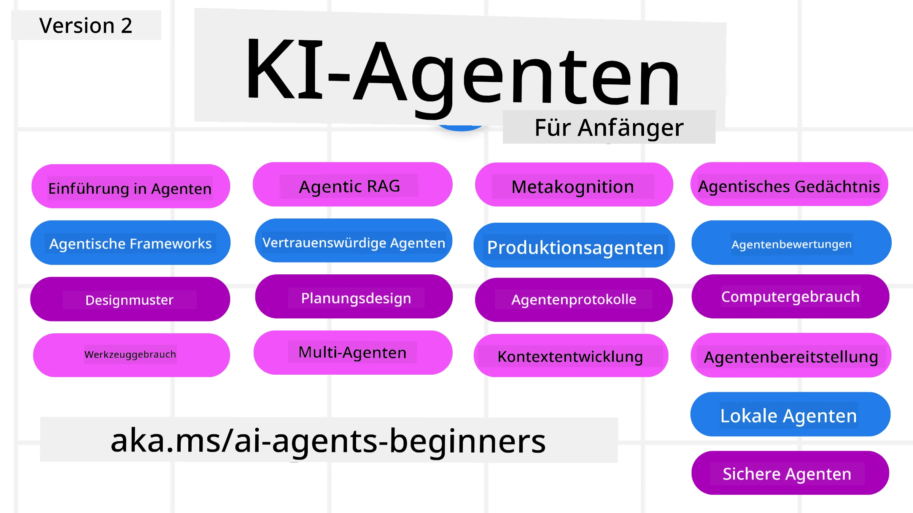

# KI-Agenten für Anfänger – Ein Kurs



## Ein Kurs, der alles lehrt, was Sie wissen müssen, um mit dem Bau von KI-Agenten zu beginnen

[](https://github.com/microsoft/ai-agents-for-beginners/blob/master/LICENSE?WT.mc_id=academic-105485-koreyst)
[](https://GitHub.com/microsoft/ai-agents-for-beginners/graphs/contributors/?WT.mc_id=academic-105485-koreyst)
[](https://GitHub.com/microsoft/ai-agents-for-beginners/issues/?WT.mc_id=academic-105485-koreyst)
[](https://GitHub.com/microsoft/ai-agents-for-beginners/pulls/?WT.mc_id=academic-105485-koreyst)
[](http://makeapullrequest.com?WT.mc_id=academic-105485-koreyst)

### 🌐 Mehrsprachige Unterstützung

#### Unterstützt durch GitHub Action (Automatisiert & immer aktuell)

<!-- CO-OP TRANSLATOR LANGUAGES TABLE START -->
[Arabisch](../ar/README.md) | [Bengalisch](../bn/README.md) | [Bulgarisch](../bg/README.md) | [Birmanisch (Myanmar)](../my/README.md) | [Chinesisch (vereinfacht)](../zh-CN/README.md) | [Chinesisch (traditionell, Hongkong)](../zh-HK/README.md) | [Chinesisch (traditionell, Macau)](../zh-MO/README.md) | [Chinesisch (traditionell, Taiwan)](../zh-TW/README.md) | [Kroatisch](../hr/README.md) | [Tschechisch](../cs/README.md) | [Dänisch](../da/README.md) | [Niederländisch](../nl/README.md) | [Estnisch](../et/README.md) | [Finnisch](../fi/README.md) | [Französisch](../fr/README.md) | [Deutsch](./README.md) | [Griechisch](../el/README.md) | [Hebräisch](../he/README.md) | [Hindi](../hi/README.md) | [Ungarisch](../hu/README.md) | [Indonesisch](../id/README.md) | [Italienisch](../it/README.md) | [Japanisch](../ja/README.md) | [Kannada](../kn/README.md) | [Khmer](../km/README.md) | [Koreanisch](../ko/README.md) | [Litauisch](../lt/README.md) | [Malaiisch](../ms/README.md) | [Malayalam](../ml/README.md) | [Marathi](../mr/README.md) | [Nepalesisch](../ne/README.md) | [Nigerianisches Pidgin](../pcm/README.md) | [Norwegisch](../no/README.md) | [Persisch (Farsi)](../fa/README.md) | [Polnisch](../pl/README.md) | [Portugiesisch (Brasilien)](../pt-BR/README.md) | [Portugiesisch (Portugal)](../pt-PT/README.md) | [Punjabi (Gurmukhi)](../pa/README.md) | [Rumänisch](../ro/README.md) | [Russisch](../ru/README.md) | [Serbisch (Kyrillisch)](../sr/README.md) | [Slowakisch](../sk/README.md) | [Slowenisch](../sl/README.md) | [Spanisch](../es/README.md) | [Swahili](../sw/README.md) | [Schwedisch](../sv/README.md) | [Tagalog (Filipino)](../tl/README.md) | [Tamil](../ta/README.md) | [Telugu](../te/README.md) | [Thailändisch](../th/README.md) | [Türkisch](../tr/README.md) | [Ukrainisch](../uk/README.md) | [Urdu](../ur/README.md) | [Vietnamesisch](../vi/README.md)

> **Bevorzugen Sie es, lokal zu klonen?**
>
> Dieses Repository enthält über 50 Sprachübersetzungen, wodurch die Download-Größe erheblich zunimmt. Um ohne Übersetzungen zu klonen, verwenden Sie sparse checkout:
>
> **Bash / macOS / Linux:**
> ```bash
> git clone --filter=blob:none --sparse https://github.com/microsoft/ai-agents-for-beginners.git
> cd ai-agents-for-beginners
> git sparse-checkout set --no-cone '/*' '!translations' '!translated_images'
> ```
>
> **CMD (Windows):**
> ```cmd
> git clone --filter=blob:none --sparse https://github.com/microsoft/ai-agents-for-beginners.git
> cd ai-agents-for-beginners
> git sparse-checkout set --no-cone "/*" "!translations" "!translated_images"
> ```
>
> Das gibt Ihnen alles, was Sie brauchen, um den Kurs mit einem viel schnelleren Download abzuschließen.
<!-- CO-OP TRANSLATOR LANGUAGES TABLE END -->

**Wenn Sie wünschen, dass weitere Übersetzungssprachen unterstützt werden, sind diese [hier](https://github.com/Azure/co-op-translator/blob/main/getting_started/supported-languages.md) aufgelistet.**

[](https://GitHub.com/microsoft/ai-agents-for-beginners/watchers/?WT.mc_id=academic-105485-koreyst)
[](https://GitHub.com/microsoft/ai-agents-for-beginners/network/?WT.mc_id=academic-105485-koreyst)
[](https://GitHub.com/microsoft/ai-agents-for-beginners/stargazers/?WT.mc_id=academic-105485-koreyst)

[](https://discord.gg/nTYy5BXMWG)


## 🌱 Einstieg

Dieser Kurs enthält Lektionen, die die Grundlagen des Baus von KI-Agenten abdecken. Jede Lektion behandelt ihr eigenes Thema, sodass Sie überall beginnen können, wo Sie möchten!

Für diesen Kurs gibt es mehrsprachige Unterstützung. Gehen Sie hierzu zu unseren [verfügbaren Sprachen hier](#-multi-language-support).

Wenn dies Ihr erstes Mal beim Arbeiten mit generativen KI-Modellen ist, schauen Sie sich unseren Kurs [Generative KI für Anfänger](https://aka.ms/genai-beginners) an, der 21 Lektionen zum Bau mit GenAI enthält.

Vergessen Sie nicht, dieses Repo zu [starren (🌟)](https://docs.github.com/en/get-started/exploring-projects-on-github/saving-repositories-with-stars?WT.mc_id=academic-105485-koreyst) und [zu forken](https://github.com/microsoft/ai-agents-for-beginners/fork), um den Code auszuführen.

### Treffen Sie andere Lernende, stellen Sie Ihre Fragen

Wenn Sie feststecken oder Fragen zum Bau von KI-Agenten haben, treten Sie unserem dedizierten Discord-Kanal im [Microsoft Foundry Discord](https://aka.ms/ai-agents/discord) bei.

### Was Sie benötigen

Jede Lektion in diesem Kurs enthält Codebeispiele, die im Ordner code_samples zu finden sind. Sie können dieses Repo [forken](https://github.com/microsoft/ai-agents-for-beginners/fork), um Ihre eigene Kopie zu erstellen.

Die Codebeispiele in diesen Übungen verwenden das Microsoft Agent Framework mit Azure AI Foundry Agent Service V2:

- [Microsoft Foundry](https://aka.ms/ai-agents-beginners/ai-foundry) – Azure-Konto erforderlich

Dieser Kurs verwendet folgende KI-Agenten-Frameworks und Dienste von Microsoft:

- [Microsoft Agent Framework (MAF)](https://aka.ms/ai-agents-beginners/agent-framework)
- [Azure AI Foundry Agent Service V2](https://aka.ms/ai-agents-beginners/ai-agent-service)

Einige Codebeispiele unterstützen auch alternative OpenAI-kompatible Anbieter wie [MiniMax](https://platform.minimaxi.com/), der Modelle mit großem Kontext (bis zu 204K Tokens) anbietet. Details zur Konfiguration finden Sie im [Kurseinrichtung](./00-course-setup/README.md).

Weitere Informationen zur Ausführung des Codes für diesen Kurs finden Sie unter [Kurseinrichtung](./00-course-setup/README.md).

## 🙏 Möchten Sie helfen?

Haben Sie Vorschläge oder Rechtschreib- oder Codefehler gefunden? [Eröffnen Sie ein Issue](https://github.com/microsoft/ai-agents-for-beginners/issues?WT.mc_id=academic-105485-koreyst) oder [erstellt einen Pull Request](https://github.com/microsoft/ai-agents-for-beginners/pulls?WT.mc_id=academic-105485-koreyst)


## 📂 Jede Lektion beinhaltet

- Eine schriftliche Lektion im README und ein kurzes Video
- Python-Codebeispiele unter Verwendung des Microsoft Agent Framework mit Azure AI Foundry
- Links zu zusätzlichen Ressourcen, um Ihr Lernen fortzusetzen


## 🗃️ Lektionen

| **Lektion**                                   | **Text & Code**                                    | **Video**                                                  | **Zusätzliches Lernen**                                                                |
|----------------------------------------------|----------------------------------------------------|------------------------------------------------------------|----------------------------------------------------------------------------------------|
| Einführung in KI-Agenten und Anwendungsfälle | [Link](./01-intro-to-ai-agents/README.md)          | [Video](https://youtu.be/3zgm60bXmQk?si=z8QygFvYQv-9WtO1)  | [Link](https://aka.ms/ai-agents-beginners/collection?WT.mc_id=academic-105485-koreyst) |
| Erkundung von Agenten-Frameworks              | [Link](./02-explore-agentic-frameworks/README.md)  | [Video](https://youtu.be/ODwF-EZo_O8?si=Vawth4hzVaHv-u0H)  | [Link](https://aka.ms/ai-agents-beginners/collection?WT.mc_id=academic-105485-koreyst) |
| Verstehen von Designmustern für KI-Agenten    | [Link](./03-agentic-design-patterns/README.md)     | [Video](https://youtu.be/m9lM8qqoOEA?si=BIzHwzstTPL8o9GF)  | [Link](https://aka.ms/ai-agents-beginners/collection?WT.mc_id=academic-105485-koreyst) |
| Designmuster zur Werkzeugnutzung              | [Link](./04-tool-use/README.md)                    | [Video](https://youtu.be/vieRiPRx-gI?si=2z6O2Xu2cu_Jz46N)  | [Link](https://aka.ms/ai-agents-beginners/collection?WT.mc_id=academic-105485-koreyst) |
| Agentic RAG                                  | [Link](./05-agentic-rag/README.md)                 | [Video](https://youtu.be/WcjAARvdL7I?si=gKPWsQpKiIlDH9A3)  | [Link](https://aka.ms/ai-agents-beginners/collection?WT.mc_id=academic-105485-koreyst) |
| Vertrauenswürdige KI-Agenten entwickeln       | [Link](./06-building-trustworthy-agents/README.md) | [Video](https://youtu.be/iZKkMEGBCUQ?si=jZjpiMnGFOE9L8OK ) | [Link](https://aka.ms/ai-agents-beginners/collection?WT.mc_id=academic-105485-koreyst) |
| Designmuster Planung                         | [Link](./07-planning-design/README.md)             | [Video](https://youtu.be/kPfJ2BrBCMY?si=6SC_iv_E5-mzucnC)  | [Link](https://aka.ms/ai-agents-beginners/collection?WT.mc_id=academic-105485-koreyst) |
| Designmuster Multi-Agent                     | [Link](./08-multi-agent/README.md)                 | [Video](https://youtu.be/V6HpE9hZEx0?si=rMgDhEu7wXo2uo6g)  | [Link](https://aka.ms/ai-agents-beginners/collection?WT.mc_id=academic-105485-koreyst) |
| Metakognition Designmuster                 | [Link](./09-metacognition/README.md)               | [Video](https://youtu.be/His9R6gw6Ec?si=8gck6vvdSNCt6OcF)  | [Link](https://aka.ms/ai-agents-beginners/collection?WT.mc_id=academic-105485-koreyst) |
| KI-Agenten in der Produktion               | [Link](./10-ai-agents-production/README.md)        | [Video](https://youtu.be/l4TP6IyJxmQ?si=31dnhexRo6yLRJDl)  | [Link](https://aka.ms/ai-agents-beginners/collection?WT.mc_id=academic-105485-koreyst) |
| Verwendung agentischer Protokolle (MCP, A2A und NLWeb) | [Link](./11-agentic-protocols/README.md)           | [Video](https://youtu.be/X-Dh9R3Opn8)                                 | [Link](https://aka.ms/ai-agents-beginners/collection?WT.mc_id=academic-105485-koreyst) |
| Kontext-Engineering für KI-Agenten         | [Link](./12-context-engineering/README.md)         | [Video](https://youtu.be/F5zqRV7gEag)                                 | [Link](https://aka.ms/ai-agents-beginners/collection?WT.mc_id=academic-105485-koreyst) |
| Verwaltung agentischer Erinnerungen        | [Link](./13-agent-memory/README.md)     |      [Video](https://youtu.be/QrYbHesIxpw?si=vZkVwKrQ4ieCcIPx)                                                      |                                                                                        |
| Erkundung des Microsoft Agent Frameworks  | [Link](./14-microsoft-agent-framework/README.md)                            |                                                            |                                                                                        |
| Erstellung von Computerbenutzungs-Agenten (CUA)          | [Link](./15-browser-use/README.md)     |                                                            | [Link](https://docs.browser-use.com/examples/templates/playwright-integration)         |
| Bereitstellung skalierbarer Agenten        | Demnächst verfügbar                            |                                                            |                                                                                        |
| Erstellung lokal laufender KI-Agenten      | Demnächst verfügbar                               |                                                            |                                                                                        |
| Absicherung von KI-Agenten                  | [Link](./18-securing-ai-agents/README.md)  |                                                            | [Link](https://aka.ms/ai-agents-beginners/collection?WT.mc_id=academic-105485-koreyst) |

## 🎒 Andere Kurse

Unser Team produziert weitere Kurse! Schau dir an:

<!-- CO-OP TRANSLATOR OTHER COURSES START -->
### LangChain
[](https://aka.ms/langchain4j-for-beginners)
[](https://aka.ms/langchainjs-for-beginners?WT.mc_id=m365-94501-dwahlin)
[](https://github.com/microsoft/langchain-for-beginners?WT.mc_id=m365-94501-dwahlin)
---

### Azure / Edge / MCP / Agents
[](https://github.com/microsoft/AZD-for-beginners?WT.mc_id=academic-105485-koreyst)
[](https://github.com/microsoft/edgeai-for-beginners?WT.mc_id=academic-105485-koreyst)
[](https://github.com/microsoft/mcp-for-beginners?WT.mc_id=academic-105485-koreyst)
[](https://github.com/microsoft/ai-agents-for-beginners?WT.mc_id=academic-105485-koreyst)

---
 
### Generative KI Reihe
[](https://github.com/microsoft/generative-ai-for-beginners?WT.mc_id=academic-105485-koreyst)
[-9333EA?style=for-the-badge&labelColor=E5E7EB&color=9333EA)](https://github.com/microsoft/Generative-AI-for-beginners-dotnet?WT.mc_id=academic-105485-koreyst)
[-C084FC?style=for-the-badge&labelColor=E5E7EB&color=C084FC)](https://github.com/microsoft/generative-ai-for-beginners-java?WT.mc_id=academic-105485-koreyst)
[-E879F9?style=for-the-badge&labelColor=E5E7EB&color=E879F9)](https://github.com/microsoft/generative-ai-with-javascript?WT.mc_id=academic-105485-koreyst)

---
 
### Kernkompetenzen Lernen
[](https://aka.ms/ml-beginners?WT.mc_id=academic-105485-koreyst)
[](https://aka.ms/datascience-beginners?WT.mc_id=academic-105485-koreyst)
[](https://aka.ms/ai-beginners?WT.mc_id=academic-105485-koreyst)
[](https://github.com/microsoft/Security-101?WT.mc_id=academic-96948-sayoung)
[](https://aka.ms/webdev-beginners?WT.mc_id=academic-105485-koreyst)
[](https://aka.ms/iot-beginners?WT.mc_id=academic-105485-koreyst)
[](https://github.com/microsoft/xr-development-for-beginners?WT.mc_id=academic-105485-koreyst)

---
 
### Copilot Reihe
[](https://aka.ms/GitHubCopilotAI?WT.mc_id=academic-105485-koreyst)
[](https://github.com/microsoft/mastering-github-copilot-for-dotnet-csharp-developers?WT.mc_id=academic-105485-koreyst)
[](https://github.com/microsoft/CopilotAdventures?WT.mc_id=academic-105485-koreyst)
<!-- CO-OP TRANSLATOR OTHER COURSES END -->

## 🌟 Dank an die Community

Danke an [Shivam Goyal](https://www.linkedin.com/in/shivam2003/) für die Bereitstellung wichtiger Codebeispiele, die Agentic RAG demonstrieren.

## Mitwirken

Dieses Projekt freut sich über Beiträge und Vorschläge. Die meisten Beiträge erfordern, dass du einer
Contributor License Agreement (CLA) zustimmst, die erklärt, dass du das Recht hast und tatsächlich gewährst
uns die Rechte, deinen Beitrag zu nutzen. Details findest du unter <https://cla.opensource.microsoft.com>.

Wenn du eine Pull-Anfrage einreichst, wird ein CLA-Bot automatisch feststellen, ob du eine
CLA bereitstellen musst und die PR entsprechend kennzeichnen (z. B. Statusprüfung, Kommentar). Folge einfach den Anweisungen
des Bots. Dies musst du nur einmal für alle Repositories tun, die unsere CLA verwenden.

Dieses Projekt hat den [Microsoft Open Source Code of Conduct](https://opensource.microsoft.com/codeofconduct/) übernommen.
Weitere Informationen findest du in den [Code of Conduct FAQ](https://opensource.microsoft.com/codeofconduct/faq/) oder
kontaktiere [opencode@microsoft.com](mailto:opencode@microsoft.com) bei weiteren Fragen oder Anmerkungen.

## Markenrechte

Dieses Projekt kann Marken oder Logos für Projekte, Produkte oder Dienste enthalten. Autorisierte Nutzung von Microsoft
Markenzeichen oder Logos unterliegt und muss den
[Microsofts Marken- und Branding-Richtlinien](https://www.microsoft.com/legal/intellectualproperty/trademarks/usage/general) folgen.
Die Verwendung von Microsoft-Marken oder Logos in modifizierten Versionen dieses Projekts darf keine Verwirrung stiften oder eine Microsoft-Unterstützung implizieren.
Jegliche Verwendung von Drittanbieter-Marken oder Logos unterliegt den Richtlinien der jeweiligen Drittanbieter.

## Hilfe erhalten

Wenn du festsitzt oder Fragen zum Erstellen von KI-Anwendungen hast, tritt bei:

[](https://aka.ms/foundry/discord)

Wenn du Produktfeedback oder Fehler bei der Entwicklung hast, besuche:

[](https://aka.ms/foundry/forum)

---

<!-- CO-OP TRANSLATOR DISCLAIMER START -->
**Haftungsausschluss**:
Dieses Dokument wurde mit dem KI-Übersetzungsdienst [Co-op Translator](https://github.com/Azure/co-op-translator) übersetzt. Obwohl wir uns um Genauigkeit bemühen, beachten Sie bitte, dass automatisierte Übersetzungen Fehler oder Ungenauigkeiten enthalten können. Das Originaldokument in seiner Ursprungssprache gilt als maßgebliche Quelle. Bei kritischen Informationen wird eine professionelle menschliche Übersetzung empfohlen. Wir übernehmen keine Haftung für Missverständnisse oder Fehlinterpretationen, die aus der Verwendung dieser Übersetzung entstehen.
<!-- CO-OP TRANSLATOR DISCLAIMER END -->