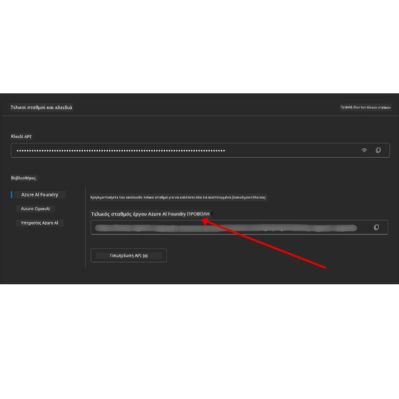

# Ρύθμιση Μαθήματος

## Εισαγωγή

Αυτό το μάθημα καλύπτει τον τρόπο εκτέλεσης των δειγμάτων κώδικα αυτού του μαθήματος.

## Συμμετοχή με άλλους μαθητές και Λήψη Βοήθειας

Πριν ξεκινήσετε να κλωνοποιείτε το repo σας, εγγραφείτε στο [κανάλι Discord "AI Agents For Beginners"](https://aka.ms/ai-agents/discord) για να λάβετε οποιαδήποτε βοήθεια στη ρύθμιση, οποιεσδήποτε ερωτήσεις σχετικά με το μάθημα ή για να συνδεθείτε με άλλους μαθητές.

## Κλωνοποίηση ή Fork αυτού του Repo

Για να ξεκινήσετε, παρακαλώ κλωνοποιήστε ή κάντε fork το GitHub Repository. Αυτό θα δημιουργήσει τη δική σας έκδοση του υλικού του μαθήματος ώστε να μπορείτε να εκτελείτε, να δοκιμάζετε και να προσαρμόζετε τον κώδικα!

This can be done by clicking the link to <a href="https://github.com/microsoft/ai-agents-for-beginners/fork" target="_blank">κάντε fork το αποθετήριο</a>

Θα πρέπει τώρα να έχετε τη δική σας εκδοχή αυτού του μαθήματος (fork) στον παρακάτω σύνδεσμο:


### Επιφανειακή Κλωνοποίηση (συνιστάται για εργαστήριο / Codespaces)

  > Το πλήρες αποθετήριο μπορεί να είναι μεγάλο (~3 GB) όταν κατεβάσετε ολόκληρο το ιστορικό και όλα τα αρχεία. Εάν παρακολουθείτε μόνο το εργαστήριο ή χρειάζεστε μόνο μερικούς φακέλους μαθημάτων, μια επιφανειακή κλωνοποίηση (ή μια sparse κλωνοποίηση) αποφεύγει το μεγαλύτερο μέρος αυτής της λήψης περιορίζοντας το ιστορικό και/ή παραλείποντας blobs.

#### Γρήγορη επιφανειακή κλωνοποίηση — ελάχιστο ιστορικό, όλα τα αρχεία

Replace `<your-username>` in the below commands with your fork URL (or the upstream URL if you prefer).

To clone only the latest commit history (small download):

```bash|powershell
git clone --depth 1 https://github.com/<your-username>/ai-agents-for-beginners.git
```

To clone a specific branch:

```bash|powershell
git clone --depth 1 --branch <branch-name> https://github.com/<your-username>/ai-agents-for-beginners.git
```

#### Μερική (sparse) κλωνοποίηση — ελάχιστα blobs + μόνο επιλεγμένοι φάκελοι

This uses partial clone and sparse-checkout (requires Git 2.25+ and recommended modern Git with partial clone support):

```bash|powershell
git clone --depth 1 --filter=blob:none --sparse https://github.com/<your-username>/ai-agents-for-beginners.git
```

Traverse into the repo folder:

```bash|powershell
cd ai-agents-for-beginners
```

Then specify which folders you want (example below shows two folders):

```bash|powershell
git sparse-checkout set 00-course-setup 01-intro-to-ai-agents
```

After cloning and verifying the files, if you only need files and want to free space (no git history), please delete the repository metadata (💀μη αναστρέψιμο — θα χάσετε όλη τη λειτουργικότητα Git: no commits, pulls, pushes, or history access).

```bash
# zsh/bash
rm -rf .git
```

```powershell
# PowerShell
Remove-Item -Recurse -Force .git
```

#### Χρήση GitHub Codespaces (συνιστάται για αποφυγή μεγάλων τοπικών λήψεων)

- Create a new Codespace for this repo via the [διεπαφή GitHub](https://github.com/codespaces).  

- In the terminal of the newly created codespace, run one of the shallow/sparse clone commands above to bring only the lesson folders you need into the Codespace workspace.
- Optional: after cloning inside Codespaces, remove .git to reclaim extra space (see removal commands above).
- Note: If you prefer to open the repo directly in Codespaces (without an extra clone), be aware Codespaces will construct the devcontainer environment and may still provision more than you need. Cloning a shallow copy inside a fresh Codespace gives you more control over disk usage.

#### Συμβουλές

- Always replace the clone URL with your fork if you want to edit/commit.
- If you later need more history or files, you can fetch them or adjust sparse-checkout to include additional folders.

## Εκτέλεση του Κώδικα

Αυτό το μάθημα προσφέρει μια σειρά Jupyter Notebook που μπορείτε να εκτελέσετε για να αποκτήσετε πρακτική εμπειρία στην κατασκευή AI Agents.

The code samples use **Microsoft Agent Framework (MAF)** with the `AzureAIProjectAgentProvider`, which connects to **Azure AI Agent Service V2** (the Responses API) through **Microsoft Foundry**.

All Python notebooks are labelled `*-python-agent-framework.ipynb`.

## Απαιτήσεις

- Python 3.12+
  - **ΣΗΜΕΙΩΣΗ**: Εάν δεν έχετε εγκαταστήσει Python3.12, φροντίστε να το εγκαταστήσετε. Στη συνέχεια δημιουργήστε το venv σας χρησιμοποιώντας python3.12 για να εξασφαλίσετε ότι οι σωστές εκδόσεις θα εγκατασταθούν από το αρχείο requirements.txt.
  
    >Παράδειγμα

    Create Python venv directory:

    ```bash|powershell
    python -m venv venv
    ```

    Then activate venv environment for:

    ```bash
    # zsh/bash
    source venv/bin/activate
    ```
  
    ```dos
    # Command Prompt for Windows
    venv\Scripts\activate
    ```

- .NET 10+: Για τα δείγματα κώδικα που χρησιμοποιούν .NET, βεβαιωθείτε ότι έχετε εγκαταστήσει το [.NET 10 SDK](https://dotnet.microsoft.com/download/dotnet/10.0) ή νεότερο. Στη συνέχεια, ελέγξτε την εγκατεστημένη έκδοση .NET SDK:

    ```bash|powershell
    dotnet --list-sdks
    ```

- **Azure CLI** — Απαιτείται για τον έλεγχο ταυτότητας. Εγκαταστήστε από [aka.ms/installazurecli](https://aka.ms/installazurecli).
- **Azure Subscription** — Για πρόσβαση στο Microsoft Foundry και στην Azure AI Agent Service.
- **Microsoft Foundry Project** — Ένα έργο με αναπτυγμένο μοντέλο (π.χ., `gpt-4o`). Δείτε: [Βήμα 1](../../../00-course-setup) παρακάτω.

We have included a `requirements.txt` file in the root of this repository that contains all the required Python packages to run the code samples.

You can install them by running the following command in your terminal at the root of the repository:

```bash|powershell
pip install -r requirements.txt
```

We recommend creating a Python virtual environment to avoid any conflicts and issues.

## Ρύθμιση VSCode

Make sure that you are using the right version of Python in VSCode.


## Ρύθμιση Microsoft Foundry και Azure AI Agent Service

### Βήμα 1: Δημιουργία έργου Microsoft Foundry

You need an Azure AI Foundry **hub** and **project** with a deployed model to run the notebooks.

1. Go to [ai.azure.com](https://ai.azure.com) and sign in with your Azure account.
2. Create a **hub** (or use an existing one). See: [Hub resources overview](https://learn.microsoft.com/azure/ai-foundry/concepts/ai-resources).
3. Inside the hub, create a **project**.
4. Deploy a model (e.g., `gpt-4o`) from **Models + Endpoints** → **Deploy model**.

### Βήμα 2: Ανάκτηση του Endpoint του Έργου σας και του Ονόματος Ανάπτυξης Μοντέλου

From your project in the Microsoft Foundry portal:

- **Project Endpoint** — Go to the **Overview** page and copy the endpoint URL.



- **Model Deployment Name** — Go to **Models + Endpoints**, select your deployed model, and note the **Deployment name** (e.g., `gpt-4o`).

### Βήμα 3: Συνδεθείτε στο Azure με `az login`

All notebooks use **`AzureCliCredential`** for authentication — no API keys to manage. This requires you to be signed in via the Azure CLI.

1. **Install the Azure CLI** if you haven't already: [aka.ms/installazurecli](https://aka.ms/installazurecli)

2. **Sign in** by running:

    ```bash|powershell
    az login
    ```

    Or if you're in a remote/Codespace environment without a browser:

    ```bash|powershell
    az login --use-device-code
    ```

3. **Select your subscription** if prompted — choose the one containing your Foundry project.

4. **Verify** you're signed in:

    ```bash|powershell
    az account show
    ```

> **Γιατί `az login`;** Τα σημειωματάρια αυθεντικοποιούνται χρησιμοποιώντας το `AzureCliCredential` από το πακέτο `azure-identity`. Αυτό σημαίνει ότι η συνεδρία Azure CLI παρέχει τα διαπιστευτήρια — κανένα API key ή μυστικό στο αρχείο `.env`. Αυτή είναι μια [βελτιστή πρακτική ασφαλείας](https://learn.microsoft.com/azure/developer/ai/keyless-connections).

### Βήμα 4: Δημιουργήστε το αρχείο `.env` σας

Copy the example file:

```bash
# zsh/bash
cp .env.example .env
```

```powershell
# PowerShell
Copy-Item .env.example .env
```

Open `.env` and fill in these two values:

```env
AZURE_AI_PROJECT_ENDPOINT=https://<your-project>.services.ai.azure.com/api/projects/<your-project-id>
AZURE_AI_MODEL_DEPLOYMENT_NAME=gpt-4o
```

| Variable | Where to find it |
|----------|-----------------|
| `AZURE_AI_PROJECT_ENDPOINT` | Πύλη Foundry → το έργο σας → σελίδα **Επισκόπηση** |
| `AZURE_AI_MODEL_DEPLOYMENT_NAME` | Πύλη Foundry → **Models + Endpoints** → το όνομα του αναπτυγμένου μοντέλου σας |

That's it for most lessons! The notebooks will authenticate automatically through your `az login` session.

### Βήμα 5: Εγκαταστήστε τις Εξαρτήσεις Python

```bash|powershell
pip install -r requirements.txt
```

We recommend running this inside the virtual environment you created earlier.

## Επιπλέον Ρύθμιση για το Μάθημα 5 (Agentic RAG)

Lesson 5 uses **Azure AI Search** for retrieval-augmented generation. If you plan to run that lesson, add these variables to your `.env` file:

| Variable | Where to find it |
|----------|-----------------|
| `AZURE_SEARCH_SERVICE_ENDPOINT` | Azure portal → your **Azure AI Search** resource → **Overview** → URL |
| `AZURE_SEARCH_API_KEY` | Azure portal → your **Azure AI Search** resource → **Settings** → **Keys** → primary admin key |

## Επιπλέον Ρύθμιση για τα Μαθήματα 6 και 8 (GitHub Models)

Some notebooks in lessons 6 and 8 use **GitHub Models** instead of Azure AI Foundry. If you plan to run those samples, add these variables to your `.env` file:

| Variable | Where to find it |
|----------|-----------------|
| `GITHUB_TOKEN` | GitHub → **Settings** → **Developer settings** → **Personal access tokens** |
| `GITHUB_ENDPOINT` | Use `https://models.inference.ai.azure.com` (default value) |
| `GITHUB_MODEL_ID` | Model name to use (e.g. `gpt-4o-mini`) |

## Επιπλέον Ρύθμιση για το Μάθημα 8 (Bing Grounding Workflow)

The conditional workflow notebook in lesson 8 uses **Bing grounding** via Azure AI Foundry. If you plan to run that sample, add this variable to your `.env` file:

| Variable | Where to find it |
|----------|-----------------|
| `BING_CONNECTION_ID` | Azure AI Foundry portal → your project → **Management** → **Connected resources** → your Bing connection → copy the connection ID |

## Αντιμετώπιση Προβλημάτων

### Σφάλματα Επαλήθευσης Πιστοποιητικών SSL σε macOS

If you are on macOS and encounter an error like:

```plaintext
ssl.SSLCertVerificationError: [SSL: CERTIFICATE_VERIFY_FAILED] certificate verify failed: self-signed certificate in certificate chain
```

This is a known issue with Python on macOS where the system SSL certificates are not automatically trusted. Try the following solutions in order:

**Επιλογή 1: Εκτελέστε το σενάριο Install Certificates του Python (συνιστάται)**

```bash
# Αντικαταστήστε το 3.XX με την εγκατεστημένη έκδοση Python σας (π.χ. 3.12 ή 3.13):
/Applications/Python\ 3.XX/Install\ Certificates.command
```

**Επιλογή 2: Χρησιμοποιήστε `connection_verify=False` στο σημειωματάριό σας (μόνο για τα σημειωματάρια GitHub Models)**

In the Lesson 6 notebook (`06-building-trustworthy-agents/code_samples/06-system-message-framework.ipynb`), a commented-out workaround is already included. Uncomment `connection_verify=False` when creating the client:

```python
client = ChatCompletionsClient(
    endpoint=endpoint,
    credential=AzureKeyCredential(token),
    connection_verify=False,  # Απενεργοποιήστε την επαλήθευση SSL εάν αντιμετωπίζετε σφάλματα πιστοποιητικού
)
```

> **⚠️ Προειδοποίηση:** Η απενεργοποίηση της επαλήθευσης SSL (`connection_verify=False`) μειώνει την ασφάλεια παραλείποντας την επικύρωση πιστοποιητικών. Χρησιμοποιήστε το αυτό μόνο ως προσωρινή λύση στο περιβάλλον ανάπτυξης, ποτέ σε παραγωγή.

**Επιλογή 3: Εγκαταστήστε και χρησιμοποιήστε `truststore`**

```bash
pip install truststore
```

Then add the following at the top of your notebook or script before making any network calls:

```python
import truststore
truststore.inject_into_ssl()
```

## Κολλήσατε Κάπου;

If you have any issues running this setup, hop into our <a href="https://discord.gg/kzRShWzttr" target="_blank">Κοινότητα Azure AI στο Discord</a> or <a href="https://github.com/microsoft/ai-agents-for-beginners/issues?WT.mc_id=academic-105485-koreyst" target="_blank">δημιουργήστε ένα issue</a>.

## Επόμενο Μάθημα

You are now ready to run the code for this course. Happy learning more about the world of AI Agents! 

[Εισαγωγή στους AI Agents και Περιπτώσεις Χρήσης Agents](../01-intro-to-ai-agents/README.md)

---

<!-- CO-OP TRANSLATOR DISCLAIMER START -->
Αποποίηση ευθύνης:
Το παρόν έγγραφο έχει μεταφραστεί χρησιμοποιώντας την υπηρεσία μετάφρασης με τεχνητή νοημοσύνη [Co-op Translator](https://github.com/Azure/co-op-translator). Παρά τις προσπάθειές μας για ακρίβεια, να έχετε υπόψη ότι οι αυτοματοποιημένες μεταφράσεις ενδέχεται να περιέχουν λάθη ή ανακρίβειες. Το πρωτότυπο έγγραφο στη γλώσσα του πρέπει να θεωρείται η επίσημη πηγή. Για κρίσιμες πληροφορίες, συνιστάται επαγγελματική μετάφραση από άνθρωπο. Δεν φέρουμε ευθύνη για τυχόν παρεξηγήσεις ή λανθασμένες ερμηνείες που προκύπτουν από τη χρήση αυτής της μετάφρασης.
<!-- CO-OP TRANSLATOR DISCLAIMER END -->