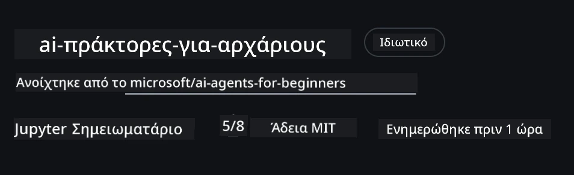
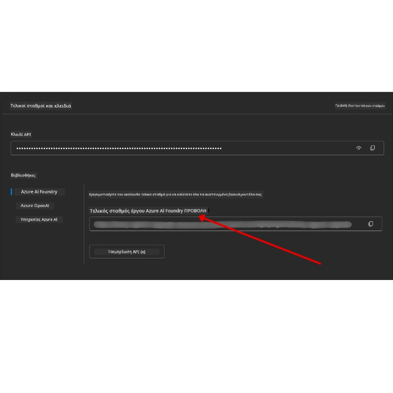

# Ρύθμιση Μαθήματος

## Εισαγωγή

Αυτό το μάθημα θα καλύψει τον τρόπο εκτέλεσης των παραδειγμάτων κώδικα αυτού του μαθήματος.

## Ενταχθείτε σε Άλλους Μαθητές και Λάβετε Βοήθεια

Πριν ξεκινήσετε να κλωνοποιείτε το αποθετήριο σας, ενταχθείτε στο [κανάλι Discord AI Agents For Beginners](https://aka.ms/ai-agents/discord) για να λάβετε βοήθεια με τη ρύθμιση, οποιεσδήποτε ερωτήσεις σχετικά με το μάθημα ή για να συνδεθείτε με άλλους μαθητές.

## Κλωνοποίηση ή Fork αυτού του Repo

Για να ξεκινήσετε, παρακαλώ κλωνοποιήστε ή κάντε fork το GitHub Αποθετήριο. Αυτό θα δημιουργήσει τη δική σας έκδοση του υλικού του μαθήματος ώστε να μπορείτε να εκτελείτε, να δοκιμάζετε και να τροποποιείτε τον κώδικα!

Αυτό γίνεται κάνοντας κλικ στο σύνδεσμο για <a href="https://github.com/microsoft/ai-agents-for-beginners/fork" target="_blank">fork του repo</a>

Τώρα θα πρέπει να έχετε τη δική σας έκδοση fork αυτού του μαθήματος στον ακόλουθο σύνδεσμο:



### Shallow Clone (συνιστάται για εργαστήριο / Codespaces)

  >Το πλήρες αποθετήριο μπορεί να είναι μεγάλο (~3 GB) όταν κάνετε λήψη ολόκληρου του ιστορικού και όλων των αρχείων. Αν παρακολουθείτε μόνο το εργαστήριο ή χρειάζεστε μόνο μερικούς φακέλους μαθημάτων, ένα shallow clone (ή sparse clone) αποφεύγει το μεγαλύτερο μέρος της λήψης περικόπτοντας το ιστορικό και/ή παραλείποντας blobs.

#### Γρήγορο shallow clone — ελάχιστο ιστορικό, όλα τα αρχεία

Αντικαταστήστε το `<your-username>` στις παρακάτω εντολές με το URL του fork σας (ή το upstream URL αν προτιμάτε).

Για κλωνοποίηση μόνο του τελευταίου ιστορικού commit (μικρή λήψη):

```bash|powershell
git clone --depth 1 https://github.com/<your-username>/ai-agents-for-beginners.git
```

Για κλωνοποίηση συγκεκριμένου κλαδιού:

```bash|powershell
git clone --depth 1 --branch <branch-name> https://github.com/<your-username>/ai-agents-for-beginners.git
```

#### Μερική (sparse) κλωνοποίηση — ελάχιστα blobs + μόνο επιλεγμένοι φάκελοι

Αυτό χρησιμοποιεί μερική κλωνοποίηση και sparse-checkout (απαιτεί Git 2.25+ και συνιστάται σύγχρονο Git με υποστήριξη μερικής κλωνοποίησης):

```bash|powershell
git clone --depth 1 --filter=blob:none --sparse https://github.com/<your-username>/ai-agents-for-beginners.git
```

Πλοηγηθείτε στο φάκελο του repo:

```bash|powershell
cd ai-agents-for-beginners
```

Έπειτα καθορίστε ποιοι φάκελοι θέλετε (το παράδειγμα δείχνει δύο φακέλους):

```bash|powershell
git sparse-checkout set 00-course-setup 01-intro-to-ai-agents
```

Μετά την κλωνοποίηση και την επαλήθευση των αρχείων, αν χρειάζεστε μόνο τα αρχεία και θέλετε να απελευθερώσετε χώρο (χωρίς ιστορικό git), παρακαλώ διαγράψτε τα μεταδεδομένα του αποθετηρίου (💀ανεπαναλήπτο — θα χάσετε όλη τη λειτουργικότητα Git: όχι commits, pulls, pushes ή πρόσβαση στο ιστορικό).

```bash
# zsh/bash
rm -rf .git
```

```powershell
# PowerShell
Remove-Item -Recurse -Force .git
```

#### Χρήση GitHub Codespaces (συνιστάται για αποφυγή τοπικών μεγάλων λήψεων)

- Δημιουργήστε έναν νέο Codespace για αυτό το repo μέσω της [GitHub UI](https://github.com/codespaces).  

- Στο τερματικό του νέου Codespace, εκτελέστε μια από τις εντολές shallow/sparse clone παραπάνω για να φέρετε μόνο τους φακέλους μαθημάτων που χρειάζεστε στο χώρο εργασίας του Codespace.
- Προαιρετικό: μετά την κλωνοποίηση μέσα σε Codespaces, αφαιρέστε το .git για να ανακτήσετε επιπλέον χώρο (βλέπε εντολές αφαίρεσης παραπάνω).
- Σημείωση: Αν προτιμάτε να ανοίξετε το repo απευθείας σε Codespaces (χωρίς επιπλέον κλωνοποίηση), να γνωρίζετε ότι τα Codespaces θα κατασκευάσουν το περιβάλλον devcontainer και μπορεί να προμηθεύσουν περισσότερα από όσα χρειάζεστε. Η κλωνοποίηση ενός shallow αντιγράφου μέσα σε ένα νέο Codespace σας δίνει καλύτερο έλεγχο στη χρήση δίσκου.

#### Συμβουλές

- Πάντα αντικαθιστάτε το URL κλωνοποίησης με το fork σας αν θέλετε να επεξεργαστείτε/κάνετε commit.
- Αν αργότερα χρειαστείτε περισσότερο ιστορικό ή αρχεία, μπορείτε να τα κατεβάσετε ή να προσαρμόσετε το sparse-checkout για να συμπεριλάβετε επιπλέον φακέλους.

## Εκτέλεση του Κώδικα

Αυτό το μάθημα προσφέρει μια σειρά από Jupyter Notebooks που μπορείτε να εκτελέσετε για πρακτική εμπειρία στην κατασκευή AI Agents.

Τα παραδείγματα κώδικα χρησιμοποιούν **Microsoft Agent Framework (MAF)** με τον `FoundryChatClient`, που συνδέεται με την **Microsoft Foundry Agent Service V2** (το API Απαντήσεων) μέσω **Microsoft Foundry**.

Όλα τα Python notebooks έχουν την ετικέτα `*-python-agent-framework.ipynb`.

## Απαιτήσεις

- Python 3.12+
  - **ΣΗΜΕΙΩΣΗ**: Αν δεν έχετε εγκαταστήσει Python3.12, βεβαιωθείτε ότι την εγκαθιστάτε. Έπειτα δημιουργήστε το venv χρησιμοποιώντας python3.12 για να εξασφαλίσετε ότι οι σωστές εκδόσεις εγκαθίστανται από το αρχείο requirements.txt.
  
    >Παράδειγμα

    Δημιουργήστε τον κατάλογο Python venv:

    ```bash|powershell
    python -m venv venv
    ```

    Έπειτα ενεργοποιήστε το περιβάλλον venv για:

    ```bash
    # zsh/bash
    source venv/bin/activate
    ```
  
    ```dos
    # Command Prompt for Windows
    venv\Scripts\activate
    ```

- .NET 10+: Για τα παραδείγματα κώδικα που χρησιμοποιούν .NET, βεβαιωθείτε ότι έχετε εγκαταστήσει [.NET 10 SDK](https://dotnet.microsoft.com/download/dotnet/10.0) ή νεότερο. Έπειτα, ελέγξτε την εγκατεστημένη έκδοση του .NET SDK:

    ```bash|powershell
    dotnet --list-sdks
    ```

- **Azure CLI** — Απαραίτητο για αυθεντικοποίηση. Εγκαταστήστε το από [aka.ms/installazurecli](https://aka.ms/installazurecli).
- **Azure Subscription** — Για πρόσβαση στο Microsoft Foundry και Microsoft Foundry Agent Service.
- **Microsoft Foundry Project** — Ένα έργο με αναπτυγμένο μοντέλο (π.χ., `gpt-4o`). Δείτε [Βήμα 1](#βήμα-1-δημιουργία-έργου-microsoft-foundry) παρακάτω.

Έχουμε συμπεριλάβει ένα αρχείο `requirements.txt` στη ριζική δομή αυτού του αποθετηρίου που περιέχει όλα τα απαιτούμενα πακέτα Python για να τρέξετε τα παραδείγματα κώδικα.

Μπορείτε να τα εγκαταστήσετε εκτελώντας την ακόλουθη εντολή στο τερματικό σας στη ρίζα του αποθετηρίου:

```bash|powershell
pip install -r requirements.txt
```

Συνιστούμε να δημιουργήσετε ένα εικονικό περιβάλλον Python για να αποφύγετε οποιεσδήποτε συγκρούσεις και προβλήματα.

## Ρύθμιση VSCode

Βεβαιωθείτε ότι χρησιμοποιείτε τη σωστή έκδοση του Python στο VSCode.


## Ρύθμιση Microsoft Foundry και Microsoft Foundry Agent Service

### Βήμα 1: Δημιουργία Έργου Microsoft Foundry

Χρειάζεστε έναν **hub** και ένα **project** στο Microsoft Foundry με αναπτυγμένο μοντέλο για να τρέξετε τα notebooks.

1. Μεταβείτε στο [ai.azure.com](https://ai.azure.com) και συνδεθείτε με το λογαριασμό Azure σας.
2. Δημιουργήστε έναν **hub** (ή χρησιμοποιήστε έναν υπάρχοντα). Δείτε: [Επισκόπηση πόρων Hub](https://learn.microsoft.com/azure/ai-foundry/concepts/ai-resources).
3. Μέσα στον hub, δημιουργήστε ένα **project**.
4. Αναπτύξτε ένα μοντέλο (π.χ., `gpt-4o`) από **Models + Endpoints** → **Deploy model**.

### Βήμα 2: Ανάκτηση του Endpoint του Έργου σας και Ονόματος Ανάπτυξης Μοντέλου

Από το project σας στην πύλη Microsoft Foundry:

- **Project Endpoint** — Μεταβείτε στη σελίδα **Overview** και αντιγράψτε το URL του endpoint.



- **Model Deployment Name** — Μεταβείτε σε **Models + Endpoints**, επιλέξτε το αναπτυγμένο μοντέλο σας, και σημειώστε το **Deployment name** (π.χ., `gpt-4o`).

### Βήμα 3: Σύνδεση στο Azure με `az login`

Όλα τα notebooks χρησιμοποιούν **`AzureCliCredential`** για αυθεντικοποίηση — χωρίς API κλειδιά για διαχείριση. Αυτό απαιτεί να είστε συνδεδεμένοι μέσω του Azure CLI.

1. **Εγκαταστήστε το Azure CLI** αν δεν το έχετε ήδη: [aka.ms/installazurecli](https://aka.ms/installazurecli)

2. **Συνδεθείτε** εκτελώντας:

    ```bash|powershell
    az login
    ```

    Ή αν βρίσκεστε σε απομακρυσμένο περιβάλλον/Codespace χωρίς πρόγραμμα περιήγησης:

    ```bash|powershell
    az login --use-device-code
    ```

3. **Επιλέξτε τη συνδρομή σας** αν σας ζητηθεί — επιλέξτε αυτή που περιέχει το project Foundry σας.

4. **Επαληθεύστε** ότι έχετε συνδεθεί:

    ```bash|powershell
    az account show
    ```

> **Γιατί `az login`;** Τα notebooks αυθεντικοποιούνται μέσω `AzureCliCredential` από το πακέτο `azure-identity`. Αυτό σημαίνει ότι η συνεδρία Azure CLI παρέχει τα διαπιστευτήρια — δεν απαιτούνται API κλειδιά ή μυστικά στο αρχείο `.env`. Αυτή είναι μια [καλύτερη πρακτική ασφάλειας](https://learn.microsoft.com/azure/developer/ai/keyless-connections).

### Βήμα 4: Δημιουργήστε το Αρχείο `.env` σας

Αντιγράψτε το αρχείο παράδειγμα:

```bash
# zsh/bash
cp .env.example .env
```

```powershell
# PowerShell
Copy-Item .env.example .env
```

Ανοίξτε το `.env` και συμπληρώστε αυτές τις δύο τιμές:

```env
AZURE_AI_PROJECT_ENDPOINT=https://<your-project>.services.ai.azure.com/api/projects/<your-project-id>
AZURE_AI_MODEL_DEPLOYMENT_NAME=gpt-4o
```

| Μεταβλητή | Πού να τη βρείτε |
|----------|-----------------|
| `AZURE_AI_PROJECT_ENDPOINT` | Πύλη Foundry → το έργο σας → σελίδα **Overview** |
| `AZURE_AI_MODEL_DEPLOYMENT_NAME` | Πύλη Foundry → **Models + Endpoints** → όνομα αναπτυγμένου μοντέλου |

Αυτό είναι όλο για τα περισσότερα μαθήματα! Τα notebooks θα αυθεντικοποιούνται αυτόματα μέσω της συνεδρίας `az login`.

### Βήμα 5: Εγκαταστήστε τις Εξαρτήσεις Python

```bash|powershell
pip install -r requirements.txt
```

Συνιστούμε να τρέξετε αυτό μέσα στο εικονικό περιβάλλον που δημιουργήσατε νωρίτερα.

## Πρόσθετη Ρύθμιση για το Μάθημα 5 (Agentic RAG)

Το μάθημα 5 χρησιμοποιεί **Azure AI Search** για απάντηση με ενισχυμένη ανάκτηση. Αν σκοπεύετε να τρέξετε αυτό το μάθημα, προσθέστε αυτές τις μεταβλητές στο αρχείο `.env` σας:

| Μεταβλητή | Πού να τη βρείτε |
|----------|-----------------|
| `AZURE_SEARCH_SERVICE_ENDPOINT` | Πύλη Azure → το πόρος **Azure AI Search** → **Overview** → URL |
| `AZURE_SEARCH_API_KEY` | Πύλη Azure → το πόρος **Azure AI Search** → **Settings** → **Keys** → κύριο κλειδί διαχειριστή |

## Πρόσθετη Ρύθμιση για Μαθήματα που Καλούν το Azure OpenAI Άμεσα (Μαθήματα 6 και 8)

Ορισμένα notebooks στα μαθήματα 6 και 8 καλούν το **Azure OpenAI** απευθείας (χρησιμοποιώντας το **Responses API**) αντί να περάσουν από έργο Microsoft Foundry. Αυτά τα δείγματα χρησιμοποιούσαν προηγουμένως GitHub Models, που είναι αποσυρμένα (λήξη Ιουλίου 2026) και δεν υποστηρίζουν το Responses API. Αν σκοπεύετε να τρέξετε αυτά τα δείγματα, προσθέστε τις παρακάτω μεταβλητές στο αρχείο `.env` σας:

| Μεταβλητή | Πού να τη βρείτε |
|----------|-----------------|
| `AZURE_OPENAI_ENDPOINT` | Πύλη Azure → το πόρος **Azure OpenAI** → **Keys and Endpoint** → Endpoint (π.χ. `https://<your-resource>.openai.azure.com`) |
| `AZURE_OPENAI_DEPLOYMENT` | Το όνομα του αναπτυγμένου μοντέλου σας (π.χ. `gpt-4o-mini`) που υποστηρίζει το Responses API |
| `AZURE_OPENAI_API_KEY` | Προαιρετικό — μόνο αν χρησιμοποιείτε αυθεντικοποίηση βασισμένη σε κλειδί αντί του `az login` / Entra ID |

> Το Responses API χρησιμοποιεί το σταθερό endpoint `/openai/v1/`, οπότε δεν απαιτείται `api-version`. Συνδεθείτε με `az login` για να χρησιμοποιήσετε αυθεντικοποίηση keyless Entra ID.

## Εναλλακτικός Πάροχος: MiniMax (Συμβατό με OpenAI)

Το [MiniMax](https://platform.minimaxi.com/) παρέχει μοντέλα μεγάλης χωρητικότητας (έως 204K tokens) μέσω συμβατού API με το OpenAI. Εφόσον ο `OpenAIChatClient` του Microsoft Agent Framework λειτουργεί με οποιοδήποτε συμβατό endpoint OpenAI, μπορείτε να χρησιμοποιήσετε το MiniMax ως εναλλακτική λύση στον Azure OpenAI ή OpenAI.

Προσθέστε αυτές τις μεταβλητές στο αρχείο `.env` σας:

| Μεταβλητή | Πού να τη βρείτε |
|----------|-----------------|
| `MINIMAX_API_KEY` | [MiniMax Platform](https://platform.minimaxi.com/) → API Keys |
| `MINIMAX_BASE_URL` | Χρησιμοποιήστε `https://api.minimax.io/v1` (προεπιλεγμένη τιμή) |
| `MINIMAX_MODEL_ID` | Όνομα μοντέλου για χρήση (π.χ., `MiniMax-M3`) |

**Παραδείγματα μοντέλων**: `MiniMax-M3` (συνιστάται), `MiniMax-M2.7`, `MiniMax-M2.7-highspeed` (ταχύτερες απαντήσεις). Τα ονόματα μοντέλων και η διαθεσιμότητα μπορούν να αλλάξουν με την πάροδο του χρόνου και η πρόσβαση σε ένα δεδομένο μοντέλο μπορεί να εξαρτάται από τον λογαριασμό ή την περιοχή σας — ελέγξτε την [MiniMax Platform](https://platform.minimaxi.com/) για τη λίστα. Αν το `MiniMax-M3` δεν είναι διαθέσιμο στον λογαριασμό σας, ορίστε το `MINIMAX_MODEL_ID` σε κάποιο μοντέλο που έχετε πρόσβαση (π.χ. `MiniMax-M2.7`).

Τα παραδείγματα κώδικα που χρησιμοποιούν `OpenAIChatClient` (π.χ., η ροή κράτησης ξενοδοχείου στο Μάθημα 14) θα ανιχνεύουν και θα χρησιμοποιούν αυτόματα τη ρύθμιση MiniMax όταν ο `MINIMAX_API_KEY` έχει οριστεί.

## Εναλλακτικός Πάροχος: Foundry Local (Εκτέλεση Μοντέλων Τοπικά)

Το [Foundry Local](https://foundrylocal.ai) είναι ένα ελαφρύ runtime που κατεβάζει, διαχειρίζεται και εξυπηρετεί μοντέλα γλώσσας **αποκλειστικά στον δικό σας υπολογιστή** μέσω συμβατού με OpenAI API — χωρίς cloud, χωρίς συνδρομή Azure και χωρίς API κλειδιά. Είναι μια εξαιρετική επιλογή για ανάπτυξη εκτός σύνδεσης, πειραματισμούς χωρίς κόστη cloud, ή για να διατηρείτε δεδομένα τοπικά.

Εφόσον ο `OpenAIChatClient` του Microsoft Agent Framework δουλεύει με οποιοδήποτε συμβατό endpoint OpenAI, το Foundry Local αποτελεί τοπική εναλλακτική λύση στον Azure OpenAI.

**1. Εγκαταστήστε το Foundry Local**

```bash
# Windows
winget install Microsoft.FoundryLocal

# macOS
brew install foundrylocal
```

**2. Κατεβάστε και εκτελέστε ένα μοντέλο** (αυτό και ξεκινά την τοπική υπηρεσία):

```bash
foundry model list          # δείτε διαθέσιμα μοντέλα
foundry model run phi-4-mini
```

**3. Εγκαταστήστε το Python SDK** που χρησιμοποιείται για την ανακάλυψη του τοπικού endpoint:

```bash
pip install foundry-local-sdk
```

**4. Στοχεύστε το Microsoft Agent Framework στο τοπικό σας μοντέλο:**

```python
from foundry_local import FoundryLocalManager
from agent_framework.openai import OpenAIChatClient

# Κατεβάζει (αν χρειάζεται) και εξυπηρετεί το μοντέλο τοπικά, στη συνέχεια εντοπίζει το σημείο πρόσβασης/θύρα.
manager = FoundryLocalManager("phi-4-mini")

chat_client = OpenAIChatClient(
    base_url=manager.endpoint,      # π.χ. http://localhost:<port>/v1
    api_key=manager.api_key,        # πάντα "μη απαραίτητο" για το Foundry Local
    model_id=manager.get_model_info("phi-4-mini").id,
)

agent = chat_client.as_agent(
    name="LocalAgent",
    instructions="You are a helpful assistant running fully on-device.",
)
```

> **Σημείωση:** Το Foundry Local προσφέρει ένα συμβατό με OpenAI endpoint **Chat Completions**. Χρησιμοποιήστε το για τοπική ανάπτυξη και σενάρια εκτός σύνδεσης. Για το πλήρες σύνολο χαρακτηριστικών του **Responses API** (καταστάσεις συνομιλιών, σύνθετη ορχήστρα εργαλείων και ανάπτυξη τύπου agent), στοχεύστε στο **Azure OpenAI** ή σε **Microsoft Foundry** project όπως δείχνεται στα μαθήματα. Δείτε την [τεκμηρίωση Foundry Local](https://foundrylocal.ai) για τον τρέχοντα κατάλογο μοντέλων και υποστήριξη πλατφόρμας.

## Πρόσθετη Ρύθμιση για το Μάθημα 8 (Ροή Εργασίας Bing Grounding)
Το σημειωματάριο με το conditional workflow στο μάθημα 8 χρησιμοποιεί **Bing grounding** μέσω του Microsoft Foundry. Αν σκοπεύετε να εκτελέσετε αυτό το παράδειγμα, προσθέστε αυτήν την μεταβλητή στο αρχείο `.env` σας:

| Μεταβλητή | Πού να την βρείτε |
|----------|-----------------|
| `BING_CONNECTION_ID` | Πύλη Microsoft Foundry → το έργο σας → **Διαχείριση** → **Συνδεδεμένοι πόροι** → η σύνδεση Bing σας → αντιγράψτε το αναγνωριστικό σύνδεσης |

## Αντιμετώπιση προβλημάτων

### Σφάλματα επαλήθευσης πιστοποιητικού SSL στο macOS

Αν χρησιμοποιείτε macOS και αντιμετωπίζετε σφάλμα όπως:

```plaintext
ssl.SSLCertVerificationError: [SSL: CERTIFICATE_VERIFY_FAILED] certificate verify failed: self-signed certificate in certificate chain
```

Αυτό είναι ένα γνωστό ζήτημα με την Python σε macOS όπου τα πιστοποιητικά SSL του συστήματος δεν εμπιστεύονται αυτόματα. Δοκιμάστε τις παρακάτω λύσεις με αυτή τη σειρά:

**Επιλογή 1: Εκτέλεση του script Install Certificates της Python (συνιστάται)**

```bash
# Αντικαταστήστε το 3.XX με την εγκατεστημένη έκδοση Python σας (π.χ., 3.12 ή 3.13):
/Applications/Python\ 3.XX/Install\ Certificates.command
```

**Επιλογή 2: Χρήση `connection_verify=False` στο σημειωματάριό σας (μόνο για σημειωματάρια GitHub Models)**

Στο σημειωματάριο του Μαθήματος 6 (`06-building-trustworthy-agents/code_samples/06-system-message-framework.ipynb`), υπάρχει ήδη ένα σχολιασμένο workaround. Αποσχολιάστε το `connection_verify=False` όταν δημιουργείτε τον πελάτη:

```python
client = ChatCompletionsClient(
    endpoint=endpoint,
    credential=AzureKeyCredential(token),
    connection_verify=False,  # Απενεργοποιήστε την επαλήθευση SSL εάν συναντήσετε σφάλματα πιστοποιητικού
)
```

> **⚠️ Προειδοποίηση:** Η απενεργοποίηση της επαλήθευσης SSL (`connection_verify=False`) μειώνει την ασφάλεια παρακάμπτοντας την επαλήθευση του πιστοποιητικού. Χρησιμοποιήστε το μόνο ως προσωρινή λύση σε περιβάλλοντα ανάπτυξης, ποτέ σε παραγωγή.

**Επιλογή 3: Εγκατάσταση και χρήση του `truststore`**

```bash
pip install truststore
```

Στη συνέχεια προσθέστε τα παρακάτω στην κορυφή του σημειωματάριου ή του script σας πριν κάνετε οποιαδήποτε κλήση δικτύου:

```python
import truststore
truststore.inject_into_ssl()
```

## Έχετε κολλήσει κάπου;

Αν έχετε κάποιο πρόβλημα με την εκτέλεση αυτής της ρύθμισης, μπείτε στην <a href="https://discord.gg/kzRShWzttr" target="_blank">Κοινότητα Azure AI Discord</a> ή <a href="https://github.com/microsoft/ai-agents-for-beginners/issues?WT.mc_id=academic-105485-koreyst" target="_blank">δημιουργήστε ένα θέμα</a>.

## Επόμενο μάθημα

Τώρα είστε έτοιμοι να εκτελέσετε τον κώδικα αυτού του μαθήματος. Καλή μάθηση στον κόσμο των Πρακτόρων Τεχνητής Νοημοσύνης!

[Εισαγωγή στους Πράκτορες AI και Σενάρια Χρήσης Πρακτόρων](../01-intro-to-ai-agents/README.md)

---

<!-- CO-OP TRANSLATOR DISCLAIMER START -->
**Αποποίηση ευθυνών**:
Αυτό το έγγραφο έχει μεταφραστεί χρησιμοποιώντας την υπηρεσία μετάφρασης με τεχνητή νοημοσύνη [Co-op Translator](https://github.com/Azure/co-op-translator). Ενώ επιδιώκουμε την ακρίβεια, παρακαλούμε να έχετε υπόψη ότι οι αυτοματοποιημένες μεταφράσεις ενδέχεται να περιέχουν λάθη ή ανακρίβειες. Το πρωτότυπο έγγραφο στη μητρική του γλώσσα πρέπει να θεωρείται η αυθεντική πηγή. Για κρίσιμες πληροφορίες, συνιστάται επαγγελματική ανθρώπινη μετάφραση. Δεν φέρουμε ευθύνη για τυχόν παρεξηγήσεις ή λανθασμένες ερμηνείες που προκύπτουν από τη χρήση αυτής της μετάφρασης.
<!-- CO-OP TRANSLATOR DISCLAIMER END -->