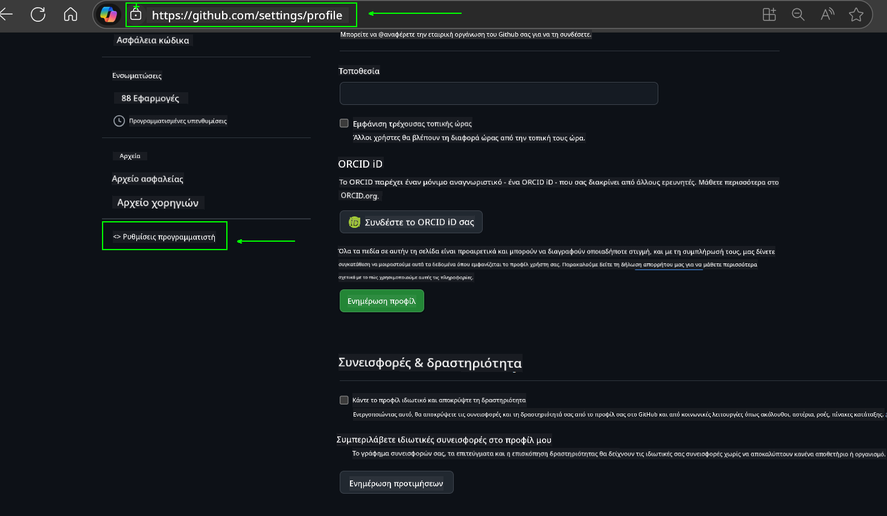
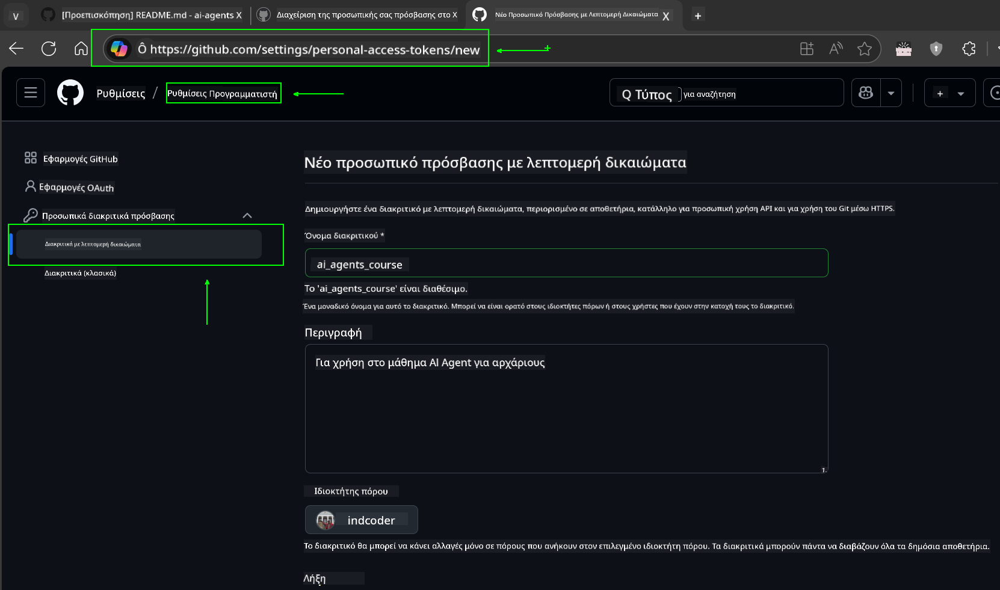
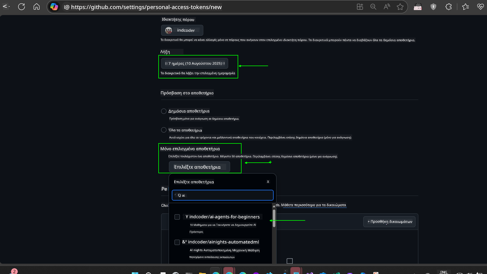
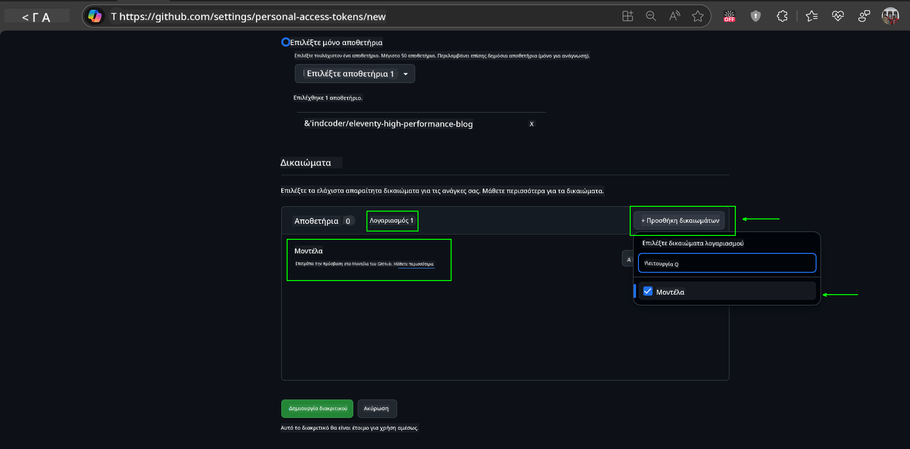
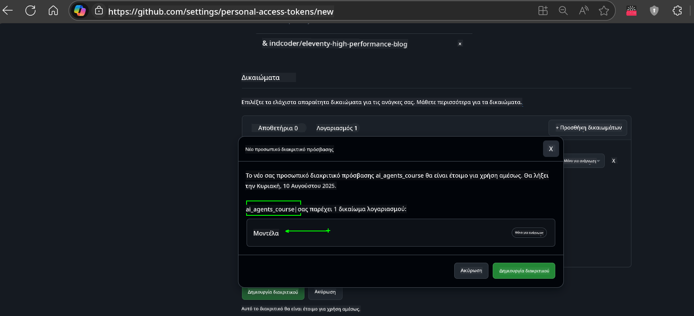
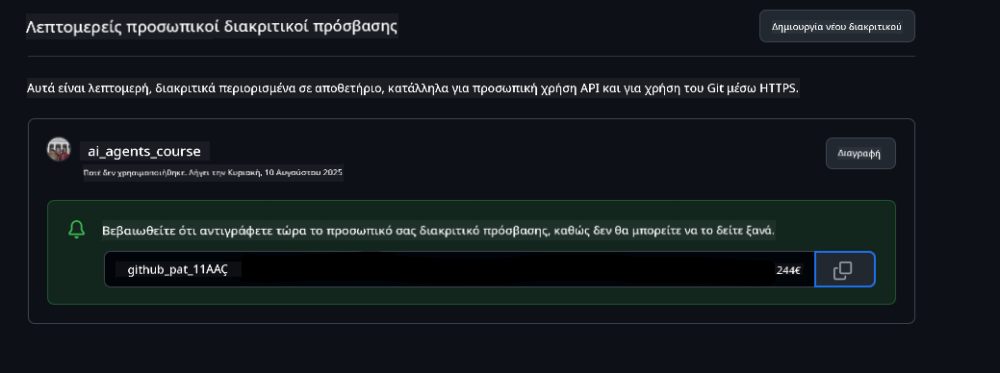
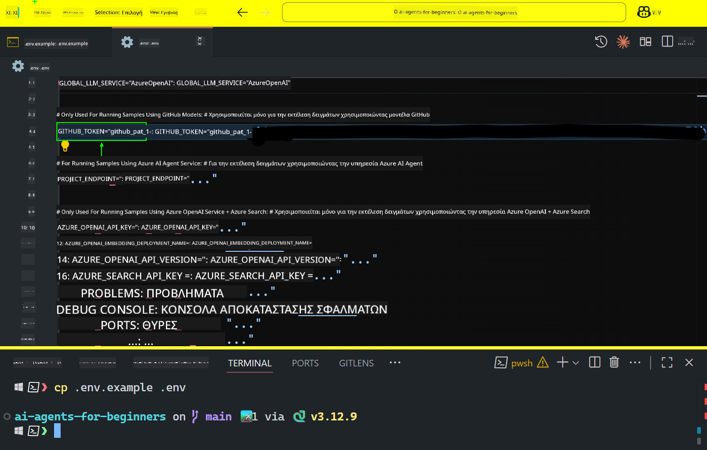

<!--
CO_OP_TRANSLATOR_METADATA:
{
  "original_hash": "96eb7f95375daa3e91778ca0295a55d9",
  "translation_date": "2025-10-15T11:46:58+00:00",
  "source_file": "00-course-setup/README.md",
  "language_code": "el"
}
-->
# Ρύθμιση Μαθήματος

## Εισαγωγή

Αυτό το μάθημα θα καλύψει πώς να εκτελέσετε τα δείγματα κώδικα αυτού του μαθήματος.

## Ελάτε σε Επαφή με Άλλους Μαθητές και Ζητήστε Βοήθεια

Πριν ξεκινήσετε να κλωνοποιείτε το αποθετήριο σας, εγγραφείτε στο [κανάλι Discord AI Agents For Beginners](https://aka.ms/ai-agents/discord) για να λάβετε βοήθεια με τη ρύθμιση, να κάνετε ερωτήσεις σχετικά με το μάθημα ή να συνδεθείτε με άλλους μαθητές.

## Κλωνοποίηση ή Δημιουργία Fork αυτού του Αποθετηρίου

Για να ξεκινήσετε, παρακαλώ κλωνοποιήστε ή δημιουργήστε fork του αποθετηρίου GitHub. Αυτό θα δημιουργήσει τη δική σας έκδοση του υλικού του μαθήματος, ώστε να μπορείτε να εκτελέσετε, να δοκιμάσετε και να τροποποιήσετε τον κώδικα!

Αυτό μπορεί να γίνει κάνοντας κλικ στον σύνδεσμο για <a href="https://github.com/microsoft/ai-agents-for-beginners/fork" target="_blank">δημιουργία fork του αποθετηρίου</a>.

Τώρα θα πρέπει να έχετε τη δική σας έκδοση του μαθήματος στον ακόλουθο σύνδεσμο:


### Κλωνοποίηση με Περιορισμένο Ιστορικό (συνιστάται για εργαστήρια / Codespaces)

  >Το πλήρες αποθετήριο μπορεί να είναι μεγάλο (~3 GB) όταν κατεβάζετε όλο το ιστορικό και όλα τα αρχεία. Εάν παρακολουθείτε μόνο το εργαστήριο ή χρειάζεστε μόνο λίγους φακέλους μαθημάτων, η κλωνοποίηση με περιορισμένο ιστορικό (ή σπάνια κλωνοποίηση) αποφεύγει το μεγαλύτερο μέρος αυτής της λήψης, περιορίζοντας το ιστορικό και/ή παραλείποντας blobs.

#### Γρήγορη κλωνοποίηση με περιορισμένο ιστορικό — ελάχιστο ιστορικό, όλα τα αρχεία

Αντικαταστήστε το `<your-username>` στις παρακάτω εντολές με το URL του fork σας (ή το upstream URL αν προτιμάτε).

Για να κλωνοποιήσετε μόνο το πιο πρόσφατο ιστορικό commit (μικρή λήψη):

```bash|powershell
git clone --depth 1 https://github.com/<your-username>/ai-agents-for-beginners.git
```

Για να κλωνοποιήσετε ένα συγκεκριμένο branch:

```bash|powershell
git clone --depth 1 --branch <branch-name> https://github.com/<your-username>/ai-agents-for-beginners.git
```

#### Μερική (σπάνια) κλωνοποίηση — ελάχιστα blobs + μόνο επιλεγμένοι φάκελοι

Αυτό χρησιμοποιεί μερική κλωνοποίηση και sparse-checkout (απαιτεί Git 2.25+ και συνιστάται σύγχρονο Git με υποστήριξη μερικής κλωνοποίησης):

```bash|powershell
git clone --depth 1 --filter=blob:none --sparse https://github.com/<your-username>/ai-agents-for-beginners.git
```

Μεταβείτε στον φάκελο του αποθετηρίου:

Για bash:

```bash
cd ai-agents-for-beginners
```

Για Powershell:

```powershell
Set-Location ai-agents-for-beginners
```

Στη συνέχεια, καθορίστε ποιους φακέλους θέλετε (το παράδειγμα παρακάτω δείχνει δύο φακέλους):

```bash|powershell
git sparse-checkout set 00-course-setup 01-intro-to-ai-agents
```

Αφού κλωνοποιήσετε και επαληθεύσετε τα αρχεία, εάν χρειάζεστε μόνο αρχεία και θέλετε να ελευθερώσετε χώρο (χωρίς ιστορικό git), παρακαλώ διαγράψτε τα μεταδεδομένα του αποθετηρίου (💀μη αναστρέψιμο — θα χάσετε όλη τη λειτουργικότητα του Git: χωρίς commits, pulls, pushes ή πρόσβαση στο ιστορικό).

Για Linux/macOS:

```bash
rm -rf .git
```

Για Windows:

```powershell
Remove-Item -Recurse -Force .git
```

#### Χρήση GitHub Codespaces (συνιστάται για αποφυγή μεγάλων τοπικών λήψεων)

- Δημιουργήστε έναν νέο Codespace για αυτό το αποθετήριο μέσω του [GitHub UI](https://github.com/codespaces).  

- Στο τερματικό του νεοδημιουργημένου codespace, εκτελέστε μία από τις εντολές κλωνοποίησης με περιορισμένο ιστορικό/σπάνια κλωνοποίηση παραπάνω για να φέρετε μόνο τους φακέλους μαθημάτων που χρειάζεστε στον χώρο εργασίας του Codespace.
- Προαιρετικά: μετά την κλωνοποίηση μέσα στο Codespaces, αφαιρέστε το .git για να ανακτήσετε επιπλέον χώρο (δείτε τις εντολές αφαίρεσης παραπάνω).
- Σημείωση: Εάν προτιμάτε να ανοίξετε το αποθετήριο απευθείας στο Codespaces (χωρίς επιπλέον κλωνοποίηση), να γνωρίζετε ότι το Codespaces θα κατασκευάσει το περιβάλλον devcontainer και μπορεί να εξακολουθεί να προμηθεύει περισσότερα από όσα χρειάζεστε. Η κλωνοποίηση μιας περιορισμένης έκδοσης μέσα σε ένα νέο Codespace σας δίνει περισσότερο έλεγχο στη χρήση του δίσκου.

#### Συμβουλές

- Πάντα αντικαταστήστε το URL κλωνοποίησης με το fork σας εάν θέλετε να επεξεργαστείτε/κάνετε commit.
- Εάν αργότερα χρειαστείτε περισσότερο ιστορικό ή αρχεία, μπορείτε να τα ανακτήσετε ή να προσαρμόσετε το sparse-checkout για να συμπεριλάβετε επιπλέον φακέλους.

## Εκτέλεση του Κώδικα

Αυτό το μάθημα προσφέρει μια σειρά από Jupyter Notebooks που μπορείτε να εκτελέσετε για να αποκτήσετε πρακτική εμπειρία στη δημιουργία AI Agents.

Τα δείγματα κώδικα χρησιμοποιούν είτε:

**Απαιτεί Λογαριασμό GitHub - Δωρεάν**:

1) Semantic Kernel Agent Framework + GitHub Models Marketplace. Ετικέτα: (semantic-kernel.ipynb)
2) AutoGen Framework + GitHub Models Marketplace. Ετικέτα: (autogen.ipynb)

**Απαιτεί Συνδρομή Azure**:
3) Azure AI Foundry + Azure AI Agent Service. Ετικέτα: (azureaiagent.ipynb)

Σας ενθαρρύνουμε να δοκιμάσετε και τους τρεις τύπους παραδειγμάτων για να δείτε ποιος λειτουργεί καλύτερα για εσάς.

Όποια επιλογή κι αν επιλέξετε, θα καθορίσει ποια βήματα ρύθμισης πρέπει να ακολουθήσετε παρακάτω:

## Απαιτήσεις

- Python 3.12+
  - **ΣΗΜΕΙΩΣΗ**: Εάν δεν έχετε εγκαταστήσει το Python3.12, βεβαιωθείτε ότι το εγκαταστήσατε. Στη συνέχεια, δημιουργήστε το venv σας χρησιμοποιώντας το python3.12 για να διασφαλίσετε ότι οι σωστές εκδόσεις εγκαθίστανται από το αρχείο requirements.txt.
  
    >Παράδειγμα

    Δημιουργία καταλόγου Python venv:

    ``` bash
    python3 -m venv venv
    ```

    Στη συνέχεια, ενεργοποιήστε το περιβάλλον venv για:

    macOS και Linux

    ```bash
    source venv/bin/activate
    ```
  
    Windows

    ```bash
    venv\Scripts\activate
    ```

- Λογαριασμός GitHub - Για πρόσβαση στο GitHub Models Marketplace
- Συνδρομή Azure - Για πρόσβαση στο Azure AI Foundry
- Λογαριασμός Azure AI Foundry - Για πρόσβαση στην υπηρεσία Azure AI Agent

Έχουμε συμπεριλάβει ένα αρχείο `requirements.txt` στη ρίζα αυτού του αποθετηρίου που περιέχει όλα τα απαραίτητα πακέτα Python για την εκτέλεση των δειγμάτων κώδικα.

Μπορείτε να τα εγκαταστήσετε εκτελώντας την ακόλουθη εντολή στο τερματικό σας στη ρίζα του αποθετηρίου:

```bash
pip install -r requirements.txt
```
Συνιστούμε τη δημιουργία ενός εικονικού περιβάλλοντος Python για να αποφύγετε τυχόν συγκρούσεις και προβλήματα.

## Ρύθμιση VSCode
Βεβαιωθείτε ότι χρησιμοποιείτε τη σωστή έκδοση Python στο VSCode.


## Ρύθμιση για Παραδείγματα με Χρήση GitHub Models 

### Βήμα 1: Ανάκτηση του Προσωπικού Access Token (PAT) του GitHub

Αυτό το μάθημα χρησιμοποιεί το GitHub Models Marketplace, παρέχοντας δωρεάν πρόσβαση σε Large Language Models (LLMs) που θα χρησιμοποιήσετε για να δημιουργήσετε AI Agents.

Για να χρησιμοποιήσετε τα GitHub Models, θα χρειαστεί να δημιουργήσετε ένα [Προσωπικό Access Token του GitHub](https://docs.github.com/en/authentication/keeping-your-account-and-data-secure/managing-your-personal-access-tokens).

Αυτό μπορεί να γίνει πηγαίνοντας στις <a href="https://github.com/settings/personal-access-tokens" target="_blank">ρυθμίσεις Προσωπικών Access Tokens</a> στον λογαριασμό σας στο GitHub.

Παρακαλώ ακολουθήστε την [Αρχή της Ελάχιστης Προνομιακής Πρόσβασης](https://docs.github.com/en/get-started/learning-to-code/storing-your-secrets-safely) κατά τη δημιουργία του token σας. Αυτό σημαίνει ότι πρέπει να δώσετε στο token μόνο τις άδειες που χρειάζεται για να εκτελέσει τα δείγματα κώδικα αυτού του μαθήματος.

1. Επιλέξτε την επιλογή `Fine-grained tokens` στην αριστερή πλευρά της οθόνης σας πηγαίνοντας στις **Ρυθμίσεις Προγραμματιστή**.
   

    Στη συνέχεια, επιλέξτε `Generate new token`.

    

2. Εισάγετε ένα περιγραφικό όνομα για το token σας που αντικατοπτρίζει τον σκοπό του, ώστε να είναι εύκολο να το αναγνωρίσετε αργότερα.


    🔐 Σύσταση Διάρκειας Token

    Συνιστώμενη διάρκεια: 30 ημέρες
    Για πιο ασφαλή στάση, μπορείτε να επιλέξετε μικρότερη περίοδο—όπως 7 ημέρες 🛡️
    Είναι ένας εξαιρετικός τρόπος να θέσετε έναν προσωπικό στόχο και να ολοκληρώσετε το μάθημα ενώ η μαθησιακή σας ορμή είναι υψηλή 🚀.

    

3. Περιορίστε το πεδίο εφαρμογής του token στο fork σας αυτού του αποθετηρίου.

    

4. Περιορίστε τις άδειες του token: Στην καρτέλα **Permissions**, κάντε κλικ στην καρτέλα **Account** και πατήστε το κουμπί "+ Add permissions". Θα εμφανιστεί ένα dropdown. Αναζητήστε **Models** και επιλέξτε το κουτάκι για αυτό.
    

5. Επαληθεύστε τις απαιτούμενες άδειες πριν δημιουργήσετε το token. 

6. Πριν δημιουργήσετε το token, βεβαιωθείτε ότι είστε έτοιμοι να αποθηκεύσετε το token σε ασφαλές μέρος, όπως ένα θησαυροφυλάκιο διαχειριστή κωδικών πρόσβασης, καθώς δεν θα εμφανιστεί ξανά μετά τη δημιουργία του. 

Αντιγράψτε το νέο token που μόλις δημιουργήσατε. Τώρα θα το προσθέσετε στο αρχείο `.env` που περιλαμβάνεται σε αυτό το μάθημα.


### Βήμα 2: Δημιουργία του Αρχείου `.env`

Για να δημιουργήσετε το αρχείο `.env`, εκτελέστε την ακόλουθη εντολή στο τερματικό σας.

```bash
cp .env.example .env
```

Αυτό θα αντιγράψει το αρχείο παραδείγματος και θα δημιουργήσει ένα `.env` στον κατάλογό σας, όπου θα συμπληρώσετε τις τιμές για τις μεταβλητές περιβάλλοντος.

Με το token σας αντιγραμμένο, ανοίξτε το αρχείο `.env` στον αγαπημένο σας επεξεργαστή κειμένου και επικολλήστε το token σας στο πεδίο `GITHUB_TOKEN`.



Τώρα θα πρέπει να μπορείτε να εκτελέσετε τα δείγματα κώδικα αυτού του μαθήματος.

## Ρύθμιση για Παραδείγματα με Χρήση Azure AI Foundry και Azure AI Agent Service

### Βήμα 1: Ανάκτηση του Endpoint του Έργου Azure


Ακολουθήστε τα βήματα για τη δημιουργία ενός hub και έργου στο Azure AI Foundry που βρίσκονται εδώ: [Επισκόπηση πόρων Hub](https://learn.microsoft.com/en-us/azure/ai-foundry/concepts/ai-resources)


Αφού δημιουργήσετε το έργο σας, θα χρειαστεί να ανακτήσετε τη συμβολοσειρά σύνδεσης για το έργο σας.

Αυτό μπορεί να γίνει πηγαίνοντας στη σελίδα **Επισκόπηση** του έργου σας στην πύλη Azure AI Foundry.


### Βήμα 2: Δημιουργία του Αρχείου `.env`

Για να δημιουργήσετε το αρχείο `.env`, εκτελέστε την ακόλουθη εντολή στο τερματικό σας.

```bash
cp .env.example .env
```

Αυτό θα αντιγράψει το αρχείο παραδείγματος και θα δημιουργήσει ένα `.env` στον κατάλογό σας, όπου θα συμπληρώσετε τις τιμές για τις μεταβλητές περιβάλλοντος.

Με το token σας αντιγραμμένο, ανοίξτε το αρχείο `.env` στον αγαπημένο σας επεξεργαστή κειμένου και επικολλήστε το token σας στο πεδίο `PROJECT_ENDPOINT`.

### Βήμα 3: Σύνδεση στο Azure

Ως βέλτιστη πρακτική ασφαλείας, θα χρησιμοποιήσουμε [αυθεντικοποίηση χωρίς κλειδί](https://learn.microsoft.com/azure/developer/ai/keyless-connections?tabs=csharp%2Cazure-cli?WT.mc_id=academic-105485-koreyst) για να συνδεθούμε στο Azure OpenAI με Microsoft Entra ID. 

Στη συνέχεια, ανοίξτε ένα τερματικό και εκτελέστε `az login --use-device-code` για να συνδεθείτε στον λογαριασμό σας στο Azure.

Αφού συνδεθείτε, επιλέξτε τη συνδρομή σας στο τερματικό.


## Πρόσθετες Μεταβλητές Περιβάλλοντος - Azure Search και Azure OpenAI 

Για το μάθημα Agentic RAG - Μάθημα 5 - υπάρχουν παραδείγματα που χρησιμοποιούν Azure Search και Azure OpenAI.

Εάν θέλετε να εκτελέσετε αυτά τα παραδείγματα, θα χρειαστεί να προσθέσετε τις ακόλουθες μεταβλητές περιβάλλοντος στο αρχείο `.env` σας:

### Σελίδα Επισκόπησης (Έργο)

- `AZURE_SUBSCRIPTION_ID` - Ελέγξτε τις **Λεπτομέρειες Έργου** στη σελίδα **Επισκόπηση** του έργου σας.

- `AZURE_AI_PROJECT_NAME` - Δείτε την κορυφή της σελίδας **Επισκόπηση** για το έργο σας.

- `AZURE_OPENAI_SERVICE` - Βρείτε αυτό στην καρτέλα **Included capabilities** για την **Υπηρεσία Azure OpenAI** στη σελίδα **Επισκόπηση**.

### Κέντρο Διαχείρισης

- `AZURE_OPENAI_RESOURCE_GROUP` - Μεταβείτε στις **Ιδιότητες Έργου** στη σελίδα **Επισκόπηση** του **Κέντρου Διαχείρισης**.

- `GLOBAL_LLM_SERVICE` - Στην ενότητα **Connected resources**, βρείτε το όνομα σύνδεσης **Azure AI Services**. Εάν δεν αναφέρεται, ελέγξτε την **πύλη Azure** κάτω από την ομάδα πόρων σας για το όνομα του πόρου AI Services.

### Σελίδα Μοντέλα + Endpoints

- `AZURE_OPENAI_EMBEDDING_DEPLOYMENT_NAME` - Επιλέξτε το μοντέλο ενσωμάτωσης σας (π.χ., `text-embedding-ada-002`) και σημειώστε το **Deployment name** από τις λεπτομέρειες του μοντέλου.

- `AZURE_OPENAI_CHAT_DEPLOYMENT_NAME` - Επιλέξτε το μοντέλο συνομιλίας σας (π.χ., `gpt-4o-mini`) και σημειώστε το **Deployment name** από τις λεπτομέρειες του μοντέλου.

### Πύλη Azure

- `AZURE_OPENAI_ENDPOINT` - Αναζητήστε **Azure AI services**, κάντε κλικ σε αυτό, στη συνέχεια μεταβείτε στη **Διαχείριση Πόρων**, **Κλειδιά και Endpoint**, μετακινηθείτε προς τα κάτω στα "Azure OpenAI endpoints" και αντιγράψτε αυτό που λέει "Language APIs".

- `AZURE_OPENAI_API_KEY` - Από την ίδια οθόνη, αντιγράψτε το ΚΛΕΙΔΙ 1 ή ΚΛΕΙΔΙ 2.

- `AZURE_SEARCH_SERVICE_ENDPOINT` - Βρείτε τον πόρο σας **Azure AI Search**,
Αν αντιμετωπίσετε οποιοδήποτε πρόβλημα με αυτήν τη ρύθμιση, μπείτε στο <a href="https://discord.gg/kzRShWzttr" target="_blank">Azure AI Community Discord</a> ή <a href="https://github.com/microsoft/ai-agents-for-beginners/issues?WT.mc_id=academic-105485-koreyst" target="_blank">δημιουργήστε ένα ζήτημα</a>.

## Επόμενο Μάθημα

Είστε πλέον έτοιμοι να εκτελέσετε τον κώδικα για αυτό το μάθημα. Καλή σας μάθηση για τον κόσμο των Πρακτόρων Τεχνητής Νοημοσύνης!

[Εισαγωγή στους Πράκτορες Τεχνητής Νοημοσύνης και τις Χρήσεις τους](../01-intro-to-ai-agents/README.md)

---

**Αποποίηση ευθύνης**:  
Αυτό το έγγραφο έχει μεταφραστεί χρησιμοποιώντας την υπηρεσία αυτόματης μετάφρασης [Co-op Translator](https://github.com/Azure/co-op-translator). Παρόλο που καταβάλλουμε προσπάθειες για ακρίβεια, παρακαλούμε να έχετε υπόψη ότι οι αυτόματες μεταφράσεις ενδέχεται να περιέχουν λάθη ή ανακρίβειες. Το πρωτότυπο έγγραφο στη μητρική του γλώσσα θα πρέπει να θεωρείται η αυθεντική πηγή. Για κρίσιμες πληροφορίες, συνιστάται επαγγελματική ανθρώπινη μετάφραση. Δεν φέρουμε ευθύνη για τυχόν παρεξηγήσεις ή εσφαλμένες ερμηνείες που προκύπτουν από τη χρήση αυτής της μετάφρασης.