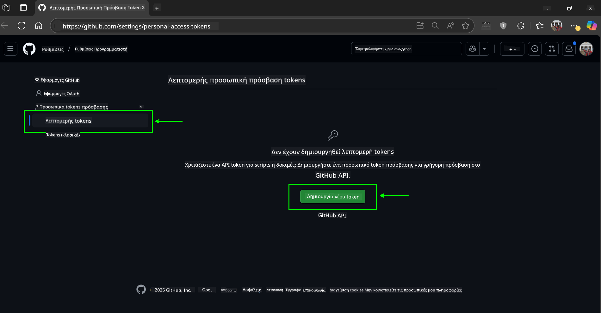

<!--
CO_OP_TRANSLATOR_METADATA:
{
  "original_hash": "c6a79c8f2b56a80370ff7e447765524f",
  "translation_date": "2025-07-24T08:23:04+00:00",
  "source_file": "00-course-setup/README.md",
  "language_code": "el"
}
-->
# Ρύθμιση Μαθήματος

## Εισαγωγή

Αυτό το μάθημα θα καλύψει πώς να εκτελέσετε τα παραδείγματα κώδικα αυτού του μαθήματος.

## Κλωνοποίηση ή Δημιουργία Fork αυτού του Αποθετηρίου

Για να ξεκινήσετε, παρακαλώ κλωνοποιήστε ή δημιουργήστε fork του αποθετηρίου GitHub. Αυτό θα δημιουργήσει τη δική σας έκδοση του υλικού του μαθήματος, ώστε να μπορείτε να εκτελέσετε, να δοκιμάσετε και να τροποποιήσετε τον κώδικα!

Αυτό μπορεί να γίνει κάνοντας κλικ στον σύνδεσμο για

Θα πρέπει τώρα να έχετε τη δική σας έκδοση fork αυτού του μαθήματος στον παρακάτω σύνδεσμο:


## Εκτέλεση του Κώδικα

Αυτό το μάθημα προσφέρει μια σειρά από Jupyter Notebooks που μπορείτε να εκτελέσετε για να αποκτήσετε πρακτική εμπειρία στη δημιουργία Πρακτόρων Τεχνητής Νοημοσύνης.

Τα παραδείγματα κώδικα χρησιμοποιούν είτε:

**Απαιτεί Λογαριασμό GitHub - Δωρεάν**:

1) Semantic Kernel Agent Framework + GitHub Models Marketplace. Ετικέτα: (semantic-kernel.ipynb)  
2) AutoGen Framework + GitHub Models Marketplace. Ετικέτα: (autogen.ipynb)  

**Απαιτεί Συνδρομή Azure**:  
3) Azure AI Foundry + Azure AI Agent Service. Ετικέτα: (azureaiagent.ipynb)  

Σας ενθαρρύνουμε να δοκιμάσετε και τους τρεις τύπους παραδειγμάτων για να δείτε ποιος σας ταιριάζει καλύτερα.

Η επιλογή σας θα καθορίσει ποια βήματα ρύθμισης πρέπει να ακολουθήσετε παρακάτω:

## Απαιτήσεις

- Python 3.12+  
  - **ΣΗΜΕΙΩΣΗ**: Εάν δεν έχετε εγκατεστημένο το Python 3.12, βεβαιωθείτε ότι το εγκαταστήσατε. Στη συνέχεια, δημιουργήστε το venv σας χρησιμοποιώντας το python3.12 για να διασφαλίσετε ότι οι σωστές εκδόσεις εγκαθίστανται από το αρχείο requirements.txt.  
- Λογαριασμός GitHub - Για πρόσβαση στο GitHub Models Marketplace  
- Συνδρομή Azure - Για πρόσβαση στο Azure AI Foundry  
- Λογαριασμός Azure AI Foundry - Για πρόσβαση στο Azure AI Agent Service  

Έχουμε συμπεριλάβει ένα αρχείο `requirements.txt` στη ρίζα αυτού του αποθετηρίου που περιέχει όλα τα απαραίτητα πακέτα Python για την εκτέλεση των παραδειγμάτων κώδικα.

Μπορείτε να τα εγκαταστήσετε εκτελώντας την παρακάτω εντολή στο τερματικό σας στη ρίζα του αποθετηρίου:

```bash
pip install -r requirements.txt
```  
Συνιστούμε τη δημιουργία ενός εικονικού περιβάλλοντος Python για να αποφύγετε τυχόν συγκρούσεις και προβλήματα.

## Ρύθμιση VSCode  
Βεβαιωθείτε ότι χρησιμοποιείτε τη σωστή έκδοση Python στο VSCode.


## Ρύθμιση για Παραδείγματα με Χρήση GitHub Models  

### Βήμα 1: Ανάκτηση του Προσωπικού Access Token (PAT) του GitHub  

Αυτό το μάθημα χρησιμοποιεί το GitHub Models Marketplace, παρέχοντας δωρεάν πρόσβαση σε Μεγάλα Γλωσσικά Μοντέλα (LLMs) που θα χρησιμοποιήσετε για να δημιουργήσετε Πράκτορες Τεχνητής Νοημοσύνης.

Για να χρησιμοποιήσετε τα GitHub Models, θα χρειαστεί να δημιουργήσετε ένα [Προσωπικό Access Token του GitHub](https://docs.github.com/en/authentication/keeping-your-account-and-data-secure/managing-your-personal-access-tokens).

Αυτό μπορεί να γίνει πηγαίνοντας στον λογαριασμό σας στο GitHub.

Παρακαλώ ακολουθήστε την [Αρχή της Ελάχιστης Προνομιακής Πρόσβασης](https://docs.github.com/en/get-started/learning-to-code/storing-your-secrets-safely) κατά τη δημιουργία του token σας. Αυτό σημαίνει ότι θα πρέπει να δώσετε στο token μόνο τις άδειες που χρειάζεται για να εκτελέσει τα παραδείγματα κώδικα αυτού του μαθήματος.

1. Επιλέξτε την επιλογή `Fine-grained tokens` στην αριστερή πλευρά της οθόνης σας.

    Στη συνέχεια, επιλέξτε `Generate new token`.

    

1. Εισάγετε ένα περιγραφικό όνομα για το token σας που να αντικατοπτρίζει τον σκοπό του, ώστε να είναι εύκολο να το αναγνωρίσετε αργότερα. Ορίστε μια ημερομηνία λήξης (συνιστάται: 30 ημέρες· μπορείτε να επιλέξετε μικρότερη περίοδο, όπως 7 ημέρες, αν προτιμάτε μεγαλύτερη ασφάλεια).

    

1. Περιορίστε το εύρος του token στο fork σας αυτού του αποθετηρίου.

    

1. Περιορίστε τα δικαιώματα του token: Στην ενότητα **Permissions**, ενεργοποιήστε τις **Account Permissions**, μεταβείτε στα **Models** και ενεργοποιήστε μόνο την αναγκαία πρόσβαση ανάγνωσης για τα GitHub Models.

    

    

Αντιγράψτε το νέο token που μόλις δημιουργήσατε. Τώρα θα το προσθέσετε στο αρχείο `.env` που περιλαμβάνεται σε αυτό το μάθημα.

### Βήμα 2: Δημιουργία του Αρχείου `.env`

Για να δημιουργήσετε το αρχείο `.env`, εκτελέστε την παρακάτω εντολή στο τερματικό σας.

```bash
cp .env.example .env
```

Αυτό θα αντιγράψει το αρχείο παραδείγματος και θα δημιουργήσει ένα `.env` στον κατάλογό σας, όπου θα συμπληρώσετε τις τιμές για τις μεταβλητές περιβάλλοντος.

Με το token σας αντιγραμμένο, ανοίξτε το αρχείο `.env` στον αγαπημένο σας επεξεργαστή κειμένου και επικολλήστε το token στο πεδίο `GITHUB_TOKEN`.

Θα πρέπει τώρα να μπορείτε να εκτελέσετε τα παραδείγματα κώδικα αυτού του μαθήματος.

## Ρύθμιση για Παραδείγματα με Χρήση Azure AI Foundry και Azure AI Agent Service  

### Βήμα 1: Ανάκτηση του Endpoint του Έργου σας στο Azure  

Ακολουθήστε τα βήματα για τη δημιουργία ενός hub και ενός έργου στο Azure AI Foundry που περιγράφονται εδώ: [Hub resources overview](https://learn.microsoft.com/en-us/azure/ai-foundry/concepts/ai-resources)

Αφού δημιουργήσετε το έργο σας, θα χρειαστεί να ανακτήσετε τη συμβολοσειρά σύνδεσης για το έργο σας.

Αυτό μπορεί να γίνει πηγαίνοντας στη σελίδα **Overview** του έργου σας στην πύλη Azure AI Foundry.


### Βήμα 2: Δημιουργία του Αρχείου `.env`

Για να δημιουργήσετε το αρχείο `.env`, εκτελέστε την παρακάτω εντολή στο τερματικό σας.

```bash
cp .env.example .env
```

Αυτό θα αντιγράψει το αρχείο παραδείγματος και θα δημιουργήσει ένα `.env` στον κατάλογό σας, όπου θα συμπληρώσετε τις τιμές για τις μεταβλητές περιβάλλοντος.

Με το token σας αντιγραμμένο, ανοίξτε το αρχείο `.env` στον αγαπημένο σας επεξεργαστή κειμένου και επικολλήστε το token στο πεδίο `PROJECT_ENDPOINT`.

### Βήμα 3: Σύνδεση στο Azure  

Ως βέλτιστη πρακτική ασφαλείας, θα χρησιμοποιήσουμε [keyless authentication](https://learn.microsoft.com/azure/developer/ai/keyless-connections?tabs=csharp%2Cazure-cli?WT.mc_id=academic-105485-koreyst) για να συνδεθούμε στο Azure OpenAI με το Microsoft Entra ID.

Στη συνέχεια, ανοίξτε ένα τερματικό και εκτελέστε `az login --use-device-code` για να συνδεθείτε στον λογαριασμό σας στο Azure.

Αφού συνδεθείτε, επιλέξτε τη συνδρομή σας στο τερματικό.

## Πρόσθετες Μεταβλητές Περιβάλλοντος - Azure Search και Azure OpenAI  

Για το μάθημα Agentic RAG - Μάθημα 5 - υπάρχουν παραδείγματα που χρησιμοποιούν το Azure Search και το Azure OpenAI.

Εάν θέλετε να εκτελέσετε αυτά τα παραδείγματα, θα χρειαστεί να προσθέσετε τις παρακάτω μεταβλητές περιβάλλοντος στο αρχείο `.env` σας:

### Σελίδα Επισκόπησης (Έργο)

- `AZURE_SUBSCRIPTION_ID` - Ελέγξτε τις **Λεπτομέρειες Έργου** στη σελίδα **Overview** του έργου σας.

- `AZURE_AI_PROJECT_NAME` - Δείτε την κορυφή της σελίδας **Overview** για το έργο σας.

- `AZURE_OPENAI_SERVICE` - Βρείτε το στην καρτέλα **Included capabilities** για την **Υπηρεσία Azure OpenAI** στη σελίδα **Overview**.

### Κέντρο Διαχείρισης

- `AZURE_OPENAI_RESOURCE_GROUP` - Μεταβείτε στις **Ιδιότητες Έργου** στη σελίδα **Overview** του **Κέντρου Διαχείρισης**.

- `GLOBAL_LLM_SERVICE` - Στην ενότητα **Connected resources**, βρείτε το όνομα σύνδεσης για τις **Υπηρεσίες Azure AI**. Εάν δεν αναφέρεται, ελέγξτε την **πύλη Azure** στην ομάδα πόρων σας για το όνομα της υπηρεσίας AI.

### Σελίδα Μοντέλων + Endpoints

- `AZURE_OPENAI_EMBEDDING_DEPLOYMENT_NAME` - Επιλέξτε το μοντέλο ενσωμάτωσης (π.χ., `text-embedding-ada-002`) και σημειώστε το **Deployment name** από τις λεπτομέρειες του μοντέλου.

- `AZURE_OPENAI_CHAT_DEPLOYMENT_NAME` - Επιλέξτε το μοντέλο συνομιλίας (π.χ., `gpt-4o-mini`) και σημειώστε το **Deployment name** από τις λεπτομέρειες του μοντέλου.

### Πύλη Azure

- `AZURE_OPENAI_ENDPOINT` - Αναζητήστε τις **Υπηρεσίες Azure AI**, κάντε κλικ σε αυτές, στη συνέχεια μεταβείτε στη **Διαχείριση Πόρων**, **Κλειδιά και Endpoint**, μετακινηθείτε προς τα κάτω στα "Azure OpenAI endpoints" και αντιγράψτε αυτό που λέει "Language APIs".

- `AZURE_OPENAI_API_KEY` - Από την ίδια οθόνη, αντιγράψτε το ΚΛΕΙΔΙ 1 ή το ΚΛΕΙΔΙ 2.

- `AZURE_SEARCH_SERVICE_ENDPOINT` - Βρείτε τον πόρο σας **Azure AI Search**, κάντε κλικ σε αυτόν και δείτε την **Επισκόπηση**.

- `AZURE_SEARCH_API_KEY` - Στη συνέχεια, μεταβείτε στις **Ρυθμίσεις** και μετά στα **Κλειδιά** για να αντιγράψετε το κύριο ή δευτερεύον κλειδί διαχειριστή.

### Εξωτερική Ιστοσελίδα

- `AZURE_OPENAI_API_VERSION` - Επισκεφθείτε τη σελίδα [API version lifecycle](https://learn.microsoft.com/en-us/azure/ai-services/openai/api-version-deprecation#latest-ga-api-release) στην ενότητα **Latest GA API release**.

### Ρύθμιση keyless authentication  

Αντί να κωδικοποιήσουμε τα διαπιστευτήριά σας, θα χρησιμοποιήσουμε μια σύνδεση χωρίς κλειδί με το Azure OpenAI. Για να το κάνουμε αυτό, θα εισάγουμε το `DefaultAzureCredential` και αργότερα θα καλέσουμε τη συνάρτηση `DefaultAzureCredential` για να λάβουμε το διαπιστευτήριο.

```python
from azure.identity import DefaultAzureCredential, InteractiveBrowserCredential
```

## Κολλήσατε Κάπου;

Εάν αντιμετωπίζετε οποιοδήποτε πρόβλημα με αυτή τη ρύθμιση, μπείτε στο

## Επόμενο Μάθημα

Είστε πλέον έτοιμοι να εκτελέσετε τον κώδικα αυτού του μαθήματος. Καλή διασκέδαση μαθαίνοντας περισσότερα για τον κόσμο των Πρακτόρων Τεχνητής Νοημοσύνης!

[Εισαγωγή στους Πράκτορες Τεχνητής Νοημοσύνης και τις Χρήσεις τους](../01-intro-to-ai-agents/README.md)

**Αποποίηση ευθύνης**:  
Αυτό το έγγραφο έχει μεταφραστεί χρησιμοποιώντας την υπηρεσία αυτόματης μετάφρασης [Co-op Translator](https://github.com/Azure/co-op-translator). Παρόλο που καταβάλλουμε προσπάθειες για ακρίβεια, παρακαλούμε να έχετε υπόψη ότι οι αυτοματοποιημένες μεταφράσεις ενδέχεται να περιέχουν λάθη ή ανακρίβειες. Το πρωτότυπο έγγραφο στη μητρική του γλώσσα θα πρέπει να θεωρείται η αυθεντική πηγή. Για κρίσιμες πληροφορίες, συνιστάται επαγγελματική ανθρώπινη μετάφραση. Δεν φέρουμε ευθύνη για τυχόν παρεξηγήσεις ή εσφαλμένες ερμηνείες που προκύπτουν από τη χρήση αυτής της μετάφρασης.