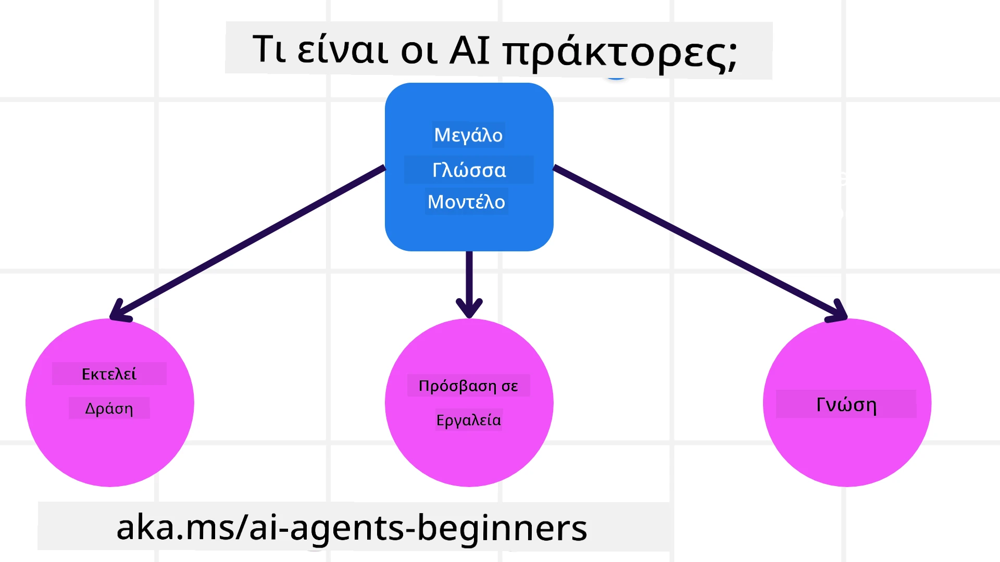
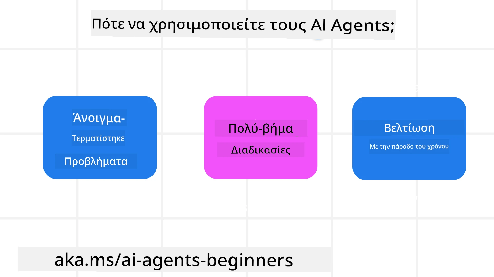

> _(Κάντε κλικ στην εικόνα παραπάνω για να δείτε το βίντεο αυτού του μαθήματος)_

# Εισαγωγή στους Πράκτορες Τεχνητής Νοημοσύνης και Περιπτώσεις Χρήσης Πρακτόρων

Καλώς ήρθατε στο μάθημα "AI Agents for Beginners"! Αυτό το μάθημα παρέχει βασικές γνώσεις και πρακτικά δείγματα για την κατασκευή Πρακτόρων Τεχνητής Νοημοσύνης.

Join the <a href="https://discord.gg/kzRShWzttr" target="_blank">Azure AI Discord Community</a> to meet other learners and AI Agent Builders and ask any questions you have about this course.

Για να ξεκινήσουμε αυτό το μάθημα, αρχίζουμε αποκτώντας μια καλύτερη κατανόηση του τι είναι οι Πράκτορες Τεχνητής Νοημοσύνης και πώς μπορούμε να τους χρησιμοποιήσουμε στις εφαρμογές και στις ροές εργασίας που κατασκευάζουμε.

## Εισαγωγή

Αυτό το μάθημα καλύπτει:

- Τι είναι οι Πράκτορες Τεχνητής Νοημοσύνης και ποιες είναι οι διαφορετικές κατηγορίες πρακτόρων;
- Ποιες περιπτώσεις χρήσης είναι οι καταλληλότερες για Πράκτορες και πώς μπορούν να μας βοηθήσουν;
- Ποια είναι μερικά από τα βασικά δομικά στοιχεία όταν σχεδιάζουμε Agentic λύσεις;

## Στόχοι Μάθησης
Μετά την ολοκλήρωση αυτού του μαθήματος, θα πρέπει να μπορείτε να:

- Κατανοήσετε τις έννοιες των Πρακτόρων Τεχνητής Νοημοσύνης και πώς διαφέρουν από άλλες λύσεις τεχνητής νοημοσύνης.
- Εφαρμόσετε Πράκτορες Τεχνητής Νοημοσύνης με τον πιο αποδοτικό τρόπο.
- Σχεδιάσετε Agentic λύσεις παραγωγικά για τόσο τους χρήστες όσο και τους πελάτες.

## Ορισμός Πρακτόρων Τεχνητής Νοημοσύνης και Τύποι Πρακτόρων

### Τι είναι οι Πράκτορες Τεχνητής Νοημοσύνης;

Οι Πράκτορες Τεχνητής Νοημοσύνης είναι **συστήματα** που επιτρέπουν σε **Μεγάλα Γλωσσικά Μοντέλα(LLMs)** να **εκτελούν ενέργειες** επεκτείνοντας τις δυνατότητές τους δίνοντας στα LLMs **πρόσβαση σε εργαλεία** και **γνώση**.

Ας χωρίσουμε αυτόν τον ορισμό σε μικρότερα μέρη:

- **Σύστημα** - Είναι σημαντικό να σκεφτόμαστε τους πράκτορες όχι ως ένα μόνο συστατικό αλλά ως ένα σύστημα πολλών συστατικών. Σε βασικό επίπεδο, τα συστατικά ενός Πράκτορα Τεχνητής Νοημοσύνης είναι:
  - **Περιβάλλον** - Ο ορισμένος χώρος όπου ο Πράκτορας Τεχνητής Νοημοσύνης λειτουργεί. Για παράδειγμα, αν είχαμε έναν ταξιδιωτικό πράκτορα κράτησης, το περιβάλλον θα μπορούσε να είναι το σύστημα κρατήσεων ταξιδιών που ο πράκτορας χρησιμοποιεί για να ολοκληρώνει εργασίες.
  - **Αισθητήρες** - Τα περιβάλλοντα έχουν πληροφορίες και παρέχουν ανατροφοδότηση. Οι Πράκτορες χρησιμοποιούν αισθητήρες για να συλλέγουν και να ερμηνεύουν αυτές τις πληροφορίες σχετικά με την τρέχουσα κατάσταση του περιβάλλοντος. Στο παράδειγμα του Ταξιδιωτικού Πράκτορα, το σύστημα κρατήσεων μπορεί να παρέχει πληροφορίες όπως διαθεσιμότητα ξενοδοχείων ή τιμές πτήσεων.
  - **Ενεργοποιητές** - Μόλις ο Πράκτορας λάβει την τρέχουσα κατάσταση του περιβάλλοντος, για την τρέχουσα εργασία ο πράκτορας καθορίζει ποια ενέργεια πρέπει να εκτελέσει για να αλλάξει το περιβάλλον. Για τον ταξιδιωτικό πράκτορα, μπορεί να είναι να κλείσει ένα διαθέσιμο δωμάτιο για τον χρήστη.

**Μεγάλα Γλωσσικά Μοντέλα** - Η έννοια των πρακτόρων υπήρχε πριν τη δημιουργία των LLMs. Το πλεονέκτημα του να χτίζεις Πράκτορες με LLMs είναι η ικανότητά τους να ερμηνεύουν την ανθρώπινη γλώσσα και τα δεδομένα. Αυτή η ικανότητα επιτρέπει στα LLMs να ερμηνεύουν πληροφορίες από το περιβάλλον και να ορίζουν ένα σχέδιο για να αλλάξουν το περιβάλλον.

**Εκτέλεση Ενεργειών** - Εκτός των συστημάτων Πρακτόρων, τα LLMs περιορίζονται σε καταστάσεις όπου η ενέργεια είναι η δημιουργία περιεχομένου ή πληροφοριών βάσει του prompt του χρήστη. Μέσα στα συστήματα Πρακτόρων, τα LLMs μπορούν να ολοκληρώνουν εργασίες ερμηνεύοντας το αίτημα του χρήστη και χρησιμοποιώντας εργαλεία που είναι διαθέσιμα στο περιβάλλον τους.

**Πρόσβαση σε Εργαλεία** - Ποια εργαλεία έχει πρόσβαση το LLM ορίζεται από 1) το περιβάλλον στο οποίο λειτουργεί και 2) τον προγραμματιστή του Πράκτορα. Στο παράδειγμα του ταξιδιωτικού πράκτορα, τα εργαλεία του πράκτορα περιορίζονται από τις λειτουργίες που είναι διαθέσιμες στο σύστημα κρατήσεων, και/ή ο προγραμματιστής μπορεί να περιορίσει την πρόσβαση του πράκτορα σε εργαλεία για πτήσεις.

**Μνήμη+Γνώση** - Η μνήμη μπορεί να είναι βραχυπρόθεσμη στο πλαίσιο της συνομιλίας μεταξύ του χρήστη και του πράκτορα. Μακροπρόθεσμα, εκτός των πληροφοριών που παρέχονται από το περιβάλλον, οι Πράκτορες μπορούν επίσης να ανακτούν γνώση από άλλα συστήματα, υπηρεσίες, εργαλεία και ακόμη και από άλλους πράκτορες. Στο παράδειγμα του ταξιδιωτικού πράκτορα, αυτή η γνώση θα μπορούσε να είναι οι πληροφορίες για τις ταξιδιωτικές προτιμήσεις του χρήστη που βρίσκονται σε μια βάση δεδομένων πελατών.

### Οι διαφορετικοί τύποι πρακτόρων

Τώρα που έχουμε έναν γενικό ορισμό των Πρακτόρων, ας δούμε μερικούς συγκεκριμένους τύπους πρακτόρων και πώς θα εφαρμόζονταν σε έναν ταξιδιωτικό πράκτορα κράτησης.

| **Τύπος Πράκτορα**                | **Περιγραφή**                                                                                                                       | **Παράδειγμα**                                                                                                                                                                                                                   |
| ----------------------------- | ------------------------------------------------------------------------------------------------------------------------------------- | ----------------------------------------------------------------------------------------------------------------------------------------------------------------------------------------------------------------------------- |
| **Απλοί Αντανακλαστικοί Πράκτορες**      | Εκτελούν άμεσες ενέργειες βάσει προκαθορισμένων κανόνων.                                                                                  | Ο ταξιδιωτικός πράκτορας ερμηνεύει το πλαίσιο ενός email και προωθεί παράπονα ταξιδιού στην εξυπηρέτηση πελατών.                                                                                                                          |
| **Μοντέλο-Βασισμένοι Αντανακλαστικοί Πράκτορες** | Εκτελούν ενέργειες βάσει ενός μοντέλου του κόσμου και αλλαγών σε αυτό το μοντέλο.                                                              | Ο ταξιδιωτικός πράκτορας δίνει προτεραιότητα σε δρομολόγια με σημαντικές αλλαγές τιμών βάσει πρόσβασης σε ιστορικά δεδομένα τιμολόγησης.                                                                                                             |
| **Πράκτορες Βασισμένοι σε Στόχο**         | Δημιουργούν σχέδια για να επιτύχουν συγκεκριμένους στόχους ερμηνεύοντας τον στόχο και προσδιορίζοντας ενέργειες για να τον πετύχουν.                                  | Ο ταξιδιωτικός πράκτορας κλείνει ένα ταξίδι καθορίζοντας τις απαραίτητες ταξιδιωτικές ρυθμίσεις (αυτοκίνητο, δημόσιες μεταφορές, πτήσεις) από την τρέχουσα τοποθεσία μέχρι τον προορισμό.                                                                                |
| **Πράκτορες Βασισμένοι στην Ωφέλεια**      | Λαμβάνουν υπόψη προτιμήσεις και ζυγίζουν ανταλλαγές αριθμητικά για να καθορίσουν πώς να επιτύχουν στόχους.                                               | Ο ταξιδιωτικός πράκτορας μεγιστοποιεί την ωφέλεια ζυγίζοντας την ευκολία έναντι του κόστους κατά την κράτηση ταξιδιού.                                                                                                                                          |
| **Μαθησιακοί Πράκτορες**           | Βελτιώνονται με τον χρόνο ανταποκρινόμενοι σε ανατροφοδότηση και προσαρμόζοντας ανάλογα τις ενέργειες.                                                        | Ο ταξιδιωτικός πράκτορας βελτιώνεται χρησιμοποιώντας την ανατροφοδότηση πελατών από έρευνες μετά το ταξίδι για να κάνει προσαρμογές σε μελλοντικές κρατήσεις.                                                                                                               |
| **Ιεραρχικοί Πράκτορες**       | Περιλαμβάνουν πολλαπλούς πράκτορες σε ένα ιεραρχικό σύστημα, με πράκτορες υψηλότερου επιπέδου να διασπούν εργασίες σε υποεργασίες για να τις ολοκληρώσουν πράκτορες χαμηλότερου επιπέδου. | Ο ταξιδιωτικός πράκτορας ακυρώνει ένα ταξίδι διαιρώντας την εργασία σε υποεργασίες (για παράδειγμα, ακύρωση συγκεκριμένων κρατήσεων) και έχοντας πράκτορες χαμηλότερου επιπέδου να τις ολοκληρώσουν, αναφέροντας πίσω στον πράκτορα υψηλότερου επιπέδου.                                     |
| **Συστήματα Πολυπράκτορων (MAS)** | Οι πράκτορες ολοκληρώνουν εργασίες ανεξάρτητα, είτε συνεργατικά είτε ανταγωνιστικά.                                                           | Συνεργατικό: Πολλοί πράκτορες κλείνουν συγκεκριμένες ταξιδιωτικές υπηρεσίες όπως ξενοδοχεία, πτήσεις και ψυχαγωγία. Ανταγωνιστικό: Πολλοί πράκτορες διαχειρίζονται και ανταγωνίζονται πάνω σε ένα κοινό ημερολόγιο κρατήσεων ξενοδοχείου για να κλείσουν πελάτες στο ξενοδοχείο. |

## Πότε να Χρησιμοποιήσετε Πράκτορες Τεχνητής Νοημοσύνης

Στην προηγούμενη ενότητα, χρησιμοποιήσαμε την περίπτωση χρήσης του Ταξιδιωτικού Πράκτορα για να εξηγήσουμε πώς οι διαφορετικοί τύποι πρακτόρων μπορούν να χρησιμοποιηθούν σε διαφορετικά σενάρια κράτησης ταξιδιών. Θα συνεχίσουμε να χρησιμοποιούμε αυτήν την εφαρμογή σε όλο το μάθημα.

Ας δούμε τους τύπους περιπτώσεων χρήσης για τους οποίους οι Πράκτορες είναι οι καταλληλότεροι:

- **Προβλήματα Ανοικτού Τέλους** - επιτρέποντας στο LLM να καθορίσει τα απαραίτητα βήματα για να ολοκληρώσει μια εργασία επειδή δεν μπορεί πάντα να κωδικοποιηθεί σκληρά σε μια ροή εργασίας.
- **Διαδικασίες Πολλαπλών Βημάτων** - εργασίες που απαιτούν επίπεδο πολυπλοκότητας όπου ο Πράκτορας πρέπει να χρησιμοποιήσει εργαλεία ή πληροφορίες σε πολλούς γύρους αντί για μονοσφαιρική ανάκτηση.  
- **Βελτίωση με τον Χρόνο** - εργασίες όπου ο πράκτορας μπορεί να βελτιωθεί με τον χρόνο λαμβάνοντας ανατροφοδότηση είτε από το περιβάλλον του είτε από χρήστες ώστε να παρέχει καλύτερη ωφέλεια.

Καλύπτουμε περισσότερες παραμέτρους χρήσης Πρακτόρων στο μάθημα Building Trustworthy AI Agents.

## Βασικά των Agentic Λύσεων

### Ανάπτυξη Πρακτόρων

Το πρώτο βήμα στον σχεδιασμό ενός συστήματος Πράκτορα είναι ο ορισμός των εργαλείων, των ενεργειών και των συμπεριφορών. Σε αυτό το μάθημα, εστιάζουμε στη χρήση της υπηρεσίας Azure AI Agent Service για τον ορισμό των Πρακτόρων μας. Προσφέρει λειτουργίες όπως:

- Επιλογή Ανοιχτών Μοντέλων όπως OpenAI, Mistral, και Llama
- Χρήση Εγκεκριμένων Δεδομένων μέσω παρόχων όπως το Tripadvisor
- Χρήση τυποποιημένων εργαλείων OpenAPI 3.0

### Agentic Πρότυπα

Η επικοινωνία με τα LLM γίνεται μέσω prompts. Δεδομένης της ημι-αυτόνομης φύσης των Πρακτόρων, δεν είναι πάντα δυνατό ή απαραίτητο να γίνει χειροκίνητο επανα-prompt στο LLM μετά από μια αλλαγή στο περιβάλλον. Χρησιμοποιούμε **Agentic Πρότυπα** που μας επιτρέπουν να κάνουμε prompt στο LLM σε πολλαπλά βήματα με πιο κλιμακούμενο τρόπο.

Αυτό το μάθημα είναι χωρισμένο σε μερικά από τα τρέχοντα δημοφιλή Agentic πρότυπα.

### Agentic Πλαίσια

Τα Agentic Πλαίσια επιτρέπουν στους προγραμματιστές να υλοποιήσουν agentic πρότυπα μέσω κώδικα. Αυτά τα πλαίσια προσφέρουν πρότυπα, πρόσθετα (plugins) και εργαλεία για καλύτερη συνεργασία Πρακτόρων. Αυτά τα πλεονεκτήματα παρέχουν ικανότητες για καλύτερη παρατηρησιμότητα και αποσφαλμάτωση των συστημάτων Πρακτόρων.

Σε αυτό το μάθημα, θα εξερευνήσουμε το Microsoft Agent Framework (MAF) για την κατασκευή παραγωγικών Πρακτόρων.

## Δείγματα Κώδικα

- Python: [Agent Framework](./code_samples/01-python-agent-framework.ipynb)
- .NET: [Agent Framework](./code_samples/01-dotnet-agent-framework.md)

## Έχετε Περισσότερες Ερωτήσεις για τους Πράκτορες Τεχνητής Νοημοσύνης;

Join the [Microsoft Foundry Discord](https://aka.ms/ai-agents/discord) to meet with other learners, attend office hours and get your AI Agents questions answered.

## Προηγούμενο Μάθημα

[Course Setup](../00-course-setup/README.md)

## Επόμενο Μάθημα

[Exploring Agentic Frameworks](../02-explore-agentic-frameworks/README.md)

---

<!-- CO-OP TRANSLATOR DISCLAIMER START -->
Αποποίηση ευθυνών:
Αυτό το έγγραφο έχει μεταφραστεί με χρήση της υπηρεσίας αυτόματης μετάφρασης AI Co-op Translator (https://github.com/Azure/co-op-translator). Παρότι καταβάλλουμε προσπάθειες για ακρίβεια, λάβετε υπόψη ότι οι αυτοματοποιημένες μεταφράσεις ενδέχεται να περιέχουν σφάλματα ή ανακρίβειες. Το πρωτότυπο έγγραφο στην αρχική του γλώσσα πρέπει να θεωρείται η έγκυρη πηγή. Για κρίσιμες πληροφορίες συνιστάται επαγγελματική μετάφραση από ανθρώπινο μεταφραστή. Δεν φέρουμε ευθύνη για τυχόν παρερμηνείες που προκύπτουν από τη χρήση αυτής της μετάφρασης.
<!-- CO-OP TRANSLATOR DISCLAIMER END -->