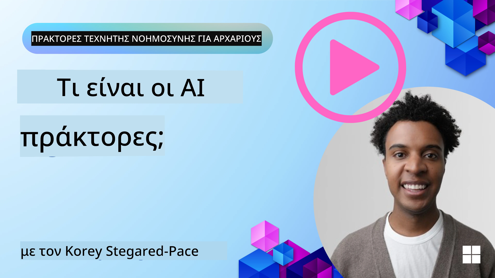
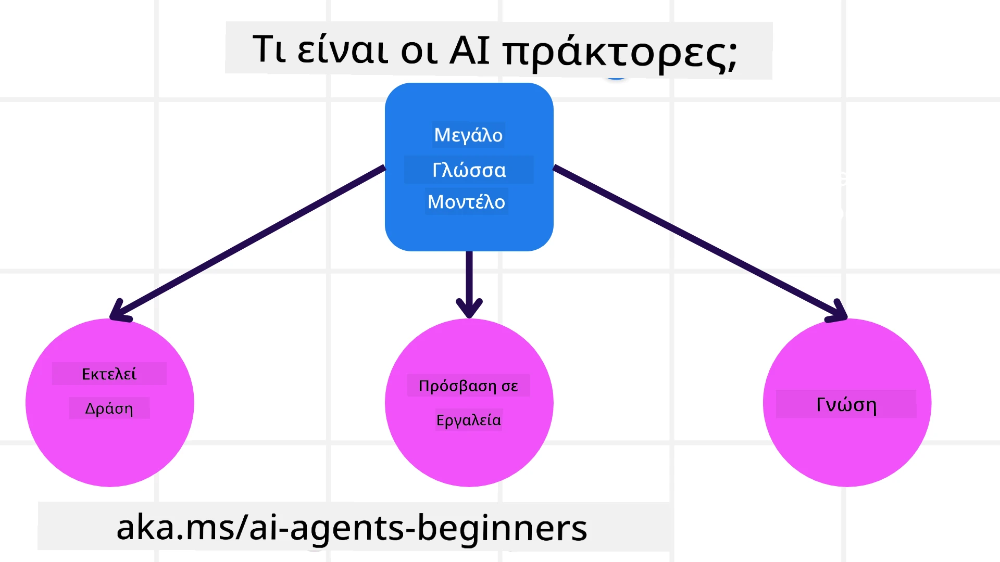
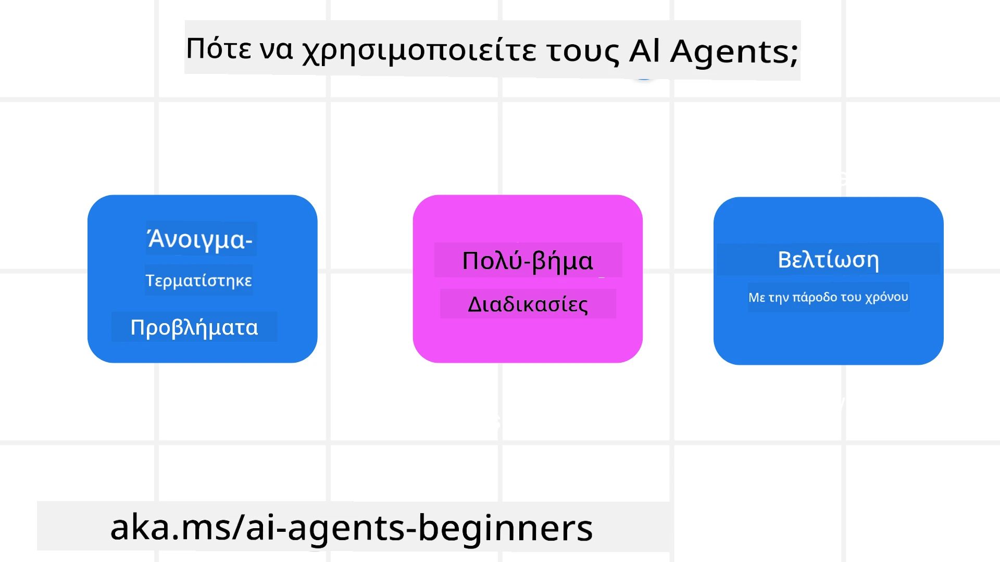

> _(Κάντε κλικ στην εικόνα παραπάνω για να δείτε το βίντεο για αυτό το μάθημα)_

# Εισαγωγή στους Πράκτορες ΤΝ και Περιπτώσεις Χρήσης Πρακτόρων

Καλώς ήρθατε στο μάθημα **Πράκτορες Τεχνητής Νοημοσύνης για Αρχάριους**! Αυτό το μάθημα σας παρέχει τη βασική γνώση — και πραγματικό λειτουργικό κώδικα — για να ξεκινήσετε να φτιάχνετε Πράκτορες ΤΝ από την αρχή.

Ελάτε να πείτε γεια στην <a href="https://discord.gg/kzRShWzttr" target="_blank">Κοινότητα Azure AI Discord</a> — είναι γεμάτη από μαθητές και δημιουργούς ΤΝ που είναι πρόθυμοι να απαντήσουν σε ερωτήσεις.

Πριν ξεκινήσουμε την κατασκευή, ας βεβαιωθούμε ότι καταλαβαίνουμε πραγματικά τι *είναι* ένας Πράκτορας ΤΝ και πότε έχει νόημα να χρησιμοποιηθεί.

---

## Εισαγωγή

Αυτό το μάθημα καλύπτει:

- Τι είναι οι Πράκτορες ΤΝ, και τους διαφορετικούς τύπους που υπάρχουν
- Ποιες εργασίες ταιριάζουν καλύτερα στους Πράκτορες ΤΝ
- Τα βασικά δομικά στοιχεία που θα χρησιμοποιήσετε όταν σχεδιάζετε μια λύση που βασίζεται σε Πράκτορες

## Στόχοι Μάθησης

Μέχρι το τέλος αυτού του μαθήματος, θα πρέπει να μπορείτε:

- Να εξηγήσετε τι είναι ένας Πράκτορας ΤΝ και πώς διαφέρει από μια απλή λύση ΤΝ
- Να ξέρετε πότε να χρησιμοποιήσετε έναν Πράκτορα ΤΝ (και πότε όχι)
- Να σχεδιάσετε ένα βασικό σχέδιο λύσης με Πράκτορα για ένα πραγματικό πρόβλημα

---

## Ορισμός Πρακτόρων ΤΝ και Τύποι Πρακτόρων ΤΝ

### Τι είναι οι Πράκτορες ΤΝ;

Ακολουθεί ένας απλός τρόπος να το σκεφτείτε:

> **Οι Πράκτορες ΤΝ είναι συστήματα που επιτρέπουν στα Μεγάλα Γλωσσικά Μοντέλα (LLMs) να *κάνουν πράγματα* — δίνοντάς τους εργαλεία και γνώση για να δρουν στον κόσμο, όχι απλώς να απαντούν σε εντολές.**

Ας το αναλύσουμε λίγο:

- **Σύστημα** — Ένας Πράκτορας ΤΝ δεν είναι μόνο ένα πράγμα. Είναι ένα σύνολο μερών που λειτουργούν μαζί. Στον πυρήνα του, κάθε πράκτορας έχει τρία στοιχεία:
  - **Περιβάλλον** — Ο χώρος στον οποίο εργάζεται ο πράκτορας. Για έναν πράκτορα κρατήσεων ταξιδιών, αυτό θα ήταν η ίδια η πλατφόρμα κρατήσεων.
  - **Αισθητήρες** — Πώς ο πράκτορας διαβάζει την τρέχουσα κατάσταση του περιβάλλοντός του. Ο ταξιδιωτικός πράκτορας μπορεί να ελέγχει τη διαθεσιμότητα ξενοδοχείων ή τις τιμές πτήσεων.
  - **Εκτελεστές** — Πώς ο πράκτορας ενεργεί. Ο ταξιδιωτικός πράκτορας μπορεί να κλείσει ένα δωμάτιο, να στείλει μια επιβεβαίωση ή να ακυρώσει μια κράτηση.

- **Μεγάλα Γλωσσικά Μοντέλα** — Οι πράκτορες υπήρχαν πριν από τα LLMs, αλλά τα LLMs είναι που κάνουν τους σύγχρονους πράκτορες τόσο ισχυρούς. Μπορούν να κατανοήσουν τη φυσική γλώσσα, να αιτιολογήσουν το πλαίσιο και να μετατρέψουν ένα ασαφές αίτημα χρήστη σε ένα συγκεκριμένο σχέδιο δράσης.

- **Εκτέλεση Δράσεων** — Χωρίς ένα σύστημα πράκτορα, ένα LLM απλώς δημιουργεί κείμενο. Μέσα σε ένα σύστημα πράκτορα, το LLM μπορεί πραγματικά να *εκτελέσει* βήματα — να αναζητήσει σε βάση δεδομένων, να καλέσει API, να στείλει μήνυμα.

- **Πρόσβαση σε Εργαλεία** — Ποια εργαλεία μπορεί να χρησιμοποιήσει ο πράκτορας εξαρτάται από (1) το περιβάλλον στο οποίο τρέχει και (2) τι επέλεξε ο προγραμματιστής να του δώσει. Ένας ταξιδιωτικός πράκτορας μπορεί να μπορεί να αναζητήσει πτήσεις αλλά όχι να επεξεργαστεί αρχεία πελατών — όλα εξαρτώνται από το τι έχεις συνδέσει.

- **Μνήμη + Γνώση** — Οι πράκτορες μπορούν να έχουν βραχυπρόθεσμη μνήμη (την τρέχουσα συνομιλία) και μακροπρόθεσμη μνήμη (μια βάση πελατών, παλαιότερες αλληλεπιδράσεις). Ο ταξιδιωτικός πράκτορας μπορεί να "θυμάται" ότι προτιμάτε καθίσματα δίπλα στο παράθυρο.

---

### Οι Διαφορετικοί Τύποι Πρακτόρων ΤΝ

Δεν κατασκευάζονται όλοι οι πράκτορες το ίδιο. Ακολουθεί μια ανάλυση των βασικών τύπων, χρησιμοποιώντας τον ταξιδιωτικό πράκτορα ως παράδειγμα:

| **Τύπος Πράκτορα** | **Τι Κάνει** | **Παράδειγμα Ταξιδιωτικού Πράκτορα** |
|---|---|---|
| **Απλοί Αντανακλαστικοί Πράκτορες** | Ακολουθούν κανόνες με κώδικα — χωρίς μνήμη, χωρίς σχεδιασμό. | Βλέπει ένα email παράπονο → το προωθεί στην εξυπηρέτηση πελατών. Τόσο απλά. |
| **Αντανακλαστικοί Πράκτορες με Εσωτερικό Μοντέλο** | Κρατούν ένα εσωτερικό μοντέλο του κόσμου και το ενημερώνουν καθώς τα πράγματα αλλάζουν. | Παρακολουθεί τις ιστορικές τιμές πτήσεων και σημειώνει δρομολόγια που ξαφνικά έγιναν ακριβά. |
| **Πράκτορες Με Βάση Στόχους** | Έχει έναν στόχο και βρίσκει πώς να τον πετύχει βήμα βήμα. | Κλείνει ένα ολόκληρο ταξίδι (πτήσεις, αυτοκίνητο, ξενοδοχείο) ξεκινώντας από την τρέχουσα τοποθεσία σας για να φτάσετε στον προορισμό σας. |
| **Πράκτορες Με Βάση Ωφελιμότητα** | Δεν βρίσκει μόνο *μια* λύση – βρίσκει την *καλύτερη* λύση ζυγίζοντας τις επιλογές. | Ισορροπεί κόστος και άνεση για να βρει το ταξίδι που ταιριάζει καλύτερα στις προτιμήσεις σας. |
| **Μαθησιακοί Πράκτορες** | Βελτιώνονται με τον χρόνο μαθαίνοντας από τα σχόλια. | Προσαρμόζει μελλοντικές προτάσεις κρατήσεων βάσει των αποτελεσμάτων έρευνας μετά το ταξίδι. |
| **Ιεραρχικοί Πράκτορες** | Ένας πράκτορας υψηλού επιπέδου χωρίζει την εργασία σε υποεργασίες και τις αναθέτει σε πράκτορες χαμηλότερου επιπέδου. | Η αίτηση "ακύρωση ταξιδιού" διασπάται σε: ακύρωση πτήσης, ακύρωση ξενοδοχείου, ακύρωση ενοικίασης αυτοκινήτου — κάθε μία διαχειρίζεται από υποπράκτορα. |
| **Συστήματα Πολλαπλών Πρακτόρων (MAS)** | Πολλοί ανεξάρτητοι πράκτορες που συνεργάζονται (ή ανταγωνίζονται). | Συνεργαστικό: ξεχωριστοί πράκτορες χειρίζονται ξενοδοχεία, πτήσεις και ψυχαγωγία. Ανταγωνιστικό: πολλοί πράκτορες ανταγωνίζονται να γεμίσουν δωμάτια ξενοδοχείων στην καλύτερη τιμή. |

---

## Πότε Να Χρησιμοποιείτε Πράκτορες ΤΝ

Το ότι *μπορείτε* να χρησιμοποιήσετε Πράκτορα ΤΝ δεν σημαίνει ότι *πάντα πρέπει*. Δείτε τις περιπτώσεις όπου οι πράκτορες λάμπουν πραγματικά:

- **Προβλήματα Χωρίς Ορισμένη Λύση** — Όταν τα βήματα για την επίλυση ενός προβλήματος δεν μπορούν να προγραμματιστούν εκ των προτέρων. Χρειάζεστε το LLM να βρει δυναμικά το μονοπάτι.
- **Διαδικασίες Με Πολλά Βήματα** — Εργασίες που απαιτούν τη χρήση εργαλείων σε πολλά βήματα, όχι μόνο μια απλή αναζήτηση ή παραγωγή.
- **Βελτίωση Με Τον Χρόνο** — Όταν θέλετε το σύστημα να γίνει πιο έξυπνο βασισμένο σε ανατροφοδότηση χρήστη ή περιβαλλοντικά σήματα.

Θα εμβαθύνουμε περισσότερο στο πότε (και πότε *όχι*) να χρησιμοποιείτε Πράκτορες ΤΝ στο μάθημα **Κατασκευή Αξιόπιστων Πρακτόρων ΤΝ** αργότερα στο μάθημα.

---

## Βασικά Στοιχεία Λύσεων με Πράκτορες

### Ανάπτυξη Πρακτόρων

Το πρώτο που κάνετε όταν φτιάχνετε έναν πράκτορα είναι να ορίσετε *τι μπορεί να κάνει* — τα εργαλεία, τις ενέργειες και τις συμπεριφορές του.

Σε αυτό το μάθημα, χρησιμοποιούμε την **Microsoft Foundry Agent Service** ως τη βασική πλατφόρμα μας. Υποστηρίζει:

- Μοντέλα από παρόχους όπως OpenAI, Mistral και Meta (Llama)
- Αδειοδοτημένα δεδομένα από παρόχους όπως Tripadvisor
- Τυποποιημένους ορισμούς εργαλείων OpenAPI 3.0

### Στυλ Λύσεων με Πράκτορες

Επικοινωνείτε με LLMs μέσω προτροπών. Με τους πράκτορες, δεν μπορείτε πάντα να δημιουργείτε χειροκίνητα κάθε προτροπή — ο πράκτορας πρέπει να δράσει σε πολλά βήματα. Εκεί μπαίνουν τα **Agentic Patterns**. Είναι επαναχρησιμοποιήσιμες στρατηγικές για προτροπές και έλεγχο LLMs με πιο επεκτάσιμο, αξιόπιστο τρόπο.

Αυτό το μάθημα δομείται γύρω από τα πιο κοινά και χρήσιμα agentic patterns.

### Πλαίσια Πρακτόρων

Τα Πλαίσια Πρακτόρων δίνουν στους προγραμματιστές έτοιμα πρότυπα, εργαλεία και υποδομές για τη δημιουργία πρακτόρων. Κάνουν πιο εύκολο:

- Να συνδέουν εργαλεία και δυνατότητες
- Να παρακολουθούν τι κάνει ο πράκτορας (και να διορθώνουν σφάλματα)
- Να συνεργάζονται μεταξύ πολλών πρακτόρων

Σε αυτό το μάθημα, εστιάζουμε στο **Microsoft Agent Framework (MAF)** για την κατασκευή πρακτόρων έτοιμων για παραγωγή.

---

## Παραδείγματα Κώδικα

Έτοιμοι να το δείτε στην πράξη; Εδώ είναι τα παραδείγματα κώδικα για αυτό το μάθημα:

- 🐍 Python: [Agent Framework](./code_samples/01-python-agent-framework.ipynb)
- 🔷 .NET: [Agent Framework](./code_samples/01-dotnet-agent-framework.md)

---

## Έχετε Ερωτήσεις;

Ενταχθείτε στο [Microsoft Foundry Discord](https://discord.com/invite/ATgtXmAS5D) για να συνδεθείτε με άλλους μαθητές, να παρακολουθήσετε ώρες γραφείου και να λάβετε απαντήσεις για τις ερωτήσεις σας σχετικά με τους Πράκτορες ΤΝ από την κοινότητα.

---

## Προηγούμενο Μάθημα

[Ρύθμιση Μαθήματος](../00-course-setup/README.md)

## Επόμενο Μάθημα

[Εξερεύνηση Πλαισίων για Πράκτορες](../02-explore-agentic-frameworks/README.md)

---

<!-- CO-OP TRANSLATOR DISCLAIMER START -->
**Αποποίηση ευθυνών**:
Αυτό το έγγραφο έχει μεταφραστεί χρησιμοποιώντας την υπηρεσία μετάφρασης με τεχνητή νοημοσύνη [Co-op Translator](https://github.com/Azure/co-op-translator). Ενώ επιδιώκουμε την ακρίβεια, παρακαλούμε να έχετε υπόψη ότι οι αυτοματοποιημένες μεταφράσεις ενδέχεται να περιέχουν λάθη ή ανακρίβειες. Το πρωτότυπο έγγραφο στη μητρική του γλώσσα πρέπει να θεωρείται η αυθεντική πηγή. Για κρίσιμες πληροφορίες, συνιστάται επαγγελματική ανθρώπινη μετάφραση. Δεν φέρουμε ευθύνη για τυχόν παρεξηγήσεις ή λανθασμένες ερμηνείες που προκύπτουν από τη χρήση αυτής της μετάφρασης.
<!-- CO-OP TRANSLATOR DISCLAIMER END -->