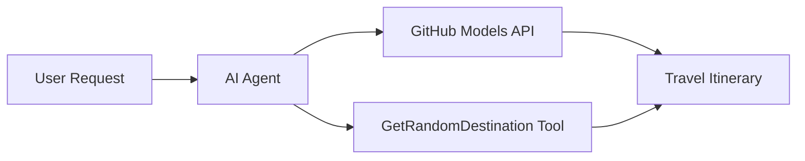

# 🌍 Πράκτορας Ταξιδιών AI με το Microsoft Agent Framework (.NET)

## 📋 Επισκόπηση Σεναρίου

Αυτό το σημειωματάριο δείχνει πώς να δημιουργήσετε έναν έξυπνο πράκτορα ταξιδιωτικού σχεδιασμού χρησιμοποιώντας το Microsoft Agent Framework για .NET. Ο πράκτορας μπορεί να δημιουργήσει αυτόματα εξατομικευμένα ημερήσια δρομολόγια για τυχαίους προορισμούς σε όλο τον κόσμο.

**Βασικές Δυνατότητες:**
- 🎲 **Τυχαία Επιλογή Προορισμού**: Χρησιμοποιεί ένα προσαρμοσμένο εργαλείο για την επιλογή προορισμών διακοπών
- 🗺️ **Έξυπνος Σχεδιασμός Ταξιδιών**: Δημιουργεί λεπτομερή ημερήσια δρομολόγια
- 🔄 **Ροή σε Πραγματικό Χρόνο**: Υποστηρίζει άμεσες και συνεχείς απαντήσεις
- 🛠️ **Ενσωμάτωση Προσαρμοσμένων Εργαλείων**: Δείχνει πώς να επεκτείνετε τις δυνατότητες του πράκτορα

## 🔧 Τεχνική Αρχιτεκτονική

### Βασικές Τεχνολογίες
- **Microsoft Agent Framework**: Η πιο πρόσφατη υλοποίηση .NET για ανάπτυξη AI πρακτόρων
- **Ενσωμάτωση Μοντέλων GitHub**: Χρησιμοποιεί την υπηρεσία συμπερασμάτων AI του GitHub
- **Συμβατότητα με OpenAI API**: Αξιοποιεί τις βιβλιοθήκες πελατών OpenAI με προσαρμοσμένα endpoints
- **Ασφαλής Διαμόρφωση**: Διαχείριση κλειδιών API βάσει περιβάλλοντος

### Βασικά Συστατικά
1. **AIAgent**: Ο κύριος συντονιστής του πράκτορα που διαχειρίζεται τη ροή συνομιλίας
2. **Προσαρμοσμένα Εργαλεία**: Η συνάρτηση `GetRandomDestination()` διαθέσιμη στον πράκτορα
3. **Πελάτης Συνομιλίας**: Διεπαφή συνομιλίας που υποστηρίζεται από τα μοντέλα του GitHub
4. **Υποστήριξη Ροής**: Δυνατότητες δημιουργίας απαντήσεων σε πραγματικό χρόνο

### Μοτίβο Ενσωμάτωσης


## 🚀 Ξεκινώντας

**Προαπαιτούμενα:**
- .NET 9.0 ή νεότερη έκδοση
- Κωδικός πρόσβασης API για τα μοντέλα GitHub
- Μεταβλητές περιβάλλοντος διαμορφωμένες στο αρχείο `.env`

**Απαιτούμενες Μεταβλητές Περιβάλλοντος:**
```env
GITHUB_TOKEN=your_github_token
GITHUB_ENDPOINT=https://models.inference.ai.azure.com
GITHUB_MODEL_ID=gpt-4o-mini
```

Εκτελέστε τα παρακάτω κελιά με τη σειρά για να δείτε τον πράκτορα ταξιδιών σε δράση!

---

## .NET Single File App: AI Travel Agent Example

See `01-dotnet-agent-framework.cs` for the complete runnable code sample.

Εκτελέστε το παρακάτω δείγμα κώδικα:

```bash
dotnet run 01-dotnet-agent-framework.cs
```

### Sample Code

```csharp
static string GetRandomDestination()
{
    var destinations = new List<string>
    {
        "Paris, France",
        "Tokyo, Japan",
        "New York City, USA",
        "Sydney, Australia",
        "Rome, Italy",
        "Barcelona, Spain",
        "Cape Town, South Africa",
        "Rio de Janeiro, Brazil",
        "Bangkok, Thailand",
        "Vancouver, Canada"
    };
    var random = new Random();
    int index = random.Next(destinations.Count);
    return destinations[index];
}

// Extract configuration from environment variables
var github_endpoint = Environment.GetEnvironmentVariable("GITHUB_ENDPOINT") ?? throw new InvalidOperationException("GITHUB_ENDPOINT is not set.");
var github_model_id = Environment.GetEnvironmentVariable("GITHUB_MODEL_ID") ?? "gpt-4o-mini";
var github_token = Environment.GetEnvironmentVariable("GITHUB_TOKEN") ?? throw new InvalidOperationException("GITHUB_TOKEN is not set.");

// Configure OpenAI Client Options
var openAIOptions = new OpenAIClientOptions()
{
    Endpoint = new Uri(github_endpoint)
};

// Initialize OpenAI Client with GitHub Models Configuration
var openAIClient = new OpenAIClient(new ApiKeyCredential(github_token), openAIOptions);

// Create AI Agent with Travel Planning Capabilities
AIAgent agent = openAIClient
    .GetChatClient(github_model_id)
    .CreateAIAgent(
        instructions: "You are a helpful AI Agent that can help plan vacations for customers at random destinations",
        tools: [AIFunctionFactory.Create(GetRandomDestination)]
    );

// Execute Agent: Plan a Day Trip (Non-Streaming)
Console.WriteLine(await agent.RunAsync("Plan me a day trip"));

// Execute Agent: Plan a Day Trip (Streaming Response)
await foreach (var update in agent.RunStreamingAsync("Plan me a day trip"))
{
    Console.Write(update);
}
```
