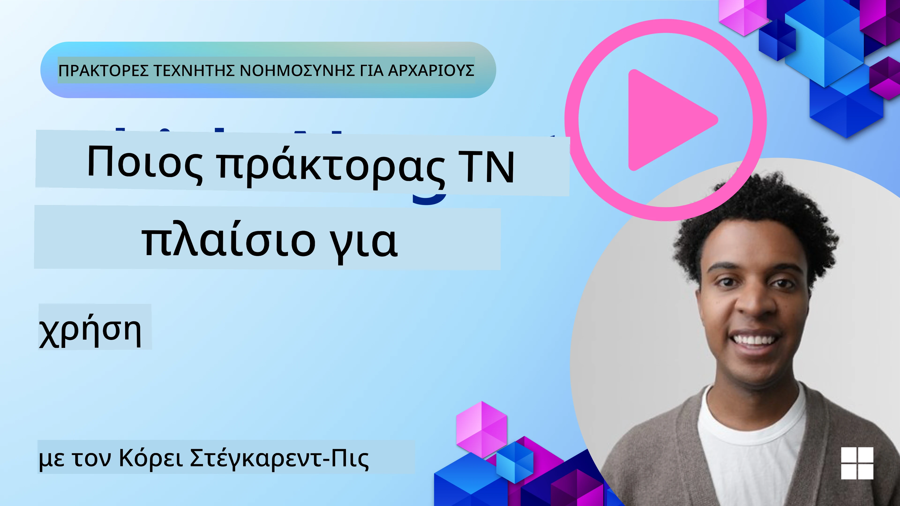

[](https://youtu.be/ODwF-EZo_O8?si=1xoy_B9RNQfrYdF7)

> _(Κάντε κλικ στην παραπάνω εικόνα για να δείτε το βίντεο αυτού του μαθήματος)_

# Εξερευνήστε τα Πλαίσια Εργασίας Πρακτόρων AI

Τα πλαίσια εργασίας πρακτόρων AI είναι πλατφόρμες λογισμικού που έχουν σχεδιαστεί για να απλοποιούν τη δημιουργία, την ανάπτυξη και τη διαχείριση πρακτόρων AI. Αυτά τα πλαίσια παρέχουν στους προγραμματιστές προκατασκευασμένα στοιχεία, αφαιρέσεις και εργαλεία που διευκολύνουν την ανάπτυξη σύνθετων συστημάτων AI.

Αυτά τα πλαίσια βοηθούν τους προγραμματιστές να εστιάσουν στα μοναδικά στοιχεία των εφαρμογών τους παρέχοντας τυποποιημένες προσεγγίσεις για κοινές προκλήσεις στην ανάπτυξη πρακτόρων AI. Βελτιώνουν την κλιμακωσιμότητα, την προσβασιμότητα και την αποτελεσματικότητα στην κατασκευή συστημάτων AI.

## Εισαγωγή 

Αυτό το μάθημα θα καλύψει:

- Τι είναι τα Πλαίσια Εργασίας Πρακτόρων AI και τι επιτρέπουν στους προγραμματιστές να επιτύχουν;
- Πώς μπορούν οι ομάδες να τα χρησιμοποιήσουν για να πρωτοτυπήσουν γρήγορα, να επαναλάβουν και να βελτιώσουν τις δυνατότητες του πράκτορά τους;
- Ποιες είναι οι διαφορές μεταξύ των πλαισίων και εργαλείων που δημιουργήθηκαν από τη Microsoft (<a href="https://aka.ms/ai-agents-beginners/ai-agent-service" target="_blank">Azure AI Agent Service</a> και το <a href="https://learn.microsoft.com/azure/ai-services/openai/how-to/responses" target="_blank">Microsoft Agent Framework</a>);
- Μπορώ να ενσωματώσω τα υπάρχοντα εργαλεία του οικοσυστήματος Azure απευθείας, ή χρειάζομαι ανεξάρτητες λύσεις;
- Τι είναι η υπηρεσία Azure AI Agents και πώς με βοηθάει αυτό;

## Στόχοι μάθησης

Οι στόχοι αυτού του μαθήματος είναι να σας βοηθήσουν να κατανοήσετε:

- Το ρόλο των Πλαισίων Εργασίας Πρακτόρων AI στην ανάπτυξη AI.
- Πώς να αξιοποιήσετε τα Πλαίσια Εργασίας Πρακτόρων AI για να δημιουργήσετε έξυπνους πράκτορες.
- Βασικές δυνατότητες που ενεργοποιούνται από τα Πλαίσια Εργασίας Πρακτόρων AI.
- Τις διαφορές μεταξύ του Microsoft Agent Framework και της υπηρεσίας Azure AI Agent Service.

## Τι είναι τα Πλαίσια Εργασίας Πρακτόρων AI και τι επιτρέπουν στους προγραμματιστές να κάνουν;

Τα παραδοσιακά Πλαίσια AI μπορούν να σας βοηθήσουν να ενσωματώσετε AI στις εφαρμογές σας και να τις βελτιώσετε με τους ακόλουθους τρόπους:

- **Προσωποποίηση**: Η AI μπορεί να αναλύσει τη συμπεριφορά και τις προτιμήσεις του χρήστη για να παρέχει εξατομικευμένες προτάσεις, περιεχόμενο και εμπειρίες.
Παράδειγμα: Υπηρεσίες streaming όπως το Netflix χρησιμοποιούν AI για να προτείνουν ταινίες και σειρές βάσει του ιστορικού προβολών, ενισχύοντας την εμπλοκή και την ικανοποίηση των χρηστών.
- **Αυτοματοποίηση και Αποτελεσματικότητα**: Η AI μπορεί να αυτοματοποιήσει επαναλαμβανόμενες εργασίες, να απλοποιήσει ροές εργασίας και να βελτιώσει την επιχειρησιακή αποδοτικότητα.
Παράδειγμα: Εφαρμογές εξυπηρέτησης πελατών χρησιμοποιούν chatbots με AI για να χειρίζονται κοινά αιτήματα, μειώνοντας τους χρόνους απόκρισης και απελευθερώνοντας ανθρώπινους πράκτορες για πιο σύνθετα ζητήματα.
- **Βελτιωμένη Εμπειρία Χρήστη**: Η AI μπορεί να βελτιώσει τη συνολική εμπειρία χρήστη παρέχοντας έξυπνες λειτουργίες όπως αναγνώριση φωνής, επεξεργασία φυσικής γλώσσας και προβλεπτικό κείμενο.
Παράδειγμα: Εικονικοί βοηθοί όπως η Siri και ο Google Assistant χρησιμοποιούν AI για να κατανοούν και να ανταποκρίνονται σε φωνητικές εντολές, διευκολύνοντας την αλληλεπίδραση των χρηστών με τις συσκευές τους.

### Αυτό όλα ακούγονται υπέροχα, οπότε γιατί χρειαζόμαστε το Πλαίσιο Εργασίας Πρακτόρων AI;

Τα πλαίσια εργασίας πρακτόρων AI αντιπροσωπεύουν κάτι περισσότερο από απλά πλαίσια AI. Έχουν σχεδιαστεί για να επιτρέπουν τη δημιουργία έξυπνων πρακτόρων που μπορούν να αλληλεπιδρούν με χρήστες, άλλους πράκτορες και το περιβάλλον για την επίτευξη συγκεκριμένων στόχων. Αυτοί οι πράκτορες μπορούν να επιδεικνύουν αυτόνομη συμπεριφορά, να λαμβάνουν αποφάσεις και να προσαρμόζονται σε μεταβαλλόμενες συνθήκες. Ας δούμε μερικές βασικές δυνατότητες που ενεργοποιούνται από τα Πλαίσια Εργασίας Πρακτόρων AI:

- **Συνεργασία και Συντονισμός Πρακτόρων**: Δίνουν τη δυνατότητα δημιουργίας πολλαπλών πρακτόρων AI που μπορούν να εργάζονται μαζί, να επικοινωνούν και να συντονίζονται για την επίλυση σύνθετων εργασιών.
- **Αυτοματοποίηση και Διαχείριση Εργασιών**: Παρέχουν μηχανισμούς για την αυτοματοποίηση πολυσταδιακών ροών εργασίας, την ανάθεση εργασιών και τη δυναμική διαχείριση εργασιών μεταξύ πρακτόρων.
- **Συγκειμενική Κατανόηση και Προσαρμογή**: Εξοπλίζουν τους πράκτορες με την ικανότητα να κατανοούν το πλαίσιο, να προσαρμόζονται σε μεταβαλλόμενα περιβάλλοντα και να λαμβάνουν αποφάσεις βάσει πληροφοριών σε πραγματικό χρόνο.

Συνοψίζοντας, οι πράκτορες σας επιτρέπουν να κάνετε περισσότερα, να ανεβάσετε την αυτοματοποίηση σε ανώτερο επίπεδο και να δημιουργήσετε πιο έξυπνα συστήματα που μπορούν να προσαρμόζονται και να μαθαίνουν από το περιβάλλον τους.

## Πώς να πρωτοτυπήσετε γρήγορα, να επαναλάβετε και να βελτιώσετε τις δυνατότητες του πράκτορα;

Αυτό το τοπίο εξελίσσεται γρήγορα, αλλά υπάρχουν κάποια στοιχεία κοινά στα περισσότερα Πλαίσια Εργασίας Πρακτόρων AI που μπορούν να σας βοηθήσουν να πρωτοτυπήσετε και να επαναλάβετε γρήγορα, συγκεκριμένα τα δομικά στοιχεία του module, τα συνεργατικά εργαλεία και η μάθηση σε πραγματικό χρόνο. Ας δούμε αυτά:

- **Χρησιμοποιήστε Μονάδες (Modular Components)**: Τα SDK AI προσφέρουν προκατασκευασμένα στοιχεία όπως συνδέσμους AI και μνήμης, κλήσεις συναρτήσεων χρησιμοποιώντας φυσική γλώσσα ή plugin κώδικα, πρότυπα prompt και άλλα.
- **Αξιοποιήστε Συνεργατικά Εργαλεία**: Σχεδιάστε πράκτορες με συγκεκριμένους ρόλους και εργασίες, επιτρέποντάς τους να δοκιμάζουν και να βελτιώνουν συνεργατικές ροές εργασίας.
- **Μάθηση σε Πραγματικό Χρόνο**: Εφαρμόστε βρόχους ανατροφοδότησης όπου οι πράκτορες μαθαίνουν από αλληλεπιδράσεις και προσαρμόζουν τη συμπεριφορά τους δυναμικά.

### Χρησιμοποιήστε Μονάδες (Modular Components)

SDKs όπως το Microsoft Agent Framework προσφέρουν προκατασκευασμένα στοιχεία όπως συνδέσμους AI, ορισμούς εργαλείων και διαχείριση πρακτόρων.

**Πώς μπορούν οι ομάδες να τα χρησιμοποιήσουν**: Οι ομάδες μπορούν να συναρμολογήσουν γρήγορα αυτά τα στοιχεία για να δημιουργήσουν ένα λειτουργικό πρωτότυπο χωρίς να ξεκινήσουν από το μηδέν, επιτρέποντας γρήγορη πειραματισμό και επανάληψη.

**Πώς λειτουργεί στην πράξη**: Μπορείτε να χρησιμοποιήσετε έναν προκατασκευασμένο αναλυτή για να εξάγετε πληροφορίες από την είσοδο του χρήστη, ένα module μνήμης για αποθήκευση και ανάκτηση δεδομένων και έναν γεννήτορα prompts για αλληλεπίδραση με τους χρήστες, όλα χωρίς να χρειαστεί να κατασκευάσετε αυτά τα στοιχεία από την αρχή.

**Παράδειγμα κώδικα**. Ας δούμε ένα παράδειγμα για το πώς μπορείτε να χρησιμοποιήσετε το Microsoft Agent Framework με `AzureAIProjectAgentProvider` ώστε το μοντέλο να απαντά σε είσοδο χρήστη με κλήση εργαλείων:

``` python
# Παράδειγμα Python του Microsoft Agent Framework

import asyncio
import os
from typing import Annotated

from agent_framework.azure import AzureAIProjectAgentProvider
from azure.identity import AzureCliCredential


# Ορίστε μια δείγμα λειτουργία εργαλείου για κράτηση ταξιδιού
def book_flight(date: str, location: str) -> str:
    """Book travel given location and date."""
    return f"Travel was booked to {location} on {date}"


async def main():
    provider = AzureAIProjectAgentProvider(credential=AzureCliCredential())
    agent = await provider.create_agent(
        name="travel_agent",
        instructions="Help the user book travel. Use the book_flight tool when ready.",
        tools=[book_flight],
    )

    response = await agent.run("I'd like to go to New York on January 1, 2025")
    print(response)
    # Παράδειγμα εξόδου: Η πτήση σας για τη Νέα Υόρκη την 1η Ιανουαρίου 2025 έχει κρατηθεί με επιτυχία. Καλό ταξίδι! ✈️🗽


if __name__ == "__main__":
    asyncio.run(main())
```

Αυτό που μπορείτε να δείτε από αυτό το παράδειγμα είναι πώς μπορείτε να αξιοποιήσετε έναν προκατασκευασμένο αναλυτή για να εξάγετε βασικές πληροφορίες από την είσοδο του χρήστη, όπως η αναχώρηση, ο προορισμός και η ημερομηνία ενός αιτήματος κράτησης πτήσης. Αυτή η modular προσέγγιση σας επιτρέπει να εστιάσετε στη λογική υψηλού επιπέδου.

### Αξιοποιήστε Συνεργατικά Εργαλεία

Πλαίσια όπως το Microsoft Agent Framework διευκολύνουν τη δημιουργία πολλαπλών πρακτόρων που μπορούν να εργαστούν από κοινού.

**Πώς μπορούν οι ομάδες να τα χρησιμοποιήσουν**: Οι ομάδες μπορούν να σχεδιάσουν πράκτορες με συγκεκριμένους ρόλους και εργασίες, επιτρέποντάς τους να δοκιμάζουν και να βελτιώνουν συνεργατικές ροές εργασίας και να βελτιώνουν τη συνολική αποδοτικότητα του συστήματος.

**Πώς λειτουργεί στην πράξη**: Μπορείτε να δημιουργήσετε μια ομάδα πρακτόρων όπου ο κάθε πράκτορας έχει μια εξειδικευμένη λειτουργία, όπως ανάκτηση δεδομένων, ανάλυση ή λήψη αποφάσεων. Αυτοί οι πράκτορες μπορούν να επικοινωνούν και να μοιράζονται πληροφορίες για να πετύχουν έναν κοινό στόχο, όπως να απαντήσουν σε ένα ερώτημα χρήστη ή να ολοκληρώσουν μια εργασία.

**Παράδειγμα κώδικα (Microsoft Agent Framework)**:

```python
# Δημιουργία πολλαπλών πρακτόρων που συνεργάζονται χρησιμοποιώντας το Πλαίσιο Πρακτόρων της Microsoft

import os
from agent_framework.azure import AzureAIProjectAgentProvider
from azure.identity import AzureCliCredential

provider = AzureAIProjectAgentProvider(credential=AzureCliCredential())

# Πράκτορας Ανάκτησης Δεδομένων
agent_retrieve = await provider.create_agent(
    name="dataretrieval",
    instructions="Retrieve relevant data using available tools.",
    tools=[retrieve_tool],
)

# Πράκτορας Ανάλυσης Δεδομένων
agent_analyze = await provider.create_agent(
    name="dataanalysis",
    instructions="Analyze the retrieved data and provide insights.",
    tools=[analyze_tool],
)

# Εκτέλεση πρακτόρων με τη σειρά σε μια εργασία
retrieval_result = await agent_retrieve.run("Retrieve sales data for Q4")
analysis_result = await agent_analyze.run(f"Analyze this data: {retrieval_result}")
print(analysis_result)
```

Αυτό που βλέπετε στον προηγούμενο κώδικα είναι πώς μπορείτε να δημιουργήσετε μια εργασία που περιλαμβάνει πολλαπλούς πράκτορες που συνεργάζονται για την ανάλυση δεδομένων. Κάθε πράκτορας εκτελεί μια συγκεκριμένη λειτουργία και η εργασία εκτελείται συντονίζοντας τους πράκτορες για την επίτευξη του επιθυμητού αποτελέσματος. Δημιουργώντας αφιερωμένους πράκτορες με εξειδικευμένους ρόλους, μπορείτε να βελτιώσετε την αποδοτικότητα και την απόδοση της εργασίας.

### Μαθαίνετε σε Πραγματικό Χρόνο

Προηγμένα πλαίσια παρέχουν δυνατότητες για κατανόηση και προσαρμογή σε πραγματικό χρόνο.

**Πώς μπορούν οι ομάδες να τα χρησιμοποιήσουν**: Οι ομάδες μπορούν να εφαρμόσουν βρόχους ανατροφοδότησης όπου οι πράκτορες μαθαίνουν από αλληλεπιδράσεις και προσαρμόζουν τη συμπεριφορά τους δυναμικά, οδηγώντας σε συνεχή βελτίωση και λείανση των δυνατοτήτων.

**Πώς λειτουργεί στην πράξη**: Οι πράκτορες μπορούν να αναλύουν την ανατροφοδότηση των χρηστών, δεδομένα περιβάλλοντος και αποτελέσματα εργασιών για να ενημερώνουν τη βάση γνώσεων τους, να προσαρμόζουν αλγορίθμους λήψης αποφάσεων και να βελτιώνουν την απόδοση με την πάροδο του χρόνου. Αυτή η επαναληπτική διαδικασία μάθησης επιτρέπει στους πράκτορες να προσαρμόζονται σε μεταβαλλόμενες συνθήκες και στις προτιμήσεις των χρηστών, ενισχύοντας τη συνολική αποτελεσματικότητα του συστήματος.

## Ποιες είναι οι διαφορές μεταξύ του Microsoft Agent Framework και της υπηρεσίας Azure AI Agent Service;

Υπάρχουν πολλοί τρόποι να συγκρίνουμε αυτές τις προσεγγίσεις, αλλά ας δούμε κάποιες βασικές διαφορές από πλευράς σχεδίασης, δυνατοτήτων και στοχευμένων περιπτώσεων χρήσης:

## Microsoft Agent Framework (MAF)

Το Microsoft Agent Framework παρέχει ένα απλοποιημένο SDK για την κατασκευή πρακτόρων AI χρησιμοποιώντας `AzureAIProjectAgentProvider`. Επιτρέπει στους προγραμματιστές να δημιουργούν πράκτορες που αξιοποιούν μοντέλα Azure OpenAI με ενσωματωμένη κλήση εργαλείων, διαχείριση συνομιλίας και ασφάλεια επιπέδου επιχείρησης μέσω ταυτότητας Azure.

**Περιπτώσεις Χρήσης**: Δημιουργία παραγωγικών πρακτόρων AI με χρήση εργαλείων, πολυσταδιακές ροές εργασίας και σενάρια ενσωμάτωσης για επιχειρήσεις.

Εδώ είναι μερικές σημαντικές βασικές έννοιες του Microsoft Agent Framework:

- **Πράκτορες (Agents)**. Ένας πράκτορας δημιουργείται μέσω του `AzureAIProjectAgentProvider` και ρυθμίζεται με ένα όνομα, οδηγίες και εργαλεία. Ο πράκτορας μπορεί:
  - **Να επεξεργάζεται μηνύματα χρηστών** και να παράγει απαντήσεις χρησιμοποιώντας μοντέλα Azure OpenAI.
  - **Να καλεί εργαλεία** αυτόματα βάσει του πλαισίου της συνομιλίας.
  - **Να διατηρεί κατάσταση συνομιλίας** σε πολλές αλληλεπιδράσεις.

  Εδώ είναι ένα απόσπασμα κώδικα που δείχνει πώς να δημιουργήσετε έναν πράκτορα:

    ```python
    import os
    from agent_framework.azure import AzureAIProjectAgentProvider
    from azure.identity import AzureCliCredential

    provider = AzureAIProjectAgentProvider(credential=AzureCliCredential())
    agent = await provider.create_agent(
        name="my_agent",
        instructions="You are a helpful assistant.",
    )

    response = await agent.run("Hello, World!")
    print(response)
    ```

- **Εργαλεία (Tools)**. Το πλαίσιο υποστηρίζει τον ορισμό εργαλείων ως συναρτήσεις Python που ο πράκτορας μπορεί να καλεί αυτόματα. Τα εργαλεία καταχωρούνται κατά τη δημιουργία του πράκτορα:

    ```python
    def get_weather(location: str) -> str:
        """Get the current weather for a location."""
        return f"The weather in {location} is sunny, 72\u00b0F."

    agent = await provider.create_agent(
        name="weather_agent",
        instructions="Help users check the weather.",
        tools=[get_weather],
    )
    ```

- **Συντονισμός Πολλαπλών Πρακτόρων**. Μπορείτε να δημιουργήσετε πολλαπλούς πράκτορες με διαφορετικές εξειδικεύσεις και να συντονίσετε την εργασία τους:

    ```python
    planner = await provider.create_agent(
        name="planner",
        instructions="Break down complex tasks into steps.",
    )

    executor = await provider.create_agent(
        name="executor",
        instructions="Execute the planned steps using available tools.",
        tools=[execute_tool],
    )

    plan = await planner.run("Plan a trip to Paris")
    result = await executor.run(f"Execute this plan: {plan}")
    ```

- **Ενσωμάτωση Ταυτότητας Azure**. Το πλαίσιο χρησιμοποιεί `AzureCliCredential` (ή `DefaultAzureCredential`) για ασφαλή, χωρίς κλειδί αυθεντικοποίηση, εξαλείφοντας την ανάγκη διαχείρισης κλειδιών API απευθείας.

## Azure AI Agent Service

Η υπηρεσία Azure AI Agent Service είναι μια πιο πρόσφατη προσθήκη, που παρουσιάστηκε στο Microsoft Ignite 2024. Επιτρέπει την ανάπτυξη και ανάπτυξη πρακτόρων AI με πιο ευέλικτα μοντέλα, όπως το να καλούνται άμεσα ανοιχτού κώδικα LLMs όπως Llama 3, Mistral και Cohere.

Η Azure AI Agent Service παρέχει ισχυρότερους μηχανισμούς ασφαλείας για επιχειρήσεις και μεθόδους αποθήκευσης δεδομένων, καθιστώντας την κατάλληλη για εφαρμογές επιχειρήσεων.

Λειτουργεί άμεσα με το Microsoft Agent Framework για την κατασκευή και ανάπτυξη πρακτόρων.

Αυτή η υπηρεσία είναι επί του παρόντος σε Public Preview και υποστηρίζει Python και C# για την κατασκευή πρακτόρων.

Χρησιμοποιώντας το Python SDK της Azure AI Agent Service, μπορούμε να δημιουργήσουμε έναν πράκτορα με ένα εργαλείο ορισμένο από τον χρήστη:

```python
import asyncio
from azure.identity import DefaultAzureCredential
from azure.ai.projects import AIProjectClient

# Ορισμός συναρτήσεων εργαλείων
def get_specials() -> str:
    """Provides a list of specials from the menu."""
    return """
    Special Soup: Clam Chowder
    Special Salad: Cobb Salad
    Special Drink: Chai Tea
    """

def get_item_price(menu_item: str) -> str:
    """Provides the price of the requested menu item."""
    return "$9.99"


async def main() -> None:
    credential = DefaultAzureCredential()
    project_client = AIProjectClient.from_connection_string(
        credential=credential,
        conn_str="your-connection-string",
    )

    agent = project_client.agents.create_agent(
        model="gpt-4o-mini",
        name="Host",
        instructions="Answer questions about the menu.",
        tools=[get_specials, get_item_price],
    )

    thread = project_client.agents.create_thread()

    user_inputs = [
        "Hello",
        "What is the special soup?",
        "How much does that cost?",
        "Thank you",
    ]

    for user_input in user_inputs:
        print(f"# User: '{user_input}'")
        message = project_client.agents.create_message(
            thread_id=thread.id,
            role="user",
            content=user_input,
        )
        run = project_client.agents.create_and_process_run(
            thread_id=thread.id, agent_id=agent.id
        )
        messages = project_client.agents.list_messages(thread_id=thread.id)
        print(f"# Agent: {messages.data[0].content[0].text.value}")


if __name__ == "__main__":
    asyncio.run(main())
```

### Βασικές έννοιες

Η Azure AI Agent Service έχει τις ακόλουθες βασικές έννοιες:

- **Πράκτορας (Agent)**. Η Azure AI Agent Service ενσωματώνεται με το Microsoft Foundry. Εντός του AI Foundry, ένας Πράκτορας AI λειτουργεί ως μια "έξυπνη" μικροϋπηρεσία που μπορεί να χρησιμοποιηθεί για την απάντηση ερωτήσεων (RAG), την εκτέλεση ενεργειών ή την πλήρη αυτοματοποίηση ροών εργασίας. Το επιτυγχάνει συνδυάζοντας τη δύναμη μοντέλων γενετικής AI με εργαλεία που του επιτρέπουν να έχει πρόσβαση και να αλληλεπιδρά με πραγματικές πηγές δεδομένων. Εδώ είναι ένα παράδειγμα ενός πράκτορα:

    ```python
    agent = project_client.agents.create_agent(
        model="gpt-4o-mini",
        name="my-agent",
        instructions="You are helpful agent",
        tools=code_interpreter.definitions,
        tool_resources=code_interpreter.resources,
    )
    ```

    Σε αυτό το παράδειγμα, ένας πράκτορας δημιουργείται με το μοντέλο `gpt-4o-mini`, όνομα `my-agent` και οδηγίες `You are helpful agent`. Ο πράκτορας είναι εξοπλισμένος με εργαλεία και πόρους για την εκτέλεση εργασιών ερμηνείας κώδικα.

- **Thread και μηνύματα**. Το thread είναι μια άλλη σημαντική έννοια. Εκπροσωπεί μια συνομιλία ή αλληλεπίδραση μεταξύ ενός πράκτορα και ενός χρήστη. Τα threads μπορούν να χρησιμοποιηθούν για την παρακολούθηση της προόδου μιας συνομιλίας, την αποθήκευση πληροφοριών πλαισίου και τη διαχείριση της κατάστασης της αλληλεπίδρασης. Εδώ είναι ένα παράδειγμα ενός thread:

    ```python
    thread = project_client.agents.create_thread()
    message = project_client.agents.create_message(
        thread_id=thread.id,
        role="user",
        content="Could you please create a bar chart for the operating profit using the following data and provide the file to me? Company A: $1.2 million, Company B: $2.5 million, Company C: $3.0 million, Company D: $1.8 million",
    )
    
    # Ask the agent to perform work on the thread
    run = project_client.agents.create_and_process_run(thread_id=thread.id, agent_id=agent.id)
    
    # Fetch and log all messages to see the agent's response
    messages = project_client.agents.list_messages(thread_id=thread.id)
    print(f"Messages: {messages}")
    ```

    Στον προηγούμενο κώδικα, δημιουργείται ένα thread. Στη συνέχεια, αποστέλλεται ένα μήνυμα στο thread. Με την κλήση `create_and_process_run`, ζητείται από τον πράκτορα να εκτελέσει εργασία στο thread. Τέλος, τα μηνύματα ανακτώνται και καταγράφονται για να δούμε την απάντηση του πράκτορα. Τα μηνύματα υποδεικνύουν την πρόοδο της συνομιλίας μεταξύ του χρήστη και του πράκτορα. Είναι επίσης σημαντικό να κατανοήσετε ότι τα μηνύματα μπορούν να είναι διαφορετικών τύπων όπως κείμενο, εικόνα ή αρχείο — δηλαδή η εργασία των πρακτόρων έχει ως αποτέλεσμα για παράδειγμα μια εικόνα ή μια κειμενική απάντηση. Ως προγραμματιστής, μπορείτε στη συνέχεια να χρησιμοποιήσετε αυτές τις πληροφορίες για περαιτέρω επεξεργασία της απάντησης ή να τις παρουσιάσετε στον χρήστη.

- **Ενσωματώνεται με το Microsoft Agent Framework**. Η Azure AI Agent Service λειτουργεί απρόσκοπτα με το Microsoft Agent Framework, που σημαίνει ότι μπορείτε να δημιουργείτε πράκτορες χρησιμοποιώντας `AzureAIProjectAgentProvider` και να τους αναπτύσσετε μέσω της Agent Service για σενάρια παραγωγής.

**Περιπτώσεις Χρήσης**: Η Azure AI Agent Service έχει σχεδιαστεί για εφαρμογές επιχειρήσεων που απαιτούν ασφαλή, κλιμακώσιμη και ευέλικτη ανάπτυξη πρακτόρων AI.

## Ποια είναι η διαφορά μεταξύ αυτών των προσεγγίσεων?
 
Φαίνεται πως υπάρχει επικάλυψη, αλλά υπάρχουν κάποιες βασικές διαφορές όσον αφορά τον σχεδιασμό, τις δυνατότητες και τις στοχευμένες περιπτώσεις χρήσης:
 
- **Microsoft Agent Framework (MAF)**: Είναι ένα παραγωγικά-έτοιμο SDK για την κατασκευή πρακτόρων AI. Παρέχει ένα απλοποιημένο API για τη δημιουργία πρακτόρων με κλήση εργαλείων, διαχείριση συνομιλίας και ενσωμάτωση ταυτότητας Azure.
- **Azure AI Agent Service**: Είναι μια πλατφόρμα και υπηρεσία ανάπτυξης στο Azure Foundry για πράκτορες. Προσφέρει ενσωματωμένη συνδεσιμότητα με υπηρεσίες όπως Azure OpenAI, Azure AI Search, Bing Search και εκτέλεση κώδικα.
 
Ακόμα δεν είστε σίγουροι ποιο να επιλέξετε;

### Περιπτώσεις Χρήσης
 
Ας δούμε αν μπορούμε να σας βοηθήσουμε εξετάζοντας μερικές κοινές περιπτώσεις χρήσης:
 
> Q: Δημιουργώ παραγωγικές εφαρμογές πρακτόρων AI και θέλω να ξεκινήσω γρήγορα
>

>A: Το Microsoft Agent Framework είναι μια εξαιρετική επιλογή. Παρέχει ένα απλό, Pythonic API μέσω `AzureAIProjectAgentProvider` που σας επιτρέπει να ορίσετε πράκτορες με εργαλεία και οδηγίες σε μόλις λίγες γραμμές κώδικα.

>Q: Χρειάζομαι ανάπτυξη επιπέδου επιχείρησης με ενσωματώσεις Azure όπως Search και εκτέλεση κώδικα
>
> A: Η Azure AI Agent Service είναι η καλύτερη επιλογή. Είναι μια υπηρεσία πλατφόρμας που παρέχει ενσωματωμένες δυνατότητες για πολλαπλά μοντέλα, Azure AI Search, Bing Search και Azure Functions. Κάνει εύκολο το να δημιουργήσετε τους πράκτορές σας στο Foundry Portal και να τους αναπτύξετε σε κλίμακα.
 
> Q: Ακόμα μπερδεύομαι, δώστε μου μόνο μια επιλογή
>
> A: Ξεκινήστε με το Microsoft Agent Framework για να δημιουργήσετε τους πράκτορές σας, και στη συνέχεια χρησιμοποιήστε την Azure AI Agent Service όταν χρειαστεί να τους αναπτύξετε και να τους κλιμακώσετε στην παραγωγή. Αυτή η προσέγγιση σας επιτρέπει να επαναλαμβάνετε γρήγορα τη λογική του πράκτορα ενώ έχετε μια σαφή πορεία προς την ανάπτυξη για επιχειρήσεις.
 
Ας συνοψίσουμε τις βασικές διαφορές σε έναν πίνακα:

| Framework | Focus | Core Concepts | Use Cases |
| --- | --- | --- | --- |
| Microsoft Agent Framework | Απλοποιημένο SDK πρακτόρων με κλήση εργαλείων | Πράκτορες, Εργαλεία, Azure Identity | Δημιουργία πρακτόρων AI, χρήση εργαλείων, πολυσταδιακές ροές εργασίας |
| Azure AI Agent Service | Ευέλικτα μοντέλα, ασφάλεια επιχείρησης, Δημιουργία κώδικα, Κλήση εργαλείων | Επικαιροποίηση, Συνεργασία, Ορχήστρωση διαδικασιών | Ασφαλής, κλιμακώσιμη και ευέλικτη ανάπτυξη πρακτόρων AI |

## Μπορώ να ενσωματώσω τα υπάρχοντα εργαλεία του οικοσυστήματος Azure απευθείας, ή χρειάζομαι ανεξάρτητες λύσεις?
Η απάντηση είναι ναι — μπορείτε να ενσωματώσετε τα υπάρχοντα εργαλεία του οικοσυστήματος Azure απευθείας με την υπηρεσία Azure AI Agent Service, καθώς έχει σχεδιαστεί για να λειτουργεί απρόσκοπτα με άλλες υπηρεσίες Azure. Για παράδειγμα, μπορείτε να ενσωματώσετε το Bing, το Azure AI Search και τις Azure Functions. Υπάρχει επίσης βαθιά ενσωμάτωση με το Microsoft Foundry.

Το Microsoft Agent Framework επίσης ενσωματώνεται με υπηρεσίες Azure μέσω του `AzureAIProjectAgentProvider` και της ταυτότητας Azure, επιτρέποντάς σας να καλείτε υπηρεσίες Azure απευθείας από τα εργαλεία του agent σας.

## Δείγματα Κώδικα

- Python: [Agent Framework](./code_samples/02-python-agent-framework.ipynb)
- .NET: [Agent Framework](./code_samples/02-dotnet-agent-framework.md)

## Έχετε περισσότερες ερωτήσεις σχετικά με τα πλαίσια εργασίας για AI Agents?

Εγγραφείτε στο [Microsoft Foundry Discord](https://aka.ms/ai-agents/discord) για να συναντήσετε άλλους συμμετέχοντες, να παρακολουθήσετε τις ώρες γραφείου και να λάβετε απαντήσεις στις ερωτήσεις σας για τους AI Agents.

## Αναφορές

- <a href="https://techcommunity.microsoft.com/blog/azure-ai-services-blog/introducing-azure-ai-agent-service/4298357" target="_blank">Υπηρεσία Azure Agent</a>
- <a href="https://learn.microsoft.com/azure/ai-services/openai/how-to/responses" target="_blank">Microsoft Agent Framework - Απαντήσεις Azure OpenAI</a>
- <a href="https://learn.microsoft.com/azure/ai-services/agents/overview" target="_blank">Υπηρεσία Azure AI Agent</a>

## Προηγούμενο Μάθημα

[Introduction to AI Agents and Agent Use Cases](../01-intro-to-ai-agents/README.md)

## Επόμενο Μάθημα

[Understanding Agentic Design Patterns](../03-agentic-design-patterns/README.md)

---

<!-- CO-OP TRANSLATOR DISCLAIMER START -->
Αποποίηση ευθυνών:
Αυτό το έγγραφο έχει μεταφραστεί με τη χρήση της υπηρεσίας μετάφρασης με τεχνητή νοημοσύνη [Co-op Translator](https://github.com/Azure/co-op-translator). Παρά τις προσπάθειές μας για ακρίβεια, να γνωρίζετε ότι οι αυτοματοποιημένες μεταφράσεις ενδέχεται να περιέχουν σφάλματα ή ανακρίβειες. Το πρωτότυπο έγγραφο στην αρχική του γλώσσα πρέπει να θεωρείται η αυθεντική πηγή. Για κρίσιμες πληροφορίες, συνιστάται επαγγελματική μετάφραση από ανθρώπινο μεταφραστή. Δεν φέρουμε ευθύνη για τυχόν παρανοήσεις ή λανθασμένες ερμηνείες που προκύπτουν από τη χρήση αυτής της μετάφρασης.
<!-- CO-OP TRANSLATOR DISCLAIMER END -->