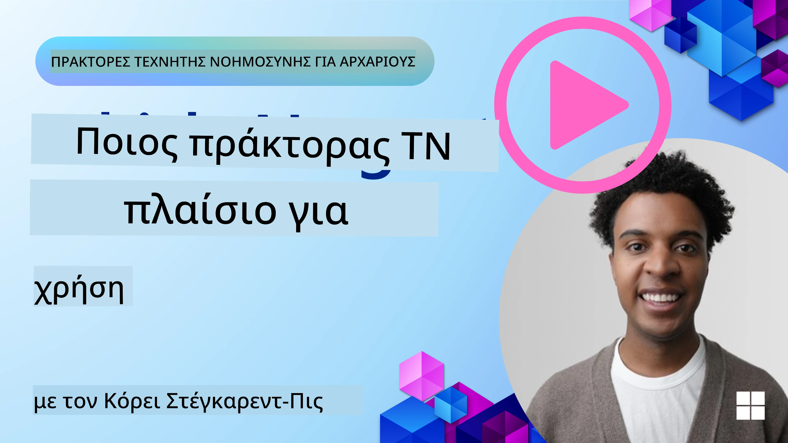

[](https://youtu.be/ODwF-EZo_O8?si=1xoy_B9RNQfrYdF7)

> _(Κάντε κλικ στην παραπάνω εικόνα για να δείτε το βίντεο αυτού του μαθήματος)_

# Εξερεύνηση Πλαισίων Εργασίας AI Agents

Τα πλαίσια εργασίας AI agents είναι πλατφόρμες λογισμικού σχεδιασμένες να απλοποιούν τη δημιουργία, την ανάπτυξη και τη διαχείριση AI agents. Αυτά τα πλαίσια παρέχουν στους προγραμματιστές έτοιμα δομικά στοιχεία, αφαιρέσεις και εργαλεία που διευκολύνουν την ανάπτυξη σύνθετων συστημάτων AI.

Αυτά τα πλαίσια βοηθούν τους προγραμματιστές να εστιάσουν στις μοναδικές πτυχές των εφαρμογών τους παρέχοντας τυποποιημένες προσεγγίσεις σε κοινές προκλήσεις στην ανάπτυξη AI agents. Βελτιώνουν την κλιμακωσιμότητα, την προσβασιμότητα και την αποδοτικότητα στην κατασκευή συστημάτων AI.

## Εισαγωγή 

Αυτό το μάθημα θα καλύψει:

- Τι είναι τα Πλαίσια Εργασίας AI Agent και τι επιτρέπουν στους προγραμματιστές να πετύχουν;
- Πώς μπορούν οι ομάδες να τα χρησιμοποιήσουν για να δημιουργήσουν γρήγορα πρωτότυπα, να επαναλάβουν και να βελτιώσουν τις δυνατότητες του agent τους;
- Ποιες είναι οι διαφορές μεταξύ των πλαισίων και εργαλείων που δημιούργησε η Microsoft (<a href="https://aka.ms/ai-agents-beginners/ai-agent-service" target="_blank">Microsoft Foundry Agent Service</a> και το <a href="https://learn.microsoft.com/azure/ai-services/openai/how-to/responses" target="_blank">Microsoft Agent Framework</a>);
- Μπορώ να ενσωματώσω απευθείας τα υπάρχοντα εργαλεία του οικοσυστήματος Azure ή χρειάζομαι αυτόνομες λύσεις;
- Τι είναι το Microsoft Foundry Agent Service και πώς με βοηθά;

## Στόχοι μάθησης

Οι στόχοι αυτού του μαθήματος είναι να σας βοηθήσουν να κατανοήσετε:

- Τον ρόλο των Πλαισίων Εργασίας AI Agent στην ανάπτυξη AI.
- Πώς να αξιοποιήσετε τα Πλαίσια Εργασίας AI Agent για να δημιουργήσετε ευφυείς agents.
- Βασικές δυνατότητες που ενεργοποιούνται από τα Πλαίσια Εργασίας AI Agent.
- Τις διαφορές μεταξύ του Microsoft Agent Framework και του Microsoft Foundry Agent Service.

## Τι είναι τα Πλαίσια Εργασίας AI Agent και τι επιτρέπουν στους προγραμματιστές να κάνουν;

Τα παραδοσιακά Πλαίσια Εργασίας AI μπορούν να σας βοηθήσουν να ενσωματώσετε AI στις εφαρμογές σας και να τις βελτιώσετε με τους ακόλουθους τρόπους:

- **Προσωποποίηση**: Το AI μπορεί να αναλύσει τη συμπεριφορά και τις προτιμήσεις του χρήστη για να προσφέρει εξατομικευμένες προτάσεις, περιεχόμενο και εμπειρίες.
Παραδείγματα: Υπηρεσίες streaming όπως το Netflix χρησιμοποιούν AI για να προτείνουν ταινίες και σόου βάσει του ιστορικού παρακολούθησης, ενισχύοντας την αφοσίωση και ικανοποίηση των χρηστών.
- **Αυτοματοποίηση και Αποδοτικότητα**: Το AI μπορεί να αυτοματοποιεί επαναλαμβανόμενες εργασίες, να απλοποιεί ροές εργασιών και να βελτιώνει την επιχειρησιακή αποδοτικότητα.
Παραδείγματα: Εφαρμογές εξυπηρέτησης πελατών χρησιμοποιούν chatbots με AI για να διαχειρίζονται κοινές ερωτήσεις, μειώνοντας τους χρόνους απόκρισης και ελευθερώνοντας ανθρώπινους πράκτορες για πιο σύνθετα ζητήματα.
- **Βελτιωμένη Εμπειρία Χρήστη**: Το AI μπορεί να βελτιώσει συνολικά την εμπειρία χρήστη παρέχοντας ευφυή χαρακτηριστικά όπως αναγνώριση φωνής, επεξεργασία φυσικής γλώσσας και προγνωστικό κείμενο.
Παραδείγματα: Εικονικοί βοηθοί όπως η Siri και ο Google Assistant χρησιμοποιούν AI για να κατανοούν και να ανταποκρίνονται σε φωνητικές εντολές, κάνοντας πιο εύκολη την αλληλεπίδραση των χρηστών με τις συσκευές τους.

### Όλα αυτά ακούγονται υπέροχα, οπότε γιατί χρειαζόμαστε το Πλαίσιο Εργασίας AI Agent;

Τα Πλαίσια Εργασίας AI Agent αντιπροσωπεύουν κάτι παραπάνω από απλά πλαίσια AI. Έχουν σχεδιαστεί για να διευκολύνουν τη δημιουργία ευφυών agents που μπορούν να αλληλεπιδρούν με χρήστες, άλλους agents και το περιβάλλον, για να επιτύχουν συγκεκριμένους στόχους. Αυτοί οι agents μπορούν να εμφανίζουν αυτόνομη συμπεριφορά, να παίρνουν αποφάσεις και να προσαρμόζονται σε μεταβαλλόμενες συνθήκες. Ας δούμε μερικές βασικές δυνατότητες που προσφέρουν τα Πλαίσια Εργασίας AI Agent:

- **Συνεργασία και Συντονισμός Agents**: Επιτρέπουν τη δημιουργία πολλαπλών AI agents που μπορούν να συνεργαστούν, να επικοινωνούν και να συντονίζονται για την επίλυση σύνθετων εργασιών.
- **Αυτοματοποίηση και Διαχείριση Εργασιών**: Παρέχουν μηχανισμούς για αυτοματοποίηση πολυβηματικών ροών εργασιών, ανάθεση εργασιών και δυναμική διαχείριση εργασιών μεταξύ agents.
- **Κατανόηση Συμφραζομένων και Προσαρμογή**: Εξοπλίζουν τους agents με την ικανότητα κατανόησης του συμφραζομένου, προσαρμογής σε μεταβαλλόμενα περιβάλλοντα και λήψης αποφάσεων βάσει πληροφοριών σε πραγματικό χρόνο.

Συνοπτικά, οι agents σας επιτρέπουν να κάνετε περισσότερα, να ανεβάσετε την αυτοματοποίηση σε ανώτερο επίπεδο, να δημιουργήσετε πιο ευφυή συστήματα που μπορούν να προσαρμόζονται και να μαθαίνουν από το περιβάλλον τους.

## Πώς να δημιουργήσετε γρήγορα πρωτότυπα, να επαναλάβετε και να βελτιώσετε τις δυνατότητες του agent;

Αυτό το πεδίο εξελίσσεται γρήγορα, αλλά υπάρχουν κάποια κοινά στοιχεία στα περισσότερα Πλαίσια AI Agent που μπορούν να βοηθήσουν στην γρήγορη δημιουργία πρωτότυπων και επαναλήψεων, όπως δομικά στοιχεία μονάδων, συνεργατικά εργαλεία και μάθηση σε πραγματικό χρόνο. Ας δούμε αυτά λεπτομερώς:

- **Χρήση Μονάδων (Modular Components)**: Τα SDK AI προσφέρουν προ-κατασκευασμένα στοιχεία όπως συνδέσμους AI και Μνήμη, κλήσεις συναρτήσεων μέσω φυσικής γλώσσας ή προσθηκών κώδικα, πρότυπα prompts, και άλλα.
- **Αξιοποίηση Συνεργατικών Εργαλείων**: Σχεδιάστε agents με συγκεκριμένους ρόλους και εργασίες, επιτρέποντάς τους να δοκιμάζουν και να βελτιστοποιούν συνεργατικές ροές εργασίας.
- **Μάθηση σε Πραγματικό Χρόνο**: Εφαρμόστε βρόχους ανατροφοδότησης όπου οι agents μαθαίνουν από τις αλληλεπιδράσεις και προσαρμόζουν δυναμικά τη συμπεριφορά τους.

### Χρήση Μονάδων

SDKs όπως το Microsoft Agent Framework προσφέρουν προ-κατασκευασμένα στοιχεία όπως AI connectors, ορισμούς εργαλείων και διαχείριση agents.

**Πώς μπορούν οι ομάδες να τα χρησιμοποιήσουν**: Οι ομάδες μπορούν γρήγορα να συγκεντρώσουν αυτά τα στοιχεία για να δημιουργήσουν ένα λειτουργικό πρωτότυπο χωρίς να ξεκινούν από το μηδέν, επιτρέποντας την ταχεία πειραματική διαδικασία και επανάληψη.

**Πώς λειτουργεί στην πράξη**: Μπορείτε να χρησιμοποιήσετε έναν προ-κατασκευασμένο αναλυτή για να εξάγετε πληροφορίες από την είσοδο του χρήστη, μια μονάδα μνήμης για αποθήκευση και ανάκτηση δεδομένων, και έναν γεννήτορα prompt για να αλληλεπιδράτε με τους χρήστες, όλα αυτά χωρίς να χρειάζεται να κατασκευάσετε αυτά τα στοιχεία από την αρχή.

**Παράδειγμα κώδικα**. Ας δούμε ένα παράδειγμα χρήσης του Microsoft Agent Framework με `FoundryChatClient` για να απαντά το μοντέλο σε είσοδο χρήστη με κλήση εργαλείων:

``` python
# Παράδειγμα Microsoft Agent Framework με Python

import asyncio
import os

from agent_framework import tool
from agent_framework.foundry import FoundryChatClient
from azure.identity import AzureCliCredential


# Ορισμός δείγματος συνάρτησης εργαλείου για κράτηση ταξιδιού
@tool(approval_mode="never_require")
def book_flight(date: str, location: str) -> str:
    """Book travel given location and date."""
    return f"Travel was booked to {location} on {date}"


async def main():
    provider = FoundryChatClient(
        project_endpoint=os.environ["AZURE_AI_PROJECT_ENDPOINT"],
        model=os.environ["AZURE_AI_MODEL_DEPLOYMENT_NAME"],
        credential=AzureCliCredential(),
    )
    agent = provider.as_agent(
        name="travel_agent",
        instructions="Help the user book travel. Use the book_flight tool when ready.",
        tools=[book_flight],
    )

    response = await agent.run("I'd like to go to New York on January 1, 2025")
    print(response)
    # Παράδειγμα εξόδου: Η πτήση σας προς τη Νέα Υόρκη την 1η Ιανουαρίου 2025 έχει κλειστεί με επιτυχία. Καλό ταξίδι! ✈️🗽


if __name__ == "__main__":
    asyncio.run(main())
```

Από αυτό το παράδειγμα φαίνεται πώς μπορείτε να αξιοποιήσετε έναν προ-κατασκευασμένο αναλυτή για να εξάγετε βασικές πληροφορίες από την είσοδο χρήστη, όπως προέλευση, προορισμό και ημερομηνία ενός αιτήματος κράτησης πτήσης. Αυτή η μονάδα προσέγγιση σας επιτρέπει να εστιάσετε στη λογική υψηλού επιπέδου.

### Αξιοποίηση Συνεργατικών Εργαλείων

Πλαίσια όπως το Microsoft Agent Framework διευκολύνουν τη δημιουργία πολλαπλών agents που μπορούν να συνεργάζονται.

**Πώς μπορούν οι ομάδες να τα χρησιμοποιήσουν**: Οι ομάδες μπορούν να σχεδιάσουν agents με συγκεκριμένους ρόλους και εργασίες, επιτρέποντάς τους να δοκιμάζουν και να βελτιστοποιούν συνεργατικές ροές εργασίας και να βελτιώνουν τη συνολική αποδοτικότητα του συστήματος.

**Πώς λειτουργεί στην πράξη**: Μπορείτε να δημιουργήσετε μια ομάδα από agents όπου κάθε agent έχει μια ειδικευμένη λειτουργία, όπως ανάκτηση δεδομένων, ανάλυση ή λήψη αποφάσεων. Αυτοί οι agents μπορούν να επικοινωνούν και να μοιράζονται πληροφορίες για να επιτύχουν έναν κοινό στόχο, όπως να απαντήσουν σε ένα ερώτημα χρήστη ή να ολοκληρώσουν μια εργασία.

**Παράδειγμα κώδικα (Microsoft Agent Framework)**:

```python
# Δημιουργία πολλαπλών πρακτόρων που συνεργάζονται χρησιμοποιώντας το Microsoft Agent Framework

import os
from agent_framework.foundry import FoundryChatClient
from azure.identity import AzureCliCredential

provider = FoundryChatClient(
    project_endpoint=os.environ["AZURE_AI_PROJECT_ENDPOINT"],
    model=os.environ["AZURE_AI_MODEL_DEPLOYMENT_NAME"],
    credential=AzureCliCredential(),
)

# Πράκτορας Ανάκτησης Δεδομένων
agent_retrieve = provider.as_agent(
    name="dataretrieval",
    instructions="Retrieve relevant data using available tools.",
    tools=[retrieve_tool],
)

# Πράκτορας Ανάλυσης Δεδομένων
agent_analyze = provider.as_agent(
    name="dataanalysis",
    instructions="Analyze the retrieved data and provide insights.",
    tools=[analyze_tool],
)

# Εκτέλεση των πρακτόρων με σειρά σε μια εργασία
retrieval_result = await agent_retrieve.run("Retrieve sales data for Q4")
analysis_result = await agent_analyze.run(f"Analyze this data: {retrieval_result}")
print(analysis_result)
```

Αυτό που βλέπετε στον προηγούμενο κώδικα είναι πώς μπορείτε να δημιουργήσετε μια εργασία που περιλαμβάνει πολλαπλούς agents που συνεργάζονται για την ανάλυση δεδομένων. Κάθε agent πραγματοποιεί μια συγκεκριμένη λειτουργία και η εργασία εκτελείται συντονίζοντας τους agents για να επιτευχθεί το επιθυμητό αποτέλεσμα. Με τη δημιουργία ειδικευμένων agents με συγκεκριμένους ρόλους, μπορείτε να βελτιώσετε την αποδοτικότητα και την απόδοση της εργασίας.

### Μάθηση σε Πραγματικό Χρόνο

Προηγμένα πλαίσια παρέχουν δυνατότητες για κατανόηση συμφραζομένων και προσαρμογή σε πραγματικό χρόνο.

**Πώς μπορούν οι ομάδες να τα χρησιμοποιήσουν**: Οι ομάδες μπορούν να υλοποιήσουν βρόχους ανατροφοδότησης όπου οι agents μαθαίνουν από τις αλληλεπιδράσεις και προσαρμόζουν τη συμπεριφορά τους δυναμικά, οδηγώντας σε συνεχή βελτίωση και εξέλιξη των δυνατοτήτων.

**Πώς λειτουργεί στην πράξη**: Οι agents μπορούν να αναλύουν ανατροφοδότηση χρηστών, δεδομένα περιβάλλοντος και αποτελέσματα εργασιών για να ενημερώνουν τη βάση γνώσεών τους, να προσαρμόζουν τους αλγορίθμους λήψης αποφάσεων και να βελτιώνουν την απόδοσή τους με την πάροδο του χρόνου. Αυτή η διαδικασία επαναληπτικής μάθησης επιτρέπει στους agents να προσαρμόζονται σε μεταβαλλόμενες συνθήκες και προτιμήσεις χρηστών, βελτιώνοντας τη συνολική αποτελεσματικότητα του συστήματος.

## Ποιες είναι οι διαφορές μεταξύ Microsoft Agent Framework και Microsoft Foundry Agent Service;

Υπάρχουν πολλοί τρόποι να συγκρίνουμε αυτές τις προσεγγίσεις, αλλά ας δούμε μερικές βασικές διαφορές όσον αφορά το σχεδιασμό, τις δυνατότητες και τις στοχευμένες περιπτώσεις χρήσης:

## Microsoft Agent Framework (MAF)

Το Microsoft Agent Framework παρέχει ένα απλοποιημένο SDK για τη δημιουργία AI agents χρησιμοποιώντας το `FoundryChatClient`. Επιτρέπει στους προγραμματιστές να δημιουργούν agents που αξιοποιούν μοντέλα Azure OpenAI με ενσωματωμένη κλήση εργαλείων, διαχείριση συνομιλίας και ασφάλεια επιπέδου επιχείρησης μέσω ταυτότητας Azure.

**Περιπτώσεις χρήσης**: Δημιουργία παραγωγικών AI agents με χρήση εργαλείων, πολυβηματικές ροές εργασιών και σενάρια ενσωμάτωσης επιχείρησης.

Ακολουθούν ορισμένες βασικές έννοιες του Microsoft Agent Framework:

- **Agents**. Ένας agent δημιουργείται μέσω `FoundryChatClient` και ρυθμίζεται με όνομα, οδηγίες και εργαλεία. Ο agent μπορεί:
  - **Να επεξεργάζεται μηνύματα χρήστη** και να παράγει απαντήσεις χρησιμοποιώντας μοντέλα Azure OpenAI.
  - **Να καλεί εργαλεία** αυτόματα βάσει του συμφραζομένου της συνομιλίας.
  - **Να διατηρεί την κατάσταση της συνομιλίας** κατά τη διάρκεια πολλαπλών αλληλεπιδράσεων.

  Εδώ είναι ένα απόσπασμα κώδικα που δείχνει πώς να δημιουργήσετε έναν agent:

    ```python
    import os
    from agent_framework.foundry import FoundryChatClient
    from azure.identity import AzureCliCredential

    provider = FoundryChatClient(
        project_endpoint=os.environ["AZURE_AI_PROJECT_ENDPOINT"],
        model=os.environ["AZURE_AI_MODEL_DEPLOYMENT_NAME"],
        credential=AzureCliCredential(),
    )
    agent = provider.as_agent(
        name="my_agent",
        instructions="You are a helpful assistant.",
    )

    response = await agent.run("Hello, World!")
    print(response)
    ```

- **Εργαλεία**. Το πλαίσιο υποστηρίζει τον ορισμό εργαλείων ως συναρτήσεις Python που ο agent μπορεί να καλεί αυτόματα. Τα εργαλεία καταχωρούνται κατά τη δημιουργία του agent:

    ```python
    def get_weather(location: str) -> str:
        """Get the current weather for a location."""
        return f"The weather in {location} is sunny, 72\u00b0F."

    agent = provider.as_agent(
        name="weather_agent",
        instructions="Help users check the weather.",
        tools=[get_weather],
    )
    ```

- **Συντονισμός πολλαπλών Agents**. Μπορείτε να δημιουργήσετε πολλούς agents με διαφορετικές εξειδικεύσεις και να συντονίσετε τη δουλειά τους:

    ```python
    planner = provider.as_agent(
        name="planner",
        instructions="Break down complex tasks into steps.",
    )

    executor = provider.as_agent(
        name="executor",
        instructions="Execute the planned steps using available tools.",
        tools=[execute_tool],
    )

    plan = await planner.run("Plan a trip to Paris")
    result = await executor.run(f"Execute this plan: {plan}")
    ```

- **Ενσωμάτωση Azure Identity**. Το πλαίσιο χρησιμοποιεί `AzureCliCredential` (ή `DefaultAzureCredential`) για ασφαλή αυθεντικοποίηση χωρίς κλειδιά, εξαλείφοντας την ανάγκη διαχείρισης κλειδιών API απευθείας.

## Microsoft Foundry Agent Service

Το Microsoft Foundry Agent Service είναι μια πιο πρόσφατη προσθήκη, που παρουσιάστηκε στο Microsoft Ignite 2024. Επιτρέπει την ανάπτυξη και την υλοποίηση AI agents με πιο ευέλικτα μοντέλα, όπως η απευθείας κλήση ανοιχτού κώδικα LLMs όπως Llama 3, Mistral και Cohere.

Το Microsoft Foundry Agent Service παρέχει ισχυρότερους μηχανισμούς ασφάλειας για επιχειρήσεις και μεθόδους αποθήκευσης δεδομένων, καθιστώντας το κατάλληλο για επιχειρησιακές εφαρμογές.

Λειτουργεί άμεσα με το Microsoft Agent Framework για την κατασκευή και υλοποίηση agents.

Αυτή η υπηρεσία βρίσκεται επί του παρόντος σε δημόσια προεπισκόπηση και υποστηρίζει Python και C# για την κατασκευή agents.

Χρησιμοποιώντας το Python SDK του Microsoft Foundry Agent Service, μπορούμε να δημιουργήσουμε έναν agent με ένα εργαλείο που ορίζεται από τον χρήστη:

```python
import asyncio
from azure.identity import DefaultAzureCredential
from azure.ai.projects import AIProjectClient

# Ορίστε λειτουργίες εργαλείων
def get_specials() -> str:
    """Provides a list of specials from the menu."""
    return """
    Special Soup: Clam Chowder
    Special Salad: Cobb Salad
    Special Drink: Chai Tea
    """

def get_item_price(menu_item: str) -> str:
    """Provides the price of the requested menu item."""
    return "$9.99"


async def main() -> None:
    credential = DefaultAzureCredential()
    project_client = AIProjectClient.from_connection_string(
        credential=credential,
        conn_str="your-connection-string",
    )

    agent = project_client.agents.create_agent(
        model="gpt-4o-mini",
        name="Host",
        instructions="Answer questions about the menu.",
        tools=[get_specials, get_item_price],
    )

    thread = project_client.agents.create_thread()

    user_inputs = [
        "Hello",
        "What is the special soup?",
        "How much does that cost?",
        "Thank you",
    ]

    for user_input in user_inputs:
        print(f"# User: '{user_input}'")
        message = project_client.agents.create_message(
            thread_id=thread.id,
            role="user",
            content=user_input,
        )
        run = project_client.agents.create_and_process_run(
            thread_id=thread.id, agent_id=agent.id
        )
        messages = project_client.agents.list_messages(thread_id=thread.id)
        print(f"# Agent: {messages.data[0].content[0].text.value}")


if __name__ == "__main__":
    asyncio.run(main())
```

### Βασικές έννοιες

Το Microsoft Foundry Agent Service έχει τις εξής βασικές έννοιες:

- **Agent**. Το Microsoft Foundry Agent Service ενσωματώνεται με το Microsoft Foundry. Μέσα στο Microsoft Foundry, ένας AI Agent λειτουργεί ως "ευφυής" μικροϋπηρεσία που μπορεί να χρησιμοποιηθεί για να απαντά σε ερωτήματα (RAG), να εκτελεί ενέργειες ή να αυτοματοποιεί πλήρως ροές εργασίας. Επιτυγχάνει αυτό συνδυάζοντας τη δύναμη των γενετικών μοντέλων AI με εργαλεία που του επιτρέπουν να έχει πρόσβαση και να αλληλεπιδρά με πραγματικές πηγές δεδομένων. Ακολουθεί ένα παράδειγμα agent:

    ```python
    agent = project_client.agents.create_agent(
        model="gpt-4o-mini",
        name="my-agent",
        instructions="You are helpful agent",
        tools=code_interpreter.definitions,
        tool_resources=code_interpreter.resources,
    )
    ```

    Σε αυτό το παράδειγμα, δημιουργείται ένας agent με το μοντέλο `gpt-4o-mini`, όνομα `my-agent` και οδηγίες `You are helpful agent`. Ο agent είναι εξοπλισμένος με εργαλεία και πόρους για να εκτελεί εργασίες ερμηνείας κώδικα.

- **Νήμα και μηνύματα**. Το νήμα αποτελεί μια ακόμη σημαντική έννοια. Αντιπροσωπεύει μια συνομιλία ή αλληλεπίδραση μεταξύ ενός agent και του χρήστη. Τα νήματα μπορούν να χρησιμοποιηθούν για την παρακολούθηση της προόδου μιας συνομιλίας, την αποθήκευση πληροφοριών συμφραζομένων και τη διαχείριση της κατάστασης της αλληλεπίδρασης. Ακολουθεί ένα παράδειγμα νήματος:

    ```python
    thread = project_client.agents.create_thread()
    message = project_client.agents.create_message(
        thread_id=thread.id,
        role="user",
        content="Could you please create a bar chart for the operating profit using the following data and provide the file to me? Company A: $1.2 million, Company B: $2.5 million, Company C: $3.0 million, Company D: $1.8 million",
    )
    
    # Ζητήστε από τον πράκτορα να εκτελέσει εργασία στο νήμα
    run = project_client.agents.create_and_process_run(thread_id=thread.id, agent_id=agent.id)
    
    # Ανάκτηση και καταγραφή όλων των μηνυμάτων για να δείτε την απάντηση του πράκτορα
    messages = project_client.agents.list_messages(thread_id=thread.id)
    print(f"Messages: {messages}")
    ```

    Στον προηγούμενο κώδικα δημιουργείται ένα νήμα. Μετά, αποστέλλεται ένα μήνυμα στο νήμα. Καλώντας τη `create_and_process_run`, ζητείται από τον agent να εκτελέσει εργασία στο νήμα. Τέλος, τα μηνύματα ανακτώνται και καταγράφονται για να δούμε την απάντηση του agent. Τα μηνύματα υποδεικνύουν την πρόοδο της συνομιλίας μεταξύ χρήστη και agent. Είναι επίσης σημαντικό να κατανοήσουμε ότι τα μηνύματα μπορεί να είναι διαφορετικών τύπων όπως κείμενο, εικόνα ή αρχείο, δηλαδή η εργασία του agent έχει ως αποτέλεσμα για παράδειγμα μια εικόνα ή μια απάντηση κειμένου. Ως προγραμματιστής, μπορείτε να χρησιμοποιήσετε αυτές τις πληροφορίες για περαιτέρω επεξεργασία της απάντησης ή παρουσίασή της στον χρήστη.

- **Ενσωμάτωση με το Microsoft Agent Framework**. Το Microsoft Foundry Agent Service λειτουργεί απρόσκοπτα με το Microsoft Agent Framework, πράγμα που σημαίνει ότι μπορείτε να κατασκευάζετε agents χρησιμοποιώντας το `FoundryChatClient` και να τους αναπτύσσετε μέσω της Agent Service για σενάρια παραγωγής.

**Περιπτώσεις χρήσης**: Το Microsoft Foundry Agent Service έχει σχεδιαστεί για επιχειρησιακές εφαρμογές που απαιτούν ασφαλή, κλιμακούμενη και ευέλικτη ανάπτυξη AI agents.

## Ποια είναι η διαφορά μεταξύ αυτών των προσεγγίσεων;

Φαίνεται να υπάρχει κάποια επικάλυψη, αλλά υπάρχουν βασικές διαφορές όσον αφορά το σχεδιασμό, τις δυνατότητες και τις στοχευμένες περιπτώσεις χρήσης:

- **Microsoft Agent Framework (MAF)**: Είναι ένα SDK έτοιμο για παραγωγή για τη δημιουργία AI agents. Παρέχει απλοποιημένο API για τη δημιουργία agents με κλήση εργαλείων, διαχείριση συνομιλίας και ενσωμάτωση ταυτότητας Azure.
- **Microsoft Foundry Agent Service**: Είναι μια πλατφόρμα και υπηρεσία ανάπτυξης στο Microsoft Foundry για agents. Προσφέρει ενσωματωμένη συνδεσιμότητα με υπηρεσίες όπως Azure OpenAI, Azure AI Search, Bing Search και εκτέλεση κώδικα.

Δεν είστε σίγουροι ποιο να επιλέξετε;

### Περιπτώσεις χρήσης

Ας δούμε αν μπορούμε να σας βοηθήσουμε με μερικές κοινές περιπτώσεις χρήσης:

> Ερώτηση: Κατασκευάζω παραγωγικές εφαρμογές AI agent και θέλω να ξεκινήσω γρήγορα
>

>Απάντηση: Το Microsoft Agent Framework είναι εξαιρετική επιλογή. Παρέχει ένα απλό, Python-ικό API μέσω `FoundryChatClient` που σας επιτρέπει να ορίζετε agents με εργαλεία και οδηγίες σε λίγες μόνο γραμμές κώδικα.

>Ερώτηση: Χρειάζομαι ανάπτυξη επιπέδου επιχειρήσεων με ενσωματώσεις Azure όπως Search και εκτέλεση κώδικα
>
> Απάντηση: Το Microsoft Foundry Agent Service είναι η καλύτερη επιλογή. Είναι μια υπηρεσία πλατφόρμας που προσφέρει ενσωματωμένες δυνατότητες για πολλαπλά μοντέλα, Azure AI Search, Bing Search και Azure Functions. Διευκολύνει την κατασκευή των agents σας στο Foundry Portal και την ανάπτυξή τους σε κλίμακα.
 
> Ερώτηση: Ακόμη μπερδεύομαι, δώστε μου μόνο μια επιλογή
>
> Απάντηση: Ξεκινήστε με το Microsoft Agent Framework για να κατασκευάσετε τους agents σας, και μετά χρησιμοποιήστε το Microsoft Foundry Agent Service όταν χρειαστεί να τους αναπτύξετε και κλιμακώσετε σε παραγωγή. Αυτή η προσέγγιση σας επιτρέπει να επαναλαμβάνετε γρήγορα τη λογική του agent ενώ έχετε ξεκάθαρη διαδρομή για ανάπτυξη σε επίπεδο επιχείρησης.
 
Ας συνοψίσουμε τις βασικές διαφορές σε έναν πίνακα:

| Framework | Εστίαση | Βασικές Έννοιες | Περιπτώσεις Χρήσης |
| --- | --- | --- | --- |
| Microsoft Agent Framework | Απλοποιημένο SDK agent με κλήση εργαλείων | Agents, Εργαλεία, Azure Identity | Δημιουργία AI agents, χρήση εργαλείων, πολυβηματικές ροές εργασιών |
| Microsoft Foundry Agent Service | Ευέλικτα μοντέλα, ασφάλεια επιχειρήσεων, δημιουργία κώδικα, κλήση εργαλείων | Μοναδικότητα, Συνεργασία, Ορχήστρωση διαδικασιών | Ασφαλής, κλιμακούμενη και ευέλικτη ανάπτυξη AI agents |

## Μπορώ να ενσωματώσω απευθείας τα υπάρχοντα εργαλεία του οικοσυστήματος Azure ή χρειάζομαι αυτόνομες λύσεις;
Η απάντηση είναι ναι, μπορείτε να ενσωματώσετε τα υπάρχοντα εργαλεία του οικοσυστήματος Azure απευθείας με την υπηρεσία Microsoft Foundry Agent, ειδικά καθώς έχει σχεδιαστεί για να λειτουργεί άψογα με άλλες υπηρεσίες Azure. Για παράδειγμα, μπορείτε να ενσωματώσετε το Bing, το Azure AI Search και τις Azure Functions. Υπάρχει επίσης βαθιά ενσωμάτωση με το Microsoft Foundry.

Το Microsoft Agent Framework επίσης ενσωματώνεται με τις υπηρεσίες Azure μέσω του `FoundryChatClient` και της ταυτότητας Azure, επιτρέποντάς σας να καλείτε απευθείας υπηρεσίες Azure από τα εργαλεία του agent σας.

## Δείγματα Κώδικα

- Python: [Agent Framework (Microsoft Foundry)](./code_samples/02-python-agent-framework.ipynb)
- Python: [Agent Framework (Azure OpenAI Responses API)](./code_samples/02-python-agent-framework-azure-openai.ipynb)
- .NET: [Agent Framework](./code_samples/02-dotnet-agent-framework.md)

## Έχετε Περισσότερες Ερωτήσεις σχετικά με τα AI Agent Frameworks;

Ελάτε στο [Microsoft Foundry Discord](https://discord.com/invite/ATgtXmAS5D) για να γνωρίσετε άλλους μαθητές, να παρακολουθήσετε ώρες γραφείου και να λάβετε απαντήσεις για τις ερωτήσεις σας σχετικά με τους AI Agents.

## Αναφορές

- <a href="https://techcommunity.microsoft.com/blog/azure-ai-services-blog/introducing-azure-ai-agent-service/4298357" target="_blank">Azure Agent Service</a>
- <a href="https://learn.microsoft.com/azure/ai-services/openai/how-to/responses" target="_blank">Microsoft Agent Framework - Azure OpenAI Responses</a>
- <a href="https://learn.microsoft.com/azure/ai-services/agents/overview" target="_blank">Microsoft Foundry Agent Service</a>

## Προηγούμενο Μάθημα

[Εισαγωγή στους AI Agents και Περιπτώσεις Χρήσης Agent](../01-intro-to-ai-agents/README.md)

## Επόμενο Μάθημα

[Κατανόηση των Agentic Σχεδιαστικών Προτύπων](../03-agentic-design-patterns/README.md)

---

<!-- CO-OP TRANSLATOR DISCLAIMER START -->
**Αποποίηση ευθυνών**:
Αυτό το έγγραφο έχει μεταφραστεί χρησιμοποιώντας την υπηρεσία μετάφρασης με τεχνητή νοημοσύνη [Co-op Translator](https://github.com/Azure/co-op-translator). Ενώ επιδιώκουμε την ακρίβεια, παρακαλούμε να έχετε υπόψη ότι οι αυτοματοποιημένες μεταφράσεις ενδέχεται να περιέχουν λάθη ή ανακρίβειες. Το πρωτότυπο έγγραφο στη μητρική του γλώσσα πρέπει να θεωρείται η αυθεντική πηγή. Για κρίσιμες πληροφορίες, συνιστάται επαγγελματική ανθρώπινη μετάφραση. Δεν φέρουμε ευθύνη για τυχόν παρεξηγήσεις ή λανθασμένες ερμηνείες που προκύπτουν από τη χρήση αυτής της μετάφρασης.
<!-- CO-OP TRANSLATOR DISCLAIMER END -->