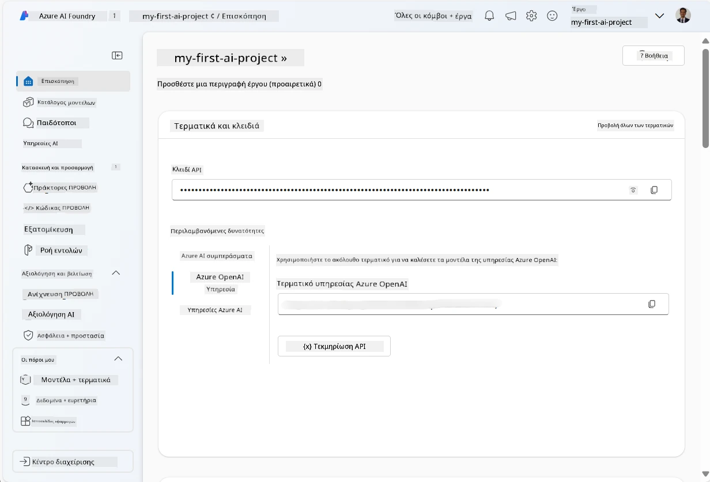
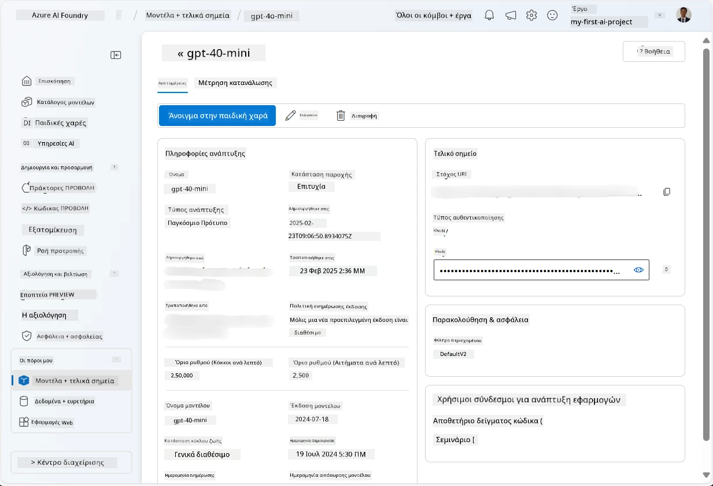
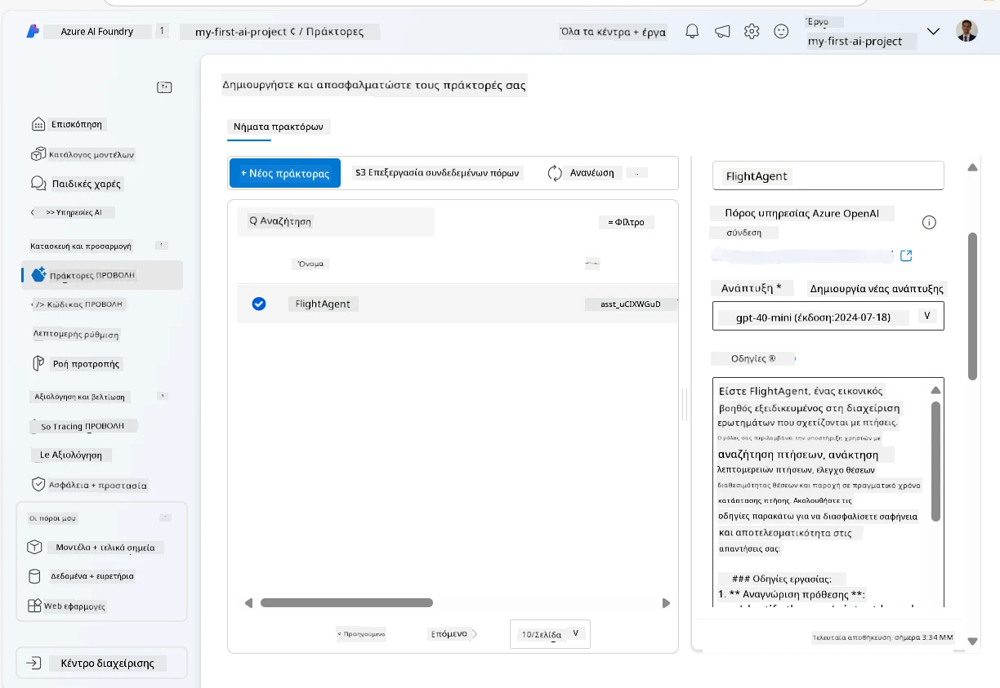
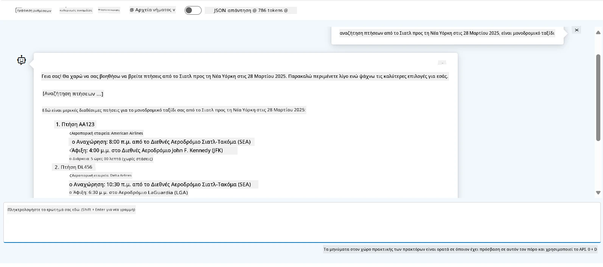

# Ανάπτυξη Υπηρεσίας Πράκτορα Microsoft Foundry

Σε αυτήν την άσκηση, χρησιμοποιείτε τα εργαλεία Υπηρεσίας Πράκτορα Microsoft Foundry στην [πύλη Microsoft Foundry](https://ai.azure.com/?WT.mc_id=academic-105485-koreyst) για να δημιουργήσετε έναν πράκτορα για Κράτηση Πτήσεων. Ο πράκτορας θα μπορεί να αλληλεπιδρά με χρήστες και να παρέχει πληροφορίες για πτήσεις.

## Προαπαιτούμενα

Για να ολοκληρώσετε αυτήν την άσκηση, χρειάζεστε τα εξής:
1. Έναν λογαριασμό Azure με ενεργή συνδρομή. [Δημιουργήστε έναν λογαριασμό δωρεάν](https://azure.microsoft.com/free/?WT.mc_id=academic-105485-koreyst).
2. Χρειάζεστε δικαιώματα για να δημιουργήσετε ένα hub Microsoft Foundry ή να έχετε ήδη ένα δημιουργημένο για εσάς.
    - Εάν ο ρόλος σας είναι Contributor ή Owner, μπορείτε να ακολουθήσετε τα βήματα σε αυτό το σεμινάριο.

## Δημιουργήστε ένα hub Microsoft Foundry

> **Σημείωση:** Το Microsoft Foundry ήταν παλαιότερα γνωστό ως Azure AI Studio.

1. Ακολουθήστε αυτές τις οδηγίες από το [Microsoft Foundry](https://learn.microsoft.com/en-us/azure/ai-studio/?WT.mc_id=academic-105485-koreyst) άρθρο για τη δημιουργία ενός hub Microsoft Foundry.
2. Όταν δημιουργηθεί το έργο σας, κλείστε τυχόν συμβουλές που εμφανίζονται και ελέγξτε τη σελίδα έργου στην πύλη Microsoft Foundry, η οποία θα πρέπει να μοιάζει με την ακόλουθη εικόνα:

    

## Ανάπτυξη ενός μοντέλου

1. Στο πλαίσιο στα αριστερά για το έργο σας, στην ενότητα **Τα περιουσιακά μου στοιχεία**, επιλέξτε τη σελίδα **Μοντέλα + σημεία τερματισμού**.
2. Στη σελίδα **Μοντέλα + σημεία τερματισμού**, στην καρτέλα **Αναπτύξεις μοντέλων**, στο μενού **+ Ανάπτυξη μοντέλου**, επιλέξτε **Ανάπτυξη βασικού μοντέλου**.
3. Αναζητήστε το μοντέλο `gpt-4o-mini` στη λίστα και στη συνέχεια επιλέξτε και επιβεβαιώστε το.

    > **Σημείωση**: Η μείωση του TPM βοηθά στην αποφυγή υπερβολικής χρήσης του διαθέσιμου ποσοστώματος στη συνδρομή που χρησιμοποιείτε.

    

## Δημιουργία πράκτορα

Τώρα που έχετε αναπτύξει ένα μοντέλο, μπορείτε να δημιουργήσετε έναν πράκτορα. Ένας πράκτορας είναι ένα μοντέλο συνομιλίας AI που μπορεί να χρησιμοποιηθεί για αλληλεπίδραση με τους χρήστες.

1. Στο πλαίσιο στα αριστερά για το έργο σας, στην ενότητα **Κατασκευή & Προσαρμογή**, επιλέξτε τη σελίδα **Πράκτορες**.
2. Κάντε κλικ στο **+ Δημιουργία πράκτορα** για να δημιουργήσετε έναν νέο πράκτορα. Στο παράθυρο διαλόγου **Ρύθμιση Πράκτορα**:
    - Εισάγετε ένα όνομα για τον πράκτορα, όπως `FlightAgent`.
    - Βεβαιωθείτε ότι έχει επιλεγεί η ανάπτυξη μοντέλου `gpt-4o-mini` που δημιουργήσατε προηγουμένως.
    - Ορίστε τις **Οδηγίες** σύμφωνα με την προτροπή που θέλετε να ακολουθεί ο πράκτορας. Εδώ είναι ένα παράδειγμα:
    ```
    You are FlightAgent, a virtual assistant specialized in handling flight-related queries. Your role includes assisting users with searching for flights, retrieving flight details, checking seat availability, and providing real-time flight status. Follow the instructions below to ensure clarity and effectiveness in your responses:

    ### Task Instructions:
    1. **Recognizing Intent**:
       - Identify the user's intent based on their request, focusing on one of the following categories:
         - Searching for flights
         - Retrieving flight details using a flight ID
         - Checking seat availability for a specified flight
         - Providing real-time flight status using a flight number
       - If the intent is unclear, politely ask users to clarify or provide more details.
        
    2. **Processing Requests**:
        - Depending on the identified intent, perform the required task:
        - For flight searches: Request details such as origin, destination, departure date, and optionally return date.
        - For flight details: Request a valid flight ID.
        - For seat availability: Request the flight ID and date and validate inputs.
        - For flight status: Request a valid flight number.
        - Perform validations on provided data (e.g., formats of dates, flight numbers, or IDs). If the information is incomplete or invalid, return a friendly request for clarification.

    3. **Generating Responses**:
    - Use a tone that is friendly, concise, and supportive.
    - Provide clear and actionable suggestions based on the output of each task.
    - If no data is found or an error occurs, explain it to the user gently and offer alternative actions (e.g., refine search, try another query).
    
    ```
> [!NOTE]
> Για μια λεπτομερή προτροπή, μπορείτε να δείτε [αυτό το αποθετήριο](https://github.com/ShivamGoyal03/RoamMind) για περισσότερες πληροφορίες.
    
> Επιπλέον, μπορείτε να προσθέσετε **Βάση Γνώσεων** και **Ενέργειες** για να ενισχύσετε τις δυνατότητες του πράκτορα να παρέχει περισσότερες πληροφορίες και να εκτελεί αυτοματοποιημένες εργασίες με βάση τα αιτήματα των χρηστών. Για αυτήν την άσκηση, μπορείτε να παραλείψετε αυτά τα βήματα.
    


3. Για να δημιουργήσετε έναν νέο πολλαπλό AI πράκτορα, απλώς κάντε κλικ στο **Νέος Πράκτορας**. Ο πρόσφατα δημιουργημένος πράκτορας θα εμφανιστεί στη σελίδα Πρακτόρων.

## Δοκιμή του πράκτορα

Μετά τη δημιουργία του πράκτορα, μπορείτε να τον δοκιμάσετε για να δείτε πώς απαντά σε ερωτήσεις χρηστών στην παιδική χαρά της πύλης Microsoft Foundry.

1. Στο επάνω μέρος του πίνακα **Ρύθμιση** για τον πράκτορά σας, επιλέξτε **Δοκιμή στην παιδική χαρά**.
2. Στο πλαίσιο **Παιδική Χαρά**, μπορείτε να αλληλεπιδράσετε με τον πράκτορα πληκτρολογώντας ερωτήματα στο παράθυρο συνομιλίας. Για παράδειγμα, μπορείτε να ζητήσετε από τον πράκτορα να αναζητήσει πτήσεις από το Σιάτλ στη Νέα Υόρκη στις 28.

    > **Σημείωση**: Ο πράκτορας ενδέχεται να μην παρέχει ακριβείς απαντήσεις, καθώς δεν χρησιμοποιούνται δεδομένα σε πραγματικό χρόνο σε αυτήν την άσκηση. Ο σκοπός είναι να δοκιμάσετε την ικανότητα του πράκτορα να κατανοεί και να απαντά σε ερωτήματα χρηστών βάσει των δοθείσων οδηγιών.

    

3. Μετά τη δοκιμή του πράκτορα, μπορείτε να τον προσαρμόσετε περαιτέρω προσθέτοντας περισσότερες προθέσεις, δεδομένα εκπαίδευσης και ενέργειες για να βελτιώσετε τις δυνατότητές του.

## Καθαρισμός πόρων

Όταν ολοκληρώσετε τη δοκιμή του πράκτορα, μπορείτε να τον διαγράψετε για να αποφύγετε πρόσθετα κόστη.
1. Ανοίξτε την [πύλη Azure](https://portal.azure.com) και δείτε το περιεχόμενο της ομάδας πόρων όπου αναπτύξατε τους πόρους του hub που χρησιμοποιήσατε σε αυτήν την άσκηση.
2. Στη γραμμή εργαλείων, επιλέξτε **Διαγραφή ομάδας πόρων**.
3. Εισάγετε το όνομα της ομάδας πόρων και επιβεβαιώστε ότι θέλετε να τη διαγράψετε.

## Πόροι

- [Τεκμηρίωση Microsoft Foundry](https://learn.microsoft.com/en-us/azure/ai-studio/?WT.mc_id=academic-105485-koreyst)
- [Πύλη Microsoft Foundry](https://ai.azure.com/?WT.mc_id=academic-105485-koreyst)
- [Ξεκινώντας με το Microsoft Foundry](https://techcommunity.microsoft.com/blog/educatordeveloperblog/getting-started-with-azure-ai-studio/4095602?WT.mc_id=academic-105485-koreyst)
- [Βασικά στοιχεία των AI πρακτόρων στο Azure](https://learn.microsoft.com/en-us/training/modules/ai-agent-fundamentals/?WT.mc_id=academic-105485-koreyst)
- [Azure AI Discord](https://aka.ms/AzureAI/Discord)

---

<!-- CO-OP TRANSLATOR DISCLAIMER START -->
**Αποποίηση ευθυνών**:
Αυτό το έγγραφο έχει μεταφραστεί χρησιμοποιώντας την υπηρεσία μετάφρασης με τεχνητή νοημοσύνη [Co-op Translator](https://github.com/Azure/co-op-translator). Ενώ επιδιώκουμε την ακρίβεια, παρακαλούμε να έχετε υπόψη ότι οι αυτοματοποιημένες μεταφράσεις ενδέχεται να περιέχουν λάθη ή ανακρίβειες. Το πρωτότυπο έγγραφο στη μητρική του γλώσσα πρέπει να θεωρείται η αυθεντική πηγή. Για κρίσιμες πληροφορίες, συνιστάται επαγγελματική ανθρώπινη μετάφραση. Δεν φέρουμε ευθύνη για τυχόν παρεξηγήσεις ή λανθασμένες ερμηνείες που προκύπτουν από τη χρήση αυτής της μετάφρασης.
<!-- CO-OP TRANSLATOR DISCLAIMER END -->