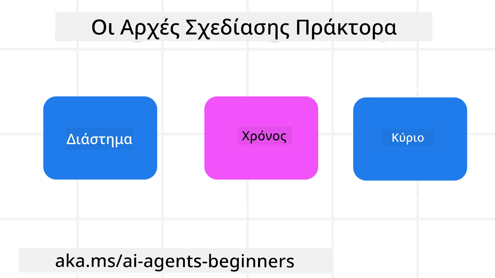

> _(Κάντε κλικ στην εικόνα παραπάνω για να δείτε το βίντεο αυτού του μαθήματος)_
# Αρχές Σχεδίασης Πρακτόρων AI

## Εισαγωγή

Υπάρχουν πολλοί τρόποι να σκεφτεί κανείς την κατασκευή Συστημάτων Πρακτόρων AI. Δεδομένου ότι η αμφισημία είναι ένα χαρακτηριστικό και όχι σφάλμα στο σχεδιασμό Γεννητικής AI, είναι μερικές φορές δύσκολο για τους μηχανικούς να καταλάβουν από πού να ξεκινήσουν. Έχουμε δημιουργήσει ένα σύνολο ανθρωποκεντρικών Αρχών UX Σχεδιασμού για να επιτρέψουμε στους προγραμματιστές να κατασκευάσουν συστήματα πρακτόρων εστιασμένα στον πελάτη που να καλύπτουν τις επιχειρησιακές τους ανάγκες. Αυτές οι αρχές σχεδίασης δεν είναι μια προκαθορισμένη αρχιτεκτονική, αλλά μάλλον ένα σημείο εκκίνησης για τις ομάδες που ορίζουν και αναπτύσσουν εμπειρίες πρακτόρων.

Γενικά, οι πράκτορες θα πρέπει να:

- Επεκτείνουν και να κλιμακώνουν τις ανθρώπινες ικανότητες (ιδεοθύελλα, επίλυση προβλημάτων, αυτοματοποίηση, κ.λπ.)
- Συμπληρώνουν τα κενά γνώσης (να με ενημερώνουν για το επίπεδο γνώσεων σε τομείς, μετάφραση, κ.λπ.)
- Διευκολύνουν και υποστηρίζουν τη συνεργασία με τρόπους που προτιμούμε ως άτομα να εργαζόμαστε με άλλους
- Μας κάνουν καλύτερες εκδοχές του εαυτού μας (π.χ., προπονητής ζωής/διεκπεραιωτής καθηκόντων, βοηθώντας μας να μάθουμε δεξιότητες ρύθμισης συναισθημάτων και ενσυνειδητότητας, οικοδομώντας ανθεκτικότητα, κ.λπ.)

## Αυτό το Μάθημα θα Καλύψει

- Τι είναι οι Αρχές Σχεδίασης Πρακτόρων
- Ποιοι είναι κάποιοι κατευθυντήριες γραμμές για την εφαρμογή αυτών των αρχών σχεδίασης
- Παραδείγματα χρήσης των αρχών σχεδίασης

## Στόχοι Μάθησης

Μετά την ολοκλήρωση αυτού του μαθήματος, θα μπορείτε να:

1. Εξηγείτε τι είναι οι Αρχές Σχεδίασης Πρακτόρων
2. Εξηγείτε τις κατευθυντήριες γραμμές για τη χρήση των Αρχών Σχεδίασης Πρακτόρων
3. Κατανοείτε πώς να κατασκευάσετε έναν πράκτορα χρησιμοποιώντας τις Αρχές Σχεδίασης Πρακτόρων

## Οι Αρχές Σχεδίασης Πρακτόρων

### Πράκτορας (Χώρος)

Αυτό είναι το περιβάλλον στο οποίο λειτουργεί ο πράκτορας. Αυτές οι αρχές καθοδηγούν το πώς σχεδιάζουμε πράκτορες για αλληλεπίδραση σε φυσικούς και ψηφιακούς κόσμους.

- **Σύνδεση, όχι κατάρρευση** – βοηθά στη σύνδεση ανθρώπων με άλλους ανθρώπους, γεγονότα και εφαρμόσιμη γνώση για να επιτρέψει τη συνεργασία και σύνδεση.
- Οι πράκτορες βοηθούν στη σύνδεση γεγονότων, γνώσης και ανθρώπων.
- Οι πράκτορες φέρνουν τους ανθρώπους πιο κοντά. Δεν έχουν σχεδιαστεί για να αντικαταστήσουν ή να υποβαθμίσουν τους ανθρώπους.
- **Εύκολη πρόσβαση αλλά περιστασιακά αόρατοι** – ο πράκτορας λειτουργεί σε μεγάλο βαθμό στο παρασκήνιο και μας υπενθυμίζει μόνο όταν είναι σημαντικό και κατάλληλο.
  - Ο πράκτορας είναι εύκολα ανιχνεύσιμος και προσβάσιμος από εξουσιοδοτημένους χρήστες σε οποιαδήποτε συσκευή ή πλατφόρμα.
  - Ο πράκτορας υποστηρίζει πολυτροπικές εισόδους και εξόδους (ήχο, φωνή, κείμενο, κ.λπ.).
  - Ο πράκτορας μπορεί να μεταβαίνει αβίαστα μεταξύ προσκηνίου και παρασκηνίου· μεταξύ προληπτικής και αντιδραστικής λειτουργίας, ανάλογα με την αντίληψη των αναγκών του χρήστη.
  - Ο πράκτορας μπορεί να λειτουργεί αόρατα, αλλά η πορεία της διαδικασίας παρασκηνίου και η συνεργασία με άλλους Πράκτορες είναι διαφανείς και ελέγξιμες από τον χρήστη.

### Πράκτορας (Χρόνος)

Αυτό περιγράφει πώς λειτουργεί ο πράκτορας με το πέρασμα του χρόνου. Αυτές οι αρχές καθοδηγούν το πώς σχεδιάζουμε πράκτορες που αλληλεπιδρούν σε παρελθόν, παρόν και μέλλον.

- **Παρελθόν**: Αντανακλώντας την ιστορία που περιλαμβάνει τόσο το κράτος όσο και το πλαίσιο.
  - Ο πράκτορας παρέχει πιο σχετικές απαντήσεις βασισμένες σε ανάλυση πλουσιότερων ιστορικών δεδομένων πέρα από το γεγονός, τους ανθρώπους ή τις καταστάσεις.
  - Ο πράκτορας δημιουργεί συνδέσεις από παρελθόντα γεγονότα και ενεργά αναλογίζεται τη μνήμη για να αλληλεπιδρά με τρέχουσες καταστάσεις.
- **Πάμε τώρα**: Υποκινώντας περισσότερο παρά ειδοποιώντας.
  - Ο πράκτορας ενσωματώνει μια ολοκληρωμένη προσέγγιση για αλληλεπίδραση με τους ανθρώπους. Όταν συμβαίνει ένα γεγονός, ο πράκτορας υπερβαίνει τη στατική ειδοποίηση ή άλλη στατική τυπικότητα. Μπορεί να απλοποιεί ροές ή να παράγει δυναμικά ενδείξεις για να κατευθύνει την προσοχή του χρήστη τη σωστή στιγμή.
  - Ο πράκτορας παρέχει πληροφορίες βασισμένες στο συμφραζόμενο περιβάλλον, τις κοινωνικές και πολιτισμικές αλλαγές και προσαρμοσμένες στην πρόθεση του χρήστη.
  - Η αλληλεπίδραση με τον πράκτορα μπορεί να είναι βαθμιαία, εξελισσόμενη/αναπτυσσόμενη σε πολυπλοκότητα για να ενδυναμώσει τους χρήστες μακροπρόθεσμα.
- **Μέλλον**: Προσαρμογή και εξέλιξη.
  - Ο πράκτορας προσαρμόζεται σε διάφορες συσκευές, πλατφόρμες και τρόπους.
  - Ο πράκτορας προσαρμόζεται στη συμπεριφορά του χρήστη, στις ανάγκες προσβασιμότητας και είναι πλήρως παραμετροποιήσιμος.
  - Ο πράκτορας διαμορφώνεται από και εξελίσσεται μέσω συνεχούς αλληλεπίδρασης με τον χρήστη.

### Πράκτορας (Κεντρικός Άξονας)

Αυτά είναι τα βασικά στοιχεία στον πυρήνα του σχεδιασμού ενός πράκτορα.

- **Αγκαλιάστε την αβεβαιότητα αλλά εδραιώστε την εμπιστοσύνη**.
  - Ένα επίπεδο αβεβαιότητας του Πράκτορα είναι αναμενόμενο. Η αβεβαιότητα είναι βασικό στοιχείο στο σχεδιασμό πράκτορα.
  - Η εμπιστοσύνη και η διαφάνεια αποτελούν θεμελιώδεις στρώσεις του σχεδιασμού πράκτορα.
  - Οι άνθρωποι έχουν τον έλεγχο του πότε ο Πράκτορας είναι ενεργοποιημένος/απενεργοποιημένος και η κατάσταση του Πράκτορα είναι πάντα εμφανής.

## Κατευθυντήριες Γραμμές για την Εφαρμογή Αυτών των Αρχών

Όταν χρησιμοποιείτε τις παραπάνω αρχές σχεδίασης, εφαρμόστε τις ακόλουθες κατευθυντήριες γραμμές:

1. **Διαφάνεια**: Ενημερώνετε τον χρήστη ότι εμπλέκεται AI, πώς λειτουργεί (συμπεριλαμβανομένων των παρελθόντων ενεργειών) και πώς να δώσει ανατροφοδότηση και να τροποποιήσει το σύστημα.
2. **Έλεγχος**: Ενεργοποιήστε τον χρήστη να προσαρμόζει, να καθορίζει προτιμήσεις και να εξατομικεύει, καθώς και να έχει έλεγχο επί του συστήματος και των χαρακτηριστικών του (συμπεριλαμβανομένης της δυνατότητας λήθης).
3. **Συνέπεια**: Στοχεύστε σε συνεπείς, πολυτροπικές εμπειρίες σε όλες τις συσκευές και τις τελικές μονάδες. Χρησιμοποιήστε οικεία στοιχεία UI/UX όπου είναι δυνατόν (π.χ., εικονίδιο μικροφώνου για φωνητική αλληλεπίδραση) και μειώστε το γνωστικό φορτίο του πελάτη όσο το δυνατόν περισσότερο (π.χ., στοχεύστε σε συνοπτικές απαντήσεις, οπτικά βοηθήματα και περιεχόμενο «Μάθετε Περισσότερα»).

## Πώς να Σχεδιάσετε έναν Ταξιδιωτικό Πράκτορα χρησιμοποιώντας αυτές τις Αρχές και Κατευθυντήριες

Φανταστείτε ότι σχεδιάζετε έναν Ταξιδιωτικό Πράκτορα, έτσι θα μπορούσατε να σκεφτείτε τη χρήση των Αρχών Σχεδίασης και Κατευθυντήριων Γραμμών:

1. **Διαφάνεια** – Ενημερώστε τον χρήστη ότι ο Ταξιδιωτικός Πράκτορας είναι ένας Πράκτορας με ενεργοποίηση AI. Παρέχετε βασικές οδηγίες για το πώς να ξεκινήσει (π.χ., ένα μήνυμα «Γεια» ή δείγματα παραδειγμάτων). Καταγράψτε αυτό καθαρά στη σελίδα προϊόντος. Εμφανίστε τη λίστα με τα παραδείγματα που έχει ζητήσει ο χρήστης στο παρελθόν. Διευκρινίστε πώς να δώσει ανατροφοδότηση (αντίχειρες πάνω/κάτω, κουμπί Αποστολή Ανατροφοδότησης κ.λπ.). Καθορίστε σαφώς αν ο Πράκτορας έχει περιορισμούς στη χρήση ή στα θέματα.
2. **Έλεγχος** – Εξασφαλίστε ότι είναι σαφές πώς ο χρήστης μπορεί να τροποποιήσει τον Πράκτορα μετά τη δημιουργία του, χρησιμοποιώντας στοιχεία όπως το Σύστημα Προτροπής. Επιτρέψτε στον χρήστη να επιλέγει πόσο λεπτομερής είναι ο Πράκτορας, το στυλ γραφής του και οποιουσδήποτε περιορισμούς σχετικά με τα θέματα που δεν πρέπει να συζητά ο Πράκτορας. Επιτρέψτε στον χρήστη να βλέπει και να διαγράφει συσχετιζόμενα αρχεία ή δεδομένα, προτροπές και παρελθούσες συνομιλίες.
3. **Συνέπεια** – Εξασφαλίστε ότι τα εικονίδια για το Κοινοποίηση Προτροπής, προσθήκη αρχείου ή φωτογραφίας και επισημάνσεις είναι τυποποιημένα και αναγνωρίσιμα. Χρησιμοποιήστε το εικονίδιο συνδετήρα χαρτιού για την ένδειξη μεταφόρτωσης/μοιράσματος αρχείων με τον Πράκτορα, και το εικονίδιο εικόνας για μεταφόρτωση γραφικών.

## Δείγματα Κώδικα

- Python: [Agent Framework](./code_samples/03-python-agent-framework.ipynb)
- .NET: [Agent Framework](./code_samples/03-dotnet-agent-framework.md)

## Έχετε Περισσότερες Ερωτήσεις για τα Σχέδια Σχεδίασης Πρακτόρων AI;

Επισκεφθείτε το [Microsoft Foundry Discord](https://discord.com/invite/ATgtXmAS5D) για να συναντήσετε άλλους μαθητές, να παρακολουθήσετε ωράρια γραφείου και να λάβετε απαντήσεις στις ερωτήσεις σας για τους πράκτορες AI.

## Επιπλέον Πόροι

- <a href="https://openai.com" target="_blank">Πρακτικές για Διακυβέρνηση Συστημάτων Πρακτόρων AI | OpenAI</a>
- <a href="https://microsoft.com" target="_blank">Το Πρόγραμμα Εργαλείων HAX - Microsoft Research</a>
- <a href="https://responsibleaitoolbox.ai" target="_blank">Εργαλειοθήκη Υπεύθυνης AI</a>

## Προηγούμενο Μάθημα

[Εξερεύνηση Πλαισίων Πρακτόρων](../02-explore-agentic-frameworks/README.md)

## Επόμενο Μάθημα

[Πρότυπο Σχεδίασης Χρήσης Εργαλείων](../04-tool-use/README.md)

---

<!-- CO-OP TRANSLATOR DISCLAIMER START -->
**Αποποίηση ευθυνών**:
Αυτό το έγγραφο έχει μεταφραστεί χρησιμοποιώντας την υπηρεσία μετάφρασης με τεχνητή νοημοσύνη [Co-op Translator](https://github.com/Azure/co-op-translator). Ενώ επιδιώκουμε την ακρίβεια, παρακαλούμε να έχετε υπόψη ότι οι αυτοματοποιημένες μεταφράσεις ενδέχεται να περιέχουν λάθη ή ανακρίβειες. Το πρωτότυπο έγγραφο στη μητρική του γλώσσα πρέπει να θεωρείται η αυθεντική πηγή. Για κρίσιμες πληροφορίες, συνιστάται επαγγελματική ανθρώπινη μετάφραση. Δεν φέρουμε ευθύνη για τυχόν παρεξηγήσεις ή λανθασμένες ερμηνείες που προκύπτουν από τη χρήση αυτής της μετάφρασης.
<!-- CO-OP TRANSLATOR DISCLAIMER END -->