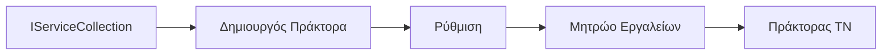

# 🎨 Agentic Design Patterns με Azure OpenAI (Responses API) (.NET)

## 📋 Στόχοι Μάθησης

Αυτό το παράδειγμα παρουσιάζει επιχειρηματικά πρότυπα σχεδίασης για την κατασκευή έξυπνων πρακτόρων χρησιμοποιώντας το Microsoft Agent Framework σε .NET με ενσωμάτωση Azure OpenAI (Responses API). Θα μάθετε επαγγελματικά πρότυπα και αρχιτεκτονικές προσεγγίσεις που καθιστούν τους πράκτορες έτοιμους για παραγωγή, ευκολόχρηστους και κλιμακούμενους.

### Επιχειρηματικά Πρότυπα Σχεδίασης

- 🏭 **Πρότυπο Εργοστασίου**: Τυποποιημένη δημιουργία πρακτόρων με ένεση εξαρτήσεων
- 🔧 **Πρότυπο Κατασκευαστή**: Ρευστή διαμόρφωση και ρύθμιση πρακτόρων
- 🧵 **Πρότυπα Νήματος Ασφαλούς**: Συγχρονισμένη διαχείριση συνομιλιών
- 📋 **Πρότυπο Αποθετηρίου**: Οργανωμένη διαχείριση εργαλείων και δυνατοτήτων

## 🎯 Αρχιτεκτονικά Οφέλη Ειδικά για .NET

### Επιχειρηματικά Χαρακτηριστικά

- **Ισχυρός Τυπισμός**: Έλεγχος κατά τη μεταγλώττιση και υποστήριξη IntelliSense
- **Ένεση Εξαρτήσεων**: Ενσωματωμένη υποδοχή DI container
- **Διαχείριση Διαμόρφωσης**: Πρότυπα IConfiguration και Options
- **Async/Await**: Υποστήριξη ασύγχρονου προγραμματισμού πρώτης τάξης

### Πρότυπα Έτοιμα για Παραγωγή

- **Ενσωμάτωση Καταγραφής**: Υποστήριξη ILogger και δομημένης καταγραφής
- **Έλεγχοι Υγείας**: Ενσωματωμένη παρακολούθηση και διάγνωση
- **Επικύρωση Διαμόρφωσης**: Ισχυρός τυπισμός με δεδομένα σχολίων
- **Διαχείριση Σφαλμάτων**: Δομημένη διαχείριση εξαιρέσεων

## 🔧 Τεχνική Αρχιτεκτονική

### Βασικά Συστατικά .NET

- **Microsoft.Extensions.AI**: Ενοποιημένες αφαιρέσεις υπηρεσιών AI
- **Microsoft.Agents.AI**: Πλαίσιο ορχήστρωσης επιχειρηματικών πρακτόρων
- **Azure OpenAI (Responses API)**: Πρότυπα πελατών API υψηλής απόδοσης
- **Σύστημα Διαμόρφωσης**: appsettings.json και ενσωμάτωση περιβάλλοντος

### Υλοποίηση Προτύπων Σχεδίασης



## 🏗️ Επιχειρηματικά Πρότυπα που Επιδεικνύονται

### 1. **Δημιουργικά Πρότυπα**

- **Agent Factory**: Κεντρικοποιημένη δημιουργία πρακτόρων με συνεπή διαμόρφωση
- **Builder Pattern**: Ρευστό API για σύνθετη διαμόρφωση πρακτόρων
- **Singleton Pattern**: Κοινόχρηστοι πόροι και διαχείριση διαμόρφωσης
- **Dependency Injection**: Χαλαρή σύζευξη και ικανότητα δοκιμών

### 2. **Συμπεριφορικά Πρότυπα**

- **Strategy Pattern**: Εναλλασσόμενες στρατηγικές εκτέλεσης εργαλείων
- **Command Pattern**: Ενσωματωμένες λειτουργίες πρακτόρων με αναίρεση/επαναφορά
- **Observer Pattern**: Διαχείριση κύκλου ζωής πρακτόρων βάσει εκδηλώσεων
- **Template Method**: Τυποποιημένα ροές εργασίας εκτέλεσης πρακτόρων

### 3. **Δομικά Πρότυπα**

- **Adapter Pattern**: Επίπεδο ενσωμάτωσης Azure OpenAI (Responses API)
- **Decorator Pattern**: Ενίσχυση δυνατοτήτων πρακτόρων
- **Facade Pattern**: Απλοποιημένα interface αλληλεπίδρασης πρακτόρων
- **Proxy Pattern**: Αργή φόρτωση και αποθήκευση προσωρινών για απόδοση

## 📚 Αρχές Σχεδίασης .NET

### Αρχές SOLID

- **Μονή Ευθύνη**: Κάθε συνιστώσα έχει ένα σαφές σκοπό
- **Ανοιχτό/Κλειστό**: Επεκτάσιμο χωρίς τροποποίηση
- **Αντιστροφή Υποκατάστασης Liskov**: Υλοποιήσεις εργαλείων βάσει interface
- **Διαχωρισμός Ενδιαφερόντων Interface**: Εστιασμένα, συνεκτικά interface
- **Αντιστροφή Εξάρτησης**: Εξάρτηση από αφαιρέσεις, όχι από υλοποιήσεις

### Καθαρή Αρχιτεκτονική

- **Στρώμα Domain**: Βασικές αφαιρέσεις πρακτόρων και εργαλείων
- **Στρώμα Εφαρμογής**: Ορχήστρωση πρακτόρων και ροές εργασίας
- **Στρώμα Υποδομής**: Ενσωμάτωση Azure OpenAI (Responses API) και εξωτερικών υπηρεσιών
- **Στρώμα Παρουσίασης**: Αλληλεπίδραση χρήστη και μορφοποίηση απαντήσεων

## 🔒 Επιχειρησιακές Εκτιμήσεις

### Ασφάλεια

- **Διαχείριση Πιστοποιητικών**: Ασφαλής χειρισμός κλειδιών API με IConfiguration
- **Επικύρωση Εισόδου**: Ισχυρός τυπισμός και επικύρωση σχολίων δεδομένων
- **Απολύμανση Εξόδου**: Ασφαλής επεξεργασία και φιλτράρισμα απαντήσεων
- **Καταγραφή Ελέγχου**: Ολοκληρωμένη παρακολούθηση λειτουργιών

### Απόδοση

- **Async Πρότυπα**: Δεν μπλοκαριστικές λειτουργίες εισόδου/εξόδου
- **Σύνολα Συνδέσεων**: Αποτελεσματική διαχείριση HTTP πελατών
- **Αποθήκευση Cache**: Αποθήκευση απαντήσεων για βελτιωμένη απόδοση
- **Διαχείριση Πόρων**: Κατάλληλη απόρριψη και πρότυπα καθαρισμού

### Κλιμακούμενοτητα

- **Ασφάλεια Νήματος**: Υποστήριξη παράλληλης εκτέλεσης πρακτόρων
- **Σύνολα Πόρων**: Αποτελεσματική χρήση πόρων
- **Διαχείριση Φορτίου**: Περιορισμός ρυθμού και χειρισμός πίεσης
- **Παρακολούθηση**: Μετρικές απόδοσης και έλεγχοι υγείας

## 🚀 Ανάπτυξη σε Παραγωγή

- **Διαχείριση Διαμόρφωσης**: Περιβαλλοντικές ρυθμίσεις
- **Στρατηγική Καταγραφής**: Δομημένη καταγραφή με correlation IDs
- **Διαχείριση Σφαλμάτων**: Παγκόσμια διαχείριση εξαιρέσεων με αποκατάσταση
- **Παρακολούθηση**: Insights εφαρμογών και μετρητές απόδοσης
- **Δοκιμές**: Unit tests, integration tests, και πρότυπα δοκιμών φόρτου

Έτοιμοι να κατασκευάσετε επιχειρηματικού επιπέδου έξυπνους πράκτορες με .NET; Ας σχεδιάσουμε κάτι στιβαρό! 🏢✨

## 🚀 Ξεκινώντας

### Προαπαιτούμενα

- [.NET 10 SDK](https://dotnet.microsoft.com/download/dotnet/10.0) ή νεότερο
- Συνδρομή [Azure](https://azure.microsoft.com/free/) με πόρο Azure OpenAI και ανάπτυξη μοντέλου
- Το [Azure CLI](https://learn.microsoft.com/cli/azure/install-azure-cli) — συνδεθείτε με `az login`

### Απαιτούμενες Μεταβλητές Περιβάλλοντος

```bash
# zsh/bash
export AZURE_OPENAI_ENDPOINT=https://<your-resource>.openai.azure.com
export AZURE_OPENAI_DEPLOYMENT=gpt-4o-mini
# Στη συνέχεια, συνδεθείτε ώστε το AzureCliCredential να μπορέσει να πάρει ένα διακριτικό
az login
```

```powershell
# PowerShell
$env:AZURE_OPENAI_ENDPOINT = "https://<your-resource>.openai.azure.com"
$env:AZURE_OPENAI_DEPLOYMENT = "gpt-4o-mini"
# Στη συνέχεια συνδεθείτε ώστε το AzureCliCredential να μπορεί να πάρει ένα token
az login
```

### Παράδειγμα Κώδικα

Για να εκτελέσετε το παράδειγμα κώδικα,

```bash
# zsh/bash
chmod +x ./03-dotnet-agent-framework.cs
./03-dotnet-agent-framework.cs
```

Ή χρησιμοποιώντας το dotnet CLI:

```bash
dotnet run ./03-dotnet-agent-framework.cs
```

Δείτε το [`03-dotnet-agent-framework.cs`](../../../../03-agentic-design-patterns/code_samples/03-dotnet-agent-framework.cs) για τον πλήρη κώδικα.

```csharp
#!/usr/bin/dotnet run

#:package Microsoft.Extensions.AI@10.*
#:package Microsoft.Agents.AI.OpenAI@1.*-*
#:package Azure.AI.OpenAI@2.1.0
#:package Azure.Identity@1.13.1

using System.ComponentModel;

using Microsoft.Agents.AI;
using Microsoft.Extensions.AI;

using Azure.AI.OpenAI;
using Azure.Identity;

// Tool Function: Random Destination Generator
// This static method will be available to the agent as a callable tool
// The [Description] attribute helps the AI understand when to use this function
// This demonstrates how to create custom tools for AI agents
[Description("Provides a random vacation destination.")]
static string GetRandomDestination()
{
    // List of popular vacation destinations around the world
    // The agent will randomly select from these options
    var destinations = new List<string>
    {
        "Paris, France",
        "Tokyo, Japan",
        "New York City, USA",
        "Sydney, Australia",
        "Rome, Italy",
        "Barcelona, Spain",
        "Cape Town, South Africa",
        "Rio de Janeiro, Brazil",
        "Bangkok, Thailand",
        "Vancouver, Canada"
    };

    // Generate random index and return selected destination
    // Uses System.Random for simple random selection
    var random = new Random();
    int index = random.Next(destinations.Count);
    return destinations[index];
}

// Azure OpenAI with the Responses API (stable v1 endpoint). Sign in with `az login`.
var azureEndpoint = Environment.GetEnvironmentVariable("AZURE_OPENAI_ENDPOINT")
    ?? throw new InvalidOperationException("AZURE_OPENAI_ENDPOINT is not set.");
var deployment = Environment.GetEnvironmentVariable("AZURE_OPENAI_DEPLOYMENT") ?? "gpt-4o-mini";

var azureClient = new AzureOpenAIClient(new Uri(azureEndpoint), new AzureCliCredential());

// Define Agent Identity and Comprehensive Instructions
// Agent name for identification and logging purposes
var AGENT_NAME = "TravelAgent";

// Detailed instructions that define the agent's personality, capabilities, and behavior
// This system prompt shapes how the agent responds and interacts with users
var AGENT_INSTRUCTIONS = """
You are a helpful AI Agent that can help plan vacations for customers.

Important: When users specify a destination, always plan for that location. Only suggest random destinations when the user hasn't specified a preference.

When the conversation begins, introduce yourself with this message:
"Hello! I'm your TravelAgent assistant. I can help plan vacations and suggest interesting destinations for you. Here are some things you can ask me:
1. Plan a day trip to a specific location
2. Suggest a random vacation destination
3. Find destinations with specific features (beaches, mountains, historical sites, etc.)
4. Plan an alternative trip if you don't like my first suggestion

What kind of trip would you like me to help you plan today?"

Always prioritize user preferences. If they mention a specific destination like "Bali" or "Paris," focus your planning on that location rather than suggesting alternatives.
""";

// Create AI Agent with Advanced Travel Planning Capabilities
// Get the Responses client for the deployment and create the AI agent
// Configure agent with name, detailed instructions, and available tools
// This demonstrates the .NET agent creation pattern with full configuration
AIAgent agent = azureClient
    .GetOpenAIResponseClient(deployment)
    .CreateAIAgent(
        name: AGENT_NAME,
        instructions: AGENT_INSTRUCTIONS,
        tools: [AIFunctionFactory.Create(GetRandomDestination)]
    );

// Create New Conversation Thread for Context Management
// Initialize a new conversation thread to maintain context across multiple interactions
// Threads enable the agent to remember previous exchanges and maintain conversational state
// This is essential for multi-turn conversations and contextual understanding
AgentThread thread = agent.GetNewThread();

// Execute Agent: First Travel Planning Request
// Run the agent with an initial request that will likely trigger the random destination tool
// The agent will analyze the request, use the GetRandomDestination tool, and create an itinerary
// Using the thread parameter maintains conversation context for subsequent interactions
await foreach (var update in agent.RunStreamingAsync("Plan me a day trip", thread))
{
    await Task.Delay(10);
    Console.Write(update);
}

Console.WriteLine();

// Execute Agent: Follow-up Request with Context Awareness
// Demonstrate contextual conversation by referencing the previous response
// The agent remembers the previous destination suggestion and will provide an alternative
// This showcases the power of conversation threads and contextual understanding in .NET agents
await foreach (var update in agent.RunStreamingAsync("I don't like that destination. Plan me another vacation.", thread))
{
    await Task.Delay(10);
    Console.Write(update);
}
```

---

<!-- CO-OP TRANSLATOR DISCLAIMER START -->
**Αποποίηση ευθυνών**:
Αυτό το έγγραφο έχει μεταφραστεί χρησιμοποιώντας την υπηρεσία μετάφρασης με τεχνητή νοημοσύνη [Co-op Translator](https://github.com/Azure/co-op-translator). Ενώ επιδιώκουμε την ακρίβεια, παρακαλούμε να έχετε υπόψη ότι οι αυτοματοποιημένες μεταφράσεις ενδέχεται να περιέχουν λάθη ή ανακρίβειες. Το πρωτότυπο έγγραφο στη μητρική του γλώσσα πρέπει να θεωρείται η αυθεντική πηγή. Για κρίσιμες πληροφορίες, συνιστάται επαγγελματική ανθρώπινη μετάφραση. Δεν φέρουμε ευθύνη για τυχόν παρεξηγήσεις ή λανθασμένες ερμηνείες που προκύπτουν από τη χρήση αυτής της μετάφρασης.
<!-- CO-OP TRANSLATOR DISCLAIMER END -->