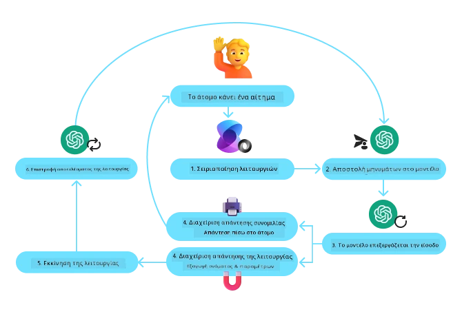
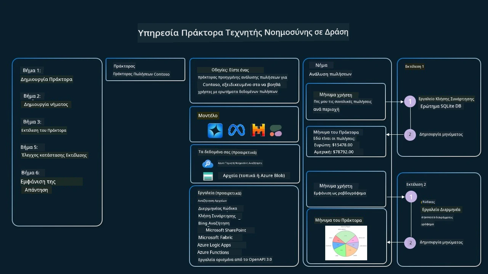

[](https://youtu.be/vieRiPRx-gI?si=cEZ8ApnT6Sus9rhn)

> _(Κάντε κλικ στην εικόνα παραπάνω για να δείτε το βίντεο αυτού του μαθήματος)_

# Σχέδιο Χρήσης Εργαλείων

Τα εργαλεία είναι ενδιαφέροντα επειδή επιτρέπουν στους πράκτορες Τεχνητής Νοημοσύνης να έχουν ευρύτερο φάσμα δυνατοτήτων. Αντί ο πράκτορας να έχει ένα περιορισμένο σύνολο ενεργειών που μπορεί να εκτελέσει, με την προσθήκη ενός εργαλείου, ο πράκτορας μπορεί πλέον να εκτελέσει μεγάλο εύρος ενεργειών. Σε αυτό το κεφάλαιο, θα δούμε το Σχέδιο Χρήσης Εργαλείων, που περιγράφει πώς οι πράκτορες ΤΝ μπορούν να χρησιμοποιούν συγκεκριμένα εργαλεία για να επιτύχουν τους στόχους τους.

## Εισαγωγή

Σε αυτό το μάθημα, θέλουμε να απαντήσουμε στις εξής ερωτήσεις:

- Τι είναι το σχέδιο χρήσης εργαλείου;
- Ποια είναι τα πεδία εφαρμογής του;
- Ποια είναι τα στοιχεία/δομικά μπλοκ που απαιτούνται για την υλοποίηση του σχεδίου;
- Ποιες είναι οι ειδικές προϋποθέσεις για τη χρήση του Σχεδίου Χρήσης Εργαλείων για την κατασκευή αξιόπιστων πρακτόρων ΤΝ;

## Στόχοι Μάθησης

Μετά την ολοκλήρωση αυτού του μαθήματος, θα μπορείτε να:

- Ορίσετε το Σχέδιο Χρήσης Εργαλείων και τον σκοπό του.
- Αναγνωρίσετε περιπτώσεις χρήσης όπου εφαρμόζεται το Σχέδιο Χρήσης Εργαλείων.
- Κατανοήσετε τα βασικά στοιχεία που απαιτούνται για την υλοποίηση του σχεδίου.
- Αναγνωρίσετε παράγοντες για τη διασφάλιση αξιοπιστίας στους πράκτορες ΤΝ που χρησιμοποιούν αυτό το σχέδιο.

## Τι είναι το Σχέδιο Χρήσης Εργαλείων;

Το **Σχέδιο Χρήσης Εργαλείων** επικεντρώνεται στο να δώσει στα Μεγάλα Γλωσσικά Μοντέλα (LLMs) την ικανότητα να αλληλεπιδρούν με εξωτερικά εργαλεία για να επιτύχουν συγκεκριμένους στόχους. Τα εργαλεία είναι κώδικας που μπορεί να εκτελεστεί από έναν πράκτορα για να πραγματοποιήσει ενέργειες. Ένα εργαλείο μπορεί να είναι μια απλή συνάρτηση όπως μια αριθμομηχανή, ή μια κλήση API σε υπηρεσία τρίτου μέρους όπως αναζήτηση τιμών μετοχών ή πρόγνωση καιρού. Στο πλαίσιο των πρακτόρων ΤΝ, τα εργαλεία έχουν σχεδιαστεί να εκτελούνται από πράκτορες σε απάντηση σε **λειτουργικές κλήσεις που έχουν δημιουργηθεί από το μοντέλο**.

## Ποια είναι τα πεδία εφαρμογής του;

Οι Πράκτορες ΤΝ μπορούν να αξιοποιήσουν εργαλεία για να ολοκληρώσουν σύνθετες εργασίες, να ανακτήσουν πληροφορίες ή να λάβουν αποφάσεις. Το σχέδιο χρήσης εργαλείου χρησιμοποιείται συχνά σε σενάρια που απαιτούν δυναμική αλληλεπίδραση με εξωτερικά συστήματα, όπως βάσεις δεδομένων, διαδικτυακές υπηρεσίες ή διερμηνείς κώδικα. Αυτή η ικανότητα είναι χρήσιμη για διάφορες περιπτώσεις χρήσης όπως:

- **Δυναμική Ανάκτηση Πληροφοριών:** Οι πράκτορες μπορούν να ρωτήσουν εξωτερικά APIs ή βάσεις δεδομένων για να λάβουν ενημερωμένα δεδομένα (π.χ., αναζήτηση σε βάση δεδομένων SQLite για ανάλυση δεδομένων, ανάκτηση τιμών μετοχών ή πληροφοριών καιρού).
- **Εκτέλεση και Διερμηνεία Κώδικα:** Οι πράκτορες μπορούν να εκτελέσουν κώδικα ή σενάρια για την επίλυση μαθηματικών προβλημάτων, τη δημιουργία αναφορών ή την εκτέλεση προσομοιώσεων.
- **Αυτοματοποίηση Ροής Εργασίας:** Αυτοματοποίηση επαναλαμβανόμενων ή πολυσταδιακών ροών εργασίας με ενσωμάτωση εργαλείων όπως χρονοπρογραμματιστές εργασιών, υπηρεσίες email ή pipelines δεδομένων.
- **Υποστήριξη Πελατών:** Οι πράκτορες μπορούν να αλληλεπιδρούν με συστήματα CRM, πλατφόρμες ticketing ή βάσεις γνώσεων για την επίλυση ερωτημάτων χρηστών.
- **Δημιουργία και Επεξεργασία Περιεχομένου:** Οι πράκτορες μπορούν να αξιοποιήσουν εργαλεία όπως ελεγκτές γραμματικής, συνοψιστές κειμένου ή αξιολογητές ασφάλειας περιεχομένου για βοήθεια σε εργασίες δημιουργίας περιεχομένου.

## Ποια είναι τα στοιχεία/δομικά μπλοκ που απαιτούνται για την υλοποίηση του σχεδίου χρήσης εργαλείων;

Αυτά τα δομικά μπλοκ επιτρέπουν στον πράκτορα ΤΝ να εκτελεί ένα ευρύ φάσμα εργασιών. Ας δούμε τα βασικά στοιχεία που απαιτούνται για την υλοποίηση του Σχεδίου Χρήσης Εργαλείων:

- **Σχήματα Λειτουργιών/Εργαλείων**: Λεπτομερείς ορισμοί διαθέσιμων εργαλείων, συμπεριλαμβανομένου ονόματος λειτουργίας, σκοπού, απαιτούμενων παραμέτρων και αναμενόμενων αποτελεσμάτων. Αυτά τα σχήματα επιτρέπουν στο LLM να κατανοεί ποια εργαλεία είναι διαθέσιμα και πώς να κατασκευάσει έγκυρα αιτήματα.

- **Λογική Εκτέλεσης Λειτουργιών**: Ρυθμίζει πότε και πώς καλούνται τα εργαλεία με βάση την πρόθεση του χρήστη και το πλαίσιο της συνομιλίας. Αυτό μπορεί να περιλαμβάνει ενότητες σχεδιασμού, μηχανισμούς δρομολόγησης ή ροές υπό συνθήκη που καθορίζουν τη δυναμική χρήση εργαλείων.

- **Σύστημα Διαχείρισης Μηνυμάτων**: Στοιχεία που διαχειρίζονται τη ροή συνομιλίας μεταξύ εισόδων χρήστη, απαντήσεων LLM, κλήσεων εργαλείων και αποτελεσμάτων εργαλείων.

- **Πλαίσιο Ενσωμάτωσης Εργαλείων**: Υποδομή που συνδέει τον πράκτορα με διάφορα εργαλεία, είτε είναι απλές συναρτήσεις είτε πολύπλοκες εξωτερικές υπηρεσίες.

- **Διαχείριση Σφαλμάτων & Επικύρωση**: Μηχανισμοί για τη διαχείριση αποτυχιών στην εκτέλεση εργαλείων, την επικύρωση παραμέτρων και τη διαχείριση απροσδόκητων απαντήσεων.

- **Διαχείριση Κατάστασης**: Παρακολουθεί το πλαίσιο της συνομιλίας, προηγούμενες αλληλεπιδράσεις εργαλείων και επίμονα δεδομένα ώστε να διασφαλίζεται η συνέπεια σε πολυ-βηματικές αλληλεπιδράσεις.

Στη συνέχεια, ας δούμε πιο αναλυτικά το Κλήσιμο Λειτουργιών/Εργαλείων.

### Κλήσιμο Λειτουργιών/Εργαλείων

Το κλήσιμο λειτουργιών είναι ο κύριος τρόπος που επιτρέπουμε στα Μεγάλα Γλωσσικά Μοντέλα (LLMs) να αλληλεπιδρούν με εργαλεία. Συχνά θα δείτε τους όρους 'Function' και 'Tool' να χρησιμοποιούνται εναλλακτικά διότι οι 'functions' (μπλοκ επαναχρησιμοποιήσιμου κώδικα) είναι τα 'εργαλεία' που χρησιμοποιούν οι πράκτορες για να εκτελέσουν εργασίες. Για να μπορέσει να κληθεί ο κώδικας μιας λειτουργίας, ένα LLM πρέπει να συγκρίνει το αίτημα του χρήστη με την περιγραφή της λειτουργίας. Για να το κάνει αυτό, αποστέλλεται στο LLM ένα σχήμα που περιέχει τις περιγραφές όλων των διαθέσιμων λειτουργιών. Το LLM επιλέγει έπειτα την καταλληλότερη λειτουργία για την εργασία και επιστρέφει το όνομα και τα επιχειρήματα της. Η επιλεγμένη λειτουργία καλείται, η απάντησή της αποστέλλεται πίσω στο LLM, το οποίο χρησιμοποιεί τις πληροφορίες για να απαντήσει στο αίτημα του χρήστη.

Για τους προγραμματιστές που θέλουν να υλοποιήσουν κλήση λειτουργιών για πράκτορες, θα χρειαστείτε:

1. Ένα μοντέλο LLM που υποστηρίζει κλήσεις λειτουργιών
2. Ένα σχήμα που περιέχει περιγραφές των λειτουργιών
3. Τον κώδικα για κάθε περιγραφόμενη λειτουργία

Ας χρησιμοποιήσουμε το παράδειγμα του να πάρουμε την τρέχουσα ώρα σε μια πόλη για να το εξηγήσουμε:

1. **Αρχικοποιήστε ένα LLM που υποστηρίζει κλήσεις λειτουργιών:**

    Όχι όλα τα μοντέλα υποστηρίζουν κλήση λειτουργιών, οπότε είναι σημαντικό να ελέγξετε ότι το LLM που χρησιμοποιείτε το υποστηρίζει. Το <a href="https://learn.microsoft.com/azure/ai-services/openai/how-to/function-calling" target="_blank">Azure OpenAI</a> υποστηρίζει κλήση λειτουργιών. Μπορούμε να ξεκινήσουμε με την αρχικοποίηση του πελάτη Azure OpenAI.

    ```python
    # Αρχικοποίηση του πελάτη Azure OpenAI
    client = AzureOpenAI(
        azure_endpoint = os.getenv("AZURE_AI_PROJECT_ENDPOINT"), 
        api_key=os.getenv("AZURE_OPENAI_API_KEY"),  
        api_version="2024-05-01-preview"
    )
    ```

1. **Δημιουργία Σχήματος Λειτουργίας**:

    Έπειτα, θα ορίσουμε ένα JSON σχήμα που περιλαμβάνει το όνομα της λειτουργίας, περιγραφή του τι κάνει η λειτουργία και τα ονόματα και περιγραφές των παραμέτρων της λειτουργίας.
    Θα πάρουμε αυτό το σχήμα και θα το περάσουμε στον προηγουμένως δημιουργημένο πελάτη, μαζί με το αίτημα του χρήστη να μάθει την ώρα στο Σαν Φρανσίσκο. Σημαντικό να σημειωθεί είναι ότι **η κλήση εργαλείου** είναι αυτό που επιστρέφεται, **όχι** η τελική απάντηση στο ερώτημα. Όπως αναφέρθηκε, το LLM επιστρέφει το όνομα της λειτουργίας που επέλεξε για την εργασία και τα επιχειρήματα που θα της περαστούν.

    ```python
    # Περιγραφή της λειτουργίας για να διαβάσει το μοντέλο
    tools = [
        {
            "type": "function",
            "function": {
                "name": "get_current_time",
                "description": "Get the current time in a given location",
                "parameters": {
                    "type": "object",
                    "properties": {
                        "location": {
                            "type": "string",
                            "description": "The city name, e.g. San Francisco",
                        },
                    },
                    "required": ["location"],
                },
            }
        }
    ]
    ```
   
    ```python
  
    # Αρχικό μήνυμα χρήστη
    messages = [{"role": "user", "content": "What's the current time in San Francisco"}] 
  
    # Πρώτη κλήση API: Ζητήστε από το μοντέλο να χρησιμοποιήσει τη λειτουργία
      response = client.chat.completions.create(
          model=deployment_name,
          messages=messages,
          tools=tools,
          tool_choice="auto",
      )
  
      # Επεξεργαστείτε την απάντηση του μοντέλου
      response_message = response.choices[0].message
      messages.append(response_message)
  
      print("Model's response:")  

      print(response_message)
  
    ```

    ```bash
    Model's response:
    ChatCompletionMessage(content=None, role='assistant', function_call=None, tool_calls=[ChatCompletionMessageToolCall(id='call_pOsKdUlqvdyttYB67MOj434b', function=Function(arguments='{"location":"San Francisco"}', name='get_current_time'), type='function')])
    ```
  
1. **Ο κώδικας της λειτουργίας που απαιτείται για την εκτέλεση της εργασίας:**

    Τώρα που το LLM έχει επιλέξει ποια λειτουργία πρέπει να τρέξει, ο κώδικας που εκτελεί την εργασία πρέπει να υλοποιηθεί και να εκτελεστεί.
    Μπορούμε να υλοποιήσουμε τον κώδικα για να πάρουμε την τρέχουσα ώρα σε Python. Θα χρειαστεί επίσης να γράψουμε τον κώδικα που εξάγει το όνομα και τα επιχειρήματα από το response_message για να πάρουμε το τελικό αποτέλεσμα.

    ```python
      def get_current_time(location):
        """Get the current time for a given location"""
        print(f"get_current_time called with location: {location}")  
        location_lower = location.lower()
        
        for key, timezone in TIMEZONE_DATA.items():
            if key in location_lower:
                print(f"Timezone found for {key}")  
                current_time = datetime.now(ZoneInfo(timezone)).strftime("%I:%M %p")
                return json.dumps({
                    "location": location,
                    "current_time": current_time
                })
      
        print(f"No timezone data found for {location_lower}")  
        return json.dumps({"location": location, "current_time": "unknown"})
    ```

     ```python
     # Διαχείριση κλήσεων συναρτήσεων
      if response_message.tool_calls:
          for tool_call in response_message.tool_calls:
              if tool_call.function.name == "get_current_time":
     
                  function_args = json.loads(tool_call.function.arguments)
     
                  time_response = get_current_time(
                      location=function_args.get("location")
                  )
     
                  messages.append({
                      "tool_call_id": tool_call.id,
                      "role": "tool",
                      "name": "get_current_time",
                      "content": time_response,
                  })
      else:
          print("No tool calls were made by the model.")  
  
      # Δεύτερη κλήση API: Λάβετε την τελική απάντηση από το μοντέλο
      final_response = client.chat.completions.create(
          model=deployment_name,
          messages=messages,
      )
  
      return final_response.choices[0].message.content
     ```

     ```bash
      get_current_time called with location: San Francisco
      Timezone found for san francisco
      The current time in San Francisco is 09:24 AM.
     ```

Το Κλήσιμο Λειτουργιών είναι στον πυρήνα των περισσότερων, αν όχι όλων, σχεδίων χρήσης εργαλείων για πράκτορες, ωστόσο η υλοποίησή του από το μηδέν μπορεί να είναι μερικές φορές προκλητική.
Όπως μάθαμε στο [Μάθημα 2](../../../02-explore-agentic-frameworks), τα πλαίσια agentic μας παρέχουν προκατασκευασμένα δομικά μπλοκ για την υλοποίηση της χρήσης εργαλείων.
 
## Παραδείγματα Χρήσης Εργαλείων με Agentic Frameworks

Ακολουθούν μερικά παραδείγματα για το πώς μπορείτε να υλοποιήσετε το Σχέδιο Χρήσης Εργαλείων χρησιμοποιώντας διαφορετικά agentic frameworks:

### Microsoft Agent Framework

Το <a href="https://learn.microsoft.com/azure/ai-services/agents/overview" target="_blank">Microsoft Agent Framework</a> είναι ένα ανοιχτού κώδικα πλαίσιο για την κατασκευή πρακτόρων ΤΝ. Απλοποιεί τη διαδικασία χρήσης κλήσης λειτουργιών επιτρέποντάς σας να ορίζετε εργαλεία ως συναρτήσεις Python με τον διακοσμητή `@tool`. Το πλαίσιο διαχειρίζεται την αντίστροφη επικοινωνία μεταξύ του μοντέλου και του κώδικά σας. Παρέχει επίσης πρόσβαση σε προκατασκευασμένα εργαλεία όπως File Search και Code Interpreter μέσω του `AzureAIProjectAgentProvider`.

Το ακόλουθο διάγραμμα απεικονίζει τη διαδικασία κλήσης λειτουργιών με το Microsoft Agent Framework:



Στο Microsoft Agent Framework, τα εργαλεία ορίζονται ως διακοσμημένες συναρτήσεις. Μπορούμε να μετατρέψουμε τη συνάρτηση `get_current_time` που είδαμε προηγουμένως σε εργαλείο χρησιμοποιώντας τον διακοσμητή `@tool`. Το πλαίσιο θα σειριοποιήσει αυτόματα τη συνάρτηση και τις παραμέτρους της, δημιουργώντας το σχήμα που θα σταλεί στο LLM.

```python
from agent_framework import tool
from agent_framework.azure import AzureAIProjectAgentProvider
from azure.identity import AzureCliCredential

@tool
def get_current_time(location: str) -> str:
    """Get the current time for a given location"""
    ...

# Δημιουργήστε τον πελάτη
provider = AzureAIProjectAgentProvider(credential=AzureCliCredential())

# Δημιουργήστε έναν πράκτορα και τρέξτε με το εργαλείο
agent = await provider.create_agent(name="TimeAgent", instructions="Use available tools to answer questions.", tools=get_current_time)
response = await agent.run("What time is it?")
```
  
### Azure AI Agent Service

Το <a href="https://learn.microsoft.com/azure/ai-services/agents/overview" target="_blank">Azure AI Agent Service</a> είναι ένα νεότερο agentic framework που έχει σχεδιαστεί για να δίνει τη δυνατότητα στους προγραμματιστές να δημιουργούν, να αναπτύσσουν και να κλιμακώνουν με ασφάλεια, υψηλής ποιότητας και επεκτάσιμους πράκτορες ΤΝ χωρίς να χρειάζεται να διαχειρίζονται τους υποκείμενους πόρους υπολογισμού και αποθήκευσης. Είναι ιδανικό για επιχειρησιακές εφαρμογές, αφού αποτελεί μια πλήρως διαχειριζόμενη υπηρεσία με ασφάλεια επιπέδου επιχείρησης.

Σε σύγκριση με την ανάπτυξη απευθείας με το API LLM, η υπηρεσία Azure AI Agent προσφέρει μερικά πλεονεκτήματα, όπως:

- Αυτόματη κλήση εργαλείων – δεν χρειάζεται να αναλύσετε μια κλήση εργαλείου, να καλέσετε το εργαλείο και να διαχειριστείτε την απάντηση· όλα γίνονται πλέον στον server
- Ασφαλής διαχείριση δεδομένων – αντί να διαχειρίζεστε την κατάσταση της συνομιλίας μόνοι σας, μπορείτε να βασιστείτε σε threads που αποθηκεύουν όλες τις πληροφορίες που χρειάζεστε
- Εργαλεία έτοιμα προς χρήση – εργαλεία που μπορείτε να χρησιμοποιήσετε για να αλληλεπιδράσετε με τις πηγές δεδομένων σας, όπως Bing, Azure AI Search και Azure Functions.

Τα διαθέσιμα εργαλεία στην Azure AI Agent Service χωρίζονται σε δύο κατηγορίες:

1. Εργαλεία Γνώσεων:
    - <a href="https://learn.microsoft.com/azure/ai-services/agents/how-to/tools/bing-grounding?tabs=python&pivots=overview" target="_blank">Εδραίωση με Bing Search</a>
    - <a href="https://learn.microsoft.com/azure/ai-services/agents/how-to/tools/file-search?tabs=python&pivots=overview" target="_blank">Αναζήτηση Αρχείων</a>
    - <a href="https://learn.microsoft.com/azure/ai-services/agents/how-to/tools/azure-ai-search?tabs=azurecli%2Cpython&pivots=overview-azure-ai-search" target="_blank">Azure AI Search</a>

2. Εργαλεία Δράσης:
    - <a href="https://learn.microsoft.com/azure/ai-services/agents/how-to/tools/function-calling?tabs=python&pivots=overview" target="_blank">Κλήση Λειτουργίας</a>
    - <a href="https://learn.microsoft.com/azure/ai-services/agents/how-to/tools/code-interpreter?tabs=python&pivots=overview" target="_blank">Διερμηνέας Κώδικα</a>
    - <a href="https://learn.microsoft.com/azure/ai-services/agents/how-to/tools/openapi-spec?tabs=python&pivots=overview" target="_blank">Εργαλεία ορισμένα με OpenAPI</a>
    - <a href="https://learn.microsoft.com/azure/ai-services/agents/how-to/tools/azure-functions?pivots=overview" target="_blank">Azure Functions</a>

Η Υπηρεσία Πρακτόρων επιτρέπει να χρησιμοποιήσουμε αυτά τα εργαλεία μαζί ως `toolset`. Χρησιμοποιεί επίσης `threads` που παρακολουθούν το ιστορικό μηνυμάτων μιας συγκεκριμένης συνομιλίας.

Φανταστείτε ότι είστε ένας εκπρόσωπος πωλήσεων σε μια εταιρεία που ονομάζεται Contoso. Θέλετε να αναπτύξετε έναν συνομιλητικό πράκτορα που μπορεί να απαντά σε ερωτήματα για τα δεδομένα πωλήσεών σας.

Η παρακάτω εικόνα απεικονίζει πώς θα μπορούσατε να χρησιμοποιήσετε την Azure AI Agent Service για να αναλύσετε τα δεδομένα πωλήσεών σας:



Για να χρησιμοποιήσουμε οποιοδήποτε από αυτά τα εργαλεία με την υπηρεσία μπορούμε να δημιουργήσουμε έναν πελάτη και να ορίσουμε ένα εργαλείο ή σύνολο εργαλείων. Για να το υλοποιήσουμε στην πράξη μπορούμε να χρησιμοποιήσουμε τον ακόλουθο κώδικα Python. Το LLM θα μπορεί να κοιτά το toolset και να αποφασίζει αν θα χρησιμοποιήσει τη λειτουργία που δημιούργησε ο χρήστης, `fetch_sales_data_using_sqlite_query`, ή τον προκατασκευασμένο Διερμηνέα Κώδικα ανάλογα με το αίτημα του χρήστη.

```python 
import os
from azure.ai.projects import AIProjectClient
from azure.identity import DefaultAzureCredential
from fetch_sales_data_functions import fetch_sales_data_using_sqlite_query # συνάρτηση fetch_sales_data_using_sqlite_query που μπορεί να βρεθεί σε ένα αρχείο fetch_sales_data_functions.py.
from azure.ai.projects.models import ToolSet, FunctionTool, CodeInterpreterTool

project_client = AIProjectClient.from_connection_string(
    credential=DefaultAzureCredential(),
    conn_str=os.environ["PROJECT_CONNECTION_STRING"],
)

# Αρχικοποίηση σετ εργαλείων
toolset = ToolSet()

# Αρχικοποίηση πράκτορα κλήσης συνάρτησης με τη συνάρτηση fetch_sales_data_using_sqlite_query και προσθήκη της στο σετ εργαλείων
fetch_data_function = FunctionTool(fetch_sales_data_using_sqlite_query)
toolset.add(fetch_data_function)

# Αρχικοποίηση εργαλείου Ερμηνευτή Κώδικα και προσθήκη του στο σετ εργαλείων.
code_interpreter = code_interpreter = CodeInterpreterTool()
toolset.add(code_interpreter)

agent = project_client.agents.create_agent(
    model="gpt-4o-mini", name="my-agent", instructions="You are helpful agent", 
    toolset=toolset
)
```

## Ποιες είναι οι ειδικές προϋποθέσεις για τη χρήση του Σχεδίου Χρήσης Εργαλείων για την κατασκευή αξιόπιστων πρακτόρων ΤΝ;

Ένας κοινός προβληματισμός με το SQL που δημιουργείται δυναμικά από LLMs είναι η ασφάλεια, ειδικά ο κίνδυνος SQL injection ή κακόβουλων ενεργειών, όπως διαγραφή ή αλλοίωση της βάσης δεδομένων. Ενώ αυτοί οι προβληματισμοί είναι εύλογοι, μπορούν να αντιμετωπιστούν αποτελεσματικά με τη σωστή ρύθμιση των δικαιωμάτων πρόσβασης στη βάση δεδομένων. Για τις περισσότερες βάσεις, αυτό περιλαμβάνει τη ρύθμιση της βάσης δεδομένων ως μόνο για ανάγνωση. Για υπηρεσίες βάσεων δεδομένων όπως PostgreSQL ή Azure SQL, η εφαρμογή πρέπει να λάβει ρόλο μόνο για ανάγνωση (SELECT).

Η εκτέλεση της εφαρμογής σε ασφαλές περιβάλλον ενισχύει περαιτέρω την προστασία. Σε επιχειρησιακά σενάρια, τα δεδομένα συνήθως εξάγονται και μετασχηματίζονται από τα λειτουργικά συστήματα σε μια βάση δεδομένων ή αποθήκη δεδομένων μόνο για ανάγνωση με ένα φιλικό προς το χρήστη σχήμα. Αυτή η προσέγγιση διασφαλίζει ότι τα δεδομένα είναι ασφαλή, βελτιστοποιημένα για απόδοση και προσβασιμότητα, και ότι η εφαρμογή έχει περιορισμένη, μόνο ανάγνωσης πρόσβαση.

## Δείγματα Κώδικα

- Python: [Agent Framework](./code_samples/04-python-agent-framework.ipynb)
- .NET: [Agent Framework](./code_samples/04-dotnet-agent-framework.md)

## Έχετε Περισσότερες Ερωτήσεις για τα Σχέδια Χρήσης Εργαλείων;

Εγγραφείτε στο [Microsoft Foundry Discord](https://aka.ms/ai-agents/discord) για να συναντήσετε άλλους μαθητές, να παρακολουθήσετε ώρες γραφείου και να λάβετε απαντήσεις στα ερωτήματά σας για τους Πράκτορες ΤΝ.

## Πρόσθετοι Πόροι

- <a href="https://microsoft.github.io/build-your-first-agent-with-azure-ai-agent-service-workshop/" target="_blank">Εργαστήριο Υπηρεσίας Πρακτόρων Azure AI</a>
- <a href="https://github.com/Azure-Samples/contoso-creative-writer/tree/main/docs/workshop" target="_blank">Εργαστήριο Πολλαπλών Πρακτόρων Contoso Creative Writer</a>
- <a href="https://learn.microsoft.com/azure/ai-services/agents/overview" target="_blank">Επισκόπηση Microsoft Agent Framework</a>

## Προηγούμενο Μάθημα

[Κατανόηση Agentic Σχεδίων](../03-agentic-design-patterns/README.md)

## Επόμενο Μάθημα
[Agentic RAG](../05-agentic-rag/README.md)

---

<!-- CO-OP TRANSLATOR DISCLAIMER START -->
**Αποποίηση ευθυνών**:  
Αυτό το έγγραφο έχει μεταφραστεί χρησιμοποιώντας την υπηρεσία αυτόματης μετάφρασης AI [Co-op Translator](https://github.com/Azure/co-op-translator). Παρόλο που προσπαθούμε για ακρίβεια, παρακαλούμε να λάβετε υπόψη ότι οι αυτοματοποιημένες μεταφράσεις ενδέχεται να περιέχουν λάθη ή ανακρίβειες. Το πρωτότυπο έγγραφο στη μητρική του γλώσσα θεωρείται η αυθεντική πηγή. Για κρίσιμες πληροφορίες, συνιστάται επαγγελματική ανθρώπινη μετάφραση. Δεν φέρουμε ευθύνη για τυχόν παρεξηγήσεις ή λανθασμένες ερμηνείες που προκύπτουν από τη χρήση αυτής της μετάφρασης.
<!-- CO-OP TRANSLATOR DISCLAIMER END -->