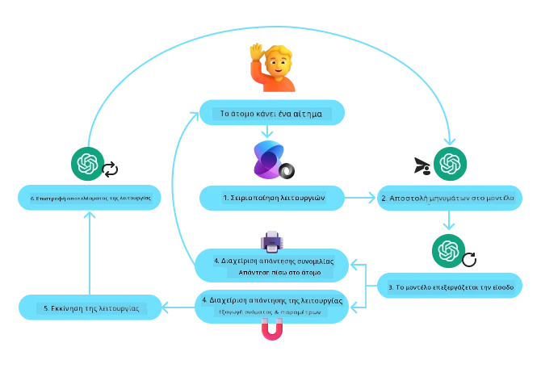
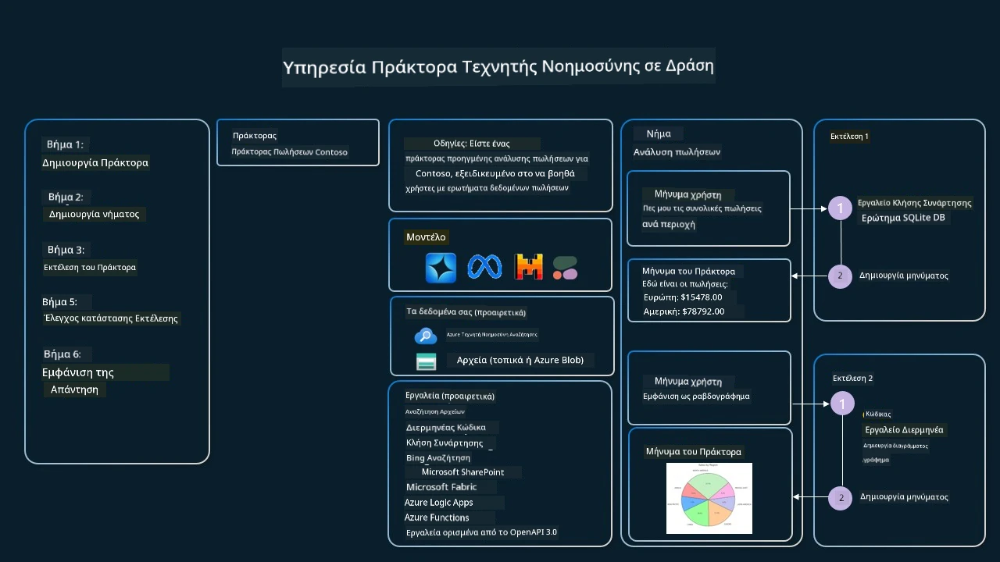

[](https://youtu.be/vieRiPRx-gI?si=cEZ8ApnT6Sus9rhn)

> _(Κάντε κλικ στην εικόνα παραπάνω για να δείτε το βίντεο αυτής της ενότητας)_

# Σχέδιο Χρήσης Εργαλείων

Τα εργαλεία είναι ενδιαφέροντα επειδή επιτρέπουν στους πράκτορες ΤΝ να έχουν ευρύτερο φάσμα δυνατοτήτων. Αντί ο πράκτορας να έχει ένα περιορισμένο σύνολο ενεργειών που μπορεί να εκτελέσει, προσθέτοντας ένα εργαλείο, ο πράκτορας μπορεί πλέον να εκτελέσει ένα ευρύ φάσμα ενεργειών. Σε αυτό το κεφάλαιο, θα εξετάσουμε το Σχέδιο Χρήσης Εργαλείων, το οποίο περιγράφει πώς οι πράκτορες ΤΝ μπορούν να χρησιμοποιούν συγκεκριμένα εργαλεία για να επιτύχουν τους στόχους τους.

## Εισαγωγή

Σε αυτή την ενότητα, προσπαθούμε να απαντήσουμε στις ακόλουθες ερωτήσεις:

- Τι είναι το σχέδιο χρήσης εργαλείων;
- Σε ποιες περιπτώσεις μπορεί να εφαρμοστεί;
- Ποια είναι τα στοιχεία/δομικά μπλοκ που χρειάζονται για την υλοποίηση του σχεδίου;
- Ποιες είναι οι ειδικές παράμετροι για τη χρήση του Σχεδίου Χρήσης Εργαλείων για την κατασκευή αξιόπιστων πρακτόρων ΤΝ;

## Στόχοι Μάθησης

Μετά την ολοκλήρωση αυτής της ενότητας, θα μπορείτε να:

- Ορίσετε το Σχέδιο Χρήσης Εργαλείων και τον σκοπό του.
- Αναγνωρίσετε περιπτώσεις χρήσης όπου το Σχέδιο Χρήσης Εργαλείων είναι εφαρμόσιμο.
- Κατανοήσετε τα βασικά στοιχεία που χρειάζονται για την υλοποίηση του σχεδίου.
- Αναγνωρίσετε παραμέτρους που εξασφαλίζουν αξιοπιστία στους πράκτορες ΤΝ που χρησιμοποιούν αυτό το σχέδιο.

## Τι είναι το Σχέδιο Χρήσης Εργαλείων;

Το **Σχέδιο Χρήσης Εργαλείων** επικεντρώνεται στο να δώσει στα LLM τη δυνατότητα να αλληλεπιδρούν με εξωτερικά εργαλεία για την επίτευξη συγκεκριμένων στόχων. Τα εργαλεία είναι κώδικας που μπορεί να εκτελεστεί από έναν πράκτορα για να εκτελέσει ενέργειες. Ένα εργαλείο μπορεί να είναι μια απλή λειτουργία όπως ένας υπολογιστής, ή μια κλήση API σε υπηρεσία τρίτου μέρους, όπως αναζήτηση τιμών μετοχών ή πρόβλεψη καιρού. Στο πλαίσιο των πρακτόρων ΤΝ, τα εργαλεία σχεδιάζονται ώστε να εκτελούνται από τους πράκτορες ως απάντηση σε **κλήσεις λειτουργιών που παράγονται από το μοντέλο**.

## Σε ποιες περιπτώσεις μπορεί να εφαρμοστεί;

Οι Πράκτορες ΤΝ μπορούν να αξιοποιήσουν τα εργαλεία για να ολοκληρώσουν πολύπλοκα καθήκοντα, να ανακτήσουν πληροφορίες ή να λάβουν αποφάσεις. Το σχέδιο χρήσης εργαλείων χρησιμοποιείται συχνά σε σενάρια που απαιτούν δυναμική αλληλεπίδραση με εξωτερικά συστήματα, όπως βάσεις δεδομένων, διαδικτυακές υπηρεσίες ή διερμηνείς κώδικα. Αυτή η δυνατότητα είναι χρήσιμη για διάφορες περιπτώσεις χρήσης, συμπεριλαμβανομένων:

- **Δυναμική Ανάκτηση Πληροφοριών:** Οι πράκτορες μπορούν να κάνουν ερωτήματα σε εξωτερικά API ή βάσεις δεδομένων για να λάβουν επικαιροποιημένα δεδομένα (π.χ., ερώτημα σε βάση SQLite για ανάλυση δεδομένων, ανάκτηση τιμών μετοχών ή πληροφοριών καιρού).
- **Εκτέλεση και Ερμηνεία Κώδικα:** Οι πράκτορες μπορούν να εκτελέσουν κώδικα ή σενάρια για να λύσουν μαθηματικά προβλήματα, να δημιουργήσουν αναφορές ή να κάνουν προσομοιώσεις.
- **Αυτοματοποίηση Ροής Εργασίας:** Αυτοματοποίηση επαναλαμβανόμενων ή πολυσταδίων διεργασιών μέσω ενσωμάτωσης εργαλείων όπως προγραμματιστές εργασιών, υπηρεσίες email ή αγωγοί δεδομένων.
- **Υποστήριξη Πελατών:** Οι πράκτορες μπορούν να αλληλεπιδράσουν με συστήματα CRM, πλατφόρμες διαχείρισης εισιτηρίων ή βάσεις γνώσεων για να λύσουν ερωτήματα χρηστών.
- **Δημιουργία και Επεξεργασία Περιεχομένου:** Οι πράκτορες μπορούν να χρησιμοποιήσουν εργαλεία όπως διορθωτές γραμματικής, σύνοψη κειμένου ή αξιολογητές ασφάλειας περιεχομένου για να βοηθήσουν σε εργασίες δημιουργίας περιεχομένου.

## Ποια είναι τα στοιχεία/δομικά μπλοκ που χρειάζονται για την υλοποίηση του σχεδίου χρήσης εργαλείων;

Αυτά τα δομικά μπλοκ επιτρέπουν στον πράκτορα ΤΝ να εκτελεί ένα ευρύ φάσμα εργασιών. Ας δούμε τα βασικά στοιχεία που χρειάζονται για την υλοποίηση του Σχεδίου Χρήσης Εργαλείων:

- **Σχήματα Λειτουργίας/Εργαλείων:** Λεπτομερείς ορισμοί των διαθέσιμων εργαλείων, συμπεριλαμβανομένου του ονόματος της λειτουργίας, του σκοπού, των απαιτούμενων παραμέτρων και των αναμενόμενων εξόδων. Αυτά τα σχήματα επιτρέπουν στο LLM να κατανοήσει ποια εργαλεία είναι διαθέσιμα και πώς να κατασκευάσει έγκυρα αιτήματα.

- **Λογική Εκτέλεσης Λειτουργίας:** Καθορίζει πώς και πότε καλούνται τα εργαλεία σύμφωνα με την πρόθεση του χρήστη και το πλαίσιο της συνομιλίας. Αυτό μπορεί να περιλαμβάνει πλαίσια σχεδιαστών, μηχανισμούς δρομολόγησης ή ροές με συνθήκες που καθορίζουν τη δυναμική χρήση εργαλείων.

- **Σύστημα Διαχείρισης Μηνυμάτων:** Συστατικά που διαχειρίζονται τη ροή της συνομιλίας μεταξύ εισόδων χρήστη, απαντήσεων LLM, κλήσεων εργαλείων και εξόδων εργαλείων.

- **Πλαίσιο Ενσωμάτωσης Εργαλείων:** Υποδομή που συνδέει τον πράκτορα με διάφορα εργαλεία, είτε πρόκειται για απλές λειτουργίες είτε σύνθετες εξωτερικές υπηρεσίες.

- **Διαχείριση Σφαλμάτων & Επικύρωση:** Μηχανισμοί για τη διαχείριση αποτυχιών στην εκτέλεση εργαλείων, την επικύρωση παραμέτρων και τη διαχείριση απροσδόκητων απαντήσεων.

- **Διαχείριση Κατάστασης:** Παρακολουθεί το πλαίσιο της συνομιλίας, προηγούμενες αλληλεπιδράσεις με εργαλεία και επίμονα δεδομένα για να εξασφαλιστεί συνέπεια σε πολλαπλούς γύρους αλληλεπίδρασης.

Στη συνέχεια, ας δούμε την Κλήση Λειτουργίας/Εργαλείου πιο αναλυτικά.
 
### Κλήση Λειτουργίας/Εργαλείου

Η κλήση λειτουργίας είναι ο βασικός τρόπος με τον οποίο επιτρέπουμε στα Μεγάλα Γλωσσικά Μοντέλα (LLMs) να αλληλεπιδρούν με εργαλεία. Συχνά θα δείτε ότι οι όροι 'Λειτουργία' και 'Εργαλείο' χρησιμοποιούνται εναλλακτικά επειδή οι 'λειτουργίες' (μπλοκ επαναχρησιμοποιήσιμου κώδικα) είναι τα 'εργαλεία' που χρησιμοποιούν οι πράκτορες για να εκτελέσουν εργασίες. Για να κληθεί ο κώδικας μιας λειτουργίας, το LLM πρέπει να συγκρίνει το αίτημα του χρήστη με την περιγραφή της λειτουργίας. Για να γίνει αυτό, αποστέλλεται ένα σχήμα που περιέχει τις περιγραφές όλων των διαθέσιμων λειτουργιών στο LLM. Το LLM στη συνέχεια επιλέγει την πιο κατάλληλη λειτουργία για το έργο και επιστρέφει το όνομά της και τα επιχειρήματα της. Η επιλεγμένη λειτουργία καλείται, η απάντησή της αποστέλλεται πίσω στο LLM, το οποίο χρησιμοποιεί τις πληροφορίες για να απαντήσει στο αίτημα του χρήστη.

Για τους προγραμματιστές που θέλουν να υλοποιήσουν κλήσεις λειτουργιών για πράκτορες, θα χρειαστείτε:

1. Ένα μοντέλο LLM που υποστηρίζει κλήση λειτουργιών
2. Ένα σχήμα που περιέχει τις περιγραφές των λειτουργιών
3. Τον κώδικα για κάθε λειτουργία που περιγράφεται

Ας χρησιμοποιήσουμε το παράδειγμα της λήψης της τρέχουσας ώρας σε μια πόλη για να το επεξηγήσουμε:

1. **Αρχικοποιήστε ένα LLM που υποστηρίζει κλήση λειτουργιών:**

    Δεν υποστηρίζουν όλα τα μοντέλα κλήση λειτουργιών, επομένως είναι σημαντικό να ελέγξετε αν το LLM που χρησιμοποιείτε το υποστηρίζει. Το <a href="https://learn.microsoft.com/azure/ai-services/openai/how-to/function-calling" target="_blank">Azure OpenAI</a> υποστηρίζει κλήση λειτουργιών. Μπορούμε να ξεκινήσουμε δημιουργώντας τον πελάτη OpenAI για το Azure OpenAI **Responses API** (το σταθερό endpoint `/openai/v1/` — δεν απαιτείται `api_version`). 

    ```python
    # Αρχικοποιήστε τον πελάτη OpenAI για το Azure OpenAI (API απαντήσεων, τερματικό σημείο v1)
    client = OpenAI(
        base_url=f"{os.environ['AZURE_OPENAI_ENDPOINT'].rstrip('/')}/openai/v1/",
        api_key=os.environ["AZURE_OPENAI_API_KEY"],
    )
    deployment_name = os.environ["AZURE_OPENAI_DEPLOYMENT"]
    ```

1. **Δημιουργήστε ένα Σχήμα Λειτουργίας**:

    Στη συνέχεια ορίζουμε ένα σχήμα JSON που περιλαμβάνει το όνομα της λειτουργίας, περιγραφή του τι κάνει η λειτουργία και τα ονόματα και περιγραφές των παραμέτρων της.
    Μετά παίρνουμε αυτό το σχήμα και το περνάμε στον πελάτη που δημιουργήθηκε προηγουμένως, μαζί με το αίτημα του χρήστη για εύρεση της ώρας στο San Francisco. Είναι σημαντικό να σημειωθεί ότι η **κλήση εργαλείου** είναι αυτό που επιστρέφεται, **όχι** η τελική απάντηση στην ερώτηση. Όπως αναφέρθηκε νωρίτερα, το LLM επιστρέφει το όνομα της λειτουργίας που επέλεξε για το έργο και τα επιχειρήματα που θα περάσουν σε αυτή.

    ```python
    # Περιγραφή λειτουργίας για το μοντέλο να διαβάσει (Μορφή εργαλείου επίπεδου API απαντήσεων)
    tools = [
        {
            "type": "function",
            "name": "get_current_time",
            "description": "Get the current time in a given location",
            "parameters": {
                "type": "object",
                "properties": {
                    "location": {
                        "type": "string",
                        "description": "The city name, e.g. San Francisco",
                    },
                },
                "required": ["location"],
            },
        }
    ]
    ```
   
    ```python
  
    # Αρχικό μήνυμα χρήστη
    messages = [{"role": "user", "content": "What's the current time in San Francisco"}]

    # Πρώτη κλήση API: Ζητήστε από το μοντέλο να χρησιμοποιήσει τη λειτουργία
    response = client.responses.create(
        model=deployment_name,
        input=messages,
        tools=tools,
        tool_choice="auto",
        store=False,
    )

    # Το Responses API επιστρέφει κλήσεις εργαλείων ως στοιχεία function_call στο response.output.
    # Προσθέστε τις στη συνομιλία ώστε το μοντέλο να έχει πλήρες πλαίσιο στην επόμενη εναλλαγή.
    messages += response.output

    print("Model's response:")
    print(response.output)
  
    ```

    ```bash
    Model's response:
    [ResponseFunctionToolCall(arguments='{"location":"San Francisco"}', call_id='call_pOsKdUlqvdyttYB67MOj434b', name='get_current_time', type='function_call')]
    ```
  
1. **Ο κώδικας της λειτουργίας που απαιτείται για να εκτελεστεί το έργο:**

    Τώρα που το LLM έχει επιλέξει ποια λειτουργία πρέπει να εκτελεστεί, πρέπει να υλοποιηθεί και να εκτελεστεί ο κώδικας που φέρνει σε πέρας το έργο.
    Μπορούμε να υλοποιήσουμε κώδικα σε Python για να πάρουμε την τρέχουσα ώρα. Θα χρειαστεί επίσης να γράψουμε κώδικα για να εξάγουμε το όνομα και τα επιχειρήματα από το response_message για να πάρουμε το τελικό αποτέλεσμα.

    ```python
      def get_current_time(location):
        """Get the current time for a given location"""
        print(f"get_current_time called with location: {location}")  
        location_lower = location.lower()
        
        for key, timezone in TIMEZONE_DATA.items():
            if key in location_lower:
                print(f"Timezone found for {key}")  
                current_time = datetime.now(ZoneInfo(timezone)).strftime("%I:%M %p")
                return json.dumps({
                    "location": location,
                    "current_time": current_time
                })
      
        print(f"No timezone data found for {location_lower}")  
        return json.dumps({"location": location, "current_time": "unknown"})
    ```

     ```python
    # Διαχείριση κλήσεων συναρτήσεων
    tool_calls = [item for item in response.output if item.type == "function_call"]
    if tool_calls:
        for tool_call in tool_calls:
            if tool_call.name == "get_current_time":

                function_args = json.loads(tool_call.arguments)

                time_response = get_current_time(
                    location=function_args.get("location")
                )

                # Επιστροφή του αποτελέσματος του εργαλείου ως αντικείμενο function_call_output
                messages.append({
                    "type": "function_call_output",
                    "call_id": tool_call.call_id,
                    "output": time_response,
                })
    else:
        print("No tool calls were made by the model.")

    # Δεύτερη κλήση API: Λήψη της τελικής απάντησης από το μοντέλο
    final_response = client.responses.create(
        model=deployment_name,
        input=messages,
        tools=tools,
        store=False,
    )

    return final_response.output_text
     ```

     ```bash
      get_current_time called with location: San Francisco
      Timezone found for san francisco
      The current time in San Francisco is 09:24 AM.
     ```

Η Κλήση Λειτουργίας είναι στο επίκεντρο σχεδόν όλων, αν όχι όλων, των σχεδίων χρήσης εργαλείων από πράκτορες, ωστόσο η υλοποίησή της από το μηδέν μπορεί μερικές φορές να είναι δύσκολη.
Όπως μάθαμε στην [Ενότητα 2](../../../02-explore-agentic-frameworks), τα agentic frameworks μας παρέχουν προκατασκευασμένα δομικά μπλοκ για την υλοποίηση χρήσης εργαλείων.
 
## Παραδείγματα Χρήσης Εργαλείων με Agentic Frameworks

Ακολουθούν μερικά παραδείγματα για το πώς μπορείτε να υλοποιήσετε το Σχέδιο Χρήσης Εργαλείων χρησιμοποιώντας διαφορετικά agentic frameworks:

### Microsoft Agent Framework

Το <a href="https://learn.microsoft.com/azure/ai-services/agents/overview" target="_blank">Microsoft Agent Framework</a> είναι ένα open-source πλαίσιο AI για την κατασκευή πρακτόρων ΤΝ. Απλοποιεί τη διαδικασία χρήσης κλήσεων λειτουργιών επιτρέποντάς σας να ορίζετε εργαλεία ως λειτουργίες Python με το διακοσμητή `@tool`. Το πλαίσιο χειρίζεται την αμφίδρομη επικοινωνία μεταξύ του μοντέλου και του κώδικά σας. Παρέχει επίσης πρόσβαση σε έτοιμα εργαλεία όπως File Search και Code Interpreter μέσω του `FoundryChatClient`.

Το παρακάτω διάγραμμα απεικονίζει τη διαδικασία κλήσης λειτουργίας με το Microsoft Agent Framework:



Στο Microsoft Agent Framework, τα εργαλεία ορίζονται ως διακοσμημένες λειτουργίες. Μπορούμε να μετατρέψουμε τη λειτουργία `get_current_time` που είδαμε προηγουμένως σε εργαλείο χρησιμοποιώντας το διακοσμητή `@tool`. Το πλαίσιο αυτόματα σειριοποιεί τη λειτουργία και τις παραμέτρους της, δημιουργώντας το σχήμα που στέλνεται στο LLM.

```python
import os
from agent_framework import tool
from agent_framework.foundry import FoundryChatClient
from azure.identity import AzureCliCredential

@tool(approval_mode="never_require")
def get_current_time(location: str) -> str:
    """Get the current time for a given location"""
    ...

# Δημιουργήστε τον πελάτη
provider = FoundryChatClient(
    project_endpoint=os.environ["AZURE_AI_PROJECT_ENDPOINT"],
    model=os.environ["AZURE_AI_MODEL_DEPLOYMENT_NAME"],
    credential=AzureCliCredential(),
)

# Δημιουργήστε έναν πράκτορα και τρέξτε με το εργαλείο
agent = provider.as_agent(name="TimeAgent", instructions="Use available tools to answer questions.", tools=get_current_time)
response = await agent.run("What time is it?")
```
  
### Microsoft Foundry Agent Service

Το <a href="https://learn.microsoft.com/azure/ai-services/agents/overview" target="_blank">Microsoft Foundry Agent Service</a> είναι ένα πιο νέο agentic framework που έχει σχεδιαστεί για να δίνει στους προγραμματιστές τη δυνατότητα να κατασκευάζουν με ασφάλεια, να αναπτύσσουν και να κλιμακώνουν υψηλής ποιότητας και επεκτάσιμους πράκτορες ΤΝ χωρίς να χρειάζεται να διαχειρίζονται τους υποκείμενους πόρους υπολογισμού και αποθήκευσης. Είναι ιδιαίτερα χρήσιμο για επιχειρηματικές εφαρμογές επειδή είναι μια πλήρως διαχειριζόμενη υπηρεσία με ασφάλεια επιπέδου επιχειρήσεων.

Σε σύγκριση με την ανάπτυξη με το LLM API απευθείας, το Microsoft Foundry Agent Service προσφέρει μερικά πλεονεκτήματα, όπως:

- Αυτόματες κλήσεις εργαλείων – δεν χρειάζεται να αναλύετε μια κλήση εργαλείου, να καλείτε το εργαλείο και να διαχειρίζεστε την απάντηση· όλα αυτά γίνονται πλέον στον διακομιστή
- Διαχειριζόμενα με ασφάλεια δεδομένα – αντί να διαχειρίζεστε τη δική σας κατάσταση συνομιλίας, μπορείτε να βασίζεστε στα threads για να αποθηκεύσετε όλες τις πληροφορίες που χρειάζεστε
- Εργαλεία έτοιμα προς χρήση – Εργαλεία που μπορείτε να χρησιμοποιήσετε για να αλληλεπιδράσετε με τις πηγές δεδομένων σας, όπως Bing, Azure AI Search, και Azure Functions.

Τα εργαλεία που είναι διαθέσιμα στο Microsoft Foundry Agent Service διακρίνονται σε δύο κατηγορίες:

1. Εργαλεία Γνώσης:
    - <a href="https://learn.microsoft.com/azure/ai-services/agents/how-to/tools/bing-grounding?tabs=python&pivots=overview" target="_blank">Υποστήριξη με Bing Search</a>
    - <a href="https://learn.microsoft.com/azure/ai-services/agents/how-to/tools/file-search?tabs=python&pivots=overview" target="_blank">Αναζήτηση Αρχείων</a>
    - <a href="https://learn.microsoft.com/azure/ai-services/agents/how-to/tools/azure-ai-search?tabs=azurecli%2Cpython&pivots=overview-azure-ai-search" target="_blank">Azure AI Search</a>

2. Εργαλεία Δράσης:
    - <a href="https://learn.microsoft.com/azure/ai-services/agents/how-to/tools/function-calling?tabs=python&pivots=overview" target="_blank">Κλήση Λειτουργίας</a>
    - <a href="https://learn.microsoft.com/azure/ai-services/agents/how-to/tools/code-interpreter?tabs=python&pivots=overview" target="_blank">Code Interpreter</a>
    - <a href="https://learn.microsoft.com/azure/ai-services/agents/how-to/tools/openapi-spec?tabs=python&pivots=overview" target="_blank">Εργαλεία ορισμένα με OpenAPI</a>
    - <a href="https://learn.microsoft.com/azure/ai-services/agents/how-to/tools/azure-functions?pivots=overview" target="_blank">Azure Functions</a>

Η υπηρεσία Agent Service μας επιτρέπει να χρησιμοποιούμε αυτά τα εργαλεία μαζί ως ένα `toolset`. Χρησιμοποιεί επίσης `threads` που παρακολουθούν το ιστορικό των μηνυμάτων από μια συγκεκριμένη συνομιλία.

Φανταστείτε ότι είστε πωλητής σε μια εταιρεία που ονομάζεται Contoso. Θέλετε να αναπτύξετε έναν συνομιλιακό πράκτορα που μπορεί να απαντά σε ερωτήσεις σχετικά με τα δεδομένα πωλήσεών σας.

Η ακόλουθη εικόνα απεικονίζει πώς θα μπορούσατε να χρησιμοποιήσετε το Microsoft Foundry Agent Service για να αναλύσετε τα δεδομένα πωλήσεών σας:



Για να χρησιμοποιήσουμε οποιοδήποτε από αυτά τα εργαλεία με την υπηρεσία μπορούμε να δημιουργήσουμε έναν πελάτη και να ορίσουμε ένα εργαλείο ή ένα σύνολο εργαλείων. Για να το υλοποιήσουμε πρακτικά, μπορούμε να χρησιμοποιήσουμε τον ακόλουθο κώδικα Python. Το LLM θα μπορεί να κοιτάξει το σύνολο εργαλείων και να αποφασίσει αν θα χρησιμοποιήσει τη λειτουργία που δημιουργήθηκε από τον χρήστη, `fetch_sales_data_using_sqlite_query`, ή τον προ-κατασκευασμένο Code Interpreter ανάλογα με το αίτημα του χρήστη.

```python 
import os
from azure.ai.projects import AIProjectClient
from azure.identity import DefaultAzureCredential
from fetch_sales_data_functions import fetch_sales_data_using_sqlite_query # συνάρτηση fetch_sales_data_using_sqlite_query που μπορεί να βρεθεί σε ένα αρχείο fetch_sales_data_functions.py.
from azure.ai.projects.models import ToolSet, FunctionTool, CodeInterpreterTool

project_client = AIProjectClient.from_connection_string(
    credential=DefaultAzureCredential(),
    conn_str=os.environ["PROJECT_CONNECTION_STRING"],
)

# Αρχικοποίηση σετ εργαλείων
toolset = ToolSet()

# Αρχικοποίηση πράκτορα κλήσης συναρτήσεων με τη συνάρτηση fetch_sales_data_using_sqlite_query και προσθήκη της στο σετ εργαλείων
fetch_data_function = FunctionTool(fetch_sales_data_using_sqlite_query)
toolset.add(fetch_data_function)

# Αρχικοποίηση εργαλείου Ερμηνευτή Κώδικα και προσθήκη του στο σετ εργαλείων.
code_interpreter = CodeInterpreterTool()toolset.add(code_interpreter)

agent = project_client.agents.create_agent(
    model="gpt-4o-mini", name="my-agent", instructions="You are helpful agent", 
    toolset=toolset
)
```

## Ποιες είναι οι ειδικές παράμετροι για τη χρήση του Σχεδίου Χρήσης Εργαλείων για την κατασκευή αξιόπιστων πρακτόρων ΤΝ;

Ένας κοινός προβληματισμός με το SQL που δημιουργείται δυναμικά από LLMs είναι η ασφάλεια, ιδιαίτερα ο κίνδυνος SQL injection ή κακόβουλων ενεργειών, όπως η διαγραφή ή αλλοίωση της βάσης δεδομένων. Ενώ αυτοί οι προβληματισμοί είναι έγκυροι, μπορούν να αντιμετωπιστούν αποτελεσματικά με τη σωστή διαμόρφωση των δικαιωμάτων πρόσβασης στη βάση δεδομένων. Για τις περισσότερες βάσεις δεδομένων αυτό περιλαμβάνει τον καθορισμό της βάσης ως μόνο για ανάγνωση. Για υπηρεσίες βάσης δεδομένων όπως το PostgreSQL ή το Azure SQL, η εφαρμογή πρέπει να παίρνει ρόλο μόνο για ανάγνωση (SELECT).

Η εκτέλεση της εφαρμογής σε έναν ασφαλή περιβάλλον ενισχύει περαιτέρω την προστασία. Σε επιχειρηματικά σενάρια, τα δεδομένα συνήθως εξάγονται και μετασχηματίζονται από λειτουργικά συστήματα σε μια βάση δεδομένων ή αποθήκη δεδομένων μόνο για ανάγνωση με ένα χρήστη φιλικό σχήμα. Αυτή η προσέγγιση εξασφαλίζει ότι τα δεδομένα είναι ασφαλή, βελτιστοποιημένα για απόδοση και προσβασιμότητα, και ότι η εφαρμογή έχει περιορισμένη, μόνο για ανάγνωση πρόσβαση.

## Δείγματα Κώδικα

- Python: [Agent Framework](./code_samples/04-python-agent-framework.ipynb)
- .NET: [Agent Framework](./code_samples/04-dotnet-agent-framework.md)

## Έχετε Περισσότερες Ερωτήσεις για τα Σχέδια Χρήσης Εργαλείων;

Εγγραφείτε στο [Microsoft Foundry Discord](https://discord.com/invite/ATgtXmAS5D) για να συναντήσετε άλλους μαθητές, να παρακολουθήσετε ωράρια γραφείου και να πάρετε απαντήσεις στις ερωτήσεις σας για Πράκτορες Τεχνητής Νοημοσύνης.

## Πρόσθετοι Πόροι

- <a href="https://microsoft.github.io/build-your-first-agent-with-azure-ai-agent-service-workshop/" target="_blank">Σεμινάριο Azure AI Agents Service</a>
- <a href="https://github.com/Azure-Samples/contoso-creative-writer/tree/main/docs/workshop" target="_blank">Σεμινάριο Πολλαπλών Πρακτόρων Contoso Creative Writer</a>
- <a href="https://learn.microsoft.com/azure/ai-services/agents/overview" target="_blank">Επισκόπηση Microsoft Agent Framework</a>
## Προηγούμενο Μάθημα

[Κατανόηση των Δομικών Προτύπων Αντιπροσώπων](../03-agentic-design-patterns/README.md)

## Επόμενο Μάθημα

[Agentic RAG](../05-agentic-rag/README.md)

---

<!-- CO-OP TRANSLATOR DISCLAIMER START -->
**Αποποίηση ευθυνών**:
Αυτό το έγγραφο έχει μεταφραστεί χρησιμοποιώντας την υπηρεσία μετάφρασης με τεχνητή νοημοσύνη [Co-op Translator](https://github.com/Azure/co-op-translator). Ενώ επιδιώκουμε την ακρίβεια, παρακαλούμε να έχετε υπόψη ότι οι αυτοματοποιημένες μεταφράσεις ενδέχεται να περιέχουν λάθη ή ανακρίβειες. Το πρωτότυπο έγγραφο στη μητρική του γλώσσα πρέπει να θεωρείται η αυθεντική πηγή. Για κρίσιμες πληροφορίες, συνιστάται επαγγελματική ανθρώπινη μετάφραση. Δεν φέρουμε ευθύνη για τυχόν παρεξηγήσεις ή λανθασμένες ερμηνείες που προκύπτουν από τη χρήση αυτής της μετάφρασης.
<!-- CO-OP TRANSLATOR DISCLAIMER END -->