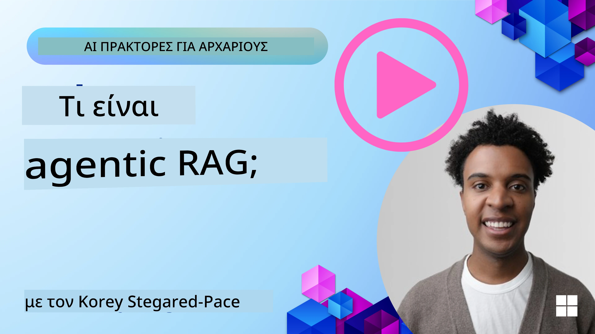
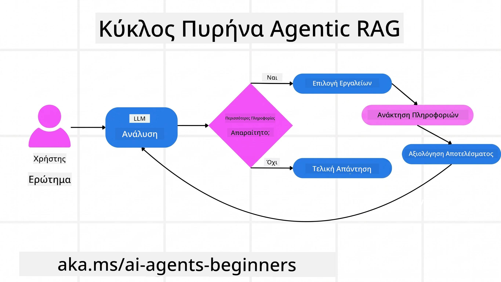
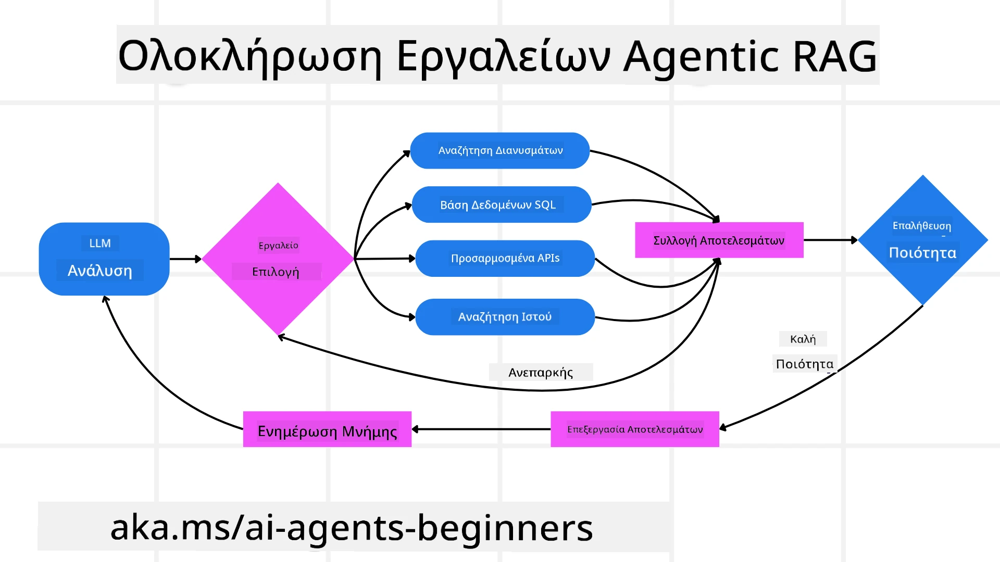
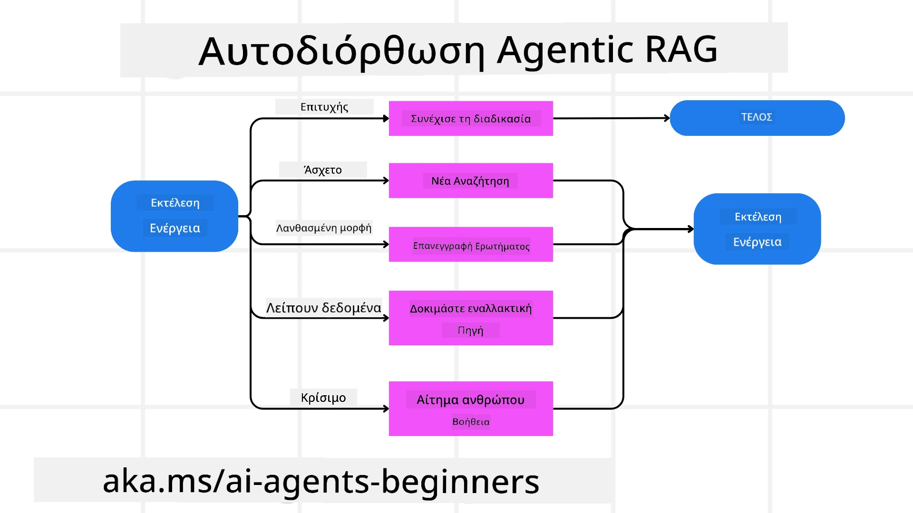
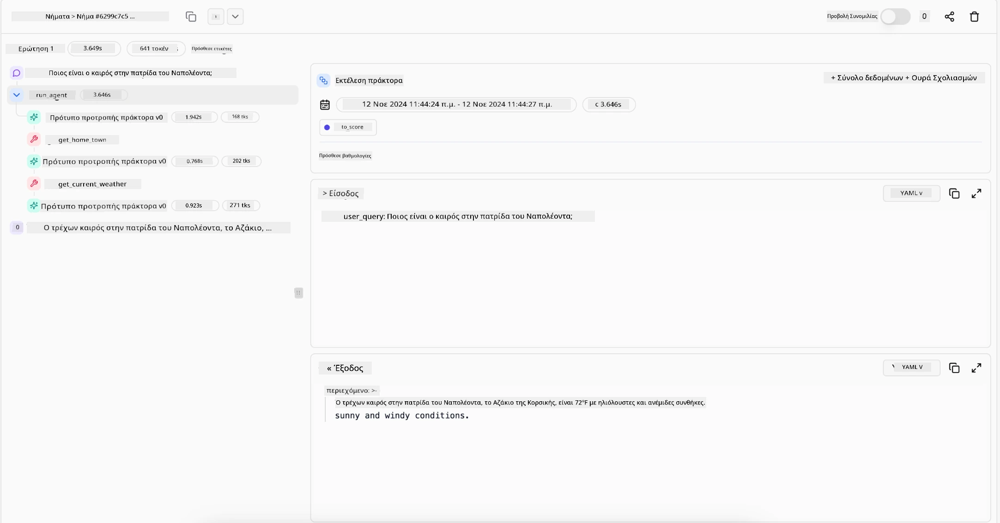

> _(Κάντε κλικ στην εικόνα παραπάνω για να δείτε το βίντεο αυτού του μαθήματος)_

# Agentic RAG

Αυτό το μάθημα παρέχει μια ολοκληρωμένη επισκόπηση του Agentic Retrieval-Augmented Generation (Agentic RAG), ενός αναδυόμενου παραδείγματος ΤΝ όπου μεγάλα μοντέλα γλώσσας (LLMs) προγραμματίζουν αυτόνομα τα επόμενα βήματά τους ενώ αντλούν πληροφορίες από εξωτερικές πηγές. Σε αντίθεση με στατικά μοτίβα ανάκτησης-μετά-ανάγνωσης, το Agentic RAG περιλαμβάνει επαναλαμβανόμενες κλήσεις προς το LLM, διανεμημένες με κλήσεις εργαλείων ή λειτουργιών και δομημένες εξόδους. Το σύστημα αξιολογεί τα αποτελέσματα, βελτιώνει τα ερωτήματα, επικαλείται πρόσθετα εργαλεία αν χρειαστεί και συνεχίζει αυτόν τον κύκλο μέχρι να επιτευχθεί μια ικανοποιητική λύση.

## Εισαγωγή

Αυτό το μάθημα θα καλύψει

- **Κατανόηση του Agentic RAG:** Μάθετε για το αναδυόμενο παράδειγμα στην ΤΝ όπου μεγάλα μοντέλα γλώσσας (LLMs) προγραμματίζουν αυτόνομα τα επόμενα βήματά τους ενώ αντλούν πληροφορίες από εξωτερικές πηγές δεδομένων.
- **Κατανοήστε το ύφος επαναληπτικού Maker-Checker:** Κατανοήστε τον βρόχο επαναλαμβανόμενων κλήσεων προς το LLM, διανεμημένων με κλήσεις εργαλείων ή λειτουργιών και δομημένες εξόδους, σχεδιασμένες για βελτίωση της ορθότητας και διαχείριση κακώς διατυπωμένων ερωτημάτων.
- **Εξερευνήστε πρακτικές εφαρμογές:** Αναγνωρίστε σενάρια όπου το Agentic RAG ξεχωρίζει, όπως περιβάλλοντα που θέτουν την ορθότητα ως πρώτη προτεραιότητα, πολύπλοκες αλληλεπιδράσεις με βάσεις δεδομένων και εκτεταμένες ροές εργασίας.

## Στόχοι εκμάθησης

Μετά την ολοκλήρωση αυτού του μαθήματος, θα γνωρίζετε πώς να/κατανοείτε:

- **Κατανόηση του Agentic RAG:** Μάθετε για το αναδυόμενο παράδειγμα στην ΤΝ όπου μεγάλα μοντέλα γλώσσας (LLMs) προγραμματίζουν αυτόνομα τα επόμενα βήματά τους ενώ αντλούν πληροφορίες από εξωτερικές πηγές δεδομένων.
- **Επαναληπτικό ύφος Maker-Checker:** Κατανοήστε την έννοια του βρόχου επαναλαμβανόμενων κλήσεων προς το LLM, διανεμημένων με κλήσεις εργαλείων ή λειτουργιών και δομημένες εξόδους, σχεδιασμένα να βελτιώνουν την ορθότητα και να διαχειρίζονται κακώς διατυπωμένα ερωτήματα.
- **Ιδιοκτησία της διαδικασίας λογισμού:** Κατανοήστε την ικανότητα του συστήματος να κατέχει τη διαδικασία λογισμού του, λαμβάνοντας αποφάσεις για το πώς να προσεγγίσει προβλήματα χωρίς να βασίζεται σε προ-καθορισμένες πορείες.
- **Ροή εργασιών:** Κατανοήστε πώς ένα agentic μοντέλο αποφασίζει αυτόνομα να ανακτήσει αναφορές τάσεων αγοράς, να εντοπίσει δεδομένα ανταγωνιστών, να συσχετίσει εσωτερικά μετρικά πωλήσεων, να συνθέσει ευρήματα και να αξιολογήσει τη στρατηγική.
- **Επαναληπτικοί βρόχοι, ενσωμάτωση εργαλείων και μνήμη:** Μάθετε για την εξάρτηση του συστήματος από ένα προτύπο αλληλεπίδρασης βρόχου, διατηρώντας κατάσταση και μνήμη ανά βήμα ώστε να αποφεύγονται επαναλαμβανόμενοι βρόχοι και να λαμβάνονται ενημερωμένες αποφάσεις.
- **Διαχείριση αποτυχιών και αυτοδιόρθωση:** Εξερευνήστε τους ισχυρούς μηχανισμούς αυτοδιόρθωσης του συστήματος, συμπεριλαμβανομένης της επανάληψης και επαναερωτήσεων, της χρήσης διαγνωστικών εργαλείων και της υποστήριξης από ανθρώπινη εποπτεία.
- **Όρια της αυτονομίας:** Κατανοήστε τους περιορισμούς του Agentic RAG, εστιάζοντας στην αυτονομία εντός συγκεκριμένου πεδίου, την εξάρτηση από υποδομές και τον σεβασμό σε κανόνες ασφάλειας.
- **Πρακτικές χρήσεις και αξία:** Αναγνωρίστε σενάρια όπου το Agentic RAG ξεχωρίζει, όπως περιβάλλοντα που θέτουν την ορθότητα ως πρώτη προτεραιότητα, πολύπλοκες αλληλεπιδράσεις με βάσεις δεδομένων και εκτεταμένες ροές εργασίας.
- **Διακυβέρνηση, διαφάνεια και εμπιστοσύνη:** Μάθετε για τη σημασία της διακυβέρνησης και της διαφάνειας, συμπεριλαμβανομένου του εξηγητού λογισμού, του ελέγχου προκαταλήψεων και της ανθρώπινης εποπτείας.

## Τι είναι το Agentic RAG;

Το Agentic Retrieval-Augmented Generation (Agentic RAG) είναι ένα αναδυόμενο παράδειγμα ΤΝ όπου μεγάλα μοντέλα γλώσσας (LLMs) προγραμματίζουν αυτόνομα τα επόμενα βήματά τους ενώ αντλούν πληροφορίες από εξωτερικές πηγές. Σε αντίθεση με στατικά μοτίβα ανάκτησης-μετά-ανάγνωσης, το Agentic RAG περιλαμβάνει επαναλαμβανόμενες κλήσεις προς το LLM, διανεμημένες με κλήσεις εργαλείων ή λειτουργιών και δομημένες εξόδους. Το σύστημα αξιολογεί τα αποτελέσματα, βελτιώνει τα ερωτήματα, επικαλείται πρόσθετα εργαλεία αν χρειαστεί και συνεχίζει τον κύκλο μέχρι να επιτευχθεί μια ικανοποιητική λύση. Αυτό το επαναληπτικό ύφος “maker-checker” βελτιώνει την ορθότητα, διαχειρίζεται κακώς διατυπωμένα ερωτήματα και εξασφαλίζει αποτελέσματα υψηλής ποιότητας.

Το σύστημα κατέχει ενεργά τη διαδικασία λογισμού του, ξαναγράφοντας αποτυχημένα ερωτήματα, επιλέγοντας διαφορετικές μεθόδους ανάκτησης και ενσωματώνοντας πολλαπλά εργαλεία — όπως αναζήτηση διανυσμάτων στο Azure AI Search, βάσεις δεδομένων SQL ή προσαρμοσμένα API — πριν ολοκληρώσει την απάντησή του. Το χαρακτηριστικό που διαφοροποιεί ένα agentic σύστημα είναι η ικανότητά του να κατέχει τη διαδικασία λογισμού του. Οι παραδοσιακές υλοποιήσεις RAG βασίζονται σε προ-καθορισμένες πορείες, ενώ ένα agentic σύστημα καθορίζει αυτόνομα τη σειρά των βημάτων με βάση την ποιότητα των πληροφοριών που βρίσκει.

## Ορισμός του Agentic Retrieval-Augmented Generation (Agentic RAG)

Το Agentic Retrieval-Augmented Generation (Agentic RAG) είναι ένα αναδυόμενο παράδειγμα στην ανάπτυξη ΤΝ όπου τα LLM όχι μόνο αντλούν πληροφορίες από εξωτερικές πηγές δεδομένων, αλλά και προγραμματίζουν αυτόνομα τα επόμενα βήματά τους. Σε αντίθεση με στατικά μοτίβα ανάκτησης-μετά-ανάγνωσης ή καλογραμμένες ακολουθίες prompt, το Agentic RAG περιλαμβάνει έναν βρόχο επαναλαμβανόμενων κλήσεων προς το LLM, διανεμημένων με κλήσεις εργαλείων ή λειτουργιών και δομημένες εξόδους. Σε κάθε βήμα, το σύστημα αξιολογεί τα αποτελέσματα που έχει λάβει, αποφασίζει αν πρέπει να βελτιώσει τα ερωτήματά του, επικαλείται επιπλέον εργαλεία αν χρειαστεί και συνεχίζει τον κύκλο μέχρι να πετύχει ικανοποιητική λύση.

Αυτό το επαναληπτικό “maker-checker” ύφος λειτουργίας στοχεύει στη βελτίωση της ορθότητας, στη διαχείριση κακώς διατυπωμένων ερωτημάτων σε δομημένες βάσεις δεδομένων (π.χ. NL2SQL) και στην εξασφάλιση ισορροπημένων, υψηλής ποιότητας αποτελεσμάτων. Αντί να βασίζεται μόνο σε προσεκτικά σχεδιασμένες αλυσίδες prompt, το σύστημα κατέχει ενεργά τη διαδικασία λογισμού του. Μπορεί να ξαναγράψει ερωτήματα που αποτυγχάνουν, να επιλέξει διαφορετικές μεθόδους ανάκτησης και να ενσωματώσει πολλαπλά εργαλεία — όπως αναζήτηση διανυσμάτων στο Azure AI Search, βάσεις δεδομένων SQL ή προσαρμοσμένα API — πριν ολοκληρώσει την απάντηση. Αυτό απομακρύνει την ανάγκη για υπερβολικά πολύπλοκα πλαίσια ορχήστρωσης. Αντίθετα, ένας σχετικά απλός βρόχος “κλήση LLM → χρήση εργαλείου → κλήση LLM → …” μπορεί να παράγει εξελιγμένες και καλά θεμελιωμένες εξόδους.

## Ιδιοκτησία της διαδικασίας λογισμού

Η διακριτική ποιότητα που κάνει ένα σύστημα “agentic” είναι η ικανότητά του να κατέχει τη διαδικασία λογισμού του. Οι παραδοσιακές υλοποιήσεις RAG συχνά εξαρτώνται από ανθρώπους που προκαθορίζουν μια πορεία για το μοντέλο: μια αλυσίδα σκέψεων που καθορίζει τι να ανακτηθεί και πότε.  
Όταν όμως ένα σύστημα είναι πραγματικά agentic, αποφασίζει εσωτερικά πώς να προσεγγίσει το πρόβλημα. Δεν εκτελεί απλώς ένα σενάριο· καθορίζει αυτόνομα τη σειρά των βημάτων με βάση την ποιότητα των πληροφοριών που βρίσκει.  
Για παράδειγμα, αν του ζητηθεί να δημιουργήσει μια στρατηγική λανσαρίσματος προϊόντος, δεν βασίζεται μόνο σε μια προτροπή που αναλύει όλη τη ροή έρευνας και λήψης αποφάσεων. Αντίθετα, το agentic μοντέλο αποφασίζει ανεξάρτητα να:

1. Ανακτήσει τρέχουσες αναφορές τάσεων αγοράς χρησιμοποιώντας το Bing Web Grounding
2. Εντοπίσει σχετικά δεδομένα ανταγωνιστών μέσω Azure AI Search.
3. Συσχετίσει ιστορικά εσωτερικά μετρικά πωλήσεων μέσω της βάσης δεδομένων Azure SQL.
4. Συνθέσει τα ευρήματα σε μια συνεκτική στρατηγική που οργανώνεται μέσω της υπηρεσίας Azure OpenAI.
5. Αξιολογήσει τη στρατηγική για κενά ή ασυνέπειες, ενεργοποιώντας έναν ακόμα κύκλο ανάκτησης αν χρειάζεται.  
Όλα αυτά τα βήματα — η βελτίωση ερωτημάτων, η επιλογή πηγών, η επανάληψη μέχρι να υπάρξει “ικανοποίηση” με την απάντηση — αποφασίζονται από το μοντέλο, όχι από προ-σενάριο ανθρώπου.

## Επαναληπτικοί βρόχοι, ενσωμάτωση εργαλείων και μνήμη

Ένα agentic σύστημα βασίζεται σε ένα πρότυπο αλληλεπίδρασης βρόχου:

- **Αρχική Κλήση:** Ο στόχος του χρήστη (δηλαδή, το prompt) παρουσιάζεται στο LLM.
- **Κλήση Εργαλείου:** Αν το μοντέλο εντοπίσει ελλείπουσες πληροφορίες ή ασαφείς οδηγίες, επιλέγει ένα εργαλείο ή μέθοδο ανάκτησης — όπως ένα ερώτημα σε βάση διανυσμάτων (π.χ. Azure AI Search Hybrid search σε ιδιωτικά δεδομένα) ή μια δομημένη κλήση SQL — για να συγκεντρώσει περισσότερο πλαίσιο.
- **Αξιολόγηση & Βελτίωση:** Μετά τον έλεγχο των επιστρεφόμενων δεδομένων, το μοντέλο αποφασίζει αν οι πληροφορίες είναι επαρκείς. Αν όχι, βελτιώνει το ερώτημα, δοκιμάζει άλλο εργαλείο ή προσαρμόζει την προσέγγιση.
- **Επανάληψη Μέχρι Ικανοποίησης:** Αυτός ο κύκλος συνεχίζεται μέχρι το μοντέλο να κρίνει ότι έχει αρκετή σαφήνεια και αποδείξεις για να παραδώσει τελική, καλά τεκμηριωμένη απάντηση.
- **Μνήμη & Κατάσταση:** Δεδομένου ότι το σύστημα διατηρεί κατάσταση και μνήμη μεταξύ των βημάτων, μπορεί να θυμάται προηγούμενες προσπάθειες και αποτελέσματα, αποφεύγοντας επαναλαμβανόμενους βρόχους και λαμβάνοντας πιο ενημερωμένες αποφάσεις καθώς προχωρά.

Με την πάροδο του χρόνου, αυτό δημιουργεί αίσθηση εξελισσόμενης κατανόησης, επιτρέποντας στο μοντέλο να περιηγηθεί σε σύνθετες, πολλαπλών βημάτων εργασίες χωρίς να απαιτείται ανθρώπινη συνεχή παρέμβαση ή ανασχεδιασμός του prompt.

## Διαχείριση αποτυχιών και αυτοδιόρθωση

Η αυτονομία του Agentic RAG περιλαμβάνει επίσης ισχυρούς μηχανισμούς αυτοδιόρθωσης. Όταν το σύστημα φτάνει σε αδιέξοδα — όπως την ανάκτηση άσχετων εγγράφων ή αντιμετώπιση κακώς διατυπωμένων ερωτημάτων — μπορεί να:

- **Επαναλάβει και Επαναρωτήσει:** Αντί να επιστρέφει απαντήσεις χαμηλής αξίας, το μοντέλο δοκιμάζει νέες στρατηγικές αναζήτησης, ξαναγράφει ερωτήματα βάσεων δεδομένων ή εξετάζει εναλλακτικά σύνολα δεδομένων.
- **Χρησιμοποιεί Διαγνωστικά Εργαλεία:** Το σύστημα μπορεί να επικαλεστεί επιπλέον λειτουργίες σχεδιασμένες να βοηθήσουν στον εντοπισμό σφαλμάτων στη διαδικασία λογισμού ή στην επιβεβαίωση ορθότητας των ανακτημένων δεδομένων. Εργαλεία όπως το Azure AI Tracing είναι σημαντικά για την υποστήριξη ισχυρής παρατηρησιμότητας και παρακολούθησης.
- **Στήριξη από Ανθρώπινη Εποπτεία:** Σε σενάρια με υψηλά ρίσκα ή επαναλαμβανόμενες αποτυχίες, το μοντέλο μπορεί να δηλώσει αβεβαιότητα και να ζητήσει ανθρώπινη καθοδήγηση. Αφού ο άνθρωπος παρέχει διορθωτική ανατροφοδότηση, το μοντέλο μπορεί να ενσωματώσει το μάθημα αυτό στο μέλλον.

Αυτή η επαναληπτική και δυναμική προσέγγιση επιτρέπει στο μοντέλο να βελτιώνεται συνεχώς, εξασφαλίζοντας ότι δεν είναι απλά ένα σύστημα μίας χρήσης αλλά ένα που μαθαίνει από τα λάθη του κατά τη διάρκεια μιας συνεδρίας.

## Όρια της αυτονομίας

Παρότι διαθέτει αυτονομία εντός μιας εργασίας, το Agentic RAG δεν είναι ανάλογο της Γενικής Τεχνητής Νοημοσύνης (AGI). Οι “agentic” ικανότητές του περιορίζονται στα εργαλεία, τις πηγές δεδομένων και τις πολιτικές που παρέχουν οι άνθρωποι προγραμματιστές. Δεν μπορεί να εφεύρει τα δικά του εργαλεία ή να υπερβεί τα όρια του γνωστικού πεδίου που έχουν τεθεί. Αντ’ αυτού, διαπρέπει στον δυναμικό συντονισμό των διαθέσιμων πόρων.  
Οι βασικές διαφορές με πιο προχωρημένες μορφές ΤΝ περιλαμβάνουν:

1. **Αυτονομία Ειδικού Πεδίου:** Τα συστήματα Agentic RAG εστιάζουν στην επίτευξη στόχων ορισμένων από τους χρήστες εντός γνωστού πεδίου, εφαρμόζοντας στρατηγικές όπως επαναγραφή ερωτημάτων ή επιλογή εργαλείων για βελτίωση αποτελεσμάτων.
2. **Εξάρτηση από Υποδομή:** Οι ικανότητες του συστήματος βασίζονται στα εργαλεία και τα δεδομένα που ενσωματώνουν οι προγραμματιστές. Δεν μπορεί να υπερβεί αυτά τα όρια χωρίς ανθρώπινη παρέμβαση.
3. **Σεβασμός στην Ασφάλεια:** Οι ηθικές οδηγίες, οι κανονισμοί συμμόρφωσης και οι πολιτικές της επιχείρησης παραμένουν πολύ σημαντικές. Η ελευθερία του agent περιορίζεται πάντα από μέτρα ασφαλείας και μηχανισμούς εποπτείας (ελπίζουμε;)

## Πρακτικές χρήσεις και αξία

Το Agentic RAG λάμπει σε σενάρια που απαιτούν επαναληπτική βελτιστοποίηση και ακρίβεια:

1. **Περιβάλλοντα με Ορθότητα ως Πρώτη Προτεραιότητα:** Σε ελέγχους συμμόρφωσης, κανονιστική ανάλυση ή νομική έρευνα, το agentic μοντέλο μπορεί να επαληθεύει επανειλημμένα γεγονότα, να συμβουλεύεται πολλές πηγές και να ξαναγράφει ερωτήματα μέχρι να παράγει πλήρως ελεγμένη απάντηση.
2. **Σύνθετες Αλληλεπιδράσεις με Βάσεις Δεδομένων:** Διαχειριζόμενο δομημένα δεδομένα όπου τα ερωτήματα μπορεί συχνά να αποτυγχάνουν ή να χρειάζονται προσαρμογή, το σύστημα μπορεί να βελτιώνει αυτόνομα τα ερωτήματα χρησιμοποιώντας Azure SQL ή Microsoft Fabric OneLake, διασφαλίζοντας ότι η τελική ανάκτηση ευθυγραμμίζεται με την πρόθεση του χρήστη.
3. **Εκτεταμένες Ροές Εργασίας:** Συνεδρίες μεγαλύτερης διάρκειας μπορεί να εξελίσσονται καθώς εμφανίζονται νέες πληροφορίες. Το Agentic RAG μπορεί συνεχώς να ενσωματώνει νέα δεδομένα, προσαρμόζοντας στρατηγικές καθώς μαθαίνει περισσότερα για το πρόβλημα.

## Διακυβέρνηση, διαφάνεια και εμπιστοσύνη

Καθώς αυτά τα συστήματα γίνονται πιο αυτόνομα στη λογική τους, η διακυβέρνηση και η διαφάνεια είναι κρίσιμες:

- **Εξηγήσιμος Λογισμός:** Το μοντέλο μπορεί να παρέχει ιχνηλασιμότητα των ερωτημάτων που έκανε, των πηγών που συμβουλεύτηκε και των βημάτων λογισμού που ακολούθησε για να καταλήξει στο συμπέρασμα. Εργαλεία όπως το Azure AI Content Safety και Azure AI Tracing / GenAIOps βοηθούν στη διατήρηση διαφάνειας και μετριάζουν τους κινδύνους.
- **Έλεγχος Προκαταλήψεων και Ισορροπημένη Ανάκτηση:** Οι προγραμματιστές μπορούν να ρυθμίζουν στρατηγικές ανάκτησης ώστε να εξασφαλίζουν ισορροπημένες, αντιπροσωπευτικές πηγές δεδομένων, και να ελέγχουν τακτικά τις εξόδους για ανίχνευση προκαταλήψεων ή μοτίβων εκτροπής, χρησιμοποιώντας προσαρμοσμένα μοντέλα για προχωρημένους οργανισμούς επιστήμης δεδομένων που χρησιμοποιούν Azure Machine Learning.
- **Ανθρώπινη Εποπτεία και Συμμόρφωση:** Για ευαίσθητα καθήκοντα, η ανθρώπινη ανασκόπηση παραμένει αναγκαία. Το Agentic RAG δεν αντικαθιστά την ανθρώπινη κρίση σε αποφάσεις υψηλού κινδύνου — την ενισχύει παρέχοντας πιο ολοκληρωμένες ελεγμένες επιλογές.

Η ύπαρξη εργαλείων που παρέχουν σαφή καταγραφή των ενεργειών είναι απαραίτητη. Χωρίς αυτά, ο εντοπισμός σφαλμάτων σε μία πολύ-βηματική διαδικασία μπορεί να είναι πολύ δύσκολος. Δείτε το ακόλουθο παράδειγμα από Literal AI (την εταιρεία πίσω από το Chainlit) για ένα Agent run:

## Συμπέρασμα

Το Agentic RAG αντιπροσωπεύει μια φυσική εξέλιξη στο πώς τα συστήματα ΤΝ χειρίζονται σύνθετα, εντατικά σε δεδομένα καθήκοντα. Υιοθετώντας ένα πρότυπο αλληλεπίδρασης βρόχου, επιλέγοντας αυτόνομα εργαλεία και βελτιώνοντας τα ερωτήματα μέχρι να επιτευχθεί αποτέλεσμα υψηλής ποιότητας, το σύστημα ξεπερνά την στατική ακολουθία prompt σε έναν πιο ευέλικτο, ευαισθητοποιημένο στη συμφραζόμενη πραγματικότητα λήπτη αποφάσεων. Παρότι εξακολουθεί να περιορίζεται από υποδομές και ηθικούς κανόνες που ορίζονται από ανθρώπους, αυτές οι agentic ικανότητες επιτρέπουν πιο πλούσιες, πιο δυναμικές και τελικά πιο χρήσιμες αλληλεπιδράσεις ΤΝ για επιχειρήσεις και τελικούς χρήστες.

### Έχετε περισσότερες ερωτήσεις για το Agentic RAG;

Εγγραφείτε στο [Microsoft Foundry Discord](https://discord.com/invite/ATgtXmAS5D) για να συναντήσετε άλλους εκπαιδευόμενους, να παρακολουθήσετε ώρες εξυπηρέτησης και να λύσετε τις απορίες σας σχετικά με AI Agents.

## Επιπλέον Πόροι

- <a href="https://learn.microsoft.com/training/modules/use-own-data-azure-openai" target="_blank">Υλοποίηση Retrieval Augmented Generation (RAG) με το Azure OpenAI Service: Μάθετε πώς να χρησιμοποιείτε τα δικά σας δεδομένα με το Azure OpenAI Service. Αυτό το μάθημα του Microsoft Learn παρέχει έναν ολοκληρωμένο οδηγό για την υλοποίηση του RAG</a>
- <a href="https://learn.microsoft.com/azure/ai-studio/concepts/evaluation-approach-gen-ai" target="_blank">Αξιολόγηση εφαρμογών γεννητικής ΤΝ με Microsoft Foundry: Αυτό το άρθρο καλύπτει την αξιολόγηση και σύγκριση μοντέλων σε δημόσια διαθέσιμα σύνολα δεδομένων, συμπεριλαμβανομένων των εφαρμογών Agentic AI και αρχιτεκτονικών RAG</a>
- <a href="https://weaviate.io/blog/what-is-agentic-rag" target="_blank">Τι είναι το Agentic RAG | Weaviate</a>
- <a href="https://ragaboutit.com/agentic-rag-a-complete-guide-to-agent-based-retrieval-augmented-generation/" target="_blank">Agentic RAG: Ολοκληρωμένος οδηγός για την Agent-based Retrieval Augmented Generation – Νέα από το generation RAG</a>
- <a href="https://huggingface.co/learn/cookbook/agent_rag" target="_blank">Agentic RAG: επιταχύνετε το RAG σας με αναδιαμόρφωση ερωτήσεων και αυτοερώτηση! Hugging Face Open-Source AI Cookbook</a>
- <a href="https://youtu.be/aQ4yQXeB1Ss?si=2HUqBzHoeB5tR04U" target="_blank">Προσθήκη Agentic Στρωμάτων στο RAG</a>
- <a href="https://www.youtube.com/watch?v=zeAyuLc_f3Q&t=244s" target="_blank">Το Μέλλον των Βοηθών Γνώσης: Jerry Liu</a>
- <a href="https://www.youtube.com/watch?v=AOSjiXP1jmQ" target="_blank">Πώς να Δημιουργήσετε Agentic RAG Συστήματα</a>
- <a href="https://ignite.microsoft.com/sessions/BRK102?source=sessions" target="_blank">Χρήση της Υπηρεσίας Microsoft Foundry Agent για κλιμάκωση των AI πρακτόρων σας</a>

### Επιστημονικά Άρθρα

- <a href="https://arxiv.org/abs/2303.17651" target="_blank">2303.17651 Self-Refine: Επαναληπτική Βελτίωση με Αυτοανατροφοδότηση</a>
- <a href="https://arxiv.org/abs/2303.11366" target="_blank">2303.11366 Reflexion: Πράκτορες Γλώσσας με Λεκτική Ενισχυτική Μάθηση</a>
- <a href="https://arxiv.org/abs/2305.11738" target="_blank">2305.11738 CRITIC: Μεγάλα Μοντέλα Γλώσσας Μπορούν να Αυτοδιόρθωθούν με Κριτική Διενεργούμενη από Εργαλεία</a>
- <a href="https://arxiv.org/abs/2501.09136" target="_blank">2501.09136 Agentic Retrieval-Augmented Generation: Έρευνα για το Agentic RAG</a>

## Προηγούμενο Μάθημα

[Tool Use Design Pattern](../04-tool-use/README.md)

## Επόμενο Μάθημα

[Building Trustworthy AI Agents](../06-building-trustworthy-agents/README.md)

---

<!-- CO-OP TRANSLATOR DISCLAIMER START -->
**Αποποίηση ευθυνών**:
Αυτό το έγγραφο έχει μεταφραστεί χρησιμοποιώντας την υπηρεσία μετάφρασης με τεχνητή νοημοσύνη [Co-op Translator](https://github.com/Azure/co-op-translator). Ενώ επιδιώκουμε την ακρίβεια, παρακαλούμε να έχετε υπόψη ότι οι αυτοματοποιημένες μεταφράσεις ενδέχεται να περιέχουν λάθη ή ανακρίβειες. Το πρωτότυπο έγγραφο στη μητρική του γλώσσα πρέπει να θεωρείται η αυθεντική πηγή. Για κρίσιμες πληροφορίες, συνιστάται επαγγελματική ανθρώπινη μετάφραση. Δεν φέρουμε ευθύνη για τυχόν παρεξηγήσεις ή λανθασμένες ερμηνείες που προκύπτουν από τη χρήση αυτής της μετάφρασης.
<!-- CO-OP TRANSLATOR DISCLAIMER END -->