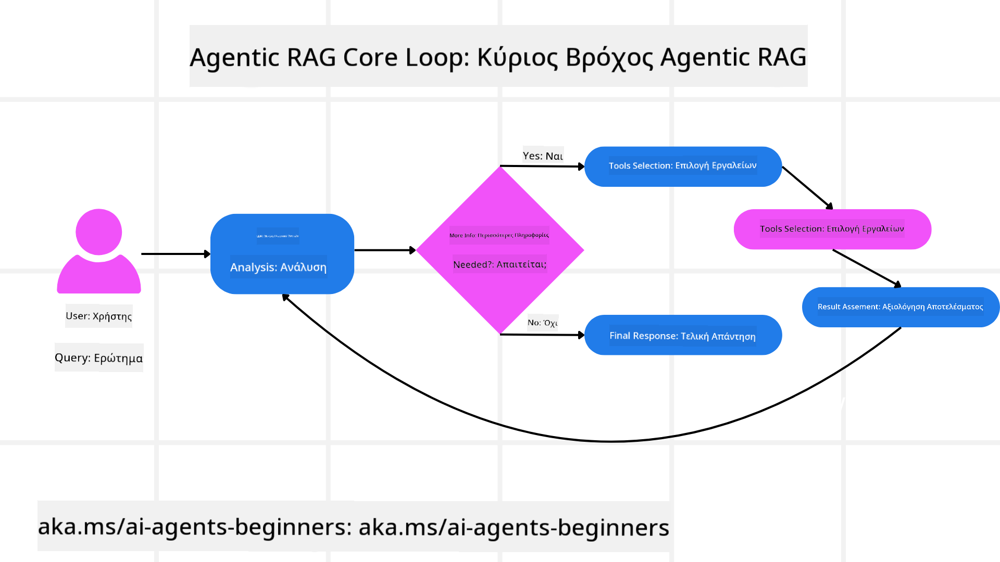
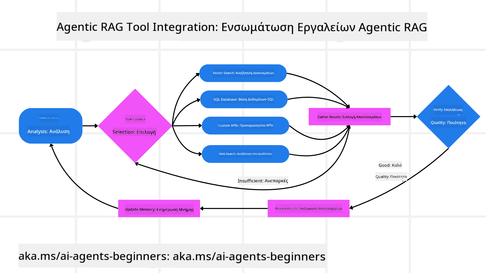
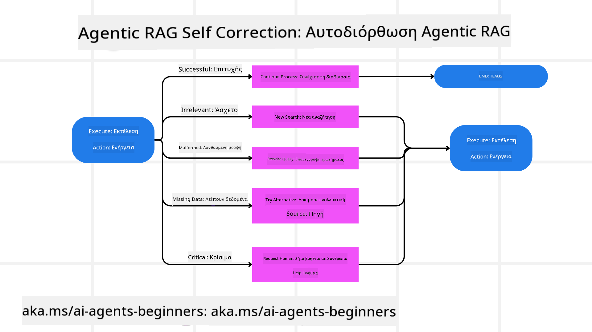

<!--
CO_OP_TRANSLATOR_METADATA:
{
  "original_hash": "0ebf6b2290db55dbf2d10cc49655523b",
  "translation_date": "2025-09-30T07:05:30+00:00",
  "source_file": "05-agentic-rag/README.md",
  "language_code": "el"
}
-->

> _(Κάντε κλικ στην εικόνα παραπάνω για να δείτε το βίντεο αυτού του μαθήματος)_

# Agentic RAG

Αυτό το μάθημα παρέχει μια ολοκληρωμένη επισκόπηση του Agentic Retrieval-Augmented Generation (Agentic RAG), ενός αναδυόμενου παραδείγματος AI όπου τα μεγάλα γλωσσικά μοντέλα (LLMs) σχεδιάζουν αυτόνομα τα επόμενα βήματά τους ενώ αντλούν πληροφορίες από εξωτερικές πηγές. Σε αντίθεση με τα στατικά μοτίβα ανάκτησης και ανάγνωσης, το Agentic RAG περιλαμβάνει επαναληπτικές κλήσεις στο LLM, διακοπτόμενες από κλήσεις εργαλείων ή λειτουργιών και δομημένα αποτελέσματα. Το σύστημα αξιολογεί τα αποτελέσματα, βελτιώνει τα ερωτήματα, ενεργοποιεί επιπλέον εργαλεία εάν χρειάζεται και συνεχίζει αυτόν τον κύκλο μέχρι να επιτευχθεί μια ικανοποιητική λύση.

## Εισαγωγή

Αυτό το μάθημα θα καλύψει:

- **Κατανόηση του Agentic RAG:** Μάθετε για το αναδυόμενο παραδείγμα AI όπου τα μεγάλα γλωσσικά μοντέλα (LLMs) σχεδιάζουν αυτόνομα τα επόμενα βήματά τους ενώ αντλούν πληροφορίες από εξωτερικές πηγές δεδομένων.
- **Κατανόηση του Επαναληπτικού Στυλ Maker-Checker:** Κατανοήστε τον κύκλο επαναληπτικών κλήσεων στο LLM, διακοπτόμενων από κλήσεις εργαλείων ή λειτουργιών και δομημένα αποτελέσματα, σχεδιασμένα για τη βελτίωση της ακρίβειας και τη διαχείριση εσφαλμένων ερωτημάτων.
- **Εξερεύνηση Πρακτικών Εφαρμογών:** Εντοπίστε σενάρια όπου το Agentic RAG διαπρέπει, όπως περιβάλλοντα που δίνουν προτεραιότητα στην ακρίβεια, σύνθετες αλληλεπιδράσεις βάσεων δεδομένων και εκτεταμένες ροές εργασίας.

## Στόχοι Μάθησης

Μετά την ολοκλήρωση αυτού του μαθήματος, θα γνωρίζετε πώς να/κατανοείτε:

- **Κατανόηση του Agentic RAG:** Μάθετε για το αναδυόμενο παραδείγμα AI όπου τα μεγάλα γλωσσικά μοντέλα (LLMs) σχεδιάζουν αυτόνομα τα επόμενα βήματά τους ενώ αντλούν πληροφορίες από εξωτερικές πηγές δεδομένων.
- **Επαναληπτικό Στυλ Maker-Checker:** Κατανοήστε την έννοια ενός κύκλου επαναληπτικών κλήσεων στο LLM, διακοπτόμενων από κλήσεις εργαλείων ή λειτουργιών και δομημένα αποτελέσματα, σχεδιασμένα για τη βελτίωση της ακρίβειας και τη διαχείριση εσφαλμένων ερωτημάτων.
- **Ανάληψη της Διαδικασίας Λογικής:** Κατανοήστε την ικανότητα του συστήματος να αναλαμβάνει τη διαδικασία λογικής του, λαμβάνοντας αποφάσεις για την προσέγγιση προβλημάτων χωρίς να βασίζεται σε προκαθορισμένα μονοπάτια.
- **Ροή Εργασίας:** Κατανοήστε πώς ένα agentic μοντέλο αποφασίζει ανεξάρτητα να ανακτήσει αναφορές τάσεων της αγοράς, να εντοπίσει δεδομένα ανταγωνιστών, να συσχετίσει εσωτερικές μετρήσεις πωλήσεων, να συνθέσει ευρήματα και να αξιολογήσει τη στρατηγική.
- **Επαναληπτικοί Κύκλοι, Ενσωμάτωση Εργαλείων και Μνήμη:** Μάθετε για την εξάρτηση του συστήματος από ένα μοτίβο αλληλεπίδρασης με κύκλους, διατηρώντας κατάσταση και μνήμη σε κάθε βήμα για να αποφύγει επαναλαμβανόμενους κύκλους και να λαμβάνει ενημερωμένες αποφάσεις.
- **Διαχείριση Τρόπων Αποτυχίας και Αυτοδιόρθωση:** Εξερευνήστε τους ισχυρούς μηχανισμούς αυτοδιόρθωσης του συστήματος, συμπεριλαμβανομένων επαναλήψεων και επανα-ερωτήσεων, χρήσης διαγνωστικών εργαλείων και προσφυγής σε ανθρώπινη εποπτεία.
- **Όρια της Αυτονομίας:** Κατανοήστε τους περιορισμούς του Agentic RAG, εστιάζοντας στην αυτονομία που περιορίζεται από το πεδίο εφαρμογής, την εξάρτηση από την υποδομή και τον σεβασμό στις δικλείδες ασφαλείας.
- **Πρακτικές Χρήσεις και Αξία:** Εντοπίστε σενάρια όπου το Agentic RAG διαπρέπει, όπως περιβάλλοντα που δίνουν προτεραιότητα στην ακρίβεια, σύνθετες αλληλεπιδράσεις βάσεων δεδομένων και εκτεταμένες ροές εργασίας.
- **Διακυβέρνηση, Διαφάνεια και Εμπιστοσύνη:** Μάθετε για τη σημασία της διακυβέρνησης και της διαφάνειας, συμπεριλαμβανομένης της εξηγήσιμης λογικής, του ελέγχου προκατάληψης και της ανθρώπινης εποπτείας.

## Τι είναι το Agentic RAG;

Το Agentic Retrieval-Augmented Generation (Agentic RAG) είναι ένα αναδυόμενο παραδείγμα AI όπου τα μεγάλα γλωσσικά μοντέλα (LLMs) σχεδιάζουν αυτόνομα τα επόμενα βήματά τους ενώ αντλούν πληροφορίες από εξωτερικές πηγές. Σε αντίθεση με τα στατικά μοτίβα ανάκτησης και ανάγνωσης, το Agentic RAG περιλαμβάνει επαναληπτικές κλήσεις στο LLM, διακοπτόμενες από κλήσεις εργαλείων ή λειτουργιών και δομημένα αποτελέσματα. Το σύστημα αξιολογεί τα αποτελέσματα, βελτιώνει τα ερωτήματα, ενεργοποιεί επιπλέον εργαλεία εάν χρειάζεται και συνεχίζει αυτόν τον κύκλο μέχρι να επιτευχθεί μια ικανοποιητική λύση. Αυτό το επαναληπτικό στυλ “maker-checker” βελτιώνει την ακρίβεια, διαχειρίζεται εσφαλμένα ερωτήματα και εξασφαλίζει υψηλής ποιότητας αποτελέσματα.

Το σύστημα αναλαμβάνει ενεργά τη διαδικασία λογικής του, ξαναγράφοντας αποτυχημένα ερωτήματα, επιλέγοντας διαφορετικές μεθόδους ανάκτησης και ενσωματώνοντας πολλαπλά εργαλεία—όπως αναζήτηση με διανύσματα στο Azure AI Search, βάσεις δεδομένων SQL ή προσαρμοσμένα APIs—πριν ολοκληρώσει την απάντησή του. Η διακριτική ποιότητα ενός agentic συστήματος είναι η ικανότητά του να αναλαμβάνει τη διαδικασία λογικής του. Οι παραδοσιακές υλοποιήσεις RAG βασίζονται σε προκαθορισμένα μονοπάτια, αλλά ένα agentic σύστημα καθορίζει αυτόνομα τη σειρά των βημάτων με βάση την ποιότητα των πληροφοριών που βρίσκει.

## Ορισμός του Agentic Retrieval-Augmented Generation (Agentic RAG)

Το Agentic Retrieval-Augmented Generation (Agentic RAG) είναι ένα αναδυόμενο παραδείγμα στην ανάπτυξη AI όπου τα LLMs όχι μόνο αντλούν πληροφορίες από εξωτερικές πηγές δεδομένων αλλά και σχεδιάζουν αυτόνομα τα επόμενα βήματά τους. Σε αντίθεση με τα στατικά μοτίβα ανάκτησης και ανάγνωσης ή τις προσεκτικά σχεδιασμένες ακολουθίες προτροπών, το Agentic RAG περιλαμβάνει έναν κύκλο επαναληπτικών κλήσεων στο LLM, διακοπτόμενων από κλήσεις εργαλείων ή λειτουργιών και δομημένα αποτελέσματα. Σε κάθε βήμα, το σύστημα αξιολογεί τα αποτελέσματα που έχει λάβει, αποφασίζει αν θα βελτιώσει τα ερωτήματα, ενεργοποιεί επιπλέον εργαλεία εάν χρειάζεται και συνεχίζει αυτόν τον κύκλο μέχρι να επιτύχει μια ικανοποιητική λύση.

Αυτό το επαναληπτικό στυλ “maker-checker” έχει σχεδιαστεί για να βελτιώνει την ακρίβεια, να διαχειρίζεται εσφαλμένα ερωτήματα σε δομημένες βάσεις δεδομένων (π.χ. NL2SQL) και να εξασφαλίζει ισορροπημένα, υψηλής ποιότητας αποτελέσματα. Αντί να βασίζεται αποκλειστικά σε προσεκτικά σχεδιασμένες αλυσίδες προτροπών, το σύστημα αναλαμβάνει ενεργά τη διαδικασία λογικής του. Μπορεί να ξαναγράψει ερωτήματα που αποτυγχάνουν, να επιλέξει διαφορετικές μεθόδους ανάκτησης και να ενσωματώσει πολλαπλά εργαλεία—όπως αναζήτηση με διανύσματα στο Azure AI Search, βάσεις δεδομένων SQL ή προσαρμοσμένα APIs—πριν ολοκληρώσει την απάντησή του. Αυτό εξαλείφει την ανάγκη για υπερβολικά περίπλοκα πλαίσια ορχήστρωσης. Αντίθετα, ένας σχετικά απλός κύκλος “κλήση LLM → χρήση εργαλείου → κλήση LLM → …” μπορεί να αποδώσει εξελιγμένα και καλά τεκμηριωμένα αποτελέσματα.

## Ανάληψη της Διαδικασίας Λογικής

Η διακριτική ποιότητα που κάνει ένα σύστημα “agentic” είναι η ικανότητά του να αναλαμβάνει τη διαδικασία λογικής του. Οι παραδοσιακές υλοποιήσεις RAG συχνά εξαρτώνται από ανθρώπους που προκαθορίζουν ένα μονοπάτι για το μοντέλο: μια αλυσίδα σκέψης που περιγράφει τι να ανακτήσει και πότε. 
Αλλά όταν ένα σύστημα είναι πραγματικά agentic, αποφασίζει εσωτερικά πώς να προσεγγίσει το πρόβλημα. Δεν εκτελεί απλώς ένα σενάριο· καθορίζει αυτόνομα τη σειρά των βημάτων με βάση την ποιότητα των πληροφοριών που βρίσκει. 
Για παράδειγμα, αν του ζητηθεί να δημιουργήσει μια στρατηγική λανσαρίσματος προϊόντος, δεν βασίζεται αποκλειστικά σε μια προτροπή που περιγράφει ολόκληρη τη διαδικασία έρευνας και λήψης αποφάσεων. Αντίθετα, το agentic μοντέλο αποφασίζει ανεξάρτητα να:

1. Ανακτήσει αναφορές τάσεων της αγοράς χρησιμοποιώντας Bing Web Grounding.
2. Εντοπίσει σχετικά δεδομένα ανταγωνιστών χρησιμοποιώντας Azure AI Search.
3. Συσχετίσει ιστορικές εσωτερικές μετρήσεις πωλήσεων χρησιμοποιώντας Azure SQL Database.
4. Συνθέσει τα ευρήματα σε μια συνεκτική στρατηγική οργανωμένη μέσω του Azure OpenAI Service.
5. Αξιολογήσει τη στρατηγική για κενά ή ασυνέπειες, ενεργοποιώντας έναν άλλο κύκλο ανάκτησης εάν χρειάζεται.

Όλα αυτά τα βήματα—βελτίωση ερωτημάτων, επιλογή πηγών, επανάληψη μέχρι να είναι “ικανοποιημένο” με την απάντηση—αποφασίζονται από το μοντέλο, όχι προκαθορισμένα από έναν άνθρωπο.

## Επαναληπτικοί Κύκλοι, Ενσωμάτωση Εργαλείων και Μνήμη

Ένα agentic σύστημα βασίζεται σε ένα μοτίβο αλληλεπίδρασης με κύκλους:

- **Αρχική Κλήση:** Ο στόχος του χρήστη (δηλ. η προτροπή του χρήστη) παρουσιάζεται στο LLM.
- **Ενεργοποίηση Εργαλείων:** Εάν το μοντέλο εντοπίσει ελλείπουσες πληροφορίες ή ασαφείς οδηγίες, επιλέγει ένα εργαλείο ή μέθοδο ανάκτησης—όπως ένα ερώτημα βάσης δεδομένων με διανύσματα (π.χ. Azure AI Search Hybrid search σε ιδιωτικά δεδομένα) ή μια δομημένη κλήση SQL—για να συγκεντρώσει περισσότερο πλαίσιο.
- **Αξιολόγηση & Βελτίωση:** Μετά την ανασκόπηση των δεδομένων που επιστράφηκαν, το μοντέλο αποφασίζει αν οι πληροφορίες επαρκούν. Εάν όχι, βελτιώνει το ερώτημα, δοκιμάζει διαφορετικό εργαλείο ή προσαρμόζει την προσέγγισή του.
- **Επανάληψη Μέχρι Ικανοποίησης:** Αυτός ο κύκλος συνεχίζεται μέχρι το μοντέλο να αποφασίσει ότι έχει αρκετή σαφήνεια και στοιχεία για να παραδώσει μια τελική, καλά τεκμηριωμένη απάντηση.
- **Μνήμη & Κατάσταση:** Επειδή το σύστημα διατηρεί κατάσταση και μνήμη σε κάθε βήμα, μπορεί να ανακαλέσει προηγούμενες προσπάθειες και τα αποτελέσματά τους, αποφεύγοντας επαναλαμβανόμενους κύκλους και λαμβάνοντας πιο ενημερωμένες αποφάσεις καθώς προχωρά.

Με την πάροδο του χρόνου, αυτό δημιουργεί μια αίσθηση εξελισσόμενης κατανόησης, επιτρέποντας στο μοντέλο να διαχειρίζεται σύνθετες, πολυβήματες εργασίες χωρίς να απαιτείται συνεχής παρέμβαση ή αναδιαμόρφωση της προτροπής από έναν άνθρωπο.

## Διαχείριση Τρόπων Αποτυχίας και Αυτοδιόρθωση

Η αυτονομία του Agentic RAG περιλαμβάνει επίσης ισχυρούς μηχανισμούς αυτοδιόρθωσης. Όταν το σύστημα συναντά αδιέξοδα—όπως την ανάκτηση άσχετων εγγράφων ή την αντιμετώπιση εσφαλμένων ερωτημάτων—μπορεί:

- **Επανάληψη και Επανα-Ερώτηση:** Αντί να επιστρέφει απαντήσεις χαμηλής αξίας, το μοντέλο δοκιμάζει νέες στρατηγικές αναζήτησης, ξαναγράφει ερωτήματα βάσεων δεδομένων ή εξετάζει εναλλακτικά σύνολα δεδομένων.
- **Χρήση Διαγνωστικών Εργαλείων:** Το σύστημα μπορεί να ενεργοποιήσει επιπλέον λειτουργίες σχεδιασμένες να το βοηθήσουν να εντοπίσει σφάλματα στα βήματα λογικής του ή να επιβεβαιώσει την ορθότητα των δεδομένων που ανακτήθηκαν. Εργαλεία όπως το Azure AI Tracing θα είναι σημαντικά για την παροχή ισχυρής παρατηρησιμότητας και παρακολούθησης.
- **Προσφυγή σε Ανθρώπινη Εποπτεία:** Για σενάρια υψηλού κινδύνου ή επανειλημμένα αποτυχημένα, το μοντέλο μπορεί να επισημάνει αβεβαιότητα και να ζητήσει καθοδήγηση από έναν άνθρωπο. Μόλις ο άνθρωπος παρέχει διορθωτική ανατροφοδότηση, το μοντέλο μπορεί να ενσωματώσει αυτό το μάθημα στο μέλλον.

Αυτή η επαναληπτική και δυναμική προσέγγιση επιτρέπει στο μοντέλο να βελτιώνεται συνεχώς, εξασφαλίζοντας ότι δεν είναι απλώς ένα σύστημα μιας χρήσης αλλά ένα που μαθαίνει από τα λάθη του κατά τη διάρκεια μιας δεδομένης συνεδρίας.

## Όρια της Αυτονομίας

Παρά την αυτονομία του εντός μιας εργασίας, το Agentic RAG δεν είναι ανάλογο με τη Γενική Τεχνητή Νοημοσύνη. Οι “agentic” δυνατότητές του περιορίζονται στα εργαλεία, τις πηγές δεδομένων και τις πολιτικές που παρέχονται από τους ανθρώπινους προγραμματιστές. Δεν μπορεί να εφεύρει τα δικά του εργαλεία ή να υπερβεί τα όρια του πεδίου εφαρμογής που έχουν τεθεί. Αντίθετα, διαπρέπει στη δυναμική οργάνωση των διαθέσιμων πόρων.

Οι βασικές διαφορές από πιο προηγμένες μορφές AI περιλαμβάνουν:

1. **Αυτονομία Ειδική για το Πεδίο:** Τα συστήματα Agentic RAG επικεντρώνονται στην επίτευξη στόχων που έχουν οριστεί από τον χρήστη εντός ενός γνωστού πεδίου, χρησιμοποιώντας στρατηγικές όπως η επαναγραφή ερωτημάτων ή η επιλογή εργαλείων για τη βελτίωση των αποτελεσμάτων.
2. **Εξάρτηση από την Υποδομή:** Οι δυνατότητες του συστήματος εξαρτώνται από τα εργαλεία και τα δεδομένα που έχουν ενσωματωθεί από τους προγραμματιστές. Δεν μπορεί να υπερβεί αυτά τα όρια χωρίς ανθρώπι
- <a href="https://ragaboutit.com/agentic-rag-a-complete-guide-to-agent-based-retrieval-augmented-generation/" target="_blank">Agentic RAG: Ολοκληρωμένος Οδηγός για την Ανάκτηση και Ενισχυμένη Γενετική με Βάση Πράκτορες – Νέα από το generation RAG</a>
- <a href="https://huggingface.co/learn/cookbook/agent_rag" target="_blank">Agentic RAG: Ενισχύστε το RAG σας με αναδιαμόρφωση ερωτήσεων και αυτο-ερωτήσεις! Hugging Face Open-Source AI Cookbook</a>
- <a href="https://youtu.be/aQ4yQXeB1Ss?si=2HUqBzHoeB5tR04U" target="_blank">Προσθήκη Επίπεδων Πρακτόρων στο RAG</a>
- <a href="https://www.youtube.com/watch?v=zeAyuLc_f3Q&t=244s" target="_blank">Το Μέλλον των Βοηθών Γνώσης: Jerry Liu</a>
- <a href="https://www.youtube.com/watch?v=AOSjiXP1jmQ" target="_blank">Πώς να Δημιουργήσετε Συστήματα Agentic RAG</a>
- <a href="https://ignite.microsoft.com/sessions/BRK102?source=sessions" target="_blank">Χρήση της Υπηρεσίας Agent του Azure AI Foundry για την κλιμάκωση των πρακτόρων AI</a>

### Ακαδημαϊκές Εργασίες

- <a href="https://arxiv.org/abs/2303.17651" target="_blank">2303.17651 Self-Refine: Επαναληπτική Βελτίωση με Αυτο-Ανατροφοδότηση</a>
- <a href="https://arxiv.org/abs/2303.11366" target="_blank">2303.11366 Reflexion: Γλωσσικοί Πράκτορες με Ενίσχυση Μάθησης μέσω Λεκτικής Ενίσχυσης</a>
- <a href="https://arxiv.org/abs/2305.11738" target="_blank">2305.11738 CRITIC: Τα Μεγάλα Γλωσσικά Μοντέλα Μπορούν να Αυτοδιορθώνονται με Κριτική μέσω Εργαλείων</a>
- <a href="https://arxiv.org/abs/2501.09136" target="_blank">2501.09136 Agentic Retrieval-Augmented Generation: Μια Έρευνα για το Agentic RAG</a>

## Προηγούμενο Μάθημα

[Σχεδιαστικό Μοτίβο Χρήσης Εργαλείων](../04-tool-use/README.md)

## Επόμενο Μάθημα

[Δημιουργία Αξιόπιστων Πρακτόρων AI](../06-building-trustworthy-agents/README.md)

---

**Αποποίηση ευθύνης**:  
Αυτό το έγγραφο έχει μεταφραστεί χρησιμοποιώντας την υπηρεσία αυτόματης μετάφρασης [Co-op Translator](https://github.com/Azure/co-op-translator). Παρόλο που καταβάλλουμε προσπάθειες για ακρίβεια, παρακαλούμε να έχετε υπόψη ότι οι αυτόματες μεταφράσεις ενδέχεται να περιέχουν σφάλματα ή ανακρίβειες. Το πρωτότυπο έγγραφο στη μητρική του γλώσσα θα πρέπει να θεωρείται η αυθεντική πηγή. Για κρίσιμες πληροφορίες, συνιστάται επαγγελματική ανθρώπινη μετάφραση. Δεν φέρουμε ευθύνη για τυχόν παρεξηγήσεις ή εσφαλμένες ερμηνείες που προκύπτουν από τη χρήση αυτής της μετάφρασης.