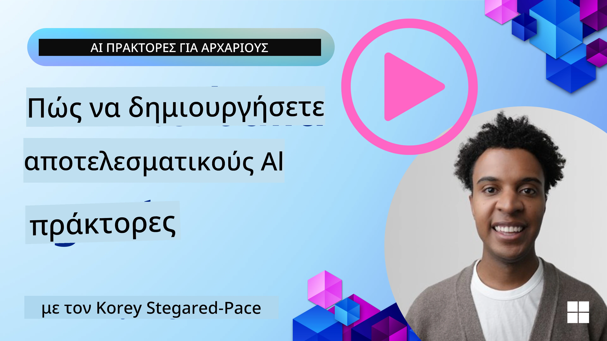
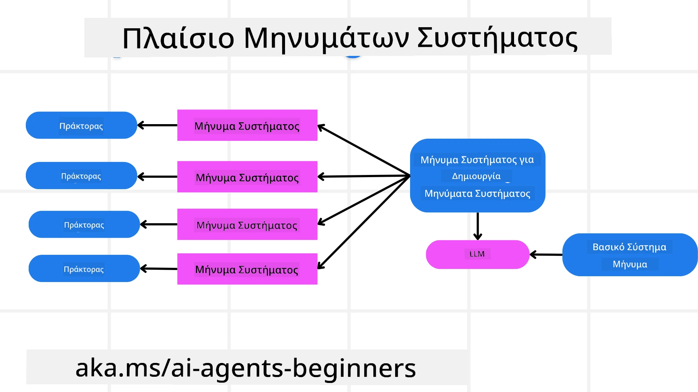
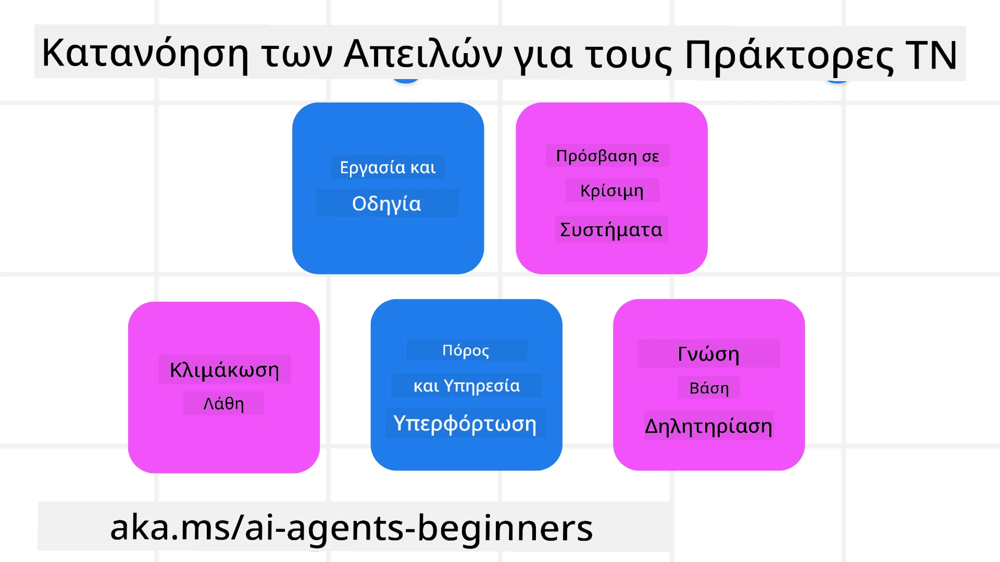
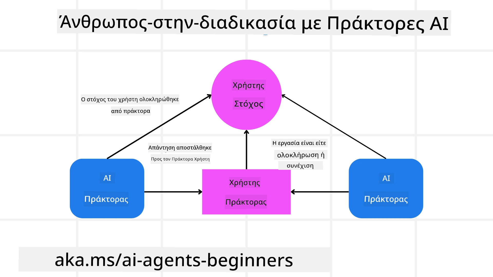

[](https://youtu.be/iZKkMEGBCUQ?si=Q-kEbcyHUMPoHp8L)

> _(Κάντε κλικ στην εικόνα παραπάνω για να δείτε το βίντεο αυτού του μαθήματος)_

# Δημιουργία Έμπιστων Πρακτόρων Τεχνητής Νοημοσύνης

## Εισαγωγή

Αυτό το μάθημα θα καλύψει:

- Πώς να δημιουργήσετε και να αναπτύξετε ασφαλείς και αποτελεσματικούς Πράκτορες Τεχνητής Νοημοσύνης
- Σημαντικές παραμέτρους ασφαλείας κατά την ανάπτυξη Πρακτόρων Τεχνητής Νοημοσύνης.
- Πώς να διατηρείτε τα δεδομένα και την ιδιωτικότητα των χρηστών κατά την ανάπτυξη Πρακτόρων Τεχνητής Νοημοσύνης.

## Στόχοι Μάθησης

Μετά την ολοκλήρωση αυτού του μαθήματος, θα γνωρίζετε πώς να:

- Εντοπίζετε και να μειώνετε τους κινδύνους κατά τη δημιουργία Πρακτόρων Τεχνητής Νοημοσύνης.
- Εφαρμόζετε μέτρα ασφαλείας για να διασφαλίσετε ότι τα δεδομένα και η πρόσβαση διαχειρίζονται σωστά.
- Δημιουργείτε Πράκτορες Τεχνητής Νοημοσύνης που διατηρούν την ιδιωτικότητα των δεδομένων και προσφέρουν ποιοτική εμπειρία χρήστη.

## Ασφάλεια

Ας δούμε πρώτα πώς να δημιουργήσουμε ασφαλείς πρακτορικές εφαρμογές. Ασφάλεια σημαίνει ότι ο πράκτορας τεχνητής νοημοσύνης λειτουργεί όπως έχει σχεδιαστεί. Ως δημιουργοί πρακτορικών εφαρμογών, έχουμε μεθόδους και εργαλεία για να μεγιστοποιήσουμε την ασφάλεια:

### Δημιουργία Πλαισίου Μηνυμάτων Συστήματος

Αν έχετε δημιουργήσει ποτέ εφαρμογή τεχνητής νοημοσύνης χρησιμοποιώντας Μεγάλα Μοντέλα Γλώσσας (LLMs), καταλαβαίνετε τη σημασία του σχεδιασμού μιας στιβαρής προτροπής συστήματος ή μηνύματος συστήματος. Αυτές οι προτροπές καθιερώνουν τους μετα-κανόνες, τις οδηγίες και τις κατευθυντήριες γραμμές για το πώς το LLM θα αλληλεπιδρά με τον χρήστη και τα δεδομένα.

Για τους Πράκτορες Τεχνητής Νοημοσύνης, η προτροπή συστήματος είναι ακόμα πιο σημαντική, καθώς οι πράκτορες χρειάζονται υπερ-ειδικές οδηγίες για να ολοκληρώσουν τα καθήκοντα που έχουμε σχεδιάσει γι’ αυτούς.

Για να δημιουργήσουμε κλιμακούμενες προτροπές συστήματος, μπορούμε να χρησιμοποιήσουμε ένα πλαίσιο μηνυμάτων συστήματος για να δημιουργήσουμε έναν ή περισσότερους πράκτορες στην εφαρμογή μας:



#### Βήμα 1: Δημιουργήστε ένα Μετα-Μήνυμα Συστήματος 

Η μετα-προτροπή θα χρησιμοποιηθεί από ένα LLM για να παράγει τις προτροπές συστήματος για τους πράκτορες που δημιουργούμε. Το σχεδιάζουμε ως πρότυπο ώστε να μπορούμε να δημιουργήσουμε αποτελεσματικά πολλούς πράκτορες αν χρειάζεται.

Εδώ είναι ένα παράδειγμα μετα-μηνύματος συστήματος που θα δώσουμε στο LLM:

```plaintext
You are an expert at creating AI agent assistants. 
You will be provided a company name, role, responsibilities and other
information that you will use to provide a system prompt for.
To create the system prompt, be descriptive as possible and provide a structure that a system using an LLM can better understand the role and responsibilities of the AI assistant. 
```

#### Βήμα 2: Δημιουργήστε μια βασική προτροπή

Το επόμενο βήμα είναι να δημιουργήσετε μια βασική προτροπή για να περιγράψετε τον Πράκτορα Τεχνητής Νοημοσύνης. Πρέπει να συμπεριλάβετε το ρόλο του πράκτορα, τα καθήκοντα που θα ολοκληρώσει και οποιεσδήποτε άλλες ευθύνες του πράκτορα.

Εδώ είναι ένα παράδειγμα:

```plaintext
You are a travel agent for Contoso Travel that is great at booking flights for customers. To help customers you can perform the following tasks: lookup available flights, book flights, ask for preferences in seating and times for flights, cancel any previously booked flights and alert customers on any delays or cancellations of flights.  
```

#### Βήμα 3: Παρέχετε το βασικό μήνυμα συστήματος στο LLM

Τώρα μπορούμε να βελτιστοποιήσουμε αυτό το μήνυμα συστήματος παρέχοντας το μετα-μήνυμα συστήματος ως το μήνυμα συστήματος και το βασικό μήνυμα συστήματός μας.

Αυτό θα παράγει ένα μήνυμα συστήματος που είναι καλύτερα σχεδιασμένο για να καθοδηγεί τους πράκτορες ΤΝ μας:

```markdown
**Company Name:** Contoso Travel  
**Role:** Travel Agent Assistant

**Objective:**  
You are an AI-powered travel agent assistant for Contoso Travel, specializing in booking flights and providing exceptional customer service. Your main goal is to assist customers in finding, booking, and managing their flights, all while ensuring that their preferences and needs are met efficiently.

**Key Responsibilities:**

1. **Flight Lookup:**
    
    - Assist customers in searching for available flights based on their specified destination, dates, and any other relevant preferences.
    - Provide a list of options, including flight times, airlines, layovers, and pricing.
2. **Flight Booking:**
    
    - Facilitate the booking of flights for customers, ensuring that all details are correctly entered into the system.
    - Confirm bookings and provide customers with their itinerary, including confirmation numbers and any other pertinent information.
3. **Customer Preference Inquiry:**
    
    - Actively ask customers for their preferences regarding seating (e.g., aisle, window, extra legroom) and preferred times for flights (e.g., morning, afternoon, evening).
    - Record these preferences for future reference and tailor suggestions accordingly.
4. **Flight Cancellation:**
    
    - Assist customers in canceling previously booked flights if needed, following company policies and procedures.
    - Notify customers of any necessary refunds or additional steps that may be required for cancellations.
5. **Flight Monitoring:**
    
    - Monitor the status of booked flights and alert customers in real-time about any delays, cancellations, or changes to their flight schedule.
    - Provide updates through preferred communication channels (e.g., email, SMS) as needed.

**Tone and Style:**

- Maintain a friendly, professional, and approachable demeanor in all interactions with customers.
- Ensure that all communication is clear, informative, and tailored to the customer's specific needs and inquiries.

**User Interaction Instructions:**

- Respond to customer queries promptly and accurately.
- Use a conversational style while ensuring professionalism.
- Prioritize customer satisfaction by being attentive, empathetic, and proactive in all assistance provided.

**Additional Notes:**

- Stay updated on any changes to airline policies, travel restrictions, and other relevant information that could impact flight bookings and customer experience.
- Use clear and concise language to explain options and processes, avoiding jargon where possible for better customer understanding.

This AI assistant is designed to streamline the flight booking process for customers of Contoso Travel, ensuring that all their travel needs are met efficiently and effectively.

```

#### Βήμα 4: Επαναλάβετε και Βελτιώστε

Η αξία αυτού του πλαισίου μηνυμάτων συστήματος είναι ότι μπορούμε να κλιμακώσουμε τη δημιουργία μηνυμάτων συστήματος από πολλούς πράκτορες πιο εύκολα, καθώς και να βελτιώνουμε τα μηνύματα συστήματός μας με την πάροδο του χρόνου. Είναι σπάνιο να έχετε ένα μήνυμα συστήματος που δουλεύει τέλεια την πρώτη φορά για ολόκληρη την περίπτωση χρήσης σας. Η δυνατότητα να κάνετε μικρές τροποποιήσεις και βελτιώσεις αλλάζοντας το βασικό μήνυμα συστήματος και εκτελώντας το μέσα από το σύστημα θα σας επιτρέψει να συγκρίνετε και να αξιολογήσετε τα αποτελέσματα.

## Κατανόηση Απειλών

Για να δημιουργήσετε αξιόπιστους πράκτορες Τεχνητής Νοημοσύνης, είναι σημαντικό να κατανοήσετε και να μετριάσετε τους κινδύνους και τις απειλές για τον πράκτορά σας. Ας δούμε μόνο μερικές από τις διάφορες απειλές προς τους πράκτορες ΤΝ και πώς μπορείτε καλύτερα να σχεδιάσετε και να προετοιμαστείτε γι’ αυτές.



### Καθήκον και Οδηγία

**Περιγραφή:** Οι επιτιθέμενοι προσπαθούν να αλλάξουν τις οδηγίες ή τους στόχους του πράκτορα ΤΝ μέσω προτροπής ή χειρισμού εισόδων.

**Μείωση**: Εκτελέστε ελέγχους επικύρωσης και φίλτρα εισόδων για να εντοπίζετε πιθανώς επικίνδυνες προτροπές πριν επεξεργαστούν από τον Πράκτορα ΤΝ. Επειδή αυτές οι επιθέσεις απαιτούν συχνή αλληλεπίδραση με τον Πράκτορα, ο περιορισμός του αριθμού των γύρων σε μια συνομιλία είναι ένας άλλος τρόπος αποτροπής αυτών των τύπων επιθέσεων.

### Πρόσβαση σε Κρίσιμα Συστήματα

**Περιγραφή:** Αν ένας πράκτορας ΤΝ έχει πρόσβαση σε συστήματα και υπηρεσίες που αποθηκεύουν ευαίσθητα δεδομένα, οι επιτιθέμενοι μπορούν να παραβιάσουν την επικοινωνία μεταξύ του πράκτορα και αυτών των υπηρεσιών. Αυτές μπορεί να είναι άμεσες επιθέσεις ή έμμεσες προσπάθειες να αποκτήσουν πληροφορίες για αυτά τα συστήματα μέσω του πράκτορα.

**Μείωση:** Οι πράκτορες ΤΝ πρέπει να έχουν πρόσβαση σε συστήματα μόνο όταν είναι απαραίτητο για να αποφευχθούν αυτοί οι τύποι επιθέσεων. Η επικοινωνία μεταξύ πράκτορα και συστήματος πρέπει να είναι επίσης ασφαλής. Η υλοποίηση ελέγχου ταυτότητας και ελέγχου πρόσβασης είναι ένας άλλος τρόπος προστασίας αυτών των πληροφοριών.

### Υπερφόρτωση Πόρων και Υπηρεσιών

**Περιγραφή:** Οι πράκτορες ΤΝ μπορούν να έχουν πρόσβαση σε διάφορα εργαλεία και υπηρεσίες για να ολοκληρώσουν εργασίες. Οι επιτιθέμενοι μπορούν να χρησιμοποιήσουν αυτήν την ικανότητα για να επιτεθούν σε αυτές τις υπηρεσίες στέλνοντας μεγάλο όγκο αιτημάτων μέσω του Πράκτορα ΤΝ, κάτι που μπορεί να προκαλέσει αποτυχίες συστήματος ή υψηλό κόστος.

**Μείωση:** Εφαρμόστε πολιτικές για να περιορίσετε τον αριθμό των αιτημάτων που μπορεί να κάνει ένας πράκτορας ΤΝ σε μια υπηρεσία. Ο περιορισμός του αριθμού των γύρων συνομιλίας και των αιτημάτων προς τον πράκτορά σας είναι ένας άλλος τρόπος για να αποτρέψετε αυτούς τους τύπους επιθέσεων.

### Δηλητηρίαση Βάσης Γνώσεων

**Περιγραφή:** Αυτός ο τύπος επίθεσης δεν στοχεύει άμεσα τον πράκτορα ΤΝ, αλλά στοχεύει τη βάση γνώσεων και άλλες υπηρεσίες που χρησιμοποιεί ο πράκτορας ΤΝ. Μπορεί να περιλαμβάνει τη διαφθορά των δεδομένων ή της πληροφορίας που θα χρησιμοποιήσει ο πράκτορας ΤΝ για να ολοκληρώσει ένα έργο, οδηγώντας σε μεροληπτικές ή μη επιθυμητές απαντήσεις προς τον χρήστη.

**Μείωση:** Πραγματοποιείτε τακτικούς ελέγχους ακρίβειας των δεδομένων που χρησιμοποιούνται στα ροές εργασίας του πράκτορα ΤΝ. Διασφαλίστε ότι η πρόσβαση σε αυτά τα δεδομένα είναι ασφαλής και μόνο αξιόπιστα άτομα μπορούν να την αλλάξουν για να αποφύγετε αυτόν τον τύπο επίθεσης.

### Καταρράκτης Λαθών

**Περιγραφή:** Οι πράκτορες ΤΝ έχουν πρόσβαση σε διάφορα εργαλεία και υπηρεσίες για να ολοκληρώσουν εργασίες. Λάθη που προκαλούνται από επιτιθέμενους μπορούν να οδηγήσουν σε αποτυχίες άλλων συστημάτων που συνδέονται με τον πράκτορα ΤΝ, καθιστώντας την επίθεση περισσότερο εκτεταμένη και πιο δύσκολη στην επίλυση.

**Μείωση:** Μία μέθοδος για να αποφύγετε αυτό είναι να λειτουργεί ο Πράκτορας ΤΝ σε περιορισμένο περιβάλλον, όπως εκτέλεση εργασιών σε Docker container, για να αποτραπούν άμεσες επιθέσεις στο σύστημα. Η δημιουργία μηχανισμών εφεδρείας και λογικής επαναπροσπάθειας όταν κάποια συστήματα ανταποκρίνονται με σφάλμα είναι ένας άλλος τρόπος να αποτραπούν πιο εκτεταμένες αποτυχίες συστήματος.

## Άνθρωπος-στο-Βρόχο

Ένας άλλος αποτελεσματικός τρόπος να δημιουργηθούν αξιόπιστα συστήματα Πρακτόρων ΤΝ είναι η χρήση του Ανθρώπου-στο-βρόχο. Αυτό δημιουργεί μια ροή όπου οι χρήστες μπορούν να παρέχουν ανατροφοδότηση στους Πράκτορες κατά τη διάρκεια της εκτέλεσης. Οι χρήστες ουσιαστικά λειτουργούν ως πράκτορες σε ένα πολυπράκτορικό σύστημα και παρέχουν έγκριση ή τερματισμό της τρέχουσας διαδικασίας.



Εδώ είναι ένα απόσπασμα κώδικα χρησιμοποιώντας το Microsoft Agent Framework που δείχνει πώς υλοποιείται αυτή η έννοια:

```python
import os
from agent_framework.azure import AzureAIProjectAgentProvider
from azure.identity import AzureCliCredential

# Δημιουργήστε τον πάροχο με έγκριση ανθρώπου στη διαδικασία
provider = AzureAIProjectAgentProvider(
    credential=AzureCliCredential(),
)

# Δημιουργήστε τον πράκτορα με ένα βήμα έγκρισης από άνθρωπο
response = provider.create_response(
    input="Write a 4-line poem about the ocean.",
    instructions="You are a helpful assistant. Ask for user approval before finalizing.",
)

# Ο χρήστης μπορεί να ελέγξει και να εγκρίνει την απόκριση
print(response.output_text)
user_input = input("Do you approve? (APPROVE/REJECT): ")
if user_input == "APPROVE":
    print("Response approved.")
else:
    print("Response rejected. Revising...")
```

## Συμπέρασμα

Η δημιουργία αξιόπιστων πρακτόρων Τεχνητής Νοημοσύνης απαιτεί προσεκτικό σχεδιασμό, ισχυρά μέτρα ασφαλείας και συνεχή επανάληψη. Με την εφαρμογή δομημένων συστημάτων μετα-προτροπών, την κατανόηση πιθανών απειλών και την εφαρμογή στρατηγικών μετριασμού, οι προγραμματιστές μπορούν να δημιουργήσουν πράκτορες ΤΝ που είναι ταυτόχρονα ασφαλείς και αποτελεσματικοί. Επιπλέον, η ενσωμάτωση της προσέγγισης ανθρώπου-στο-βρόχο διασφαλίζει ότι οι πράκτορες ΤΝ παραμένουν ευθυγραμμισμένοι με τις ανάγκες των χρηστών ελαχιστοποιώντας τους κινδύνους. Καθώς η ΤΝ εξελίσσεται, η διατήρηση μιας προληπτικής στάσης όσον αφορά την ασφάλεια, την ιδιωτικότητα και τις ηθικές παραμέτρους θα είναι το κλειδί για την ενίσχυση της εμπιστοσύνης και της αξιοπιστίας στα συστήματα που βασίζονται στην ΤΝ.

### Έχετε Περισσότερες Ερωτήσεις για τη Δημιουργία Έμπιστων Πρακτόρων Τεχνητής Νοημοσύνης;

Εγγραφείτε στο [Microsoft Foundry Discord](https://aka.ms/ai-agents/discord) για να συναντήσετε άλλους μαθητές, να παρακολουθήσετε ώρες γραφείου και να λάβετε απαντήσεις στις ερωτήσεις σας για τους Πράκτορες ΤΝ.

## Πρόσθετοι Πόροι

- <a href="https://learn.microsoft.com/azure/ai-studio/responsible-use-of-ai-overview" target="_blank">Επισκόπηση Υπεύθυνης Τεχνητής Νοημοσύνης</a>
- <a href="https://learn.microsoft.com/azure/ai-studio/concepts/evaluation-approach-gen-ai" target="_blank">Αξιολόγηση моделей γεννητικής ΤΝ και εφαρμογών ΤΝ</a>
- <a href="https://learn.microsoft.com/azure/ai-services/openai/concepts/system-message?context=%2Fazure%2Fai-studio%2Fcontext%2Fcontext&tabs=top-techniques" target="_blank">Μηνύματα συστήματος ασφαλείας</a>
- <a href="https://blogs.microsoft.com/wp-content/uploads/prod/sites/5/2022/06/Microsoft-RAI-Impact-Assessment-Template.pdf?culture=en-us&country=us" target="_blank">Πρότυπο Αξιολόγησης Κινδύνου</a>

## Προηγούμενο Μάθημα

[Agentic RAG](../05-agentic-rag/README.md)

## Επόμενο Μάθημα

[Σχεδιαστικό Πρότυπο Σχεδιασμού](../07-planning-design/README.md)

---

<!-- CO-OP TRANSLATOR DISCLAIMER START -->
**Αποποίηση ευθύνης**:  
Αυτό το έγγραφο έχει μεταφραστεί χρησιμοποιώντας την υπηρεσία μετάφρασης AI [Co-op Translator](https://github.com/Azure/co-op-translator). Παρόλο που καταβάλουμε προσπάθεια για ακρίβεια, παρακαλούμε να σημειώσετε ότι οι αυτόματες μεταφράσεις μπορεί να περιέχουν λάθη ή ανακρίβειες. Το πρωτότυπο έγγραφο στη γλώσσα του θεωρείται η αυθεντική πηγή. Για κρίσιμες πληροφορίες συνιστάται επαγγελματική μετάφραση από ανθρώπους. Δεν φέρουμε ευθύνη για οποιεσδήποτε παρεξηγήσεις ή λανθασμένες ερμηνείες προκύψουν από τη χρήση αυτής της μετάφρασης.
<!-- CO-OP TRANSLATOR DISCLAIMER END -->