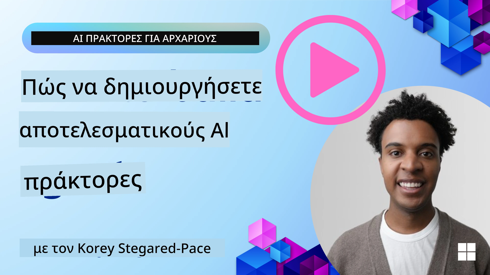
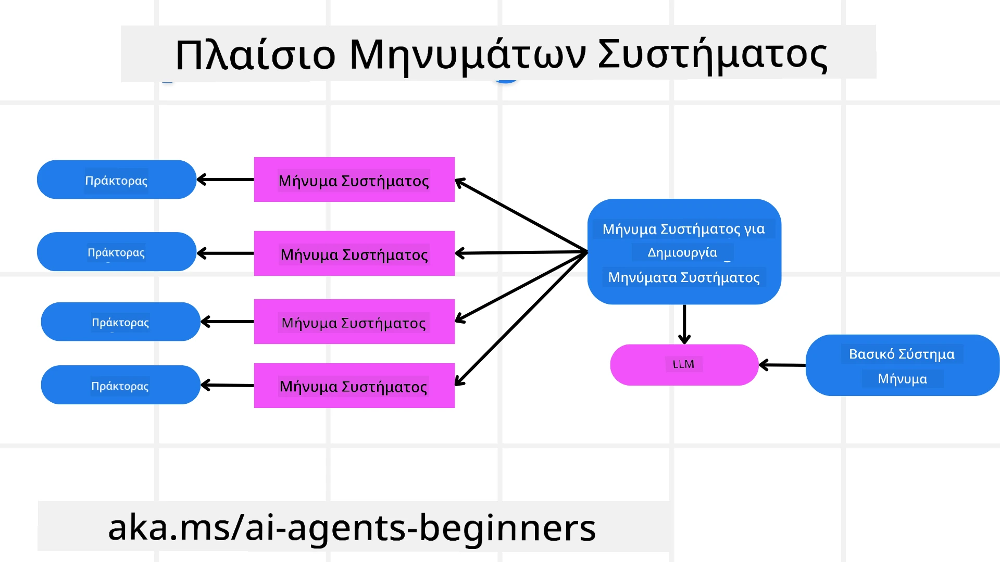
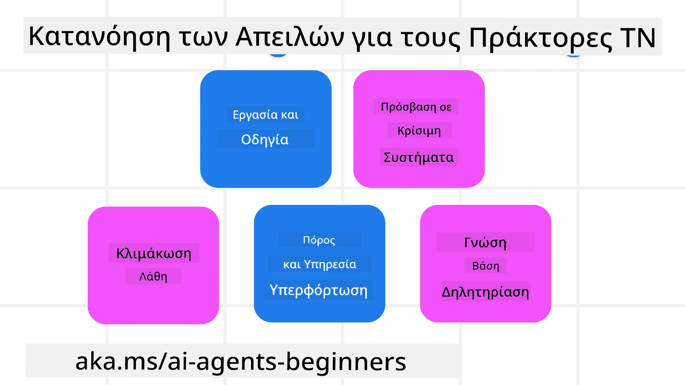
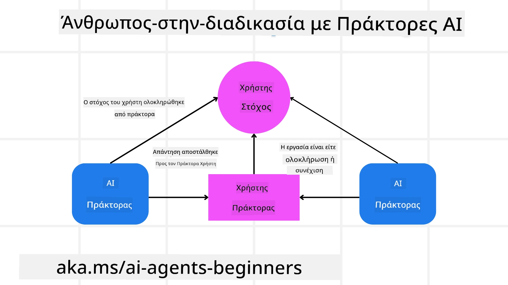

[](https://youtu.be/iZKkMEGBCUQ?si=Q-kEbcyHUMPoHp8L)

> _(Κάντε κλικ στην εικόνα παραπάνω για να δείτε το βίντεο αυτού του μαθήματος)_

# Δημιουργία Αξιόπιστων Πρακτόρων Τεχνητής Νοημοσύνης

## Εισαγωγή

Αυτό το μάθημα θα καλύψει:

- Πώς να δημιουργήσετε και να αναπτύξετε ασφαλείς και αποτελεσματικούς Πράκτορες Τεχνητής Νοημοσύνης
- Σημαντικές παραμέτρους ασφάλειας κατά την ανάπτυξη Πρακτόρων Τεχνητής Νοημοσύνης.
- Πώς να διατηρείτε το απόρρητο δεδομένων και των χρηστών κατά την ανάπτυξη Πρακτόρων Τεχνητής Νοημοσύνης.

## Στόχοι Μάθησης

Μετά την ολοκλήρωση αυτού του μαθήματος, θα ξέρετε πώς να:

- Αναγνωρίζετε και να μετριάζετε κινδύνους κατά τη δημιουργία Πρακτόρων Τεχνητής Νοημοσύνης.
- Εφαρμόζετε μέτρα ασφάλειας για να διασφαλίζετε τη σωστή διαχείριση δεδομένων και πρόσβασης.
- Δημιουργείτε Πράκτορες Τεχνητής Νοημοσύνης που διατηρούν το απόρρητο των δεδομένων και προσφέρουν μια ποιοτική εμπειρία χρήστη.

## Ασφάλεια

Αρχικά, ας δούμε τη δημιουργία ασφαλών εφαρμογών πρακτόρων. Ασφάλεια σημαίνει ότι ο πράκτορας Τεχνητής Νοημοσύνης λειτουργεί όπως έχει σχεδιαστεί. Ως δημιουργοί εφαρμογών πρακτόρων, έχουμε μεθόδους και εργαλεία για να μεγιστοποιήσουμε την ασφάλεια:

### Δημιουργία Πλαισίου Μηνύματος Συστήματος

Εάν έχετε ποτέ δημιουργήσει μια εφαρμογή Τεχνητής Νοημοσύνης χρησιμοποιώντας Μεγάλα Μοντέλα Γλώσσας (LLMs), γνωρίζετε τη σημασία του σχεδιασμού ενός ισχυρού συστήματος prompt ή μηνύματος συστήματος. Αυτά τα prompts καθορίζουν τους μετακανόνες, τις οδηγίες και τις κατευθυντήριες γραμμές για το πώς το LLM θα αλληλεπιδρά με τον χρήστη και τα δεδομένα.

Για τους Πράκτορες Τεχνητής Νοημοσύνης, το prompt συστήματος είναι ακόμη πιο σημαντικό καθώς οι πράκτορες θα χρειαστούν πολύ συγκεκριμένες οδηγίες για να ολοκληρώσουν τις εργασίες που έχουμε σχεδιάσει για αυτούς.

Για να δημιουργήσουμε επεκτάσιμα system prompts, μπορούμε να χρησιμοποιήσουμε ένα πλαίσιο μηνύματος συστήματος για να κατασκευάσουμε έναν ή περισσότερους πράκτορες στην εφαρμογή μας:



#### Βήμα 1: Δημιουργία ενός Μετα-Μηνύματος Συστήματος

Το μετα-prompt θα χρησιμοποιηθεί από ένα LLM για να παράγει τα system prompts για τους πράκτορες που δημιουργούμε. Το σχεδιάζουμε ως πρότυπο έτσι ώστε να μπορούμε να δημιουργήσουμε πολλούς πράκτορες αποτελεσματικά, εάν χρειαστεί.

Εδώ είναι ένα παράδειγμα μετα-μηνύματος συστήματος που θα δώσουμε στο LLM:

```plaintext
You are an expert at creating AI agent assistants. 
You will be provided a company name, role, responsibilities and other
information that you will use to provide a system prompt for.
To create the system prompt, be descriptive as possible and provide a structure that a system using an LLM can better understand the role and responsibilities of the AI assistant. 
```

#### Βήμα 2: Δημιουργία ενός βασικού prompt

Το επόμενο βήμα είναι να δημιουργήσετε ένα βασικό prompt για να περιγράψετε τον Πράκτορα Τεχνητής Νοημοσύνης. Πρέπει να συμπεριλάβετε τον ρόλο του πράκτορα, τις εργασίες που θα ολοκληρώσει, και οποιεσδήποτε άλλες ευθύνες του πράκτορα.

Εδώ είναι ένα παράδειγμα:

```plaintext
You are a travel agent for Contoso Travel that is great at booking flights for customers. To help customers you can perform the following tasks: lookup available flights, book flights, ask for preferences in seating and times for flights, cancel any previously booked flights and alert customers on any delays or cancellations of flights.  
```

#### Βήμα 3: Παροχή Βασικού Μηνύματος Συστήματος στο LLM

Τώρα μπορούμε να βελτιστοποιήσουμε αυτό το μήνυμα συστήματος παρέχοντας το μετα-μήνυμα συστήματος ως το μήνυμα συστήματος, μαζί με το βασικό μας μήνυμα συστήματος.

Αυτό θα παράγει ένα μήνυμα συστήματος που είναι καλύτερα σχεδιασμένο για την καθοδήγηση των πρακτόρων Τεχνητής Νοημοσύνης:

```markdown
**Company Name:** Contoso Travel  
**Role:** Travel Agent Assistant

**Objective:**  
You are an AI-powered travel agent assistant for Contoso Travel, specializing in booking flights and providing exceptional customer service. Your main goal is to assist customers in finding, booking, and managing their flights, all while ensuring that their preferences and needs are met efficiently.

**Key Responsibilities:**

1. **Flight Lookup:**
    
    - Assist customers in searching for available flights based on their specified destination, dates, and any other relevant preferences.
    - Provide a list of options, including flight times, airlines, layovers, and pricing.
2. **Flight Booking:**
    
    - Facilitate the booking of flights for customers, ensuring that all details are correctly entered into the system.
    - Confirm bookings and provide customers with their itinerary, including confirmation numbers and any other pertinent information.
3. **Customer Preference Inquiry:**
    
    - Actively ask customers for their preferences regarding seating (e.g., aisle, window, extra legroom) and preferred times for flights (e.g., morning, afternoon, evening).
    - Record these preferences for future reference and tailor suggestions accordingly.
4. **Flight Cancellation:**
    
    - Assist customers in canceling previously booked flights if needed, following company policies and procedures.
    - Notify customers of any necessary refunds or additional steps that may be required for cancellations.
5. **Flight Monitoring:**
    
    - Monitor the status of booked flights and alert customers in real-time about any delays, cancellations, or changes to their flight schedule.
    - Provide updates through preferred communication channels (e.g., email, SMS) as needed.

**Tone and Style:**

- Maintain a friendly, professional, and approachable demeanor in all interactions with customers.
- Ensure that all communication is clear, informative, and tailored to the customer's specific needs and inquiries.

**User Interaction Instructions:**

- Respond to customer queries promptly and accurately.
- Use a conversational style while ensuring professionalism.
- Prioritize customer satisfaction by being attentive, empathetic, and proactive in all assistance provided.

**Additional Notes:**

- Stay updated on any changes to airline policies, travel restrictions, and other relevant information that could impact flight bookings and customer experience.
- Use clear and concise language to explain options and processes, avoiding jargon where possible for better customer understanding.

This AI assistant is designed to streamline the flight booking process for customers of Contoso Travel, ensuring that all their travel needs are met efficiently and effectively.

```

#### Βήμα 4: Επανάληψη και Βελτίωση

Η αξία αυτού του πλαισίου μηνύματος συστήματος είναι η δυνατότητα να κλιμακώνεται η δημιουργία μηνυμάτων συστήματος από πολλούς πράκτορες πιο εύκολα, καθώς και η βελτίωση των μηνυμάτων συστήματος σας με την πάροδο του χρόνου. Είναι σπάνιο να έχετε ένα μήνυμα συστήματος που να λειτουργεί από την πρώτη φορά για το πλήρες σενάριό σας. Η δυνατότητα να κάνετε μικρές διορθώσεις και βελτιώσεις αλλάζοντας το βασικό μήνυμα συστήματος και τρέχοντάς το μέσα από το σύστημα, θα σας επιτρέψει να συγκρίνετε και να αξιολογήσετε τα αποτελέσματα.

## Κατανόηση Απειλών

Για να δημιουργήσετε αξιόπιστους πράκτορες Τεχνητής Νοημοσύνης, είναι σημαντικό να κατανοήσετε και να μετριάσετε τους κινδύνους και τις απειλές στον πράκτορα σας. Ας δούμε μόνο μερικές από τις διαφορετικές απειλές προς τους πράκτορες AI και πώς μπορείτε να σχεδιάσετε καλύτερα και να προετοιμαστείτε για αυτές.



### Εργασία και Οδηγίες

**Περιγραφή:** Οι επιτιθέμενοι προσπαθούν να αλλάξουν τις οδηγίες ή τους στόχους του πράκτορα AI μέσω prompting ή χειρισμού εισόδων.

**Αντιμετώπιση**: Εκτελέστε ελέγχους επικύρωσης και φίλτρα εισόδου για να εντοπίσετε επικίνδυνα prompts προτού επεξεργαστούν από τον Πράκτορα AI. Δεδομένου ότι αυτές οι επιθέσεις απαιτούν συνήθως συχνή αλληλεπίδραση με τον Πράκτορα, ο περιορισμός των γύρων σε μια συνομιλία είναι ένας άλλος τρόπος αποτροπής τέτοιων επιθέσεων.

### Πρόσβαση σε Κρίσιμα Συστήματα

**Περιγραφή**: Αν ένας πράκτορας AI έχει πρόσβαση σε συστήματα και υπηρεσίες που αποθηκεύουν ευαίσθητα δεδομένα, οι επιτιθέμενοι μπορούν να παραβιάσουν την επικοινωνία μεταξύ του πράκτορα και αυτών των υπηρεσιών. Αυτές μπορεί να είναι άμεσες επιθέσεις ή έμμεσες προσπάθειες για απόκτηση πληροφοριών για αυτά τα συστήματα μέσω του πράκτορα.

**Αντιμετώπιση**: Οι πράκτορες AI πρέπει να έχουν πρόσβαση στα συστήματα μόνο εφόσον χρειάζεται για να αποτραπούν τέτοιου είδους επιθέσεις. Η επικοινωνία μεταξύ πράκτορα και συστήματος πρέπει επίσης να είναι ασφαλής. Η εφαρμογή αυθεντικοποίησης και ελέγχου πρόσβασης είναι ένας ακόμη τρόπος προστασίας αυτών των πληροφοριών.

### Υπερφόρτωση Πόρων και Υπηρεσιών

**Περιγραφή:** Οι πράκτορες AI μπορούν να έχουν πρόσβαση σε διάφορα εργαλεία και υπηρεσίες για να ολοκληρώσουν εργασίες. Οι επιτιθέμενοι μπορούν να εκμεταλλευτούν αυτή την ικανότητα για να επιτεθούν σε αυτές τις υπηρεσίες στέλνοντας μεγάλο όγκο αιτήσεων μέσω του Πράκτορα AI, γεγονός που μπορεί να οδηγήσει σε αποτυχίες συστήματος ή υψηλά κόστη.

**Αντιμετώπιση:** Εφαρμόστε πολιτικές για τον περιορισμό του αριθμού αιτήσεων που μπορεί να κάνει ένας πράκτορας AI προς μια υπηρεσία. Ο περιορισμός των γύρων συνομιλίας και των αιτήσεων προς τον πράκτορα σας είναι ένας άλλος τρόπος για να αποτρέψετε αυτό τον τύπο επιθέσεων.

### Δηλητηρίαση Βάσης Γνώσης

**Περιγραφή:** Αυτός ο τύπος επίθεσης δεν στοχεύει απευθείας τον πράκτορα AI αλλά στοχεύει τη βάση γνώσης και άλλες υπηρεσίες που θα χρησιμοποιήσει ο πράκτορας. Αυτό μπορεί να περιλαμβάνει τη διαφθορά των δεδομένων ή πληροφοριών που ο πράκτορας θα χρησιμοποιήσει για να ολοκληρώσει μια εργασία, οδηγώντας σε μεροληπτικές ή μη επιθυμητές απαντήσεις προς τον χρήστη.

**Αντιμετώπιση:** Εκτελέστε τακτικούς ελέγχους επικύρωσης των δεδομένων που θα χρησιμοποιεί ο πράκτορας AI στις ροές εργασίας του. Διασφαλίστε ότι η πρόσβαση σε αυτά τα δεδομένα είναι ασφαλής και μπορούν να αλλάξουν μόνο από αξιόπιστα άτομα για να αποφύγετε τέτοιου είδους επιθέσεις.

### Αλυσιδωτά Σφάλματα

**Περιγραφή:** Οι πράκτορες AI έχουν πρόσβαση σε διάφορα εργαλεία και υπηρεσίες για την ολοκλήρωση εργασιών. Σφάλματα που προκαλούνται από επιτιθέμενους μπορούν να οδηγήσουν σε αποτυχίες άλλων συστημάτων με τα οποία ο πράκτορας είναι συνδεδεμένος, με αποτέλεσμα η επίθεση να επεκτείνεται και να δυσκολεύει η αντιμετώπισή της.

**Αντιμετώπιση**: Μια μέθοδος για να το αποφύγετε είναι να λειτουργεί ο Πράκτορας AI σε περιορισμένο περιβάλλον, όπως σε container Docker, για την αποτροπή άμεσων επιθέσεων συστήματος. Η δημιουργία μηχανισμών εφεδρείας και λογικής επανάληψης όταν ορισμένα συστήματα απαντούν με σφάλμα είναι ένας άλλος τρόπος αποφυγής μεγαλύτερων αποτυχιών συστήματος.

## Άνθρωπος στο Βρόχο

Ένας ακόμη αποτελεσματικός τρόπος για να δημιουργήσετε αξιόπιστα συστήματα Πρακτόρων Τεχνητής Νοημοσύνης είναι η χρήση ενός Ανθρώπου στο βρόχο (Human-in-the-loop). Αυτό δημιουργεί μια ροή όπου οι χρήστες μπορούν να παρέχουν ανατροφοδότηση στους Πράκτορες κατά τη διάρκεια της εκτέλεσης. Οι χρήστες λειτουργούν ουσιαστικά ως πράκτορες σε πολυπράκτορα σύστημα παρέχοντας έγκριση ή διακοπή της τρέχουσας διαδικασίας.



Εδώ είναι ένα απόσπασμα κώδικα που χρησιμοποιεί το Microsoft Agent Framework για να δείξει πώς υλοποιείται αυτή η ιδέα:

```python
import os
from agent_framework.foundry import FoundryChatClient
from azure.identity import AzureCliCredential

# Δημιουργήστε τον πάροχο με έγκριση ανθρώπου-εντός-της-διαδικασίας
provider = FoundryChatClient(
    project_endpoint=os.environ["AZURE_AI_PROJECT_ENDPOINT"],
    model=os.environ["AZURE_AI_MODEL_DEPLOYMENT_NAME"],
    credential=AzureCliCredential(),
)

# Δημιουργήστε τον πράκτορα με ένα βήμα έγκρισης από άνθρωπο
response = provider.create_response(
    input="Write a 4-line poem about the ocean.",
    instructions="You are a helpful assistant. Ask for user approval before finalizing.",
)

# Ο χρήστης μπορεί να επανεξετάσει και να εγκρίνει την απάντηση
print(response.output_text)
user_input = input("Do you approve? (APPROVE/REJECT): ")
if user_input == "APPROVE":
    print("Response approved.")
else:
    print("Response rejected. Revising...")
```

## Συμπέρασμα

Η δημιουργία αξιόπιστων πρακτόρων Τεχνητής Νοημοσύνης απαιτεί προσεκτικό σχεδιασμό, ισχυρά μέτρα ασφάλειας και συνεχείς επαναλήψεις. Με την υλοποίηση δομημένων συστημάτων μετα-prompting, την κατανόηση πιθανών απειλών και την εφαρμογή στρατηγικών μετριασμού, οι προγραμματιστές μπορούν να δημιουργήσουν πράκτορες AI που είναι ασφαλείς και αποτελεσματικοί. Επιπλέον, η ενσωμάτωση της προσέγγισης ανθρώπου στο βρόχο διασφαλίζει ότι οι πράκτορες παραμένουν ευθυγραμμισμένοι με τις ανάγκες των χρηστών ενώ μειώνουν τους κινδύνους. Καθώς η AI εξελίσσεται, η διατήρηση μιας προληπτικής στάσης σε θέματα ασφάλειας, απορρήτου και ηθικών παραμέτρων θα είναι το κλειδί για την προώθηση της εμπιστοσύνης και αξιοπιστίας στα συστήματα που βασίζονται στην AI.

## Παραδείγματα Κώδικα

- [`code_samples/06-system-message-framework.ipynb`](code_samples/06-system-message-framework.ipynb): Βήμα-βήμα επίδειξη του πλαισίου μετα-προσέγγισης μηνυμάτων συστήματος.
- [`code_samples/06-human-in-the-loop.ipynb`](code_samples/06-human-in-the-loop.ipynb): Πύλες έγκρισης πριν από ενέργειες, κατηγοριοποίηση κινδύνου και καταγραφή ελέγχου για αξιόπιστους πράκτορες.

### Έχετε Περισσότερες Ερωτήσεις σχετικά με τη Δημιουργία Αξιόπιστων Πρακτόρων Τεχνητής Νοημοσύνης;

Εγγραφείτε στο [Microsoft Foundry Discord](https://discord.com/invite/ATgtXmAS5D) για να συναντήσετε άλλους μαθητές, να συμμετάσχετε σε ώρες γραφείου και να πάρετε απαντήσεις στις ερωτήσεις σας για τους Πράκτορες Τεχνητής Νοημοσύνης.

## Επιπλέον Πόροι

- <a href="https://learn.microsoft.com/azure/ai-studio/responsible-use-of-ai-overview" target="_blank">Επισκόπηση Υπεύθυνης Χρήσης Τεχνητής Νοημοσύνης</a>
- <a href="https://learn.microsoft.com/azure/ai-studio/concepts/evaluation-approach-gen-ai" target="_blank">Αξιολόγηση μοντέλων γενετικής AI και εφαρμογών AI</a>
- <a href="https://learn.microsoft.com/azure/ai-services/openai/concepts/system-message?context=%2Fazure%2Fai-studio%2Fcontext%2Fcontext&tabs=top-techniques" target="_blank">Μηνύματα ασφάλειας συστήματος</a>
- <a href="https://blogs.microsoft.com/wp-content/uploads/prod/sites/5/2022/06/Microsoft-RAI-Impact-Assessment-Template.pdf?culture=en-us&country=us" target="_blank">Πρότυπο Αξιολόγησης Κινδύνου</a>

## Προηγούμενο Μάθημα

[Agentic RAG](../05-agentic-rag/README.md)

## Επόμενο Μάθημα

[Σχεδιαστικό Μοντέλο Προγραμματισμού](../07-planning-design/README.md)

---

<!-- CO-OP TRANSLATOR DISCLAIMER START -->
**Αποποίηση ευθυνών**:
Αυτό το έγγραφο έχει μεταφραστεί χρησιμοποιώντας την υπηρεσία μετάφρασης με τεχνητή νοημοσύνη [Co-op Translator](https://github.com/Azure/co-op-translator). Ενώ επιδιώκουμε την ακρίβεια, παρακαλούμε να έχετε υπόψη ότι οι αυτοματοποιημένες μεταφράσεις ενδέχεται να περιέχουν λάθη ή ανακρίβειες. Το πρωτότυπο έγγραφο στη μητρική του γλώσσα πρέπει να θεωρείται η αυθεντική πηγή. Για κρίσιμες πληροφορίες, συνιστάται επαγγελματική ανθρώπινη μετάφραση. Δεν φέρουμε ευθύνη για τυχόν παρεξηγήσεις ή λανθασμένες ερμηνείες που προκύπτουν από τη χρήση αυτής της μετάφρασης.
<!-- CO-OP TRANSLATOR DISCLAIMER END -->