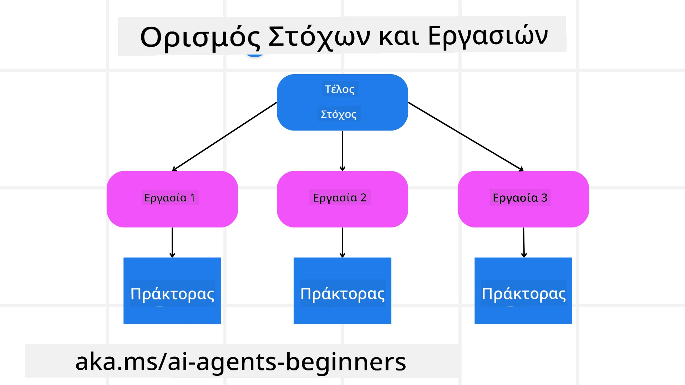

[](https://youtu.be/kPfJ2BrBCMY?si=9pYpPXp0sSbK91Dr)

> _(Κάντε κλικ στην παραπάνω εικόνα για να δείτε το βίντεο αυτής της ενότητας)_

# Προγραμματισμός Σχεδίασης

## Εισαγωγή

Αυτή η ενότητα θα καλύψει

* Τον καθορισμό ενός σαφούς συνολικού στόχου και τη διάσπαση μιας πολύπλοκης εργασίας σε διαχειρίσιμες εργασίες.
* Τη χρήση δομημένης εξόδου για πιο αξιόπιστες και μηχανο-αναγνώσιμες απαντήσεις.
* Την εφαρμογή μιας προσέγγισης βάσει γεγονότων για τη διαχείριση δυναμικών εργασιών και απρόβλεπτων εισερχόμενων δεδομένων.

## Στόχοι Μάθησης

Μετά την ολοκλήρωση αυτής της ενότητας, θα έχετε μια κατανόηση για:

* Τον εντοπισμό και τη ρύθμιση ενός συνολικού στόχου για έναν πράκτορα AI, διασφαλίζοντας ότι γνωρίζει σαφώς τι πρέπει να επιτευχθεί.
* Τη διάσπαση μιας πολύπλοκης εργασίας σε διαχειρίσιμες υποεργασίες και την οργάνωσή τους σε μια λογική αλληλουχία.
* Τον εξοπλισμό των πρακτόρων με τα κατάλληλα εργαλεία (π.χ. εργαλεία αναζήτησης ή εργαλεία ανάλυσης δεδομένων), την απόφαση πότε και πώς χρησιμοποιούνται, καθώς και τη διαχείριση απροσδόκητων καταστάσεων που προκύπτουν.
* Την αξιολόγηση των αποτελεσμάτων των υποεργασιών, τη μέτρηση της απόδοσης και την επανάληψη των ενεργειών για τη βελτίωση του τελικού αποτελέσματος.

## Καθορισμός του Συνολικού Στόχου και Διάσπαση Εργασίας



Οι περισσότερες εργασίες στον πραγματικό κόσμο είναι πολύπλοκες για να αντιμετωπιστούν σε ένα μόνο βήμα. Ένας πράκτορας AI χρειάζεται ένα σύντομο αντικειμενικό σκοπό για να κατευθύνει τον προγραμματισμό και τις ενέργειές του. Για παράδειγμα, σκεφτείτε τον στόχο:

    "Δημιουργία ενός προγράμματος ταξιδιού 3 ημερών."

Παρόλο που είναι απλό να το δηλώσουμε, χρειάζεται ακόμα βελτίωση. Όσο πιο σαφής είναι ο στόχος, τόσο καλύτερα ο πράκτορας (και τυχόν ανθρωποί συνεργάτες) μπορούν να εστιάσουν στην επίτευξη του σωστού αποτελέσματος, όπως η δημιουργία ενός ολοκληρωμένου προγράμματος με επιλογές πτήσεων, προτάσεις ξενοδοχείων και προτάσεις δραστηριοτήτων.

### Διάσπαση Εργασιών

Μεγάλες ή περίπλοκες εργασίες γίνονται πιο διαχειρίσιμες όταν χωρίζονται σε μικρότερες, στοχευμένες υποεργασίες.
Για το παράδειγμα του προγράμματος ταξιδιού, μπορείτε να διασπάσετε τον στόχο σε:

* Κράτηση Πτήσεων
* Κράτηση Ξενοδοχείου
* Ενοικίαση Αυτοκινήτου
* Εξατομίκευση

Κάθε υποεργασία μπορεί στη συνέχεια να ανατεθεί σε εξειδικευμένους πράκτορες ή διαδικασίες. Ένας πράκτορας μπορεί να ειδικεύεται στην αναζήτηση των καλύτερων προσφορών πτήσεων, ένας άλλος εστιάζει στις κρατήσεις ξενοδοχείων, και ούτω καθεξής. Ένας συντονιστής ή "downstream" πράκτορας μπορεί να συγκεντρώνει αυτά τα αποτελέσματα σε ένα ενιαίο και ολοκληρωμένο πρόγραμμα για τον τελικό χρήστη.

Αυτή η αρθρωτή προσέγγιση επιτρέπει επίσης σταδιακές βελτιώσεις. Για παράδειγμα, μπορείτε να προσθέσετε εξειδικευμένους πράκτορες για Προτάσεις Φαγητού ή Προτάσεις Τοπικών Δραστηριοτήτων και να βελτιώσετε το πρόγραμμα με το χρόνο.

### Δομημένη έξοδος

Τα Μεγάλα Γλωσσικά Μοντέλα (LLMs) μπορούν να παράγουν δομημένη έξοδο (π.χ. JSON) που είναι πιο εύκολη για downstream πράκτορες ή υπηρεσίες να αναλύσουν και να επεξεργαστούν. Αυτό είναι ιδιαίτερα χρήσιμο σε ένα περιβάλλον με πολλούς πράκτορες, όπου μπορούμε να εφαρμόσουμε αυτές τις εργασίες μετά τη λήψη της εξόδου προγραμματισμού.

Το ακόλουθο απόσπασμα Python δείχνει έναν απλό πράκτορα σχεδίασης που διασπά έναν στόχο σε υποεργασίες και δημιουργεί ένα δομημένο σχέδιο:

```python
from pydantic import BaseModel
from enum import Enum
from typing import List, Optional, Union
import json
import os
from typing import Optional
from pprint import pprint
from agent_framework.azure import AzureAIProjectAgentProvider
from azure.identity import AzureCliCredential

class AgentEnum(str, Enum):
    FlightBooking = "flight_booking"
    HotelBooking = "hotel_booking"
    CarRental = "car_rental"
    ActivitiesBooking = "activities_booking"
    DestinationInfo = "destination_info"
    DefaultAgent = "default_agent"
    GroupChatManager = "group_chat_manager"

# Μοντέλο Υποεργασίας Ταξιδιού
class TravelSubTask(BaseModel):
    task_details: str
    assigned_agent: AgentEnum  # θέλουμε να αναθέσουμε την εργασία στον πράκτορα

class TravelPlan(BaseModel):
    main_task: str
    subtasks: List[TravelSubTask]
    is_greeting: bool

provider = AzureAIProjectAgentProvider(credential=AzureCliCredential())

# Ορισμός του μηνύματος χρήστη
system_prompt = """You are a planner agent.
    Your job is to decide which agents to run based on the user's request.
    Provide your response in JSON format with the following structure:
{'main_task': 'Plan a family trip from Singapore to Melbourne.',
 'subtasks': [{'assigned_agent': 'flight_booking',
               'task_details': 'Book round-trip flights from Singapore to '
                               'Melbourne.'}
    Below are the available agents specialised in different tasks:
    - FlightBooking: For booking flights and providing flight information
    - HotelBooking: For booking hotels and providing hotel information
    - CarRental: For booking cars and providing car rental information
    - ActivitiesBooking: For booking activities and providing activity information
    - DestinationInfo: For providing information about destinations
    - DefaultAgent: For handling general requests"""

user_message = "Create a travel plan for a family of 2 kids from Singapore to Melbourne"

response = client.create_response(input=user_message, instructions=system_prompt)

response_content = response.output_text
pprint(json.loads(response_content))
```

### Πράκτορας Προγραμματισμού με Συντονισμό Πολλαπλών Πρακτόρων

Σε αυτό το παράδειγμα, ένας Πράκτορας Σημασιολογικού Δρομολογητή λαμβάνει ένα αίτημα χρήστη (π.χ., "Χρειάζομαι ένα σχέδιο ξενοδοχείου για το ταξίδι μου.").

Ο σχεδιαστής στη συνέχεια:

* Λαμβάνει το Σχέδιο Ξενοδοχείου: Ο σχεδιαστής παίρνει το μήνυμα του χρήστη και, βάσει μιας προτροπής συστήματος (συμπεριλαμβανομένων λεπτομερειών διαθέσιμων πρακτόρων), δημιουργεί ένα δομημένο σχέδιο ταξιδιού.
* Καταγράφει Πράκτορες και τα Εργαλεία τους: Το μητρώο πρακτόρων διαθέτει μια λίστα πρακτόρων (π.χ. για πτήσεις, ξενοδοχεία, ενοικιάσεις αυτοκινήτων και δραστηριότητες) μαζί με τις λειτουργίες ή εργαλεία που προσφέρουν.
* Δρομολογεί το Σχέδιο στους αντίστοιχους Πράκτορες: Ανάλογα με τον αριθμό των υποεργασιών, ο σχεδιαστής είτε στέλνει το μήνυμα απευθείας σε έναν αφιερωμένο πράκτορα (για σενάρια μονής εργασίας) ή συντονίζει μέσω ενός διαχειριστή ομάδας συνομιλίας για συνεργασία πολλαπλών πρακτόρων.
* Συνοψίζει το Αποτέλεσμα: Τέλος, ο σχεδιαστής συνοψίζει το παραγόμενο σχέδιο για σαφήνεια.
Το ακόλουθο δείγμα κώδικα Python απεικονίζει αυτά τα βήματα:

```python

from pydantic import BaseModel

from enum import Enum
from typing import List, Optional, Union

class AgentEnum(str, Enum):
    FlightBooking = "flight_booking"
    HotelBooking = "hotel_booking"
    CarRental = "car_rental"
    ActivitiesBooking = "activities_booking"
    DestinationInfo = "destination_info"
    DefaultAgent = "default_agent"
    GroupChatManager = "group_chat_manager"

# Πρότυπο υποεργασίας ταξιδιού

class TravelSubTask(BaseModel):
    task_details: str
    assigned_agent: AgentEnum # θέλουμε να αναθέσουμε την εργασία στον πράκτορα

class TravelPlan(BaseModel):
    main_task: str
    subtasks: List[TravelSubTask]
    is_greeting: bool
import json
import os
from typing import Optional

from agent_framework.azure import AzureAIProjectAgentProvider
from azure.identity import AzureCliCredential

# Δημιουργήστε τον πελάτη

provider = AzureAIProjectAgentProvider(credential=AzureCliCredential())

from pprint import pprint

# Ορίστε το μήνυμα του χρήστη

system_prompt = """You are a planner agent.
    Your job is to decide which agents to run based on the user's request.
    Below are the available agents specialized in different tasks:
    - FlightBooking: For booking flights and providing flight information
    - HotelBooking: For booking hotels and providing hotel information
    - CarRental: For booking cars and providing car rental information
    - ActivitiesBooking: For booking activities and providing activity information
    - DestinationInfo: For providing information about destinations
    - DefaultAgent: For handling general requests"""

user_message = "Create a travel plan for a family of 2 kids from Singapore to Melbourne"

response = client.create_response(input=user_message, instructions=system_prompt)

response_content = response.output_text

# Εκτυπώστε το περιεχόμενο της απόκρισης μετά τη φόρτωση του ως JSON

pprint(json.loads(response_content))
```

Ακολουθεί η έξοδος από τον προηγούμενο κώδικα και μπορείτε να χρησιμοποιήσετε αυτή τη δομημένη έξοδο για να δρομολογήσετε στον `assigned_agent` και να συνοψίσετε το σχέδιο ταξιδιού στον τελικό χρήστη.

```json
{
    "is_greeting": "False",
    "main_task": "Plan a family trip from Singapore to Melbourne.",
    "subtasks": [
        {
            "assigned_agent": "flight_booking",
            "task_details": "Book round-trip flights from Singapore to Melbourne."
        },
        {
            "assigned_agent": "hotel_booking",
            "task_details": "Find family-friendly hotels in Melbourne."
        },
        {
            "assigned_agent": "car_rental",
            "task_details": "Arrange a car rental suitable for a family of four in Melbourne."
        },
        {
            "assigned_agent": "activities_booking",
            "task_details": "List family-friendly activities in Melbourne."
        },
        {
            "assigned_agent": "destination_info",
            "task_details": "Provide information about Melbourne as a travel destination."
        }
    ]
}
```

Διαθέσιμο ένα παράδειγμα σημειωματαρίου (notebook) με το προηγούμενο δείγμα κώδικα [εδώ](07-python-agent-framework.ipynb).

### Επαναληπτικός Προγραμματισμός

Ορισμένες εργασίες απαιτούν ανταλλαγή ή επαναπρογραμματισμό, όπου το αποτέλεσμα μιας υποεργασίας επηρεάζει την επόμενη. Για παράδειγμα, αν ο πράκτορας ανακαλύψει απροσδόκητο μορφότυπο δεδομένων κατά την κράτηση πτήσεων, μπορεί να χρειαστεί να προσαρμόσει τη στρατηγική του πριν προχωρήσει στις κρατήσεις ξενοδοχείου.

Επιπλέον, η ανατροφοδότηση του χρήστη (π.χ. ένας άνθρωπος που αποφασίζει ότι προτιμά νωρίτερη πτήση) μπορεί να ενεργοποιήσει μερικό επαναπρογραμματισμό. Αυτή η δυναμική, επαναληπτική προσέγγιση εξασφαλίζει ότι η τελική λύση ευθυγραμμίζεται με τους περιορισμούς του πραγματικού κόσμου και τις μεταβαλλόμενες προτιμήσεις των χρηστών.

π.χ. δείγμα κώδικα

```python
from agent_framework.azure import AzureAIProjectAgentProvider
from azure.identity import AzureCliCredential
#.. το ίδιο με τον προηγούμενο κώδικα και πέρασε το ιστορικό χρήστη, το τρέχον σχέδιο

system_prompt = """You are a planner agent to optimize the
    Your job is to decide which agents to run based on the user's request.
    Below are the available agents specialized in different tasks:
    - FlightBooking: For booking flights and providing flight information
    - HotelBooking: For booking hotels and providing hotel information
    - CarRental: For booking cars and providing car rental information
    - ActivitiesBooking: For booking activities and providing activity information
    - DestinationInfo: For providing information about destinations
    - DefaultAgent: For handling general requests"""

user_message = "Create a travel plan for a family of 2 kids from Singapore to Melbourne"

response = client.create_response(
    input=user_message,
    instructions=system_prompt,
    context=f"Previous travel plan - {TravelPlan}",
)
# .. επαναπρογραμμάτισε και στείλε τις εργασίες στους αντίστοιχους πράκτορες
```

Για πιο ολοκληρωμένο προγραμματισμό, δείτε το Magnetic One <a href="https://www.microsoft.com/research/articles/magentic-one-a-generalist-multi-agent-system-for-solving-complex-tasks" target="_blank">Blogpost</a> για την επίλυση πολύπλοκων εργασιών.

## Περίληψη

Σε αυτό το άρθρο είδαμε ένα παράδειγμα για το πώς μπορούμε να δημιουργήσουμε έναν σχεδιαστή που μπορεί δυναμικά να επιλέγει τους διαθέσιμους πρακτόρες που έχουν οριστεί. Η έξοδος του Σχεδιαστή διασπά τις εργασίες και αναθέτει τους πράκτορες ώστε να μπορούν να εκτελεστούν. Υποτίθεται ότι οι πράκτορες έχουν πρόσβαση στις λειτουργίες/εργαλεία που απαιτούνται για την εκτέλεση της εργασίας. Επιπλέον των πρακτόρων μπορείτε να συμπεριλάβετε και άλλα πρότυπα όπως reflection, summarizer, και round robin chat για περαιτέρω προσαρμογή.

## Πρόσθετοι Πόροι

Magentic One - Ένα γενικός σύστημα πολλαπλών πρακτόρων για την επίλυση πολύπλοκων εργασιών που έχει επιτύχει εντυπωσιακά αποτελέσματα σε πολλαπλά απαιτητικά agentic benchmarks. Αναφορά: <a href="https://www.microsoft.com/research/articles/magentic-one-a-generalist-multi-agent-system-for-solving-complex-tasks" target="_blank">Magentic One</a>. Σε αυτή την υλοποίηση ο συντονιστής δημιουργεί σχεδιαστικά πλάνα ειδικά για τις εργασίες και αναθέτει αυτές τις εργασίες στους διαθέσιμους πράκτορες. Επιπλέον του προγραμματισμού, ο συντονιστής χρησιμοποιεί και έναν μηχανισμό παρακολούθησης για την παρακολούθηση της προόδου της εργασίας και πραγματοποιεί επαναπρογραμματισμό όταν απαιτείται.

### Έχετε Περισσότερες Ερωτήσεις για το Πρότυπο Σχεδίασης Προγραμματισμού;

Εγγραφείτε στο [Microsoft Foundry Discord](https://aka.ms/ai-agents/discord) για να συναντήσετε άλλους μαθητές, να παρακολουθήσετε ώρες γραφείου και να λάβετε απαντήσεις για τις ερωτήσεις σας σχετικά με Πράκτορες AI.

## Προηγούμενη Ενότητα

[Δημιουργία Αξιόπιστων Πρακτόρων AI](../06-building-trustworthy-agents/README.md)

## Επόμενη Ενότητα

[Πρότυπο Σχεδίασης Πολλαπλών Πρακτόρων](../08-multi-agent/README.md)

---

<!-- CO-OP TRANSLATOR DISCLAIMER START -->
**Αποποίηση ευθυνών**:  
Αυτό το έγγραφο έχει μεταφραστεί χρησιμοποιώντας την υπηρεσία αυτόματης μετάφρασης AI [Co-op Translator](https://github.com/Azure/co-op-translator). Παρόλο που επιδιώκουμε την ακρίβεια, παρακαλούμε να γνωρίζετε ότι οι αυτόματες μεταφράσεις ενδέχεται να περιέχουν λάθη ή ανακρίβειες. Το πρωτότυπο έγγραφο στη μητρική του γλώσσα πρέπει να θεωρείται η αυθεντική πηγή. Για κρίσιμες πληροφορίες, συνιστάται η επαγγελματική μετάφραση από ανθρώπους. Δεν ευθυνόμαστε για τυχόν παρερμηνείες ή λανθασμένες ερμηνείες που απορρέουν από τη χρήση αυτής της μετάφρασης.
<!-- CO-OP TRANSLATOR DISCLAIMER END -->