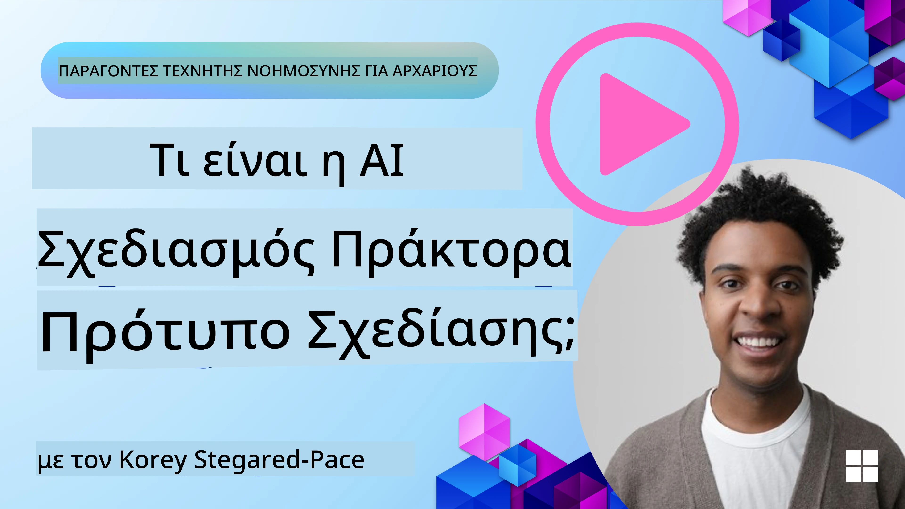
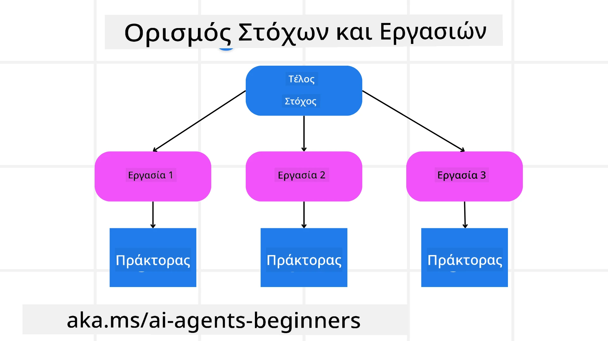

[](https://youtu.be/kPfJ2BrBCMY?si=9pYpPXp0sSbK91Dr)

> _(Κάντε κλικ στην εικόνα παραπάνω για να δείτε το βίντεο αυτού του μαθήματος)_

# Σχεδιασμός Προγραμματισμού

## Εισαγωγή

Αυτό το μάθημα θα καλύψει

* Τον ορισμό ενός σαφούς συνολικού στόχου και τη διάσπαση μιας πολύπλοκης εργασίας σε διαχειρίσιμες εργασίες.
* Την αξιοποίηση δομημένης εξόδου για πιο αξιόπιστες και μηχανικά αναγνώσιμες απαντήσεις.
* Την εφαρμογή μιας προσέγγισης που βασίζεται σε γεγονότα για τη διαχείριση δυναμικών εργασιών και απροσδόκητων εισόδων.

## Στόχοι Μάθησης

Μετά την ολοκλήρωση αυτού του μαθήματος, θα έχετε κατανόηση σχετικά με:

* Τον εντοπισμό και τον καθορισμό ενός συνολικού στόχου για έναν πράκτορα AI, διασφαλίζοντας ότι γνωρίζει σαφώς τι πρέπει να επιτευχθεί.
* Τη διάσπαση μιας πολύπλοκης εργασίας σε διαχειρίσιμα υπο-εργασίες και την οργάνωσή τους σε μια λογική σειρά.
* Τον εξοπλισμό των πρακτόρων με τα κατάλληλα εργαλεία (π.χ., εργαλεία αναζήτησης ή εργαλεία ανάλυσης δεδομένων), τον προσδιορισμό του πότε και πώς χρησιμοποιούνται, και τη διαχείριση απροσδόκητων καταστάσεων που προκύπτουν.
* Την αξιολόγηση των αποτελεσμάτων των υπο-εργασιών, τη μέτρηση της απόδοσης και την επανάληψη δράσεων για τη βελτίωση της τελικής εξόδου.

## Ορισμός του Συνολικού Στόχου και Διάσπαση μιας Εργασίας



Οι περισσότερες εργασίες στον πραγματικό κόσμο είναι πολύπλοκες για να αντιμετωπιστούν σε ένα μόνο βήμα. Ένας πράκτορας AI χρειάζεται έναν σύντομο στόχο για να καθοδηγήσει τον προγραμματισμό και τις ενέργειές του. Για παράδειγμα, σκεφτείτε τον στόχο:

    "Δημιουργία ενός ταξιδιωτικού προγράμματος 3 ημερών."

Ενώ είναι απλό να το δηλώσουμε, χρειάζεται περαιτέρω εξειδίκευση. Όσο πιο σαφής είναι ο στόχος, τόσο καλύτερα ο πράκτορας (και τυχόν συνεργάτες ανθρώποι) μπορούν να επικεντρωθούν στην επίτευξη του σωστού αποτελέσματος, όπως η δημιουργία ενός ολοκληρωμένου προγράμματος με επιλογές πτήσεων, προτάσεις ξενοδοχείων και προτάσεις δραστηριοτήτων.

### Διάσπαση Εργασίας

Οι μεγάλες ή περίπλοκες εργασίες γίνονται πιο διαχειρίσιμες όταν χωρίζονται σε μικρότερες, προσανατολισμένες σε στόχους υπο-εργασίες.
Για το παράδειγμα του ταξιδιωτικού προγράμματος, μπορείτε να διασπάσετε τον στόχο σε:

* Κράτηση Πτήσης
* Κράτηση Ξενοδοχείου
* Ενοικίαση Αυτοκινήτου
* Εξατομίκευση

Καθεμία από αυτές τις υπο-εργασίες μπορεί στη συνέχεια να αντιμετωπιστεί από αφιερωμένους πράκτορες ή διαδικασίες. Ένας πράκτορας μπορεί να ειδικεύεται στην αναζήτηση των καλύτερων προσφορών πτήσεων, ένας άλλος στην κράτηση ξενοδοχείων, κ.ο.κ. Ένας συντονιστής ή "κατώτερος" πράκτορας μπορεί να συνδυάσει αυτά τα αποτελέσματα σε ένα συνεκτικό πρόγραμμα για τον τελικό χρήστη.

Αυτή η αρθρωτή προσέγγιση επιτρέπει επίσης σταδιακές βελτιώσεις. Για παράδειγμα, μπορείτε να προσθέσετε εξειδικευμένους πράκτορες για προτάσεις φαγητού ή τοπικές δραστηριότητες και να βελτιώσετε το πρόγραμμα με την πάροδο του χρόνου.

### Δομημένη έξοδος

Τα Μεγάλα Γλωσσικά Μοντέλα (LLMs) μπορούν να δημιουργούν δομημένη έξοδο (π.χ. JSON) που είναι πιο εύκολο για κατώτερους πράκτορες ή υπηρεσίες να αναλύσουν και να επεξεργαστούν. Αυτό είναι ιδιαίτερα χρήσιμο σε ένα περιβάλλον με πολλαπλούς πράκτορες, όπου μπορούμε να εκτελέσουμε αυτές τις εργασίες μετά τη λήψη της εξόδου του προγραμματισμού.

Το παρακάτω απόσπασμα Python δείχνει έναν απλό πράκτορα προγραμματισμού να διασπά έναν στόχο σε υπο-εργασίες και να δημιουργεί ένα δομημένο σχέδιο:

```python
from pydantic import BaseModel
from enum import Enum
from typing import List, Optional, Union
import json
import os
from typing import Optional
from pprint import pprint
from agent_framework.foundry import FoundryChatClient
from azure.identity import AzureCliCredential

class AgentEnum(str, Enum):
    FlightBooking = "flight_booking"
    HotelBooking = "hotel_booking"
    CarRental = "car_rental"
    ActivitiesBooking = "activities_booking"
    DestinationInfo = "destination_info"
    DefaultAgent = "default_agent"
    GroupChatManager = "group_chat_manager"

# Μοντέλο Υπο-Εργασίας Ταξιδιού
class TravelSubTask(BaseModel):
    task_details: str
    assigned_agent: AgentEnum  # θέλουμε να αναθέσουμε την εργασία στον πράκτορα

class TravelPlan(BaseModel):
    main_task: str
    subtasks: List[TravelSubTask]
    is_greeting: bool

provider = FoundryChatClient(
    project_endpoint=os.environ["AZURE_AI_PROJECT_ENDPOINT"],
    model=os.environ["AZURE_AI_MODEL_DEPLOYMENT_NAME"],
    credential=AzureCliCredential(),
)

# Ορίστε το μήνυμα του χρήστη
system_prompt = """You are a planner agent.
    Your job is to decide which agents to run based on the user's request.
    Provide your response in JSON format with the following structure:
{'main_task': 'Plan a family trip from Singapore to Melbourne.',
 'subtasks': [{'assigned_agent': 'flight_booking',
               'task_details': 'Book round-trip flights from Singapore to '
                               'Melbourne.'}
    Below are the available agents specialised in different tasks:
    - FlightBooking: For booking flights and providing flight information
    - HotelBooking: For booking hotels and providing hotel information
    - CarRental: For booking cars and providing car rental information
    - ActivitiesBooking: For booking activities and providing activity information
    - DestinationInfo: For providing information about destinations
    - DefaultAgent: For handling general requests"""

user_message = "Create a travel plan for a family of 2 kids from Singapore to Melbourne"

response = client.create_response(input=user_message, instructions=system_prompt)

response_content = response.output_text
pprint(json.loads(response_content))
```

### Πράκτορας Προγραμματισμού με Ορχήστρωση Πολυπράκτορα

Σε αυτό το παράδειγμα, ένας Semantischer Router Agent λαμβάνει ένα αίτημα χρήστη (π.χ., "Χρειάζομαι ένα σχέδιο ξενοδοχείου για το ταξίδι μου.").

Ο προγραμματιστής στη συνέχεια:

* Λαμβάνει το Σχέδιο Ξενοδοχείου: Ο προγραμματιστής παίρνει το μήνυμα του χρήστη και, με βάση μια προτροπή συστήματος (συμπεριλαμβανομένων διαθέσιμων λεπτομερειών των πρακτόρων), δημιουργεί ένα δομημένο ταξιδιωτικό σχέδιο.
* Λίστα Πρακτόρων και Εργαλείων τους: Το μητρώο πρακτόρων διατηρεί λίστα πρακτόρων (π.χ. για πτήσεις, ξενοδοχεία, ενοικίαση αυτοκινήτου και δραστηριότητες) μαζί με τις λειτουργίες ή τα εργαλεία που προσφέρουν.
* Δρομολόγηση του Σχεδίου στους Αντίστοιχους Πράκτορες: Ανάλογα με τον αριθμό των υπο-εργασιών, ο προγραμματιστής είτε στέλνει το μήνυμα απευθείας σε έναν αφιερωμένο πράκτορα (για σενάρια μονής εργασίας) είτε συντονίζει μέσω διαχειριστή ομαδικής συνομιλίας για συνεργασία πολλών πρακτόρων.
* Περίληψη Αποτελέσματος: Τέλος, ο προγραμματιστής συνοψίζει το δημιουργημένο σχέδιο για σαφήνεια.
Ο παρακάτω κώδικας Python απεικονίζει αυτά τα βήματα:

```python

from pydantic import BaseModel

from enum import Enum
from typing import List, Optional, Union

class AgentEnum(str, Enum):
    FlightBooking = "flight_booking"
    HotelBooking = "hotel_booking"
    CarRental = "car_rental"
    ActivitiesBooking = "activities_booking"
    DestinationInfo = "destination_info"
    DefaultAgent = "default_agent"
    GroupChatManager = "group_chat_manager"

# Μοντέλο Υποεργασίας Ταξιδιού

class TravelSubTask(BaseModel):
    task_details: str
    assigned_agent: AgentEnum # θέλουμε να αναθέσουμε την εργασία στον πράκτορα

class TravelPlan(BaseModel):
    main_task: str
    subtasks: List[TravelSubTask]
    is_greeting: bool
import json
import os
from typing import Optional

from agent_framework.foundry import FoundryChatClient
from azure.identity import AzureCliCredential

# Δημιουργήστε τον πελάτη

provider = FoundryChatClient(
    project_endpoint=os.environ["AZURE_AI_PROJECT_ENDPOINT"],
    model=os.environ["AZURE_AI_MODEL_DEPLOYMENT_NAME"],
    credential=AzureCliCredential(),
)

from pprint import pprint

# Ορίστε το μήνυμα χρήστη

system_prompt = """You are a planner agent.
    Your job is to decide which agents to run based on the user's request.
    Below are the available agents specialized in different tasks:
    - FlightBooking: For booking flights and providing flight information
    - HotelBooking: For booking hotels and providing hotel information
    - CarRental: For booking cars and providing car rental information
    - ActivitiesBooking: For booking activities and providing activity information
    - DestinationInfo: For providing information about destinations
    - DefaultAgent: For handling general requests"""

user_message = "Create a travel plan for a family of 2 kids from Singapore to Melbourne"

response = client.create_response(input=user_message, instructions=system_prompt)

response_content = response.output_text

# Εκτυπώστε το περιεχόμενο της απάντησης αφού το φορτώσετε ως JSON

pprint(json.loads(response_content))
```

Ακολουθεί η έξοδος από τον προηγούμενο κώδικα και μπορείτε να χρησιμοποιήσετε αυτή τη δομημένη έξοδο για δρομολόγηση στον `assigned_agent` και σύνοψη του ταξιδιωτικού σχεδίου προς τον τελικό χρήστη.

```json
{
    "is_greeting": "False",
    "main_task": "Plan a family trip from Singapore to Melbourne.",
    "subtasks": [
        {
            "assigned_agent": "flight_booking",
            "task_details": "Book round-trip flights from Singapore to Melbourne."
        },
        {
            "assigned_agent": "hotel_booking",
            "task_details": "Find family-friendly hotels in Melbourne."
        },
        {
            "assigned_agent": "car_rental",
            "task_details": "Arrange a car rental suitable for a family of four in Melbourne."
        },
        {
            "assigned_agent": "activities_booking",
            "task_details": "List family-friendly activities in Melbourne."
        },
        {
            "assigned_agent": "destination_info",
            "task_details": "Provide information about Melbourne as a travel destination."
        }
    ]
}
```

Ένα παράδειγμα σημειωματάριου με το προηγούμενο δείγμα κώδικα είναι διαθέσιμο [εδώ](./code_samples/07-python-agent-framework.ipynb).

### Επαναληπτικός Προγραμματισμός

Ορισμένες εργασίες απαιτούν αλληλεπίδραση ή επαναπρογραμματισμό, όπου το αποτέλεσμα μιας υπο-εργασίας επηρεάζει την επόμενη. Για παράδειγμα, αν ο πράκτορας ανακαλύψει μια απροσδόκητη μορφή δεδομένων κατά την κράτηση πτήσεων, μπορεί να χρειαστεί να προσαρμόσει τη στρατηγική του προτού προχωρήσει στις κρατήσεις ξενοδοχείων.

Επιπλέον, τα σχόλια χρήστη (π.χ. ένας άνθρωπος που αποφασίζει ότι προτιμά μια νωρίτερη πτήση) μπορούν να ενεργοποιήσουν μερική επαναπρογραμματισμό. Αυτή η δυναμική, επαναληπτική προσέγγιση διασφαλίζει ότι η τελική λύση ευθυγραμμίζεται με τους πραγματικούς περιορισμούς και τις εξελισσόμενες προτιμήσεις των χρηστών.

π.χ. δείγμα κώδικα

```python
import os
from agent_framework.foundry import FoundryChatClient
from azure.identity import AzureCliCredential
#.. ίδιος όπως ο προηγούμενος κώδικας και δώσε το ιστορικό χρήστη, το τρέχον πλάνο

system_prompt = """You are a planner agent to optimize the
    Your job is to decide which agents to run based on the user's request.
    Below are the available agents specialized in different tasks:
    - FlightBooking: For booking flights and providing flight information
    - HotelBooking: For booking hotels and providing hotel information
    - CarRental: For booking cars and providing car rental information
    - ActivitiesBooking: For booking activities and providing activity information
    - DestinationInfo: For providing information about destinations
    - DefaultAgent: For handling general requests"""

user_message = "Create a travel plan for a family of 2 kids from Singapore to Melbourne"

response = client.create_response(
    input=user_message,
    instructions=system_prompt,
    context=f"Previous travel plan - {TravelPlan}",
)
# .. ξανασχεδίασε και στείλε τις εργασίες στους αντίστοιχους πράκτορες
```

Για πιο ολοκληρωμένο προγραμματισμό επισκεφθείτε το Magnetic One <a href="https://www.microsoft.com/research/articles/magentic-one-a-generalist-multi-agent-system-for-solving-complex-tasks" target="_blank">Blogpost</a> για την επίλυση πολύπλοκων εργασιών.

## Περίληψη

Σε αυτό το άρθρο εξετάσαμε ένα παράδειγμα για το πώς μπορούμε να δημιουργήσουμε έναν προγραμματιστή που μπορεί να επιλέγει δυναμικά τους διαθέσιμους ορισμένους πράκτορες. Η έξοδος του Προγραμματιστή διασπά τις εργασίες και αναθέτει τους πράκτορες ώστε να εκτελεστούν. Υποτίθεται ότι οι πράκτορες έχουν πρόσβαση στις λειτουργίες/εργαλεία που απαιτούνται για την εκτέλεση της εργασίας. Επιπλέον από τους πράκτορες μπορείτε να συμπεριλάβετε και άλλα πρότυπα όπως αναστοχασμό, συνοψιστή και κυκλική συνομιλία για περαιτέρω προσαρμογή.

## Πρόσθετοι Πόροι

Magentic One - Ένα γενικό σύστημα πολλαπλών πρακτόρων για την επίλυση πολύπλοκων εργασιών και έχει επιτύχει εντυπωσιακά αποτελέσματα σε πολλαπλά απαιτητικά benchmarks πρακτόρων. Αναφορά: <a href="https://www.microsoft.com/research/articles/magentic-one-a-generalist-multi-agent-system-for-solving-complex-tasks" target="_blank">Magentic One</a>. Σε αυτή την υλοποίηση, ο ορχηστρωτής δημιουργεί ειδικά σχέδια εργασίας και αναθέτει αυτές τις εργασίες στους διαθέσιμους πράκτορες. Επιπλέον του προγραμματισμού, ο ορχηστρωτής χρησιμοποιεί και έναν μηχανισμό παρακολούθησης για την πρόοδο της εργασίας και επαναπρογραμματίζει όπως απαιτείται.

### Έχετε Περισσότερες Ερωτήσεις για το Σχεδιαστικό Πρότυπο Προγραμματισμού;

Εγγραφείτε στο [Microsoft Foundry Discord](https://discord.com/invite/ATgtXmAS5D) για να συναντήσετε άλλους μαθητές, να παρακολουθήσετε ώρες γραφείου και να απαντήσετε στις ερωτήσεις σας για τους Πράκτορες AI.

## Προηγούμενο Μάθημα

[Δημιουργία Αξιόπιστων Πρακτόρων AI](../06-building-trustworthy-agents/README.md)

## Επόμενο Μάθημα

[Σχεδιαστικό Πρότυπο Πολυπράκτορα](../08-multi-agent/README.md)

---

<!-- CO-OP TRANSLATOR DISCLAIMER START -->
**Αποποίηση ευθυνών**:
Αυτό το έγγραφο έχει μεταφραστεί χρησιμοποιώντας την υπηρεσία μετάφρασης με τεχνητή νοημοσύνη [Co-op Translator](https://github.com/Azure/co-op-translator). Ενώ επιδιώκουμε την ακρίβεια, παρακαλούμε να έχετε υπόψη ότι οι αυτοματοποιημένες μεταφράσεις ενδέχεται να περιέχουν λάθη ή ανακρίβειες. Το πρωτότυπο έγγραφο στη μητρική του γλώσσα πρέπει να θεωρείται η αυθεντική πηγή. Για κρίσιμες πληροφορίες, συνιστάται επαγγελματική ανθρώπινη μετάφραση. Δεν φέρουμε ευθύνη για τυχόν παρεξηγήσεις ή λανθασμένες ερμηνείες που προκύπτουν από τη χρήση αυτής της μετάφρασης.
<!-- CO-OP TRANSLATOR DISCLAIMER END -->