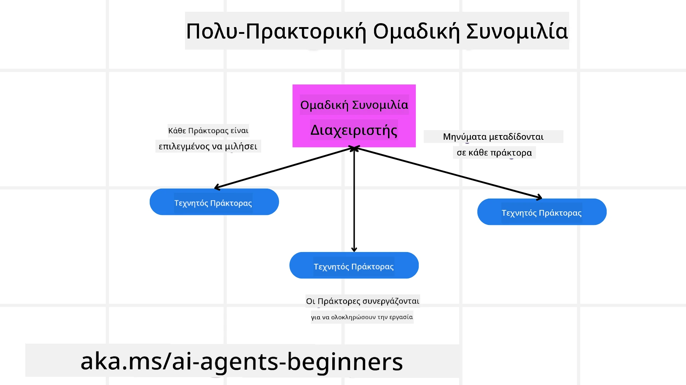
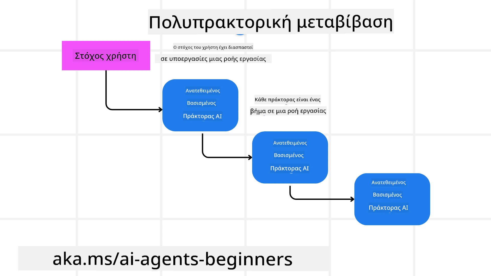
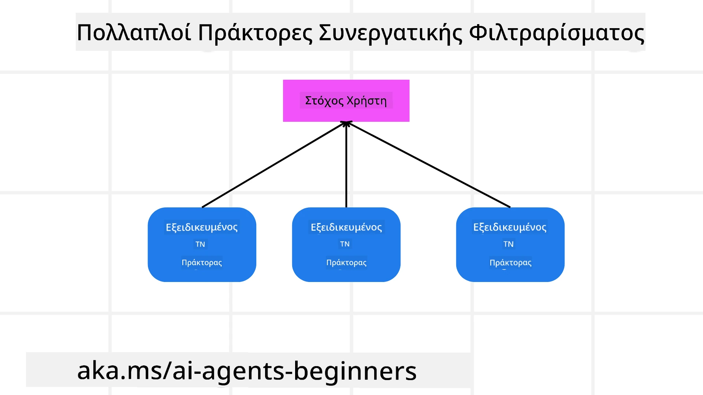

> _(Κάντε κλικ στην εικόνα παραπάνω για να δείτε βίντεο αυτής της ενότητας)_

# Σχεδιαστικά πρότυπα για πολλούς πράκτορες

Μόλις ξεκινήσετε να εργάζεστε σε ένα έργο που περιλαμβάνει πολλούς πράκτορες, θα χρειαστεί να λάβετε υπόψη το σχεδιαστικό πρότυπο πολλών πρακτόρων. Ωστόσο, μπορεί να μην είναι αμέσως σαφές πότε να μεταβείτε σε πολλούς πράκτορες και ποια είναι τα πλεονεκτήματα.

## Εισαγωγή

Σε αυτήν την ενότητα, αναζητούμε να απαντήσουμε στις εξής ερωτήσεις:

- Ποια σενάρια είναι κατάλληλα για πολλούς πράκτορες;
- Ποια είναι τα πλεονεκτήματα της χρήσης πολλών πρακτόρων έναντι ενός μοναδικού πράκτορα που εκτελεί πολλαπλές εργασίες;
- Ποια είναι τα δομικά στοιχεία για την υλοποίηση του σχεδιαστικού προτύπου πολλών πρακτόρων;
- Πώς έχουμε ορατότητα στον τρόπο με τον οποίο οι πολλοί πράκτορες αλληλεπιδρούν μεταξύ τους;

## Στόχοι μάθησης

Μετά από αυτήν την ενότητα, θα πρέπει να μπορείτε:

- Να αναγνωρίζετε σενάρια όπου εφαρμόζονται πολλοί πράκτορες
- Να αναγνωρίζετε τα πλεονεκτήματα της χρήσης πολλών πρακτόρων έναντι ενός μοναδικού πράκτορα.
- Να κατανοείτε τα δομικά στοιχεία υλοποίησης του σχεδιαστικού προτύπου πολλών πρακτόρων.

Ποια είναι η ευρύτερη εικόνα;

*Οι πολλοί πράκτορες είναι ένα σχεδιαστικό πρότυπο που επιτρέπει σε πολλούς πράκτορες να συνεργάζονται για να επιτύχουν έναν κοινό στόχο*.

Αυτό το πρότυπο χρησιμοποιείται ευρέως σε διάφορους τομείς, συμπεριλαμβανομένης της ρομποτικής, των αυτόνομων συστημάτων και της κατανεμημένης πληροφορικής.

## Σενάρια όπου εφαρμόζονται πολλοί πράκτορες

Ποια σενάρια αποτελούν καλές περιπτώσεις χρήσης για πολλούς πράκτορες; Η απάντηση είναι πως υπάρχουν πολλά σενάρια όπου η χρήση πολλών πρακτόρων είναι επωφελής, ειδικά στις ακόλουθες περιπτώσεις:

- **Μεγάλα φορτία εργασίας**: Τα μεγάλα φορτία εργασίας μπορούν να διαιρεθούν σε μικρότερες εργασίες και να ανατεθούν σε διαφορετικούς πράκτορες, επιτρέποντας παράλληλη επεξεργασία και γρηγορότερη ολοκλήρωση. Ένα παράδειγμα είναι η περίπτωση μίας μεγάλης εργασίας επεξεργασίας δεδομένων.
- **Πολύπλοκες εργασίες**: Οι πολύπλοκες εργασίες, όπως τα μεγάλα φορτία εργασίας, μπορούν να σπάσουν σε μικρότερες υποεργασίες και να ανατεθούν σε διαφορετικούς πράκτορες, ο καθένας εξειδικευμένος σε μια συγκεκριμένη πτυχή της εργασίας. Καλά παραδείγματα είναι τα αυτόνομα οχήματα όπου διαφορετικοί πράκτορες διαχειρίζονται την πλοήγηση, την ανίχνευση εμποδίων και την επικοινωνία με άλλα οχήματα.
- **Διάφορες ειδικότητες**: Διαφορετικοί πράκτορες μπορούν να έχουν διαφορετικές ειδικότητες, επιτρέποντάς τους να χειρίζονται διαφορετικές πτυχές μιας εργασίας πιο αποτελεσματικά από έναν μόνο πράκτορα. Ένα καλό παράδειγμα είναι στον τομέα της υγειονομικής περίθαλψης όπου οι πράκτορες μπορούν να διαχειρίζονται τη διάγνωση, τα σχέδια θεραπείας και την παρακολούθηση των ασθενών.

## Πλεονεκτήματα της χρήσης πολλών πρακτόρων έναντι ενός μοναδικού πράκτορα

Ένα σύστημα με έναν μόνο πράκτορα μπορεί να λειτουργεί καλά για απλές εργασίες, αλλά για πιο πολύπλοκες εργασίες η χρήση πολλών πρακτόρων μπορεί να προσφέρει αρκετά πλεονεκτήματα:

- **Εξειδίκευση**: Κάθε πράκτορας μπορεί να είναι εξειδικευμένος σε μια συγκεκριμένη εργασία. Η έλλειψη εξειδίκευσης σε έναν μόνο πράκτορα σημαίνει ότι έχετε έναν πράκτορα που μπορεί να κάνει τα πάντα αλλά μπορεί να μπερδευτεί για το τι πρέπει να κάνει όταν αντιμετωπίζει μια πολύπλοκη εργασία. Μπορεί για παράδειγμα να καταλήξει να κάνει μια εργασία για την οποία δεν είναι ο καλύτερος.
- **Κλιμάκωση**: Είναι πιο εύκολο να κλιμακώσετε συστήματα προσθέτοντας περισσότερους πράκτορες παρά επιβαρύνοντας έναν μόνο πράκτορα.
- **Ανοχή σφαλμάτων**: Εάν ένας πράκτορας αποτύχει, οι άλλοι μπορούν να συνεχίσουν να λειτουργούν, εξασφαλίζοντας την αξιοπιστία του συστήματος.

Ας πάρουμε ένα παράδειγμα, ας κλείσουμε ένα ταξίδι για έναν χρήστη. Ένα σύστημα με έναν μόνο πράκτορα θα έπρεπε να διαχειριστεί όλες τις πτυχές της διαδικασίας κράτησης ταξιδιού, από την εύρεση πτήσεων μέχρι την κράτηση ξενοδοχείων και ενοικίαση αυτοκινήτων. Για να το πετύχει αυτό ένας μόνος πράκτορας, θα έπρεπε να διαθέτει εργαλεία για όλες αυτές τις εργασίες. Αυτό θα μπορούσε να οδηγήσει σε ένα πολύπλοκο και μονολιθικό σύστημα που είναι δύσκολο στη συντήρηση και στην κλιμάκωση. Αντίθετα, ένα σύστημα πολλών πρακτόρων θα μπορούσε να έχει διαφορετικούς πράκτορες εξειδικευμένους στην εύρεση πτήσεων, στην κράτηση ξενοδοχείων και ενοικίασης αυτοκινήτων. Αυτό θα έκανε το σύστημα πιο αρθρωτό, ευκολότερο στη συντήρηση και κλιμακούμενο.

Συγκρίνετε αυτό με ένα ταξιδιωτικό γραφείο που λειτουργεί ως μικρό οικογενειακό κατάστημα έναντι ενός ταξιδιωτικού γραφείου που λειτουργεί ως franchise. Το οικογενειακό κατάστημα θα είχε έναν μόνο πράκτορα να διαχειρίζεται όλες τις πτυχές της κράτησης ταξιδιού, ενώ το franchise θα είχε διαφορετικούς πράκτορες να χειρίζονται διαφορετικές πτυχές της διαδικασίας.

## Δομικά στοιχεία για την υλοποίηση του σχεδιαστικού προτύπου πολλών πρακτόρων

Πριν μπορέσετε να υλοποιήσετε το σχεδιαστικό πρότυπο πολλών πρακτόρων, πρέπει να κατανοήσετε τα δομικά στοιχεία που το συνθέτουν.

Ας το κάνουμε πιο συγκεκριμένο κοιτώντας ξανά το παράδειγμα της κράτησης ταξιδιού για έναν χρήστη. Σε αυτή την περίπτωση, τα δομικά στοιχεία περιλαμβάνουν:

- **Επικοινωνία πρακτόρων**: Οι πράκτορες για την εύρεση πτήσεων, την κράτηση ξενοδοχείων και ενοικίασης αυτοκινήτων χρειάζεται να επικοινωνούν και να μοιράζονται πληροφορίες σχετικά με τις προτιμήσεις και τους περιορισμούς του χρήστη. Πρέπει να αποφασίσετε για τα πρωτόκολλα και τις μεθόδους αυτής της επικοινωνίας. Συγκεκριμένα, ο πράκτορας για την εύρεση πτήσεων πρέπει να επικοινωνεί με τον πράκτορα κράτησης ξενοδοχείων ώστε να εξασφαλίσει ότι το ξενοδοχείο είναι κρατημένο για τις ίδιες ημερομηνίες με την πτήση. Αυτό σημαίνει ότι οι πράκτορες πρέπει να μοιράζονται πληροφορίες σχετικά με τις ημερομηνίες ταξιδιού του χρήστη, και άρα χρειάζεται να αποφασίσετε *ποιοι πράκτορες μοιράζονται πληροφορίες και πώς τις μοιράζονται*.
- **Μηχανισμοί συντονισμού**: Οι πράκτορες χρειάζεται να συντονίζουν τις ενέργειές τους ώστε να εξασφαλίζουν ότι οι προτιμήσεις και οι περιορισμοί του χρήστη ικανοποιούνται. Μια προτίμηση χρήστη μπορεί να είναι να θέλει ένα ξενοδοχείο κοντά στο αεροδρόμιο ενώ ένας περιορισμός μπορεί να είναι πως τα ενοικιαζόμενα αυτοκίνητα είναι διαθέσιμα μόνο στο αεροδρόμιο. Αυτό σημαίνει ότι ο πράκτορας κράτησης ξενοδοχείων πρέπει να συντονίζεται με τον πράκτορα κράτησης ενοικιαζόμενων αυτοκινήτων ώστε να εκπληρώνονται οι προτιμήσεις και οι περιορισμοί του χρήστη. Άρα πρέπει να αποφασίσετε *πώς οι πράκτορες συντονίζουν τις ενέργειές τους*.
- **Αρχιτεκτονική πρακτόρων**: Οι πράκτορες πρέπει να διαθέτουν την εσωτερική δομή για να λαμβάνουν αποφάσεις και να μαθαίνουν από τις αλληλεπιδράσεις με τον χρήστη. Αυτό σημαίνει ότι ο πράκτορας εύρεσης πτήσεων πρέπει να έχει τη δομή να λαμβάνει αποφάσεις για το ποιες πτήσεις να προτείνει στον χρήστη. Πρέπει να αποφασίσετε *πώς οι πράκτορες λαμβάνουν αποφάσεις και μαθαίνουν από τις αλληλεπιδράσεις με τον χρήστη*. Παραδείγματα του πώς ένας πράκτορας μαθαίνει και βελτιώνεται θα μπορούσαν να είναι ότι ο πράκτορας εύρεσης πτήσεων χρησιμοποιεί ένα μοντέλο μηχανικής μάθησης για να προτείνει πτήσεις στον χρήστη βάσει των προηγούμενων προτιμήσεών του.
- **Ορατότητα στις αλληλεπιδράσεις πολλών πρακτόρων**: Χρειάζεται να έχετε ορατότητα στον τρόπο με τον οποίο οι πολλοί πράκτορες αλληλεπιδρούν μεταξύ τους. Αυτό σημαίνει ότι χρειάζεστε εργαλεία και τεχνικές για την παρακολούθηση των δραστηριοτήτων και των αλληλεπιδράσεων των πρακτόρων. Αυτό μπορεί να περιλαμβάνει εργαλεία καταγραφής και παρακολούθησης, εργαλεία οπτικοποίησης και μετρήσεις απόδοσης.
- **Πρότυπα πολλών πρακτόρων**: Υπάρχουν διαφορετικά πρότυπα για την υλοποίηση συστημάτων πολλών πρακτόρων, όπως κεντρικοποιημένες, αποκεντρωμένες και υβριδικές αρχιτεκτονικές. Πρέπει να αποφασίσετε ποιο πρότυπο ταιριάζει καλύτερα στην περίπτωσή σας.
- **Ανθρώπινος παράγοντας**: Στις περισσότερες περιπτώσεις, θα υπάρχει ανθρώπινη παρέμβαση και χρειάζεται να καθορίσετε πότε οι πράκτορες ζητούν ανθρώπινη παρέμβαση. Αυτό μπορεί να γίνεται όταν ο χρήστης ζητά συγκεκριμένο ξενοδοχείο ή πτήση που οι πράκτορες δεν έχουν προτείνει ή ζητά επιβεβαίωση πριν από την κράτηση πτήσης ή ξενοδοχείου.

## Ορατότητα στις αλληλεπιδράσεις πολλών πρακτόρων

Είναι σημαντικό να έχετε ορατότητα στον τρόπο με τον οποίο οι πολλοί πράκτορες αλληλεπιδρούν μεταξύ τους. Αυτή η ορατότητα είναι απαραίτητη για εντοπισμό σφαλμάτων, βελτιστοποίηση και διασφάλιση της συνολικής αποτελεσματικότητας του συστήματος. Για να το πετύχετε, χρειάζεστε εργαλεία και τεχνικές για την παρακολούθηση των δραστηριοτήτων και αλληλεπιδράσεων των πρακτόρων. Αυτό μπορεί να πάρει τη μορφή εργαλείων καταγραφής και παρακολούθησης, εργαλείων οπτικοποίησης και μετρήσεων απόδοσης.

Για παράδειγμα, στην περίπτωση κράτησης ταξιδιού για έναν χρήστη, θα μπορούσατε να έχετε έναν πίνακα ελέγχου που δείχνει την κατάσταση κάθε πράκτορα, τις προτιμήσεις και τους περιορισμούς του χρήστη, και τις αλληλεπιδράσεις μεταξύ των πρακτόρων. Αυτός ο πίνακας θα μπορούσε να δείχνει τις ημερομηνίες ταξιδιού του χρήστη, τις πτήσεις που προτείνει ο πράκτορας πτήσεων, τα ξενοδοχεία που προτείνει ο πράκτορας ξενοδοχείων και τα ενοικιαζόμενα αυτοκίνητα που προτείνει ο πράκτορας ενοικιαζόμενων.

Ας δούμε κάθε μία από αυτές τις πτυχές πιο αναλυτικά.

- **Εργαλεία καταγραφής και παρακολούθησης**: Θέλετε να υπάρχει καταγραφή κάθε ενέργειας που εκτελεί ένας πράκτορας. Μια καταχώριση στο ημερολόγιο μπορεί να αποθηκεύει πληροφορίες για τον πράκτορα που εκτέλεσε την ενέργεια, την ενέργεια που εκτελέστηκε, τον χρόνο που εκτελέστηκε και το αποτέλεσμα της ενέργειας. Αυτές οι πληροφορίες μπορούν να χρησιμοποιηθούν για εντοπισμό σφαλμάτων, βελτιστοποίηση και άλλα.
- **Εργαλεία οπτικοποίησης**: Τα εργαλεία οπτικοποίησης σας βοηθούν να βλέπετε τις αλληλεπιδράσεις μεταξύ πρακτόρων με πιο διαισθητικό τρόπο. Για παράδειγμα, θα μπορούσατε να έχετε ένα γράφημα που δείχνει τη ροή των πληροφοριών μεταξύ των πρακτόρων. Αυτό μπορεί να βοηθήσει στην αναγνώριση bottlenecks, αναποτελεσματικοτήτων και άλλων θεμάτων στο σύστημα.
- **Μετρήσεις απόδοσης**: Οι μετρήσεις απόδοσης βοηθούν στην παρακολούθηση της αποτελεσματικότητας του συστήματος πολλών πρακτόρων. Για παράδειγμα, μπορείτε να παρακολουθείτε τον χρόνο που απαιτείται για την ολοκλήρωση μιας εργασίας, τον αριθμό εργασιών που ολοκληρώνονται ανά μονάδα χρόνου, και την ακρίβεια των προτάσεων που γίνονται από τους πράκτορες. Αυτές οι πληροφορίες μπορούν να βοηθήσουν στον εντοπισμό τομέων προς βελτίωση και στην βελτιστοποίηση του συστήματος.

## Πρότυπα πολλών πρακτόρων

Ας εξετάσουμε μερικά συγκεκριμένα πρότυπα που μπορούμε να χρησιμοποιήσουμε για τη δημιουργία εφαρμογών πολλών πρακτόρων. Εδώ είναι μερικά ενδιαφέροντα πρότυπα που αξίζει να εξεταστούν:

### Ομαδική συνομιλία

Αυτό το πρότυπο είναι χρήσιμο όταν θέλετε να δημιουργήσετε μια εφαρμογή ομαδικής συνομιλίας όπου πολλοί πράκτορες μπορούν να επικοινωνούν μεταξύ τους. Τυπικές χρήσεις περιλαμβάνουν συνεργασία ομάδας, υποστήριξη πελατών και κοινωνική δικτύωση.

Σε αυτό το πρότυπο, κάθε πράκτορας αντιπροσωπεύει έναν χρήστη στην ομαδική συνομιλία και τα μηνύματα ανταλλάσσονται μεταξύ πρακτόρων χρησιμοποιώντας πρωτόκολλο μηνυμάτων. Οι πράκτορες μπορούν να στέλνουν μηνύματα στην ομαδική συζήτηση, να λαμβάνουν μηνύματα από αυτήν και να απαντούν σε μηνύματα άλλων πρακτόρων.

Αυτό το πρότυπο μπορεί να υλοποιηθεί μέσω μιας κεντρικής αρχιτεκτονικής όπου όλα τα μηνύματα δρομολογούνται μέσω ενός κεντρικού διακομιστή, ή μιας αποκεντρωμένης αρχιτεκτονικής όπου τα μηνύματα ανταλλάσσονται απευθείας.

### Μεταβίβαση

Αυτό το πρότυπο είναι χρήσιμο όταν θέλετε να δημιουργήσετε εφαρμογή όπου πολλοί πράκτορες μπορούν να μεταβιβάζουν εργασίες ο ένας στον άλλον.

Τυπικές χρήσεις περιλαμβάνουν υποστήριξη πελατών, διαχείριση εργασιών και αυτοματοποίηση ροής εργασίας.

Σε αυτό το πρότυπο, κάθε πράκτορας αντιπροσωπεύει μια εργασία ή ένα βήμα σε μια ροή εργασίας, και οι πράκτορες μπορούν να μεταβιβάζουν εργασίες σε άλλους πράκτορες βάσει προκαθορισμένων κανόνων.

### Συνεργατική φιλτράρισμα

Αυτό το πρότυπο είναι χρήσιμο όταν θέλετε να δημιουργήσετε μια εφαρμογή όπου πολλοί πράκτορες συνεργάζονται για να κάνουν προτάσεις στους χρήστες.

Ο λόγος που θέλετε πολλούς πράκτορες να συνεργάζονται είναι επειδή κάθε πράκτορας μπορεί να έχει διαφορετική εξειδίκευση και να συμβάλλει στη διαδικασία πρότασης με διαφορετικούς τρόπους.

Ας πάρουμε ένα παράδειγμα όπου ένας χρήστης θέλει πρόταση για τη καλύτερη μετοχή να αγοράσει στην αγορά.

- **Ειδικός κλάδου**: Ένας πράκτορας μπορεί να είναι ειδικός σε έναν συγκεκριμένο κλάδο.
- **Τεχνική ανάλυση**: Ένας άλλος πράκτορας μπορεί να είναι ειδικός σε τεχνική ανάλυση.
- **Θεμελιώδης ανάλυση**: Και ένας άλλος πράκτορας μπορεί να είναι ειδικός σε θεμελιώδη ανάλυση. Συνεργαζόμενοι, αυτοί οι πράκτορες μπορούν να παρέχουν μια πιο ολοκληρωμένη πρόταση στον χρήστη.

## Σενάριο: διαδικασία επιστροφής χρημάτων

Σκεφτείτε ένα σενάριο όπου ένας πελάτης προσπαθεί να πάρει επιστροφή χρημάτων για ένα προϊόν. Μπορεί να εμπλέκονται πολλοί πράκτορες σε αυτή τη διαδικασία, αλλά ας τους χωρίσουμε σε πράκτορες ειδικούς για αυτή τη διαδικασία και γενικούς πράκτορες που μπορούν να χρησιμοποιηθούν σε άλλες διαδικασίες.

**Πράκτορες ειδικοί για τη διαδικασία επιστροφής χρημάτων**:

Τα ακόλουθα είναι μερικοί πράκτορες που θα μπορούσαν να εμπλέκονται στη διαδικασία επιστροφής:

- **Πράκτορας πελάτη**: Αυτός ο πράκτορας αντιπροσωπεύει τον πελάτη και είναι υπεύθυνος για την έναρξη της διαδικασίας επιστροφής.
- **Πράκτορας πωλητή**: Αυτός ο πράκτορας αντιπροσωπεύει τον πωλητή και είναι υπεύθυνος για την επεξεργασία της επιστροφής.
- **Πράκτορας πληρωμών**: Αυτός ο πράκτορας αντιπροσωπεύει τη διαδικασία πληρωμών και είναι υπεύθυνος για την επιστροφή της πληρωμής στον πελάτη.
- **Πράκτορας επίλυσης**: Αυτός ο πράκτορας αντιπροσωπεύει τη διαδικασία επίλυσης και είναι υπεύθυνος για την αντιμετώπιση τυχόν προβλημάτων που προκύπτουν κατά τη διαδικασία επιστροφής.
- **Πράκτορας συμμόρφωσης**: Αυτός ο πράκτορας αντιπροσωπεύει τη διαδικασία συμμόρφωσης και διασφαλίζει ότι η διαδικασία επιστροφής συμμορφώνεται με κανονισμούς και πολιτικές.

**Γενικοί πράκτορες**:

Αυτοί οι πράκτορες μπορούν να χρησιμοποιηθούν και σε άλλες πτυχές της επιχείρησής σας.

- **Πράκτορας αποστολής**: Αντιπροσωπεύει τη διαδικασία αποστολής και είναι υπεύθυνος για την επιστροφή του προϊόντος στον πωλητή. Αυτός ο πράκτορας μπορεί να χρησιμοποιηθεί τόσο για τη διαδικασία επιστροφής όσο και για την γενική αποστολή προϊόντων μέσω αγορών.
- **Πράκτορας ανατροφοδότησης**: Αντιπροσωπεύει τη διαδικασία συλλογής ανατροφοδότησης από τον πελάτη. Η ανατροφοδότηση μπορεί να συλλεχθεί οποιαδήποτε στιγμή και όχι μόνο κατά τη διαδικασία επιστροφής.
- **Πράκτορας κλιμάκωσης**: Αντιπροσωπεύει τη διαδικασία κλιμάκωσης ζητημάτων και είναι υπεύθυνος για την προώθηση προβλημάτων σε ανώτερο επίπεδο υποστήριξης. Αυτός ο τύπος πράκτορα μπορεί να χρησιμοποιηθεί σε οποιαδήποτε διαδικασία απαιτεί κλιμάκωση προβλημάτων.
- **Πράκτορας ειδοποιήσεων**: Αντιπροσωπεύει τη διαδικασία αποστολής ειδοποιήσεων στον πελάτη σε διάφορα στάδια της διαδικασίας επιστροφής.
- **Πράκτορας αναλύσεων**: Αντιπροσωπεύει τη διαδικασία ανάλυσης δεδομένων που αφορούν τη διαδικασία επιστροφής.
- **Πράκτορας ελέγχου**: Αντιπροσωπεύει τη διαδικασία ελέγχου της διαδικασίας επιστροφής ώστε να διασφαλίζει ότι πραγματοποιείται σωστά.
- **Πράκτορας αναφορών**: Αντιπροσωπεύει τη διαδικασία δημιουργίας αναφορών για τη διαδικασία επιστροφής.
- **Πράκτορας γνώσης**: Αντιπροσωπεύει τη διαδικασία διαχείρισης βάσης γνώσεων σχετικής με τη διαδικασία επιστροφής. Αυτός ο πράκτορας μπορεί να έχει γνώση τόσο για τις επιστροφές όσο και για άλλες πτυχές της επιχείρησής σας.
- **Πράκτορας ασφαλείας**: Αντιπροσωπεύει τη διαδικασία ασφάλειας και διασφαλίζει την ασφάλεια της διαδικασίας επιστροφής.
- **Πράκτορας ποιότητας**: Αντιπροσωπεύει τη διαδικασία διασφάλισης ποιότητας της διαδικασίας επιστροφής.

Υπάρχουν αρκετοί πράκτορες που αναφέρθηκαν προηγουμένως τόσο για τη συγκεκριμένη διαδικασία επιστροφής όσο και για τους γενικούς πράκτορες που μπορούν να χρησιμοποιηθούν σε άλλες πτυχές της επιχείρησής σας. Ελπίζω να σας δίνει μια ιδέα για το πώς να αποφασίσετε ποιοι πράκτορες να χρησιμοποιηθούν στο σύστημα πολλών πρακτόρων σας.

## Ανάθεση

Σχεδιάστε ένα σύστημα πολλών πρακτόρων για μια διαδικασία υποστήριξης πελατών. Αναγνωρίστε τους πράκτορες που εμπλέκονται στη διαδικασία, τους ρόλους και τις ευθύνες τους, και πώς αλληλεπιδρούν μεταξύ τους. Λάβετε υπόψη τόσο τους πράκτορες ειδικούς για τη διαδικασία υποστήριξης πελατών όσο και τους γενικούς πράκτορες που μπορούν να χρησιμοποιηθούν σε άλλες πτυχές της επιχείρησής σας.
> Σκεφτείτε πριν διαβάσετε την παρακάτω λύση, μπορεί να χρειαστείτε περισσότερους πράκτορες από ό,τι νομίζετε.

> TIP: Σκεφτείτε τα διαφορετικά στάδια της διαδικασίας υποστήριξης πελατών και επίσης λάβετε υπόψη τους πράκτορες που χρειάζονται για οποιοδήποτε σύστημα.

## Λύση

[Solution](./solution/solution.md)

## Έλεγχοι γνώσης

Ερώτηση: Πότε πρέπει να εξετάσετε τη χρήση πολλαπλών πρακτόρων;

- [ ] A1: Όταν έχετε μικρό φόρτο εργασίας και μια απλή εργασία.
- [ ] A2: Όταν έχετε μεγάλο φόρτο εργασίας
- [ ] A3: Όταν έχετε μια απλή εργασία.

[Solution quiz](./solution/solution-quiz.md)

## Περίληψη

Σε αυτό το μάθημα, εξετάσαμε το μοτίβο σχεδίασης πολλαπλών πρακτόρων, συμπεριλαμβανομένων των σεναρίων όπου εφαρμόζονται οι πολλαπλοί πράκτορες, τα πλεονεκτήματα χρήσης πολλαπλών πρακτόρων έναντι ενός μοναδικού πράκτορα, τα δομικά στοιχεία για την υλοποίηση του μοτίβου σχεδίασης πολλαπλών πρακτόρων και πώς να έχετε ορατότητα για το πώς αλληλεπιδρούν οι πολλαπλοί πράκτορες μεταξύ τους.

### Έχετε Περισσότερες Ερωτήσεις για το Μοτίβο Σχεδίασης Πολλαπλών Πρακτόρων;

Εγγραφείτε στο [Microsoft Foundry Discord](https://aka.ms/ai-agents/discord) για να γνωρίσετε άλλους μαθητές, να παρακολουθήσετε ωράρια γραφείου και να λάβετε απαντήσεις στις ερωτήσεις σας για τους Πράκτορες Τεχνητής Νοημοσύνης.

## Πρόσθετοι πόροι

- <a href="https://learn.microsoft.com/azure/ai-services/agents/overview" target="_blank">Τεκμηρίωση Πλαισίου Πράκτορα Microsoft</a>
- <a href="https://www.analyticsvidhya.com/blog/2024/10/agentic-design-patterns/" target="_blank">Μοτίβα σχεδίασης Πρακτόρων</a>

## Προηγούμενο μάθημα

[Planning Design](../07-planning-design/README.md)

## Επόμενο μάθημα

[Metacognition in AI Agents](../09-metacognition/README.md)

---

<!-- CO-OP TRANSLATOR DISCLAIMER START -->
**Αποποίηση ευθυνών**:  
Αυτό το έγγραφο έχει μεταφραστεί χρησιμοποιώντας την υπηρεσία αυτόματης μετάφρασης AI [Co-op Translator](https://github.com/Azure/co-op-translator). Παρότι καταβάλλουμε προσπάθεια για ακρίβεια, παρακαλούμε να έχετε υπόψη ότι οι αυτόματες μεταφράσεις μπορεί να περιέχουν λάθη ή ανακρίβειες. Το πρωτότυπο έγγραφο στη γλώσσα του θεωρείται η αυθεντική πηγή. Για κρίσιμες πληροφορίες, συνιστάται επαγγελματική ανθρώπινη μετάφραση. Δεν ευθυνόμαστε για οποιεσδήποτε παρεξηγήσεις ή λανθασμένες ερμηνείες που προκύπτουν από τη χρήση αυτής της μετάφρασης.
<!-- CO-OP TRANSLATOR DISCLAIMER END -->