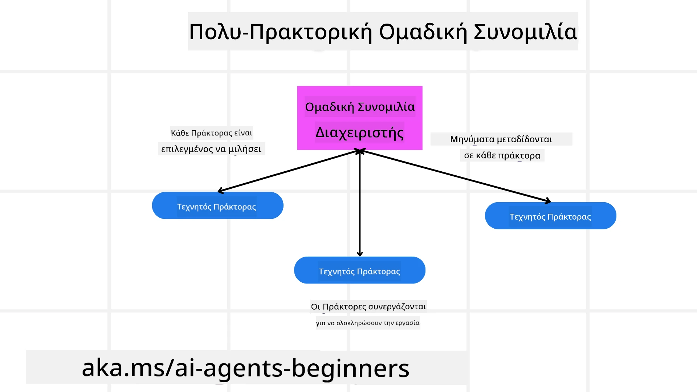
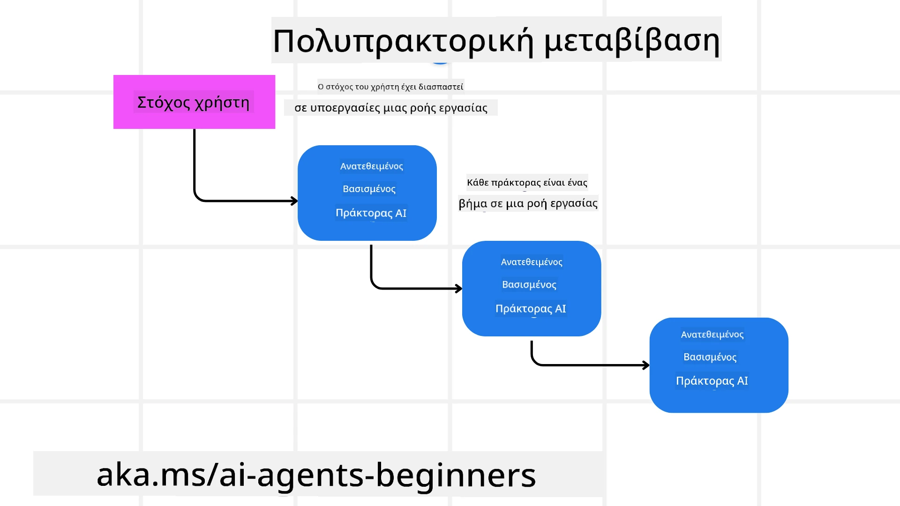
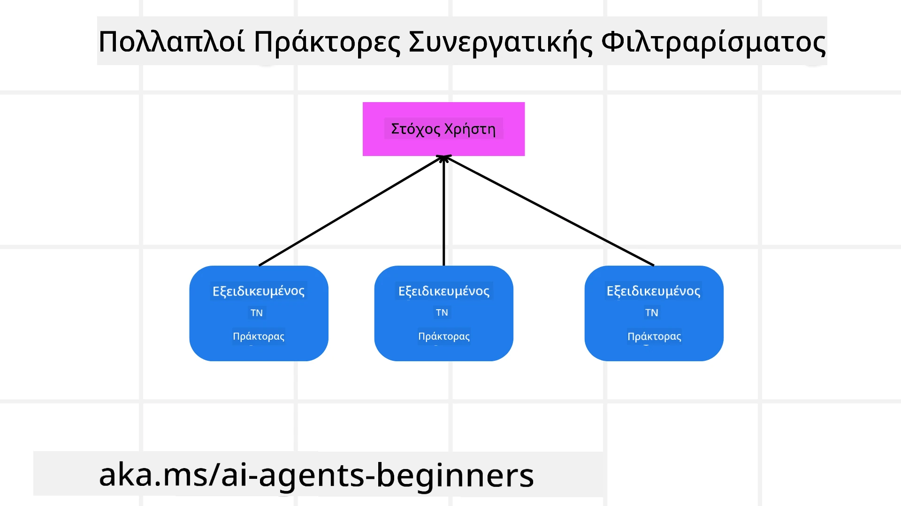

> _(Κάντε κλικ στην παραπάνω εικόνα για να δείτε το βίντεο αυτού του μαθήματος)_

# Πρότυπα σχεδίασης πολλαπλών πρακτόρων

Μόλις ξεκινήσετε να εργάζεστε σε ένα έργο που περιλαμβάνει πολλαπλούς πράκτορες, θα χρειαστεί να λάβετε υπόψη σας το πρότυπο σχεδίασης πολλαπλών πρακτόρων. Ωστόσο, ίσως να μην είναι άμεσα κατανοητό πότε πρέπει να περάσετε σε πολλαπλούς πράκτορες και ποια είναι τα πλεονεκτήματα.

## Εισαγωγή

Σε αυτό το μάθημα, επιδιώκουμε να απαντήσουμε στις ακόλουθες ερωτήσεις:

- Ποια είναι τα σενάρια όπου εφαρμόζονται οι πολλαπλοί πράκτορες;
- Ποια είναι τα πλεονεκτήματα της χρήσης πολλαπλών πρακτόρων αντί για έναν μοναδικό πράκτορα που κάνει πολλαπλές εργασίες;
- Ποια είναι τα δομικά στοιχεία για την υλοποίηση του προτύπου σχεδίασης πολλαπλών πρακτόρων;
- Πώς έχουμε ορατότητα στο πώς οι πολλαπλοί πράκτορες αλληλεπιδρούν μεταξύ τους;

## Στόχοι μάθησης

Μετά από αυτό το μάθημα, θα πρέπει να μπορείτε:

- Να εντοπίζετε σενάρια όπου εφαρμόζονται πολλαπλοί πράκτορες.
- Να αναγνωρίζετε τα πλεονεκτήματα της χρήσης πολλαπλών πρακτόρων έναντι ενός μοναδικού πράκτορα.
- Να κατανοείτε τα δομικά στοιχεία της υλοποίησης του προτύπου σχεδίασης πολλαπλών πρακτόρων.

Ποια είναι η μεγαλύτερη εικόνα;

*Οι πολλαπλοί πράκτορες είναι ένα πρότυπο σχεδίασης που επιτρέπει σε πολλούς πράκτορες να συνεργάζονται για να επιτύχουν έναν κοινό στόχο*.

Αυτό το πρότυπο χρησιμοποιείται ευρέως σε διάφορους τομείς, όπως η ρομποτική, τα αυτόνομα συστήματα και ο κατανεμημένος υπολογισμός.

## Σενάρια όπου εφαρμόζονται οι πολλαπλοί πράκτορες

Έτσι, ποια σενάρια είναι κατάλληλα για τη χρήση πολλαπλών πρακτόρων; Η απάντηση είναι ότι υπάρχουν πολλά σενάρια όπου η χρήση πολλαπλών πρακτόρων είναι επωφελής, ειδικά στις ακόλουθες περιπτώσεις:

- **Μεγάλο φόρτο εργασίας**: Οι μεγάλες εργασίες μπορούν να διαιρεθούν σε μικρότερες εργασίες και να ανατεθούν σε διαφορετικούς πράκτορες, επιτρέποντας παράλληλη επεξεργασία και ταχύτερη ολοκλήρωση. Ένα παράδειγμα αυτού είναι στην περίπτωση μιας μεγάλης εργασίας επεξεργασίας δεδομένων.
- **Πολύπλοκες εργασίες**: Οι πολύπλοκες εργασίες, όπως οι μεγάλες εργασίες, μπορούν να διασπαστούν σε μικρότερες υποεργασίες και να ανατεθούν σε διαφορετικούς πράκτορες, καθένας εστιάζοντας σε μια συγκεκριμένη πτυχή της εργασίας. Ένα καλό παράδειγμα αυτού είναι στην περίπτωση αυτόνομων οχημάτων όπου διαφορετικοί πράκτορες διαχειρίζονται την πλοήγηση, την ανίχνευση εμποδίων και την επικοινωνία με άλλα οχήματα.
- **Διαφορετική εξειδίκευση**: Διάφοροι πράκτορες μπορούν να έχουν διαφορετική εξειδίκευση, επιτρέποντάς τους να διαχειρίζονται διαφορετικές πτυχές μιας εργασίας πιο αποτελεσματικά από έναν μοναδικό πράκτορα. Για αυτή την περίπτωση, ένα καλό παράδειγμα είναι στον τομέα της υγειονομικής περίθαλψης όπου πράκτορες μπορούν να διαχειρίζονται διαγνώσεις, σχέδια θεραπείας και παρακολούθηση ασθενών.

## Πλεονεκτήματα της χρήσης πολλαπλών πρακτόρων έναντι ενός μοναδικού πράκτορα

Ένα σύστημα με έναν μοναδικό πράκτορα θα μπορούσε να λειτουργήσει καλά για απλές εργασίες, αλλά για πιο πολύπλοκες εργασίες, η χρήση πολλαπλών πρακτόρων μπορεί να προσφέρει αρκετά πλεονεκτήματα:

- **Εξειδίκευση**: Κάθε πράκτορας μπορεί να εξειδικεύεται σε μια συγκεκριμένη εργασία. Η έλλειψη εξειδίκευσης σε έναν μοναδικό πράκτορα σημαίνει ότι έχετε έναν πράκτορα που μπορεί να κάνει τα πάντα αλλά μπορεί να μπερδευτεί όταν αντιμετωπίζει μια πολύπλοκη εργασία. Για παράδειγμα, μπορεί να καταλήξει να εκτελεί μια εργασία για την οποία δεν είναι κατάλληλος.
- **Επεκτασιμότητα**: Είναι πιο εύκολο να επεκτείνετε τα συστήματα προσθέτοντας περισσότερους πράκτορες παρά υπερφορτώνοντας έναν μοναδικό πράκτορα.
- **Αντοχή στα σφάλματα**: Αν ένας πράκτορας αποτύχει, οι άλλοι μπορούν να συνεχίσουν να λειτουργούν, διασφαλίζοντας την αξιοπιστία του συστήματος.

Ας πάρουμε ένα παράδειγμα, ας κλείσουμε ένα ταξίδι για έναν χρήστη. Ένα σύστημα με έναν μοναδικό πράκτορα θα έπρεπε να διαχειρίζεται όλες τις πτυχές της διαδικασίας κράτησης ταξιδιού, από την εύρεση πτήσεων μέχρι την κράτηση ξενοδοχείων και ενοικίασης αυτοκινήτων. Για να επιτευχθεί αυτό με έναν μοναδικό πράκτορα, ο πράκτορας θα χρειαζόταν εργαλεία για να χειρίζεται όλες αυτές τις εργασίες. Αυτό θα μπορούσε να οδηγήσει σε ένα πολύπλοκο και μονολιθικό σύστημα που είναι δύσκολο στη συντήρηση και την κλιμάκωση. Αντίθετα, ένα σύστημα με πολλούς πράκτορες θα μπορούσε να έχει διαφορετικούς πράκτορες, εξειδικευμένους στην εύρεση πτήσεων, στην κράτηση ξενοδοχείων και στην ενοικίαση αυτοκινήτων. Αυτό θα έκανε το σύστημα πιο αρθρωτό, πιο εύκολο στη συντήρηση και επεκτάσιμο.

Συγκρίνετε το αυτό με ένα ταξιδιωτικό γραφείο που λειτουργεί ως οικογενειακή επιχείρηση σε σχέση με ένα ταξιδιωτικό γραφείο που λειτουργεί ως franchise. Το οικογενειακό γραφείο θα είχε έναν πράκτορα να διαχειρίζεται όλες τις πτυχές της διαδικασίας κράτησης ταξιδιού, ενώ το franchise θα είχε διαφορετικούς πράκτορες να διαχειρίζονται διαφορετικές πτυχές της διαδικασίας.

## Δομικά στοιχεία για την υλοποίηση του προτύπου σχεδίασης πολλαπλών πρακτόρων

Πριν μπορέσετε να υλοποιήσετε το πρότυπο σχεδίασης πολλαπλών πρακτόρων, πρέπει να κατανοήσετε τα δομικά στοιχεία που συνθέτουν το πρότυπο.

Ας κάνουμε αυτό πιο συγκεκριμένο κοιτώντας ξανά το παράδειγμα της κράτησης ενός ταξιδιού για έναν χρήστη. Σε αυτή την περίπτωση, τα δομικά στοιχεία θα περιελάμβαναν:

- **Επικοινωνία πρακτόρων**: Οι πράκτορες για την εύρεση πτήσεων, την κράτηση ξενοδοχείων και ενοικίασης αυτοκινήτων πρέπει να επικοινωνούν και να μοιράζονται πληροφορίες σχετικά με τις προτιμήσεις και τους περιορισμούς του χρήστη. Πρέπει να αποφασίσετε σχετικά με τα πρωτόκολλα και τις μεθόδους για αυτή την επικοινωνία. Τι σημαίνει αυτό συγκεκριμένα: ο πράκτορας για την εύρεση πτήσεων πρέπει να επικοινωνεί με τον πράκτορα για την κράτηση ξενοδοχείων για να διασφαλιστεί ότι το ξενοδοχείο έχει κρατηθεί για τις ίδιες ημερομηνίες με την πτήση. Αυτό σημαίνει ότι οι πράκτορες πρέπει να μοιράζονται πληροφορίες σχετικά με τις ημερομηνίες ταξιδιού του χρήστη, δηλαδή πρέπει να αποφασίσετε *ποιοι πράκτορες μοιράζονται πληροφορίες και πώς τις μοιράζονται*.
- **Μηχανισμοί συντονισμού**: Οι πράκτορες πρέπει να συντονίζουν τις ενέργειές τους για να διασφαλίσουν ότι οι προτιμήσεις και οι περιορισμοί του χρήστη ικανοποιούνται. Μια προτίμηση χρήστη μπορεί να είναι να θέλει ένα ξενοδοχείο κοντά στο αεροδρόμιο, ενώ ένας περιορισμός μπορεί να είναι ότι τα ενοικιαζόμενα αυτοκίνητα είναι διαθέσιμα μόνο στο αεροδρόμιο. Αυτό σημαίνει ότι ο πράκτορας για την κράτηση ξενοδοχείων πρέπει να συντονίζεται με τον πράκτορα για την κράτηση ενοικιαζόμενων αυτοκινήτων ώστε να πληρούνται οι προτιμήσεις και οι περιορισμοί του χρήστη. Αυτό σημαίνει ότι πρέπει να αποφασίσετε *πώς οι πράκτορες συντονίζουν τις ενέργειές τους*.
- **Αρχιτεκτονική πρακτόρων**: Οι πράκτορες πρέπει να έχουν την εσωτερική δομή για να λαμβάνουν αποφάσεις και να μαθαίνουν από τις αλληλεπιδράσεις τους με τον χρήστη. Αυτό σημαίνει ότι ο πράκτορας για την εύρεση πτήσεων πρέπει να έχει την εσωτερική δομή για να λαμβάνει αποφάσεις σχετικά με το ποιες πτήσεις θα προτείνει στον χρήστη. Αυτό σημαίνει ότι πρέπει να αποφασίσετε *πώς οι πράκτορες λαμβάνουν αποφάσεις και μαθαίνουν από τις αλληλεπιδράσεις με τον χρήστη*. Παραδείγματα για το πώς ένας πράκτορας μαθαίνει και βελτιώνεται θα μπορούσαν να είναι ότι ο πράκτορας για την εύρεση πτήσεων μπορεί να χρησιμοποιεί ένα μοντέλο μηχανικής μάθησης για να προτείνει πτήσεις στον χρήστη βάσει των προηγούμενων προτιμήσεών του.
- **Ορατότητα στις αλληλεπιδράσεις των πολλαπλών πρακτόρων**: Πρέπει να έχετε ορατότητα στο πώς οι πολλοί πράκτορες αλληλεπιδρούν μεταξύ τους. Αυτό σημαίνει ότι πρέπει να έχετε εργαλεία και τεχνικές για την παρακολούθηση των δραστηριοτήτων και αλληλεπιδράσεων των πρακτόρων. Αυτό μπορεί να είναι με τη μορφή εργαλείων καταγραφής και παρακολούθησης, εργαλείων οπτικοποίησης και μετρικών απόδοσης.
- **Πρότυπα πολλαπλών πρακτόρων**: Υπάρχουν διαφορετικά πρότυπα για την υλοποίηση συστημάτων πολλαπλών πρακτόρων, όπως κεντρικοποιημένες, αποκεντρωμένες και υβριδικές αρχιτεκτονικές. Πρέπει να αποφασίσετε ποιο πρότυπο ταιριάζει καλύτερα στη χρήση σας.
- **Ανθρώπινος στον βρόχο**: Στις περισσότερες περιπτώσεις, θα υπάρχει άνθρωπος στον βρόχο και πρέπει να καθοδηγήσετε τους πράκτορες πότε να ζητούν ανθρώπινη παρέμβαση. Αυτό μπορεί να συμβαίνει όταν ένας χρήστης ζητά ένα συγκεκριμένο ξενοδοχείο ή πτήση που οι πράκτορες δεν έχουν προτείνει ή ζητά επιβεβαίωση πριν την κράτηση πτήσης ή ξενοδοχείου.

## Ορατότητα στις αλληλεπιδράσεις των πολλαπλών πρακτόρων

Είναι σημαντικό να έχετε ορατότητα στο πώς οι πολλαπλοί πράκτορες αλληλεπιδρούν μεταξύ τους. Αυτή η ορατότητα είναι απαραίτητη για εντοπισμό σφαλμάτων, βελτιστοποίηση και διασφάλιση της συνολικής αποτελεσματικότητας του συστήματος. Για να το πετύχετε αυτό, πρέπει να έχετε εργαλεία και τεχνικές για την παρακολούθηση των δραστηριοτήτων και αλληλεπιδράσεων των πρακτόρων. Αυτό μπορεί να είναι με τη μορφή εργαλείων καταγραφής και παρακολούθησης, εργαλείων οπτικοποίησης και μετρικών απόδοσης.

Για παράδειγμα, στην περίπτωση κράτησης ταξιδιού για έναν χρήστη, θα μπορούσατε να έχετε έναν πίνακα ελέγχου που να δείχνει την κατάσταση κάθε πράκτορα, τις προτιμήσεις και τους περιορισμούς του χρήστη, και τις αλληλεπιδράσεις μεταξύ των πρακτόρων. Αυτός ο πίνακας θα μπορούσε να δείχνει τις ημερομηνίες ταξιδιού του χρήστη, τις πτήσεις που προτείνει ο πράκτορας πτήσεων, τα ξενοδοχεία που προτείνει ο πράκτορας ξενοδοχείων και τα ενοικιαζόμενα αυτοκίνητα που προτείνει ο πράκτορας ενοικίασης αυτοκινήτων. Αυτό θα σας έδινε μια καθαρή εικόνα για το πώς οι πράκτορες αλληλεπιδρούν μεταξύ τους και αν οι προτιμήσεις και οι περιορισμοί του χρήστη ικανοποιούνται.

Ας δούμε κάθε μια από αυτές τις πτυχές πιο αναλυτικά.

- **Εργαλεία καταγραφής και παρακολούθησης**: Θέλετε να καταγράφεται κάθε ενέργεια που εκτελεί ένας πράκτορας. Μια καταχώρηση καταγραφής μπορεί να αποθηκεύει πληροφορίες για τον πράκτορα που εκτέλεσε την ενέργεια, την ενέργεια που εκτελέστηκε, το χρόνο εκτέλεσης και το αποτέλεσμα της ενέργειας. Αυτές οι πληροφορίες μπορούν να χρησιμοποιηθούν για εντοπισμό σφαλμάτων, βελτιστοποίηση και άλλα.
  
- **Εργαλεία οπτικοποίησης**: Τα εργαλεία οπτικοποίησης μπορούν να σας βοηθήσουν να δείτε τις αλληλεπιδράσεις μεταξύ των πρακτόρων με πιο διαισθητικό τρόπο. Για παράδειγμα, θα μπορούσατε να έχετε ένα γράφημα που δείχνει τη ροή πληροφοριών μεταξύ των πρακτόρων. Αυτό μπορεί να σας βοηθήσει να εντοπίσετε σημεία συμφόρησης, αναποτελεσματικότητες και άλλα προβλήματα στο σύστημα.

- **Μετρικές απόδοσης**: Οι μετρικές απόδοσης μπορούν να σας βοηθήσουν να παρακολουθείτε την αποτελεσματικότητα του συστήματος πολλαπλών πρακτόρων. Για παράδειγμα, θα μπορούσατε να παρακολουθείτε τον χρόνο που χρειάζεται για να ολοκληρωθεί μια εργασία, τον αριθμό των εργασιών που ολοκληρώνονται ανά μονάδα χρόνου και την ακρίβεια των προτάσεων που κάνουν οι πράκτορες. Αυτές οι πληροφορίες μπορούν να σας βοηθήσουν να εντοπίσετε περιοχές για βελτίωση και να βελτιστοποιήσετε το σύστημα.

## Πρότυπα πολλαπλών πρακτόρων

Ας εξετάσουμε μερικά συγκεκριμένα πρότυπα που μπορούμε να χρησιμοποιήσουμε για να δημιουργήσουμε εφαρμογές πολλαπλών πρακτόρων. Εδώ υπάρχουν μερικά ενδιαφέροντα πρότυπα που αξίζει να λάβετε υπόψη:

### Συνομιλία ομάδας

Αυτό το πρότυπο είναι χρήσιμο όταν θέλετε να δημιουργήσετε μια εφαρμογή συνομιλίας ομάδας όπου πολλοί πράκτορες μπορούν να επικοινωνούν μεταξύ τους. Τυπικές χρήσεις για αυτό το πρότυπο περιλαμβάνουν τη συνεργασία ομάδας, την υποστήριξη πελατών και τα κοινωνικά δίκτυα.

Σε αυτό το πρότυπο, κάθε πράκτορας αντιπροσωπεύει έναν χρήστη στη συνομιλία ομάδας, και τα μηνύματα ανταλλάσσονται μεταξύ πρακτόρων χρησιμοποιώντας ένα πρωτόκολλο μηνυμάτων. Οι πράκτορες μπορούν να στέλνουν μηνύματα στη συνομιλία ομάδας, να λαμβάνουν μηνύματα από τη συνομιλία ομάδας και να απαντούν σε μηνύματα άλλων πρακτόρων.

Αυτό το πρότυπο μπορεί να υλοποιηθεί χρησιμοποιώντας μια κεντρικοποιημένη αρχιτεκτονική όπου όλα τα μηνύματα δρομολογούνται μέσω ενός κεντρικού διακομιστή, ή μια αποκεντρωμένη αρχιτεκτονική όπου τα μηνύματα ανταλλάσσονται απευθείας.

### Μεταβίβαση εργασίας

Αυτό το πρότυπο είναι χρήσιμο όταν θέλετε να δημιουργήσετε μια εφαρμογή όπου πολλοί πράκτορες μπορούν να μεταβιβάζουν εργασίες μεταξύ τους.

Τυπικές χρήσεις για αυτό το πρότυπο περιλαμβάνουν την υποστήριξη πελατών, τη διαχείριση εργασιών και την αυτοματοποίηση ροής εργασιών.

Σε αυτό το πρότυπο, κάθε πράκτορας αντιπροσωπεύει μια εργασία ή ένα βήμα σε μια ροή εργασιών, και οι πράκτορες μπορούν να μεταβιβάζουν εργασίες σε άλλους πράκτορες βάσει προκαθορισμένων κανόνων.

### Συνεργατική φιλτράρισμα

Αυτό το πρότυπο είναι χρήσιμο όταν θέλετε να δημιουργήσετε μια εφαρμογή όπου πολλοί πράκτορες μπορούν να συνεργάζονται για να κάνουν προτάσεις σε χρήστες.

Ο λόγος που θα θέλατε πολλαπλούς πράκτορες να συνεργάζονται είναι ότι κάθε πράκτορας μπορεί να έχει διαφορετική εξειδίκευση και να συνεισφέρει στη διαδικασία πρότασης με διαφορετικούς τρόπους.

Ας πάρουμε το παράδειγμα όπου ένας χρήστης θέλει μια πρόταση για τη καλύτερη μετοχή προς αγορά στην αγορά μετοχών.

- **Ειδικός κλάδου**: Ένας πράκτορας θα μπορούσε να είναι ειδικός σε έναν συγκεκριμένο κλάδο.
- **Τεχνική ανάλυση**: Ένας άλλος πράκτορας θα μπορούσε να είναι ειδικός στην τεχνική ανάλυση.
- **Θεμελιώδης ανάλυση**: και ένας άλλος πράκτορας θα μπορούσε να είναι ειδικός στη θεμελιώδη ανάλυση. Συνεργαζόμενοι, αυτοί οι πράκτορες μπορούν να παρέχουν μια πιο ολοκληρωμένη πρόταση στον χρήστη.

## Σενάριο: Διαδικασία επιστροφής χρημάτων

Σκεφτείτε ένα σενάριο όπου ένας πελάτης προσπαθεί να λάβει επιστροφή χρημάτων για ένα προϊόν. Μπορεί να εμπλέκονται αρκετοί πράκτορες σε αυτή τη διαδικασία, αλλά ας τη χωρίσουμε μεταξύ πρακτόρων ειδικών για αυτή τη διαδικασία και γενικών πρακτόρων που μπορούν να χρησιμοποιηθούν σε άλλες διαδικασίες.

**Πράκτορες ειδικοί για τη διαδικασία επιστροφής χρημάτων**:

Ακολουθούν μερικοί πράκτορες που θα μπορούσαν να εμπλέκονται στη διαδικασία επιστροφής χρημάτων:

- **Πράκτορας πελάτη**: Αυτός ο πράκτορας αντιπροσωπεύει τον πελάτη και είναι υπεύθυνος για την έναρξη της διαδικασίας επιστροφής χρημάτων.
- **Πράκτορας πωλητή**: Αυτός ο πράκτορας αντιπροσωπεύει τον πωλητή και είναι υπεύθυνος για την επεξεργασία της επιστροφής χρημάτων.
- **Πράκτορας πληρωμών**: Αυτός ο πράκτορας αντιπροσωπεύει τη διαδικασία πληρωμής και είναι υπεύθυνος για την επιστροφή της πληρωμής στον πελάτη.
- **Πράκτορας επίλυσης**: Αυτός ο πράκτορας αντιπροσωπεύει τη διαδικασία επίλυσης και είναι υπεύθυνος για την επίλυση οποιωνδήποτε ζητημάτων προκύψουν κατά τη διαδικασία επιστροφής χρημάτων.
- **Πράκτορας συμμόρφωσης**: Αυτός ο πράκτορας αντιπροσωπεύει τη διαδικασία συμμόρφωσης και είναι υπεύθυνος για τη διασφάλιση ότι η διαδικασία επιστροφής χρημάτων συμμορφώνεται με κανονισμούς και πολιτικές.

**Γενικοί πράκτορες**:

Αυτοί οι πράκτορες μπορούν να χρησιμοποιηθούν και σε άλλα μέρη της επιχείρησής σας.

- **Πράκτορας αποστολής**: Αυτός ο πράκτορας αντιπροσωπεύει τη διαδικασία αποστολής και είναι υπεύθυνος για την αποστολή του προϊόντος πίσω στον πωλητή. Αυτός ο πράκτορας μπορεί να χρησιμοποιηθεί τόσο για τη διαδικασία επιστροφής χρημάτων όσο και για τη γενική αποστολή προϊόντος μέσω μιας αγοράς, για παράδειγμα.
- **Πράκτορας ανατροφοδότησης**: Αυτός ο πράκτορας αντιπροσωπεύει τη διαδικασία συλλογής ανατροφοδότησης και είναι υπεύθυνος για τη συλλογή ανατροφοδότησης από τον πελάτη. Η ανατροφοδότηση μπορεί να δοθεί οποιαδήποτε στιγμή και όχι μόνο κατά τη διάρκεια της διαδικασίας επιστροφής χρημάτων.
- **Πράκτορας κλιμάκωσης**: Αυτός ο πράκτορας αντιπροσωπεύει τη διαδικασία κλιμάκωσης και είναι υπεύθυνος για την κλιμάκωση ζητημάτων σε ανώτερο επίπεδο υποστήριξης. Μπορείτε να χρησιμοποιήσετε αυτόν τον τύπο πράκτορα για οποιαδήποτε διαδικασία όπου χρειάζεται να κλιμακωθεί ένα ζήτημα.
- **Πράκτορας ειδοποιήσεων**: Αυτός ο πράκτορας αντιπροσωπεύει τη διαδικασία ειδοποιήσεων και είναι υπεύθυνος για την αποστολή ειδοποιήσεων στον πελάτη σε διάφορα στάδια της διαδικασίας επιστροφής χρημάτων.
- **Πράκτορας αναλύσεων**: Αυτός ο πράκτορας αντιπροσωπεύει τη διαδικασία αναλύσεων και είναι υπεύθυνος για την ανάλυση δεδομένων που σχετίζονται με τη διαδικασία επιστροφής χρημάτων.
- **Πράκτορας ελέγχου**: Αυτός ο πράκτορας αντιπροσωπεύει τη διαδικασία ελέγχου και είναι υπεύθυνος για τον έλεγχο της διαδικασίας επιστροφής χρημάτων ώστε να διασφαλίζεται ότι εκτελείται σωστά.
- **Πράκτορας αναφορών**: Αυτός ο πράκτορας αντιπροσωπεύει τη διαδικασία αναφορών και είναι υπεύθυνος για τη δημιουργία αναφορών σχετικά με τη διαδικασία επιστροφής χρημάτων.
- **Πράκτορας γνώσης**: Αυτός ο πράκτορας αντιπροσωπεύει τη διαδικασία γνώσης και είναι υπεύθυνος για τη διαχείριση μιας βάσης γνώσεων που αφορά τη διαδικασία επιστροφής χρημάτων. Αυτός ο πράκτορας μπορεί να είναι γνώστης τόσο για τις επιστροφές όσο και για άλλα μέρη της επιχείρησής σας.
- **Πράκτορας ασφάλειας**: Αυτός ο πράκτορας αντιπροσωπεύει τη διαδικασία ασφάλειας και είναι υπεύθυνος για τη διασφάλιση της ασφάλειας της διαδικασίας επιστροφής χρημάτων.
- **Πράκτορας ποιότητας**: Αυτός ο πράκτορας αντιπροσωπεύει τη διαδικασία ποιότητας και είναι υπεύθυνος για τη διασφάλιση της ποιότητας της διαδικασίας επιστροφής χρημάτων.

Υπάρχουν αρκετοί πράκτορες που αναφέρθηκαν προηγουμένως, τόσο για τη συγκεκριμένη διαδικασία επιστροφής χρημάτων, όσο και για τους γενικούς πράκτορες που μπορούν να χρησιμοποιηθούν σε άλλα μέρη της επιχείρησής σας. Ελπίζουμε αυτό να σας δώσει μια ιδέα για το πώς μπορείτε να αποφασίσετε ποιοι πράκτορες θα χρησιμοποιηθούν στο σύστημα πολλαπλών πρακτόρων σας.

## Άσκηση

Σχεδιάστε ένα σύστημα πολλαπλών πρακτόρων για μια διαδικασία υποστήριξης πελατών. Εντοπίστε τους πράκτορες που εμπλέκονται στη διαδικασία, τους ρόλους και τις ευθύνες τους, και πώς αλληλεπιδρούν μεταξύ τους. Λάβετε υπόψη τόσο τους πράκτορες συγκεκριμένους για τη διαδικασία υποστήριξης πελατών όσο και τους γενικούς πράκτορες που μπορούν να χρησιμοποιηθούν και σε άλλα μέρη της επιχείρησής σας.
> Σκεφτείτε πριν διαβάσετε την παρακάτω λύση, μπορεί να χρειαστείτε περισσότερους πράκτορες από ό,τι νομίζετε.

> TIP: Σκεφτείτε τις διαφορετικές φάσεις της διαδικασίας υποστήριξης πελατών και επίσης λάβετε υπόψη τους πράκτορες που χρειάζονται για οποιοδήποτε σύστημα.

## Λύση

[Solution](./solution/solution.md)

## Έλεγχος γνώσεων

### Ερώτηση 1

Ποιο σενάριο ταιριάζει καλύτερα σε ένα σύστημα πολλαπλών πρακτόρων;

- [ ] A1: Ένας υποστηρικτικός bot απαντά σε συχνές ερωτήσεις χρησιμοποιώντας μια βάση γνώσεων και ένα μικρό σύνολο εργαλείων.
- [ ] A2: Μια ροή επιστροφής χρημάτων χρειάζεται ξεχωριστούς ρόλους απάτης, πληρωμών και συμμόρφωσης, καθένας με τα δικά του εργαλεία, και τα αποτελέσματά τους πρέπει να συντονιστούν.
- [ ] A3: Το ίδιο απλό αίτημα ταξινόμησης φτάνει χιλιάδες φορές ανά ώρα.

### Ερώτηση 2

Πότε είναι συνήθως καλύτερη επιλογή ένας μόνος πράκτορας;

- [ ] A1: Η εργασία μπορεί να αντιμετωπιστεί με ένα σύνολο οδηγιών και εργαλείων, χωρίς μεταβιβάσεις σε ειδικούς.
- [ ] A2: Ο πράκτορας έχει πρόσβαση σε περισσότερα από ένα εργαλεία.
- [ ] A3: Η ροή εργασίας απαιτεί ξεχωριστούς ρόλους με διαφορετικά δικαιώματα και ανεξάρτητα ίχνη ελέγχου.

[Solution quiz](./solution/solution-quiz.md)

## Περίληψη

Σε αυτό το μάθημα, εξετάσαμε το μοτίβο σχεδιασμού πολλαπλών πρακτόρων, συμπεριλαμβανομένων των σεναρίων όπου εφαρμόζεται το multi-agent, τα πλεονεκτήματα της χρήσης πολλαπλών πρακτόρων έναντι ενός μοναδικού πράκτορα, τα βασικά στοιχεία για την υλοποίηση του μοτίβου σχεδιασμού πολλαπλών πρακτόρων και πώς να έχετε ορατότητα στον τρόπο με τον οποίο αλληλεπιδρούν οι πολλαπλοί πράκτορες μεταξύ τους.

### Έχετε Περισσότερες Ερωτήσεις για το Μοτίβο Σχεδιασμού Multi-Agent;

Εγγραφείτε στο [Microsoft Foundry Discord](https://discord.com/invite/ATgtXmAS5D) για να συναντήσετε άλλους μαθητευόμενους, να παρακολουθήσετε τις ώρες γραφείου και να πάρετε απαντήσεις στις ερωτήσεις σας για τους Πράκτορες Τεχνητής Νοημοσύνης.

## Επιπλέον πόροι

- <a href="https://learn.microsoft.com/azure/ai-services/agents/overview" target="_blank">Τεκμηρίωση πλαισίου λειτουργίας Microsoft Agent</a>
- <a href="https://www.analyticsvidhya.com/blog/2024/10/agentic-design-patterns/" target="_blank">Μοτίβα σχεδιασμού πρακτόρων</a>

## Προηγούμενο Μάθημα

[Planning Design](../07-planning-design/README.md)

## Επόμενο Μάθημα

[Metacognition in AI Agents](../09-metacognition/README.md)

---

<!-- CO-OP TRANSLATOR DISCLAIMER START -->
**Αποποίηση ευθυνών**:
Αυτό το έγγραφο έχει μεταφραστεί χρησιμοποιώντας την υπηρεσία μετάφρασης με τεχνητή νοημοσύνη [Co-op Translator](https://github.com/Azure/co-op-translator). Ενώ επιδιώκουμε την ακρίβεια, παρακαλούμε να έχετε υπόψη ότι οι αυτοματοποιημένες μεταφράσεις ενδέχεται να περιέχουν λάθη ή ανακρίβειες. Το πρωτότυπο έγγραφο στη μητρική του γλώσσα πρέπει να θεωρείται η αυθεντική πηγή. Για κρίσιμες πληροφορίες, συνιστάται επαγγελματική ανθρώπινη μετάφραση. Δεν φέρουμε ευθύνη για τυχόν παρεξηγήσεις ή λανθασμένες ερμηνείες που προκύπτουν από τη χρήση αυτής της μετάφρασης.
<!-- CO-OP TRANSLATOR DISCLAIMER END -->