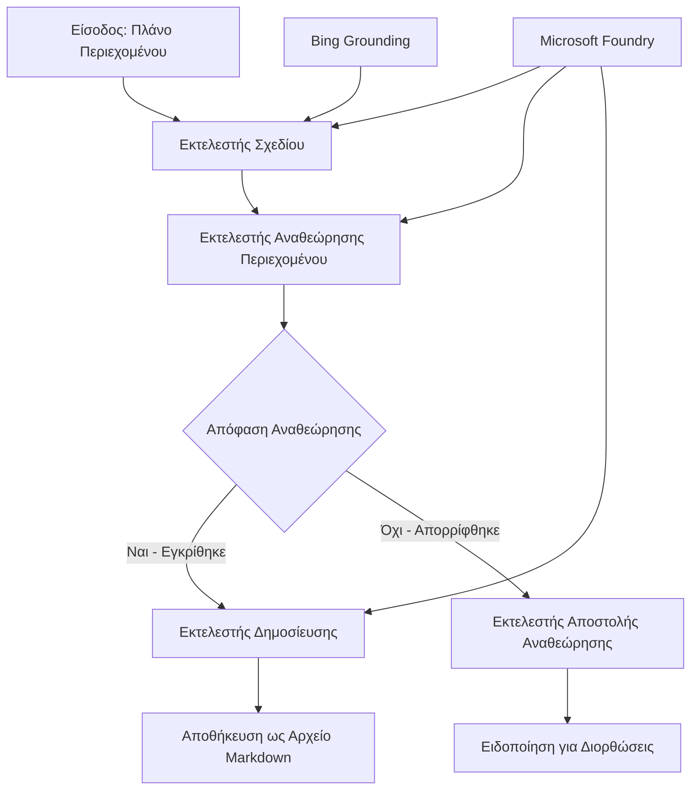

# 🔀 Ροές Εργασίας Υπό Όρους με το Microsoft Foundry (.NET)

## 📋 Εκμάθηση Ροών Εργασίας Βασισμένων σε Ευφυείς Αποφάσεις

Αυτό το σημειωματάριο παρουσιάζει **προτύπα ροών εργασίας υπό όρους** χρησιμοποιώντας το Microsoft Foundry και το Microsoft Agent Framework για .NET. Θα μάθετε πώς να δημιουργείτε εξελιγμένες, καθοδηγούμενες από αποφάσεις ροές εργασίας που δρομολογούν έξυπνα την επεξεργασία βάσει ανάλυσης AI, επιχειρησιακών κανόνων και δυναμικών συνθηκών για αυτοματοποίηση επιπέδου επιχειρήσεων.

## 🎯 Μαθησιακοί Στόχοι

### 🧠 **Αρχιτεκτονική Ευφυούς Απόφασης**
- **Υλοποίηση Υπό Όρους Λογικής**: Δημιουργία σύνθετων δέντρων απόφασης με πολλαπλά σημεία διακλάδωσης
- **Δρομολόγηση με Δύναμη Τεχνητής Νοημοσύνης**: Χρήση μοντέλων Microsoft Foundry για έξυπνες αποφάσεις δρομολόγησης
- **Δυναμική Προσαρμογή Ροής Εργασίας**: Τροποποίηση συμπεριφοράς ροής εργασίας βάσει ανάλυσης και συνθηκών κατά την εκτέλεση
- **Ενσωμάτωση Κανονισμών Επιχειρήσεων**: Ενσωμάτωση επιχειρηματικής λογικής και απαιτήσεων συμμόρφωσης στις ροές εργασίας

### 🔀 **Προηγμένα Υπό Όρους Πρότυπα**
- **Λήψη Απόφασης με Πολλαπλά Κριτήρια**: Αξιολόγηση πολλαπλών παραγόντων για τις αποφάσεις δρομολόγησης
- **Επεξεργασία με Ενημέρωση Πλαισίου**: Λήψη αποφάσεων βάσει συσσωρευμένου πλαισίου και ιστορικού ροής εργασίας
- **Προσαρμοστική Τροποποίηση Ροής Εργασίας**: Δυναμική προσαρμογή διαδρομών επεξεργασίας βάσει συνθηκών σε πραγματικό χρόνο
- **Ενσωμάτωση Μηχανής Κανόνων**: Υλοποίηση σύνθετων μηχανών επιχειρησιακών κανόνων μέσα σε ροές εργασίας

### 🏢 **Εφαρμογές Υπό Όρους Επιχειρήσεων**
- **Κατηγοριοποίηση & Δρομολόγηση Εγγράφων**: Αυτόματη κατηγοριοποίηση και δρομολόγηση εγγράφων σε κατάλληλες ροές εργασίας
- **Διαλογή Εξυπηρέτησης Πελατών**: Έξυπνη δρομολόγηση ερωτημάτων πελατών σε εξειδικευμένες ομάδες διαχείρισης
- **Επεξεργασία Συμμόρφωσης & Κινδύνου**: Εφαρμογή διαφορετικών διαδικασιών επαλήθευσης και αναθεώρησης βάσει αξιολόγησης κινδύνου
- **Ροές Εργασίας Διασφάλισης Ποιότητας**: Δρομολόγηση περιεχομένου μέσω κατάλληλων διαδικασιών αναθεώρησης βάσει μετρικών ποιότητας

## ⚙️ Απαιτήσεις & Ρύθμιση

### 📦 **Απαιτούμενα Πακέτα NuGet**

Προηγμένα πακέτα για την επεξεργασία ροών εργασίας υπό όρους:

```xml
<!-- Core AI Framework -->
<PackageReference Include="Microsoft.Extensions.AI" Version="9.9.0" />

<!-- Azure AI Agents with Persistent State -->
<PackageReference Include="Azure.AI.Agents.Persistent" Version="1.2.0-beta.5" />

<!-- Azure Identity and Utilities -->
<PackageReference Include="Azure.Identity" Version="1.15.0" />
<PackageReference Include="System.Linq.Async" Version="6.0.3" />
<PackageReference Include="DotNetEnv" Version="3.1.1" />

<!-- Local Workflow Framework References -->
<!-- Microsoft.Agents.Workflows.dll - Advanced workflow orchestration -->
<!-- Microsoft.Agents.AI.AzureAI.dll - Microsoft Foundry integration -->
<!-- Microsoft.Agents.AI.dll - Core agent abstractions -->
```

### 🔑 **Διαμόρφωση Microsoft Foundry**

**Απαραίτητοι Πόροι Azure:**
- Χώρος εργασίας Microsoft Foundry με μοντέλα επεξεργασίας υπό όρους
- Συνδρομή Azure με κατάλληλα όρια και δικαιώματα υπολογισμού
- Ανεπτυγμένα μοντέλα AI για λήψη αποφάσεων και ανάλυση περιεχομένου
- (Προαιρετικό) Σύνδεση με API Bing Search για δυνατότητες τεκμηρίωσης

**Διαμόρφωση Περιβάλλοντος (.env αρχείο):**
```env
# Microsoft Foundry Configuration
AZURE_AI_PROJECT_ENDPOINT=https://your-project.cognitiveservices.azure.com/
BING_CONNECTION_ID=your-bing-connection-id
```

**Ρύθμιση Πιστοποίησης:**
```csharp
// Azure CLI or Managed Identity authentication
using Azure.Identity;
var credential = new AzureCliCredential();

// Load environment configuration
DotNetEnv.Env.Load("../../../.env");
```

### 🏗️ **Αρχιτεκτονική Ροής Εργασίας Υπό Όρους**



**Κύρια Συστατικά:**
- **Draft Executor**: Αντιπρόσωπος AI που δημιουργεί αρχικά προσχέδια περιεχομένου από περίληψη
- **Content Review Executor**: Αντιπρόσωπος AI που αξιολογεί την ποιότητα και συμβατότητα προσχεδίων
- **Conditional Routing**: Λογική απόφασης που δρομολογεί βάσει αποτελεσμάτων αξιολόγησης
- **Διαδρομές Δημοσίευσης/Αναθεώρησης**: Ξεχωριστές διαδρομές επεξεργασίας για εγκεκριμένο έναντι απορριφθέντος περιεχομένου
- **Διαχείριση Κατάστασης**: Διατηρεί το περιεχόμενο και το πλαίσιο αναθεώρησης καθ’ όλη τη διάρκεια της ροής

## 🎨 **Πρότυπα Σχεδίασης Ροών Εργασίας Υπό Όρους**

### 📋 **Παραγωγή Περιεχομένου με Πύλες Ποιότητας**
```
Outline → Draft Creation → Quality Review → {Approve: Publish | Reject: Revise}
```

### 🎯 **Επεξεργασία Εγγράφων Βάσει Κινδύνου**
```
Document → Risk Assessment → {Low: Standard | High: Enhanced Review}
```

### 🔍 **Έξυπνη Δρομολόγηση Εξυπηρέτησης Πελατών**
```
Customer Query → Analysis → {Simple: FAQ Bot | Complex: Human Agent}
```

### 💼 **Ροές Εργασίας Καθοδηγούμενες από Συμμόρφωση**
```
Content → Compliance Check → {Pass: Publish | Fail: Legal Review}
```

## 🏢 **Οφέλη Υπό Όρους Ροών Επιχειρήσεων**

### 🎯 **Έξυπνη Αυτοματοποίηση**
- **Έξυπνη Λήψη Αποφάσεων**: Αποφάσεις δρομολόγησης με τεχνητή νοημοσύνη βάσει ανάλυσης περιεχομένου και πλαισίου
- **Προσαρμοστική Επεξεργασία**: Ροές εργασίας που προσαρμόζονται αυτόματα βάσει μεταβαλλόμενων συνθηκών
- **Εφαρμογή Επιχειρησιακών Κανόνων**: Αυτόματη εφαρμογή σύνθετης επιχειρησιακής λογικής και πολιτικών
- **Δρομολόγηση με Αναγνώριση Πλαισίου**: Αποφάσεις βασισμένες σε ολόκληρο το ιστορικό και το συσσωρευμένο πλαίσιο ροής εργασίας

### 📈 **Επιχειρησιακή Αριστεία**
- **Βελτιστοποιημένη Κατανομή Πόρων**: Δρομολόγηση εργασιών στους πιο κατάλληλους ειδικούς και διαδικασίες
- **Μείωση Χειροκίνητης Παρέμβασης**: Η αυτοματοποιημένη λήψη αποφάσεων ελαχιστοποιεί την ανάγκη χειροκίνητης δρομολόγησης
- **Ταχύτερους Χρόνους Επίλυσης**: Άμεση δρομολόγηση στην κατάλληλη εμπειρογνωμοσύνη και δυνατότητες επεξεργασίας
- **Συνεπής Εφαρμογή**: Ομοιόμορφη εφαρμογή επιχειρησιακών κανόνων και κριτηρίων απόφασης

### 🛡️ **Διαχείριση Κινδύνου & Συμμόρφωση**
- **Αυτοματοποιημένη Αξιολόγηση Κινδύνου**: Αξιολόγηση επιπέδων κινδύνου περιεχομένου και κατάστασης με AI
- **Επιβολή Συμμόρφωσης**: Αυτόματη δρομολόγηση μέσω απαιτούμενων κανονιστικών διαδικασιών
- **Εφαρμογή Πρωτοκόλλων Ασφαλείας**: Ενισχυμένα μέτρα ασφαλείας βάσει αξιολόγησης κινδύνου
- **Διατήρηση Ιχνηλασιμότητας**: Πλήρης τεκμηρίωση αποφάσεων δρομολόγησης και αιτιολόγησης

### 📊 **Ανάλυση & Συνεχής Βελτίωση**
- **Ανάλυση Αποφάσεων**: Παρακολούθηση αποτελεσματικότητας και ακρίβειας αποφάσεων δρομολόγησης
- **Αναγνώριση Προτύπων**: Εντοπισμός τάσεων και προτύπων σε αποφάσεις δρομολόγησης με την πάροδο του χρόνου
- **Βελτιστοποίηση Απόδοσης**: Συνεχής βελτίωση κριτηρίων απόφασης και αποδοτικότητας δρομολόγησης
- **Επιχειρησιακή Νοημοσύνη**: Εμπειρίες σχετικά με χαρακτηριστικά περιεχομένου και απαιτήσεις επεξεργασίας

### 🔧 **Τεχνική Αριστεία**
- **Επίμονη Διαχείριση Κατάστασης**: Διατήρηση σύνθετης κατάστασης κατά τη διάρκεια εκτέλεσης ροής εργασίας
- **Επεκτάσιμη Αρχιτεκτονική**: Διαχείριση απαιτήσεων υψηλού όγκου επεξεργασίας υπό όρους
- **Δυνατότητες Ενσωμάτωσης**: Αδιάλειπτη ενσωμάτωση με υπάρχοντα επιχειρησιακά συστήματα και διαδικασίες
- **Παρακολούθηση & Παρατηρησιμότητα**: Περιεκτική παρακολούθηση επιδόσεων ροής εργασίας και αποφάσεων

Ας δημιουργήσουμε ευφυείς, καθοδηγούμενες από αποφάσεις ροές εργασίας επιχειρήσεων με .NET! 🚀

## 💻 Εκτέλεση Κώδικα

Η πλήρης υλοποίηση διατίθεται στο `04.dotnet-agent-framework-workflow-aifoundry-condition.cs`. Αυτό αποδεικνύει μια **ροή εργασίας παραγωγής περιεχομένου με πύλες ποιότητας**:

### 🏗️ **Αρχιτεκτονική Ροής Εργασίας**

```
Content Outline → Draft Creation → Quality Review → Conditional Routing:
                                                      ├─ Approved (>200 words) → Publish
                                                      └─ Rejected (<200 words) → Review Notification
```

**Πράκτορες στη Ροή Εργασίας:**
1. **Evangelist Agent**: Δημιουργεί προσχέδια εκμάθησης από περίληψη με τεκμηρίωση από Bing
2. **Content Reviewer Agent**: Αξιολογεί την ποιότητα του προσχεδίου (αριθμός λέξεων, πληρότητα)
3. **Publisher Agent**: Αποθηκεύει εγκεκριμένο περιεχόμενο ως αρχεία Markdown με χρονική σήμανση

**Προσαρμοσμένοι Εκτελεστές:**
1. **DraftExecutor**: Συντονίζει τη δημιουργία προσχεδίων
2. **ContentReviewExecutor**: Εκτελεί αξιολόγηση ποιότητας
3. **PublishExecutor**: Διαχειρίζεται τη δημοσίευση εγκεκριμένου περιεχομένου
4. **SendReviewExecutor**: Διαχειρίζεται ειδοποιήσεις για απορριφθέν περιεχόμενο

### 🚀 Εκτέλεση Παραδείγματος

**Προαπαιτούμενα:**
- Διαμορφωμένος χώρος εργασίας Microsoft Foundry
- Πιστοποίηση Azure CLI (`az login`)
- (Προαιρετικό) Σύνδεση Bing Search για τεκμηρίωση

```bash
# Κάντε το σενάριο εκτελέσιμο (Unix/Linux/macOS)
chmod +x 04.dotnet-agent-framework-workflow-aifoundry-condition.cs

# Εκτελέστε τη ροή εργασίας υπό συνθήκη
./04.dotnet-agent-framework-workflow-aifoundry-condition.cs
```

Ή σε Windows:
```powershell
dotnet run 04.dotnet-agent-framework-workflow-aifoundry-condition.cs
```

### 📝 Αναμενόμενο Αποτέλεσμα

Η ροή εργασίας θα:
1. **Δημιουργήσει Πράκτορες**: Αρχικοποίηση τριών εξειδικευμένων πρακτόρων Microsoft Foundry
2. **Παράγει Προσχέδιο**: Ο πράκτορας Evangelist δημιουργεί προσχέδιο από περίληψη
3. **Αξιολογεί Περιεχόμενο**: Ο αξιολογητής περιεχομένου ελέγχει την ποιότητα του προσχεδίου
4. **Δρομολόγηση υπό Όρους**:
   - **Εάν εγκριθεί (>200 λέξεις)**: Ο εκτελεστής δημοσίευσης αποθηκεύει ως αρχείο Markdown
   - **Εάν απορριφθεί (<200 λέξεις)**: Αποστέλλεται ειδοποίηση αναθεώρησης
5. **Προβολή Αποτελεσμάτων**: Εμφάνιση τελικού αποτελέσματος ροής εργασίας

### 🔧 Επιλογές Προσαρμογής

**Τροποποίηση Κριτηρίων Αναθεώρησης:**
```csharp
const string ContentReviewerInstructions = @"
You are a content reviewer...
1. Check if content is more than 500 words (instead of 200)
2. Verify technical accuracy
3. Ensure proper formatting
...";
```

**Προσθήκη Περισσότερων Υπό Όρους Διαδρομών:**
```csharp
var workflow = new WorkflowBuilder(draftExecutor)
    .AddEdge(draftExecutor, contentReviewerExecutor)
    .AddEdge(contentReviewerExecutor, publishExecutor, condition: GetCondition("Excellent"))
    .AddEdge(contentReviewerExecutor, editExecutor, condition: GetCondition("Good"))
    .AddEdge(contentReviewerExecutor, sendReviewerExecutor, condition: GetCondition("Poor"))
    .Build();
```

**Αλλαγή Απαιτήσεων Περιεχομένου:**
```csharp
string OUTLINE_Content = @"
# Your Custom Topic
## Section 1
https://your-reference-url
## Section 2
...
";
```

### 🎯 Πραγματικές Εφαρμογές

Αυτό το πρότυπο ροής υπό όρους είναι ιδανικό για:
- **Συστήματα Διαχείρισης Περιεχομένου**: Αυτοματοποιημένες συντακτικές ροές εργασίας με πύλες ποιότητας
- **Επεξεργασία Εγγράφων**: Δρομολόγηση εγγράφων βάσει κατηγοριοποίησης και συμμόρφωσης
- **Υποστήριξη Πελατών**: Έξυπνη δρομολόγηση αιτημάτων βάσει πολυπλοκότητας και επείγοντος
- **Νομική Αναθεώρηση**: Δρομολόγηση συμβολαίων βάσει αξιολόγησης κινδύνου και αξίας
- **Διαδικασίες Ανθρώπινου Δυναμικού**: Δρομολόγηση αιτήσεων μέσω κατάλληλων ροών ελέγχου

### 🔍 Κατανόηση Υπό Όρους Λογικής

**Συνάρτηση Συνθήκης:**
```csharp
public Func<object?, bool> GetCondition(string expectedResult) =>
    reviewResult => reviewResult is ReviewResult review && review.Result == expectedResult;
```

Αυτή η συνάρτηση δημιουργεί έναν πρόγονο που:
1. Ελέγχει αν το αποτέλεσμα είναι τύπου `ReviewResult`
2. Συγκρίνει την ιδιότητα `Result` με την αναμενόμενη τιμή
3. Επιστρέφει αληθές/ψευδές για τον προσδιορισμό δρομολόγησης

**Άκρα Ροής Εργασίας με Συνθήκες:**
```csharp
.AddEdge(contentReviewerExecutor, publishExecutor, condition: GetCondition("Yes"))
.AddEdge(contentReviewerExecutor, sendReviewerExecutor, condition: GetCondition("No"))
```

### 📊 Προχωρημένα Χαρακτηριστικά

**Επικύρωση Σχήματος JSON:**
Η ροή εργασίας χρησιμοποιεί σχήματα JSON για διασφάλιση δομημένων απαντήσεων:

```csharp
// Define response structure
public class ReviewResult
{
    [JsonPropertyName("review_result")]
    public string Result { get; set; } = string.Empty;
    
    [JsonPropertyName("reason")]
    public string Reason { get; set; } = string.Empty;
    
    [JsonPropertyName("draft_content")]
    public string DraftContent { get; set; } = string.Empty;
}

// Apply to agent
ResponseFormat = ChatResponseFormat.ForJsonSchema(
    AIJsonUtilities.CreateJsonSchema(typeof(ReviewResult)), 
    "ReviewResult", 
    "Review Result From DraftContent"
)
```

**Ενσωμάτωση Τεκμηρίωσης Bing:**
Ο πράκτορας Evangelist χρησιμοποιεί τεκμηρίωση Bing για πρόσβαση σε πληροφορίες σε πραγματικό χρόνο:

```csharp
var bingGroundingConfig = new BingGroundingSearchConfiguration(bing_conn_id);
BingGroundingToolDefinition bingGroundingTool = new(
    new BingGroundingSearchToolParameters([bingGroundingConfig])
);
```

Αυτό επιτρέπει στον πράκτορα να ακολουθεί διευθύνσεις URL στην περίληψη και να εξάγει τρέχουσες πληροφορίες.

### 🛡️ Διαχείριση Σφαλμάτων

Η ροή εργασίας περιλαμβάνει ανθεκτική διαχείριση σφαλμάτων για απορριφθέν περιεχόμενο:
- Οι αποτυχίες αξιολόγησης ενεργοποιούν εναλλακτική διαδρομή
- Οι ειδοποιήσεις παρέχουν σαφείς λόγους απόρριψης
- Το περιεχόμενο διατηρείται για αναθεώρηση

### 🔄 Επέκταση της Ροής Εργασίας

**Προσθήκη Βρόχου Αναθεώρησης:**
Δημιουργήστε βρόχο ανατροφοδότησης που ξαναδημιουργεί περιεχόμενο αυτόματα:

```csharp
.AddEdge(contentReviewerExecutor, publishExecutor, condition: GetCondition("Yes"))
.AddEdge(contentReviewerExecutor, draftExecutor, condition: GetCondition("No")) // Loop back
```

**Υλοποίηση Πολλαπλών Επιπέδων Αναθεώρησης:**
Προσθέστε πολλαπλές φάσεις αναθεώρησης με διαφορετικά κριτήρια:

```csharp
.AddEdge(draftExecutor, technicalReviewer)
.AddEdge(technicalReviewer, editorialReviewer, condition: GetCondition("TechPass"))
.AddEdge(editorialReviewer, publishExecutor, condition: GetCondition("EditPass"))
```

Αυτό το πρότυπο ροής εργασίας υπό όρους παρέχει τη βάση για την οικοδόμηση εξελιγμένων, ευφυών συστημάτων αυτοματοποίησης επιχειρήσεων! 🚀

---

<!-- CO-OP TRANSLATOR DISCLAIMER START -->
**Αποποίηση ευθυνών**:
Αυτό το έγγραφο έχει μεταφραστεί χρησιμοποιώντας την υπηρεσία μετάφρασης με τεχνητή νοημοσύνη [Co-op Translator](https://github.com/Azure/co-op-translator). Ενώ επιδιώκουμε την ακρίβεια, παρακαλούμε να έχετε υπόψη ότι οι αυτοματοποιημένες μεταφράσεις ενδέχεται να περιέχουν λάθη ή ανακρίβειες. Το πρωτότυπο έγγραφο στη μητρική του γλώσσα πρέπει να θεωρείται η αυθεντική πηγή. Για κρίσιμες πληροφορίες, συνιστάται επαγγελματική ανθρώπινη μετάφραση. Δεν φέρουμε ευθύνη για τυχόν παρεξηγήσεις ή λανθασμένες ερμηνείες που προκύπτουν από τη χρήση αυτής της μετάφρασης.
<!-- CO-OP TRANSLATOR DISCLAIMER END -->