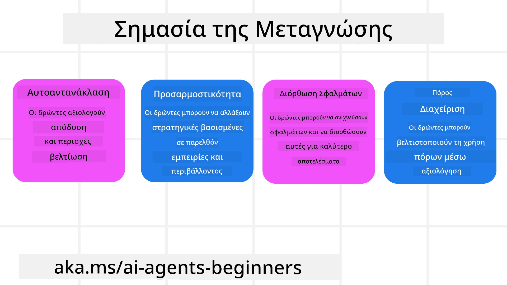
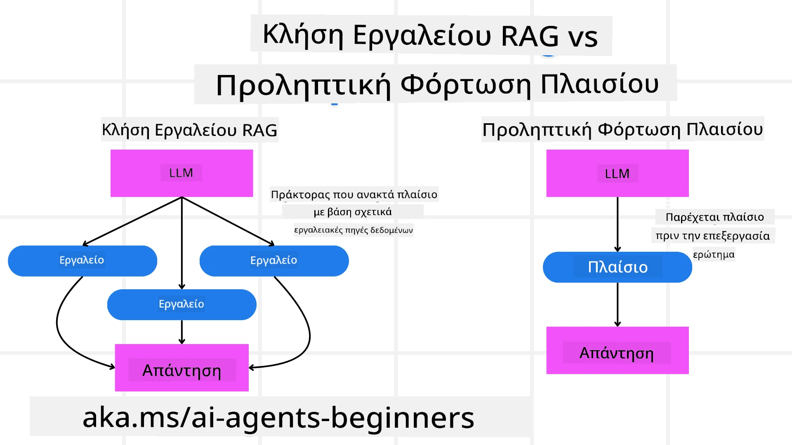

[](https://youtu.be/His9R6gw6Ec?si=3_RMb8VprNvdLRhX)

> _(Κάντε κλικ στην εικόνα παραπάνω για να δείτε το βίντεο αυτού του μαθήματος)_
# Μεταγνώση σε Πράκτορες Τεχνητής Νοημοσύνης

## Εισαγωγή

Καλώς ήλθατε στο μάθημα για τη μεταγνώση σε πράκτορες Τεχνητής Νοημοσύνης! Αυτό το κεφάλαιο έχει σχεδιαστεί για αρχάριους που είναι περίεργοι να μάθουν πώς οι πράκτορες ΤΝ μπορούν να σκέφτονται για τις δικές τους διαδικασίες σκέψης. Μέχρι το τέλος αυτού του μαθήματος, θα κατανοήσετε βασικές έννοιες και θα είστε εξοπλισμένοι με πρακτικά παραδείγματα για να εφαρμόσετε τη μεταγνώση στο σχεδιασμό πρακτόρων ΤΝ.

## Στόχοι Μάθησης

Αφού ολοκληρώσετε αυτό το μάθημα, θα μπορείτε να:

1. Κατανοήσετε τις επιπτώσεις των βρόχων συλλογισμού στον ορισμό των πρακτόρων.
2. Χρησιμοποιήσετε τεχνικές σχεδιασμού και αξιολόγησης για να βοηθήσετε πράκτορες αυτοδιόρθωσης.
3. Δημιουργήσετε τους δικούς σας πράκτορες ικανούς να χειρίζονται κώδικα για την επίτευξη εργασιών.

## Εισαγωγή στη Μεταγνώση

Η μεταγνώση αναφέρεται σε γνωστικές διαδικασίες υψηλότερης τάξης που περιλαμβάνουν τη σκέψη για τη δική μας σκέψη. Για τους πράκτορες ΤΝ, αυτό σημαίνει την ικανότητα να αξιολογούν και να προσαρμόζουν τις ενέργειές τους βασισμένοι στην αυτογνωσία και στις προηγούμενες εμπειρίες. Η μεταγνώση, ή "σκέψη για τη σκέψη", είναι μια σημαντική έννοια στην ανάπτυξη συστημάτων πρακτόρων ΤΝ. Περιλαμβάνει τα συστήματα ΤΝ να είναι ενήμερα για τις δικές τους εσωτερικές διαδικασίες και να μπορούν να παρακολουθούν, ρυθμίζουν και προσαρμόζουν την συμπεριφορά τους ανάλογα. Όπως κάνουμε όταν "διαβάζουμε το περιβάλλον" ή εξετάζουμε ένα πρόβλημα. Αυτή η αυτογνωσία μπορεί να βοηθήσει τα συστήματα ΤΝ να λαμβάνουν καλύτερες αποφάσεις, να εντοπίζουν λάθη και να βελτιώνουν τις επιδόσεις τους με την πάροδο του χρόνου - που ξανασυνδέεται με το τεστ Turing και τη συζήτηση για το αν η ΤΝ θα κυριαρχήσει.

Στο πλαίσιο των πρακτόρων ΤΝ, η μεταγνώση μπορεί να βοηθήσει στην αντιμετώπιση πολλών προκλήσεων, όπως:
- Διαφάνεια: Εξασφάλιση ότι τα συστήματα ΤΝ μπορούν να εξηγήσουν το συλλογισμό και τις αποφάσεις τους.
- Συλλογισμός: Ενίσχυση της ικανότητας των συστημάτων ΤΝ να συνθέτουν πληροφορίες και να λαμβάνουν ορθές αποφάσεις.
- Προσαρμογή: Δυνατότητα των συστημάτων ΤΝ να προσαρμόζονται σε νέα περιβάλλοντα και μεταβαλλόμενες συνθήκες.
- Αντίληψη: Βελτίωση της ακρίβειας στην αναγνώριση και ερμηνεία δεδομένων από το περιβάλλον.

### Τι είναι η Μεταγνώση;

Η μεταγνώση, ή "σκέψη για τη σκέψη", είναι μια γνωστική διαδικασία υψηλότερης τάξης που περιλαμβάνει αυτογνωσία και αυτορρύθμιση των γνωστικών διαδικασιών. Στον χώρο της ΤΝ, η μεταγνώση δίνει τη δυνατότητα στους πράκτορες να αξιολογούν και να προσαρμόζουν τις στρατηγικές και τις ενέργειές τους, οδηγώντας σε βελτιωμένες ικανότητες επίλυσης προβλημάτων και λήψης αποφάσεων. Με την κατανόηση της μεταγνώσης, μπορείτε να σχεδιάσετε πράκτορες ΤΝ που είναι όχι μόνο πιο έξυπνοι, αλλά και πιο προσαρμοστικοί και αποδοτικοί. Σε αληθινή μεταγνώση, θα βλέπατε την ΤΝ να συλλογίζεται ρητά για τον δικό της συλλογισμό.

Παράδειγμα: "Προτίμησα φθηνότερες πτήσεις γιατί... Μπορεί να χάνομαι τις απευθείας πτήσεις, οπότε θα ξανατσεκάρω.".
Παρακολουθώντας πώς ή γιατί επέλεξε μια συγκεκριμένη διαδρομή.
- Σημειώνοντας ότι έκανε λάθη επειδή βασίστηκε υπερβολικά στις προτιμήσεις του χρήστη από την τελευταία φορά, οπότε τροποποιεί την στρατηγική λήψης αποφάσεων και όχι μόνο την τελική πρόταση.
- Διαγιγνώσκοντας πρότυπα όπως, "Κάθε φορά που βλέπω τον χρήστη να αναφέρει 'πολύς συνωστισμός', δεν πρέπει μόνο να αφαιρώ ορισμένα αξιοθέατα αλλά και να αντανακλώ ότι η μέθοδος επιλογής των 'κορυφαίων αξιοθέατων' είναι ελαττωματική αν πάντα κατατάσσω με βάση τη δημοτικότητα."

### Σημασία της Μεταγνώσης σε Πράκτορες Τεχνητής Νοημοσύνης

Η μεταγνώση παίζει κρίσιμο ρόλο στο σχεδιασμό πρακτόρων ΤΝ για διάφορους λόγους:



- Αυτοαντανάκλαση: Οι πράκτορες μπορούν να αξιολογούν την απόδοσή τους και να εντοπίζουν περιοχές προς βελτίωση.
- Προσαρμοστικότητα: Οι πράκτορες μπορούν να τροποποιούν τις στρατηγικές τους με βάση παρελθούσες εμπειρίες και μεταβαλλόμενα περιβάλλοντα.
- Διόρθωση Λαθών: Οι πράκτορες μπορούν να εντοπίζουν και να διορθώνουν αυτάνομα λάθη, οδηγώντας σε πιο ακριβή αποτελέσματα.
- Διαχείριση Πόρων: Οι πράκτορες μπορούν να βελτιστοποιούν τη χρήση πόρων, όπως χρόνος και υπολογιστική ισχύς, σχεδιάζοντας και αξιολογώντας τις ενέργειές τους.

## Συστατικά ενός Πράκτορα Τεχνητής Νοημοσύνης

Πριν βουτήξουμε σε μεταγνώσιμες διαδικασίες, είναι απαραίτητο να κατανοήσουμε τα βασικά συστατικά ενός πράκτορα ΤΝ. Ένας πράκτορας ΤΝ συνήθως αποτελείται από:

- Πρόσωπο: Η προσωπικότητα και τα χαρακτηριστικά του πράκτορα, που καθορίζουν πώς αλληλεπιδρά με τους χρήστες.
- Εργαλεία: Οι ικανότητες και λειτουργίες που μπορεί να εκτελέσει ο πράκτορας.
- Δεξιότητες: Η γνώση και η εμπειρογνωμοσύνη που διαθέτει ο πράκτορας.

Αυτά τα συστατικά λειτουργούν μαζί για να δημιουργήσουν μια "μονάδα εξειδίκευσης" που μπορεί να εκτελεί συγκεκριμένες εργασίες.

**Παράδειγμα**:
Σκεφτείτε έναν ταξιδιωτικό πράκτορα, υπηρεσίες που όχι μόνο σχεδιάζουν τις διακοπές σας αλλά και προσαρμόζουν τη διαδρομή τους βάσει δεδομένων σε πραγματικό χρόνο και προηγούμενων εμπειριών πελατών.

### Παράδειγμα: Μεταγνώση σε Υπηρεσία Ταξιδιωτικού Πράκτορα

Φανταστείτε ότι σχεδιάζετε μια υπηρεσία ταξιδιωτικού πράκτορα με υποστήριξη ΤΝ. Αυτός ο πράκτορας, "Ταξιδιωτικός Πράκτορας," βοηθά τους χρήστες να σχεδιάσουν τις διακοπές τους. Για να ενσωματώσετε τη μεταγνώση, ο Ταξιδιωτικός Πράκτορας πρέπει να αξιολογεί και να προσαρμόζει τις ενέργειές του βασισμένος στην αυτογνωσία και στις προηγούμενες εμπειρίες. Δείτε πώς η μεταγνώση μπορεί να παίξει ρόλο:

#### Τρέχουσα Εργασία

Η τρέχουσα εργασία είναι να βοηθήσει έναν χρήστη να σχεδιάσει ένα ταξίδι στο Παρίσι.

#### Βήματα για την Ολοκλήρωση της Εργασίας

1. **Συλλογή Προτιμήσεων Χρήστη**: Ρώτησε τον χρήστη για τις ημερομηνίες ταξιδιού, τον προϋπολογισμό, τα ενδιαφέροντα (π.χ. μουσεία, κουζίνα, ψώνια) και τυχόν συγκεκριμένες απαιτήσεις.
2. **Ανάκτηση Πληροφοριών**: Αναζήτηση επιλογών πτήσεων, διαμονής, αξιοθέατων και εστιατορίων που ταιριάζουν με τις προτιμήσεις του χρήστη.
3. **Δημιουργία Προτάσεων**: Παροχή προσωποποιημένου προγράμματος με λεπτομέρειες πτήσεων, κρατήσεων ξενοδοχείου και προτεινόμενων δραστηριοτήτων.
4. **Προσαρμογή Βάσει Ανατροφοδότησης**: Ζήτησε ανατροφοδότηση από τον χρήστη για τις προτάσεις και κάνε τις απαραίτητες προσαρμογές.

#### Απαιτούμενοι Πόροι

- Πρόσβαση σε βάσεις δεδομένων κρατήσεων πτήσεων και ξενοδοχείων.
- Πληροφορίες σχετικά με τα αξιοθέατα και τα εστιατόρια του Παρισιού.
- Δεδομένα ανατροφοδότησης χρηστών από προηγούμενες αλληλεπιδράσεις.

#### Εμπειρία και Αυτοαντανάκλαση

Ο Ταξιδιωτικός Πράκτορας χρησιμοποιεί μεταγνώση για να αξιολογεί την απόδοσή του και να μαθαίνει από παλιές εμπειρίες. Για παράδειγμα:

1. **Ανάλυση Ανατροφοδότησης Χρήστη**: Ο Ταξιδιωτικός Πράκτορας ανασκοπεί την ανατροφοδότηση για να διαπιστώσει ποιες προτάσεις έγιναν καλά δεκτές και ποιες όχι. Προσαρμόζει τις μελλοντικές προτάσεις ανάλογα.
2. **Προσαρμοστικότητα**: Αν ένας χρήστης έχει αναφέρει προηγουμένως ότι δεν του αρέσουν τα πολυσύχναστα μέρη, ο Ταξιδιωτικός Πράκτορας θα αποφύγει να προτείνει δημοφιλή τουριστικά σημεία σε ώρες αιχμής στο μέλλον.
3. **Διόρθωση Λαθών**: Αν ο Ταξιδιωτικός Πράκτορας έκανε λάθος σε προηγούμενη κράτηση, όπως να προτείνει ξενοδοχείο που ήταν πλήρως κλεισμένο, μαθαίνει να ελέγχει πιο αυστηρά τη διαθεσιμότητα πριν προτείνει.

#### Πρακτικό Παράδειγμα για Προγραμματιστές

Ακολουθεί ένα απλοποιημένο παράδειγμα κώδικα για τον Ταξιδιωτικό Πράκτορα που ενσωματώνει τη μεταγνώση:

```python
class Travel_Agent:
    def __init__(self):
        self.user_preferences = {}
        self.experience_data = []

    def gather_preferences(self, preferences):
        self.user_preferences = preferences

    def retrieve_information(self):
        # Αναζήτηση πτήσεων, ξενοδοχείων και αξιοθεάτων βάσει προτιμήσεων
        flights = search_flights(self.user_preferences)
        hotels = search_hotels(self.user_preferences)
        attractions = search_attractions(self.user_preferences)
        return flights, hotels, attractions

    def generate_recommendations(self):
        flights, hotels, attractions = self.retrieve_information()
        itinerary = create_itinerary(flights, hotels, attractions)
        return itinerary

    def adjust_based_on_feedback(self, feedback):
        self.experience_data.append(feedback)
        # Ανάλυση σχολίων και προσαρμογή μελλοντικών συστάσεων
        self.user_preferences = adjust_preferences(self.user_preferences, feedback)

# Παράδειγμα χρήσης
travel_agent = Travel_Agent()
preferences = {
    "destination": "Paris",
    "dates": "2025-04-01 to 2025-04-10",
    "budget": "moderate",
    "interests": ["museums", "cuisine"]
}
travel_agent.gather_preferences(preferences)
itinerary = travel_agent.generate_recommendations()
print("Suggested Itinerary:", itinerary)
feedback = {"liked": ["Louvre Museum"], "disliked": ["Eiffel Tower (too crowded)"]}
travel_agent.adjust_based_on_feedback(feedback)
```

#### Γιατί η Μεταγνώση έχει Σημασία

- **Αυτοαντανάκλαση**: Οι πράκτορες μπορούν να αναλύουν την απόδοσή τους και να εντοπίζουν σημεία βελτίωσης.
- **Προσαρμοστικότητα**: Οι πράκτορες μπορούν να τροποποιούν στρατηγικές με βάση την ανατροφοδότηση και τις αλλαγές στις συνθήκες.
- **Διόρθωση Λαθών**: Οι πράκτορες μπορούν αυτόνομα να εντοπίζουν και να διορθώνουν λάθη.
- **Διαχείριση Πόρων**: Οι πράκτορες μπορούν να βελτιστοποιούν τη χρήση πόρων, όπως ο χρόνος και η υπολογιστική ισχύς.

Ενσωματώνοντας τη μεταγνώση, ο Ταξιδιωτικός Πράκτορας μπορεί να παρέχει πιο προσωποποιημένες και ακριβείς προτάσεις ταξιδιών, βελτιώνοντας την συνολική εμπειρία του χρήστη.

---

## 2. Σχεδιασμός σε Πράκτορες

Ο σχεδιασμός είναι κρίσιμο συστατικό της συμπεριφοράς πρακτόρων ΤΝ. Περιλαμβάνει τη χαρτογράφηση των βημάτων που απαιτούνται για την επίτευξη ενός στόχου, λαμβάνοντας υπόψη την τρέχουσα κατάσταση, τους πόρους και πιθανά εμπόδια.

### Στοιχεία του Σχεδιασμού

- **Τρέχουσα Εργασία**: Ορισμός της εργασίας με σαφήνεια.
- **Βήματα για την Ολοκλήρωση της Εργασίας**: Διαχωρισμός της εργασίας σε διαχειρίσιμα βήματα.
- **Απαιτούμενοι Πόροι**: Καθορισμός των απαραίτητων πόρων.
- **Εμπειρία**: Χρήση προηγούμενων εμπειριών για ενημέρωση του σχεδιασμού.

**Παράδειγμα**:
Ακολουθούν τα βήματα που χρειάζεται να ακολουθήσει ο Ταξιδιωτικός Πράκτορας για να βοηθήσει αποτελεσματικά έναν χρήστη στον σχεδιασμό του ταξιδιού:

### Βήματα για τον Ταξιδιωτικό Πράκτορα

1. **Συλλογή Προτιμήσεων Χρήστη**
   - Ρώτησε τον χρήστη για λεπτομέρειες σχετικά με τις ημερομηνίες ταξιδιού, τον προϋπολογισμό, τα ενδιαφέροντα και τυχόν συγκεκριμένες απαιτήσεις.
   - Παραδείγματα: "Πότε σκοπεύετε να ταξιδέψετε;" "Ποιο είναι το εύρος του προϋπολογισμού σας;" "Τι δραστηριότητες απολαμβάνετε στις διακοπές;"

2. **Ανάκτηση Πληροφοριών**
   - Αναζήτησε σχετικές επιλογές ταξιδιού βάσει των προτιμήσεων του χρήστη.
   - **Πτήσεις**: Βρες διαθέσιμες πτήσεις εντός προϋπολογισμού και προτιμώμενων ημερομηνιών.
   - **Διαμονή**: Βρες ξενοδοχεία ή ενοικιαζόμενα που ταιριάζουν με τις προτιμήσεις τοποθεσίας, τιμής και παροχών.
   - **Αξιοθέατα και Εστιατόρια**: Προσδιόρισε δημοφιλή αξιοθέατα, δραστηριότητες και επιλογές φαγητού που ευθυγραμμίζονται με τα ενδιαφέροντα του χρήστη.

3. **Δημιουργία Προτάσεων**
   - Συγκέντρωσε τις πληροφορίες σε ένα προσωποποιημένο πρόγραμμα.
   - Παρέδωσε λεπτομέρειες όπως επιλογές πτήσεων, κρατήσεις ξενοδοχείου και προτεινόμενες δραστηριότητες, προσαρμόζοντας τις προτάσεις στις προτιμήσεις του χρήστη.

4. **Παρουσίαση Προγράμματος στον Χρήστη**
   - Μοιράσου το προτεινόμενο πρόγραμμα με τον χρήστη για αξιολόγηση.
   - Παράδειγμα: "Ορίστε ένα προτεινόμενο πρόγραμμα για το ταξίδι σας στο Παρίσι. Περιλαμβάνει λεπτομέρειες πτήσεων, κρατήσεων ξενοδοχείου και μια λίστα προτεινόμενων δραστηριοτήτων και εστιατορίων. Πες μου τη γνώμη σου!"

5. **Συλλογή Ανατροφοδότησης**
   - Ζήτησε από τον χρήστη να αξιολογήσει το προτεινόμενο πρόγραμμα.
   - Παραδείγματα: "Σου αρέσουν οι επιλογές πτήσεων;" "Είναι το ξενοδοχείο κατάλληλο για τις ανάγκες σου;" "Υπάρχουν δραστηριότητες που θα ήθελες να προσθέσεις ή να αφαιρέσεις;"

6. **Προσαρμογή Βάσει Ανατροφοδότησης**
   - Τροποποίησε το πρόγραμμα με βάση την ανατροφοδότηση.
   - Κάνε τις απαραίτητες αλλαγές στις προτάσεις πτήσεων, διαμονής και δραστηριοτήτων για να ταιριάζουν καλύτερα στις προτιμήσεις του χρήστη.

7. **Τελική Επιβεβαίωση**
   - Παρουσίασε το ενημερωμένο πρόγραμμα για τελική επιβεβαίωση.
   - Παράδειγμα: "Έχω κάνει τις αλλαγές βάσει της ανατροφοδότησής σου. Ορίστε το ενημερωμένο πρόγραμμα. Φαίνεται όλα σωστά;"

8. **Κράτηση και Επιβεβαίωση Κρατήσεων**
   - Μετά την έγκριση του χρήστη, προχώρησε σε κράτηση πτήσεων, διαμονής και οποιωνδήποτε προγραμματισμένων δραστηριοτήτων.
   - Στείλε λεπτομέρειες επιβεβαίωσης στον χρήστη.

9. **Παροχή Συνεχούς Υποστήριξης**
   - Να είσαι διαθέσιμος για να βοηθήσεις τον χρήστη με αλλαγές ή επιπλέον αιτήματα πριν και κατά τη διάρκεια του ταξιδιού.
   - Παράδειγμα: "Αν χρειαστείς όποια βοήθεια κατά τη διάρκεια του ταξιδιού σου, μη διστάσεις να επικοινωνήσεις μαζί μου οποιαδήποτε στιγμή!"

### Παράδειγμα Αλληλεπίδρασης

```python
class Travel_Agent:
    def __init__(self):
        self.user_preferences = {}
        self.experience_data = []

    def gather_preferences(self, preferences):
        self.user_preferences = preferences

    def retrieve_information(self):
        flights = search_flights(self.user_preferences)
        hotels = search_hotels(self.user_preferences)
        attractions = search_attractions(self.user_preferences)
        return flights, hotels, attractions

    def generate_recommendations(self):
        flights, hotels, attractions = self.retrieve_information()
        itinerary = create_itinerary(flights, hotels, attractions)
        return itinerary

    def adjust_based_on_feedback(self, feedback):
        self.experience_data.append(feedback)
        self.user_preferences = adjust_preferences(self.user_preferences, feedback)

# Παράδειγμα χρήσης μέσα σε αίτημα κραυγής
travel_agent = Travel_Agent()
preferences = {
    "destination": "Paris",
    "dates": "2025-04-01 to 2025-04-10",
    "budget": "moderate",
    "interests": ["museums", "cuisine"]
}
travel_agent.gather_preferences(preferences)
itinerary = travel_agent.generate_recommendations()
print("Suggested Itinerary:", itinerary)
feedback = {"liked": ["Louvre Museum"], "disliked": ["Eiffel Tower (too crowded)"]}
travel_agent.adjust_based_on_feedback(feedback)
```

## 3. Σύστημα Διορθωτικού RAG

Καταρχάς, ας ξεκινήσουμε κατανοώντας τη διαφορά μεταξύ Εργαλείου RAG και Προληπτικής Φόρτωσης Πλαισίου (Context Load)



### Γεννήτρια Ενημερωμένη με Ανάκτηση (RAG)

Το RAG συνδυάζει ένα σύστημα ανάκτησης με ένα γενετικό μοντέλο. Όταν γίνεται μια ερώτηση, το σύστημα ανάκτησης φέρνει σχετικά έγγραφα ή δεδομένα από μια εξωτερική πηγή, και αυτές οι πληροφορίες χρησιμοποιούνται για να επαυξήσουν την είσοδο προς το γενετικό μοντέλο. Αυτό βοηθά το μοντέλο να παράγει πιο ακριβείς και συμφραζόμενες απαντήσεις.

Σε ένα σύστημα RAG, ο πράκτορας ανακτά σχετικές πληροφορίες από μια βάση γνώσης και τις χρησιμοποιεί για να παράγει κατάλληλες απαντήσεις ή ενέργειες.

### Προσέγγιση Διορθωτικού RAG

Η προσέγγιση διορθωτικού RAG εστιάζει στη χρήση τεχνικών RAG για τη διόρθωση λαθών και τη βελτίωση της ακρίβειας των πρακτόρων ΤΝ. Αυτό περιλαμβάνει:

1. **Τεχνική Διέγερσης**: Χρήση συγκεκριμένων εντολών για καθοδήγηση του πράκτορα στην ανάκτηση σχετικών πληροφοριών.
2. **Εργαλείο**: Υλοποίηση αλγορίθμων και μηχανισμών που επιτρέπουν στον πράκτορα να αξιολογεί τη συνάφεια των ανακτηθέντων πληροφοριών και να παράγει ακριβείς απαντήσεις.
3. **Αξιολόγηση**: Συνεχής αξιολόγηση της απόδοσης του πράκτορα και προσαρμογές για βελτίωση της ακρίβειας και αποδοτικότητας.

#### Παράδειγμα: Διορθωτικό RAG σε Πράκτορα Αναζήτησης

Σκεφτείτε έναν πράκτορα αναζήτησης που ανακτά πληροφορίες από το διαδίκτυο για να απαντήσει σε ερωτήματα χρηστών. Η προσέγγιση διορθωτικού RAG μπορεί να περιλαμβάνει:

1. **Τεχνική Διέγερσης**: Διατύπωση ερωτημάτων αναζήτησης βάσει εισόδου χρήστη.
2. **Εργαλείο**: Χρήση φυσικής γλώσσας και αλγορίθμων μηχανικής μάθησης για ταξινόμηση και φιλτράρισμα αποτελεσμάτων αναζήτησης.
3. **Αξιολόγηση**: Ανάλυση ανατροφοδότησης χρηστών για τον εντοπισμό και τη διόρθωση ανακρίβειών στις ανακτηθείσες πληροφορίες.

### Διορθωτικό RAG στον Ταξιδιωτικό Πράκτορα

Η προσέγγιση Διορθωτικού RAG (Γεννήτρια Ενημερωμένη με Ανάκτηση) ενισχύει την ικανότητα της ΤΝ να ανακτά και να παράγει πληροφορίες ενώ διορθώνει τυχόν ανακρίβειες. Ας δούμε πώς ο Ταξιδιωτικός Πράκτορας μπορεί να χρησιμοποιήσει την προσέγγιση Διορθωτικού RAG για να παρέχει πιο ακριβείς και συναφείς προτάσεις ταξιδιών.

Αυτό περιλαμβάνει:

- **Τεχνική Διέγερσης:** Χρήση συγκεκριμένων εντολών για να καθοδηγήσει τον πράκτορα στην ανάκτηση σχετικών πληροφοριών.
- **Εργαλείο:** Εφαρμογή αλγορίθμων και μηχανισμών που επιτρέπουν στον πράκτορα να αξιολογεί τη συνάφεια των πληροφοριών και να παράγει ακριβείς απαντήσεις.
- **Αξιολόγηση:** Συνεχής αξιολόγηση της απόδοσης και προσαρμογές για βελτίωση ακρίβειας και αποδοτικότητας.

#### Βήματα για την Εφαρμογή του Διορθωτικού RAG στον Ταξιδιωτικό Πράκτορα

1. **Αρχική Αλληλεπίδραση με Χρήστη**
   - Ο Ταξιδιωτικός Πράκτορας συλλέγει τις αρχικές προτιμήσεις του χρήστη, όπως προορισμός, ημερομηνίες ταξιδιού, προϋπολογισμό και ενδιαφέροντα.
   - Παράδειγμα:

     ```python
     preferences = {
         "destination": "Paris",
         "dates": "2025-04-01 to 2025-04-10",
         "budget": "moderate",
         "interests": ["museums", "cuisine"]
     }
     ```

2. **Ανάκτηση Πληροφοριών**
   - Ο Ταξιδιωτικός Πράκτορας ανακτά πληροφορίες σχετικά με πτήσεις, διαμονή, αξιοθέατα και εστιατόρια βάσει προτιμήσεων χρήστη.
   - Παράδειγμα:

     ```python
     flights = search_flights(preferences)
     hotels = search_hotels(preferences)
     attractions = search_attractions(preferences)
     ```

3. **Δημιουργία Αρχικών Προτάσεων**
   - Ο Ταξιδιωτικός Πράκτορας χρησιμοποιεί τις ανακτημένες πληροφορίες για να δημιουργήσει προσωποποιημένο πρόγραμμα.
   - Παράδειγμα:

     ```python
     itinerary = create_itinerary(flights, hotels, attractions)
     print("Suggested Itinerary:", itinerary)
     ```

4. **Συλλογή Ανατροφοδότησης Χρήστη**
   - Ο Ταξιδιωτικός Πράκτορας ζητά από τον χρήστη ανατροφοδότηση σχετικά με τις αρχικές προτάσεις.
   - Παράδειγμα:

     ```python
     feedback = {
         "liked": ["Louvre Museum"],
         "disliked": ["Eiffel Tower (too crowded)"]
     }
     ```

5. **Διαδικασία Διορθωτικού RAG**
   - **Τεχνική Διέγερσης**: Ο Ταξιδιωτικός Πράκτορας διατυπώνει νέα ερωτήματα αναζήτησης βάσει της ανατροφοδότησης χρήστη.
     - Παράδειγμα:

       ```python
       if "disliked" in feedback:
           preferences["avoid"] = feedback["disliked"]
       ```

   - **Εργαλείο**: Ο Ταξιδιωτικός Πράκτορας χρησιμοποιεί αλγορίθμους για ταξινόμηση και φιλτράρισμα των νέων αποτελεσμάτων αναζήτησης, δίνοντας έμφαση στη συνάφεια με βάση την ανατροφοδότηση.
     - Παράδειγμα:

       ```python
       new_attractions = search_attractions(preferences)
       new_itinerary = create_itinerary(flights, hotels, new_attractions)
       print("Updated Itinerary:", new_itinerary)
       ```

   - **Αξιολόγηση**: Ο Ταξιδιωτικός Πράκτορας συνεχώς αξιολογεί τη συνάφεια και την ακρίβεια των προτάσεών του αναλύοντας την ανατροφοδότηση και κάνοντας τις απαραίτητες προσαρμογές.
     - Παράδειγμα:

       ```python
       def adjust_preferences(preferences, feedback):
           if "liked" in feedback:
               preferences["favorites"] = feedback["liked"]
           if "disliked" in feedback:
               preferences["avoid"] = feedback["disliked"]
           return preferences

       preferences = adjust_preferences(preferences, feedback)
       ```

#### Πρακτικό Παράδειγμα

Ακολουθεί ένα απλοποιημένο παράδειγμα κώδικα Python που ενσωματώνει την προσέγγιση Διορθωτικού RAG στον Ταξιδιωτικό Πράκτορα:

```python
class Travel_Agent:
    def __init__(self):
        self.user_preferences = {}
        self.experience_data = []

    def gather_preferences(self, preferences):
        self.user_preferences = preferences

    def retrieve_information(self):
        flights = search_flights(self.user_preferences)
        hotels = search_hotels(self.user_preferences)
        attractions = search_attractions(self.user_preferences)
        return flights, hotels, attractions

    def generate_recommendations(self):
        flights, hotels, attractions = self.retrieve_information()
        itinerary = create_itinerary(flights, hotels, attractions)
        return itinerary

    def adjust_based_on_feedback(self, feedback):
        self.experience_data.append(feedback)
        self.user_preferences = adjust_preferences(self.user_preferences, feedback)
        new_itinerary = self.generate_recommendations()
        return new_itinerary

# Παράδειγμα χρήσης
travel_agent = Travel_Agent()
preferences = {
    "destination": "Paris",
    "dates": "2025-04-01 to 2025-04-10",
    "budget": "moderate",
    "interests": ["museums", "cuisine"]
}
travel_agent.gather_preferences(preferences)
itinerary = travel_agent.generate_recommendations()
print("Suggested Itinerary:", itinerary)
feedback = {"liked": ["Louvre Museum"], "disliked": ["Eiffel Tower (too crowded)"]}
new_itinerary = travel_agent.adjust_based_on_feedback(feedback)
print("Updated Itinerary:", new_itinerary)
```

### Προληπτική Φόρτωση Πλαισίου (Context Load)
Το Pre-emptive Context Load περιλαμβάνει τη φόρτωση σχετικού πλαισίου ή πληροφοριών υπόβαθρου στο μοντέλο πριν την επεξεργασία ενός ερωτήματος. Αυτό σημαίνει ότι το μοντέλο έχει πρόσβαση σε αυτές τις πληροφορίες από την αρχή, κάτι που του επιτρέπει να παράγει πιο ενημερωμένες απαντήσεις χωρίς να χρειάζεται να ανακτήσει πρόσθετα δεδομένα κατά τη διάρκεια της διαδικασίας.

Ακολουθεί ένα απλοποιημένο παράδειγμα για το πώς μπορεί να φαίνεται το pre-emptive context load για μια εφαρμογή ταξιδιωτικού πράκτορα σε Python:

```python
class TravelAgent:
    def __init__(self):
        # Προφόρτωση δημοφιλών προορισμών και των πληροφοριών τους
        self.context = {
            "Paris": {"country": "France", "currency": "Euro", "language": "French", "attractions": ["Eiffel Tower", "Louvre Museum"]},
            "Tokyo": {"country": "Japan", "currency": "Yen", "language": "Japanese", "attractions": ["Tokyo Tower", "Shibuya Crossing"]},
            "New York": {"country": "USA", "currency": "Dollar", "language": "English", "attractions": ["Statue of Liberty", "Times Square"]},
            "Sydney": {"country": "Australia", "currency": "Dollar", "language": "English", "attractions": ["Sydney Opera House", "Bondi Beach"]}
        }

    def get_destination_info(self, destination):
        # Ανάκτηση πληροφοριών προορισμού από το προφορτωμένο πλαίσιο
        info = self.context.get(destination)
        if info:
            return f"{destination}:\nCountry: {info['country']}\nCurrency: {info['currency']}\nLanguage: {info['language']}\nAttractions: {', '.join(info['attractions'])}"
        else:
            return f"Sorry, we don't have information on {destination}."

# Παράδειγμα χρήσης
travel_agent = TravelAgent()
print(travel_agent.get_destination_info("Paris"))
print(travel_agent.get_destination_info("Tokyo"))
```

#### Επεξήγηση

1. **Αρχικοποίηση (μέθοδος `__init__`)**: Η κλάση `TravelAgent` προφορτώνει ένα λεξικό που περιέχει πληροφορίες για δημοφιλείς προορισμούς όπως το Παρίσι, το Τόκιο, η Νέα Υόρκη και το Σίδνεϊ. Αυτό το λεξικό περιλαμβάνει λεπτομέρειες όπως τη χώρα, το νόμισμα, τη γλώσσα και τα σημαντικά αξιοθέατα για κάθε προορισμό.

2. **Ανάκτηση Πληροφοριών (μέθοδος `get_destination_info`)**: Όταν ένας χρήστης ρωτά για έναν συγκεκριμένο προορισμό, η μέθοδος `get_destination_info` ανακτά τις σχετικές πληροφορίες από το προφορτωμένο λεξικό πλαισίου.

Με το να προφορτώνει το πλαίσιο, η εφαρμογή ταξιδιωτικού πράκτορα μπορεί να ανταποκρίνεται γρήγορα σε ερωτήματα χρηστών χωρίς να χρειάζεται να ανακτήσει τις πληροφορίες αυτές από εξωτερική πηγή σε πραγματικό χρόνο. Αυτό καθιστά την εφαρμογή πιο αποδοτική και ανταποκρινόμενη.

### Εκκίνηση Σχεδίου με Στόχο Πριν από την Επανάληψη

Η εκκίνηση ενός σχεδίου με στόχο περιλαμβάνει την έναρξη με έναν σαφή στόχο ή επιθυμητό αποτέλεσμα κατά νου. Ορίζοντας αυτόν τον στόχο εξαρχής, το μοντέλο μπορεί να τον χρησιμοποιήσει ως κατευθυντήριο αρχή καθ’ όλη τη διάρκεια της επαναληπτικής διαδικασίας. Αυτό βοηθά να διασφαλιστεί ότι κάθε επανάληψη φέρνει πιο κοντά στο επιθυμητό αποτέλεσμα, καθιστώντας τη διαδικασία πιο αποδοτική και εστιασμένη.

Ακολουθεί ένα παράδειγμα για το πώς μπορείτε να εκκινήσετε ένα σχέδιο ταξιδιού με στόχο πριν την επανάληψη για έναν ταξιδιωτικό πράκτορα σε Python:

### Σενάριο

Ένας ταξιδιωτικός πράκτορας θέλει να σχεδιάσει μια εξατομικευμένη διακοπή για έναν πελάτη. Ο στόχος είναι να δημιουργηθεί ένα ταξιδιωτικό πρόγραμμα που μεγιστοποιεί την ικανοποίηση του πελάτη βάσει των προτιμήσεων και του προϋπολογισμού του.

### Βήματα

1. Οροθετήστε τις προτιμήσεις και τον προϋπολογισμό του πελάτη.  
2. Εκκινήστε το αρχικό σχέδιο με βάση αυτές τις προτιμήσεις.  
3. Επαναλάβετε για να βελτιώσετε το σχέδιο, βελτιστοποιώντας για την ικανοποίηση του πελάτη.

#### Κώδικας Python

```python
class TravelAgent:
    def __init__(self, destinations):
        self.destinations = destinations

    def bootstrap_plan(self, preferences, budget):
        plan = []
        total_cost = 0

        for destination in self.destinations:
            if total_cost + destination['cost'] <= budget and self.match_preferences(destination, preferences):
                plan.append(destination)
                total_cost += destination['cost']

        return plan

    def match_preferences(self, destination, preferences):
        for key, value in preferences.items():
            if destination.get(key) != value:
                return False
        return True

    def iterate_plan(self, plan, preferences, budget):
        for i in range(len(plan)):
            for destination in self.destinations:
                if destination not in plan and self.match_preferences(destination, preferences) and self.calculate_cost(plan, destination) <= budget:
                    plan[i] = destination
                    break
        return plan

    def calculate_cost(self, plan, new_destination):
        return sum(destination['cost'] for destination in plan) + new_destination['cost']

# Παράδειγμα χρήσης
destinations = [
    {"name": "Paris", "cost": 1000, "activity": "sightseeing"},
    {"name": "Tokyo", "cost": 1200, "activity": "shopping"},
    {"name": "New York", "cost": 900, "activity": "sightseeing"},
    {"name": "Sydney", "cost": 1100, "activity": "beach"},
]

preferences = {"activity": "sightseeing"}
budget = 2000

travel_agent = TravelAgent(destinations)
initial_plan = travel_agent.bootstrap_plan(preferences, budget)
print("Initial Plan:", initial_plan)

refined_plan = travel_agent.iterate_plan(initial_plan, preferences, budget)
print("Refined Plan:", refined_plan)
```

#### Επεξήγηση Κώδικα

1. **Αρχικοποίηση (μέθοδος `__init__`)**: Η κλάση `TravelAgent` αρχικοποιείται με μια λίστα πιθανών προορισμών, καθένας από τους οποίους έχει χαρακτηριστικά όπως το όνομα, το κόστος και τον τύπο δραστηριότητας.

2. **Εκκίνηση Σχεδίου (μέθοδος `bootstrap_plan`)**: Αυτή η μέθοδος δημιουργεί ένα αρχικό σχέδιο ταξιδιού με βάση τις προτιμήσεις και τον προϋπολογισμό του πελάτη. Επαναλαμβάνει πάνω στη λίστα των προορισμών και τους προσθέτει στο σχέδιο αν ταιριάζουν με τις προτιμήσεις του πελάτη και εμπίπτουν στον προϋπολογισμό.

3. **Ταίριασμα Προτιμήσεων (μέθοδος `match_preferences`)**: Αυτή η μέθοδος ελέγχει αν ένας προορισμός ταιριάζει με τις προτιμήσεις του πελάτη.

4. **Επανάληψη Σχεδίου (μέθοδος `iterate_plan`)**: Αυτή η μέθοδος βελτιώνει το αρχικό σχέδιο προσπαθώντας να αντικαταστήσει κάθε προορισμό στο σχέδιο με καλύτερη επιλογή, λαμβάνοντας υπόψη τις προτιμήσεις του πελάτη και τους περιορισμούς του προϋπολογισμού.

5. **Υπολογισμός Κόστους (μέθοδος `calculate_cost`)**: Αυτή η μέθοδος υπολογίζει το συνολικό κόστος του τρέχοντος σχεδίου, συμπεριλαμβανομένου ενός πιθανού νέου προορισμού.

#### Παράδειγμα Χρήσης

- **Αρχικό Σχέδιο**: Ο ταξιδιωτικός πράκτορας δημιουργεί ένα αρχικό σχέδιο με βάση τις προτιμήσεις του πελάτη για περιηγήσεις και έναν προϋπολογισμό των $2000.  
- **Βελτιωμένο Σχέδιο**: Ο ταξιδιωτικός πράκτορας επαναλαμβάνει το σχέδιο, βελτιστοποιώντας για τις προτιμήσεις και τον προϋπολογισμό του πελάτη.

Με το να εκκινεί το σχέδιο με έναν σαφή στόχο (π.χ. μεγιστοποίηση ικανοποίησης πελάτη) και να επαναλαμβάνει για βελτίωση, ο ταξιδιωτικός πράκτορας μπορεί να δημιουργήσει ένα εξατομικευμένο και βελτιστοποιημένο ταξιδιωτικό πρόγραμμα για τον πελάτη. Αυτή η προσέγγιση διασφαλίζει ότι το σχέδιο ταξιδιού ευθυγραμμίζεται με τις προτιμήσεις και τον προϋπολογισμό του πελάτη από την αρχή και βελτιώνεται με κάθε επανάληψη.

### Αξιοποίηση LLM για Επανακατάταξη και Βαθμολόγηση

Τα Μεγάλα Γλωσσικά Μοντέλα (LLMs) μπορούν να χρησιμοποιηθούν για επανακατάταξη και βαθμολόγηση αξιολογώντας τη συνάφεια και την ποιότητα των ανακτημένων εγγράφων ή παραγόμενων απαντήσεων. Δείτε πώς λειτουργεί:

**Ανάκτηση:** Το αρχικό βήμα ανάκτησης φέρνει ένα σύνολο υποψήφιων εγγράφων ή απαντήσεων βασισμένων στο ερώτημα.

**Επανακατάταξη:** Το LLM αξιολογεί αυτούς τους υποψηφίους και τους επανακατατάσσει με βάση τη συνάφεια και την ποιότητά τους. Αυτό το βήμα διασφαλίζει ότι οι πιο σχετικές και ποιοτικές πληροφορίες παρουσιάζονται πρώτα.

**Βαθμολόγηση:** Το LLM αποδίδει σκορ σε κάθε υποψήφιο, αντικατοπτρίζοντας τη συνάφεια και την ποιότητά τους. Αυτό βοηθά στην επιλογή της καλύτερης απάντησης ή εγγράφου για τον χρήστη.

Αξιοποιώντας το LLM για επανακατάταξη και βαθμολόγηση, το σύστημα μπορεί να παρέχει πιο ακριβείς και συμφραζόμενες σχετικές πληροφορίες, βελτιώνοντας τη συνολική εμπειρία χρήστη.

Ακολουθεί ένα παράδειγμα πώς ένας ταξιδιωτικός πράκτορας μπορεί να χρησιμοποιήσει ένα Μεγάλο Γλωσσικό Μοντέλο (LLM) για επανακατάταξη και βαθμολόγηση προορισμών ταξιδιού βάσει προτιμήσεων χρήστη σε Python:

#### Σενάριο – Ταξίδι βάσει Προτιμήσεων

Ένας ταξιδιωτικός πράκτορας θέλει να προτείνει τους καλύτερους προορισμούς σε έναν πελάτη με βάση τις προτιμήσεις του. Το LLM θα βοηθήσει να γίνει επανακατάταξη και βαθμολόγηση των προορισμών ώστε να παρουσιαστούν οι πιο σχετικές επιλογές.

#### Βήματα:

1. Συλλογή προτιμήσεων χρήστη.  
2. Ανάκτηση λίστας πιθανών προορισμών.  
3. Χρήση του LLM για επανακατάταξη και βαθμολόγηση των προορισμών βάσει των προτιμήσεων χρήστη.

Να πώς μπορείτε να ενημερώσετε το προηγούμενο παράδειγμα για να χρησιμοποιεί τις Υπηρεσίες Azure OpenAI:

#### Απαιτήσεις

1. Πρέπει να έχετε συνδρομή Azure.  
2. Δημιουργήστε έναν πόρο Azure OpenAI και λάβετε το κλειδί API.

#### Παράδειγμα Κώδικα Python

```python
import requests
import json

class TravelAgent:
    def __init__(self, destinations):
        self.destinations = destinations

    def get_recommendations(self, preferences, api_key, endpoint):
        # Δημιουργήστε μια προτροπή για το Azure OpenAI
        prompt = self.generate_prompt(preferences)
        
        # Ορίστε κεφαλίδες και περιεχόμενο για το αίτημα
        headers = {
            'Content-Type': 'application/json',
            'Authorization': f'Bearer {api_key}'
        }
        payload = {
            "prompt": prompt,
            "max_tokens": 150,
            "temperature": 0.7
        }
        
        # Καλέστε το API του Azure OpenAI για να λάβετε τους επαναταξινομημένους και βαθμολογημένους προορισμούς
        response = requests.post(endpoint, headers=headers, json=payload)
        response_data = response.json()
        
        # Εξαγάγετε και επιστρέψτε τις προτάσεις
        recommendations = response_data['choices'][0]['text'].strip().split('\n')
        return recommendations

    def generate_prompt(self, preferences):
        prompt = "Here are the travel destinations ranked and scored based on the following user preferences:\n"
        for key, value in preferences.items():
            prompt += f"{key}: {value}\n"
        prompt += "\nDestinations:\n"
        for destination in self.destinations:
            prompt += f"- {destination['name']}: {destination['description']}\n"
        return prompt

# Παράδειγμα χρήσης
destinations = [
    {"name": "Paris", "description": "City of lights, known for its art, fashion, and culture."},
    {"name": "Tokyo", "description": "Vibrant city, famous for its modernity and traditional temples."},
    {"name": "New York", "description": "The city that never sleeps, with iconic landmarks and diverse culture."},
    {"name": "Sydney", "description": "Beautiful harbour city, known for its opera house and stunning beaches."},
]

preferences = {"activity": "sightseeing", "culture": "diverse"}
api_key = 'your_azure_openai_api_key'
endpoint = 'https://your-endpoint.com/openai/deployments/your-deployment-name/completions?api-version=2022-12-01'

travel_agent = TravelAgent(destinations)
recommendations = travel_agent.get_recommendations(preferences, api_key, endpoint)
print("Recommended Destinations:")
for rec in recommendations:
    print(rec)
```

#### Επεξήγηση Κώδικα – Preference Booker

1. **Αρχικοποίηση**: Η κλάση `TravelAgent` αρχικοποιείται με μια λίστα πιθανών προορισμών ταξιδιού, καθένας με χαρακτηριστικά όπως όνομα και περιγραφή.

2. **Λήψη Συστάσεων (μέθοδος `get_recommendations`)**: Αυτή η μέθοδος δημιουργεί ένα prompt για την υπηρεσία Azure OpenAI βασισμένο στις προτιμήσεις του χρήστη και κάνει ένα HTTP POST αίτημα στο API Azure OpenAI για να λάβει τους επαναταξινομημένους και βαθμολογημένους προορισμούς.

3. **Δημιουργία Prompt (μέθοδος `generate_prompt`)**: Αυτή η μέθοδος κατασκευάζει ένα prompt για το Azure OpenAI, που περιλαμβάνει τις προτιμήσεις του χρήστη και τη λίστα προορισμών. Το prompt καθοδηγεί το μοντέλο να επαναταξινομήσει και να βαθμολογήσει τους προορισμούς με βάση τις παρεχόμενες προτιμήσεις.

4. **Κλήση API**: Η βιβλιοθήκη `requests` χρησιμοποιείται για την αποστολή HTTP POST αιτήματος στο endpoint του Azure OpenAI API. Η απόκριση περιέχει τους επαναταξινομημένους και βαθμολογημένους προορισμούς.

5. **Παράδειγμα Χρήσης**: Ο ταξιδιωτικός πράκτορας συλλέγει τις προτιμήσεις του χρήστη (π.χ. ενδιαφέρον για περιηγήσεις και ποικιλία πολιτισμών) και χρησιμοποιεί την υπηρεσία Azure OpenAI για να λάβει επαναταξινομημένες και βαθμολογημένες προτάσεις προορισμών.

Φροντίστε να αντικαταστήσετε το `your_azure_openai_api_key` με το πραγματικό σας κλειδί API του Azure OpenAI και το `https://your-endpoint.com/...` με το πραγματικό URL του endpoint ανάπτυξης του Azure OpenAI.

Αξιοποιώντας το LLM για επανακατάταξη και βαθμολόγηση, ο ταξιδιωτικός πράκτορας μπορεί να παρέχει πιο εξατομικευμένες και σχετικές ταξιδιωτικές προτάσεις στους πελάτες, βελτιώνοντας τη συνολική εμπειρία τους.

### RAG: Τεχνική Prompting vs Εργαλείο

Η Retrieval-Augmented Generation (RAG) μπορεί να είναι τόσο μια τεχνική prompting όσο και ένα εργαλείο στην ανάπτυξη AI agents. Η κατανόηση της διαφοράς ανάμεσα στα δύο μπορεί να σας βοηθήσει να αξιοποιήσετε καλύτερα το RAG στα έργα σας.

#### RAG ως Τεχνική Prompting

**Τι είναι;**

- Ως τεχνική prompting, το RAG περιλαμβάνει τη διατύπωση συγκεκριμένων ερωτημάτων ή prompt για καθοδήγηση της ανάκτησης σχετικών πληροφοριών από μεγάλο σώμα κειμένων ή βάση δεδομένων. Αυτές οι πληροφορίες χρησιμοποιούνται στη συνέχεια για τη δημιουργία απαντήσεων ή ενεργειών.

**Πώς λειτουργεί:**

1. **Διατύπωση Prompt**: Δημιουργία καλά δομημένων prompts ή ερωτημάτων βάσει της εργασίας ή της εισόδου του χρήστη.  
2. **Ανάκτηση Πληροφοριών**: Χρήση των prompt για αναζήτηση σχετικών δεδομένων από υπάρχουσα βάση γνώσης ή σύνολο δεδομένων.  
3. **Παραγωγή Απάντησης**: Συνδυασμός των ανακτημένων πληροφοριών με γενετικά μοντέλα AI για την παραγωγή πλήρους και συνεκτικής απάντησης.

**Παράδειγμα σε Ταξιδιωτικό Πράκτορα:**

- Είσοδος Χρήστη: "Θέλω να επισκεφθώ μουσεία στο Παρίσι."  
- Prompt: "Βρες τα κορυφαία μουσεία στο Παρίσι."  
- Ανακτημένες Πληροφορίες: Λεπτομέρειες για το Μουσείο του Λούβρου, το Musée d'Orsay, κλπ.  
- Παραγόμενη Απάντηση: "Εδώ είναι μερικά κορυφαία μουσεία στο Παρίσι: Μουσείο του Λούβρου, Musée d'Orsay και Centre Pompidou."

#### RAG ως Εργαλείο

**Τι είναι;**

- Ως εργαλείο, το RAG είναι ένα ολοκληρωμένο σύστημα που αυτοματοποιεί τη διαδικασία ανάκτησης και παραγωγής, διευκολύνοντας τους προγραμματιστές να υλοποιήσουν σύνθετες λειτουργίες AI χωρίς να γράφουν χειροκίνητα prompt για κάθε ερώτημα.

**Πώς λειτουργεί:**

1. **Ενσωμάτωση**: Ενσωμάτωση του RAG στην αρχιτεκτονική του AI agent, επιτρέποντας την αυτόματη διαχείριση των εργασιών ανάκτησης και παραγωγής.  
2. **Αυτοματοποίηση**: Το εργαλείο διαχειρίζεται ολόκληρη τη διαδικασία, από τη λήψη εισόδου χρήστη μέχρι την παραγωγή της τελικής απάντησης, χωρίς να απαιτούνται ρητά prompt σε κάθε βήμα.  
3. **Αποδοτικότητα**: Βελτιώνει τις επιδόσεις του agent ρέοντας τη διαδικασία ανάκτησης και παραγωγής, επιτρέποντας γρηγορότερες και πιο ακριβείς απαντήσεις.

**Παράδειγμα σε Ταξιδιωτικό Πράκτορα:**

- Είσοδος Χρήστη: "Θέλω να επισκεφθώ μουσεία στο Παρίσι."  
- Εργαλείο RAG: Αυτόματα ανακτά πληροφορίες για μουσεία και παράγει απάντηση.  
- Παραγόμενη Απάντηση: "Εδώ είναι μερικά κορυφαία μουσεία στο Παρίσι: Μουσείο του Λούβρου, Musée d'Orsay και Centre Pompidou."

### Σύγκριση

| Στοιχείο                 | Τεχνική Prompting                                         | Εργαλείο                                              |
|--------------------------|-----------------------------------------------------------|-------------------------------------------------------|
| **Χειροκίνητο vs Αυτόματο**| Χειροκίνητη διατύπωση prompt για κάθε ερώτημα.           | Αυτοματοποιημένη διαδικασία για ανάκτηση και παραγωγή. |
| **Έλεγχος**              | Παρέχει μεγαλύτερο έλεγχο στη διαδικασία ανάκτησης.       | Απλοποιεί και αυτοματοποιεί την ανάκτηση και παραγωγή. |
| **Ευελιξία**             | Επιτρέπει προσαρμοσμένα prompt βάσει συγκεκριμένων αναγκών.| Πιο αποδοτικό για εφαρμογές σε μεγάλη κλίμακα.          |
| **Πολυπλοκότητα**        | Απαιτεί δημιουργία και τροποποίηση prompt.                | Πιο εύκολο στην ενσωμάτωση στην αρχιτεκτονική του AI agent.|

### Πρακτικά Παραδείγματα

**Παράδειγμα Τεχνικής Prompting:**

```python
def search_museums_in_paris():
    prompt = "Find top museums in Paris"
    search_results = search_web(prompt)
    return search_results

museums = search_museums_in_paris()
print("Top Museums in Paris:", museums)
```

**Παράδειγμα Εργαλείου:**

```python
class Travel_Agent:
    def __init__(self):
        self.rag_tool = RAGTool()

    def get_museums_in_paris(self):
        user_input = "I want to visit museums in Paris."
        response = self.rag_tool.retrieve_and_generate(user_input)
        return response

travel_agent = Travel_Agent()
museums = travel_agent.get_museums_in_paris()
print("Top Museums in Paris:", museums)
```

### Αξιολόγηση Συνάφειας

Η αξιολόγηση της συνάφειας είναι κρίσιμο στοιχείο της απόδοσης ενός AI agent. Διασφαλίζει ότι οι πληροφορίες που ανακτώνται και παράγονται από τον agent είναι κατάλληλες, ακριβείς και χρήσιμες για τον χρήστη. Ας εξετάσουμε πώς να αξιολογήσουμε τη συνάφεια σε AI agents, συμπεριλαμβανομένων πρακτικών παραδειγμάτων και τεχνικών.

#### Κύριες Έννοιες στην Αξιολόγηση Συνάφειας

1. **Επίγνωση Πλαισίου**:
   - Ο agent πρέπει να κατανοεί το πλαίσιο του ερωτήματος του χρήστη για να ανακτήσει και να παράγει σχετικές πληροφορίες.  
   - Παράδειγμα: Αν ένας χρήστης ρωτήσει "τα καλύτερα εστιατόρια στο Παρίσι", ο agent πρέπει να λάβει υπόψη τις προτιμήσεις του χρήστη, όπως τύπο κουζίνας και προϋπολογισμό.

2. **Ακρίβεια**:
   - Οι πληροφορίες που παρέχονται από τον agent πρέπει να είναι πραγματικά σωστές και ενημερωμένες.  
   - Παράδειγμα: Να προτείνει εστιατόρια που είναι ανοιχτά και έχουν καλές κριτικές αντί για κλειστές ή παλιές επιλογές.

3. **Πρόθεση Χρήστη**:
   - Ο agent πρέπει να συμπεράνει την πρόθεση πίσω από το ερώτημα του χρήστη για να παρέχει την πιο σχετική πληροφορία.  
   - Παράδειγμα: Αν ο χρήστης ρωτήσει για "ξενοδοχεία με προϋπολογισμό", ο agent πρέπει να δώσει προτεραιότητα σε προσιτές επιλογές.

4. **Βρόχος Ανατροφοδότησης**:
   - Η συνεχής συλλογή και ανάλυση ανατροφοδότησης χρηστών βοηθά τον agent να βελτιώσει τη διαδικασία αξιολόγησης συνάφειας.  
   - Παράδειγμα: Ενσωμάτωση βαθμολογιών και σχολίων χρηστών σε προηγούμενες προτάσεις για βελτίωση μελλοντικών απαντήσεων.

#### Πρακτικές Τεχνικές για Αξιολόγηση Συνάφειας

1. **Βαθμολόγηση Συνάφειας**:
   - Αποδίδεται ένα σκορ συνάφειας σε κάθε ανακτημένο στοιχείο βάσει του πόσο καλά ταιριάζει με το ερώτημα και τις προτιμήσεις του χρήστη.  
   - Παράδειγμα:

     ```python
     def relevance_score(item, query):
         score = 0
         if item['category'] in query['interests']:
             score += 1
         if item['price'] <= query['budget']:
             score += 1
         if item['location'] == query['destination']:
             score += 1
         return score
     ```

2. **Φιλτράρισμα και Κατάταξη**:
   - Απορρίπτονται μη σχετικά στοιχεία και κατατάσσονται τα υπόλοιπα με βάση τα σκορ συνάφειας.  
   - Παράδειγμα:

     ```python
     def filter_and_rank(items, query):
         ranked_items = sorted(items, key=lambda item: relevance_score(item, query), reverse=True)
         return ranked_items[:10]  # Επιστρέψτε τα 10 πιο σχετικά αντικείμενα
     ```

3. **Επεξεργασία Φυσικής Γλώσσας (NLP)**:
   - Χρησιμοποιούνται τεχνικές NLP για να κατανοηθεί το ερώτημα του χρήστη και να ανακτηθούν σχετικές πληροφορίες.  
   - Παράδειγμα:

     ```python
     def process_query(query):
         # Χρησιμοποιήστε NLP για να εξαγάγετε βασικές πληροφορίες από το ερώτημα του χρήστη
         processed_query = nlp(query)
         return processed_query
     ```

4. **Ενσωμάτωση Ανατροφοδότησης Χρηστών**:
   - Συλλέγεται ανατροφοδότηση σχετικά με τις προτάσεις και χρησιμοποιείται για την προσαρμογή των μελλοντικών αξιολογήσεων συνάφειας.  
   - Παράδειγμα:

     ```python
     def adjust_based_on_feedback(feedback, items):
         for item in items:
             if item['name'] in feedback['liked']:
                 item['relevance'] += 1
             if item['name'] in feedback['disliked']:
                 item['relevance'] -= 1
         return items
     ```

#### Παράδειγμα: Αξιολόγηση Συνάφειας σε Ταξιδιωτικό Πράκτορα

Ακολουθεί ένα πρακτικό παράδειγμα για το πώς ο ταξιδιωτικός πράκτορας μπορεί να αξιολογήσει τη συνάφεια των ταξιδιωτικών προτάσεων:

```python
class Travel_Agent:
    def __init__(self):
        self.user_preferences = {}
        self.experience_data = []

    def gather_preferences(self, preferences):
        self.user_preferences = preferences

    def retrieve_information(self):
        flights = search_flights(self.user_preferences)
        hotels = search_hotels(self.user_preferences)
        attractions = search_attractions(self.user_preferences)
        return flights, hotels, attractions

    def generate_recommendations(self):
        flights, hotels, attractions = self.retrieve_information()
        ranked_hotels = self.filter_and_rank(hotels, self.user_preferences)
        itinerary = create_itinerary(flights, ranked_hotels, attractions)
        return itinerary

    def filter_and_rank(self, items, query):
        ranked_items = sorted(items, key=lambda item: self.relevance_score(item, query), reverse=True)
        return ranked_items[:10]  # Επιστροφή των 10 πιο σχετικών αντικειμένων

    def relevance_score(self, item, query):
        score = 0
        if item['category'] in query['interests']:
            score += 1
        if item['price'] <= query['budget']:
            score += 1
        if item['location'] == query['destination']:
            score += 1
        return score

    def adjust_based_on_feedback(self, feedback, items):
        for item in items:
            if item['name'] in feedback['liked']:
                item['relevance'] += 1
            if item['name'] in feedback['disliked']:
                item['relevance'] -= 1
        return items

# Παράδειγμα χρήσης
travel_agent = Travel_Agent()
preferences = {
    "destination": "Paris",
    "dates": "2025-04-01 to 2025-04-10",
    "budget": "moderate",
    "interests": ["museums", "cuisine"]
}
travel_agent.gather_preferences(preferences)
itinerary = travel_agent.generate_recommendations()
print("Suggested Itinerary:", itinerary)
feedback = {"liked": ["Louvre Museum"], "disliked": ["Eiffel Tower (too crowded)"]}
updated_items = travel_agent.adjust_based_on_feedback(feedback, itinerary['hotels'])
print("Updated Itinerary with Feedback:", updated_items)
```

### Αναζήτηση με Πρόθεση

Η αναζήτηση με πρόθεση περιλαμβάνει την κατανόηση και ερμηνεία του υποκείμενου σκοπού ή στόχου που υπάρχει πίσω από το ερώτημα του χρήστη, ώστε να ανακτηθούν και να παραχθούν οι πιο σχετικές και χρήσιμες πληροφορίες. Αυτή η προσέγγιση υπερβαίνει την απλή αντιστοίχιση λέξεων-κλειδιών και εστιάζει στην κατανόηση των πραγματικών αναγκών και του πλαισίου του χρήστη.

#### Κύριες Έννοιες στην Αναζήτηση με Πρόθεση

1. **Κατανόηση της Πρόθεσης Χρήστη**:  
   - Η πρόθεση χρήστη μπορεί να κατηγοριοποιηθεί σε τρεις βασικούς τύπους: πληροφοριακή, πλοήγησης και συναλλακτική.  
     - **Πληροφοριακή Πρόθεση**: Ο χρήστης αναζητά πληροφορίες για ένα θέμα (π.χ. "Ποια είναι τα καλύτερα μουσεία στο Παρίσι;").  
     - **Πρόθεση Πλοήγησης**: Ο χρήστης θέλει να μεταβεί σε συγκεκριμένη ιστοσελίδα ή σελίδα (π.χ. "Επίσημη ιστοσελίδα Μουσείου του Λούβρου").  
     - **Συναλλακτική Πρόθεση**: Ο χρήστης στοχεύει σε μια ενέργεια, όπως κράτηση πτήσης ή αγορά (π.χ. "Κράτηση πτήσης για Παρίσι").

2. **Επίγνωση Πλαισίου**:  
   - Η ανάλυση του πλαισίου του ερωτήματος βοηθά στον σωστό εντοπισμό της πρόθεσης. Περιλαμβάνει τη λήψη υπόψη προηγούμενων αλληλεπιδράσεων, των προτιμήσεων του χρήστη και των συγκεκριμένων λεπτομερειών του τρέχοντος ερωτήματος.

3. **Επεξεργασία Φυσικής Γλώσσας (NLP)**:  
   - Χρησιμοποιούνται τεχνικές NLP για να κατανοηθούν και να ερμηνευθούν τα φυσικά γλωσσικά ερωτήματα του χρήστη. Αυτό περιλαμβάνει εργασίες όπως αναγνώριση οντοτήτων, ανάλυση συναισθήματος και ανάλυση ερωτήματος.

4. **Προσωποποίηση**:  
   - Προσωποποίηση αποτελεσμάτων αναζήτησης βάσει ιστορικού, προτιμήσεων και ανατροφοδότησης του χρήστη αυξάνει τη συνάφεια των ανακτημένων πληροφοριών.

#### Πρακτικό Παράδειγμα: Αναζήτηση με Πρόθεση σε Ταξιδιωτικό Πράκτορα

Ας δούμε τον ταξιδιωτικό πράκτορα ως παράδειγμα υλοποίησης αναζήτησης με πρόθεση.

1. **Συλλογή Προτιμήσεων Χρήστη**

   ```python
   class Travel_Agent:
       def __init__(self):
           self.user_preferences = {}

       def gather_preferences(self, preferences):
           self.user_preferences = preferences
   ```

2. **Κατανόηση Πρόθεσης Χρήστη**

   ```python
   def identify_intent(query):
       if "book" in query or "purchase" in query:
           return "transactional"
       elif "website" in query or "official" in query:
           return "navigational"
       else:
           return "informational"
   ```

3. **Επίγνωση Πλαισίου**
   ```python
   def analyze_context(query, user_history):
       # Συνδυάστε το τρέχον ερώτημα με το ιστορικό του χρήστη για να κατανοήσετε το πλαίσιο
       context = {
           "current_query": query,
           "user_history": user_history
       }
       return context
   ```

4. **Αναζήτηση και Εξατομίκευση Αποτελεσμάτων**

   ```python
   def search_with_intent(query, preferences, user_history):
       intent = identify_intent(query)
       context = analyze_context(query, user_history)
       if intent == "informational":
           search_results = search_information(query, preferences)
       elif intent == "navigational":
           search_results = search_navigation(query)
       elif intent == "transactional":
           search_results = search_transaction(query, preferences)
       personalized_results = personalize_results(search_results, user_history)
       return personalized_results

   def search_information(query, preferences):
       # Παράδειγμα λογικής αναζήτησης για πληροφοριακή πρόθεση
       results = search_web(f"best {preferences['interests']} in {preferences['destination']}")
       return results

   def search_navigation(query):
       # Παράδειγμα λογικής αναζήτησης για πλοηγητική πρόθεση
       results = search_web(query)
       return results

   def search_transaction(query, preferences):
       # Παράδειγμα λογικής αναζήτησης για συναλλακτική πρόθεση
       results = search_web(f"book {query} to {preferences['destination']}")
       return results

   def personalize_results(results, user_history):
       # Παράδειγμα λογικής προσωποποίησης
       personalized = [result for result in results if result not in user_history]
       return personalized[:10]  # Επιστροφή των κορυφαίων 10 προσωποποιημένων αποτελεσμάτων
   ```

5. **Παραδείγματα Χρήσης**

   ```python
   travel_agent = Travel_Agent()
   preferences = {
       "destination": "Paris",
       "interests": ["museums", "cuisine"]
   }
   travel_agent.gather_preferences(preferences)
   user_history = ["Louvre Museum website", "Book flight to Paris"]
   query = "best museums in Paris"
   results = search_with_intent(query, preferences, user_history)
   print("Search Results:", results)
   ```

---

## 4. Δημιουργία Κώδικα ως Εργαλείο

Οι πράκτορες δημιουργίας κώδικα χρησιμοποιούν μοντέλα τεχνητής νοημοσύνης για να γράφουν και να εκτελούν κώδικα, επιλύοντας σύνθετα προβλήματα και αυτοματοποιώντας εργασίες.

### Πράκτορες Δημιουργίας Κώδικα

Οι πράκτορες δημιουργίας κώδικα χρησιμοποιούν γενετικά μοντέλα AI για να γράφουν και να εκτελούν κώδικα. Αυτοί οι πράκτορες μπορούν να επιλύουν σύνθετα προβλήματα, να αυτοματοποιούν εργασίες και να παρέχουν πολύτιμες γνώσεις δημιουργώντας και εκτελώντας κώδικα σε διάφορες γλώσσες προγραμματισμού.

#### Πρακτικές Εφαρμογές

1. **Αυτοματοποιημένη Δημιουργία Κώδικα**: Δημιουργία αποσπασμάτων κώδικα για συγκεκριμένες εργασίες, όπως ανάλυση δεδομένων, web scraping ή μηχανική μάθηση.
2. **SQL ως RAG**: Χρήση ερωτημάτων SQL για ανάκτηση και χειρισμό δεδομένων από βάσεις δεδομένων.
3. **Επίλυση Προβλημάτων**: Δημιουργία και εκτέλεση κώδικα για την επίλυση συγκεκριμένων προβλημάτων, όπως βελτιστοποίηση αλγορίθμων ή ανάλυση δεδομένων.

#### Παράδειγμα: Πράκτορας Δημιουργίας Κώδικα για Ανάλυση Δεδομένων

Φανταστείτε ότι σχεδιάζετε έναν πράκτορα δημιουργίας κώδικα. Να πώς μπορεί να λειτουργεί:

1. **Εργασία**: Ανάλυση ενός συνόλου δεδομένων για να εντοπίσετε τάσεις και προτύπα.
2. **Βήματα**:
   - Φορτώστε το σύνολο δεδομένων σε ένα εργαλείο ανάλυσης δεδομένων.
   - Δημιουργήστε ερωτήματα SQL για φιλτράρισμα και συγκέντρωση των δεδομένων.
   - Εκτελέστε τα ερωτήματα και ανακτήστε τα αποτελέσματα.
   - Χρησιμοποιήστε τα αποτελέσματα για να δημιουργήσετε οπτικοποιήσεις και γνώσεις.
3. **Απαιτούμενοι Πόροι**: Πρόσβαση στο σύνολο δεδομένων, εργαλεία ανάλυσης δεδομένων και δυνατότητες SQL.
4. **Εμπειρία**: Χρησιμοποιήστε προηγούμενα αποτελέσματα ανάλυσης για να βελτιώσετε την ακρίβεια και τη σχετικότητα μελλοντικών αναλύσεων.

### Παράδειγμα: Πράκτορας Δημιουργίας Κώδικα για Ταξιδιωτικό Πράκτορα

Σε αυτό το παράδειγμα, θα σχεδιάσουμε έναν πράκτορα δημιουργίας κώδικα, Travel Agent, για να βοηθά τους χρήστες στον προγραμματισμό του ταξιδιού τους δημιουργώντας και εκτελώντας κώδικα. Αυτός ο πράκτορας μπορεί να χειρίζεται εργασίες όπως άντληση επιλογών ταξιδιού, φιλτράρισμα αποτελεσμάτων και σύνταξη προγράμματος ταξιδιού χρησιμοποιώντας γενετική AI.

#### Επισκόπηση του Πράκτορα Δημιουργίας Κώδικα

1. **Συλλογή Προτιμήσεων Χρήστη**: Μαζεύει πληροφορίες χρήστη όπως προορισμό, ημερομηνίες ταξιδιού, προϋπολογισμό και ενδιαφέροντα.
2. **Δημιουργία Κώδικα για Ανάκτηση Δεδομένων**: Δημιουργεί αποσπάσματα κώδικα για να αντλήσει δεδομένα σχετικά με πτήσεις, ξενοδοχεία και αξιοθέατα.
3. **Εκτέλεση Δημιουργημένου Κώδικα**: Τρέχει τον δημιουργημένο κώδικα για να αντλήσει πληροφορίες σε πραγματικό χρόνο.
4. **Δημιουργία Προγράμματος Ταξιδιού**: Συντάσσει τα αντλημένα δεδομένα σε εξατομικευμένο ταξιδιωτικό πλάνο.
5. **Προσαρμογή με Βάση την Ανατροφοδότηση**: Λαμβάνει ανατροφοδότηση από τον χρήστη και αναδημιουργεί τον κώδικα αν χρειάζεται για βελτίωση των αποτελεσμάτων.

#### Υλοποίηση Βήμα-βήμα

1. **Συλλογή Προτιμήσεων Χρήστη**

   ```python
   class Travel_Agent:
       def __init__(self):
           self.user_preferences = {}

       def gather_preferences(self, preferences):
           self.user_preferences = preferences
   ```

2. **Δημιουργία Κώδικα για Ανάκτηση Δεδομένων**

   ```python
   def generate_code_to_fetch_data(preferences):
       # Παράδειγμα: Δημιουργία κώδικα για αναζήτηση πτήσεων βάσει προτιμήσεων χρήστη
       code = f"""
       def search_flights():
           import requests
           response = requests.get('https://api.example.com/flights', params={preferences})
           return response.json()
       """
       return code

   def generate_code_to_fetch_hotels(preferences):
       # Παράδειγμα: Δημιουργία κώδικα για αναζήτηση ξενοδοχείων
       code = f"""
       def search_hotels():
           import requests
           response = requests.get('https://api.example.com/hotels', params={preferences})
           return response.json()
       """
       return code
   ```

3. **Εκτέλεση Δημιουργημένου Κώδικα**

   ```python
   def execute_code(code):
       # Εκτελέστε τον παραγόμενο κώδικα χρησιμοποιώντας exec
       exec(code)
       result = locals()
       return result

   travel_agent = Travel_Agent()
   preferences = {
       "destination": "Paris",
       "dates": "2025-04-01 to 2025-04-10",
       "budget": "moderate",
       "interests": ["museums", "cuisine"]
   }
   travel_agent.gather_preferences(preferences)
   
   flight_code = generate_code_to_fetch_data(preferences)
   hotel_code = generate_code_to_fetch_hotels(preferences)
   
   flights = execute_code(flight_code)
   hotels = execute_code(hotel_code)

   print("Flight Options:", flights)
   print("Hotel Options:", hotels)
   ```

4. **Δημιουργία Προγράμματος Ταξιδιού**

   ```python
   def generate_itinerary(flights, hotels, attractions):
       itinerary = {
           "flights": flights,
           "hotels": hotels,
           "attractions": attractions
       }
       return itinerary

   attractions = search_attractions(preferences)
   itinerary = generate_itinerary(flights, hotels, attractions)
   print("Suggested Itinerary:", itinerary)
   ```

5. **Προσαρμογή με Βάση την Ανατροφοδότηση**

   ```python
   def adjust_based_on_feedback(feedback, preferences):
       # Ρυθμίστε τις προτιμήσεις βάσει των σχολίων του χρήστη
       if "liked" in feedback:
           preferences["favorites"] = feedback["liked"]
       if "disliked" in feedback:
           preferences["avoid"] = feedback["disliked"]
       return preferences

   feedback = {"liked": ["Louvre Museum"], "disliked": ["Eiffel Tower (too crowded)"]}
   updated_preferences = adjust_based_on_feedback(feedback, preferences)
   
   # Αναδημιουργήστε και εκτελέστε τον κώδικα με ενημερωμένες προτιμήσεις
   updated_flight_code = generate_code_to_fetch_data(updated_preferences)
   updated_hotel_code = generate_code_to_fetch_hotels(updated_preferences)
   
   updated_flights = execute_code(updated_flight_code)
   updated_hotels = execute_code(updated_hotel_code)
   
   updated_itinerary = generate_itinerary(updated_flights, updated_hotels, attractions)
   print("Updated Itinerary:", updated_itinerary)
   ```

### Αξιοποίηση της Περιβαλλοντικής Ενημέρωσης και Λογικής

Η αξιοποίηση του σχήματος του πίνακα μπορεί πράγματι να βελτιώσει τη διαδικασία δημιουργίας ερωτημάτων αξιοποιώντας την περιβαλλοντική ενημέρωση και τη λογική.

Ακολουθεί ένα παράδειγμα για το πώς αυτό μπορεί να γίνει:

1. **Κατανόηση του Σχήματος**: Το σύστημα κατανοεί το σχήμα του πίνακα και χρησιμοποιεί αυτές τις πληροφορίες για να θεμελιώσει τη δημιουργία ερωτημάτων.
2. **Προσαρμογή με Βάση την Ανατροφοδότηση**: Το σύστημα προσαρμόζει τις προτιμήσεις του χρήστη βάσει της ανατροφοδότησης και λογικά αποφασίζει ποια πεδία στο σχήμα πρέπει να ενημερωθούν.
3. **Δημιουργία και Εκτέλεση Ερωτημάτων**: Το σύστημα δημιουργεί και εκτελεί ερωτήματα για να αντλήσει ενημερωμένα δεδομένα πτήσεων και ξενοδοχείων βάσει των νέων προτιμήσεων.

Εδώ είναι ένα ενημερωμένο παράδειγμα κώδικα Python που ενσωματώνει αυτές τις έννοιες:

```python
def adjust_based_on_feedback(feedback, preferences, schema):
    # Προσαρμόστε τις προτιμήσεις βάσει των σχολίων του χρήστη
    if "liked" in feedback:
        preferences["favorites"] = feedback["liked"]
    if "disliked" in feedback:
        preferences["avoid"] = feedback["disliked"]
    # Συλλογισμός βάσει του σχήματος για την προσαρμογή άλλων σχετικών προτιμήσεων
    for field in schema:
        if field in preferences:
            preferences[field] = adjust_based_on_environment(feedback, field, schema)
    return preferences

def adjust_based_on_environment(feedback, field, schema):
    # Προσαρμοσμένη λογική για την προσαρμογή προτιμήσεων βάσει σχήματος και σχολίων
    if field in feedback["liked"]:
        return schema[field]["positive_adjustment"]
    elif field in feedback["disliked"]:
        return schema[field]["negative_adjustment"]
    return schema[field]["default"]

def generate_code_to_fetch_data(preferences):
    # Δημιουργία κώδικα για ανάκτηση δεδομένων πτήσεων βάσει ενημερωμένων προτιμήσεων
    return f"fetch_flights(preferences={preferences})"

def generate_code_to_fetch_hotels(preferences):
    # Δημιουργία κώδικα για ανάκτηση δεδομένων ξενοδοχείων βάσει ενημερωμένων προτιμήσεων
    return f"fetch_hotels(preferences={preferences})"

def execute_code(code):
    # Προσομοίωση εκτέλεσης κώδικα και επιστροφή ψεύτικων δεδομένων
    return {"data": f"Executed: {code}"}

def generate_itinerary(flights, hotels, attractions):
    # Δημιουργία δρομολογίου βάσει πτήσεων, ξενοδοχείων και αξιοθέατων
    return {"flights": flights, "hotels": hotels, "attractions": attractions}

# Παράδειγμα σχήματος
schema = {
    "favorites": {"positive_adjustment": "increase", "negative_adjustment": "decrease", "default": "neutral"},
    "avoid": {"positive_adjustment": "decrease", "negative_adjustment": "increase", "default": "neutral"}
}

# Παράδειγμα χρήσης
preferences = {"favorites": "sightseeing", "avoid": "crowded places"}
feedback = {"liked": ["Louvre Museum"], "disliked": ["Eiffel Tower (too crowded)"]}
updated_preferences = adjust_based_on_feedback(feedback, preferences, schema)

# Επαναδημιουργία και εκτέλεση κώδικα με ενημερωμένες προτιμήσεις
updated_flight_code = generate_code_to_fetch_data(updated_preferences)
updated_hotel_code = generate_code_to_fetch_hotels(updated_preferences)

updated_flights = execute_code(updated_flight_code)
updated_hotels = execute_code(updated_hotel_code)

updated_itinerary = generate_itinerary(updated_flights, updated_hotels, feedback["liked"])
print("Updated Itinerary:", updated_itinerary)
```

#### Επεξήγηση - Κράτηση Βάσει Ανατροφοδότησης

1. **Ενημέρωση Σχήματος**: Το λεξικό `schema` ορίζει πώς πρέπει να προσαρμόζονται οι προτιμήσεις με βάση την ανατροφοδότηση. Περιλαμβάνει πεδία όπως `favorites` και `avoid`, με αντίστοιχες προσαρμογές.
2. **Προσαρμογή Προτιμήσεων (μέθοδος `adjust_based_on_feedback`)**: Αυτή η μέθοδος προσαρμόζει τις προτιμήσεις βάσει της ανατροφοδότησης του χρήστη και του σχήματος.
3. **Προσαρμογές Βάσει Περιβάλλοντος (μέθοδος `adjust_based_on_environment`)**: Προσαρμόζει τις ρυθμίσεις με βάση το σχήμα και την ανατροφοδότηση.
4. **Δημιουργία και Εκτέλεση Ερωτημάτων**: Το σύστημα δημιουργεί κώδικα για την ανάκτηση ενημερωμένων δεδομένων πτήσεων και ξενοδοχείων βάσει των προσαρμοσμένων προτιμήσεων και προσομοιώνει την εκτέλεση αυτών των ερωτημάτων.
5. **Δημιουργία Προγράμματος Ταξιδιού**: Το σύστημα δημιουργεί ενημερωμένο πρόγραμμα βάσει των νέων δεδομένων πτήσεων, ξενοδοχείων και αξιοθέατων.

Κάνοντας το σύστημα περιβαλλοντικά ενημερωμένο και βασισμένο σε λογική που εστιάζει στο σχήμα, μπορεί να δημιουργεί πιο ακριβή και σχετικά ερωτήματα, οδηγώντας σε καλύτερες ταξιδιωτικές προτάσεις και μια πιο εξατομικευμένη εμπειρία χρήστη.

### Χρήση του SQL ως Τεχνική Retrieval-Augmented Generation (RAG)

Η SQL (Γλώσσα Δομημένων Ερωτημάτων) είναι ένα ισχυρό εργαλείο για τη διαχείριση βάσεων δεδομένων. Όταν χρησιμοποιείται ως μέρος της προσέγγισης Retrieval-Augmented Generation (RAG), η SQL μπορεί να ανακτήσει σχετικά δεδομένα από βάσεις για να ενημερώσει και να δημιουργήσει απαντήσεις ή ενέργειες σε πράκτορες AI. Ας εξερευνήσουμε πώς η SQL μπορεί να χρησιμοποιηθεί ως τεχνική RAG στο πλαίσιο του Travel Agent.

#### Βασικές Έννοιες

1. **Αλληλεπίδραση με Βάση Δεδομένων**:
   - Η SQL χρησιμοποιείται για να ερωτηθεί μια βάση, να ανακτηθούν σχετικές πληροφορίες και να γίνει χειρισμός δεδομένων.
   - Παράδειγμα: Ανάκτηση λεπτομερειών πτήσεων, πληροφοριών ξενοδοχείων και αξιοθέατων από μια ταξιδιωτική βάση.

2. **Ενσωμάτωση με RAG**:
   - Τα ερωτήματα SQL δημιουργούνται βάσει των εισροών και των προτιμήσεων του χρήστη.
   - Τα ανακτηθέντα δεδομένα χρησιμοποιούνται για να δημιουργηθούν εξατομικευμένες προτάσεις ή ενέργειες.

3. **Δυναμική Δημιουργία Ερωτημάτων**:
   - Ο πράκτορας AI δημιουργεί δυναμικά ερωτήματα SQL βάσει του πλαισίου και των αναγκών του χρήστη.
   - Παράδειγμα: Προσαρμογή ερωτημάτων SQL για φιλτράρισμα αποτελεσμάτων με βάση προϋπολογισμό, ημερομηνίες και ενδιαφέροντα.

#### Εφαρμογές

- **Αυτοματοποιημένη Δημιουργία Κώδικα**: Δημιουργία αποσπασμάτων κώδικα για συγκεκριμένες εργασίες.
- **SQL ως RAG**: Χρήση ερωτημάτων SQL για χειρισμό δεδομένων.
- **Επίλυση Προβλημάτων**: Δημιουργία και εκτέλεση κώδικα για επίλυση προβλημάτων.

**Παράδειγμα**: Πράκτορας ανάλυσης δεδομένων:

1. **Εργασία**: Ανάλυση συνόλου δεδομένων για εύρεση τάσεων.
2. **Βήματα**:
   - Φόρτωση συνόλου δεδομένων.
   - Δημιουργία ερωτημάτων SQL για φιλτράρισμα δεδομένων.
   - Εκτέλεση ερωτημάτων και ανάκτηση αποτελεσμάτων.
   - Δημιουργία οπτικοποιήσεων και συμπερασμάτων.
3. **Πόροι**: Πρόσβαση σε σύνολο δεδομένων, δυνατότητες SQL.
4. **Εμπειρία**: Χρήση προηγούμενων αποτελεσμάτων για βελτίωση μελλοντικών αναλύσεων.

#### Πρακτικό Παράδειγμα: Χρήση SQL στο Travel Agent

1. **Συλλογή Προτιμήσεων Χρήστη**

   ```python
   class Travel_Agent:
       def __init__(self):
           self.user_preferences = {}

       def gather_preferences(self, preferences):
           self.user_preferences = preferences
   ```

2. **Δημιουργία Ερωτημάτων SQL**

   ```python
   def generate_sql_query(table, preferences):
       query = f"SELECT * FROM {table} WHERE "
       conditions = []
       for key, value in preferences.items():
           conditions.append(f"{key}='{value}'")
       query += " AND ".join(conditions)
       return query
   ```

3. **Εκτέλεση Ερωτημάτων SQL**

   ```python
   import sqlite3

   def execute_sql_query(query, database="travel.db"):
       connection = sqlite3.connect(database)
       cursor = connection.cursor()
       cursor.execute(query)
       results = cursor.fetchall()
       connection.close()
       return results
   ```

4. **Δημιουργία Προτάσεων**

   ```python
   def generate_recommendations(preferences):
       flight_query = generate_sql_query("flights", preferences)
       hotel_query = generate_sql_query("hotels", preferences)
       attraction_query = generate_sql_query("attractions", preferences)
       
       flights = execute_sql_query(flight_query)
       hotels = execute_sql_query(hotel_query)
       attractions = execute_sql_query(attraction_query)
       
       itinerary = {
           "flights": flights,
           "hotels": hotels,
           "attractions": attractions
       }
       return itinerary

   travel_agent = Travel_Agent()
   preferences = {
       "destination": "Paris",
       "dates": "2025-04-01 to 2025-04-10",
       "budget": "moderate",
       "interests": ["museums", "cuisine"]
   }
   travel_agent.gather_preferences(preferences)
   itinerary = generate_recommendations(preferences)
   print("Suggested Itinerary:", itinerary)
   ```

#### Παράδειγμα Ερωτημάτων SQL

1. **Ερώτημα Πτήσης**

   ```sql
   SELECT * FROM flights WHERE destination='Paris' AND dates='2025-04-01 to 2025-04-10' AND budget='moderate';
   ```

2. **Ερώτημα Ξενοδοχείου**

   ```sql
   SELECT * FROM hotels WHERE destination='Paris' AND budget='moderate';
   ```

3. **Ερώτημα Αξιοθέατου**

   ```sql
   SELECT * FROM attractions WHERE destination='Paris' AND interests='museums, cuisine';
   ```

Αξιοποιώντας τη SQL ως μέρος της τεχνικής Retrieval-Augmented Generation (RAG), πράκτορες AI όπως ο Travel Agent μπορούν δυναμικά να ανακτούν και να χρησιμοποιούν σχετικά δεδομένα για να παρέχουν ακριβείς και εξατομικευμένες προτάσεις.

### Παράδειγμα Μεταγνώσης

Για να παρουσιάσουμε μια υλοποίηση της μεταγνώσης, ας δημιουργήσουμε έναν απλό πράκτορα που *αντανακλά στη διαδικασία λήψης αποφάσεων* ενώ επιλύει ένα πρόβλημα. Σε αυτό το παράδειγμα, θα δημιουργήσουμε ένα σύστημα όπου ένας πράκτορας προσπαθεί να βελτιστοποιήσει την επιλογή ξενοδοχείου, αλλά στη συνέχεια αξιολογεί τη δική του λογική και προσαρμόζει τη στρατηγική του όταν κάνει λάθη ή υπο-βέλτιστες επιλογές.

Θα προσομοιώσουμε αυτό χρησιμοποιώντας ένα βασικό παράδειγμα όπου ο πράκτορας επιλέγει ξενοδοχεία βασισμένος σε συνδυασμό τιμής και ποιότητας, αλλά "αντανακλά" στις αποφάσεις του και προσαρμόζεται ανάλογα.

#### Πώς αυτό εικονογραφεί τη μεταγνώση:

1. **Αρχική Απόφαση**: Ο πράκτορας θα επιλέξει το φθηνότερο ξενοδοχείο, χωρίς να κατανοεί την επίδραση της ποιότητας.
2. **Αντανάκλαση και Αξιολόγηση**: Μετά την αρχική επιλογή, ο πράκτορας ελέγχει αν το ξενοδοχείο ήταν «κακή» επιλογή χρησιμοποιώντας ανατροφοδότηση χρήστη. Αν διαπιστώσει ότι η ποιότητα του ξενοδοχείου ήταν πολύ χαμηλή, αντανακλά στη λογική του.
3. **Προσαρμογή Στρατηγικής**: Ο πράκτορας προσαρμόζει τη στρατηγική του βάσει της αντανάκλασης και μεταβαίνει από «φθηνότερο» σε «υψηλότερης ποιότητας», βελτιώνοντας έτσι τη διαδικασία λήψης αποφάσεων σε μελλοντικές επαναλήψεις.

Ακολουθεί ένα παράδειγμα:

```python
class HotelRecommendationAgent:
    def __init__(self):
        self.previous_choices = []  # Αποθηκεύει τα ξενοδοχεία που επιλέχθηκαν προηγουμένως
        self.corrected_choices = []  # Αποθηκεύει τις διορθωμένες επιλογές
        self.recommendation_strategies = ['cheapest', 'highest_quality']  # Διαθέσιμες στρατηγικές

    def recommend_hotel(self, hotels, strategy):
        """
        Recommend a hotel based on the chosen strategy.
        The strategy can either be 'cheapest' or 'highest_quality'.
        """
        if strategy == 'cheapest':
            recommended = min(hotels, key=lambda x: x['price'])
        elif strategy == 'highest_quality':
            recommended = max(hotels, key=lambda x: x['quality'])
        else:
            recommended = None
        self.previous_choices.append((strategy, recommended))
        return recommended

    def reflect_on_choice(self):
        """
        Reflect on the last choice made and decide if the agent should adjust its strategy.
        The agent considers if the previous choice led to a poor outcome.
        """
        if not self.previous_choices:
            return "No choices made yet."

        last_choice_strategy, last_choice = self.previous_choices[-1]
        # Ας υποθέσουμε ότι έχουμε κάποια ανατροφοδότηση χρήστη που μας λέει αν η τελευταία επιλογή ήταν καλή ή όχι
        user_feedback = self.get_user_feedback(last_choice)

        if user_feedback == "bad":
            # Προσαρμόζει τη στρατηγική αν η προηγούμενη επιλογή ήταν ανεπαρκής
            new_strategy = 'highest_quality' if last_choice_strategy == 'cheapest' else 'cheapest'
            self.corrected_choices.append((new_strategy, last_choice))
            return f"Reflecting on choice. Adjusting strategy to {new_strategy}."
        else:
            return "The choice was good. No need to adjust."

    def get_user_feedback(self, hotel):
        """
        Simulate user feedback based on hotel attributes.
        For simplicity, assume if the hotel is too cheap, the feedback is "bad".
        If the hotel has quality less than 7, feedback is "bad".
        """
        if hotel['price'] < 100 or hotel['quality'] < 7:
            return "bad"
        return "good"

# Προσομοιώνει μια λίστα ξενοδοχείων (τιμή και ποιότητα)
hotels = [
    {'name': 'Budget Inn', 'price': 80, 'quality': 6},
    {'name': 'Comfort Suites', 'price': 120, 'quality': 8},
    {'name': 'Luxury Stay', 'price': 200, 'quality': 9}
]

# Δημιουργεί έναν πράκτορα
agent = HotelRecommendationAgent()

# Βήμα 1: Ο πράκτορας προτείνει ένα ξενοδοχείο χρησιμοποιώντας τη στρατηγική "φθηνότερο"
recommended_hotel = agent.recommend_hotel(hotels, 'cheapest')
print(f"Recommended hotel (cheapest): {recommended_hotel['name']}")

# Βήμα 2: Ο πράκτορας αναλογίζεται την επιλογή και προσαρμόζει τη στρατηγική αν χρειαστεί
reflection_result = agent.reflect_on_choice()
print(reflection_result)

# Βήμα 3: Ο πράκτορας προτείνει ξανά, αυτή τη φορά χρησιμοποιώντας τη προσαρμοσμένη στρατηγική
adjusted_recommendation = agent.recommend_hotel(hotels, 'highest_quality')
print(f"Adjusted hotel recommendation (highest_quality): {adjusted_recommendation['name']}")
```

#### Ικανότητες Μεταγνώσης Πρακτόρων

Το κλειδί εδώ είναι η ικανότητα του πράκτορα να:
- Αξιολογεί τις προηγούμενες επιλογές και τη διαδικασία λήψης αποφάσεων.
- Προσαρμόζει τη στρατηγική του βάσει αυτής της αντανάκλασης, δηλαδή μεταγνώση σε δράση.

Αυτή είναι μια απλή μορφή μεταγνώσης όπου το σύστημα μπορεί να προσαρμόσει τη διαδικασία λογικής του βάσει εσωτερικής ανατροφοδότησης.

### Συμπέρασμα

Η μεταγνώση είναι ένα ισχυρό εργαλείο που μπορεί να βελτιώσει σημαντικά τις ικανότητες των πρακτόρων AI. Ενσωματώνοντας διαδικασίες μεταγνώσης, μπορείτε να σχεδιάσετε πράκτορες που είναι πιο ευφυείς, προσαρμοστικοί και αποδοτικοί. Χρησιμοποιήστε τους επιπλέον πόρους για να εξερευνήσετε περαιτέρω τον συναρπαστικό κόσμο της μεταγνώσης στους πράκτορες AI.

### Έχετε Περισσότερες Ερωτήσεις για το Σχέδιο Μεταγνώσης;

Εγγραφείτε στο [Microsoft Foundry Discord](https://discord.com/invite/ATgtXmAS5D) για να συναντήσετε άλλους μαθητευόμενους, να παρακολουθήσετε ώρες γραφείου και να λάβετε απαντήσεις στις ερωτήσεις σας για Πράκτορες AI.

## Προηγούμενο Μάθημα

[Multi-Agent Design Pattern](../08-multi-agent/README.md)

## Επόμενο Μάθημα

[AI Agents in Production](../10-ai-agents-production/README.md)

---

<!-- CO-OP TRANSLATOR DISCLAIMER START -->
**Αποποίηση ευθυνών**:
Αυτό το έγγραφο έχει μεταφραστεί χρησιμοποιώντας την υπηρεσία μετάφρασης με τεχνητή νοημοσύνη [Co-op Translator](https://github.com/Azure/co-op-translator). Ενώ επιδιώκουμε την ακρίβεια, παρακαλούμε να έχετε υπόψη ότι οι αυτοματοποιημένες μεταφράσεις ενδέχεται να περιέχουν λάθη ή ανακρίβειες. Το πρωτότυπο έγγραφο στη μητρική του γλώσσα πρέπει να θεωρείται η αυθεντική πηγή. Για κρίσιμες πληροφορίες, συνιστάται επαγγελματική ανθρώπινη μετάφραση. Δεν φέρουμε ευθύνη για τυχόν παρεξηγήσεις ή λανθασμένες ερμηνείες που προκύπτουν από τη χρήση αυτής της μετάφρασης.
<!-- CO-OP TRANSLATOR DISCLAIMER END -->