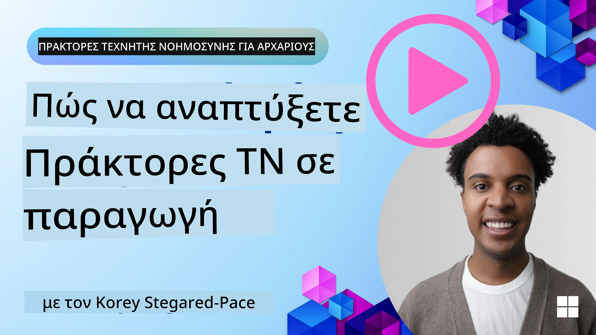

# Πράκτορες Τεχνητής Νοημοσύνης στην Παραγωγή: Παρατηρησιμότητα & Αξιολόγηση

[](https://youtu.be/l4TP6IyJxmQ?si=reGOyeqjxFevyDq9)

Καθώς οι πράκτορες τεχνητής νοημοσύνης εξελίσσονται από πειραματικά πρωτότυπα σε εφαρμογές πραγματικού κόσμου, η δυνατότητα κατανόησης της συμπεριφοράς τους, παρακολούθησης της απόδοσής τους και συστηματικής αξιολόγησης των αποτελεσμάτων τους καθίσταται σημαντική.

## Στόχοι Μάθησης

Μετά την ολοκλήρωση αυτού του μαθήματος, θα γνωρίζετε πώς/θα καταλάβετε:
- Βασικές έννοιες της παρατηρησιμότητας και αξιολόγησης των πρακτόρων
- Τεχνικές για τη βελτίωση της απόδοσης, του κόστους και της αποτελεσματικότητας των πρακτόρων
- Τι και πώς να αξιολογείτε τους πράκτορες τεχνητής νοημοσύνης σας συστηματικά
- Πώς να ελέγχετε το κόστος κατά την ανάπτυξη πρακτόρων τεχνητής νοημοσύνης στην παραγωγή
- Πώς να εξοπλίζετε με εργαλεία παρακολούθησης πράκτορες κατασκευασμένους με το Microsoft Agent Framework

Ο στόχος είναι να σας εφοδιάσουμε με τη γνώση ώστε να μετατρέψετε τους "μαύρους κουτί" πράκτορές σας σε διαφανή, διαχειρίσιμα και αξιόπιστα συστήματα.

_**Σημείωση:** Είναι σημαντικό να αναπτύσσετε Πράκτορες Τεχνητής Νοημοσύνης που είναι ασφαλείς και αξιόπιστοι. Ρίξτε επίσης μια ματιά στο μάθημα [Building Trustworthy AI Agents](../06-building-trustworthy-agents/README.md)._

## Ιχνη και Εύρηματα

Τα εργαλεία παρατηρησιμότητας όπως το [Langfuse](https://langfuse.com/) ή το [Microsoft Foundry](https://learn.microsoft.com/en-us/azure/ai-foundry/what-is-azure-ai-foundry) συνήθως αναπαριστούν τις εκτελέσεις του πράκτορα ως ιχνηλάτησεις και εύρηματα.

- **Ιχνηλάτηση** αναπαριστά μια ολοκληρωμένη εργασία πράκτορα από την αρχή έως το τέλος (όπως η επεξεργασία μιας ερώτησης χρήστη).
- **Εύρηματα** είναι τα μεμονωμένα βήματα μέσα στην ιχνηλάτηση (όπως η κλήση μοντέλου γλώσσας ή η ανάκτηση δεδομένων).


<!-- Image URL retained for illustration purposes -->

Χωρίς παρατηρησιμότητα, ένας πράκτορας ΤΝ μπορεί να μοιάζει με "μαύρο κουτί" – η εσωτερική του κατάσταση και η λογική του είναι αδιαφανείς, καθιστώντας δύσκολη τη διάγνωση προβλημάτων ή τη βελτιστοποίηση της απόδοσης. Με την παρατηρησιμότητα, οι πράκτορες γίνονται "γυάλινα κουτιά", προσφέροντας διαφάνεια που είναι ζωτική για την οικοδόμηση εμπιστοσύνης και τη διασφάλιση ότι λειτουργούν όπως πρέπει.

## Γιατί η Παρατηρησιμότητα Είναι Σημαντική σε Παραγωγικά Περιβάλλοντα

Η μετάβαση των πρακτόρων ΤΝ σε παραγωγικά περιβάλλοντα εισάγει νέες προκλήσεις και απαιτήσεις. Η παρατηρησιμότητα δεν είναι πλέον απλώς ένα "ωραίο να υπάρχει" αλλά μια κρίσιμη ικανότητα:

*   **Εντοπισμός Σφαλμάτων και Ανάλυση Αιτιών**: Όταν ένας πράκτορας αποτυγχάνει ή παράγει απρόσμενο αποτέλεσμα, τα εργαλεία παρατηρησιμότητας παρέχουν τα ιχνηλάτησης που απαιτούνται για να εντοπιστεί η πηγή του λάθους. Αυτό είναι εξαιρετικά σημαντικό σε σύνθετους πράκτορες που μπορεί να περιλαμβάνουν πολλαπλές κλήσεις σε μεγάλα μοντέλα γλώσσας, αλληλεπιδράσεις με εργαλεία και συνθήκες λογικής.
*   **Διαχείριση Καθυστέρησης και Κόστους**: Οι πράκτορες ΤΝ συνήθως βασίζονται σε LLM και άλλες εξωτερικές διεπαφές προγραμματισμού εφαρμογών που χρεώνονται ανά τοκεν ή κλήση. Η παρατηρησιμότητα επιτρέπει ακριβή παρακολούθηση αυτών των κλήσεων, βοηθώντας στην αναγνώριση λειτουργιών που είναι υπερβολικά αργές ή δαπανηρές. Αυτό επιτρέπει στις ομάδες να βελτιστοποιήσουν προτροπές, να επιλέξουν πιο αποδοτικά μοντέλα ή να σχεδιάσουν εκ νέου ροές εργασίας για τη διαχείριση του λειτουργικού κόστους και τη διασφάλιση καλής εμπειρίας χρήστη.
*   **Εμπιστοσύνη, Ασφάλεια και Συμμόρφωση**: Σε πολλές εφαρμογές, είναι σημαντικό να διασφαλίζεται ότι οι πράκτορες λειτουργούν με ασφάλεια και ηθικά. Η παρατηρησιμότητα παρέχει ένα ίχνος ελέγχου των ενεργειών και αποφάσεων των πρακτόρων. Αυτό μπορεί να χρησιμοποιηθεί για την ανίχνευση και αντιμετώπιση προβλημάτων όπως η ένεση προτροπής, η δημιουργία κακόβουλου περιεχομένου ή η εσφαλμένη διαχείριση προσωπικών δεδομένων (PII). Για παράδειγμα, μπορείτε να ελέγξετε ιχνηλάτησεις για να κατανοήσετε γιατί ένας πράκτορας παρείχε μια συγκεκριμένη απάντηση ή χρησιμοποίησε ένα συγκεκριμένο εργαλείο.
*   **Συνεχή Κυκλικά Βελτίωσης**: Τα δεδομένα παρατηρησιμότητας αποτελούν τη βάση μιας επαναληπτικής διαδικασίας ανάπτυξης. Παρακολουθώντας πώς αποδίδουν οι πράκτορες σε πραγματικό κόσμο, οι ομάδες μπορούν να εντοπίσουν πεδία βελτίωσης, να συλλέξουν δεδομένα για τη βελτιστοποίηση μοντέλων και να επικυρώσουν τις επιπτώσεις των αλλαγών. Αυτό δημιουργεί έναν βρόχο ανατροφοδότησης όπου οι παραγωγικές γνώσεις από την online αξιολόγηση ενημερώνουν για offline πειραματισμούς και βελτιώσεις, οδηγώντας σε σταδιακά καλύτερη απόδοση των πρακτόρων.

## Βασικοί Δείκτες για Παρακολούθηση

Για να παρακολουθείτε και να κατανοείτε τη συμπεριφορά των πρακτόρων, πρέπει να παρακολουθείτε μια σειρά δεικτών και σημάτων. Ενώ οι συγκεκριμένοι δείκτες μπορεί να διαφέρουν ανάλογα με το σκοπό του πράκτορα, μερικοί είναι καθολικά σημαντικοί.

Εδώ είναι μερικοί από τους πιο συνηθισμένους δείκτες που παρακολουθούν τα εργαλεία παρατηρησιμότητας:

**Καθυστέρηση:** Πόσο γρήγορα ανταποκρίνεται ο πράκτορας; Οι μεγάλες χρόνοι αναμονής επηρεάζουν αρνητικά την εμπειρία του χρήστη. Πρέπει να μετράτε την καθυστέρηση για εργασίες και μεμονωμένα βήματα μέσω ιχνηλάτησης εκτελέσεων πράκτορα. Για παράδειγμα, ένας πράκτορας που χρειάζεται 20 δευτερόλεπτα για όλες τις κλήσεις μοντέλου μπορεί να επιταχυνθεί με τη χρήση ενός ταχύτερου μοντέλου ή εκτελώντας τις κλήσεις παράλληλα.

**Κόστη:** Ποιο είναι το κόστος ανά εκτέλεση πράκτορα; Οι πράκτορες ΤΝ βασίζονται σε κλήσεις LLM που χρεώνονται ανά τοκεν ή εξωτερικές API. Η συχνή χρήση εργαλείων ή πολλαπλές προτροπές μπορούν να αυξήσουν γρήγορα το κόστος. Για παράδειγμα, αν ένας πράκτορας καλεί ένα LLM πέντε φορές για οριακή βελτίωση ποιότητας, πρέπει να αξιολογήσετε αν το κόστος είναι δικαιολογημένο ή αν μπορείτε να μειώσετε τον αριθμό κλήσεων ή να χρησιμοποιήσετε φθηνότερο μοντέλο. Ο πραγματικός χρόνος παρακολούθησης μπορεί επίσης να βοηθήσει στον εντοπισμό απρόβλεπτων αιχμών (π.χ. σφάλματα που προκαλούν υπερβολικούς βρόχους API).

**Σφάλματα Αιτήσεων:** Πόσες αιτήσεις απέτυχε να ολοκληρώσει ο πράκτορας; Αυτό μπορεί να περιλαμβάνει σφάλματα API ή αποτυχημένες κλήσεις εργαλείων. Για να κάνετε τον πράκτορα πιο ανθεκτικό σε αυτά στην παραγωγή, μπορείτε να ρυθμίσετε εφεδρικές επιλογές ή επαναλήψεις. Π.χ. αν ο πάροχος LLM A είναι εκτός λειτουργίας, μπορείτε να μεταβείτε στον πάροχο LLM B ως εφεδρικό.

**Ανατροφοδότηση Χρηστών:** Η υλοποίηση απευθείας αξιολογήσεων χρηστών παρέχει πολύτιμες πληροφορίες. Αυτό μπορεί να περιλαμβάνει ρητές βαθμολογίες (👍θετική ψήφο/👎αρνητική, ⭐1-5 αστέρια) ή κείμενα σχολίων. Η σταθερή αρνητική ανατροφοδότηση πρέπει να σας προειδοποιεί καθώς αυτό δείχνει ότι ο πράκτορας δεν λειτουργεί όπως αναμένεται.

**Έμμεση Ανατροφοδότηση Χρηστών:** Οι συμπεριφορές των χρηστών παρέχουν έμμεση ανατροφοδότηση ακόμη και χωρίς ρητές αξιολογήσεις. Αυτό μπορεί να περιλαμβάνει άμεσες επαναδιατυπώσεις ερωτήσεων, επαναλαμβανόμενες ερωτήσεις ή κλικ στο κουμπί επανάληψης. Π.χ. αν δείτε ότι οι χρήστες ρωτούν την ίδια ερώτηση πολλές φορές, αυτό είναι σημάδι ότι ο πράκτορας δεν λειτουργεί όπως αναμένεται.

**Ακρίβεια:** Πόσο συχνά ο πράκτορας παράγει σωστά ή επιθυμητά αποτελέσματα; Ο ορισμός της ακρίβειας διαφέρει (π.χ. ορθότητα επίλυσης προβλημάτων, ακρίβεια ανάκτησης πληροφορίας, ικανοποίηση χρήστη). Το πρώτο βήμα είναι να ορίσετε τι σημαίνει επιτυχία για τον πράκτορά σας. Μπορείτε να παρακολουθείτε την ακρίβεια μέσω αυτοματοποιημένων ελέγχων, βαθμολογιών αξιολόγησης ή ετικετών ολοκλήρωσης εργασιών. Για παράδειγμα, επισημαίνοντας ιχνηλάτησεις ως "επιτυχείς" ή "αποτυχίες".

**Αυτοματοποιημένοι Δείκτες Αξιολόγησης:** Μπορείτε επίσης να ρυθμίσετε αυτοματοποιημένες αξιολογήσεις. Για παράδειγμα, μπορείτε να χρησιμοποιήσετε ένα LLM για να βαθμολογήσει την έξοδο του πράκτορα, π.χ. αν είναι χρήσιμη, ακριβής ή όχι. Υπάρχουν επίσης αρκετές βιβλιοθήκες ανοιχτού κώδικα που βοηθούν στη βαθμολόγηση διαφόρων πτυχών του πράκτορα. Π.χ. [RAGAS](https://docs.ragas.io/) για πράκτορες RAG ή [LLM Guard](https://llm-guard.com/) για ανίχνευση κακόβουλης γλώσσας ή ένεσης προτροπής.

Στην πράξη, ένας συνδυασμός αυτών των δεικτών παρέχει την καλύτερη κάλυψη της υγείας ενός πράκτορα ΤΝ. Στο [παραδειγματικό σημειωματάριο](./code_samples/10-expense_claim-demo.ipynb) αυτού του κεφαλαίου, θα σας δείξουμε πώς φαίνονται αυτοί οι δείκτες σε πραγματικά παραδείγματα, αλλά πρώτα θα μάθουμε πώς μοιάζει μια τυπική ροή αξιολόγησης.

## Εξορκίστε τον Πράκτορά σας

Για να συγκεντρώσετε δεδομένα ιχνηλάτησης, θα χρειαστεί να εξορκίσετε τον κώδικά σας. Ο στόχος είναι να εξοπλίσετε τον κώδικα του πράκτορα ώστε να εκπέμπει ίχνη και μετρικές που μπορούν να καταγραφούν, να επεξεργαστούν και να οπτικοποιηθούν από μια πλατφόρμα παρατηρησιμότητας.

**OpenTelemetry (OTel):** Το [OpenTelemetry](https://opentelemetry.io/) έχει αναδειχθεί ως βιομηχανικό πρότυπο για την παρατηρησιμότητα LLM. Παρέχει ένα σύνολο API, SDK και εργαλείων για τη δημιουργία, συλλογή και εξαγωγή δεδομένων τηλεμετρίας.

Υπάρχουν πολλές βιβλιοθήκες εξοπλισμού που περιτυλίγουν υπάρχοντα πλαίσια πρακτόρων και διευκολύνουν την εξαγωγή των στιγμάτων OpenTelemetry σε ένα εργαλείο παρατηρησιμότητας. Το Microsoft Agent Framework ενσωματώνει το OpenTelemetry εγγενώς. Παρακάτω είναι ένα παράδειγμα για την εξόπλιση ενός πράκτορα MAF:

```python
from agent_framework.observability import get_tracer, get_meter

tracer = get_tracer()
meter = get_meter()

with tracer.start_as_current_span("agent_run"):
    # Η εκτέλεση του πράκτορα παρακολουθείται αυτόματα
    pass
```

Το [παραδειγματικό σημειωματάριο](./code_samples/10-expense_claim-demo.ipynb) σε αυτό το κεφάλαιο θα δείξει πώς να εξοπλίσετε τον πράκτορά σας MAF.

**Χειροκίνητη Δημιουργία Εύρηματος:** Ενώ οι βιβλιοθήκες εξοπλισμού παρέχουν μια καλή βάση, υπάρχουν περιπτώσεις που χρειάζονται πιο λεπτομερείς ή προσαρμοσμένες πληροφορίες. Μπορείτε να δημιουργήσετε χειροκίνητα εύρηματα για να προσθέσετε προσαρμοσμένη λογική εφαρμογής. Το σημαντικότερο είναι ότι μπορούν να εμπλουτίσουν αυτόματα ή χειροκίνητα δημιουργημένα εύρηματα με προσαρμοσμένα χαρακτηριστικά (γνωστά και ως ετικέτες ή μεταδεδομένα). Αυτά τα χαρακτηριστικά μπορεί να περιλαμβάνουν δεδομένα ειδικά για την επιχείρηση, ενδιάμεσους υπολογισμούς ή οποιοδήποτε πλαίσιο μπορεί να φανεί χρήσιμο για εντοπισμό σφαλμάτων ή ανάλυση, όπως `user_id`, `session_id`, ή `model_version`.

Παράδειγμα χειροκίνητης δημιουργίας ιχνών και εύρηματων με το [Langfuse Python SDK](https://langfuse.com/docs/sdk/python/sdk-v3):

```python
from langfuse import get_client
 
langfuse = get_client()
 
span = langfuse.start_span(name="my-span")
 
span.end()
```

## Αξιολόγηση Πράκτορα

Η παρατηρησιμότητα μας παρέχει μετρικές, αλλά η αξιολόγηση είναι η διαδικασία ανάλυσης αυτών των δεδομένων (και πραγματοποίησης δοκιμών) για να καθορίσουμε πόσο καλά αποδίδει ένας πράκτορας ΤΝ και πώς μπορεί να βελτιωθεί. Με άλλα λόγια, μόλις έχετε αυτά τα ίχνη και τις μετρικές, πώς τα χρησιμοποιείτε για να κρίνετε τον πράκτορα και να πάρετε αποφάσεις;

Η τακτική αξιολόγηση είναι σημαντική γιατί οι πράκτορες ΤΝ συχνά δεν είναι ντετερμινιστικοί και μπορούν να εξελιχθούν (μέσω ενημερώσεων ή μεταβολής της συμπεριφοράς του μοντέλου) – χωρίς αξιολόγηση, δεν θα ξέρετε αν ο "έξυπνος πράκτορας" κάνει πραγματικά καλά τη δουλειά του ή αν έχει υποστεί υποβάθμιση.

Υπάρχουν δύο κατηγορίες αξιολογήσεων για τους πράκτορες ΤΝ: **online αξιολόγηση** και **offline αξιολόγηση**. Και οι δύο είναι πολύτιμες και αλληλοσυμπληρώνονται. Συνήθως ξεκινάμε με την offline αξιολόγηση, καθώς αυτή είναι η ελάχιστη απαραίτητη φάση πριν από την ανάπτυξη οποιουδήποτε πράκτορα.

### Offline Αξιολόγηση


Αυτή περιλαμβάνει την αξιολόγηση του πράκτορα σε ελεγχόμενο περιβάλλον, συνήθως χρησιμοποιώντας σύνολα δεδομένων δοκιμής και όχι ζωντανές ερωτήσεις χρηστών. Χρησιμοποιείτε επιλεγμένα σύνολα δεδομένων όπου γνωρίζετε ποιο είναι το αναμενόμενο αποτέλεσμα ή η σωστή συμπεριφορά και στη συνέχεια εκτελείτε τον πράκτορά σας σε αυτά.

Για παράδειγμα, αν έχετε κατασκευάσει έναν πράκτορα επίλυσης προβλημάτων λέξης μαθηματικών, μπορεί να έχετε ένα [σύνολο δοκιμών](https://huggingface.co/datasets/gsm8k) με 100 προβλήματα με γνωστές απαντήσεις. Η offline αξιολόγηση γίνεται συχνά κατά την ανάπτυξη (και μπορεί να είναι μέρος pipeline CI/CD) για τον έλεγχο βελτιώσεων ή την αποφυγή υποβάθμισης. Το πλεονέκτημα είναι ότι είναι **επαναλήψιμη και μπορείτε να λάβετε σαφείς μετρήσεις ακρίβειας καθώς έχετε τη σωστή αλήθεια**. Μπορείτε επίσης να προσομοιώσετε ερωτήσεις χρηστών και να μετρήσετε τις απαντήσεις του πράκτορα έναντι ιδανικών απαντήσεων ή να χρησιμοποιήσετε αυτοματοποιημένες μετρικές όπως περιγράφηκε παραπάνω.

Η βασική πρόκληση για την offline αξιολόγηση είναι να εξασφαλίσετε ότι το σύνολο δοκιμών σας είναι ολοκληρωμένο και παραμένει σχετικό – ο πράκτορας μπορεί να αποδίδει καλά σε ένα σταθερό σύνολο δοκιμών αλλά να αντιμετωπίζει πολύ διαφορετικές ερωτήσεις στην παραγωγή. Για αυτό, πρέπει να διατηρείτε τα σύνολα δοκιμών ενημερωμένα με νέα ακραία περιστατικά και παραδείγματα που αντικατοπτρίζουν σενάρια πραγματικού κόσμου​. Ένας συνδυασμός μικρών "δοκιμών καπνού" και μεγαλύτερων συνόλων αξιολόγησης είναι χρήσιμος: μικρά σετ για γρήγορους ελέγχους και μεγαλύτερα για ευρύτερες μετρικές απόδοσης​.

### Online Αξιολόγηση


Αυτό αναφέρεται στην αξιολόγηση του πράκτορα σε ζωντανό, πραγματικό περιβάλλον, δηλαδή κατά τη διάρκεια της πραγματικής χρήσης στην παραγωγή. Η online αξιολόγηση περιλαμβάνει την παρακολούθηση της απόδοσης του πράκτορα σε πραγματικές αλληλεπιδράσεις χρηστών και τη συνεχή ανάλυση αποτελεσμάτων.

Για παράδειγμα, μπορεί να παρακολουθείτε ποσοστά επιτυχίας, βαθμολογίες ικανοποίησης χρηστών ή άλλες μετρικές σε πραγματική κυκλοφορία. Το πλεονέκτημα της online αξιολόγησης είναι ότι **συλλαμβάνει πράγματα που ίσως δεν προβλέψετε σε εργαστηριακό περιβάλλον** – μπορείτε να παρατηρήσετε μετατόπιση μοντέλου με το χρόνο (αν η αποτελεσματικότητα του πράκτορα μειώνεται καθώς αλλάζουν τα πρότυπα εισόδου) και να ανιχνεύσετε απρόβλεπτα ερωτήματα ή καταστάσεις που δεν ήταν στο σύνολο δοκιμών σας​. Παρέχει μια αληθινή εικόνα του πώς συμπεριφέρεται ο πράκτορας στο φυσικό περιβάλλον.

Η online αξιολόγηση συχνά περιλαμβάνει συλλογή έμμεσης και ρητής ανατροφοδότησης χρηστών, όπως συζητήθηκε, και ενδεχομένως τη διεξαγωγή δοκιμών σε σκιά ή A/B tests (όπου μια νέα έκδοση του πράκτορα τρέχει παράλληλα για σύγκριση με την παλιά). Η πρόκληση είναι ότι μπορεί να είναι δύσκολο να αποκτήσετε αξιόπιστες ετικέτες ή βαθμολογίες για ζωντανές αλληλεπιδράσεις – μπορεί να βασιστείτε στην ανατροφοδότηση χρήστη ή σε μετρικές κατώτερων στρωμάτων (π.χ. αν ο χρήστης κλικαρε το αποτέλεσμα).

### Συνδυασμός των δύο

Οι online και offline αξιολογήσεις δεν είναι αμοιβαία αποκλειόμενες, είναι πολύ συμπληρωματικές. Οι γνώσεις από την online παρακολούθηση (π.χ. νέοι τύποι ερωτήσεων χρηστών όπου ο πράκτορας αποδίδει άσχημα) μπορούν να χρησιμοποιηθούν για τη βελτίωση των offline συνόλων δοκιμών. Αντίστροφα, οι πράκτορες που αποδίδουν καλά σε offline δοκιμές μπορούν να αναπτυχθούν και να παρακολουθούνται πιο αξιόπιστα online.

Στην πραγματικότητα, πολλές ομάδες υιοθετούν έναν βρόχο:

_αξιολόγηση offline -> ανάπτυξη -> παρακολούθηση online -> συλλογή νέων περιπτώσεων αποτυχίας -> προσθήκη στο offline σύνολο -> βελτίωση πράκτορα -> επανάληψη_.

## Συνήθη Προβλήματα

Καθώς αναπτύσσετε πράκτορες ΤΝ στην παραγωγή, μπορεί να αντιμετωπίσετε διάφορες προκλήσεις. Ακολουθούν μερικά κοινά προβλήματα και πιθανές λύσεις:

| **Πρόβλημα**    | **Πιθανή Λύση**   |
| ------------- | ------------------ |
| Ο πράκτορας ΤΝ δεν εκτελεί εργασίες με συνέπεια | - Βελτιώστε την προτροπή που δίνεται στον πράκτορα ΤΝ· να είστε σαφείς στους στόχους.<br>- Εντοπίστε πού η διαίρεση εργασιών σε υποεργασίες και η διαχείριση από πολλούς πράκτορες μπορεί να βοηθήσει. |
| Ο πράκτορας ΤΝ εισέρχεται σε ατέρμονες βρόχους  | - Εξασφαλίστε ότι έχετε σαφείς όρους και προϋποθέσεις τερματισμού ώστε ο πράκτορας να γνωρίζει πότε να σταματήσει τη διαδικασία.<br>- Για σύνθετες εργασίες που απαιτούν λογική και σχεδιασμό, χρησιμοποιήστε μεγαλύτερο μοντέλο εξειδικευμένο σε εργασίες λογικής. |
| Οι κλήσεις εργαλείων του πράκτορα ΤΝ δεν αποδίδουν καλά   | - Δοκιμάστε και επικυρώστε τα αποτελέσματα των εργαλείων έξω από το σύστημα του πράκτορα.<br>- Βελτιώστε τις ορισμένες παραμέτρους, τις προτροπές και την ονοματοδοσία των εργαλείων.  |
| Το σύστημα με πολλούς πράκτορες δεν αποδίδει με συνέπεια | - Βελτιώστε τις προτροπές που δίνονται σε κάθε πράκτορα ώστε να είναι συγκεκριμένες και διακριτές μεταξύ τους.<br>- Δημιουργήστε ιεραρχικό σύστημα χρησιμοποιώντας "διανομέα" ή πράκτορα ελεγκτή για να αποφασίζει ποιος πράκτορας είναι ο σωστός. |

Πολλά από αυτά τα προβλήματα μπορούν να εντοπιστούν πιο αποτελεσματικά με την παρατηρησιμότητα σε εφαρμογή. Τα ίχνη και οι δείκτες που συζητήσαμε νωρίτερα βοηθούν στο να εντοπίσετε ακριβώς πού στο ρεύμα εργασίας του πράκτορα προκύπτουν προβλήματα, καθιστώντας τον εντοπισμό σφαλμάτων και τη βελτιστοποίηση πολύ πιο αποδοτικούς.

## Διαχείριση Κόστους
Εδώ είναι μερικές στρατηγικές για τη διαχείριση του κόστους ανάπτυξης πρακτόρων AI σε παραγωγή:

**Χρήση Μικρότερων Μοντέλων:** Τα Μικρά Γλωσσικά Μοντέλα (SLMs) μπορούν να αποδώσουν καλά σε ορισμένες περιπτώσεις χρήσης πρακτόρων και θα μειώσουν σημαντικά τα κόστη. Όπως αναφέρθηκε προηγουμένως, η δημιουργία ενός συστήματος αξιολόγησης για τον καθορισμό και τη σύγκριση της απόδοσης έναντι των μεγαλύτερων μοντέλων είναι ο καλύτερος τρόπος να καταλάβετε πόσο καλά θα αποδώσει ένα SLM στη δική σας περίπτωση χρήσης. Σκεφτείτε τη χρήση SLMs για απλούστερα καθήκοντα όπως η ταξινόμηση προθέσεων ή η εξαγωγή παραμέτρων, ενώ κρατάτε τα μεγαλύτερα μοντέλα για πιο σύνθετη λογική.

**Χρήση Μοντέλου Δρομολόγησης:** Μια παρόμοια στρατηγική είναι η χρήση ποικιλίας μοντέλων και μεγεθών. Μπορείτε να χρησιμοποιήσετε ένα LLM/SLM ή μια λειτουργία χωρίς διακομιστή για να δρομολογείτε τα αιτήματα με βάση την πολυπλοκότητα στα καλύτερα κατάλληλα μοντέλα. Αυτό επίσης θα βοηθήσει στη μείωση του κόστους ενώ θα εξασφαλίζει απόδοση στα κατάλληλα καθήκοντα. Για παράδειγμα, δρομολογήστε απλές ερωτήσεις σε μικρότερα, γρηγορότερα μοντέλα και χρησιμοποιήστε τα ακριβά μεγάλα μοντέλα μόνο για σύνθετα καθήκοντα λογικής.

**Αποθήκευση Απαντήσεων (Caching):** Η αναγνώριση κοινών αιτημάτων και εργασιών και η παροχή των απαντήσεων πριν περάσουν από το σύστημα πρακτόρων είναι ένας καλός τρόπος για να μειώσετε τον όγκο παρόμοιων αιτημάτων. Μπορείτε ακόμα να υλοποιήσετε μια ροή που θα εντοπίζει πόσο παρόμοιο είναι ένα αίτημα με τα αποθηκευμένα σας αιτήματα χρησιμοποιώντας πιο βασικά μοντέλα AI. Αυτή η στρατηγική μπορεί να μειώσει σημαντικά το κόστος για συχνές ερωτήσεις ή κοινές ροές εργασίας.

## Ας δούμε πώς λειτουργεί αυτό στην πράξη

Στο [παράδειγμα σημειωματάριου αυτής της ενότητας](./code_samples/10-expense_claim-demo.ipynb), θα δούμε παραδείγματα για το πώς μπορούμε να χρησιμοποιήσουμε εργαλεία παρατηρησιμότητας για να παρακολουθούμε και να αξιολογούμε τον πράκτορά μας.


### Έχετε Περισσότερες Ερωτήσεις για Πράκτορες AI σε Παραγωγή;

Εγγραφείτε στο [Microsoft Foundry Discord](https://discord.com/invite/ATgtXmAS5D) για να συναντηθείτε με άλλους μαθητές, να παρακολουθήσετε office hours και να λάβετε απαντήσεις στις ερωτήσεις σας για Πράκτορες AI.

## Προηγούμενο Μάθημα

[Σχέδιο Μεταγνωστικής Σκέψης](../09-metacognition/README.md)

## Επόμενο Μάθημα

[Πρακτορικά Πρωτόκολλα](../11-agentic-protocols/README.md)

---

<!-- CO-OP TRANSLATOR DISCLAIMER START -->
**Αποποίηση ευθυνών**:
Αυτό το έγγραφο έχει μεταφραστεί χρησιμοποιώντας την υπηρεσία μετάφρασης με τεχνητή νοημοσύνη [Co-op Translator](https://github.com/Azure/co-op-translator). Ενώ επιδιώκουμε την ακρίβεια, παρακαλούμε να έχετε υπόψη ότι οι αυτοματοποιημένες μεταφράσεις ενδέχεται να περιέχουν λάθη ή ανακρίβειες. Το πρωτότυπο έγγραφο στη μητρική του γλώσσα πρέπει να θεωρείται η αυθεντική πηγή. Για κρίσιμες πληροφορίες, συνιστάται επαγγελματική ανθρώπινη μετάφραση. Δεν φέρουμε ευθύνη για τυχόν παρεξηγήσεις ή λανθασμένες ερμηνείες που προκύπτουν από τη χρήση αυτής της μετάφρασης.
<!-- CO-OP TRANSLATOR DISCLAIMER END -->