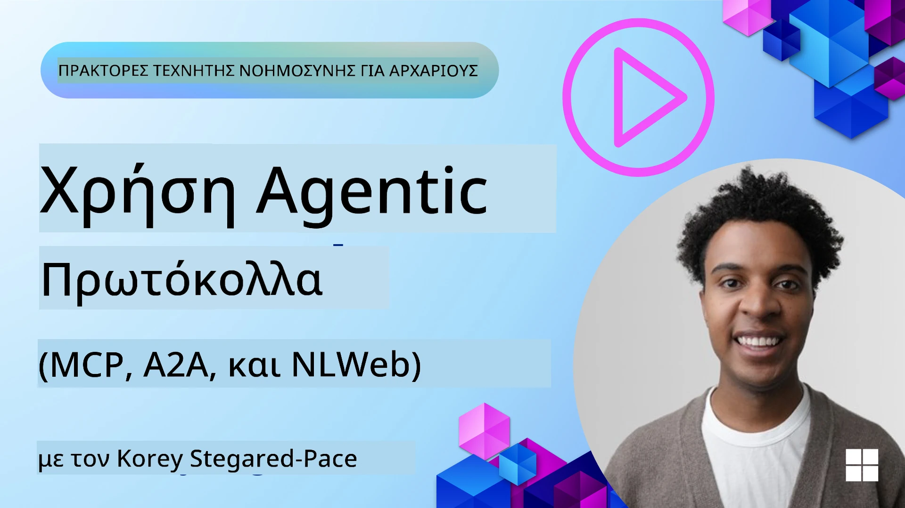
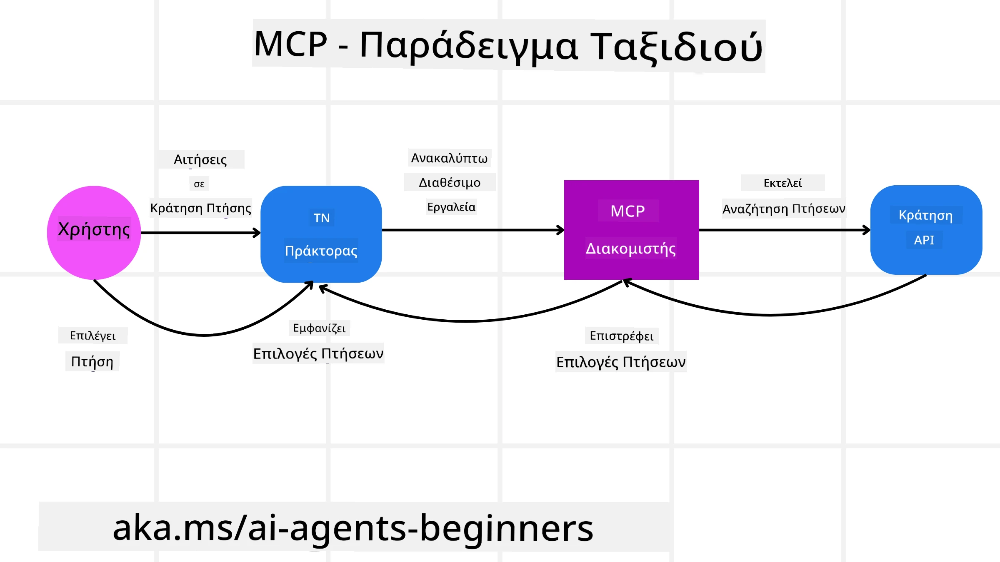
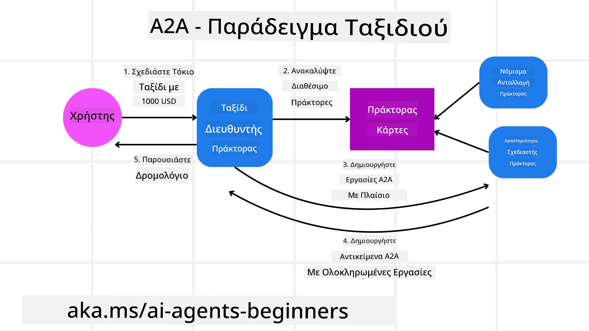
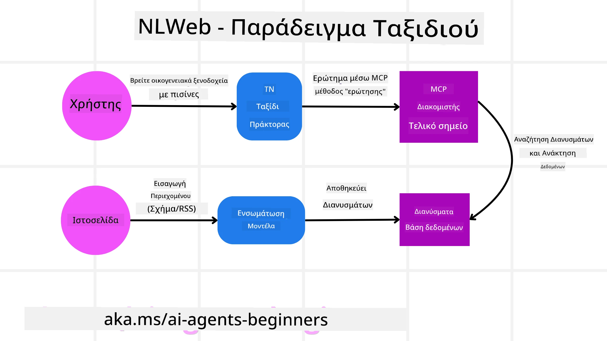

# Χρήση Agentic Πρωτοκόλλων (MCP, A2A και NLWeb)

> _(Κάντε κλικ στην εικόνα παραπάνω για να δείτε το βίντεο αυτού του μαθήματος)_

Καθώς αυξάνεται η χρήση των AI πρακτόρων, αυξάνεται και η ανάγκη για πρωτόκολλα που διασφαλίζουν την τυποποίηση, την ασφάλεια και υποστηρίζουν την ανοιχτή καινοτομία. Σε αυτό το μάθημα, θα καλύψουμε 3 πρωτόκολλα που επιδιώκουν να ικανοποιήσουν αυτήν την ανάγκη - το Model Context Protocol (MCP), το Agent to Agent (A2A) και το Natural Language Web (NLWeb).

## Εισαγωγή

Σε αυτό το μάθημα, θα καλύψουμε:

• How **MCP** allows AI Agents to access external tools and data to complete user tasks.

•  How **A2A** enables communication and collaboration between different AI agents.

• How **NLWeb** brings natural language interfaces to any website enabling AI Agents to discover and interact with the content.

## Στόχοι Μάθησης

• **Αναγνωρίστε** τον κύριο σκοπό και τα οφέλη του MCP, του A2A και του NLWeb στο πλαίσιο των AI πρακτόρων.

• **Εξηγήστε** πώς κάθε πρωτόκολλο διευκολύνει την επικοινωνία και την αλληλεπίδραση μεταξύ LLMs, εργαλείων και άλλων πρακτόρων.

• **Αναγνωρίστε** τους διακριτούς ρόλους που διαδραματίζει κάθε πρωτόκολλο στην κατασκευή σύνθετων συστημάτων πρακτόρων.

## Model Context Protocol

Το **Model Context Protocol (MCP)** είναι ένα ανοιχτό πρότυπο που παρέχει έναν τυποποιημένο τρόπο για εφαρμογές να παρέχουν context και εργαλεία σε LLMs. Αυτό επιτρέπει έναν "καθολικό προσαρμογέα" σε διαφορετικές πηγές δεδομένων και εργαλεία στα οποία οι AI Πράκτορες μπορούν να συνδεθούν με έναν συνεπή τρόπο.

Ας δούμε τα συστατικά του MCP, τα οφέλη σε σύγκριση με τη χρήση απευθείας API, και ένα παράδειγμα για το πώς οι AI agents μπορεί να χρησιμοποιήσουν έναν MCP server.

### MCP Core Components

Το MCP λειτουργεί με μια **αρχιτεκτονική πελάτη-εξυπηρετητή** και τα βασικά στοιχεία είναι:

• **Hosts** είναι εφαρμογές LLM (για παράδειγμα ένας επεξεργαστής κώδικα όπως το VSCode) που ξεκινούν τις συνδέσεις με έναν MCP Server.

• **Clients** είναι συστατικά εντός της εφαρμογής host που διατηρούν μονο-σε-μονο συνδέσεις με servers.

• **Servers** είναι ελαφριά προγράμματα που εκθέτουν συγκεκριμένες δυνατότητες.

Συμπεριλαμβανόμενα στο πρωτόκολλο είναι τρεις βασικές πρωτογενείς οντότητες οι οποίες είναι οι δυνατότητες ενός MCP Server:

• **Tools**: Αυτές είναι διακριτές ενέργειες ή συναρτήσεις που ένας AI πράκτορας μπορεί να καλέσει για να εκτελέσει μια ενέργεια. Για παράδειγμα, μια υπηρεσία καιρού μπορεί να εκθέσει ένα εργαλείο "get weather", ή ένας e-commerce server μπορεί να εκθέσει ένα εργαλείο "purchase product". Οι MCP servers διαφημίζουν το όνομα κάθε εργαλείου, την περιγραφή και το σχήμα εισόδου/εξόδου στη λίστα δυνατοτήτων τους.

• **Resources**: Αυτά είναι στοιχεία δεδομένων μόνο για ανάγνωση ή έγγραφα που ένας MCP server μπορεί να παρέχει, και οι clients μπορούν να τα ανακτήσουν κατά ζήτηση. Παραδείγματα περιλαμβάνουν περιεχόμενο αρχείων, εγγραφές βάσεων δεδομένων ή αρχεία καταγραφής. Οι Resources μπορούν να είναι κείμενο (όπως κώδικας ή JSON) ή δυαδικά (όπως εικόνες ή PDF).

• **Prompts**: Πρόκειται για προκαθορισμένα πρότυπα που παρέχουν προτεινόμενα prompts, επιτρέποντας πιο σύνθετες ροές εργασίας.

### Benefits of MCP

Το MCP προσφέρει σημαντικά πλεονεκτήματα για τους AI Πράκτορες:

• **Δυναμική Ανίχνευση Εργαλείων**: Οι πράκτορες μπορούν να λαμβάνουν δυναμικά μια λίστα με διαθέσιμα εργαλεία από έναν server μαζί με περιγραφές του τι κάνουν. Αυτό αντιτίθεται με τα παραδοσιακά APIs, τα οποία συχνά απαιτούν στατική κωδικοποίηση για ενσωματώσεις, πράγμα που σημαίνει ότι οποιαδήποτε αλλαγή στο API απαιτεί ενημερώσεις κώδικα. Το MCP προσφέρει μια προσέγγιση "ενσωματώστε μια φορά", οδηγώντας σε μεγαλύτερη προσαρμοστικότητα.

• **Διαλειτουργικότητα μεταξύ LLMs**: Το MCP λειτουργεί σε διαφορετικά LLMs, παρέχοντας ευελιξία στην αλλαγή των βασικών μοντέλων για αξιολόγηση καλύτερης απόδοσης.

• **Τυποποιημένη Ασφάλεια**: Το MCP περιλαμβάνει μια τυπική μέθοδο αυθεντικοποίησης, βελτιώνοντας την κλιμάκωση όταν προστίθεται πρόσβαση σε επιπλέον MCP servers. Αυτό είναι απλούστερο από τη διαχείριση διαφορετικών κλειδιών και τύπων αυθεντικοποίησης για διάφορα παραδοσιακά APIs.

### MCP Example

Φανταστείτε ότι ένας χρήστης θέλει να κλείσει μια πτήση χρησιμοποιώντας έναν βοηθό AI που τροφοδοτείται από MCP.

1. **Connection**: Ο βοηθός AI (ο MCP client) συνδέεται σε έναν MCP server που παρέχεται από μια αεροπορική εταιρεία.

2. **Tool Discovery**: Ο client ρωτάει τον MCP server της αεροπορικής εταιρείας, "Τι εργαλεία έχετε διαθέσιμα;" Ο server απαντά με εργαλεία όπως "search flights" και "book flights".

3. **Tool Invocation**: Στη συνέχεια ζητάτε από τον βοηθό AI, "Παρακαλώ αναζήτησε μια πτήση από Portland προς Honolulu." Ο βοηθός AI, χρησιμοποιώντας το LLM του, εντοπίζει ότι πρέπει να καλέσει το εργαλείο "search flights" και περνά τα σχετικά παραμέτρους (origin, destination) στον MCP server.

4. **Execution and Response**: Ο MCP server, λειτουργώντας ως wrapper, πραγματοποιεί την πραγματική κλήση στο εσωτερικό booking API της αεροπορικής εταιρείας. Στη συνέχεια λαμβάνει τις πληροφορίες για τις πτήσεις (π.χ., δεδομένα JSON) και τις στέλνει πίσω στον βοηθό AI.

5. **Further Interaction**: Ο βοηθός AI παρουσιάζει τις επιλογές πτήσεων. Μόλις επιλέξετε μια πτήση, ο βοηθός μπορεί να καλέσει το εργαλείο "book flight" στον ίδιο MCP server, ολοκληρώνοντας την κράτηση.

## Agent-to-Agent Protocol (A2A)

Ενώ το MCP εστιάζει στη σύνδεση των LLMs με εργαλεία, το **Agent-to-Agent (A2A) protocol** προχωρά ένα βήμα παραπέρα επιτρέποντας την επικοινωνία και συνεργασία μεταξύ διαφορετικών AI πρακτόρων. Το A2A συνδέει AI πράκτορες σε διαφορετικές οργανώσεις, περιβάλλοντα και τεχνολογικά στρώματα για να ολοκληρώσουν ένα κοινό έργο.

Θα εξετάσουμε τα συστατικά και τα οφέλη του A2A, μαζί με ένα παράδειγμα του πώς θα μπορούσε να εφαρμοστεί στην εφαρμογή ταξιδιών μας.

### A2A Core Components

Το A2A επικεντρώνεται στην ενεργοποίηση της επικοινωνίας μεταξύ πρακτόρων και στο να συνεργάζονται για την ολοκλήρωση ενός υπο-έργου του χρήστη. Κάθε στοιχείο του πρωτοκόλλου συμβάλλει σε αυτό:

#### Agent Card

Παρόμοια με το πώς ένας MCP server μοιράζεται μια λίστα εργαλείων, μια Agent Card έχει:
- Το Όνομα του Πράκτορα .
- Μια **περιγραφή των γενικών εργασιών** που ολοκληρώνει.
- Μια **λίστα συγκεκριμένων δεξιοτήτων** με περιγραφές για να βοηθήσει άλλους πράκτορες (ή ακόμα και ανθρώπινους χρήστες) να κατανοήσουν πότε και γιατί θα ήθελαν να καλέσουν αυτόν τον πράκτορα.
- Το **τρέχον Endpoint URL** του πράκτορα
- Την **έκδοση** και τις **δυνατότητες** του πράκτορα όπως streaming απαντήσεις και push ειδοποιήσεις.

#### Agent Executor

Ο Agent Executor είναι υπεύθυνος για την **προώθηση του context της συνομιλίας του χρήστη στον απομακρυσμένο πράκτορα**, ο απομακρυσμένος πράκτορας χρειάζεται αυτό για να κατανοήσει το έργο που πρέπει να ολοκληρωθεί. Σε έναν A2A server, ένας πράκτορας χρησιμοποιεί το δικό του Large Language Model (LLM) για να αναλύσει εισερχόμενα αιτήματα και να εκτελέσει εργασίες χρησιμοποιώντας τα δικά του εσωτερικά εργαλεία.

#### Artifact

Μόλις ένας απομακρυσμένος πράκτορας ολοκληρώσει την αιτηθείσα εργασία, το προϊόν της εργασίας του δημιουργείται ως ένα artifact. Ένα artifact **περιέχει το αποτέλεσμα της εργασίας του πράκτορα**, μια **περιγραφή του τι ολοκληρώθηκε**, και το **κείμενο-πλαίσιο** που αποστέλλεται μέσω του πρωτοκόλλου. Αφού το artifact αποσταλεί, η σύνδεση με τον απομακρυσμένο πράκτορα κλείνει μέχρι να χρειαστεί ξανά.

#### Event Queue

Αυτό το στοιχείο χρησιμοποιείται για **χειρισμό ενημερώσεων και προώθηση μηνυμάτων**. Είναι ιδιαίτερα σημαντικό στην παραγωγή για συστήματα πρακτόρων ώστε να αποτρέπεται το κλείσιμο της σύνδεσης μεταξύ πρακτόρων προτού ολοκληρωθεί μια εργασία, ειδικά όταν οι χρόνοι ολοκλήρωσης μπορεί να είναι μεγάλοι.

### Benefits of A2A

• **Ενισχυμένη Συνεργασία**: Επιτρέπει σε πρακτόρες από διαφορετικούς προμηθευτές και πλατφόρμες να αλληλεπιδρούν, να μοιράζονται context και να συνεργάζονται, διευκολύνοντας την αδιάλειπτη αυτοματοποίηση σε παραδοσιακά αποσυνδεδεμένα συστήματα.

• **Ευελιξία στην Επιλογή Μοντέλου**: Κάθε πράκτορας A2A μπορεί να αποφασίσει ποιό LLM χρησιμοποιεί για την εξυπηρέτηση των αιτημάτων του, επιτρέποντας βελτιστοποιημένα ή ειδικά εκπαιδευμένα μοντέλα ανά πράκτορα, σε αντίθεση με μια ενιαία σύνδεση LLM σε κάποιες περιπτώσεις MCP.

• **Ενσωματωμένη Αυθεντικοποίηση**: Η αυθεντικοποίηση είναι ενσωματωμένη απευθείας στο πρωτόκολλο A2A, παρέχοντας ένα ισχυρό πλαίσιο ασφάλειας για τις αλληλεπιδράσεις των πρακτόρων.

### A2A Example

Ας επεκτείνουμε το σενάριο κράτησης ταξιδιού, αλλά αυτή τη φορά χρησιμοποιώντας A2A.

1. **User Request to Multi-Agent**: Ένας χρήστης αλληλεπιδρά με έναν "Travel Agent" A2A client/agent, ίσως λέγοντας, "Παρακαλώ κλείσε ένα ολόκληρο ταξίδι στο Honolulu για την επόμενη εβδομάδα, συμπεριλαμβανομένων πτήσεων, ξενοδοχείου και ενοικίασης αυτοκινήτου".

2. **Orchestration by Travel Agent**: Ο Travel Agent λαμβάνει αυτό το σύνθετο αίτημα. Χρησιμοποιεί το LLM του για να σκεφτεί πάνω στο έργο και να αποφασίσει ότι χρειάζεται να αλληλεπιδράσει με άλλους εξειδικευμένους πράκτορες.

3. **Inter-Agent Communication**: Ο Travel Agent χρησιμοποιεί το πρωτόκολλο A2A για να συνδεθεί με καθοδικούς πράκτορες, όπως έναν "Airline Agent", έναν "Hotel Agent" και έναν "Car Rental Agent" που έχουν δημιουργηθεί από διαφορετικές εταιρείες.

4. **Delegated Task Execution**: Ο Travel Agent στέλνει συγκεκριμένες εργασίες σε αυτούς τους εξειδικευμένους πράκτορες (π.χ., "Βρες πτήσεις προς Honolulu", "Κλείσε ένα ξενοδοχείο", "Ενοικίασε ένα αυτοκίνητο"). Κάθε ένας από αυτούς τους εξειδικευμένους πράκτορες, εκτελώντας τα δικά τους LLMs και χρησιμοποιώντας τα δικά τους εργαλεία (τα οποία θα μπορούσαν να είναι MCP servers), εκτελεί το συγκεκριμένο μέρος της κράτησης.

5. **Consolidated Response**: Μόλις όλοι οι καθοδικοί πράκτορες ολοκληρώσουν τις εργασίες τους, ο Travel Agent συνθέτει τα αποτελέσματα (πληροφορίες πτήσεων, επιβεβαίωση ξενοδοχείου, κράτηση ενοικίασης αυτοκινήτου) και στέλνει μια συνολική, μορφής συνομιλίας απάντηση πίσω στον χρήστη.

## Natural Language Web (NLWeb)

Οι ιστοσελίδες υπήρξαν για μεγάλο χρονικό διάστημα ο κύριος τρόπος πρόσβασης των χρηστών σε πληροφορίες και δεδομένα στο διαδίκτυο.

Ας δούμε τα διαφορετικά συστατικά του NLWeb, τα οφέλη του NLWeb και ένα παράδειγμα για το πώς λειτουργεί το NLWeb στην εφαρμογή ταξιδιών μας.

### Components of NLWeb

- **NLWeb Application (Core Service Code)**: Το σύστημα που επεξεργάζεται ερωτήματα φυσικής γλώσσας. Συνδέει τα διαφορετικά μέρη της πλατφόρμας για να δημιουργήσει απαντήσεις. Μπορείτε να το σκεφτείτε ως τη **μηχανή που τροφοδοτεί τις λειτουργίες φυσικής γλώσσας** μιας ιστοσελίδας.

- **NLWeb Protocol**: Αυτό είναι ένα **βασικό σύνολο κανόνων για αλληλεπίδραση φυσικής γλώσσας** με μια ιστοσελίδα. Επιστρέφει απαντήσεις σε μορφή JSON (συχνά χρησιμοποιώντας Schema.org). Σκοπός του είναι να δημιουργήσει ένα απλό θεμέλιο για το "AI Web", με τον ίδιο τρόπο που το HTML έκανε δυνατή την κοινή χρήση εγγράφων στο διαδίκτυο.

- **MCP Server (Model Context Protocol Endpoint)**: Κάθε ρύθμιση NLWeb λειτουργεί επίσης ως **MCP server**. Αυτό σημαίνει ότι μπορεί να **μοιράζεται εργαλεία (όπως μια μέθοδο `ask`) και δεδομένα** με άλλα συστήματα AI. Στην πράξη, αυτό καθιστά το περιεχόμενο και τις δυνατότητες της ιστοσελίδας χρήσιμες από πράκτορες AI, επιτρέποντας στην ιστοσελίδα να γίνει μέρος του ευρύτερου "οικοσυστήματος πρακτόρων."

- **Embedding Models**: Αυτά τα μοντέλα χρησιμοποιούνται για να **μετατρέψουν το περιεχόμενο της ιστοσελίδας σε αριθμητικές αναπαραστάσεις που καλούνται vectors** (embeddings). Αυτά τα vectors καταγράφουν σημασία με τρόπο που οι υπολογιστές μπορούν να συγκρίνουν και να αναζητήσουν. Αποθηκεύονται σε μια ειδική βάση δεδομένων, και οι χρήστες μπορούν να επιλέξουν ποιο embedding model θέλουν να χρησιμοποιήσουν.

- **Vector Database (Retrieval Mechanism)**: Αυτή η βάση δεδομένων **αποθηκεύει τα embeddings του περιεχομένου της ιστοσελίδας**. Όταν κάποιος κάνει μια ερώτηση, το NLWeb ελέγχει τη vector database για να βρει γρήγορα τις πιο σχετικές πληροφορίες. Δίνει μια γρήγορη λίστα πιθανών απαντήσεων, ταξινομημένων κατά ομοιότητα. Το NLWeb συνεργάζεται με διαφορετικά συστήματα αποθήκευσης διανυσμάτων όπως Qdrant, Snowflake, Milvus, Azure AI Search και Elasticsearch.

### NLWeb by Example

Σκεφτείτε ξανά την ιστοσελίδα κράτησης ταξιδιών μας, αλλά αυτή τη φορά υποστηρίζεται από NLWeb.

1. **Data Ingestion**: Τα υπάρχοντα καταλόγια προϊόντων της ιστοσελίδας ταξιδιών (π.χ., λίστες πτήσεων, περιγραφές ξενοδοχείων, πακέτα περιηγήσεων) μορφοποιούνται χρησιμοποιώντας Schema.org ή φορτώνονται μέσω RSS feeds. Τα εργαλεία του NLWeb εισάγουν αυτά τα δομημένα δεδομένα, δημιουργούν embeddings και τα αποθηκεύουν σε μια τοπική ή απομακρυσμένη vector database.

2. **Natural Language Query (Human)**: Ένας χρήστης επισκέπτεται την ιστοσελίδα και, αντί να περιηγηθεί σε μενού, πληκτρολογεί σε ένα interface συνομιλίας: "Βρες μου ένα οικογενειακό ξενοδοχείο στο Honolulu με πισίνα για την επόμενη εβδομάδα".

3. **NLWeb Processing**: Η εφαρμογή NLWeb λαμβάνει αυτό το ερώτημα. Το στέλνει στο LLM για κατανόηση και ταυτόχρονα αναζητά στη vector database της για σχετικά καταχωρήσεις ξενοδοχείων.

4. **Accurate Results**: Το LLM βοηθά στην ερμηνεία των αποτελεσμάτων αναζήτησης από τη βάση δεδομένων, εντοπίζει τα καλύτερα ταιριάσματα με βάση τα κριτήρια "οικογενειακό", "πισίνα" και "Honolulu", και στη συνέχεια διαμορφώνει μια απάντηση σε φυσική γλώσσα. Το κρίσιμο είναι ότι η απάντηση αναφέρεται σε πραγματικά ξενοδοχεία από τον κατάλογο της ιστοσελίδας, αποφεύγοντας φανταστικές πληροφορίες.

5. **AI Agent Interaction**: Επειδή το NLWeb λειτουργεί ως MCP server, ένας εξωτερικός AI travel agent θα μπορούσε επίσης να συνδεθεί σε αυτό το NLWeb instance της ιστοσελίδας. Ο AI agent θα μπορούσε τότε να χρησιμοποιήσει τη μέθοδο `ask("Are there any vegan-friendly restaurants in the Honolulu area recommended by the hotel?")`. Το NLWeb instance θα το επεξεργαζόταν, αξιοποιώντας τη βάση δεδομένων του με πληροφορίες για εστιατόρια (αν έχει φορτωθεί), και θα επέστρεφε μια δομημένη JSON απάντηση.

### Got More Questions about MCP/A2A/NLWeb?

Συμμετάσχετε στο [Microsoft Foundry Discord](https://aka.ms/ai-agents/discord) για να συναντήσετε άλλους μαθητές, να παρακολουθήσετε office hours και να λάβετε απαντήσεις στις ερωτήσεις σας για AI Agents.

## Πόροι

- [MCP για Αρχάριους](https://aka.ms/mcp-for-beginners)  
- [Τεκμηρίωση MCP](https://learn.microsoft.com/python/api/overview/azure/ai-projects-readme)
- [Αποθετήριο NLWeb](https://github.com/nlweb-ai/NLWeb)
- [Microsoft Agent Framework](https://aka.ms/ai-agents-beginners/agent-framewrok)

---

<!-- CO-OP TRANSLATOR DISCLAIMER START -->
Αποποίηση ευθυνών:
Το παρόν έγγραφο έχει μεταφραστεί με τη χρήση υπηρεσίας μετάφρασης με τεχνητή νοημοσύνη [Co-op Translator](https://github.com/Azure/co-op-translator). Παρόλο που επιδιώκουμε την ακρίβεια, παρακαλούμε λάβετε υπόψη ότι οι αυτοματοποιημένες μεταφράσεις ενδέχεται να περιέχουν σφάλματα ή ανακρίβειες. Το πρωτότυπο έγγραφο στη γλώσσα του πρέπει να θεωρείται η αυθεντική πηγή. Για κρίσιμες πληροφορίες συνιστάται επαγγελματική μετάφραση από άνθρωπο. Δεν φέρουμε ευθύνη για τυχόν παρεξηγήσεις ή λανθασμένες ερμηνείες που προκύπτουν από τη χρήση αυτής της μετάφρασης.
<!-- CO-OP TRANSLATOR DISCLAIMER END -->