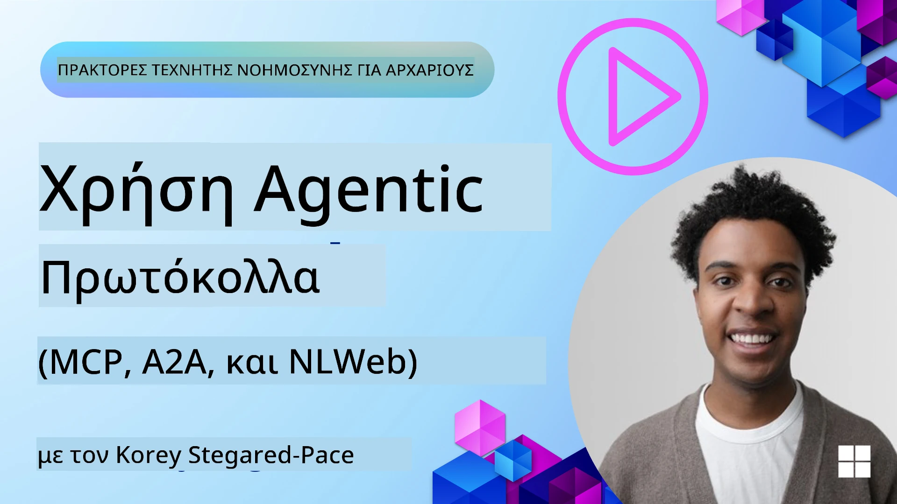
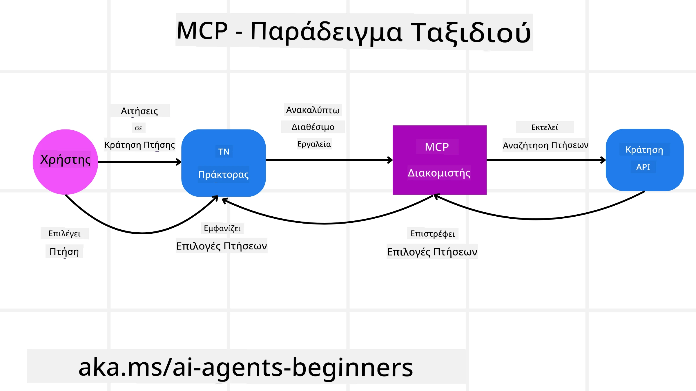
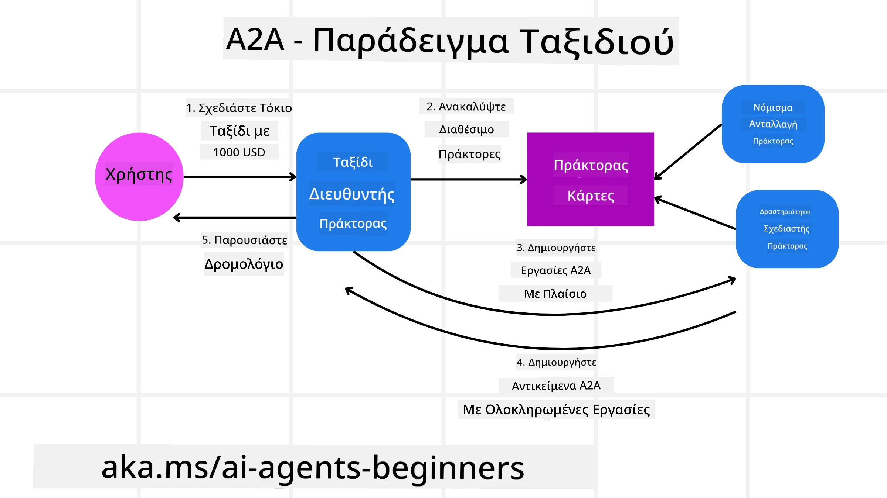
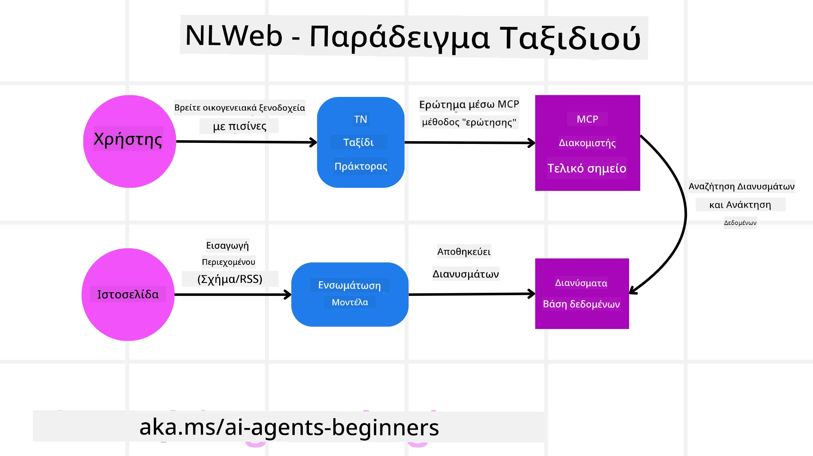

# Χρήση Πρότυπων Agentic (MCP, A2A και NLWeb)

> _(Κάντε κλικ στην εικόνα παραπάνω για να δείτε το βίντεο αυτής της ενότητας)_

Καθώς αυξάνεται η χρήση των πρακτόρων AI, αυξάνεται και η ανάγκη για προτύπα που διασφαλίζουν τυποποίηση, ασφάλεια και υποστηρίζουν την ανοιχτή καινοτομία. Σε αυτή την ενότητα, θα καλύψουμε 3 πρότυπα που στοχεύουν να καλύψουν αυτή την ανάγκη - το Model Context Protocol (MCP), το Agent to Agent (A2A) και το Natural Language Web (NLWeb).

## Εισαγωγή

Σε αυτή την ενότητα, θα καλύψουμε:

• Πώς το **MCP** επιτρέπει στους Πράκτορες AI να έχουν πρόσβαση σε εξωτερικά εργαλεία και δεδομένα για να ολοκληρώνουν εργασίες χρήστη.

• Πώς το **A2A** επιτρέπει την επικοινωνία και συνεργασία μεταξύ διαφορετικών πρακτόρων AI.

• Πώς το **NLWeb** φέρνει διεπαφές φυσικής γλώσσας σε οποιαδήποτε ιστοσελίδα, επιτρέποντας στους Πράκτορες AI να ανακαλύπτουν και να αλληλεπιδρούν με το περιεχόμενο.

## Στόχοι Μάθησης

• **Αναγνωρίστε** τον βασικό σκοπό και τα οφέλη των MCP, A2A και NLWeb στο πλαίσιο των πρακτόρων AI.

• **Εξηγήστε** πώς κάθε πρότυπο διευκολύνει την επικοινωνία και την αλληλεπίδραση μεταξύ LLMs, εργαλείων και άλλων πρακτόρων.

• **Αναγνωρίστε** τους διακριτούς ρόλους που παίζει το κάθε πρότυπο στην κατασκευή πολύπλοκων συστημάτων agentic.

## Model Context Protocol

Το **Model Context Protocol (MCP)** είναι ένα ανοιχτό πρότυπο που παρέχει έναν τυποποιημένο τρόπο για εφαρμογές να παρέχουν πλαίσιο και εργαλεία σε LLMs. Αυτό επιτρέπει μια "παν-καλυπτική προσαρμογέα" σε διαφορετικές πηγές δεδομένων και εργαλεία που οι Πράκτορες AI μπορούν να συνδέονται με συνεπή τρόπο.

Ας δούμε τα στοιχεία του MCP, τα οφέλη σε σύγκριση με άμεση χρήση API και ένα παράδειγμα για το πώς οι πράκτορες AI μπορεί να χρησιμοποιήσουν έναν MCP server.

### Βασικά Στοιχεία του MCP

Το MCP λειτουργεί με αρχιτεκτονική **client-server** και τα βασικά στοιχεία είναι:

• **Hosts** είναι εφαρμογές LLM (για παράδειγμα ένας κειμενογράφος όπως ο VSCode) που ξεκινούν τις συνδέσεις σε έναν MCP Server.

• **Clients** είναι στοιχεία εντός της εφαρμογής host που διατηρούν συνδέσεις ένα προς ένα με τους servers.

• **Servers** είναι ελαφριά προγράμματα που εκθέτουν συγκεκριμένες δυνατότητες.

Στο πρωτόκολλο περιλαμβάνονται τρεις βασικές έννοιες που είναι οι δυνατότητες ενός MCP Server:

• **Εργαλεία**: Πρόκειται για διακριτές ενέργειες ή λειτουργίες που ένας πράκτορας AI μπορεί να καλέσει για να εκτελέσει μια ενέργεια. Για παράδειγμα, μια υπηρεσία καιρού μπορεί να εκθέτει ένα εργαλείο "λήψη καιρού" ή ένας e-commerce server μπορεί να εκθέτει ένα εργαλείο "αγορά προϊόντος". Οι MCP servers διαφημίζουν το όνομα, την περιγραφή και το σχήμα εισόδου/εξόδου κάθε εργαλείου στη λίστα δυνατοτήτων τους.

• **Πόροι**: Πρόκειται για δεδομένα μόνο για ανάγνωση ή έγγραφα που μπορεί να παρέχει ένας MCP server και οι clients μπορούν να τα ανακτούν κατά ζήτηση. Παραδείγματα περιλαμβάνουν περιεχόμενο αρχείων, εγγραφές βάσεων δεδομένων ή αρχεία καταγραφής. Οι πόροι μπορεί να είναι κείμενο (όπως κώδικας ή JSON) ή δυαδικά αρχεία (όπως εικόνες ή PDF).

• **Προτροπές (Prompts)**: Πρόκειται για προδιαγεγραμμένα πρότυπα που παρέχουν προτεινόμενες προτροπές, επιτρέποντας πιο σύνθετα ροές εργασίας.

### Οφέλη του MCP

Το MCP προσφέρει σημαντικά πλεονεκτήματα για τους Πράκτορες AI:

• **Δυναμική Ανακάλυψη Εργαλείων**: Οι πράκτορες μπορούν δυναμικά να λάβουν λίστα από διαθέσιμα εργαλεία από έναν server μαζί με περιγραφές των λειτουργιών τους. Αυτό διαφέρει από τα παραδοσιακά API που συχνά απαιτούν στατική κωδικοποίηση για τις ενσωματώσεις, που σημαίνει πως οποιαδήποτε αλλαγή API απαιτεί ενημερώσεις κώδικα. Το MCP προσφέρει προσέγγιση "ενσωμάτωσε μία φορά," οδηγώντας σε μεγαλύτερη ευελιξία.

• **Διαλειτουργικότητα Διαφόρων LLMs**: Το MCP λειτουργεί σε διαφορετικά LLMs, παρέχοντας ευελιξία για αλλαγή βασικών μοντέλων για καλύτερη απόδοση.

• **Τυποποιημένη Ασφάλεια**: Το MCP περιλαμβάνει έναν τυποποιημένο τρόπο αυθεντικοποίησης, βελτιώνοντας την κλιμακωσιμότητα όταν προστίθεται πρόσβαση σε επιπλέον MCP servers. Αυτό είναι απλούστερο από τη διαχείριση διαφορετικών κλειδιών και τύπων αυθεντικοποίησης για διάφορα παραδοσιακά API.

### Παράδειγμα MCP

Φανταστείτε ότι ένας χρήστης θέλει να κλείσει μια πτήση χρησιμοποιώντας έναν βοηθό AI που λειτουργεί με MCP.

1. **Σύνδεση**: Ο βοηθός AI (ο MCP client) συνδέεται με έναν MCP server που παρέχεται από μια αεροπορική εταιρεία.

2. **Ανακάλυψη Εργαλείων**: Ο client ρωτά τον MCP server της αεροπορικής, "Ποια εργαλεία έχετε διαθέσιμα;" Ο server απαντά με εργαλεία όπως "αναζήτηση πτήσεων" και "κράτηση πτήσης".

3. **Κλήση Εργαλείου**: Στη συνέχεια ζητάτε από τον βοηθό AI, "Παρακαλώ βρες μια πτήση από το Portland προς το Honolulu." Ο βοηθός AI, χρησιμοποιώντας το LLM του, αναγνωρίζει ότι πρέπει να καλέσει το εργαλείο "αναζήτηση πτήσεων" και περνάει τα σχετικά παραμέτρους (αφετηρία, προορισμός) στον MCP server.

4. **Εκτέλεση και Απόκριση**: Ο MCP server, που λειτουργεί ως περιτύλιγμα, κάνει την πραγματική κλήση στο εσωτερικό API κράτησης της αεροπορικής εταιρείας. Λαμβάνει τις πληροφορίες πτήσης (π.χ. δεδομένα JSON) και τις στέλνει πίσω στον βοηθό AI.

5. **Περαιτέρω Αλληλεπίδραση**: Ο βοηθός AI παρουσιάζει τις επιλογές πτήσεων. Μόλις επιλέξετε μια πτήση, ο βοηθός μπορεί να καλέσει το εργαλείο "κράτηση πτήσης" στον ίδιο MCP server, ολοκληρώνοντας την κράτηση.

## Πρωτόκολλο Agent-to-Agent (A2A)

Ενώ το MCP εστιάζει στη σύνδεση LLMs με εργαλεία, το **Agent-to-Agent (A2A) πρωτόκολλο** κάνει ένα βήμα παραπέρα επιτρέποντας την επικοινωνία και συνεργασία μεταξύ διαφορετικών πρακτόρων AI. Το A2A συνδέει πράκτορες AI από διαφορετικές οργανώσεις, περιβάλλοντα και τεχνολογίες ώστε να ολοκληρώνουν κοινές εργασίες.

Θα εξετάσουμε τα στοιχεία και τα οφέλη του A2A, μαζί με ένα παράδειγμα εφαρμογής στο ταξιδιωτικό μας πρόγραμμα.

### Βασικά Στοιχεία του A2A

Το A2A εστιάζει στο να επιτρέπει την επικοινωνία μεταξύ πρακτόρων και στην από κοινού εργασία για την ολοκλήρωση υποεργασιών χρήστη. Κάθε στοιχείο του προτύπου συμβάλλει σε αυτό:

#### Κάρτα Πράκτορα (Agent Card)

Παρόμοια με το πώς ένας MCP server μοιράζεται μια λίστα εργαλείων, μια Κάρτα Πράκτορα περιλαμβάνει:
- Το Όνομα του Πράκτορα.
- Μια **περιγραφή των γενικών εργασιών** που ολοκληρώνει.
- Μια **λίστα συγκεκριμένων δεξιοτήτων** με περιγραφές για να βοηθά άλλους πράκτορες (ή ακόμα και ανθρώπινους χρήστες) να καταλάβουν πότε και γιατί θα ήθελαν να καλέσουν αυτόν τον πράκτορα.
- Το **τρέχον URL Endpoint** του πράκτορα.
- Την **έκδοση** και τις **δυνατότητες** του πράκτορα, όπως απαντήσεις streaming και push notifications.

#### Εκτελεστής Πράκτορα (Agent Executor)

Ο Εκτελεστής Πράκτορα είναι υπεύθυνος για το **περάσιμο του πλαισίου της συνομιλίας του χρήστη στον απομακρυσμένο πράκτορα**, ο οποίος χρειάζεται αυτό για να καταλάβει την εργασία που πρέπει να ολοκληρώσει. Σε έναν A2A server, ένας πράκτορας χρησιμοποιεί το δικό του Μεγάλο Γλωσσικό Μοντέλο (LLM) για να αναλύει εισερχόμενες αιτήσεις και να εκτελεί εργασίες με τα δικά του εσωτερικά εργαλεία.

#### Αντικείμενο (Artifact)

Μόλις ένας απομακρυσμένος πράκτορας ολοκληρώσει την ζητούμενη εργασία, το προϊόν της δουλειάς του δημιουργείται ως αντικείμενο. Ένα αντικείμενο **περιέχει το αποτέλεσμα της εργασίας του πράκτορα**, μια **περιγραφή του τι ολοκληρώθηκε** και το **κείμενο πλαισίου** που περνάει μέσω του προτύπου. Μετά την αποστολή του αντικειμένου, η σύνδεση με τον απομακρυσμένο πράκτορα κλείνει μέχρι να χρειαστεί ξανά.

#### Ουρά Γεγονότων (Event Queue)

Αυτό το στοιχείο χρησιμοποιείται για **διαχείριση ενημερώσεων και περάσμα μηνυμάτων**. Είναι ιδιαίτερα σημαντικό στην παραγωγή συστημάτων agentic ώστε να αποφεύγεται το κλείσιμο της σύνδεσης μεταξύ πρακτόρων πριν ολοκληρωθεί μια εργασία, ειδικά όταν οι χρόνοι ολοκλήρωσης μπορεί να διαρκούν περισσότερο.

### Οφέλη του A2A

• **Ενισχυμένη Συνεργασία**: Επιτρέπει σε πράκτορες από διαφορετικούς προμηθευτές και πλατφόρμες να αλληλεπιδρούν, να μοιράζονται πλαίσιο και να δουλεύουν μαζί, διευκολύνοντας την απρόσκοπτη αυτοματοποίηση μεταξύ παραδοσιακά αποσυνδεδεμένων συστημάτων.

• **Ευελιξία στην Επιλογή Μοντέλου**: Κάθε πράκτορας A2A μπορεί να επιλέξει ποιο LLM χρησιμοποιεί για να εξυπηρετήσει τις αιτήσεις του, επιτρέποντας βελτιστοποιημένα ή εξειδικευμένα μοντέλα ανά πράκτορα, σε αντίθεση με μία μόνο σύνδεση LLM σε κάποια σενάρια MCP.

• **Ενσωματωμένη Αυθεντικοποίηση**: Η αυθεντικοποίηση είναι ενσωματωμένη στο πρωτόκολλο A2A, παρέχοντας ένα ισχυρό πλαίσιο ασφάλειας για τις αλληλεπιδράσεις των πρακτόρων.

### Παράδειγμα A2A

Ας επεκτείνουμε το σενάριο κρατήσεων ταξιδιού, αλλά αυτή τη φορά με χρήση του A2A.

1. **Αίτηση Χρήστη προς Πολυ-Πράκτορα**: Ένας χρήστης αλληλεπιδρά με έναν πράκτορα A2A "Travel Agent", π.χ. λέγοντας, "Παρακαλώ κράτησε ένα ολόκληρο ταξίδι στο Honolulu για την επόμενη εβδομάδα, συμπεριλαμβανομένων πτήσεων, ξενοδοχείου και ενοικίασης αυτοκινήτου".

2. **Ορχήστρωση από τον Πράκτορα Ταξιδιού**: Ο Πράκτορας Ταξιδιού λαμβάνει αυτό το πολύπλοκο αίτημα. Χρησιμοποιεί το LLM του για να αναλύσει την εργασία και να αποφασίσει ότι χρειάζεται να συνεργαστεί με άλλους εξειδικευμένους πράκτορες.

3. **Επικοινωνία μεταξύ Πρακτόρων**: Ο Πράκτορας Ταξιδιού τότε χρησιμοποιεί το πρωτόκολλο A2A για να συνδεθεί με κατώτερους πράκτορες, όπως τον "Πράκτορα Αεροπορικής", τον "Πράκτορα Ξενοδοχείου" και τον "Πράκτορα Ενοικίασης Αυτοκινήτου" που δημιουργήθηκαν από διαφορετικές εταιρίες.

4. **Εκτέλεση Ανατεθειμένης Εργασίας**: Ο Πράκτορας Ταξιδιού στέλνει συγκεκριμένες εργασίες σε αυτούς τους εξειδικευμένους πράκτορες (π.χ., "Βρες πτήσεις προς Honolulu", "Κράτησε ξενοδοχείο", "Ενοικίασε αυτοκίνητο"). Κάθε ένας από αυτούς τους εξειδικευμένους πράκτορες, που τρέχουν τα δικά τους LLMs και χρησιμοποιούν τα δικά τους εργαλεία (τα οποία μπορεί να είναι MCP servers), εκτελεί το μερικό κομμάτι της κράτησης.

5. **Συγκεντρωμένη Απάντηση**: Μόλις όλοι οι κατώτεροι πράκτορες ολοκληρώσουν τις εργασίες τους, ο Πράκτορας Ταξιδιού συνθέτει τα αποτελέσματα (στοιχεία πτήσης, επιβεβαίωση ξενοδοχείου, κράτηση αυτοκινήτου) και στέλνει μια ολοκληρωμένη απάντηση σε μορφή συνομιλίας πίσω στον χρήστη.

## Natural Language Web (NLWeb)

Οι ιστοσελίδες αποτελούν εδώ και καιρό τον βασικό τρόπο για τους χρήστες να έχουν πρόσβαση σε πληροφορίες και δεδομένα στο διαδίκτυο.

Ας δούμε τα διαφορετικά στοιχεία του NLWeb, τα οφέλη του και ένα παράδειγμα για το πώς λειτουργεί το NLWeb στην ταξιδιωτική μας εφαρμογή.

### Στοιχεία του NLWeb

- **Εφαρμογή NLWeb (Κώδικας Πυρήνα Υπηρεσίας)**: Το σύστημα που επεξεργάζεται ερωτήματα φυσικής γλώσσας. Συνδέει τα διάφορα μέρη της πλατφόρμας για να δημιουργήσει απαντήσεις. Μπορείτε να το σκεφτείτε ως τον **κινητήρα που τροφοδοτεί τις λειτουργίες φυσικής γλώσσας** μιας ιστοσελίδας.

- **Πρωτόκολλο NLWeb**: Πρόκειται για ένα **βασικό σύνολο κανόνων για αλληλεπίδραση φυσικής γλώσσας** με μια ιστοσελίδα. Επιστρέφει απαντήσεις σε μορφή JSON (συχνά χρησιμοποιώντας Schema.org). Ο σκοπός του είναι να δημιουργήσει μια απλή βάση για το “AI Web,” με τον ίδιο τρόπο που το HTML έκανε δυνατή την κοινοποίηση εγγράφων online.

- **MCP Server (Σημείο Τελικού Model Context Protocol)**: Κάθε ρύθμιση NLWeb λειτουργεί επίσης ως **MCP server**. Αυτό σημαίνει ότι μπορεί να **μοιράζει εργαλεία (όπως μια μέθοδο “ask”) και δεδομένα** με άλλα συστήματα AI. Στην πράξη, αυτό καθιστά το περιεχόμενο και τις δυνατότητες της ιστοσελίδας προσβάσιμες από πράκτορες AI, επιτρέποντας στην ιστοσελίδα να γίνει μέρος του ευρύτερου “οικοσυστήματος πρακτόρων.”

- **Μοντέλα Ενσωμάτωσης (Embedding Models)**: Αυτά τα μοντέλα χρησιμοποιούνται για να **μετατρέπουν το περιεχόμενο της ιστοσελίδας σε αριθμητικές αναπαραστάσεις που ονομάζονται διανύσματα** (embeddings). Αυτά τα διανύσματα καταγράφουν το νόημα με τρόπο που οι υπολογιστές μπορούν να συγκρίνουν και να αναζητούν. Αποθηκεύονται σε ειδική βάση δεδομένων, και οι χρήστες μπορούν να επιλέξουν ποιο μοντέλο embeddings επιθυμούν να χρησιμοποιήσουν.

- **Βάση Δεδομένων Διανυσμάτων (Μηχανισμός Ανάκτησης)**: Αυτή η βάση δεδομένων **αποθηκεύει τα embeddings του περιεχομένου της ιστοσελίδας**. Όταν κάποιος κάνει μια ερώτηση, το NLWeb ελέγχει τη βάση δεδομένων διανυσμάτων για να βρει γρήγορα τις πιο σχετικές πληροφορίες. Παρέχει μια γρήγορη λίστα πιθανών απαντήσεων, ταξινομημένων κατά ομοιότητα. Το NLWeb λειτουργεί με διάφορα συστήματα αποθήκευσης διανυσμάτων όπως Qdrant, Snowflake, Milvus, Azure AI Search και Elasticsearch.

### Παράδειγμα NLWeb

Σκεφτείτε ξανά την ταξιδιωτική ιστοσελίδα μας, αλλά αυτή τη φορά τροφοδοτούμενη από NLWeb.

1. **Εισαγωγή Δεδομένων**: Τα υπάρχοντα καταλόγια προϊόντων της ταξιδιωτικής ιστοσελίδας (π.χ. λίστες πτήσεων, περιγραφές ξενοδοχείων, πακέτα περιηγήσεων) μορφοποιούνται χρησιμοποιώντας το Schema.org ή φορτώνονται μέσω RSS feeds. Τα εργαλεία NLWeb επεξεργάζονται αυτά τα δομημένα δεδομένα, δημιουργούν embeddings και τα αποθηκεύουν σε τοπική ή απομακρυσμένη βάση δεδομένων διανυσμάτων.

2. **Ερώτημα Φυσικής Γλώσσας (Άνθρωπος)**: Ένας χρήστης επισκέπτεται την ιστοσελίδα και αντί να πλοηγείται σε μενού, πληκτρολογεί σε μια διεπαφή συνομιλίας: "Βρες μου ένα οικογενειακό ξενοδοχείο στο Honolulu με πισίνα για την επόμενη εβδομάδα".

3. **Επεξεργασία NLWeb**: Η εφαρμογή NLWeb λαμβάνει αυτό το ερώτημα. Το στέλνει σε ένα LLM για κατανόηση και ταυτόχρονα ψάχνει τη βάση δεδομένων διανυσμάτων για σχετικά καταλύματα.

4. **Ακριβή Αποτελέσματα**: Το LLM βοηθά στην ερμηνεία των αποτελεσμάτων αναζήτησης από τη βάση, εντοπίζει τις καλύτερες επιλογές βάσει των κριτηρίων "οικογενειακό", "πισίνα" και "Honolulu", και στη συνέχεια διαμορφώνει μια απάντηση φυσικής γλώσσας. Σημαντικό είναι ότι η απάντηση αναφέρεται σε πραγματικά ξενοδοχεία από τον κατάλογο της ιστοσελίδας, αποφεύγοντας φανταστικές πληροφορίες.

5. **Αλληλεπίδραση με Πράκτορα AI**: Επειδή το NLWeb λειτουργεί ως MCP server, ένας εξωτερικός πράκτορας AI για ταξίδια μπορεί να συνδεθεί και με αυτή την instanc του NLWeb στην ιστοσελίδα. Ο πράκτορας AI θα μπορούσε τότε να χρησιμοποιήσει τη μέθοδο `ask` του MCP για να ρωτήσει απευθείας την ιστοσελίδα: `ask("Υπάρχουν εστιατόρια φιλικά προς vegan στην περιοχή του Honolulu που προτείνονται από το ξενοδοχείο;")`. Το NLWeb θα επεξεργαστεί αυτό, αξιοποιώντας τη βάση δεδομένων με πληροφορίες για εστιατόρια (αν έχει φορτωθεί) και θα επιστρέψει μια δομημένη απάντηση σε JSON.

### Έχετε Περισσότερες Ερωτήσεις για MCP/A2A/NLWeb;

Εγγραφείτε στο [Microsoft Foundry Discord](https://discord.com/invite/ATgtXmAS5D) για να γνωριστείτε με άλλους μαθητές, να παραβρεθείτε σε ώρες γραφείου και να απαντήσετε τις ερωτήσεις σας για τους Πράκτορες AI.

## Πόροι

- [MCP για Αρχάριους](https://aka.ms/mcp-for-beginners)  
- [Τεκμηρίωση MCP](https://learn.microsoft.com/python/api/overview/azure/ai-projects-readme)
- [NLWeb Repo](https://github.com/nlweb-ai/NLWeb)
- [Microsoft Agent Framework](https://aka.ms/ai-agents-beginners/agent-framework)

---

<!-- CO-OP TRANSLATOR DISCLAIMER START -->
**Αποποίηση ευθυνών**:
Αυτό το έγγραφο έχει μεταφραστεί χρησιμοποιώντας την υπηρεσία μετάφρασης με τεχνητή νοημοσύνη [Co-op Translator](https://github.com/Azure/co-op-translator). Ενώ επιδιώκουμε την ακρίβεια, παρακαλούμε να έχετε υπόψη ότι οι αυτοματοποιημένες μεταφράσεις ενδέχεται να περιέχουν λάθη ή ανακρίβειες. Το πρωτότυπο έγγραφο στη μητρική του γλώσσα πρέπει να θεωρείται η αυθεντική πηγή. Για κρίσιμες πληροφορίες, συνιστάται επαγγελματική ανθρώπινη μετάφραση. Δεν φέρουμε ευθύνη για τυχόν παρεξηγήσεις ή λανθασμένες ερμηνείες που προκύπτουν από τη χρήση αυτής της μετάφρασης.
<!-- CO-OP TRANSLATOR DISCLAIMER END -->