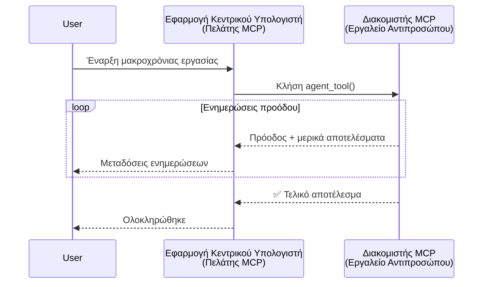
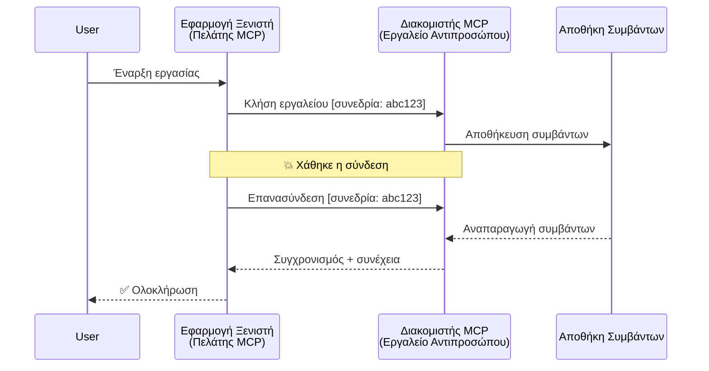
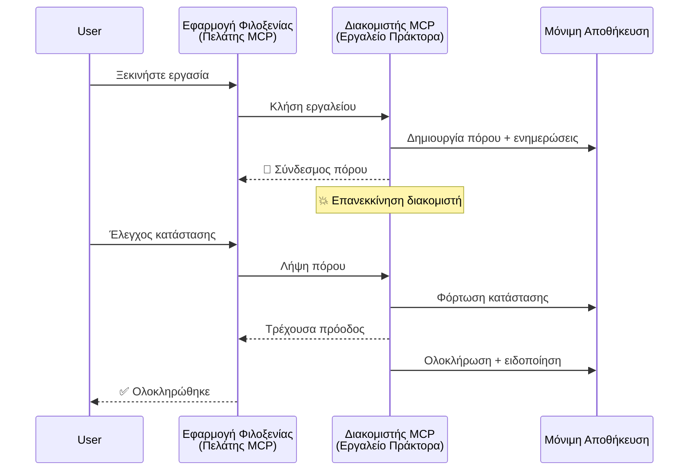
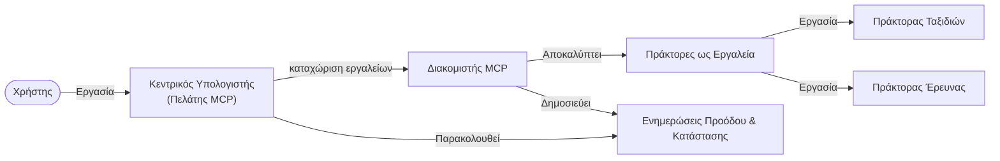

# Κατασκευή Συστημάτων Επικοινωνίας Agent-to-Agent με MCP

> TL;DR - Μπορείτε να Δημιουργήσετε Επικοινωνία Agent2Agent στο MCP; Ναι!

Το MCP έχει εξελιχθεί σημαντικά πέρα από τον αρχικό του στόχο της «παροχής συμφραζομένων στα LLM». Με πρόσφατες βελτιώσεις, όπως [επαναλαμβανόμενα streams](https://modelcontextprotocol.io/docs/concepts/transports#resumability-and-redelivery), [elicitation](https://modelcontextprotocol.io/specification/2025-06-18/client/elicitation), [sampling](https://modelcontextprotocol.io/specification/2025-06-18/client/sampling) και ειδοποιήσεις ([πρόοδος](https://modelcontextprotocol.io/specification/2025-06-18/basic/utilities/progress) και [πόροι](https://modelcontextprotocol.io/specification/2025-06-18/schema#resourceupdatednotification)), το MCP προσφέρει πλέον μια ισχυρή βάση για την κατασκευή πολύπλοκων συστημάτων επικοινωνίας agent-to-agent.

## Η Λανθασμένη Αντίληψη για Agents/Εργαλεία

Καθώς περισσότεροι προγραμματιστές εξερευνούν εργαλεία με agentic συμπεριφορές (λειτουργούν για μεγάλες περιόδους, μπορεί να απαιτούν επιπλέον είσοδο κατά τη διάρκεια της εκτέλεσης κ.ά.), μια κοινή λανθασμένη αντίληψη είναι ότι το MCP είναι ακατάλληλο επειδή τα πρώιμα παραδείγματα των εργαλείων του ήταν απλά και βασίζονταν σε μοτίβα αίτησης-απόκρισης.

Αυτή η αντίληψη έχει ξεπεραστεί. Η προδιαγραφή του MCP έχει ενισχυθεί σημαντικά τους τελευταίους μήνες με δυνατότητες που γεφυρώνουν το χάσμα για τη δημιουργία agentic συμπεριφορών μεγάλης διάρκειας:

- **Streaming & Μερικά Αποτελέσματα**: Ενημερώσεις προόδου σε πραγματικό χρόνο κατά την εκτέλεση
- **Επαναληπτικότητα**: Οι πελάτες μπορούν να ανασυνδεθούν και να συνεχίσουν μετά από αποσύνδεση
- **Ανθεκτικότητα**: Τα αποτελέσματα επιβιώνουν επανεκκινήσεις διακομιστή (π.χ. μέσω συνδέσμων πόρων)
- **Πολλαπλές Αλληλεπιδράσεις**: Διαδραστική εισαγωγή ενδιάμεσα μέσω elicitation και sampling

Αυτές οι λειτουργίες μπορούν να συνδυαστούν για να επιτρέψουν σύνθετες agentic και multi-agent εφαρμογές, όλες αναπτυγμένες πάνω στο πρωτόκολλο MCP.

Για την αναφορά, θα αναφερόμαστε σε έναν agent ως «εργαλείο» που είναι διαθέσιμο σε έναν MCP διακομιστή. Αυτό υποδηλώνει την ύπαρξη μιας εφαρμογής υποδοχής που υλοποιεί έναν MCP πελάτη ο οποίος δημιουργεί μια συνεδρία με τον MCP διακομιστή και μπορεί να καλεί τον agent.

## Τι Κατασκευάζει ένα Εργαλείο MCP "Agentic";

Πριν από την υλοποίηση, ας ορίσουμε ποιες ικανότητες υποδομής απαιτούνται για την υποστήριξη agents διετούς διάρκειας.

> Ορίζουμε ένα agent ως οντότητα που μπορεί να λειτουργεί αυτόνομα για μεγάλες χρονικές περιόδους, ικανή να διαχειρίζεται πολύπλοκες εργασίες που μπορεί να απαιτούν πολλαπλές αλληλεπιδράσεις ή προσαρμογές βασισμένες σε ανατροφοδότηση σε πραγματικό χρόνο.

### 1. Streaming & Μερικά Αποτελέσματα

Τα παραδοσιακά μοτίβα αίτησης-απόκρισης δεν λειτουργούν για εργασίες μεγάλης διάρκειας. Οι agents χρειάζεται να παρέχουν:

- Ενημερώσεις προόδου σε πραγματικό χρόνο
- Ενδιάμεσα αποτελέσματα

**Υποστήριξη MCP**: Οι ειδοποιήσεις ενημέρωσης πόρων επιτρέπουν το streaming μερικών αποτελεσμάτων, αν και αυτό απαιτεί προσεκτικό σχεδιασμό για να αποφευχθούν συγκρούσεις με το μοντέλο αιτήματος/απόκρισης 1:1 του JSON-RPC.

| Λειτουργία                 | Περίπτωση Χρήσης                                                                                                                                                                        | Υποστήριξη MCP                                                                           |
| -------------------------- | --------------------------------------------------------------------------------------------------------------------------------------------------------------------------------------- | ---------------------------------------------------------------------------------------- |
| Ενημερώσεις Προόδου σε Πραγματικό Χρόνο | Ο χρήστης ζητά εργασία μετανάστευσης κώδικα. Ο agent μεταδίδει πρόοδο: «10% - Ανάλυση εξαρτήσεων... 25% - Μετατροπή αρχείων TypeScript... 50% - Ενημέρωση εισαγωγών...»                    | ✅ Ειδοποιήσεις προόδου                                                                |
| Μερικά Αποτελέσματα        | Η εργασία «Δημιουργία βιβλίου» μεταδίδει μερικά αποτελέσματα, π.χ. 1) Υπόδειγμα πλοκής, 2) Λίστα κεφαλαίων, 3) Κάθε κεφάλαιο κατά την ολοκλήρωση. Ο host μπορεί να ελέγξει, ακυρώσει ή κατευθύνει σε οποιοδήποτε στάδιο. | ✅ Οι ειδοποιήσεις μπορούν να «επεκταθούν» για να περιλαμβάνουν μερικά αποτελέσματα, βλέπε προτάσεις στα PR 383, 776 |

<div align="center" style="font-style: italic; font-size: 0.95em; margin-bottom: 0.5em;">
<strong>Σχήμα 1:</strong> Αυτό το διάγραμμα απεικονίζει πώς ένας MCP agent μεταδίδει ενημερώσεις προόδου σε πραγματικό χρόνο και μερικά αποτελέσματα στην εφαρμογή υποδοχής κατά τη διάρκεια μιας εργασίας μεγάλης διάρκειας, επιτρέποντας στο χρήστη να παρακολουθεί την εκτέλεση σε πραγματικό χρόνο.
</div>



### 2. Επαναληπτικότητα

Οι agents πρέπει να χειρίζονται ομαλά τις διακοπές δικτύου:

- Επανασύνδεση μετά από αποσύνδεση (client)
- Συνέχεια από εκεί που σταμάτησαν (επανεκπομπή μηνυμάτων)

**Υποστήριξη MCP**: Η μεταφορά StreamableHTTP του MCP υποστηρίζει σήμερα επανάληψη συνεδρίας και επανεκπομπή μηνυμάτων με session IDs και τελευταίες IDs συμβάντων. Η σημαντική σημείωση εδώ είναι ότι ο διακομιστής πρέπει να υλοποιεί EventStore που επιτρέπει επανεκτελέσεις γεγονότων κατά την επανασύνδεση πελάτη.  
Σημειώστε ότι υπάρχει πρόταση κοινότητας (PR #975) που εξετάζει μεταφορέα-αγνωστικά επαναλαμβανόμενα streams.

| Λειτουργία      | Περίπτωση Χρήσης                                                                                                                                          | Υποστήριξη MCP                                                              |
| --------------- | --------------------------------------------------------------------------------------------------------------------------------------------------------- | ---------------------------------------------------------------------------- |
| Επαναληπτικότητα | Ο πελάτης αποσυνδέεται κατά τη διάρκεια εργασίας μεγάλης διάρκειας. Μετά την επανασύνδεση, η συνεδρία συνεχίζεται με αναπαραγωγή των χαμένων συμβάντων, συνεχίζοντας ομαλά από εκεί που σταμάτησε. | ✅ Μεταφορά StreamableHTTP με session IDs, αναπαραγωγή συμβάντων και EventStore |

<div align="center" style="font-style: italic; font-size: 0.95em; margin-bottom: 0.5em;">
<strong>Σχήμα 2:</strong> Αυτό το διάγραμμα δείχνει πώς η μεταφορά StreamableHTTP και το event store του MCP επιτρέπουν την ομαλή επανάληψη συνεδρίας: αν ο πελάτης αποσυνδεθεί, μπορεί να επανασυνδεθεί και να αναπαράγει τα χαμένα συμβάντα, συνεχίζοντας την εργασία χωρίς απώλεια προόδου.
</div>



### 3. Ανθεκτικότητα

Οι agents μεγάλης διάρκειας χρειάζονται μόνιμη κατάσταση:

- Τα αποτελέσματα επιβιώνουν επανεκκινήσεις διακομιστή
- Η κατάσταση μπορεί να ανακτηθεί ανεξάρτητα
- Παρακολούθηση προόδου διαχρονικά σε συνεδρίες

**Υποστήριξη MCP**: Το MCP πλέον υποστηρίζει τύπο επιστροφής Resource link για κλήσεις εργαλείων. Σήμερα, ένα πιθανό μοτίβο είναι να σχεδιαστεί ένα εργαλείο που δημιουργεί έναν πόρο και επιστρέφει αμέσως ένα σύνδεσμο πόρου. Το εργαλείο μπορεί να συνεχίσει να διαχειρίζεται την εργασία στο παρασκήνιο και να ενημερώνει τον πόρο. Ο πελάτης μπορεί με τη σειρά του να επιλέξει να ελέγχει την κατάσταση αυτού του πόρου για μερικά ή πλήρη αποτελέσματα (ανάλογα με τις ενημερώσεις πόρων που παρέχει ο διακομιστής) ή να εγγραφεί στον πόρο για ειδοποιήσεις ενημέρωσης.

Μία περιοριστική παράμετρος εδώ είναι ότι η συνεχής ερώτηση πόρων ή η εγγραφή για ενημερώσεις μπορεί να καταναλώσει πόρους με συνέπειες σε μεγάλο εύρος. Υπάρχει ανοιχτή πρόταση κοινότητας (συμπεριλαμβανομένου του #992) που εξερευνά τη δυνατότητα συμπερίληψης webhooks ή triggers που ο διακομιστής μπορεί να καλεί για να ειδοποιεί τον πελάτη/εφαρμογή υποδοχής αναφορικά με ενημερώσεις.

| Λειτουργία    | Περίπτωση Χρήσης                                                                                                                                                 | Υποστήριξη MCP                                                    |
| ------------- | -------------------------------------------------------------------------------------------------------------------------------------------------------------- | ---------------------------------------------------------------- |
| Ανθεκτικότητα | Ο διακομιστής καταρρέει κατά τη διάρκεια εργασίας μετανάστευσης δεδομένων. Αποτελέσματα και πρόοδος επιβιώνουν επανεκκίνηση, ο πελάτης μπορεί να ελέγξει κατάσταση και να συνεχίσει από τον επίμονο πόρο. | ✅ Σύνδεσμοι πόρων με επίμονη αποθήκευση και ειδοποιήσεις κατάστασης |

Σήμερα, ένα κοινό μοτίβο είναι να σχεδιαστεί ένα εργαλείο που δημιουργεί έναν πόρο και επιστρέφει άμεσα σύνδεσμο πόρου. Το εργαλείο μπορεί στο παρασκήνιο να διαχειρίζεται την εργασία, να εκδίδει ειδοποιήσεις πόρων που λειτουργούν ως ενημερώσεις προόδου ή συμπεριλαμβάνουν μερικά αποτελέσματα και να ενημερώνει το περιεχόμενο στον πόρο καθώς απαιτείται.

<div align="center" style="font-style: italic; font-size: 0.95em; margin-bottom: 0.5em;">
<strong>Σχήμα 3:</strong> Αυτό το διάγραμμα δείχνει πώς οι MCP agents χρησιμοποιούν επίμονους πόρους και ειδοποιήσεις κατάστασης για να διασφαλίσουν ότι εργασίες μεγάλης διάρκειας επιβιώνουν επανεκκινήσεις διακομιστή, επιτρέποντας στους πελάτες να ελέγχουν την πρόοδο και να ανακτούν αποτελέσματα ακόμη και μετά από αποτυχίες.
</div>



### 4. Πολλαπλές Αλληλεπιδράσεις (Multi-Turn)

Οι agents συχνά χρειάζονται επιπλέον είσοδο κατά τη διάρκεια εκτέλεσης:

- Ανθρώπινη διευκρίνιση ή έγκριση
- Βοήθεια AI για σύνθετες αποφάσεις
- Δυναμική ρύθμιση παραμέτρων

**Υποστήριξη MCP**: Πλήρως υποστηρίζεται μέσω sampling (για εισροή AI) και elicitation (για ανθρώπινη εισροή).

| Λειτουργία              | Περίπτωση Χρήσης                                                                                                                                           | Υποστήριξη MCP                                        |
| ----------------------- | --------------------------------------------------------------------------------------------------------------------------------------------------------- | ---------------------------------------------------- |
| Πολλαπλές Αλληλεπιδράσεις | Agent κρατήσεων ταξιδιού ζητά επιβεβαίωση τιμής από χρήστη, μετά ζητά από AI να συνοψίσει δεδομένα ταξιδιού πριν ολοκληρώσει τη συναλλαγή κράτησης.           | ✅ Elicitation για ανθρώπινη εισροή, sampling για AI εισροή |

<div align="center" style="font-style: italic; font-size: 0.95em; margin-bottom: 0.5em;">
<strong>Σχήμα 4:</strong> Αυτό το διάγραμμα απεικονίζει πώς οι MCP agents μπορούν διαδραστικά να ζητούν ανθρώπινη εισροή ή βοήθεια AI κατά τη διάρκεια εκτέλεσης, υποστηρίζοντας πολύπλοκα, πολλαπλών γύρων ροές εργασίας όπως επιβεβαιώσεις και δυναμικές αποφάσεις.
</div>

```mermaid
sequenceDiagram
    participant User
    participant Host as Εφαρμογή Φιλοξενίας<br/>(Πελάτης MCP)
    participant Server as Διακομιστής MCP<br/>(Εργαλείο Πράκτορα)

    User->>Host: Κράτηση πτήσης
    Host->>Server: Κλήση travel_agent

    Server->>Host: Εξαγωγή πληροφοριών: "Επιβεβαιώνετε $500;"
    Note over Host: Επανάκληση εξαγωγής πληροφοριών (αν υπάρχει)
    Host->>User: 💰 Επιβεβαιώνετε την τιμή;
    User->>Host: "Ναι"
    Host->>Server: Επιβεβαιώθηκε

    Server->>Host: Δειγματοληψία: "Περίληψη δεδομένων"
    Note over Host: Επανάκληση AI (αν υπάρχει)
    Host->>Server: Αναφορά περίληψης

    Server->>Host: ✅ Πτήση κρατήθηκε
```

## Υλοποίηση Agents Μεγάλης Διάρκειας στο MCP - Ανασκόπηση Κώδικα

Στο πλαίσιο αυτού του άρθρου, παρέχουμε ένα [αποθετήριο κώδικα](https://github.com/victordibia/ai-tutorials/tree/main/MCP%20Agents) που περιέχει πλήρη υλοποίηση agents μεγάλης διάρκειας χρησιμοποιώντας το MCP Python SDK με StreamableHTTP μεταφορά για επανάληψη συνεδρίας και επανεκπομπή μηνυμάτων. Η υλοποίηση δείχνει πώς οι δυνατότητες MCP μπορούν να συνδυαστούν για να ενεργοποιήσουν εξελιγμένες συμπεριφορές τύπου agent.

Συγκεκριμένα, υλοποιούμε έναν διακομιστή με δύο βασικά εργαλεία agents:

- **Travel Agent** - Προσομοιώνει υπηρεσία κρατήσεων ταξιδιού με επιβεβαίωση τιμής μέσω elicitation
- **Research Agent** - Εκτελεί ερευνητικές εργασίες με AI-βοηθούμενες συνοψίσεις μέσω sampling

Και οι δύο agents επιδεικνύουν ενημερώσεις προόδου σε πραγματικό χρόνο, διαδραστικές επιβεβαιώσεις και πλήρεις δυνατότητες επανάληψης συνεδρίας.

### Βασικές Έννοιες Υλοποίησης

Οι παρακάτω ενότητες δείχνουν υλοποίηση agent στο διακομιστή και χειρισμό υποδοχής πελάτη για κάθε δυνατότητα:

#### Streaming & Ενημερώσεις Προόδου - Κατάσταση Εργασίας σε Πραγματικό Χρόνο

Το streaming επιτρέπει στους agents να παρέχουν ενημερώσεις προόδου ενώ εκτελούνται εργασίες μεγάλης διάρκειας, κρατώντας τους χρήστες ενημερωμένους για την κατάσταση εργασίας και ενδιάμεσα αποτελέσματα.

**Υλοποίηση Διακομιστή (ο agent στέλνει ειδοποιήσεις προόδου):**

```python
# Από το server/server.py - Ο ταξιδιωτικός πράκτορας στέλνει ενημερώσεις προόδου
for i, step in enumerate(steps):
    await ctx.session.send_progress_notification(
        progress_token=ctx.request_id,
        progress=i * 25,
        total=100,
        message=step,
        related_request_id=str(ctx.request_id)
    )
    await anyio.sleep(2)  # Προσομοίωση εργασίας

# Εναλλακτικά: Καταγραφή μηνυμάτων για λεπτομερείς ενημερώσεις βήμα προς βήμα
await ctx.session.send_log_message(
    level="info",
    data=f"Processing step {current_step}/{steps} ({progress_percent}%)",
    logger="long_running_agent",
    related_request_id=ctx.request_id,
)
```

**Υλοποίηση Πελάτη (ο host λαμβάνει ενημερώσεις προόδου):**

```python
# Από το client/client.py - Χειρισμός πελάτη για ειδοποιήσεις σε πραγματικό χρόνο
async def message_handler(message) -> None:
    if isinstance(message, types.ServerNotification):
        if isinstance(message.root, types.LoggingMessageNotification):
            console.print(f"📡 [dim]{message.root.params.data}[/dim]")
        elif isinstance(message.root, types.ProgressNotification):
            progress = message.root.params
            console.print(f"🔄 [yellow]{progress.message} ({progress.progress}/{progress.total})[/yellow]")

# Εγγραφή διαχειριστή μηνυμάτων κατά τη δημιουργία συνεδρίας
async with ClientSession(
    read_stream, write_stream,
    message_handler=message_handler
) as session:
```

#### Elicitation - Αίτηση Εισόδου Χρήστη

Το elicitation επιτρέπει στους agents να ζητούν είσοδο χρήστη κατά τη διάρκεια εκτέλεσης. Αυτό είναι απαραίτητο για επιβεβαιώσεις, διευκρινίσεις ή εγκρίσεις κατά τη διάρκεια εργασιών μεγάλης διάρκειας.

**Υλοποίηση Διακομιστή (ο agent ζητά επιβεβαίωση):**

```python
# Από το server/server.py - Ο ταξιδιωτικός πράκτορας ζητά επιβεβαίωση τιμής
elicit_result = await ctx.session.elicit(
    message=f"Please confirm the estimated price of $1200 for your trip to {destination}",
    requestedSchema=PriceConfirmationSchema.model_json_schema(),
    related_request_id=ctx.request_id,
)

if elicit_result and elicit_result.action == "accept":
    # Συνέχεια με την κράτηση
    logger.info(f"User confirmed price: {elicit_result.content}")
elif elicit_result and elicit_result.action == "decline":
    # Ακύρωση της κράτησης
    booking_cancelled = True
```

**Υλοποίηση Πελάτη (ο host παρέχει callback για elicitation):**

```python
# Από το client/client.py - Χειρισμός αιτημάτων προσέγγισης πελάτη
async def elicitation_callback(context, params):
    console.print(f"💬 Server is asking for confirmation:")
    console.print(f"   {params.message}")

    response = console.input("Do you accept? (y/n): ").strip().lower()

    if response in ['y', 'yes']:
        return types.ElicitResult(
            action="accept",
            content={"confirm": True, "notes": "Confirmed by user"}
        )
    else:
        return types.ElicitResult(
            action="decline",
            content={"confirm": False, "notes": "Declined by user"}
        )

# Καταχώριση της αναδρομικής κλήσης κατά τη δημιουργία της συνεδρίας
async with ClientSession(
    read_stream, write_stream,
    elicitation_callback=elicitation_callback
) as session:
```

#### Sampling - Αίτηση Βοήθειας AI

Το sampling επιτρέπει στους agents να ζητούν βοήθεια από LLM για σύνθετες αποφάσεις ή δημιουργία περιεχομένου κατά την εκτέλεση. Αυτό υποστηρίζει υβριδικές ανθρώπινη-AI ροές εργασίας.

**Υλοποίηση Διακομιστή (ο agent ζητά βοήθεια AI):**

```python
# Από το server/server.py - Ο πράκτορας έρευνας ζητά περίληψη από την ΤΝ
sampling_result = await ctx.session.create_message(
    messages=[
        SamplingMessage(
            role="user",
            content=TextContent(type="text", text=f"Please summarize the key findings for research on: {topic}")
        )
    ],
    max_tokens=100,
    related_request_id=ctx.request_id,
)

if sampling_result and sampling_result.content:
    if sampling_result.content.type == "text":
        sampling_summary = sampling_result.content.text
        logger.info(f"Received sampling summary: {sampling_summary}")
```

**Υλοποίηση Πελάτη (ο host παρέχει callback για sampling):**

```python
# Από client/client.py - Διαχείριση αιτημάτων δειγματοληψίας από τον πελάτη
async def sampling_callback(context, params):
    message_text = params.messages[0].content.text if params.messages else 'No message'
    console.print(f"🧠 Server requested sampling: {message_text}")

    # Σε μια πραγματική εφαρμογή, αυτό θα μπορούσε να καλέσει ένα API LLM
    # Για λόγους επίδειξης, παρέχουμε μια ψεύτικη απάντηση
    mock_response = "Based on current research, MCP has evolved significantly..."

    return types.CreateMessageResult(
        role="assistant",
        content=types.TextContent(type="text", text=mock_response),
        model="interactive-client",
        stopReason="endTurn"
    )

# Καταχωρήστε την ανάκληση κατά τη δημιουργία της συνεδρίας
async with ClientSession(
    read_stream, write_stream,
    sampling_callback=sampling_callback,
    elicitation_callback=elicitation_callback
) as session:
```

#### Επαναληπτικότητα - Συνεχής Συνεδρία Παρά Αποσυνδέσεις

Η επαναληπτικότητα εξασφαλίζει ότι οι εργασίες agent μεγάλης διάρκειας μπορούν να επιβιώσουν αποσυνδέσεις πελάτη και να συνεχιστούν ομαλά μετά από επανασύνδεση. Αυτό υλοποιείται μέσω αποθηκών γεγονότων και tokens επανάληψης.

**Υλοποίηση Αποθήκης Γεγονότων (ο διακομιστής διαχειρίζεται την κατάσταση της συνεδρίας):**

```python
# Από το server/event_store.py - Απλό αποθετήριο συμβάντων στην μνήμη
class SimpleEventStore(EventStore):
    def __init__(self):
        self._events: list[tuple[StreamId, EventId, JSONRPCMessage]] = []
        self._event_id_counter = 0

    async def store_event(self, stream_id: StreamId, message: JSONRPCMessage) -> EventId:
        """Store an event and return its ID."""
        self._event_id_counter += 1
        event_id = str(self._event_id_counter)
        self._events.append((stream_id, event_id, message))
        return event_id

    async def replay_events_after(self, last_event_id: EventId, send_callback: EventCallback) -> StreamId | None:
        """Replay events after the specified ID for resumption."""
        # Βρείτε συμβάντα μετά το τελευταίο γνωστό συμβάν και αναπαραγάγετέ τα
        for _, event_id, message in self._events[start_index:]:
            await send_callback(EventMessage(message, event_id))

# Από το server/server.py - Περνώντας το αποθετήριο συμβάντων στον διαχειριστή συνεδριών
def create_server_app(event_store: Optional[EventStore] = None) -> Starlette:
    server = ResumableServer()

    # Δημιουργήστε διαχειριστή συνεδριών με αποθετήριο συμβάντων για ανανέωση
    session_manager = StreamableHTTPSessionManager(
        app=server,
        event_store=event_store,  # Το αποθετήριο συμβάντων επιτρέπει την ανανέωση συνεδρίας
        json_response=False,
        security_settings=security_settings,
    )

    return Starlette(routes=[Mount("/mcp", app=session_manager.handle_request)])

# Χρήση: Αρχικοποίηση με αποθετήριο συμβάντων
event_store = SimpleEventStore()
app = create_server_app(event_store)
```

**Μεταδεδομένα Πελάτη με Token Επανάληψης (ο πελάτης επανασυνδέεται χρησιμοποιώντας αποθηκευμένη κατάσταση):**

```python
# Από client/client.py - Επανέναρξη πελάτη με μεταδεδομένα
if existing_tokens and existing_tokens.get("resumption_token"):
    # Χρησιμοποιήστε το υπάρχον διακριτικό επανέναρξης για να συνεχίσετε από όπου σταματήσαμε
    metadata = ClientMessageMetadata(
        resumption_token=existing_tokens["resumption_token"],
    )
else:
    # Δημιουργήστε ανάκληση για αποθήκευση του διακριτικού επανέναρξης όταν ληφθεί
    def enhanced_callback(token: str):
        protocol_version = getattr(session, 'protocol_version', None)
        token_manager.save_tokens(session_id, token, protocol_version, command, args)

    metadata = ClientMessageMetadata(
        on_resumption_token_update=enhanced_callback,
    )

# Αποστολή αιτήματος με μεταδεδομένα επανέναρξης
result = await session.send_request(
    types.ClientRequest(
        types.CallToolRequest(
            method="tools/call",
            params=types.CallToolRequestParams(name=command, arguments=args)
        )
    ),
    types.CallToolResult,
    metadata=metadata,
)
```

Η εφαρμογή υποδοχής διατηρεί session IDs και tokens επανάληψης τοπικά, επιτρέποντας την επανασύνδεση σε υπάρχουσες συνεδρίες χωρίς απώλεια προόδου ή κατάστασης.

### Οργάνωση Κώδικα

<div align="center" style="font-style: italic; font-size: 0.95em; margin-bottom: 0.5em;">
<strong>Σχήμα 5:</strong> Αρχιτεκτονική συστήματος agent βασισμένου σε MCP
</div>



**Βασικά Αρχεία:**

- **`server/server.py`** - Υλοποίηση Resumable MCP διακομιστή με agents ταξιδιών και έρευνας που επιδεικνύουν elicitation, sampling και ενημερώσεις προόδου
- **`client/client.py`** - Διαδραστική εφαρμογή υποδοχής με υποστήριξη επανάληψης, χειριστές callback και διαχείριση tokens
- **`server/event_store.py`** - Υλοποίηση αποθήκης γεγονότων που δίνει δυνατότητα επανάληψης συνεδρίας και επανεκπομπής μηνυμάτων

## Επέκταση σε Πολυ-Agents Επικοινωνία στο MCP

Η παραπάνω υλοποίηση μπορεί να επεκταθεί σε συστήματα πολλαπλών agents βελτιώνοντας την ευφυΐα και το εύρος της εφαρμογής υποδοχής:

- **Έξυπνη Αποσύνθεση Εργασιών**: Ο host αναλύει σύνθετα αιτήματα χρηστών και τα διασπά σε υποεργασίες για διαφορετικούς εξειδικευμένους agents
- **Συντονισμός Πολλαπλών Διακομιστών**: Ο host διατηρεί συνδέσεις με πολλούς MCP διακομιστές, καθένας εκθέτει διαφορετικές δυνατότητες agent
- **Διαχείριση Κατάστασης Εργασιών**: Ο host παρακολουθεί την πρόοδο πολλών παράλληλων εργασιών agent, χειρίζεται εξαρτήσεις και αλληλουχία
- **Αντοχή και Επαναπροσπάθειες**: Ο host διαχειρίζεται αποτυχίες, εφαρμόζει λογική επαναπροσπάθειας και αναδρομολογεί εργασίες όταν agents δεν είναι διαθέσιμοι
- **Σύνθεση Αποτελεσμάτων**: Ο host συνδυάζει εκροές από πολλούς agents σε συνεκτικά τελικά αποτελέσματα

Ο host εξελίσσεται από απλό πελάτη σε ευφυή ορχηστρωτή, συντονίζοντας κατανεμημένες δυνατότητες agents ενώ διατηρεί την ίδια βασική αρχιτεκτονική MCP.

## Συμπέρασμα

Οι ενισχυμένες δυνατότητες του MCP - ειδοποιήσεις πόρων, elicitation/sampling, επαναλαμβανόμενα streams και επίμονοι πόροι - επιτρέπουν σύνθετες αλληλεπιδράσεις agent-to-agent διατηρώντας παράλληλα την απλότητα του πρωτοκόλλου.

## Ξεκινώντας

Έτοιμοι να δημιουργήσετε το δικό σας σύστημα agent2agent; Ακολουθήστε αυτά τα βήματα:

### 1. Εκτέλεση της Επίδειξης

```bash
# Ξεκινήστε τον διακομιστή με αποθήκη γεγονότων για συνέχιση
python -m server.server --port 8006

# Σε ένα άλλο τερματικό, εκτελέστε τον διαδραστικό πελάτη
python -m client.client --url http://127.0.0.1:8006/mcp
```

**Διαθέσιμες εντολές σε διαδραστική λειτουργία:**

- `travel_agent` - Κράτηση ταξιδιού με επιβεβαίωση τιμής μέσω elicitation
- `research_agent` - Έρευνα θεμάτων με AI-βοηθούμενες συνοψίσεις μέσω sampling
- `list` - Εμφάνιση όλων των διαθέσιμων εργαλείων
- `clean-tokens` - Εκκαθάριση tokens επανάληψης
- `help` - Εμφάνιση λεπτομερούς βοήθειας εντολών
- `quit` - Έξοδος από τον πελάτη

### 2. Δοκιμάστε Δυνατότητες Επανάληψης

- Ξεκινήστε έναν agent μεγάλης διάρκειας (π.χ. `travel_agent`)
- Διακόψτε τον πελάτη κατά τη διάρκεια της εκτέλεσης (Ctrl+C)
- Επανεκκινήστε τον πελάτη - θα συνεχίσει αυτόματα από εκεί που σταμάτησε

### 3. Εξερευνήστε και Επεκτείνετε

- **Εξερευνήστε τα παραδείγματα**: Δείτε αυτό το [mcp-agents](https://github.com/victordibia/ai-tutorials/tree/main/MCP%20Agents)
- **Συμμετέχετε στην κοινότητα**: Συμμετέχετε σε συζητήσεις MCP στο GitHub
- **Πειραματιστείτε**: Ξεκινήστε με μια απλή εργασία μεγάλης διάρκειας και προσθέστε σταδιακά streaming, επαναληπτικότητα και συντονισμό πολλών agents

Αυτό καταδεικνύει πώς το MCP επιτρέπει ευφυείς συμπεριφορές agents διατηρώντας παράλληλα την απλότητα βασισμένη σε εργαλεία.

Συνολικά, η προδιαγραφή του MCP εξελίσσεται γρήγορα· συνιστάται στον αναγνώστη να ανατρέχει στην επίσημη ιστοσελίδα τεκμηρίωσης για τις πιο πρόσφατες ενημερώσεις - https://modelcontextprotocol.io/introduction

---

<!-- CO-OP TRANSLATOR DISCLAIMER START -->
**Αποποίηση ευθυνών**:
Αυτό το έγγραφο έχει μεταφραστεί χρησιμοποιώντας την υπηρεσία μετάφρασης με τεχνητή νοημοσύνη [Co-op Translator](https://github.com/Azure/co-op-translator). Ενώ επιδιώκουμε την ακρίβεια, παρακαλούμε να έχετε υπόψη ότι οι αυτοματοποιημένες μεταφράσεις ενδέχεται να περιέχουν λάθη ή ανακρίβειες. Το πρωτότυπο έγγραφο στη μητρική του γλώσσα πρέπει να θεωρείται η αυθεντική πηγή. Για κρίσιμες πληροφορίες, συνιστάται επαγγελματική ανθρώπινη μετάφραση. Δεν φέρουμε ευθύνη για τυχόν παρεξηγήσεις ή λανθασμένες ερμηνείες που προκύπτουν από τη χρήση αυτής της μετάφρασης.
<!-- CO-OP TRANSLATOR DISCLAIMER END -->