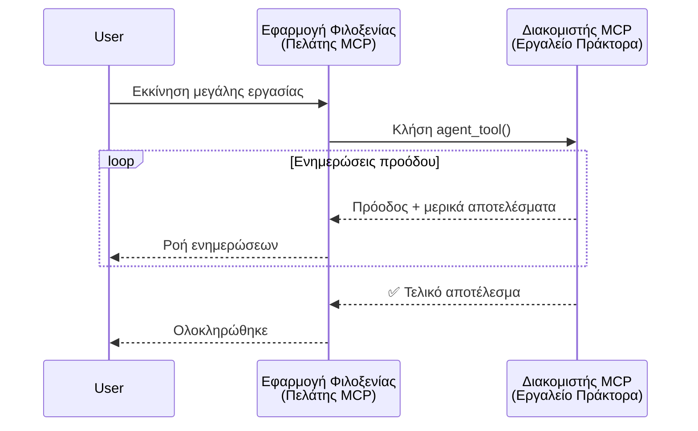
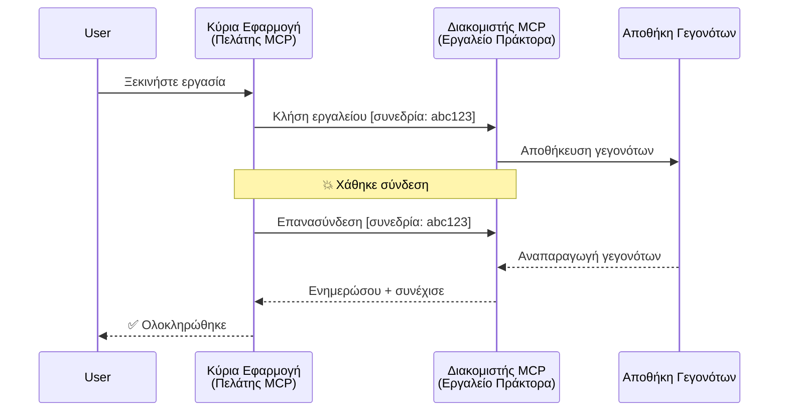
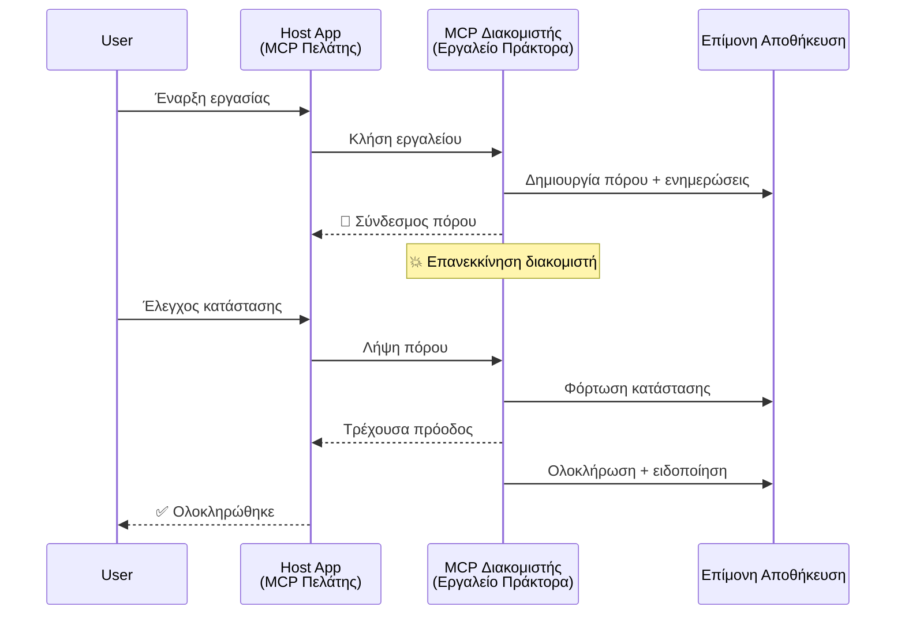
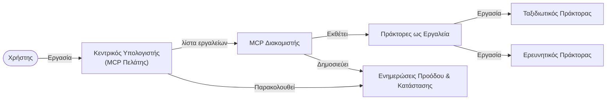

# Δημιουργία Συστημάτων Επικοινωνίας Μεταξύ Πρακτόρων με MCP

> TL;DR - Μπορείτε να Δημιουργήσετε Επικοινωνία Agent2Agent στο MCP; Ναι!

Το MCP έχει εξελιχθεί σημαντικά πέρα από τον αρχικό του στόχο της "παροχής πλαισίου στα LLMs". Με πρόσφατες βελτιώσεις που περιλαμβάνουν [ρεσιουμάσιμα streams](https://modelcontextprotocol.io/docs/concepts/transports#resumability-and-redelivery), [εισαγωγή στοιχείων](https://modelcontextprotocol.io/specification/2025-06-18/client/elicitation), [δειγματοληψία](https://modelcontextprotocol.io/specification/2025-06-18/client/sampling) και ειδοποιήσεις ([πρόοδος](https://modelcontextprotocol.io/specification/2025-06-18/basic/utilities/progress) και [πόροι](https://modelcontextprotocol.io/specification/2025-06-18/schema#resourceupdatednotification)), το MCP τώρα παρέχει μια ισχυρή βάση για τη δημιουργία σύνθετων συστημάτων επικοινωνίας μεταξύ πρακτόρων.

## Η Παρεξήγηση για Πράκτορα/Εργαλείο

Καθώς περισσότεροι προγραμματιστές εξερευνούν εργαλεία με πρακτορικές συμπεριφορές (λειτουργία για μεγάλες χρονικές περιόδους, ενδεχόμενη ανάγκη για επιπλέον είσοδο ενδιάμεσα, κλπ.), μια κοινή παρεξήγηση είναι ότι το MCP είναι ακατάλληλο κυρίως επειδή πρώιμα παραδείγματα των εργαλείων του επικεντρώνονταν σε απλά πρότυπα αίτησης-απόκρισης.

Αυτή η αντίληψη είναι ξεπερασμένη. Η προδιαγραφή MCP έχει βελτιωθεί σημαντικά τους τελευταίους μήνες με δυνατότητες που γεφυρώνουν το κενό για δημιουργία μακροχρόνιων πρακτορικών συμπεριφορών:

- **Ροή & Μερικά Αποτελέσματα**: Ενημερώσεις προόδου σε πραγματικό χρόνο κατά την εκτέλεση  
- **Επανέναρξη**: Οι πελάτες μπορούν να επανασυνδεθούν και να συνεχίσουν μετά από αποσύνδεση  
- **Διαρκειακότητα**: Τα αποτελέσματα επιβιώνουν επανεκκινήσεις διακομιστή (π.χ. μέσω συνδέσμων πόρων)  
- **Πολλαπλός γύρος**: Διαδραστική είσοδος ενδιάμεσα μέσω εισαγωγής στοιχείων και δειγματοληψίας  

Αυτά τα χαρακτηριστικά μπορούν να συνδυαστούν για να επιτρέψουν πολύπλοκες πρακτορικές και πολυπρακτορικές εφαρμογές, όλες αναπτυγμένες στο πρωτόκολλο MCP.

Για αναφορά, θα αναφερόμαστε σε ένα πράκτορα ως ένα "εργαλείο" που είναι διαθέσιμο σε έναν MCP διακομιστή. Αυτό συνεπάγεται την ύπαρξη μιας εφαρμογής υποδοχής που υλοποιεί έναν πελάτη MCP ο οποίος δημιουργεί μια συνεδρία με τον MCP διακομιστή και μπορεί να καλέσει τον πράκτορα.

## Τι Κάνει Ένα Εργαλείο MCP "Πρακτορικό";

Πριν βουτήξουμε στην υλοποίηση, ας καθορίσουμε ποια υποδομή χρειάζεται για να υποστηριχθούν μακροχρόνιοι πράκτορες.

> Ορίζουμε έναν πράκτορα ως μια οντότητα που μπορεί να λειτουργεί αυτόνομα για μεγάλες χρονικές περιόδους, ικανή να χειριστεί πολύπλοκες εργασίες που μπορεί να απαιτούν πολλαπλές αλληλεπιδράσεις ή προσαρμογές βασισμένες σε ανατροφοδότηση σε πραγματικό χρόνο.

### 1. Ροή & Μερικά Αποτελέσματα

Τα παραδοσιακά πρότυπα αίτησης-απόκρισης δεν λειτουργούν για μακροχρόνιες εργασίες. Οι πράκτορες πρέπει να παρέχουν:

- Ενημερώσεις προόδου σε πραγματικό χρόνο  
- Ενδιάμεσα αποτελέσματα  

**Υποστήριξη MCP**: Οι ειδοποιήσεις ενημέρωσης πόρων επιτρέπουν τη μετάδοση μερικών αποτελεσμάτων σε ροή, αν και απαιτείται προσεκτικός σχεδιασμός για να αποφευχθούν συγκρούσεις με το μοντέλο αίτησης/απόκρισης 1:1 του JSON-RPC.

| Χαρακτηριστικό            | Περίπτωση Χρήσης                                                                                                                                                           | Υποστήριξη MCP                                                                              |
| -------------------------- | ---------------------------------------------------------------------------------------------------------------------------------------------------------------------------- | ------------------------------------------------------------------------------------------ |
| Ενημερώσεις Προόδου σε Πραγματικό Χρόνο | Ο χρήστης αιτεί εργασία μετεγκατάστασης κώδικα. Ο πράκτορας μεταδίδει την πρόοδο: "10% - Ανάλυση εξαρτήσεων... 25% - Μετατροπή TypeScript αρχείων... 50% - Ενημέρωση εισαγωγών..." | ✅ Ειδοποιήσεις προόδου                                                                    |
| Μερικά Αποτελέσματα        | Η εργασία "Δημιουργία βιβλίου" μεταδίδει μερικά αποτελέσματα, π.χ. 1) Περίγραμμα ιστορίας, 2) Λίστα κεφαλαίων, 3) Κάθε κεφάλαιο ολοκληρωμένο. Ο οικοδεσπότης μπορεί να επιθεωρεί, να ακυρώνει ή να ανακατευθύνει σε οποιοδήποτε στάδιο.| ✅ Οι ειδοποιήσεις μπορούν να «επαυξηθούν» για να περιλαμβάνουν μερικά αποτελέσματα, ανατρέξτε στις προτάσεις PR 383, 776|

<div align="center" style="font-style: italic; font-size: 0.95em; margin-bottom: 0.5em;">
<strong>Εικόνα 1:</strong> Αυτό το διάγραμμα απεικονίζει πώς ένας πράκτορας MCP μεταδίδει ενημερώσεις προόδου σε πραγματικό χρόνο και μερικά αποτελέσματα στην εφαρμογή υποδοχής κατά τη διάρκεια μιας μακροχρόνιας εργασίας, επιτρέποντας στον χρήστη να παρακολουθεί την εκτέλεση σε πραγματικό χρόνο.
</div>



### 2. Επανέναρξη

Οι πράκτορες πρέπει να χειρίζονται με κομψότητα τις διακοπές δικτύου:

- Επανασύνδεση μετά από αποσύνδεση (πελάτη)  
- Συνέχιση από εκεί που σταμάτησαν (επαναμεταφορά μηνυμάτων)  

**Υποστήριξη MCP**: Η μεταφορά StreamableHTTP του MCP σήμερα υποστηρίζει επανέναρξη συνεδρίας και επαναμεταφορά μηνυμάτων με ταυτοποιητές συνεδρίας και τον τελευταίο ταυτοποιητή συμβάντος. Σημαντική σημείωση είναι ότι ο διακομιστής πρέπει να υλοποιεί ένα EventStore που επιτρέπει αναπαραγωγή συμβάντων κατά την επανασύνδεση πελάτη.  
Σημειώνεται μια πρόταση κοινότητας (PR #975) που εξερευνά ροές ανεξάρτητες μεταφορών και επανέναρσης.

| Χαρακτηριστικό | Περίπτωση Χρήσης                                                                                                                                                    | Υποστήριξη MCP                                                          |
| -------------- | ----------------------------------------------------------------------------------------------------------------------------------------------------------------- | ---------------------------------------------------------------------- |
| Επανέναρξη     | Ο πελάτης αποσυνδέεται κατά τη διάρκεια μακροχρόνιας εργασίας. Με την επανασύνδεση, η συνεδρία συνεχίζεται με αναπαραγωγή των παραληφθέντων συμβάντων, συνεχίζοντας ομαλά από εκεί που σταμάτησε.| ✅ Μεταφορά StreamableHTTP με ταυτοποιητές συνεδρίας, αναπαραγωγή συμβάντων και EventStore |

<div align="center" style="font-style: italic; font-size: 0.95em; margin-bottom: 0.5em;">
<strong>Εικόνα 2:</strong> Αυτό το διάγραμμα δείχνει πώς η μεταφορά StreamableHTTP και το EventStore του MCP επιτρέπουν ομαλή επανέναρξη συνεδρίας: αν ο πελάτης αποσυνδεθεί, μπορεί να επανασυνδεθεί και να αναπαράγει τα παραληφθέντα συμβάντα, συνεχίζοντας την εργασία χωρίς απώλεια προόδου.
</div>



### 3. Διαρκειακότητα

Οι μακροχρόνιοι πράκτορες χρειάζονται επίμονο κατάσταση:

- Τα αποτελέσματα επιβιώνουν επανεκκινήσεις διακομιστή  
- Η κατάσταση μπορεί να ανακτηθεί εκτός ζώνης  
- Παρακολούθηση προόδου ανά συνεδρίες  

**Υποστήριξη MCP**: Το MCP πλέον υποστηρίζει τύπο επιστροφής Resource link για κλήσεις εργαλείων. Σήμερα, ένα πιθανό μοτίβο είναι να σχεδιάζεται ένα εργαλείο που δημιουργεί έναν πόρο και αμέσως επιστρέφει έναν σύνδεσμο πόρου. Το εργαλείο μπορεί να συνεχίσει να ασχολείται με την εργασία στο παρασκήνιο και να ενημερώνει τον πόρο. Με τη σειρά του, ο πελάτης μπορεί να επιλέξει να ελέγχει κατάστασεις αυτού του πόρου για να λάβει μερικά ή πλήρη αποτελέσματα (ανάλογα με το ποιες ενημερώσεις πόρων παρέχει ο διακομιστής) ή να εγγραφεί για ειδοποιήσεις ενημερώσεων αυτού του πόρου.

Ένας περιορισμός εδώ είναι ότι η συχνή επιθεώρηση πόρων ή η εγγραφή για ενημερώσεις μπορεί να καταναλώσει πόρους με συνέπειες σε μεγάλη κλίμακα. Υπάρχει ανοιχτή πρόταση κοινότητας (συμπεριλαμβανομένου του #992) που εξετάζει την πιθανότητα ενσωμάτωσης webhooks ή triggers που ο διακομιστής μπορεί να καλεί για να ειδοποιεί τον πελάτη/εφαρμογή υποδοχής για ενημερώσεις.

| Χαρακτηριστικό | Περίπτωση Χρήσης                                                                                                                             | Υποστήριξη MCP                                                  |
| -------------- | ------------------------------------------------------------------------------------------------------------------------------------------ | ---------------------------------------------------------------- |
| Διαρκειακότητα | Ο διακομιστής παύει να λειτουργεί κατά τη διάρκεια εργασίας μετεγκατάστασης δεδομένων. Τα αποτελέσματα και η πρόοδος επιβιώνουν την επανεκκίνηση, ο πελάτης μπορεί να ελέγξει την κατάσταση και να συνεχίσει από επίμονο πόρο. | ✅ Σύνδεσμοι πόρων με επίμονη αποθήκευση και ειδοποιήσεις κατάστασης |

Σήμερα, ένα κοινό μοτίβο είναι να σχεδιάζεται ένα εργαλείο που δημιουργεί έναν πόρο και αμέσως επιστρέφει έναν σύνδεσμο πόρου. Το εργαλείο μπορεί στο παρασκήνιο να ασχολείται με την εργασία, να εκδίδει ειδοποιήσεις πόρων που λειτουργούν ως ενημερώσεις προόδου ή να περιλαμβάνουν μερικά αποτελέσματα, και να ενημερώνει το περιεχόμενο στο πόρο όπως απαιτείται.

<div align="center" style="font-style: italic; font-size: 0.95em; margin-bottom: 0.5em;">
<strong>Εικόνα 3:</strong> Αυτό το διάγραμμα δείχνει πώς οι πράκτορες MCP χρησιμοποιούν επίμονους πόρους και ειδοποιήσεις κατάστασης για να διασφαλίσουν ότι οι μακροχρόνιες εργασίες επιβιώνουν επανεκκινήσεις διακομιστή, επιτρέποντας στους πελάτες να ελέγχουν την πρόοδο και να ανακτούν τα αποτελέσματα ακόμη και μετά από αποτυχίες.
</div>



### 4. Πολυγύρεις Αλληλεπιδράσεις

Οι πράκτορες συχνά χρειάζονται επιπλέον είσοδο ενδιάμεσα στην εκτέλεση:

- Ανθρώπινη διευκρίνιση ή έγκριση  
- Βοήθεια AI για πολύπλοκες αποφάσεις  
- Δυναμική προσαρμογή παραμέτρων  

**Υποστήριξη MCP**: Πλήρως υποστηρίζεται μέσω δειγματοληψίας (για είσοδο AI) και εισαγωγής στοιχείων (για ανθρώπινη είσοδο).

| Χαρακτηριστικό            | Περίπτωση Χρήσης                                                                                                                                        | Υποστήριξη MCP                                    |
| ------------------------ | ------------------------------------------------------------------------------------------------------------------------------------------------------- | ------------------------------------------------- |
| Πολυγύρεις Αλληλεπιδράσεις | Πράκτορας κρατήσεων ταξιδιών ζητά επιβεβαίωση τιμής από τον χρήστη, μετά ζητά από AI να συνοψίσει τα δεδομένα ταξιδιού πριν ολοκληρώσει τη συναλλαγή κράτησης. | ✅ Εισαγωγή στοιχείων για ανθρώπινη εισροή, δειγματοληψία για AI εισροή |

<div align="center" style="font-style: italic; font-size: 0.95em; margin-bottom: 0.5em;">
<strong>Εικόνα 4:</strong> Αυτό το διάγραμμα δείχνει πώς οι πράκτορες MCP μπορούν διαδραστικά να ζητούν ανθρώπινη εισροή ή να αιτούν βοήθεια AI ενδιάμεσα στην εκτέλεση, υποστηρίζοντας σύνθετες, πολυγύρεις ροές εργασίας όπως επιβεβαιώσεις και δυναμική λήψη αποφάσεων.
</div>

```mermaid
sequenceDiagram
    participant User
    participant Host as Εφαρμογή Φιλοξενίας<br/>(Πελάτης MCP)
    participant Server as Διακομιστής MCP<br/>(Εργαλείο Πράκτορα)

    User->>Host: Κράτηση πτήσης
    Host->>Server: Κλήση ταξιδιωτικού_πράκτορα

    Server->>Host: Εξαγωγή: "Επιβεβαιώνετε $500;"
    Note over Host: Επιστροφή κλήσης εξαγωγής (αν υπάρχει)
    Host->>User: 💰 Επιβεβαιώνετε τιμή;
    User->>Host: "Ναι"
    Host->>Server: Επιβεβαιώθηκε

    Server->>Host: Δειγματοληψία: "Συνοψίστε δεδομένα"
    Note over Host: Επιστροφή κλήσης AI (αν υπάρχει)
    Host->>Server: Περίληψη αναφοράς

    Server->>Host: ✅ Πτήση κρατήθηκε
```

## Υλοποίηση Μακροχρόνιων Πρακτόρων στο MCP - Επισκόπηση Κώδικα

Στο πλαίσιο αυτού του άρθρου, παρέχουμε ένα [αποθετήριο κώδικα](https://github.com/victordibia/ai-tutorials/tree/main/MCP%20Agents) που περιέχει μια πλήρη υλοποίηση μακροχρόνιων πρακτόρων χρησιμοποιώντας το MCP Python SDK με μεταφορά StreamableHTTP για επανέναρξη συνεδρίας και επαναμεταφορά μηνυμάτων. Η υλοποίηση δείχνει πώς οι δυνατότητες MCP μπορούν να συνδυαστούν για να επιτρέψουν προηγμένες πρακτορικές συμπεριφορές.

Συγκεκριμένα, υλοποιούμε έναν διακομιστή με δύο βασικά εργαλεία πράκτορα:

- **Πράκτορας Ταξιδιών** - Προσομοιώνει υπηρεσία κρατήσεων ταξιδιών με επιβεβαίωση τιμής μέσω εισαγωγής στοιχείων  
- **Πράκτορας Έρευνας** - Πραγματοποιεί εργασίες έρευνας με συνοψίσεις υποβοηθούμενες από AI μέσω δειγματοληψίας  

Και οι δύο πράκτορες επιδεικνύουν ενημερώσεις προόδου σε πραγματικό χρόνο, διαδραστικές επιβεβαιώσεις και πλήρεις δυνατότητες επανέναρξης συνεδρίας.

### Βασικές Έννοιες Υλοποίησης

Οι επόμενες ενότητες δείχνουν την υλοποίηση πράκτορα πλευράς διακομιστή και τη διαχείριση πελάτη πλευράς υποδοχής για κάθε δυνατότητα:

#### Ροή & Ενημερώσεις Προόδου - Κατάσταση Εργασίας σε Πραγματικό Χρόνο

Η ροή επιτρέπει στους πράκτορες να παρέχουν ενημερώσεις προόδου σε πραγματικό χρόνο κατά τη διάρκεια μακροχρόνιων εργασιών, κρατώντας τους χρήστες ενημερωμένους για την κατάσταση της εργασίας και τα ενδιάμεσα αποτελέσματα.

**Υλοποίηση Διακομιστή (ο πράκτορας στέλνει ειδοποιήσεις προόδου):**

```python
# Από server/server.py - Πράκτορας ταξιδιού που στέλνει ενημερώσεις προόδου
for i, step in enumerate(steps):
    await ctx.session.send_progress_notification(
        progress_token=ctx.request_id,
        progress=i * 25,
        total=100,
        message=step,
        related_request_id=str(ctx.request_id)
    )
    await anyio.sleep(2)  # Προσομοίωση εργασίας

# Εναλλακτικά: Καταγραφή μηνυμάτων για λεπτομερείς ενημερώσεις βήμα προς βήμα
await ctx.session.send_log_message(
    level="info",
    data=f"Processing step {current_step}/{steps} ({progress_percent}%)",
    logger="long_running_agent",
    related_request_id=ctx.request_id,
)
```

**Υλοποίηση Πελάτη (ο υποδοχέας λαμβάνει ενημερώσεις προόδου):**

```python
# Από το client/client.py - Πελάτης που χειρίζεται ειδοποιήσεις σε πραγματικό χρόνο
async def message_handler(message) -> None:
    if isinstance(message, types.ServerNotification):
        if isinstance(message.root, types.LoggingMessageNotification):
            console.print(f"📡 [dim]{message.root.params.data}[/dim]")
        elif isinstance(message.root, types.ProgressNotification):
            progress = message.root.params
            console.print(f"🔄 [yellow]{progress.message} ({progress.progress}/{progress.total})[/yellow]")

# Καταχώριση χειριστή μηνυμάτων κατά τη δημιουργία συνεδρίας
async with ClientSession(
    read_stream, write_stream,
    message_handler=message_handler
) as session:
```

#### Εισαγωγή Στοιχείων - Αίτηση Εισόδου Χρήστη

Η εισαγωγή στοιχείων επιτρέπει στους πράκτορες να ζητούν είσοδο χρήστη ενδιάμεσα στην εκτέλεση. Αυτό είναι απαραίτητο για επιβεβαιώσεις, διευκρινίσεις ή εγκρίσεις κατά τη διάρκεια μακροχρόνιων εργασιών.

**Υλοποίηση Διακομιστή (ο πράκτορας ζητά επιβεβαίωση):**

```python
# Από server/server.py - Τουριστικός πράκτορας που ζητά επιβεβαίωση τιμής
elicit_result = await ctx.session.elicit(
    message=f"Please confirm the estimated price of $1200 for your trip to {destination}",
    requestedSchema=PriceConfirmationSchema.model_json_schema(),
    related_request_id=ctx.request_id,
)

if elicit_result and elicit_result.action == "accept":
    # Συνεχίστε με την κράτηση
    logger.info(f"User confirmed price: {elicit_result.content}")
elif elicit_result and elicit_result.action == "decline":
    # Ακύρωση της κράτησης
    booking_cancelled = True
```

**Υλοποίηση Πελάτη (ο υποδοχέας παρέχει callback για εισαγωγή στοιχείων):**

```python
# Από το client/client.py - Διαχείριση αιτημάτων εκλογισμού από τον πελάτη
async def elicitation_callback(context, params):
    console.print(f"💬 Server is asking for confirmation:")
    console.print(f"   {params.message}")

    response = console.input("Do you accept? (y/n): ").strip().lower()

    if response in ['y', 'yes']:
        return types.ElicitResult(
            action="accept",
            content={"confirm": True, "notes": "Confirmed by user"}
        )
    else:
        return types.ElicitResult(
            action="decline",
            content={"confirm": False, "notes": "Declined by user"}
        )

# Καταχώρισε την ανάκληση κατά τη δημιουργία της συνεδρίας
async with ClientSession(
    read_stream, write_stream,
    elicitation_callback=elicitation_callback
) as session:
```

#### Δειγματοληψία - Αίτηση Βοήθειας AI

Η δειγματοληψία επιτρέπει στους πράκτορες να ζητούν βοήθεια LLM για πολύπλοκες αποφάσεις ή δημιουργία περιεχομένου κατά την εκτέλεση. Αυτό επιτρέπει υβριδικές ροές εργασίας ανθρώπου-AI.

**Υλοποίηση Διακομιστή (ο πράκτορας ζητά βοήθεια AI):**

```python
# Από server/server.py - Ο πράκτορας έρευνας ζητά σύνοψη τεχνητής νοημοσύνης
sampling_result = await ctx.session.create_message(
    messages=[
        SamplingMessage(
            role="user",
            content=TextContent(type="text", text=f"Please summarize the key findings for research on: {topic}")
        )
    ],
    max_tokens=100,
    related_request_id=ctx.request_id,
)

if sampling_result and sampling_result.content:
    if sampling_result.content.type == "text":
        sampling_summary = sampling_result.content.text
        logger.info(f"Received sampling summary: {sampling_summary}")
```

**Υλοποίηση Πελάτη (ο υποδοχέας παρέχει callback για δειγματοληψία):**

```python
# Από το client/client.py - Διαχείριση αιτημάτων δειγματοληψίας από τον πελάτη
async def sampling_callback(context, params):
    message_text = params.messages[0].content.text if params.messages else 'No message'
    console.print(f"🧠 Server requested sampling: {message_text}")

    # Σε μια πραγματική εφαρμογή, αυτό θα μπορούσε να καλέσει ένα API LLM
    # Για σκοπούς επίδειξης, παρέχουμε μια ψεύτικη απάντηση
    mock_response = "Based on current research, MCP has evolved significantly..."

    return types.CreateMessageResult(
        role="assistant",
        content=types.TextContent(type="text", text=mock_response),
        model="interactive-client",
        stopReason="endTurn"
    )

# Καταχωρήστε το callback κατά τη δημιουργία της συνεδρίας
async with ClientSession(
    read_stream, write_stream,
    sampling_callback=sampling_callback,
    elicitation_callback=elicitation_callback
) as session:
```

#### Επανέναρξη - Συνέχεια Συνεδρίας μετά από Αποσυνδέσεις

Η επανέναρξη διασφαλίζει ότι οι μακροχρόνιες εργασίες πρακτόρων μπορούν να επιβιώσουν αποσυνδέσεις πελάτη και να συνεχιστούν αδιάκοπα με την επανασύνδεση. Αυτό υλοποιείται μέσω αποθηκών συμβάντων και tokens επανέναρξης.

**Υλοποίηση Αποθήκης Συμβάντων (ο διακομιστής διατηρεί την κατάσταση συνεδρίας):**

```python
# Από το server/event_store.py - Απλό αποθετήριο συμβάντων στη μνήμη
class SimpleEventStore(EventStore):
    def __init__(self):
        self._events: list[tuple[StreamId, EventId, JSONRPCMessage]] = []
        self._event_id_counter = 0

    async def store_event(self, stream_id: StreamId, message: JSONRPCMessage) -> EventId:
        """Store an event and return its ID."""
        self._event_id_counter += 1
        event_id = str(self._event_id_counter)
        self._events.append((stream_id, event_id, message))
        return event_id

    async def replay_events_after(self, last_event_id: EventId, send_callback: EventCallback) -> StreamId | None:
        """Replay events after the specified ID for resumption."""
        start_index = None
        stream_id = None
        for index, (event_stream_id, event_id, _) in enumerate(self._events):
            if event_id == last_event_id:
                start_index = index + 1
                stream_id = event_stream_id
                break

        if start_index is None:
            return None

        # Αναπαραγωγή μόνο των μεταγενέστερων συμβάντων από την αρχική ροή της συνεδρίας.
        for event_stream_id, event_id, message in self._events[start_index:]:
            if event_stream_id != stream_id:
                continue
            await send_callback(EventMessage(message, event_id))

        return stream_id

# Από το server/server.py - Μεταβίβαση αποθετηρίου συμβάντων στο διαχειριστή συνεδρίας
def create_server_app(event_store: Optional[EventStore] = None) -> Starlette:
    server = ResumableServer()

    # Δημιουργία διαχειριστή συνεδρίας με αποθετήριο συμβάντων για συνέχεια
    session_manager = StreamableHTTPSessionManager(
        app=server,
        event_store=event_store,  # Το αποθετήριο συμβάντων επιτρέπει τη συνέχεια της συνεδρίας
        json_response=False,
        security_settings=security_settings,
    )

    return Starlette(routes=[Mount("/mcp", app=session_manager.handle_request)])

# Χρήση: Αρχικοποίηση με αποθετήριο συμβάντων
event_store = SimpleEventStore()
app = create_server_app(event_store)
```

**Μεταδεδομένα Πελάτη με Token Επανέναρξης (ο πελάτης επανασυνδέεται χρησιμοποιώντας αποθηκευμένη κατάσταση):**

```python
# Από το client/client.py - Επανεκκίνηση πελάτη με μεταδεδομένα
if existing_tokens and existing_tokens.get("resumption_token"):
    # Χρησιμοποιήστε το υπάρχον διακομιστή επανεκκίνησης για να συνεχίσετε από εκεί που σταματήσαμε
    metadata = ClientMessageMetadata(
        resumption_token=existing_tokens["resumption_token"],
    )
else:
    # Δημιουργήστε ανάκληση για να αποθηκεύσετε το διακομιστή επανεκκίνησης όταν ληφθεί
    def enhanced_callback(token: str):
        protocol_version = getattr(session, 'protocol_version', None)
        token_manager.save_tokens(session_id, token, protocol_version, command, args)

    metadata = ClientMessageMetadata(
        on_resumption_token_update=enhanced_callback,
    )

# Στείλτε αίτημα με μεταδεδομένα επανεκκίνησης
result = await session.send_request(
    types.ClientRequest(
        types.CallToolRequest(
            method="tools/call",
            params=types.CallToolRequestParams(name=command, arguments=args)
        )
    ),
    types.CallToolResult,
    metadata=metadata,
)
```

Η εφαρμογή υποδοχής διατηρεί τοπικά τα ταυτόσημα συνεδριών και τα tokens επανέναρξης, επιτρέποντάς της να επανασυνδεθεί σε υπάρχουσες συνεδρίες χωρίς απώλεια προόδου ή κατάστασης.

### Οργάνωση Κώδικα

<div align="center" style="font-style: italic; font-size: 0.95em; margin-bottom: 0.5em;">
<strong>Εικόνα 5:</strong> Αρχιτεκτονική συστήματος πρακτόρων βασισμένου σε MCP
</div>



**Κύρια Αρχεία:**

- **`server/server.py`** - Επανεκκινήσιμος MCP διακομιστής με πράκτορες ταξιδιών και έρευνας που επιδεικνύουν εισαγωγή στοιχείων, δειγματοληψία και ενημερώσεις προόδου  
- **`client/client.py`** - Διαδραστική εφαρμογή υποδοχής με υποστήριξη επανέναρξης, διαχειριστές callback και διαχείριση tokens  
- **`server/event_store.py`** - Υλοποίηση αποθήκης συμβάντων που επιτρέπει επανέναρξη συνεδρίας και επαναμεταφορά μηνυμάτων  

## Επέκταση σε Πολυπρακτορική Επικοινωνία στο MCP

Η παραπάνω υλοποίηση μπορεί να επεκταθεί σε πολυπρακτορικά συστήματα με τη βελτίωση της νοημοσύνης και της εμβέλειας της εφαρμογής υποδοχής:

- **Έξυπνη Διάσπαση Εργασιών**: Ο υποδοχέας αναλύει σύνθετα αιτήματα χρήστη και τα διασπά σε υποεργασίες για διαφορετικούς εξειδικευμένους πράκτορες  
- **Συντονισμός Πολλαπλών Διακομιστών**: Ο υποδοχέας διατηρεί συνδέσεις με πολλούς MCP διακομιστές, καθένας εκθέτοντας διαφορετικές δυνατότητες πρακτόρων  
- **Διαχείριση Κατάστασης Εργασιών**: Ο υποδοχέας παρακολουθεί την πρόοδο πολλαπλών ταυτόχρονων εργασιών πρακτόρων, διαχειρίζοντας εξαρτήσεις και αλληλουχίες  
- **Ανθεκτικότητα & Επαναπροσπάθειες**: Ο υποδοχέας διαχειρίζεται αποτυχίες, υλοποιεί λογική επαναπροσπάθειας και ανακατευθύνει εργασίες όταν οι πράκτορες γίνονται μη διαθέσιμοι  
- **Σύνθεση Αποτελεσμάτων**: Ο υποδοχέας συνδυάζει αποτελέσματα από πολλούς πράκτορες σε συνεκτικά τελικά αποτελέσματα  

Ο υποδοχέας εξελίσσεται από έναν απλό πελάτη σε έναν έξυπνο συντονιστή, συντονίζοντας κατανεμημένες δυνατότητες πρακτόρων διατηρώντας την ίδια βάση πρωτοκόλλου MCP.

## Συμπέρασμα

Οι βελτιωμένες δυνατότητες του MCP - ειδοποιήσεις πόρων, εισαγωγή/δειγματοληψία, ρεσιουμάσιμα streams και επίμονους πόρους - επιτρέπουν σύνθετες αλληλεπιδράσεις μεταξύ πρακτόρων διατηρώντας την απλότητα του πρωτοκόλλου.

## Ξεκινώντας

Έτοιμοι να δημιουργήσετε το δικό σας σύστημα agent2agent; Ακολουθήστε αυτά τα βήματα:

### 1. Τρέξτε το Demo

```bash
# Ξεκινήστε τον διακομιστή με αποθήκη γεγονότων για επανέναρξη
python -m server.server --port 8006

# Σε ένα άλλο τερματικό, εκτελέστε τον διαδραστικό πελάτη
python -m client.client --url http://127.0.0.1:8006/mcp
```

**Διαθέσιμες εντολές σε διαδραστική λειτουργία:**

- `travel_agent` - Κάντε κράτηση ταξιδιού με επιβεβαίωση τιμής μέσω εισαγωγής στοιχείων  
- `research_agent` - Ερευνήστε θέματα με AI-υποβοηθούμενες συνοψίσεις μέσω δειγματοληψίας  
- `list` - Εμφάνιση όλων των διαθέσιμων εργαλείων  
- `clean-tokens` - Καθαρισμός tokens επανέναρξης  
- `help` - Εμφάνιση αναλυτικής βοήθειας εντολών  
- `quit` - Έξοδος από τον πελάτη  

### 2. Δοκιμάστε τις Δυνατότητες Επανέναρξης

- Ξεκινήστε έναν μακροχρόνιο πράκτορα (π.χ., `travel_agent`)  
- Διακόψτε τον πελάτη κατά την εκτέλεση (Ctrl+C)  
- Επανεκκινήστε τον πελάτη - θα συνεχίσει αυτόματα από εκεί που σταμάτησε  

### 3. Εξερευνήστε και Επεκτείνετε

- **Εξερευνήστε τα παραδείγματα**: Ρίξτε μια ματιά στο [mcp-agents](https://github.com/victordibia/ai-tutorials/tree/main/MCP%20Agents)  
- **Γίνετε μέρος της κοινότητας**: Συμμετέχετε στις συζητήσεις MCP στο GitHub  
- **Πειραματιστείτε**: Ξεκινήστε με μια απλή μακροχρόνια εργασία και προσθέστε σταδιακά ροή, ρεσιουμάσιμα και συντονισμό πολλαπλών πρακτόρων  

Αυτό επιδεικνύει πώς το MCP επιτρέπει έξυπνες πρακτορικές συμπεριφορές ενώ διατηρεί την απλότητα βασισμένη σε εργαλεία.

Συνολικά, η προδιαγραφή πρωτοκόλλου MCP εξελίσσεται γρήγορα· ο αναγνώστης ενθαρρύνεται να ανατρέχει στον επίσημο ιστότοπο τεκμηρίωσης για τις πιο πρόσφατες ενημερώσεις - https://modelcontextprotocol.io/introduction

---

<!-- CO-OP TRANSLATOR DISCLAIMER START -->
**Αποποίηση ευθυνών**:
Αυτό το έγγραφο έχει μεταφραστεί χρησιμοποιώντας την υπηρεσία μετάφρασης με τεχνητή νοημοσύνη [Co-op Translator](https://github.com/Azure/co-op-translator). Ενώ επιδιώκουμε την ακρίβεια, παρακαλούμε να έχετε υπόψη ότι οι αυτοματοποιημένες μεταφράσεις ενδέχεται να περιέχουν λάθη ή ανακρίβειες. Το πρωτότυπο έγγραφο στη μητρική του γλώσσα πρέπει να θεωρείται η αυθεντική πηγή. Για κρίσιμες πληροφορίες, συνιστάται επαγγελματική ανθρώπινη μετάφραση. Δεν φέρουμε ευθύνη για τυχόν παρεξηγήσεις ή λανθασμένες ερμηνείες που προκύπτουν από τη χρήση αυτής της μετάφρασης.
<!-- CO-OP TRANSLATOR DISCLAIMER END -->