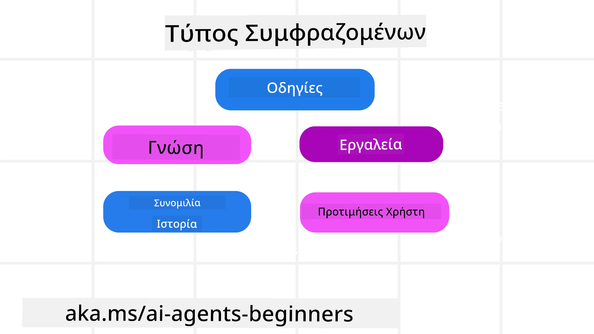
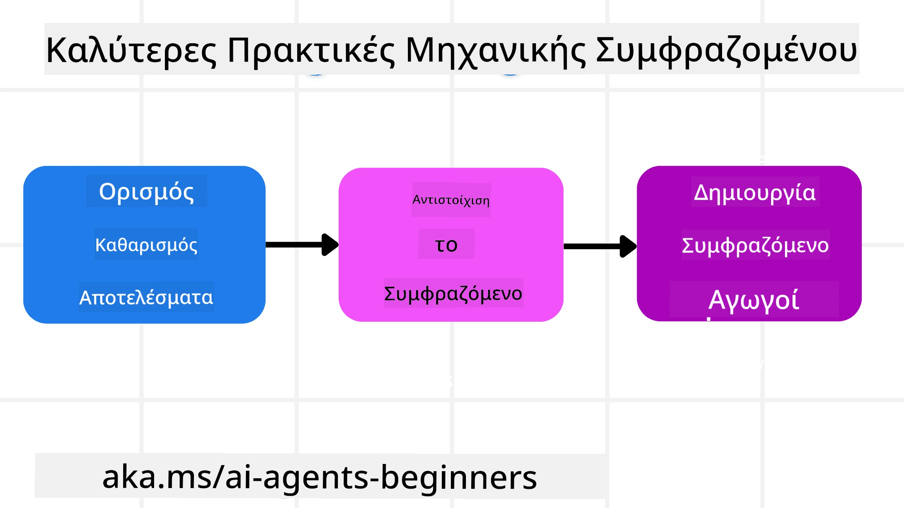

# Μηχανική Πλαισίου για Πράκτορες Τεχνητής Νοημοσύνης

> _(Κάντε κλικ στην εικόνα παραπάνω για να δείτε το βίντεο αυτού του μαθήματος)_

Η κατανόηση της πολυπλοκότητας της εφαρμογής για την οποία δημιουργείτε έναν πράκτορα τεχνητής νοημοσύνης είναι σημαντική για να φτιάξετε έναν αξιόπιστο πράκτορα. Χρειαζόμαστε την κατασκευή Πρακτόρων ΤΝ που διαχειρίζονται αποτελεσματικά την πληροφορία για να αντιμετωπίσουν πολύπλοκες ανάγκες πέρα από τη μηχανική προτροπής.

Σε αυτό το μάθημα, θα εξετάσουμε τι είναι η μηχανική πλαισίου και τον ρόλο της στην κατασκευή πρακτόρων τεχνητής νοημοσύνης.

## Εισαγωγή

Αυτό το μάθημα θα καλύψει:

• **Τι είναι η μηχανική πλαισίου** και γιατί διαφέρει από τη μηχανική προτροπής.

• **Στρατηγικές για αποτελεσματική μηχανική πλαισίου**, συμπεριλαμβανομένου του πώς να γράφετε, επιλέγετε, συμπιέζετε και απομονώνετε πληροφορίες.

• **Κοινές αποτυχίες πλαισίου** που μπορούν να αποπροσανατολίσουν τον πράκτορά σας και πώς να τις διορθώσετε.

## Στόχοι Μάθησης

Μετά την ολοκλήρωση αυτού του μαθήματος, θα κατανοείτε πώς να:

• **Ορίζετε τη μηχανική πλαισίου** και να τη διαχωρίζετε από τη μηχανική προτροπής.

• **Αναγνωρίζετε τα βασικά στοιχεία του πλαισίου** σε εφαρμογές Μεγάλων Γλωσσικών Μοντέλων (LLM).

• **Εφαρμόζετε στρατηγικές για το γράψιμο, την επιλογή, τη συμπίεση και την απομόνωση του πλαισίου** για βελτίωση της απόδοσης του πράκτορα.

• **Αναγνωρίζετε κοινές αποτυχίες πλαισίου** όπως δηλητηρίαση, απόσπαση, σύγχυση και σύγκρουση, και να εφαρμόζετε τεχνικές μείωσης.

## Τι είναι η Μηχανική Πλαισίου;

Για τους Πράκτορες ΤΝ, το πλαίσιο είναι αυτό που καθοδηγεί τον σχεδιασμό ενός Πράκτορα ΤΝ να αναλάβει συγκεκριμένες ενέργειες. Η Μηχανική Πλαισίου είναι η πρακτική διασφάλισης ότι ο Πράκτορας ΤΝ διαθέτει τις σωστές πληροφορίες για να ολοκληρώσει το επόμενο βήμα της εργασίας. Το παράθυρο πλαισίου έχει περιορισμένο μέγεθος, οπότε ως δημιουργοί πρακτόρων πρέπει να κατασκευάσουμε συστήματα και διαδικασίες για τη διαχείριση της προσθήκης, της αφαίρεσης και της συμπύκνωσης των πληροφοριών στο παράθυρο πλαισίου.

### Μηχανική Προτροπής vs Μηχανική Πλαισίου

Η μηχανική προτροπής εστιάζεται σε ένα στατικό σύνολο οδηγιών για να καθοδηγήσει αποτελεσματικά τους Πράκτορες ΤΝ με ένα σύνολο κανόνων. Η μηχανική πλαισίου αφορά το πώς να διαχειριστείς ένα δυναμικό σύνολο πληροφοριών, συμπεριλαμβανομένης της αρχικής προτροπής, για να διασφαλίσεις ότι ο Πράκτορας ΤΝ έχει ό,τι χρειάζεται με την πάροδο του χρόνου. Η βασική ιδέα γύρω από τη μηχανική πλαισίου είναι να κάνεις αυτή τη διαδικασία επαναλήψιμη και αξιόπιστη.

### Τύποι Πλαισίου

Είναι σημαντικό να θυμόμαστε ότι το πλαίσιο δεν είναι μόνο ένα πράγμα. Η πληροφορία που χρειάζεται ο Πράκτορας ΤΝ μπορεί να προέρχεται από μια ποικιλία διαφορετικών πηγών και είναι στο χέρι μας να διασφαλίσουμε την πρόσβαση του πράκτορα σε αυτές τις πηγές:

Οι τύποι πλαισίου που μπορεί να χρειαστεί να διαχειριστεί ένας πράκτορας περιλαμβάνουν:

• **Οδηγίες:** Είναι σαν τους "κανόνες" του πράκτορα – προτροπές, μηνύματα συστήματος, παραδείγματα λίγων βημάτων (που δείχνουν στον ΤΝ πώς να κάνει κάτι), και περιγραφές εργαλείων που μπορεί να χρησιμοποιήσει. Εδώ συνδυάζεται η εστίαση της μηχανικής προτροπής με τη μηχανική πλαισίου.

• **Γνώση:** Καλύπτει γεγονότα, πληροφορίες που ανακτώνται από βάσεις δεδομένων, ή μακροχρόνιες αναμνήσεις που έχει συσσωρεύσει ο πράκτορας. Αυτό περιλαμβάνει την ενσωμάτωση ενός συστήματος Ανάκτησης Ενισχυμένης Παραγωγής (RAG) αν ένας πράκτορας χρειάζεται πρόσβαση σε διάφορα καταστήματα γνώσης και βάσεις δεδομένων.

• **Εργαλεία:** Είναι οι ορισμοί εξωτερικών λειτουργιών, API και MCP Διακομιστών που μπορεί να καλέσει ο πράκτορας, μαζί με την ανατροφοδότηση (αποτελέσματα) που λαμβάνει από τη χρήση τους.

• **Ιστορικό Συνομιλίας:** Ο τρέχων διάλογος με έναν χρήστη. Καθώς περνά ο χρόνος, αυτές οι συνομιλίες γίνονται μεγαλύτερες και πιο σύνθετες, πράγμα που σημαίνει ότι καταλαμβάνουν χώρο στο παράθυρο πλαισίου.

• **Προτιμήσεις Χρήστη:** Πληροφορίες που μαθαίνονται σχετικά με τις προτιμήσεις ή αποστροφές ενός χρήστη με την πάροδο του χρόνου. Αυτές θα μπορούσαν να αποθηκευτούν και να ανακληθούν όταν λαμβάνονται σημαντικές αποφάσεις για να βοηθήσουν τον χρήστη.

## Στρατηγικές για Αποτελεσματική Μηχανική Πλαισίου

### Στρατηγικές Σχεδιασμού

Η καλή μηχανική πλαισίου ξεκινά με καλό σχεδιασμό. Εδώ είναι μια προσέγγιση που θα σας βοηθήσει να αρχίσετε να σκέφτεστε πώς να εφαρμόσετε την έννοια της μηχανικής πλαισίου:

1. **Ορίστε Σαφή Αποτελέσματα** - Τα αποτελέσματα των εργασιών που θα ανατεθούν στους Πράκτορες ΤΝ πρέπει να ορίζονται σαφώς. Απαντήστε στην ερώτηση: "Πώς θα μοιάζει ο κόσμος όταν ο Πράκτορας ΤΝ ολοκληρώσει την εργασία του;" Με άλλα λόγια, ποια αλλαγή, πληροφορία ή απάντηση πρέπει να έχει ο χρήστης μετά την αλληλεπίδραση με τον Πράκτορα ΤΝ.
2. **Χαρτογραφήστε το Πλαίσιο** - Αφού ορίσετε τα αποτελέσματα του Πράκτορα ΤΝ, πρέπει να απαντήσετε στην ερώτηση: "Τι πληροφορίες χρειάζεται ο Πράκτορας ΤΝ για να ολοκληρώσει αυτή την εργασία;". Με αυτόν τον τρόπο μπορείτε να ξεκινήσετε τη χαρτογράφηση του πλαισίου σχετικά με το πού μπορεί να εντοπιστεί αυτή η πληροφορία.
3. **Δημιουργήστε Ροές Πλαισίου** - Τώρα που ξέρετε πού βρίσκεται η πληροφορία, πρέπει να απαντήσετε στην ερώτηση: "Πώς θα αποκτήσει ο Πράκτορας αυτή την πληροφορία;". Αυτό μπορεί να γίνει με διάφορους τρόπους, όπως RAG, χρήση MCP διακομιστών και άλλα εργαλεία.

### Πρακτικές Στρατηγικές

Ο σχεδιασμός είναι σημαντικός, αλλά μόλις οι πληροφορίες αρχίσουν να ρέουν μέσα στο παράθυρο πλαισίου του πράκτορα, χρειάζονται πρακτικές στρατηγικές για τη διαχείρισή τους:

#### Διαχείριση Πλαισίου

Ενώ ορισμένες πληροφορίες θα προστεθούν αυτόματα στο παράθυρο πλαισίου, η μηχανική πλαισίου είναι να παίρνεις έναν πιο ενεργό ρόλο σε αυτές τις πληροφορίες, κάτι που μπορεί να γίνει με μερικές στρατηγικές:

 1. **Σημειωματάριο Πράκτορα**  
 Αυτό επιτρέπει σε έναν Πράκτορα ΤΝ να κρατά σημειώσεις σχετικές με τις τρέχουσες εργασίες και αλληλεπιδράσεις χρηστών κατά τη διάρκεια μίας μόνο συνεδρίας. Αυτό πρέπει να υφίσταται εκτός του παραθύρου πλαισίου σε ένα αρχείο ή αντικείμενο κατά το χρόνο εκτέλεσης, το οποίο ο πράκτορας μπορεί να ανακτήσει αργότερα κατά τη διάρκεια αυτής της συνεδρίας εάν χρειαστεί.

 2. **Αναμνήσεις**  
 Τα σημειωματάρια είναι καλά για διαχείριση πληροφοριών εκτός του παραθύρου πλαισίου μιας μόνο συνεδρίας. Οι αναμνήσεις επιτρέπουν στους πράκτορες να αποθηκεύουν και να ανακτούν σχετικές πληροφορίες σε πολλές συνεδρίες. Αυτό μπορεί να περιλαμβάνει συνοψίσεις, προτιμήσεις χρήστη και ανατροφοδότηση για βελτιώσεις στο μέλλον.

 3. **Συμπίεση Πλαισίου**  
  Μόλις το παράθυρο πλαισίου μεγαλώσει και πλησιάζει το όριο του, τεχνικές όπως η περίληψη και το κόψιμο μπορούν να χρησιμοποιηθούν. Αυτό περιλαμβάνει είτε τη διατήρηση μόνο των πιο σχετικών πληροφοριών είτε την αφαίρεση παλαιότερων μηνυμάτων.
  
 4. **Πολυ-Αντιπροσωπευτικά Συστήματα**  
  Η ανάπτυξη πολυ-αντιπροσωπευτικού συστήματος είναι μια μορφή μηχανικής πλαισίου επειδή κάθε πράκτορας έχει το δικό του παράθυρο πλαισίου. Πώς το πλαίσιο αυτό μοιράζεται και μεταβιβάζεται σε διαφορετικούς πράκτορες είναι κάτι άλλο που πρέπει να σχεδιαστεί κατά την κατασκευή αυτών των συστημάτων.
  
 5. **Περιοχές Σχολικού Πειράματος (Sandbox Environments)**  
  Αν ένας πράκτορας χρειαστεί να εκτελέσει κάποιον κώδικα ή να επεξεργαστεί μεγάλες ποσότητες πληροφορίας σε ένα έγγραφο, αυτό μπορεί να χρειαστεί μεγάλο αριθμό τοκεν για την επεξεργασία των αποτελεσμάτων. Αντί να αποθηκεύεται όλο αυτό μέσα στο παράθυρο πλαισίου, ο πράκτορας μπορεί να χρησιμοποιήσει ένα sandbox περιβάλλον που μπορεί να τρέξει αυτόν τον κώδικα και να διαβάζει μόνο τα αποτελέσματα και άλλες σχετικές πληροφορίες.
  
 6. **Αντικείμενα Κατάστασης Χρόνου Εκτέλεσης**  
   Αυτό γίνεται με τη δημιουργία δοχείων πληροφορίας για τη διαχείριση καταστάσεων όταν ο πράκτορας χρειάζεται πρόσβαση σε ορισμένες πληροφορίες. Για μια πολύπλοκη εργασία, αυτό θα επέτρεπε στον πράκτορα να αποθηκεύει τα αποτελέσματα κάθε υπο-εργασίας βήμα προς βήμα, επιτρέποντας το πλαίσιο να παραμένει συνδεδεμένο μόνο με το συγκεκριμένο υπο-εργασία.

#### Επιθεώρηση Πλαισίου

Αφού εφαρμόσετε μία από αυτές τις στρατηγικές, αξίζει να ελέγξετε τι έλαβε πραγματικά η επόμενη κλήση μοντέλου. Μια χρήσιμη ερώτηση για αποσφαλμάτωση είναι:

> Ο πράκτορας φόρτωσε υπερβολικό πλαίσιο, λάθος πλαίσιο, ή έλλειπε το πλαίσιο που χρειαζόταν;

Δεν χρειάζεται να καταγράψετε ακατέργαστες προτροπές, αποτελέσματα εργαλείων ή περιεχόμενα μνήμης για να απαντήσετε σε αυτήν την ερώτηση. Σε παραγωγή, προτιμήστε μικρές εγγραφές επιθεώρησης πλαισίου που καταγράφουν μετρήσεις, αναγνωριστικά, κατακερματισμούς και ετικέτες πολιτικής:

- **Επιλογή:** Παρακολουθήστε πόσα υποψήφια κομμάτια, εργαλεία ή μνήμες εξετάστηκαν, πόσα επιλέχθηκαν και ποιος κανόνας ή βαθμολογία προκάλεσε το φιλτράρισμα των άλλων.
- **Συμπίεση:** Καταγράψτε την προέλευση ή το αναγνωριστικό ιχνηλάτησης, το αναγνωριστικό περίληψης, εκτιμώμενο αριθμό τοκεν πριν και μετά τη συμπίεση και αν το ακατέργαστο περιεχόμενο αποκλείστηκε από την επόμενη κλήση.
- **Απομόνωση:** Σημειώστε ποια υπο-εργασία εκτελέστηκε σε ξεχωριστό πράκτορα, συνεδρία ή sandbox, ποια οριοθετημένη περίληψη επέστρεψε, και αν μεγάλα αποτελέσματα εργαλείων παρέμειναν εκτός του πλαισίου του γονικού πράκτορα.
- **Μνήμη και RAG:** Αποθηκεύστε αναγνωριστικά εγγράφων ανάκτησης, αναγνωριστικά μνήμης, βαθμολογίες, επιλεγμένα αναγνωριστικά και κατάσταση απόκρυψης αντί για πλήρες ανακτηθέν κείμενο.
- **Ασφάλεια και ιδιωτικότητα:** Προτιμήστε κατακερματισμούς, αναγνωριστικά, κουβάδες τοκεν και ετικέτες πολιτικής αντί για ευαίσθητο κείμενο προτροπής, επιχειρήματα εργαλείων, αποτελέσματα εργαλείων ή σώματα μνήμης χρήστη.

Ο στόχος δεν είναι να διατηρήσετε περισσότερο πλαίσιο. Είναι να αφήσετε επαρκή αποδεικτικά στοιχεία ώστε ένας προγραμματιστής να μπορεί να πει ποια στρατηγική πλαισίου εκτέλεσε και αν άλλαξε την επόμενη κλήση μοντέλου με τον προοριζόμενο τρόπο.

### Παράδειγμα Μηχανικής Πλαισίου

Ας υποθέσουμε ότι θέλουμε ένας πράκτορας ΤΝ να **"Κλείσει ένα ταξίδι στο Παρίσι για μένα."**

• Ένας απλός πράκτορας που χρησιμοποιεί μόνο μηχανική προτροπής μπορεί απλά να απαντήσει: **"Εντάξει, πότε θέλετε να πάτε στο Παρίσι;**". Επεξεργάζεται μόνο την άμεση ερώτησή σας τη στιγμή που ο χρήστης την έκανε.

• Ένας πράκτορας που χρησιμοποιεί τις στρατηγικές μηχανικής πλαισίου που καλύφθηκαν θα έκανε πολύ περισσότερα. Πριν καν απαντήσει, το σύστημά του μπορεί να:

  ◦ **Ελέγξει το ημερολόγιό σας** για διαθέσιμες ημερομηνίες (ανάκτηση δεδομένων σε πραγματικό χρόνο).

 ◦ **Θυμηθεί τις προηγούμενες ταξιδιωτικές προτιμήσεις** (από τη μακροχρόνια μνήμη) όπως η προτιμώμενη αεροπορική εταιρεία, ο προϋπολογισμός ή αν προτιμάτε απευθείας πτήσεις.

 ◦ **Εντοπίσει διαθέσιμα εργαλεία** για κράτηση πτήσεων και ξενοδοχείων.

- Έπειτα, μια ενδεικτική απάντηση θα μπορούσε να είναι:  "Γεια σου [Το Όνομά Σου]! Βλέπω ότι είσαι ελεύθερος την πρώτη εβδομάδα του Οκτωβρίου. Να ψάξω για απευθείας πτήσεις προς Παρίσι με [Προτιμώμενη Αεροπορική Εταιρεία] εντός του συνηθισμένου προϋπολογισμού σου των [Προϋπολογισμός];". Αυτή η πιο πλούσια, με επίγνωση πλαισίου απάντηση δείχνει τη δύναμη της μηχανικής πλαισίου.

## Κοινές Αποτυχίες Πλαισίου

### Δηλητηρίαση Πλαισίου

**Τι είναι:** Όταν μια ψευδαίσθηση (ψευδής πληροφορία που παράγεται από το LLM) ή ένα σφάλμα εισέρχονται στο πλαίσιο και αναφέρονται επανειλημμένα, προκαλώντας τον πράκτορα να ακολουθεί αδύνατους στόχους ή να αναπτύσσει παράλογες στρατηγικές.

**Τι να κάνετε:** Εφαρμόστε **επαλήθευση πλαισίου** και **καραντίνα**. Επικυρώστε τις πληροφορίες πριν προστεθούν στη μακροχρόνια μνήμη. Αν εντοπιστεί πιθανή δηλητηρίαση, ξεκινήστε φρέσκες νήματα πλαισίου για να αποτρέψετε τη διάδοση των κακών πληροφοριών.

**Παράδειγμα Κράτησης Ταξιδιού:** Ο πράκτοράς σας έχει ψευδαίσθηση για **απευθείας πτήση από ένα μικρό τοπικό αεροδρόμιο σε μια μακρινή διεθνή πόλη** που στην πραγματικότητα δεν προσφέρει διεθνείς πτήσεις. Αυτή η ανύπαρκτη λεπτομέρεια πτήσης αποθηκεύεται στο πλαίσιο. Αργότερα, όταν ζητήσετε από τον πράκτορα να κλείσει, προσπαθεί συνεχώς να βρει εισιτήρια για αυτήν τη μη δυνατή διαδρομή, οδηγώντας σε επανειλημμένα σφάλματα.

**Λύση:** Εφαρμόστε ένα βήμα που **επικυρώνει την ύπαρξη και τις διαδρομές πτήσεων με ένα API σε πραγματικό χρόνο** _πριν_ προστεθεί η λεπτομέρεια της πτήσης στο ενεργό πλαίσιο του πράκτορα. Αν η επικύρωση αποτύχει, οι λανθασμένες πληροφορίες "τεθούν σε καραντίνα" και δεν χρησιμοποιούνται περαιτέρω.

### Απόσπαση Πλαισίου

**Τι είναι:** Όταν το πλαίσιο γίνεται τόσο μεγάλο που το μοντέλο εστιάζει υπερβολικά στο σωρευμένο ιστορικό αντί να χρησιμοποιήσει όσα έμαθε κατά την εκπαίδευση, οδηγώντας σε επαναλαμβανόμενες ή άχρηστες ενέργειες. Τα μοντέλα μπορεί να αρχίσουν να κάνουν λάθη ακόμη και πριν γεμίσει το παράθυρο πλαισίου.

**Τι να κάνετε:** Χρησιμοποιήστε **περίληψη πλαισίου**. Περιοδικά συμπιέζετε τις συσσωρευμένες πληροφορίες σε σύντομες συνοψίσεις, διατηρώντας σημαντικές λεπτομέρειες και αφαιρώντας ιστορικό που επαναλαμβάνεται. Αυτό βοηθά στο "reset" της εστίασης.

**Παράδειγμα Κράτησης Ταξιδιού:** Συζητάτε προορισμούς ονείρου για μεγάλο χρονικό διάστημα, συμπεριλαμβανομένης λεπτομερούς αναφοράς στο ταξίδι σακιδίου πριν από δύο χρόνια. Όταν ζητάτε τελικά **"βρες μου μια φθηνή πτήση για τον επόμενο μήνα,"** ο πράκτορας μπερδεύεται με τις παλιές, άσχετες λεπτομέρειες και συνεχίζει να ρωτά για τον εξοπλισμό σακιδίου ή προηγούμενα δρομολόγια, αγνοώντας το τρέχον αίτημά σας.

**Λύση:** Μετά από ορισμένο αριθμό στροφών ή όταν το πλαίσιο μεγαλώσει πολύ, ο πράκτορας πρέπει να **περιληφθεί τα πιο πρόσφατα και σχετικά μέρη της συνομιλίας** – εστιάζοντας στις τρέχουσες ημερομηνίες και προορισμό – και να χρησιμοποιήσει αυτή τη συμπυκνωμένη περίληψη για την επόμενη κλήση LLM, απορρίπτοντας το λιγότερο σχετικό ιστορικό.

### Σύγχυση Πλαισίου

**Τι είναι:** Όταν το περιττό πλαίσιο, συχνά με τη μορφή πάρα πολλών διαθέσιμων εργαλείων, προκαλεί το μοντέλο να δημιουργεί κακές απαντήσεις ή να καλεί άσχετα εργαλεία. Τα μικρότερα μοντέλα είναι ιδιαίτερα επιρρεπή σε αυτό.

**Τι να κάνετε:** Εφαρμόστε **διαχείριση φόρτωσης εργαλείων** χρησιμοποιώντας τεχνικές RAG. Αποθηκεύστε περιγραφές εργαλείων σε μια βάση δεδομένων διανυσμάτων και επιλέξτε _μόνο_ τα πιο σχετικά εργαλεία για κάθε συγκεκριμένη εργασία. Έρευνες δείχνουν ότι η επιλογή εργαλείων πρέπει να περιορίζεται σε λιγότερα από 30.

**Παράδειγμα Κράτησης Ταξιδιού:** Ο πράκτοράς σας έχει πρόσβαση σε δεκάδες εργαλεία: `book_flight`, `book_hotel`, `rent_car`, `find_tours`, `currency_converter`, `weather_forecast`, `restaurant_reservations`, κτλ. Ρωτάτε, **"Ποιος είναι ο καλύτερος τρόπος να κινηθώ στο Παρίσι;"** Λόγω του πλήθους των εργαλείων, ο πράκτορας μπερδεύεται και προσπαθεί να καλέσει `book_flight` _εντός_ Παρισιού, ή `rent_car`, παρόλο που προτιμάτε δημόσια συγκοινωνία, επειδή οι περιγραφές εργαλείων μπορεί να αλληλοεπικαλύπτονται ή απλά δεν μπορεί να ξεχωρίσει το καλύτερο.

**Λύση:** Χρησιμοποιήστε **RAG με περιγραφές εργαλείων**. Όταν ρωτάτε για το πώς να κινηθείτε στο Παρίσι, το σύστημα ανακτά δυναμικά _μόνο_ τα πιο σχετικά εργαλεία όπως `rent_car` ή `public_transport_info` βάσει του ερωτήματός σας, παρουσιάζοντας μια εστιασμένη "φορτωμένη" ομάδα εργαλείων στο LLM.

### Σύγκρουση Πλαισίου

**Τι είναι:** Όταν υπάρχουν αντικρουόμενες πληροφορίες μέσα στο πλαίσιο, οδηγώντας σε ασυνεπή συλλογισμό ή κακές τελικές απαντήσεις. Αυτό συμβαίνει συχνά όταν οι πληροφορίες φτάνουν σε στάδια και οι πρώιμες, λανθασμένες υποθέσεις παραμένουν στο πλαίσιο.

**Τι να κάνετε:** Χρησιμοποιήστε **κούρεμα πλαισίου** και **εκφόρτωση**. Το κούρεμα σημαίνει την αφαίρεση παρωχημένων ή αντικρουόμενων πληροφοριών καθώς φτάνουν νέες λεπτομέρειες. Η εκφόρτωση παρέχει στο μοντέλο έναν ξεχωριστό χώρο εργασίας "scratchpad" για επεξεργασία πληροφοριών χωρίς να επιβαρύνεται το κύριο πλαίσιο.
**Παράδειγμα Κράτησης Ταξιδιού:** Αρχικά λέτε στον πράκτορά σας, **"Θέλω να πετάξω στην οικονομική θέση."** Αργότερα στη συνομιλία, αλλάζετε γνώμη και λέτε, **"Στην πραγματικότητα, για αυτό το ταξίδι, ας πάμε στη θέση business."** Εάν και οι δύο οδηγίες παραμείνουν στο πλαίσιο, ο πράκτορας μπορεί να λάβει αντικρουόμενα αποτελέσματα αναζήτησης ή να μπερδευτεί σχετικά με το ποια προτίμηση πρέπει να προτεραιοποιήσει.

**Λύση:** Εφαρμόστε **περικοπή πλαισίου (context pruning)**. Όταν μια νέα οδηγία αντιβαίνει σε μια παλαιότερη, η παλαιότερη οδηγία αφαιρείται ή αντικαθίσταται ρητά στο πλαίσιο. Εναλλακτικά, ο πράκτορας μπορεί να χρησιμοποιήσει ένα **scratchpad** για να συμφιλιώσει τις αντικρουόμενες προτιμήσεις πριν αποφασίσει, διασφαλίζοντας ότι μόνο η τελική, συνεπής οδηγία καθοδηγεί τις ενέργειές του.

## Έχετε Περισσότερες Ερωτήσεις για το Context Engineering;

Εγγραφείτε στο [Microsoft Foundry Discord](https://aka.ms/ai-agents/discord) για να συναντήσετε άλλους μαθητές, να παρακολουθήσετε ώρες γραφείου και να λάβετε απαντήσεις στις ερωτήσεις σας για τους AI Agents.

---

<!-- CO-OP TRANSLATOR DISCLAIMER START -->
**Αποποίηση ευθυνών**:
Αυτό το έγγραφο έχει μεταφραστεί χρησιμοποιώντας την υπηρεσία μετάφρασης με τεχνητή νοημοσύνη [Co-op Translator](https://github.com/Azure/co-op-translator). Ενώ επιδιώκουμε την ακρίβεια, παρακαλούμε να έχετε υπόψη ότι οι αυτοματοποιημένες μεταφράσεις ενδέχεται να περιέχουν λάθη ή ανακρίβειες. Το πρωτότυπο έγγραφο στη μητρική του γλώσσα πρέπει να θεωρείται η αυθεντική πηγή. Για κρίσιμες πληροφορίες, συνιστάται επαγγελματική ανθρώπινη μετάφραση. Δεν φέρουμε ευθύνη για τυχόν παρεξηγήσεις ή λανθασμένες ερμηνείες που προκύπτουν από τη χρήση αυτής της μετάφρασης.
<!-- CO-OP TRANSLATOR DISCLAIMER END -->