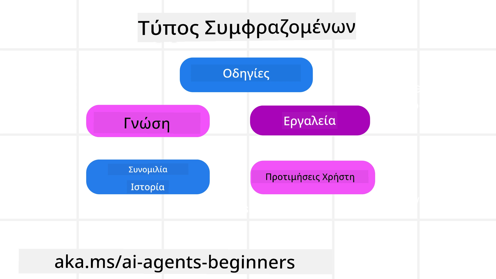
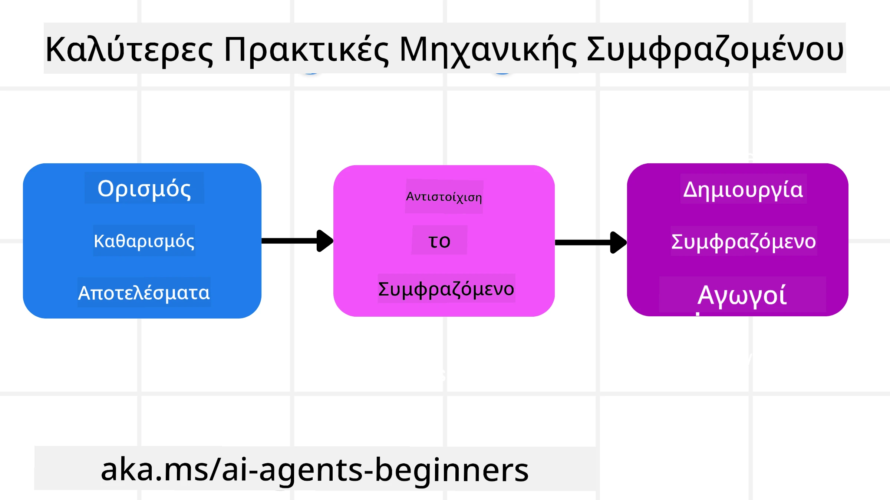

# Μηχανική Συμφραζομένων για Πράκτορες Τεχνητής Νοημοσύνης

> _(Κάντε κλικ στην εικόνα παραπάνω για να δείτε το βίντεο αυτού του μαθήματος)_

Η κατανόηση της πολυπλοκότητας της εφαρμογής για την οποία κατασκευάζετε έναν πράκτορα AI είναι σημαντική για τη δημιουργία ενός αξιόπιστου. Πρέπει να δημιουργήσουμε Πράκτορες Τεχνητής Νοημοσύνης που διαχειρίζονται αποτελεσματικά τις πληροφορίες για να καλύψουν πολύπλοκες ανάγκες πέραν της μηχανικής προτροπής.

Σε αυτό το μάθημα, θα εξετάσουμε τι είναι η μηχανική συμφραζομένων και τον ρόλο της στην κατασκευή πρακτόρων AI.

## Εισαγωγή

Αυτό το μάθημα θα καλύψει:

• **Τι είναι η Μηχανική Συμφραζομένων** και γιατί διαφέρει από τη μηχανική προτροπής.

• **Στρατηγικές για αποτελεσματική Μηχανική Συμφραζομένων**, συμπεριλαμβανομένου του πώς να γράφετε, να επιλέγετε, να συμπιέζετε και να απομονώνετε πληροφορίες.

• **Συνηθισμένες Αποτυχίες Συμφραζομένων** που μπορούν να αποπροσανατολίσουν τον πράκτορα AI σας και πώς να τις διορθώσετε.

## Στόχοι Μάθησης

Μετά την ολοκλήρωση αυτού του μαθήματος, θα γνωρίζετε πώς να:

• **Ορίζετε τη μηχανική συμφραζομένων** και να τη διαχωρίζετε από τη μηχανική προτροπής.

• **Αναγνωρίζετε τα βασικά συστατικά των συμφραζομένων** σε εφαρμογές Μεγάλων Μοντέλων Γλώσσας (LLM).

• **Εφαρμόζετε στρατηγικές για τη σύνταξη, επιλογή, συμπίεση και απομόνωση των συμφραζομένων** για βελτίωση της απόδοσης του πράκτορα.

• **Αναγνωρίζετε κοινές αποτυχίες των συμφραζομένων** όπως δηλητηρίαση, απόσπαση, σύγχυση και σύγκρουση, και υλοποιείτε τεχνικές μετριασμού.

## Τι είναι η Μηχανική Συμφραζομένων;

Για τους Πράκτορες AI, τα συμφραζόμενα είναι αυτό που οδηγεί τον σχεδιασμό ενός Πράκτορα AI για να αναλάβει ορισμένες ενέργειες. Η Μηχανική Συμφραζομένων είναι η πρακτική να διασφαλίζουμε ότι ο Πράκτορας AI έχει τις σωστές πληροφορίες για να ολοκληρώσει το επόμενο βήμα της εργασίας. Το παράθυρο συμφραζομένων είναι περιορισμένο σε μέγεθος, γι’ αυτό ως κατασκευαστές πρακτόρων πρέπει να αναπτύξουμε συστήματα και διαδικασίες για τη διαχείριση της προσθήκης, αφαίρεσης και συμπύκνωσης των πληροφοριών μέσα σε αυτό.

### Μηχανική Προτροπής vs Μηχανική Συμφραζομένων

Η μηχανική προτροπής εστιάζει σε ένα στατικό σύνολο οδηγιών για να κατευθύνει αποτελεσματικά τους Πράκτορες AI με ένα σύνολο κανόνων. Η μηχανική συμφραζομένων αφορά στη διαχείριση ενός δυναμικού συνόλου πληροφοριών, συμπεριλαμβανομένης της αρχικής προτροπής, για να διασφαλιστεί ότι ο Πράκτορας AI έχει όσα χρειάζεται με το πέρασμα του χρόνου. Η βασική ιδέα πίσω από τη μηχανική συμφραζομένων είναι να καταστήσει αυτή τη διαδικασία επαναλαμβανόμενη και αξιόπιστη.

### Τύποι Συμφραζομένων

Είναι σημαντικό να θυμόμαστε ότι τα συμφραζόμενα δεν είναι μόνο ένα πράγμα. Οι πληροφορίες που χρειάζεται ο Πράκτορας AI μπορεί να προέρχονται από μια ποικιλία διαφορετικών πηγών και είναι δική μας ευθύνη να διασφαλίσουμε ότι ο πράκτορας έχει πρόσβαση σε αυτές τις πηγές:

Οι τύποι συμφραζομένων που ένας πράκτορας AI μπορεί να χρειαστεί να διαχειριστεί περιλαμβάνουν:

• **Οδηγίες:** Αυτές λειτουργούν ως οι "κανόνες" του πράκτορα – προτροπές, μηνύματα συστήματος, παραδείγματα λίγων βημάτων (που δείχνουν στον AI πώς να κάνει κάτι) και περιγραφές εργαλείων που μπορεί να χρησιμοποιήσει. Εδώ συνδυάζεται η εστίαση της μηχανικής προτροπής με τη μηχανική συμφραζομένων.

• **Γνώση:** Περιλαμβάνει γεγονότα, πληροφορίες που ανακτώνται από βάσεις δεδομένων ή μακροχρόνιες αναμνήσεις που έχει συγκεντρώσει ο πράκτορας. Αυτό περιλαμβάνει την ενσωμάτωση συστήματος Ανάκτησης με Ενισχυμένη Δημιουργία (RAG) αν ένας πράκτορας χρειάζεται πρόσβαση σε διαφορετικά αποθετήρια γνώσης και βάσεις δεδομένων.

• **Εργαλεία:** Αυτά είναι οι ορισμοί εξωτερικών λειτουργιών, APIs και MCP Servers που μπορεί να καλέσει ο πράκτορας, μαζί με την ανατροφοδότηση (αποτελέσματα) που λαμβάνει από τη χρήση τους.

• **Ιστορικό Συνομιλίας:** Ο συνεχής διάλογος με έναν χρήστη. Καθώς περνά ο χρόνος, αυτές οι συνομιλίες γίνονται μακρύτερες και πιο περίπλοκες, πράγμα που σημαίνει ότι καταλαμβάνουν χώρο στο παράθυρο συμφραζομένων.

• **Προτιμήσεις Χρήστη:** Πληροφορίες που μαθαίνουν σχετικά με τις προτιμήσεις ή τις αποστροφές ενός χρήστη με τον χρόνο. Αυτές μπορεί να αποθηκεύονται και να χρησιμοποιούνται για τη λήψη βασικών αποφάσεων για να βοηθηθεί ο χρήστης.

## Στρατηγικές για Αποτελεσματική Μηχανική Συμφραζομένων

### Στρατηγικές Σχεδιασμού

Καλή μηχανική συμφραζομένων ξεκινά με καλό σχεδιασμό. Ακολουθεί μια προσέγγιση που θα σας βοηθήσει να αρχίσετε να σκέφτεστε πώς να εφαρμόσετε την έννοια της μηχανικής συμφραζομένων:

1. **Καθορίστε Σαφή Αποτελέσματα** - Τα αποτελέσματα των εργασιών που θα ανατεθούν στους Πράκτορες AI πρέπει να είναι σαφώς ορισμένα. Απαντήστε στην ερώτηση - "Πώς θα είναι ο κόσμος όταν ο Πράκτορας AI ολοκληρώσει την εργασία του;" Με άλλα λόγια, ποια αλλαγή, πληροφορία ή απάντηση θα έχει ο χρήστης μετά την αλληλεπίδραση με τον Πράκτορα AI.

2. **Χαρτογραφήστε τα Συμφραζόμενα** - Μόλις καθορίσετε τα αποτελέσματα του Πράκτορα AI, πρέπει να απαντήσετε στην ερώτηση "Τι πληροφορίες χρειάζεται ο Πράκτορας AI για να ολοκληρώσει αυτή την εργασία;". Με αυτόν τον τρόπο μπορείτε να ξεκινήσετε να χαρτογραφείτε πού μπορεί να βρεθούν αυτές οι πληροφορίες.

3. **Δημιουργήστε Σωλήνες Συμφραζομένων** - Τώρα που ξέρετε πού βρίσκονται οι πληροφορίες, πρέπει να απαντήσετε στην ερώτηση "Πώς θα λάβει ο Πράκτορας αυτές τις πληροφορίες;". Αυτό μπορεί να γίνει με διάφορους τρόπους, συμπεριλαμβανομένης της χρήσης RAG, servers MCP και άλλων εργαλείων.

### Πρακτικές Στρατηγικές

Ο σχεδιασμός είναι σημαντικός, αλλά μόλις οι πληροφορίες αρχίσουν να ρέουν στο παράθυρο συμφραζομένων του πράκτορα, χρειάζονται πρακτικές στρατηγικές για τη διαχείρισή τους:

#### Διαχείριση Συμφραζομένων

Ενώ μερικές πληροφορίες θα προστεθούν αυτόματα στο παράθυρο συμφραζομένων, η μηχανική συμφραζομένων αφορά την πιο ενεργή διαχείριση αυτών των πληροφοριών που μπορεί να γίνει με μερικές στρατηγικές:

 1. **Σημειωματάριο Πράκτορα**  
 Αυτό επιτρέπει σε έναν Πράκτορα AI να κρατά σημειώσεις σχετικές με τις τρέχουσες εργασίες και τις αλληλεπιδράσεις με τον χρήστη κατά τη διάρκεια μιας συνεδρίας. Αυτό θα πρέπει να υπάρχει εκτός του παραθύρου συμφραζομένων σε ένα αρχείο ή αντικείμενο εκτέλεσης που ο πράκτορας μπορεί να ανακαλέσει αργότερα κατά τη διάρκεια αυτής της συνεδρίας, εάν χρειαστεί.

 2. **Αναμνήσεις**  
 Τα σημειωματάρια είναι καλά για τη διαχείριση πληροφοριών εκτός του παραθύρου συμφραζομένων μιας συνεδρίας. Οι αναμνήσεις δίνουν τη δυνατότητα στους πράκτορες να αποθηκεύουν και να ανακτούν σχετικές πληροφορίες σε πολλές συνεδρίες. Αυτό μπορεί να περιλαμβάνει συνοπτικές πληροφορίες, προτιμήσεις χρήστη και ανατροφοδότηση για βελτιώσεις στο μέλλον.

 3. **Συμπίεση Συμφραζομένων**  
 Μόλις το παράθυρο συμφραζομένων μεγαλώσει και πλησιάζει το όρισμά του, μπορούν να χρησιμοποιηθούν τεχνικές όπως η περίληψη και το κόψιμο. Αυτό περιλαμβάνει είτε τη διατήρηση μόνο των πιο σχετικών πληροφοριών είτε την αφαίρεση παλαιότερων μηνυμάτων.

 4. **Πολυπράκτορα Συστήματα**  
 Η ανάπτυξη συστημάτων με πολλούς πράκτορες είναι μια μορφή μηχανικής συμφραζομένων επειδή κάθε πράκτορας έχει το δικό του παράθυρο συμφραζομένων. Πώς αυτά τα συμφραζόμενα μοιράζονται και μεταφέρονται στους διάφορους πράκτορες είναι κάτι που πρέπει επίσης να σχεδιαστεί κατά την κατασκευή αυτών των συστημάτων.

 5. **Περιβάλλοντα Sandbox**  
 Εάν ένας πράκτορας χρειαστεί να εκτελέσει κώδικα ή να επεξεργαστεί μεγάλες ποσότητες πληροφοριών σε ένα έγγραφο, αυτό μπορεί να καταναλώσει μεγάλο αριθμό τοκενίων για την επεξεργασία των αποτελεσμάτων. Αντί να αποθηκεύεται όλο αυτό στο παράθυρο συμφραζομένων, ο πράκτορας μπορεί να χρησιμοποιήσει ένα περιβάλλον sandbox που μπορεί να εκτελέσει αυτόν τον κώδικα και να διαβάσει μόνο τα αποτελέσματα και άλλες σχετικές πληροφορίες.

 6. **Αντικείμενα Κατάστασης Εκτέλεσης**  
   Αυτό γίνεται με τη δημιουργία κοντέινερ πληροφοριών για τη διαχείριση καταστάσεων όπου ο Πράκτορας χρειάζεται πρόσβαση σε συγκεκριμένες πληροφορίες. Για μια σύνθετη εργασία, αυτό θα επέτρεπε σε έναν Πράκτορα να αποθηκεύει τα αποτελέσματα κάθε υποεργασίας βήμα-βήμα, επιτρέποντας στα συμφραζόμενα να παραμένουν συνδεδεμένα μόνο με αυτήν την υποεργασία.

#### Έλεγχος Συμφραζομένων

Αφού εφαρμόσετε μια από αυτές τις στρατηγικές, αξίζει να ελέγξετε τι πραγματικά έλαβε η επόμενη κλήση μοντέλου. Μια χρήσιμη ερώτηση για αποσφαλμάτωση είναι:

> Μήπως ο πράκτορας φόρτωσε υπερβολικά πολλά συμφραζόμενα, τα λάθος συμφραζόμενα, ή έχασε συμφραζόμενα που χρειαζόταν;

Δεν χρειάζεται να καταγράψετε τις πρώτες προτροπές, αποτελέσματα εργαλείων ή περιεχόμενο μνήμης για να απαντήσετε σε αυτή την ερώτηση. Σε παραγωγή, προτιμήστε μικρές εγγραφές επιθεώρησης συμφραζομένων που καταγράφουν μετρήσεις, αναγνωριστικά, κατακερματισμούς και ετικέτες πολιτικής:

- **Επιλογή:** Παρακολουθήστε πόσα υποψήφια κομμάτια, εργαλεία ή μνήμες εξετάστηκαν, πόσα επιλέχθηκαν, και ποιος κανόνας ή σκορ προκάλεσε το φιλτράρισμα των υπολοίπων.

- **Συμπίεση:** Καταγράψτε το εύρος πηγής ή αναγνωριστικό ιχνηλάτησης, το αναγνωριστικό περίληψης, μια εκτιμώμενη καταμέτρηση τοκενίων πριν και μετά τη συμπίεση, και αν το ανεπεξέργαστο περιεχόμενο αποκλείστηκε από την επόμενη κλήση.

- **Απομόνωση:** Σημειώστε ποια υποεργασία εκτελέστηκε σε ξεχωριστό πράκτορα, συνεδρία ή sandbox, ποια συνοπτική περίληψη ορίστηκε, και αν η μεγάλη έξοδος εργαλείων παρέμεινε εκτός του συμφραζόμενου του γονικού πράκτορα.

- **Μνήμη και RAG:** Αποθηκεύστε τα αναγνωριστικά εγγράφων ανάκτησης, αναγνωριστικά μνήμης, σκορ, επιλεγμένα αναγνωριστικά και κατάσταση απόκρυψης αντί για ολόκληρο το ανακτηθέν κείμενο.

- **Ασφάλεια και ιδιωτικότητα:** Προτιμήστε κατακερματισμούς, αναγνωριστικά, κουβάδες τοκενίων και ετικέτες πολιτικής αντί για ευαίσθητο κείμενο προτροπής, επιχειρήματα εργαλείων, αποτελέσματα εργαλείων ή σώματα μνήμης χρήστη.

Ο στόχος δεν είναι να κρατήσετε περισσότερα συμφραζόμενα. Είναι να αφήσετε αρκετά αποδεικτικά στοιχεία ώστε ένας προγραμματιστής να πει ποια στρατηγική συμφραζομένων εκτελέστηκε και αν αυτή άλλαξε την επόμενη κλήση μοντέλου με τον προτιθέμενο τρόπο.

### Παράδειγμα Μηχανικής Συμφραζομένων

Ας πούμε ότι θέλουμε ένας πράκτορας AI να **"Κλείσει ένα ταξίδι στο Παρίσι."**

• Ένας απλός πράκτορας που χρησιμοποιεί μόνο τη μηχανική προτροπής μπορεί απλώς να απαντήσει: **"Εντάξει, πότε θα θέλατε να πάτε στο Παρίσι;**". Επεξεργάστηκε μόνο την άμεση ερώτησή σας τη στιγμή που την υποβάλατε.

• Ένας πράκτορας που χρησιμοποιεί τις καλυμμένες στρατηγικές μηχανικής συμφραζομένων θα έκανε πολύ περισσότερα. Πριν καν απαντήσει, το σύστημά του μπορεί:

  ◦ **Να ελέγξει το ημερολόγιό σας** για διαθέσιμες ημερομηνίες (ανακτώντας δεδομένα σε πραγματικό χρόνο).

 ◦ **Να ανακαλέσει τις προηγούμενες προτιμήσεις ταξιδιού** (από τη μακροχρόνια μνήμη) όπως την προτιμώμενη αεροπορική εταιρεία, τον προϋπολογισμό ή αν προτιμάτε απευθείας πτήσεις.

 ◦ **Να εντοπίσει διαθέσιμα εργαλεία** για κράτηση πτήσεων και ξενοδοχείων.

- Στη συνέχεια, μια ενδεικτική απάντηση θα μπορούσε να είναι: "Γεια σου [Το Όνομά Σου]! Βλέπω είσαι ελεύθερος την πρώτη εβδομάδα Οκτωβρίου. Να ψάξω για απευθείας πτήσεις προς Παρίσι με [Προτιμώμενη Αεροπορική] εντός του συνήθους προϋπολογισμού σου των [Προϋπολογισμός];". Αυτή η πιο ολοκληρωμένη, συμφραζόμενη απάντηση δείχνει τη δύναμη της μηχανικής συμφραζομένων.

## Συνηθισμένες Αποτυχίες Συμφραζομένων

### Δηλητηρίαση Συμφραζομένων

**Τι είναι:** Όταν μια ψευδαίσθηση (ψευδείς πληροφορίες που δημιουργούνται από το LLM) ή ένα σφάλμα εισέρχονται στα συμφραζόμενα και αναφέρονται επανειλημμένα, προκαλώντας τον πράκτορα να επιδιώκει αδύνατους στόχους ή να αναπτύσσει παράλογες στρατηγικές.

**Τι να κάνετε:** Υλοποιήστε **επαλήθευση συμφραζομένων** και **καραντίνα**. Επαληθεύστε τις πληροφορίες πριν προστεθούν στη μακροχρόνια μνήμη. Αν εντοπιστεί πιθανή δηλητηρίαση, ξεκινήστε νέες νημάτιες συμφραζομένων για να αποτραπεί η εξάπλωση των λανθασμένων πληροφοριών.

**Παράδειγμα Κράτησης Ταξιδιού:** Ο πράκτοράς σας φαντάζεται μια **απευθείας πτήση από ένα μικρό τοπικό αεροδρόμιο σε μια μακρινή διεθνή πόλη** που στην πραγματικότητα δεν προσφέρει διεθνείς πτήσεις. Αυτή η ανύπαρκτη λεπτομέρεια πτήσης αποθηκεύεται στα συμφραζόμενα. Αργότερα, όταν ζητάτε από τον πράκτορα να κλείσει, προσπαθεί συνεχώς να βρει εισιτήρια για αυτήν την αδύνατη διαδρομή, οδηγώντας σε επαναλαμβανόμενα σφάλματα.

**Λύση:** Υλοποιήστε ένα βήμα που **επαληθεύει την ύπαρξη πτήσης και τις διαδρομές με ένα API σε πραγματικό χρόνο** _πριν_ προστεθεί η λεπτομέρεια πτήσης στα εργασιακά συμφραζόμενα του πράκτορα. Αν η επαλήθευση αποτύχει, οι λανθασμένες πληροφορίες τίθενται σε "καραντίνα" και δεν χρησιμοποιούνται περαιτέρω.

### Απόσπαση Συμφραζομένων

**Τι είναι:** Όταν το παράθυρο συμφραζομένων γίνεται τόσο μεγάλο που το μοντέλο εστιάζει υπερβολικά στο συσσωρευμένο ιστορικό αντί να χρησιμοποιεί όσα έμαθε κατά την εκπαίδευση, οδηγώντας σε επαναλαμβανόμενες ή άχρηστες ενέργειες. Μοντέλα μπορεί να αρχίσουν να κάνουν λάθη ακόμα και πριν το παράθυρο συμφραζομένων γεμίσει πλήρως.

**Τι να κάνετε:** Χρησιμοποιήστε **περίληψη συμφραζομένων**. Περιοδικά συμπιέστε τις συσσωρευμένες πληροφορίες σε σύντομες περιλήψεις, διατηρώντας σημαντικές λεπτομέρειες ενώ αφαιρείτε το περιττό ιστορικό. Αυτό βοηθά στην "επαναφορά" της εστίασης.

**Παράδειγμα Κράτησης Ταξιδιού:** Έχετε συζητήσει διάφορους προορισμούς ονείρου για μεγάλο χρονικό διάστημα, συμπεριλαμβανομένης μιας λεπτομερούς αφήγησης του ταξιδιού με σακίδιο πριν δύο χρόνια. Όταν τελικά ζητάτε **"βρες μου μια φτηνή πτήση για τον επόμενο μήνα"**, ο πράκτορας μπερδεύεται με τις παλιές, άσχετες λεπτομέρειες και συνεχίζει να ρωτά για τον εξοπλισμό σας ή παλαιότερα δρομολόγια, αγνοώντας το τρέχον αίτημά σας.

**Λύση:** Μετά από ορισμένες στροφές ή όταν το παράθυρο συμφραζομένων μεγαλώνει πολύ, ο πράκτορας πρέπει να **συνοψίσει τα πιο πρόσφατα και σχετικά σημεία της συνομιλίας** – εστιάζοντας στις τρέχουσες ημερομηνίες ταξιδιού και προορισμό – και να χρησιμοποιήσει αυτή τη συμπυκνωμένη περίληψη για την επόμενη κλήση LLM, απορρίπτοντας το λιγότερο σχετικό ιστορικό.

### Σύγχυση Συμφραζομένων

**Τι είναι:** Όταν τα περιττά συμφραζόμενα, συχνά με τη μορφή πάρα πολλών διαθέσιμων εργαλείων, προκαλούν στο μοντέλο να παράγει κακές απαντήσεις ή να καλεί άσχετα εργαλεία. Τα μικρότερα μοντέλα είναι ιδιαιτέρως επιρρεπή σε αυτό.

**Τι να κάνετε:** Υλοποιήστε **διαχείριση φόρτωσης εργαλείων** χρησιμοποιώντας τεχνικές RAG. Αποθηκεύστε περιγραφές εργαλείων σε βάση δεδομένων διανυσμάτων και επιλέξτε _μόνο_ τα πιο σχετικά εργαλεία για κάθε συγκεκριμένη εργασία. Η έρευνα δείχνει ότι περιορίζοντας τις επιλογές εργαλείων σε λιγότερα από 30 είναι ιδανικό.

**Παράδειγμα Κράτησης Ταξιδιού:** Ο πράκτοράς σας έχει πρόσβαση σε δεκάδες εργαλεία: `book_flight`, `book_hotel`, `rent_car`, `find_tours`, `currency_converter`, `weather_forecast`, `restaurant_reservations`, κλπ. Ρωτάτε, **"Ποιος είναι ο καλύτερος τρόπος να μετακινηθώ στο Παρίσι;"** Εξαιτίας του μεγάλου αριθμού εργαλείων, ο πράκτορας μπερδεύεται και προσπαθεί να καλέσει το `book_flight` _μέσα_ στο Παρίσι ή το `rent_car` ενώ προτιμάτε τα μέσα μαζικής μεταφοράς, επειδή οι περιγραφές εργαλείων μπορεί να επικαλύπτονται ή δεν μπορεί απλώς να διακρίνει το καλύτερο.

**Λύση:** Χρησιμοποιήστε **RAG πάνω σε περιγραφές εργαλείων**. Όταν ρωτάτε πώς να μετακινηθείτε στο Παρίσι, το σύστημα ανακτά δυναμικά _μόνο_ τα πιο σχετικά εργαλεία όπως `rent_car` ή `public_transport_info` με βάση το ερώτημά σας, παρουσιάζοντας μια εστιασμένη "φορτωμένη" λίστα εργαλείων στο LLM.

### Σύγκρουση Συμφραζομένων

**Τι είναι:** Όταν υπάρχουν αντικρουόμενες πληροφορίες μέσα στα συμφραζόμενα, οδηγώντας σε ασυνεπείς συλλογισμούς ή κακές τελικές απαντήσεις. Αυτό συμβαίνει συχνά όταν οι πληροφορίες φτάνουν σε στάδια και λανθασμένες πρώτες υποθέσεις παραμένουν στα συμφραζόμενα.

**Τι να κάνετε:** Χρησιμοποιήστε **κλάδεμα συμφραζομένων** και **εκφόρτωση**. Το κλάδεμα σημαίνει την αφαίρεση παρωχημένων ή αντικρουόμενων πληροφοριών καθώς φτάνουν νέες λεπτομέρειες. Η εκφόρτωση δίνει στο μοντέλο ξεχωριστό χώρο εργασίας "σημειωματάριο" για την επεξεργασία πληροφοριών χωρίς να επιβαρύνει το κύριο παράθυρο συμφραζομένων.
**Παράδειγμα κρατήσεων ταξιδιού:** Αρχικά ενημερώνετε τον πράκτορά σας, **«Θέλω να πετάξω σε οικονομική θέση.»** Αργότερα στη συνομιλία, αλλάζετε γνώμη και λέτε, **«Στην πραγματικότητα, για αυτό το ταξίδι, ας πάμε στην επιχειρηματική θέση.»** Αν και οι δύο οδηγίες παραμένουν στο πλαίσιο, ο πράκτορας μπορεί να λάβει αντικρουόμενα αποτελέσματα αναζήτησης ή να μπερδευτεί ως προς το ποια προτίμηση να προτεραιοποιήσει.

**Λύση:** Εφαρμόστε **περιτομή πλαισίου**. Όταν μια νέα οδηγία αντιβαίνει σε μια παλιά, η παλαιότερη οδηγία αφαιρείται ή αντικαθίσταται ρητά στο πλαίσιο. Εναλλακτικά, ο πράκτορας μπορεί να χρησιμοποιήσει ένα **scratchpad** για να συμφιλιώσει τις αντικρουόμενες προτιμήσεις πριν αποφασίσει, διασφαλίζοντας ότι μόνο η τελική, συνεπής οδηγία καθοδηγεί τις ενέργειές του.

## Έχετε Περισσότερες Ερωτήσεις Σχετικά με τη Μηχανική Πλαισίου;

Εγγραφείτε στο [Microsoft Foundry Discord](https://discord.com/invite/ATgtXmAS5D) για να γνωρίσετε άλλους μαθητευόμενους, να παρακολουθήσετε ώρες εργαστηρίου και να λάβετε απαντήσεις στις ερωτήσεις σας για τους Πράκτορες Τεχνητής Νοημοσύνης.

---

<!-- CO-OP TRANSLATOR DISCLAIMER START -->
**Αποποίηση ευθυνών**:
Αυτό το έγγραφο έχει μεταφραστεί χρησιμοποιώντας την υπηρεσία μετάφρασης με τεχνητή νοημοσύνη [Co-op Translator](https://github.com/Azure/co-op-translator). Ενώ επιδιώκουμε την ακρίβεια, παρακαλούμε να έχετε υπόψη ότι οι αυτοματοποιημένες μεταφράσεις ενδέχεται να περιέχουν λάθη ή ανακρίβειες. Το πρωτότυπο έγγραφο στη μητρική του γλώσσα πρέπει να θεωρείται η αυθεντική πηγή. Για κρίσιμες πληροφορίες, συνιστάται επαγγελματική ανθρώπινη μετάφραση. Δεν φέρουμε ευθύνη για τυχόν παρεξηγήσεις ή λανθασμένες ερμηνείες που προκύπτουν από τη χρήση αυτής της μετάφρασης.
<!-- CO-OP TRANSLATOR DISCLAIMER END -->