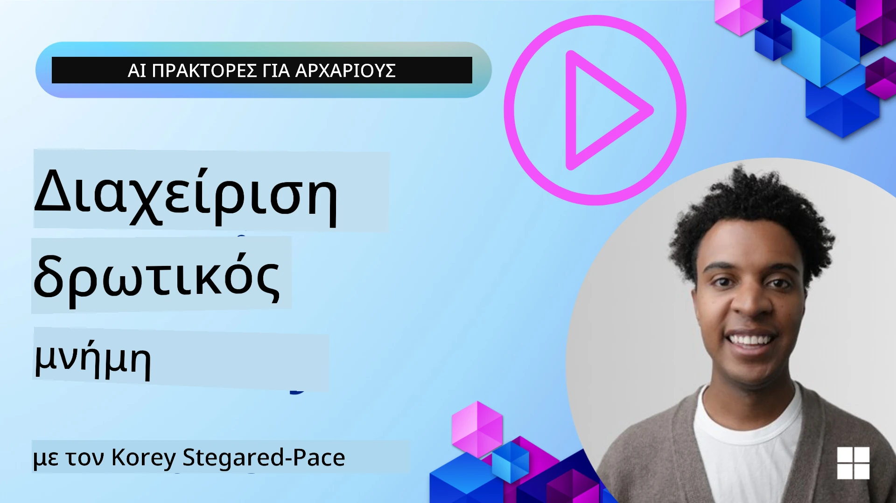

# Μνήμη για Πράκτορες Τεχνητής Νοημοσύνης 

When discussing the unique benefits of creating AI Agents, two things are mainly discussed: the ability to call tools to complete tasks and the ability to improve over time. Memory is at the foundation of creating self-improving agent that can create better experiences for our users.

In this lesson, we will look at what memory is for AI Agents and how we can manage it and use it for the benefit of our applications.

## Εισαγωγή

This lesson will cover:

• **Κατανόηση της Μνήμης των Πρακτόρων Τεχνητής Νοημοσύνης**: Τι είναι η μνήμη και γιατί είναι απαραίτητη για τους πράκτορες.

• **Υλοποίηση και Αποθήκευση Μνήμης**: Πρακτικές μέθοδοι για την προσθήκη δυνατοτήτων μνήμης στους πράκτορές σας, με έμφαση στη βραχυπρόθεσμη και μακροπρόθεσμη μνήμη.

• **Κάνοντας τους Πράκτορες Αυτοβελτιούμενους**: Πώς η μνήμη επιτρέπει στους πράκτορες να μαθαίνουν από προηγούμενες αλληλεπιδράσεις και να βελτιώνονται με την πάροδο του χρόνου.

## Διαθέσιμες Υλοποιήσεις

This lesson includes two comprehensive notebook tutorials:

• **[13-agent-memory.ipynb](./13-agent-memory.ipynb)**: Implements memory using Mem0 and Azure AI Search with Microsoft Agent Framework

• **[13-agent-memory-cognee.ipynb](./13-agent-memory-cognee.ipynb)**: Implements structured memory using Cognee, automatically building knowledge graph backed by embeddings, visualizing graph, and intelligent retrieval

## Στόχοι Μάθησης

After completing this lesson, you will know how to:

• **Διακρίνετε μεταξύ διαφόρων τύπων μνήμης πράκτορα AI**, συμπεριλαμβανομένης της εργασιακής, βραχυπρόθεσμης και μακροπρόθεσμης μνήμης, καθώς και εξειδικευμένων μορφών όπως η μνήμη προσωπικότητας και η επεισοδιακή μνήμη.

• **Υλοποιήσετε και διαχειριστείτε βραχυπρόθεσμη και μακροπρόθεσμη μνήμη για πράκτορες AI** χρησιμοποιώντας το Microsoft Agent Framework, αξιοποιώντας εργαλεία όπως Mem0, Cognee, Whiteboard memory, και ενσωματώνοντας το Azure AI Search.

• **Κατανοήσετε τις αρχές πίσω από τους αυτοβελτιούμενους πράκτορες AI** και πώς τα στιβαρά συστήματα διαχείρισης μνήμης συμβάλλουν στη συνεχή μάθηση και προσαρμογή.

## Κατανόηση της Μνήμης των Πρακτόρων Τεχνητής Νοημοσύνης

Στον πυρήνα του, **η μνήμη για πράκτορες AI αναφέρεται στους μηχανισμούς που τους επιτρέπουν να διατηρούν και να ανακαλούν πληροφορίες**. Αυτές οι πληροφορίες μπορεί να είναι συγκεκριμένες λεπτομέρειες για μια συνομιλία, προτιμήσεις χρήστη, παρελθούσες ενέργειες ή ακόμα και μάθειες προτύπων.

Χωρίς μνήμη, οι εφαρμογές AI είναι συχνά χωρίς κατάσταση, που σημαίνει ότι κάθε αλληλεπίδραση ξεκινά από την αρχή. Αυτό οδηγεί σε μια επαναλαμβανόμενη και απογοητευτική εμπειρία χρήστη όπου ο πράκτορας «ξεχνά» το προηγούμενο πλαίσιο ή τις προτιμήσεις.

### Γιατί είναι Σημαντική η Μνήμη;

an agent's intelligence is deeply tied to its ability to recall and utilize past information. Memory allows agents to be:

• **Στοχαστικοί**: Μαθαίνοντας από προηγούμενες ενέργειες και αποτελέσματα.

• **Διαδραστικοί**: Διατηρώντας το πλαίσιο σε μια συνεχιζόμενη συνομιλία.

• **Προορατικοί και Ανταποκρινόμενοι**: Προβλέποντας ανάγκες ή ανταποκρινόμενοι κατάλληλα βάσει ιστορικών δεδομένων.

• **Αυτόνομοι**: Λειτουργώντας πιο ανεξάρτητα αντλώντας από αποθηκευμένη γνώση.

Ο στόχος της υλοποίησης μνήμης είναι να κάνει τους πράκτορες πιο **αξιόπιστους και ικανούς**.

### Τύποι Μνήμης

#### Εργασιακή Μνήμη

Σκεφτείτε αυτό ως ένα σημειωματάριο που χρησιμοποιεί ένας πράκτορας κατά τη διάρκεια μιας μεμονωμένης, συνεχιζόμενης εργασίας ή διαδικασίας σκέψης. Κρατά άμεσες πληροφορίες που χρειάζονται για να υπολογιστεί το επόμενο βήμα.

Για τους πράκτορες AI, η εργασιακή μνήμη συχνά καταγράφει τις πιο σχετικές πληροφορίες από μια συνομιλία, ακόμα κι αν το πλήρες ιστορικό συζήτησης είναι μεγάλο ή αποκομμένο. Επικεντρώνεται στην εξαγωγή βασικών στοιχείων όπως απαιτήσεις, προτάσεις, αποφάσεις και ενέργειες.

**Παράδειγμα Εργασιακής Μνήμης**

Σε έναν πράκτορα κρατήσεων ταξιδιού, η εργασιακή μνήμη μπορεί να καταγράψει το τρέχον αίτημα του χρήστη, όπως «Θέλω να κλείσω ένα ταξίδι στο Παρίσι». Αυτή η συγκεκριμένη απαίτηση κρατιέται στο άμεσο πλαίσιο του πράκτορα για να καθοδηγήσει την τρέχουσα αλληλεπίδραση.

#### Βραχυπρόθεσμη Μνήμη

Αυτός ο τύπος μνήμης διατηρεί πληροφορίες για τη διάρκεια μιας μεμονωμένης συνομιλίας ή συνεδρίας. Είναι το πλαίσιο της τρέχουσας συζήτησης, επιτρέποντας στον πράκτορα να αναφέρεται σε προηγούμενες γύρες στο διάλογο.

**Παράδειγμα Βραχυπρόθεσμης Μνήμης**

Αν ένας χρήστης ρωτήσει, «Πόσο θα κόστιζε μια πτήση για το Παρίσι;» και στη συνέχεια ακολουθήσει με «Τι γίνεται με τη διαμονή εκεί;», η βραχυπρόθεσμη μνήμη διασφαλίζει ότι ο πράκτορας γνωρίζει ότι το «εκεί» αναφέρεται στο «Παρίσι» στην ίδια συνομιλία.

#### Μακροπρόθεσμη Μνήμη

Αυτές είναι πληροφορίες που διαρκούν σε πολλές συνομιλίες ή συνεδρίες. Επιτρέπουν στους πράκτορες να θυμούνται προτιμήσεις χρήστη, ιστορικές αλληλεπιδράσεις ή γενικές γνώσεις για εκτεταμένες περιόδους. Αυτό είναι σημαντικό για την εξατομίκευση.

**Παράδειγμα Μακροπρόθεσμης Μνήμης**

Μια μακροπρόθεσμη μνήμη μπορεί να αποθηκεύσει ότι «Ο Ben απολαμβάνει το σκι και τις υπαίθριες δραστηριότητες, του αρέσει ο καφές με θέα στο βουνό, και θέλει να αποφεύγει προχωρημένες πίστες σκι λόγω προηγούμενου τραυματισμού». Αυτές οι πληροφορίες, που μάλλον προέκυψαν από προηγούμενες αλληλεπιδράσεις, επηρεάζουν τις προτάσεις σε μελλοντικές συνεδρίες ταξιδιωτικού προγραμματισμού, κάνοντάς τις ιδιαίτερα εξατομικευμένες.

#### Μνήμη Προσωπικότητας

Αυτός ο εξειδικευμένος τύπος μνήμης βοηθά έναν πράκτορα να αναπτύξει μια συνεπή «προσωπικότητα» ή «ρόλο». Επιτρέπει στον πράκτορα να θυμάται λεπτομέρειες για τον εαυτό του ή τον επιθυμητό ρόλο του, κάνοντας τις αλληλεπιδράσεις πιο ρέουσες και στοχευμένες.

**Παράδειγμα Μνήμης Προσωπικότητας**
Αν ο πράκτορας ταξιδιού έχει σχεδιαστεί να είναι «ειδικός στο σχεδιασμό σκι», η μνήμη προσωπικότητας μπορεί να ενισχύσει αυτόν τον ρόλο, επηρεάζοντας τις απαντήσεις του ώστε να ευθυγραμμίζονται με τον τόνο και τη γνώση ενός ειδικού.

#### Εργασιακή/Επεισοδιακή Μνήμη

Αυτή η μνήμη αποθηκεύει τη σειρά βημάτων που ακολουθεί ένας πράκτορας κατά τη διάρκεια μιας σύνθετης εργασίας, συμπεριλαμβανομένων επιτυχιών και αποτυχιών. Είναι σαν να θυμάται συγκεκριμένα «επεισόδια» ή παρελθούσες εμπειρίες για να μάθει από αυτά.

**Παράδειγμα Επεισοδιακής Μνήμης**

Αν ο πράκτορας προσπάθησε να κλείσει μια συγκεκριμένη πτήση αλλά απέτυχε λόγω μη διαθεσιμότητας, η επεισοδιακή μνήμη θα μπορούσε να καταγράψει αυτήν την αποτυχία, επιτρέποντας στον πράκτορα να δοκιμάσει εναλλακτικές πτήσεις ή να ενημερώσει τον χρήστη για το ζήτημα με πιο ενημερωμένο τρόπο σε μια επόμενη προσπάθεια.

#### Μνήμη Οντοτήτων

Αυτό περιλαμβάνει την εξαγωγή και την απομνημόνευση συγκεκριμένων οντοτήτων (όπως άνθρωποι, μέρη ή αντικείμενα) και γεγονότων από συνομιλίες. Επιτρέπει στον πράκτορα να δημιουργήσει μια δομημένη κατανόηση των βασικών στοιχείων που συζητήθηκαν.

**Παράδειγμα Μνήμης Οντοτήτων**

Από μια συνομιλία για ένα παρελθόν ταξίδι, ο πράκτορας μπορεί να εξαγάγει «Παρίσι», «Πύργος του Άιφελ», και «δείπνο στο εστιατόριο Le Chat Noir» ως οντότητες. Σε μια μελλοντική αλληλεπίδραση, ο πράκτορας θα μπορούσε να θυμηθεί το «Le Chat Noir» και να προσφέρει να κάνει μια νέα κράτηση εκεί.

#### Structured RAG (Retrieval Augmented Generation)

While RAG is a broader technique, "Structured RAG" is highlighted as a powerful memory technology. It extracts dense, structured information from various sources (conversations, emails, images) and uses it to enhance precision, recall, and speed in responses. Unlike classic RAG that relies solely on semantic similarity, Structured RAG works with the inherent structure of information.

**Παράδειγμα Structured RAG**

Instead of just matching keywords, Structured RAG could parse flight details (destination, date, time, airline) from an email and store them in a structured way. This allows precise queries like "What flight did I book to Paris on Tuesday?"

## Υλοποίηση και Αποθήκευση Μνήμης

Implementing memory for AI agents involves a systematic process of **memory management**, which includes generating, storing, retrieving, integrating, updating, and even "forgetting" (or deleting) information. Retrieval is a particularly crucial aspect.

### Εξειδικευμένα Εργαλεία Μνήμης

#### Mem0

One way to store and manage agent memory is using specialized tools like Mem0. Mem0 works as a persistent memory layer, allowing agents to recall relevant interactions, store user preferences and factual context, and learn from successes and failures over time. The idea here is that stateless agents turn into stateful ones.

It works through a **two-phase memory pipeline: extraction and update**. First, messages added to an agent's thread are sent to the Mem0 service, which uses a Large Language Model (LLM) to summarize conversation history and extract new memories. Subsequently, an LLM-driven update phase determines whether to add, modify, or delete these memories, storing them in a hybrid data store that can include vector, graph, and key-value databases. This system also supports various memory types and can incorporate graph memory for managing relationships between entities.

#### Cognee

Another powerful approach is using **Cognee**, an open-source semantic memory for AI agents that transforms structured and unstructured data into queryable knowledge graphs backed by embeddings. Cognee provides a **dual-store architecture** combining vector similarity search with graph relationships, enabling agents to understand not just what information is similar, but how concepts relate to each other.

It excels at **hybrid retrieval** that blends vector similarity, graph structure, and LLM reasoning - from raw chunk lookup to graph-aware question answering. The system maintains **living memory** that evolves and grows while remaining queryable as one connected graph, supporting both short-term session context and long-term persistent memory.

The Cognee notebook tutorial ([13-agent-memory-cognee.ipynb](./13-agent-memory-cognee.ipynb)) demonstrates building this unified memory layer, with practical examples of ingesting diverse data sources, visualizing the knowledge graph, and querying with different search strategies tailored to specific agent needs.

### Αποθήκευση Μνήμης με RAG

Beyond specialized memory tools like mem0 , you can leverage robust search services like **Azure AI Search as a backend for storing and retrieving memories**, especially for structured RAG.

This allows you to ground your agent's responses with your own data, ensuring more relevant and accurate answers. Azure AI Search can be used to store user-specific travel memories, product catalogs, or any other domain-specific knowledge.

Azure AI Search supports capabilities like **Structured RAG**, which excels at extracting and retrieving dense, structured information from large datasets like conversation histories, emails, or even images. This provides "superhuman precision and recall" compared to traditional text chunking and embedding approaches.

## Κάνοντας τους Πράκτορες να Αυτοβελτιώνονται

A common pattern for self-improving agents involves introducing a **"knowledge agent"**. This separate agent observes the main conversation between the user and the primary agent. Its role is to:

1. **Εντοπίζει πολύτιμες πληροφορίες**: Καθορίζει αν κάποιο μέρος της συνομιλίας αξίζει να αποθηκευτεί ως γενική γνώση ή ως συγκεκριμένη προτίμηση χρήστη.

2. **Εξάγει και συνοψίζει**: Απομονώνει την ουσιώδη μάθηση ή προτίμηση από τη συνομιλία.

3. **Αποθηκεύει σε μια βάση γνώσης**: Διατηρεί αυτές τις εξαγόμενες πληροφορίες, συχνά σε μια βάση δεδομένων διανυσμάτων, ώστε να μπορούν να ανακτηθούν αργότερα.

4. **Εμπλουτίζει μελλοντικά ερωτήματα**: Όταν ο χρήστης ξεκινά ένα νέο ερώτημα, ο knowledge agent ανακτά σχετικές αποθηκευμένες πληροφορίες και τις προσθέτει στην προτροπή του χρήστη, παρέχοντας κρίσιμο πλαίσιο στον κύριο πράκτορα (παρόμοιο με RAG).

### Βελτιστοποιήσεις για τη Μνήμη

• **Διαχείριση Καθυστέρησης**: Για να αποφευχθεί η επιβράδυνση των αλληλεπιδράσεων του χρήστη, ένα φθηνότερο, γρηγορότερο μοντέλο μπορεί να χρησιμοποιηθεί αρχικά για να ελέγξει γρήγορα αν οι πληροφορίες αξίζει να αποθηκευτούν ή να ανακτηθούν, καλώντας μόνο όταν είναι απαραίτητη η πιο περίπλοκη διαδικασία εξαγωγής/ανάκτησης.

• **Συντήρηση της Βάσης Γνώσης**: Για μια αναπτυσσόμενη βάση γνώσης, πληροφορίες που χρησιμοποιούνται λιγότερο συχνά μπορούν να μετακινηθούν στο "cold storage" για διαχείριση κόστους.

## Έχετε Περισσότερες Ερωτήσεις για τη Μνήμη των Πρακτόρων;

Εγγραφείτε στο [Microsoft Foundry Discord](https://aka.ms/ai-agents/discord) για να συναντήσετε άλλους μαθητές, να παρακολουθήσετε office hours και να λάβετε απαντήσεις στις ερωτήσεις σας για τους Πράκτορες AI.

---

<!-- CO-OP TRANSLATOR DISCLAIMER START -->
Αποποίηση ευθύνης:
Το παρόν έγγραφο έχει μεταφραστεί με χρήση υπηρεσίας αυτόματης μετάφρασης AI Co-op Translator (https://github.com/Azure/co-op-translator). Παρά τις προσπάθειές μας για ακρίβεια, σημειώστε ότι οι αυτοματοποιημένες μεταφράσεις ενδέχεται να περιέχουν σφάλματα ή ανακρίβειες. Το πρωτότυπο έγγραφο στην αρχική του γλώσσα πρέπει να θεωρείται η αυθεντική πηγή. Για κρίσιμες πληροφορίες, συνιστάται επαγγελματική μετάφραση από ανθρώπινο μεταφραστή. Δεν φέρουμε ευθύνη για τυχόν παρεξηγήσεις ή λανθασμένες ερμηνείες που προκύπτουν από τη χρήση αυτής της μετάφρασης.
<!-- CO-OP TRANSLATOR DISCLAIMER END -->