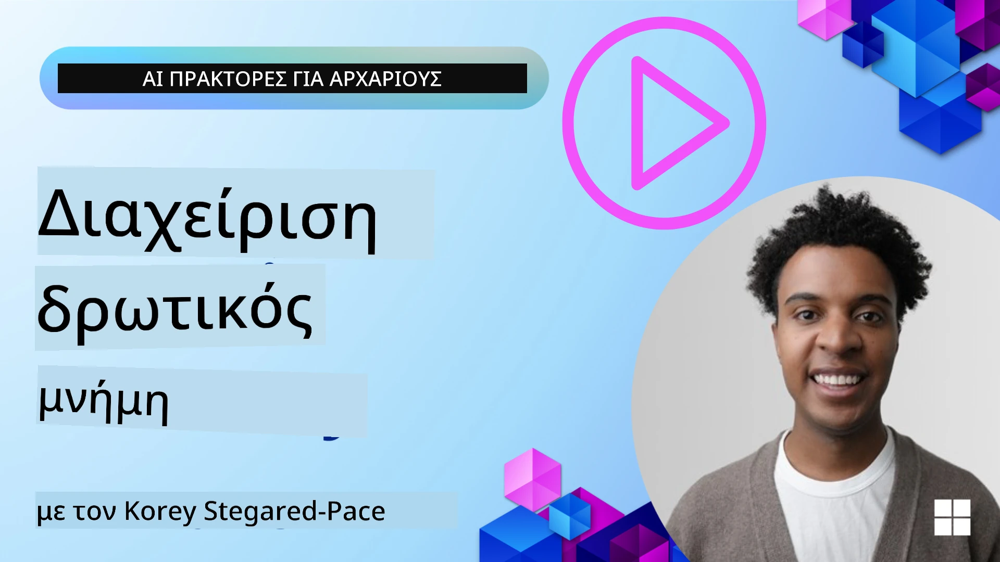

# Μνήμη για Πράκτορες Τεχνητής Νοημοσύνης  

Όταν συζητούμε τα μοναδικά οφέλη της δημιουργίας Πρακτόρων Τεχνητής Νοημοσύνης, δύο πράγματα αναφέρονται κυρίως: η ικανότητα χρήσης εργαλείων για την ολοκλήρωση εργασιών και η ικανότητα βελτίωσης με την πάροδο του χρόνου. Η μνήμη είναι η βάση για τη δημιουργία ενός πρακτορα που αυτοβελτιώνεται και μπορεί να δημιουργεί καλύτερες εμπειρίες για τους χρήστες μας.

Σε αυτό το μάθημα, θα δούμε τι είναι η μνήμη για τους Πράκτορες Τεχνητής Νοημοσύνης και πώς μπορούμε να τη διαχειριστούμε και να τη χρησιμοποιήσουμε προς όφελος των εφαρμογών μας.

## Εισαγωγή

Αυτό το μάθημα θα καλύψει:

• **Κατανόηση της μνήμης του Πράκτορα Τεχνητής Νοημοσύνης**: Τι είναι η μνήμη και γιατί είναι απαραίτητη για τους πράκτορες.

• **Υλοποίηση και αποθήκευση μνήμης**: Πρακτικές μέθοδοι προσθήκης δυνατοτήτων μνήμης στους πράκτορες AI, με έμφαση στη βραχυπρόθεσμη και μακροπρόθεσμη μνήμη.

• **Κάνοντας τους Πράκτορες Τεχνητής Νοημοσύνης να αυτοβελτιώνονται**: Πώς η μνήμη επιτρέπει στους πράκτορες να μαθαίνουν από προηγούμενες αλληλεπιδράσεις και να βελτιώνονται με τον χρόνο.

## Διαθέσιμες Υλοποιήσεις

Αυτό το μάθημα περιλαμβάνει δύο ολοκληρωμένα tutorial σε σημειωματάρια:

• **[13-agent-memory.ipynb](./13-agent-memory.ipynb)**: Υλοποιεί μνήμη χρησιμοποιώντας Mem0 και Azure AI Search με το Microsoft Agent Framework

• **[13-agent-memory-cognee.ipynb](./13-agent-memory-cognee.ipynb)**: Υλοποιεί δομημένη μνήμη με Cognee, αυτόματα δημιουργώντας γράφο γνώσης υποστηριζόμενο από ενσωματώσεις, οπτικοποιώντας το γράφο και προσφέροντας έξυπνες ανακτήσεις

## Στόχοι Μάθησης

Μετά την ολοκλήρωση αυτού του μαθήματος, θα γνωρίζετε πώς να:

• **Διακρίνετε μεταξύ των διαφόρων τύπων μνήμης πρακτόρων Τεχνητής Νοημοσύνης**, συμπεριλαμβανομένης της εργασιακής, βραχυπρόθεσμης και μακροπρόθεσμης μνήμης, καθώς και εξειδικευμένων μορφών όπως η μνήμη προσωπικότητας και η επεισοδιακή μνήμη.

• **Υλοποιείτε και διαχειρίζεστε τη βραχυπρόθεσμη και μακροπρόθεσμη μνήμη για πράκτορες AI** χρησιμοποιώντας το Microsoft Agent Framework, αξιοποιώντας εργαλεία όπως Mem0, Cognee, Whiteboard memory, και ενσωματώνοντας με το Azure AI Search.

• **Κατανοείτε τις αρχές πίσω από τους πράκτορες AI που αυτοβελτιώνονται** και πώς τα ανθεκτικά συστήματα διαχείρισης μνήμης συμβάλλουν στη συνεχή μάθηση και προσαρμογή.

## Κατανόηση της Μνήμης Πράκτορα AI

Στον πυρήνα της, **η μνήμη για πράκτορες AI αναφέρεται στους μηχανισμούς που τους επιτρέπουν να διατηρούν και να ανακαλούν πληροφορίες**. Αυτές οι πληροφορίες μπορεί να είναι συγκεκριμένες λεπτομέρειες για μια συνομιλία, προτιμήσεις χρήστη, προηγούμενες ενέργειες ή ακόμη και μάθηση προτύπων.

Χωρίς μνήμη, οι εφαρμογές Τεχνητής Νοημοσύνης είναι συχνά χωρίς κατάσταση (stateless), που σημαίνει ότι κάθε αλληλεπίδραση ξεκινά από την αρχή. Αυτό οδηγεί σε μια επαναλαμβανόμενη και απογοητευτική εμπειρία χρήστη όπου ο πράκτορας "ξεχνά" το προηγούμενο πλαίσιο ή τις προτιμήσεις.

### Γιατί είναι σημαντική η Μνήμη;

Η ευφυΐα ενός πράκτορα είναι βαθιά δεμένη με την ικανότητά του να ανακαλεί και να χρησιμοποιεί προηγούμενες πληροφορίες. Η μνήμη επιτρέπει στους πράκτορες να είναι:

• **Αναστοχαστικοί**: Μαθαίνοντας από προηγούμενες ενέργειες και αποτελέσματα.

• **Διαδραστικοί**: Διατηρώντας το πλαίσιο σε μια συνεχιζόμενη συνομιλία.

• **Προληπτικοί και Αντιδραστικοί**: Προβλέποντας ανάγκες ή ανταποκρινόμενοι κατάλληλα βάσει ιστορικών δεδομένων.

• **Αυτόνομοι**: Λειτουργώντας πιο ανεξάρτητα αντλώντας γνώση που έχει αποθηκευτεί.

Ο στόχος της υλοποίησης μνήμης είναι να κάνει τους πράκτορες πιο **αξιόπιστους και ικανούς**.

### Τύποι Μνήμης

#### Εργασιακή Μνήμη

Σκεφτείτε την ως ένα κομμάτι χαρτί όπου ο πράκτορας κρατά πληροφορίες κατά τη διάρκεια μιας τρέχουσας εργασίας ή σκέψης. Κρατά άμεσες πληροφορίες που χρειάζονται για να υπολογιστεί το επόμενο βήμα.

Για τους πράκτορες AI, η εργασιακή μνήμη συχνά αποτυπώνει τις πιο σχετικές πληροφορίες από μια συνομιλία, ακόμα κι αν το πλήρες ιστορικό συνομιλίας είναι μεγάλο ή περικομμένο. Επικεντρώνεται στην εξαγωγή βασικών στοιχείων όπως απαιτήσεις, προτάσεις, αποφάσεις και ενέργειες.

**Παράδειγμα Εργασιακής Μνήμης**

Σε έναν πράκτορα κρατήσεων ταξιδιών, η εργασιακή μνήμη μπορεί να αποτυπώσει το τρέχον αίτημα του χρήστη, όπως "Θέλω να κλείσω ένα ταξίδι στο Παρίσι". Αυτή η συγκεκριμένη απαίτηση κρατείται στο άμεσο πλαίσιο του πράκτορα για να καθοδηγήσει την τρέχουσα αλληλεπίδραση.

#### Βραχυπρόθεσμη Μνήμη

Αυτός ο τύπος μνήμης διατηρεί πληροφορίες για τη διάρκεια μιας ενιαίας συνομιλίας ή συνεδρίας. Είναι το πλαίσιο της τρέχουσας συνομιλίας, επιτρέποντας στον πράκτορα να αναφέρεται σε προηγούμενες ανταλλαγές διαλόγου.

Στα παραδείγματα του Python SDK του [Microsoft Agent Framework](https://github.com/microsoft/agent-framework), αυτό αντιστοιχεί στο `AgentSession`, που δημιουργείται με `agent.create_session()`. Η συνεδρία είναι η ενσωματωμένη βραχυπρόθεσμη μνήμη του framework: κρατά το πλαίσιο συνομιλίας διαθέσιμο όσο η ίδια συνεδρία επαναχρησιμοποιείται, αλλά αυτό το πλαίσιο δεν διατηρείται όταν η συνεδρία τελειώνει ή η εφαρμογή επανεκκινείται. Χρησιμοποιήστε μακροπρόθεσμη μνήμη για γεγονότα και προτιμήσεις που πρέπει να επιβιώσουν ανάμεσα σε συνεδρίες, συνήθως μέσω βάσης δεδομένων, ευρετηρίου διανυσμάτων ή άλλου επίμονου αποθηκευτικού μέσου.

**Παράδειγμα Βραχυπρόθεσμης Μνήμης**

Εάν ένας χρήστης ρωτά, "Πόσο κοστίζει μια πτήση για το Παρίσι;" και στη συνέχεια συνεχίζει με "Τι γίνεται με τη διαμονή εκεί;", η βραχυπρόθεσμη μνήμη εξασφαλίζει ότι ο πράκτορας γνωρίζει πως το "εκεί" αναφέρεται στο "Παρίσι" μέσα στην ίδια συνομιλία.

#### Μακροπρόθεσμη Μνήμη

Αυτές είναι πληροφορίες που παραμένουν διαθέσιμες μέσω πολλαπλών συνομιλιών ή συνεδριών. Επιτρέπει στους πράκτορες να θυμούνται τις προτιμήσεις χρήστη, ιστορικές αλληλεπιδράσεις ή γενικές γνώσεις για μεγάλες χρονικές περιόδους. Αυτό είναι σημαντικό για την εξατομίκευση.

**Παράδειγμα Μακροπρόθεσμης Μνήμης**

Η μακροπρόθεσμη μνήμη μπορεί να αποθηκεύει ότι "ο Ben απολαμβάνει το σκι και τις υπαίθριες δραστηριότητες, του αρέσει ο καφές με θέα το βουνό και θέλει να αποφύγει τις προχωρημένες πίστες σκι λόγω ενός παλιού τραυματισμού". Αυτές οι πληροφορίες, που έχουν μάθει από προηγούμενες αλληλεπιδράσεις, επηρεάζουν τις προτάσεις σε μελλοντικές συνεδρίες σχεδιασμού ταξιδιών, κάνοντάς τες πολύ πιο εξατομικευμένες.

#### Μνήμη Προσωπικότητας

Αυτός ο εξειδικευμένος τύπος μνήμης βοηθά έναν πράκτορα να αναπτύξει μια συνεπή "προσωπικότητα" ή "ρόλο". Επιτρέπει στον πράκτορα να θυμάται λεπτομέρειες για τον εαυτό του ή τον προοριζόμενο ρόλο του, κάνοντας τις αλληλεπιδράσεις πιο ρευστές και εστιασμένες.

**Παράδειγμα Μνήμης Προσωπικότητας**

Αν ο ταξιδιωτικός πράκτορας έχει σχεδιαστεί ως "ειδικός σχεδιαστής σκι", η μνήμη προσωπικότητας μπορεί να ενισχύσει αυτόν τον ρόλο, επηρεάζοντας τις απαντήσεις του ώστε να ευθυγραμμίζονται με τον τόνο και τη γνώση ενός ειδικού.

#### Μνήμη Ροής Εργασίας / Επεισοδιακή Μνήμη

Αυτή η μνήμη αποθηκεύει τη σειρά των βημάτων που εκτελεί ένας πράκτορας κατά τη διάρκεια μιας σύνθετης εργασίας, συμπεριλαμβανομένων των επιτυχιών και αποτυχιών. Είναι σαν να θυμάται συγκεκριμένα "επεισόδια" ή παρελθοντικές εμπειρίες για να μάθει από αυτά.

**Παράδειγμα Επεισοδιακής Μνήμης**

Αν ο πράκτορας προσπάθησε να κλείσει μια συγκεκριμένη πτήση αλλά απέτυχε λόγω μη διαθεσιμότητας, η επεισοδιακή μνήμη μπορεί να καταγράψει αυτή την αποτυχία, επιτρέποντας στον πράκτορα να δοκιμάσει εναλλακτικές πτήσεις ή να ενημερώσει τον χρήστη σχετικά με το ζήτημα με πιο ενημερωμένο τρόπο σε επόμενη προσπάθεια.

#### Μνήμη Οντοτήτων

Αυτή εμπλέκει την εξαγωγή και απομνημόνευση συγκεκριμένων οντοτήτων (όπως πρόσωπα, μέρη ή πράγματα) και γεγονότων από συνομιλίες. Επιτρέπει στον πράκτορα να δημιουργεί μια δομημένη κατανόηση βασικών στοιχείων που συζητήθηκαν.

**Παράδειγμα Μνήμης Οντοτήτων**

Από μια συνομιλία για ένα παλιό ταξίδι, ο πράκτορας μπορεί να εξάγει τις οντότητες "Παρίσι", "Πύργος του Άιφελ" και "δείπνο στο εστιατόριο Le Chat Noir". Σε μια μελλοντική αλληλεπίδραση, μπορεί να θυμηθεί το "Le Chat Noir" και να προσφέρει να κάνει μια νέα κράτηση εκεί.

#### Δομημένο RAG (Αύξηση Γεννητικής Ανάκτησης)

Ενώ το RAG είναι μια ευρύτερη τεχνική, το "Δομημένο RAG" αναδεικνύεται ως ισχυρή τεχνολογία μνήμης. Εξάγει πυκνές, δομημένες πληροφορίες από διάφορες πηγές (συνομιλίες, email, εικόνες) και τις χρησιμοποιεί για να βελτιώσει την ακρίβεια, την ανάκτηση και την ταχύτητα στις απαντήσεις. Σε αντίθεση με το κλασικό RAG που βασίζεται αποκλειστικά στη σημασιολογική ομοιότητα, το Δομημένο RAG λειτουργεί με την εγγενή δομή της πληροφορίας.

**Παράδειγμα Δομημένου RAG**

Αντί να αντιστοιχίζει απλώς λέξεις-κλειδιά, το Δομημένο RAG μπορεί να αναλύσει λεπτομέρειες πτήσης (προορισμός, ημερομηνία, ώρα, αεροπορική εταιρεία) από ένα email και να τις αποθηκεύσει δομημένα. Αυτό επιτρέπει στοχευμένες ερωτήσεις όπως "Ποια πτήση έκλεισα για το Παρίσι την Τρίτη;"

## Υλοποίηση και Αποθήκευση Μνήμης

Η υλοποίηση μνήμης για πράκτορες AI περιλαμβάνει μια συστηματική διαδικασία **διαχείρισης μνήμης**, που περιλαμβάνει τη δημιουργία, αποθήκευση, ανάκτηση, ενσωμάτωση, ενημέρωση και ακόμη και "λήθη" (ή διαγραφή) πληροφοριών. Η ανάκτηση είναι ένα ιδιαίτερα κρίσιμο στοιχείο.

### Εξειδικευμένα Εργαλεία Μνήμης

#### Mem0

Ένας τρόπος αποθήκευσης και διαχείρισης μνήμης πρακτόρων είναι το ειδικευμένο εργαλείο Mem0. Το Mem0 λειτουργεί ως επίμονο επίπεδο μνήμης, επιτρέποντας στους πράκτορες να ανακαλούν σημαντικές αλληλεπιδράσεις, να αποθηκεύουν προτιμήσεις χρήστη και πραγματικό πλαίσιο, καθώς και να μαθαίνουν από επιτυχίες και αποτυχίες με την πάροδο του χρόνου. Η ιδέα εδώ είναι ότι οι πράκτορες χωρίς κατάσταση γίνονται καταστασιακοί.

Λειτουργεί μέσω μιας **διφασικής ροής μνήμης: εξαγωγή και ενημέρωση**. Αρχικά, τα μηνύματα που προστίθενται σε ένα νήμα πράκτορα αποστέλλονται στην υπηρεσία Mem0, η οποία χρησιμοποιεί ένα Μεγάλο Γλωσσικό Μοντέλο (LLM) για να συνοψίσει το ιστορικό συνομιλίας και να εξάγει νέες μνήμες. Στη συνέχεια, μια φάση ενημέρωσης που ελέγχεται από LLM καθορίζει αν θα προστεθούν, τροποποιηθούν ή διαγραφούν αυτές οι μνήμες, αποθηκεύοντάς τις σε υβριδική βάση δεδομένων που μπορεί να περιλαμβάνει βάσεις διανυσμάτων, γράφων και ζεύξης-τιμών. Το σύστημα υποστηρίζει επίσης διάφορους τύπους μνήμης και μπορεί να ενσωματώσει μνήμη γράφου για τη διαχείριση σχέσεων μεταξύ οντοτήτων.

#### Cognee

Μια άλλη ισχυρή προσέγγιση είναι η χρήση του **Cognee**, μιας ανοικτού κώδικα σημασιολογικής μνήμης για πράκτορες AI που μετατρέπει δομημένα και αδόμητα δεδομένα σε γράφους γνώσης με δυνατότητα ερωτηματολογίου, υποστηριζόμενη από ενσωματώσεις. Το Cognee παρέχει μια **διπλή αποθήκη** που συνδυάζει την αναζήτηση ομοιότητας διανυσμάτων με τις σχέσεις γράφου, επιτρέποντας στους πράκτορες να κατανοούν όχι μόνο ποια πληροφορία είναι παρόμοια, αλλά και πώς συνδέονται μεταξύ τους οι έννοιες.

Ξεχωρίζει στην **υβριδική ανάκτηση** που συνδυάζει ομοιότητα διανυσμάτων, δομή γράφου και συλλογισμό LLM - από την αναζήτηση στοιχείων σε αποσπάσματα μέχρι τις ερωτήσεις συνειδητοποίησης γράφου. Το σύστημα διατηρεί μια **ζωντανή μνήμη** που εξελίσσεται και αυξάνεται, ενώ παραμένει ερωτήσιμη ως ένας ενιαίος γράφος, υποστηρίζοντας τόσο το πλαίσιο συνεδρίας βραχυπρόθεσμα όσο και την επίμονη μνήμη μακροπρόθεσμα.

Το tutorial σημειωματάριο Cognee ([13-agent-memory-cognee.ipynb](./13-agent-memory-cognee.ipynb)) παρουσιάζει τη δημιουργία αυτής της ενοποιημένης στρώσης μνήμης, με πρακτικά παραδείγματα εισαγωγής ποικίλων πηγών δεδομένων, οπτικοποίησης του γράφου γνώσης και εκτέλεσης ερωτημάτων με διαφορετικές στρατηγικές αναζήτησης προσαρμοσμένες στις ανάγκες του πράκτορα.

### Αποθήκευση Μνήμης με RAG

Πέρα από εξειδικευμένα εργαλεία μνήμης όπως το Mem0, μπορείτε να αξιοποιήσετε ισχυρές υπηρεσίες αναζήτησης όπως το **Azure AI Search ως backend για την αποθήκευση και ανάκτηση μνημών**, ειδικά για το δομημένο RAG.

Αυτό σας επιτρέπει να βασίζετε τις απαντήσεις του πράκτορά σας στα δικά σας δεδομένα, εξασφαλίζοντας πιο σχετικές και ακριβείς απαντήσεις. Το Azure AI Search μπορεί να χρησιμοποιηθεί για την αποθήκευση εξατομικευμένων μνημών ταξιδιών χρηστών, καταλόγων προϊόντων ή οποιασδήποτε άλλης γνώσης συγκεκριμένης περιοχής.

Το Azure AI Search υποστηρίζει δυνατότητες όπως το **Δομημένο RAG**, που ξεχωρίζει στην εξαγωγή και ανάκτηση πυκνών, δομημένων πληροφοριών από μεγάλα σύνολα δεδομένων όπως ιστορικά συνομιλιών, email ή ακόμα και εικόνες. Αυτό παρέχει "υπερανθρώπινη ακρίβεια και ανάκληση" σε σύγκριση με τις παραδοσιακές μεθόδους τεμαχισμού κειμένου και ενσωμάτωσης.

## Κάνοντας τους Πράκτορες AI να Αυτοβελτιώνονται

Ένα συνηθισμένο μοτίβο για πράκτορες που αυτοβελτιώνονται περιλαμβάνει την εισαγωγή ενός **"πράκτορα γνώσης"**. Αυτός ο ξεχωριστός πράκτορας παρακολουθεί την κύρια συνομιλία μεταξύ χρήστη και πρωτεύοντα πράκτορα. Ο ρόλος του είναι να:

1. **Εντοπίζει πολύτιμες πληροφορίες**: Καθορίζει αν κάποιο μέρος της συνομιλίας αξίζει να αποθηκευτεί ως γενική γνώση ή συγκεκριμένη προτίμηση χρήστη.

2. **Εξάγει και συνοψίζει**: Συλλέγει την ουσιώδη μάθηση ή προτίμηση από τη συνομιλία.

3. **Αποθηκεύει σε βάση γνώσης**: Καταγράφει αυτή την εξαγμένη πληροφορία, συχνά σε βάση δεδομένων διανυσμάτων, ώστε να μπορεί να ανακληθεί αργότερα.

4. **Εμπλουτίζει μελλοντικά ερωτήματα**: Όταν ο χρήστης ξεκινά ένα νέο ερώτημα, ο πράκτορας γνώσης αναζητά σχετικές αποθηκευμένες πληροφορίες και τις προσθέτει στο prompt του χρήστη, παρέχοντας κρίσιμο πλαίσιο στον πρωτεύοντα πράκτορα (παρόμοιο με το RAG).

### Βελτιστοποιήσεις για Μνήμη

• **Διαχείριση Καθυστέρησης**: Για να αποφευχθεί η επιβράδυνση της αλληλεπίδρασης με τον χρήστη, μπορεί αρχικά να χρησιμοποιηθεί ένα πιο φθηνό και γρήγορο μοντέλο που ελέγχει γρήγορα αν η πληροφορία αξίζει να αποθηκευτεί ή να ανακτηθεί, καλώντας τη πιο σύνθετη διαδικασία εξαγωγής/ανάκτησης μόνο όταν είναι απαραίτητο.

• **Συντήρηση Βάσης Γνώσης**: Για μια αυξανόμενη βάση γνώσης, οι λιγότερο χρησιμοποιούμενες πληροφορίες μπορούν να μεταφερθούν σε "ψυχρή αποθήκευση" για τη διαχείριση κόστους.

## Έχετε Περισσότερες Ερωτήσεις για τη Μνήμη Πράκτορα;

Εγγραφείτε στο [Microsoft Foundry Discord](https://discord.com/invite/ATgtXmAS5D) για να συναντήσετε άλλους μαθητές, να παρακολουθήσετε ώρες γραφείου και να λάβετε απαντήσεις στις ερωτήσεις σας σχετικά με τους Πράκτορες AI.

---

<!-- CO-OP TRANSLATOR DISCLAIMER START -->
**Αποποίηση ευθυνών**:
Αυτό το έγγραφο έχει μεταφραστεί χρησιμοποιώντας την υπηρεσία μετάφρασης με τεχνητή νοημοσύνη [Co-op Translator](https://github.com/Azure/co-op-translator). Ενώ επιδιώκουμε την ακρίβεια, παρακαλούμε να έχετε υπόψη ότι οι αυτοματοποιημένες μεταφράσεις ενδέχεται να περιέχουν λάθη ή ανακρίβειες. Το πρωτότυπο έγγραφο στη μητρική του γλώσσα πρέπει να θεωρείται η αυθεντική πηγή. Για κρίσιμες πληροφορίες, συνιστάται επαγγελματική ανθρώπινη μετάφραση. Δεν φέρουμε ευθύνη για τυχόν παρεξηγήσεις ή λανθασμένες ερμηνείες που προκύπτουν από τη χρήση αυτής της μετάφρασης.
<!-- CO-OP TRANSLATOR DISCLAIMER END -->