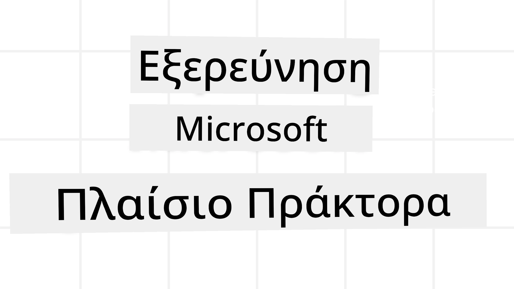
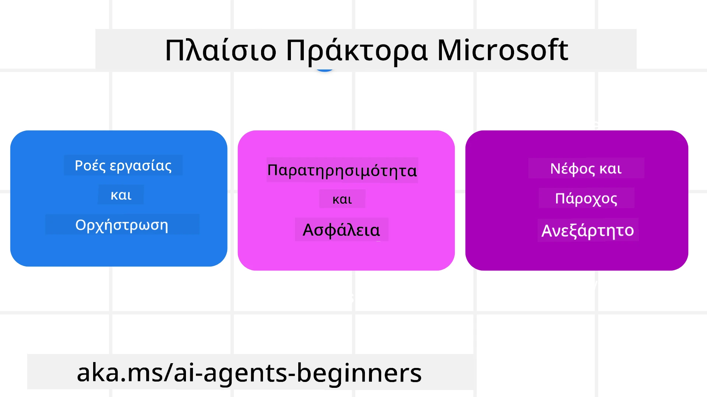

# Εξερευνώντας το Πλαίσιο Microsoft Agent



### Εισαγωγή

Αυτό το μάθημα θα καλύψει:

- Κατανόηση του Microsoft Agent Framework: Κύρια Χαρακτηριστικά και Αξία  
- Εξερεύνηση των Κύριων Εννοιών του Microsoft Agent Framework
- Προηγμένα MAF Πρότυπα: Ροές εργασίας, μεσολάβηση και μνήμη

## Στόχοι Μάθησης

Μετά την ολοκλήρωση αυτού του μαθήματος, θα γνωρίζετε πώς να:

- Δημιουργείτε Παραγωγικούς Έτοιμους AI Agents χρησιμοποιώντας το Microsoft Agent Framework
- Εφαρμόζετε τα βασικά χαρακτηριστικά του Microsoft Agent Framework στις περιπτώσεις χρήσης σας για agents
- Χρησιμοποιείτε προηγμένα πρότυπα όπως ροές εργασίας, μεσολάβηση και παρατηρησιμότητα

## Παραδείγματα Κώδικα

Παραδείγματα κώδικα για το [Microsoft Agent Framework (MAF)](https://aka.ms/ai-agents-beginners/agent-framewrok) μπορείτε να βρείτε σε αυτό το αποθετήριο στα αρχεία `xx-python-agent-framework` και `xx-dotnet-agent-framework`.

## Κατανόηση του Microsoft Agent Framework



Το [Microsoft Agent Framework (MAF)](https://aka.ms/ai-agents-beginners/agent-framewrok) είναι το ενοποιημένο πλαίσιο της Microsoft για τη δημιουργία AI agents. Προσφέρει την ευελιξία να ανταποκριθεί στην ποικιλία των περιπτώσεων χρήσης agents που βλέπουμε τόσο σε παραγωγικά όσο και σε ερευνητικά περιβάλλοντα, συμπεριλαμβανομένων:

- **Αλληλουχία Ορχήστρωσης Agents** σε σενάρια όπου απαιτούνται ροές εργασίας βήμα-βήμα.
- **Ταυτόχρονη ορχήστρωση** σε σενάρια όπου οι agents πρέπει να ολοκληρώσουν εργασίες ταυτόχρονα.
- **Ορχήστρωση ομαδικής συνομιλίας** σε σενάρια όπου οι agents μπορούν να συνεργαστούν για μία εργασία.
- **Ορχήστρωση παράδοσης** σε σενάρια όπου οι agents παραδίδουν την εργασία ο ένας στον άλλο καθώς ολοκληρώνονται οι υποεργασίες.
- **Μαγνητική Ορχήστρωση** σε σενάρια όπου ένας διαχειριστής agent δημιουργεί και τροποποιεί μια λίστα εργασιών και χειρίζεται το συντονισμό των υποagents για την ολοκλήρωση της εργασίας.

Για την παράδοση AI Agents σε παραγωγή, το MAF περιλαμβάνει επίσης χαρακτηριστικά για:

- **Παρατηρησιμότητα** μέσω της χρήσης OpenTelemetry όπου κάθε ενέργεια του AI Agent συμπεριλαμβανομένης της κλήσης εργαλείων, βημάτων ορχήστρωσης, ροών λογικής και παρακολούθησης απόδοσης γίνεται μέσω των ταμπλό Microsoft Foundry.
- **Ασφάλεια** με τη φιλοξενία των agents εγγενώς στο Microsoft Foundry που περιλαμβάνει ελέγχους ασφαλείας όπως έλεγχο πρόσβασης βάσει ρόλων, διαχείριση ιδιωτικών δεδομένων και ενσωματωμένη ασφάλεια περιεχομένου.
- **Ανθεκτικότητα** καθώς τα νήματα agents και οι ροές εργασίας μπορούν να παύουν, να ξαναρχίζουν και να αναρρώνουν από σφάλματα, επιτρέποντας μακροχρόνιες διαδικασίες.
- **Έλεγχος** καθώς υποστηρίζονται ροές εργασίας ανθρώπου στον βρόχο όπου οι εργασίες σημειώνονται ως απαιτούμενες για ανθρώπινη έγκριση.

Το Microsoft Agent Framework εστιάζει επίσης στην διαλειτουργικότητα μέσω:

- **Ανεξαρτησίας από το νέφος** - Οι agents μπορούν να τρέξουν σε κοντέινερ, on-premises και σε πολλαπλά νέφη.
- **Ανεξαρτησίας παρόχου** - Οι agents μπορούν να δημιουργηθούν μέσω του προτιμώμενου SDK σας, συμπεριλαμβανομένων Azure OpenAI και OpenAI.
- **Ενσωμάτωσης Ανοικτών Προτύπων** - Οι agents μπορούν να χρησιμοποιήσουν πρωτόκολλα όπως Agent-to-Agent (A2A) και Model Context Protocol (MCP) για να ανακαλύψουν και να χρησιμοποιήσουν άλλους agents και εργαλεία.
- **Πρόσθετα και Συνδέσεις** - Μπορούν να γίνουν συνδέσεις με υπηρεσίες δεδομένων και μνήμης όπως Microsoft Fabric, SharePoint, Pinecone και Qdrant.

Ας δούμε πώς αυτά τα χαρακτηριστικά εφαρμόζονται σε μερικές από τις βασικές έννοιες του Microsoft Agent Framework.

## Κύριες Έννοιες του Microsoft Agent Framework

### Agents


**Δημιουργία Agents**

Η δημιουργία agent γίνεται με τον ορισμό της υπηρεσίας συμπεράσματος (LLM Provider), ενός συνόλου εντολών για τον AI Agent να ακολουθήσει, και ενός εκχωρημένου `name`:

```python
agent = AzureOpenAIChatClient(credential=AzureCliCredential()).create_agent( instructions="You are good at recommending trips to customers based on their preferences.", name="TripRecommender" )
```

Το παραπάνω χρησιμοποιεί το `Azure OpenAI` αλλά οι agents μπορούν να δημιουργηθούν χρησιμοποιώντας μια ποικιλία υπηρεσιών συμπεριλαμβανομένου του `Microsoft Foundry Agent Service`:

```python
AzureAIAgentClient(async_credential=credential).create_agent( name="HelperAgent", instructions="You are a helpful assistant." ) as agent
```

APIs OpenAI `Responses`, `ChatCompletion`

```python
agent = OpenAIResponsesClient().create_agent( name="WeatherBot", instructions="You are a helpful weather assistant.", )
```

```python
agent = OpenAIChatClient().create_agent( name="HelpfulAssistant", instructions="You are a helpful assistant.", )
```

ή απομακρυσμένοι agents χρησιμοποιώντας το πρωτόκολλο A2A:

```python
agent = A2AAgent( name=agent_card.name, description=agent_card.description, agent_card=agent_card, url="https://your-a2a-agent-host" )
```

**Λειτουργία Agents**

Οι agents τρέχουν με τις μεθόδους `.run` ή `.run_stream` για είτε μη ροής είτε ροής απαντήσεων.

```python
result = await agent.run("What are good places to visit in Amsterdam?")
print(result.text)
```

```python
async for update in agent.run_stream("What are the good places to visit in Amsterdam?"):
    if update.text:
        print(update.text, end="", flush=True)

```

Κάθε εκτέλεση agent μπορεί επίσης να έχει επιλογές για να προσαρμόσει παραμέτρους όπως `max_tokens` που χρησιμοποιεί ο agent, τα `tools` που ο agent μπορεί να καλέσει, και ακόμα και το ίδιο το `model` που χρησιμοποιείται από τον agent.

Αυτό είναι χρήσιμο σε περιπτώσεις όπου απαιτούνται συγκεκριμένα μοντέλα ή εργαλεία για την ολοκλήρωση της εργασίας του χρήστη.

**Εργαλεία**

Τα εργαλεία μπορούν να οριστούν τόσο κατά τον ορισμό του agent:

```python
def get_attractions( location: Annotated[str, Field(description="The location to get the top tourist attractions for")], ) -> str: """Get the top tourist attractions for a given location.""" return f"The top attractions for {location} are." 


# Όταν δημιουργείτε έναν ChatAgent απευθείας

agent = ChatAgent( chat_client=OpenAIChatClient(), instructions="You are a helpful assistant", tools=[get_attractions]

```

όσο και κατά την εκτέλεση του agent:

```python

result1 = await agent.run( "What's the best place to visit in Seattle?", tools=[get_attractions] # Εργαλείο διαθέσιμο μόνο για αυτήν την εκτέλεση )
```

**Νήματα Agent**

Τα νήματα agent χρησιμοποιούνται για τη διαχείριση συνομιλιών πολλαπλών γύρων. Τα νήματα μπορούν να δημιουργηθούν είτε με:

- Χρήση `get_new_thread()` που επιτρέπει την αποθήκευση του νήματος με την πάροδο του χρόνου
- Αυτόματη δημιουργία νήματος κατά την εκτέλεση ενός agent και το νήμα να διαρκεί μόνο κατά τη διάρκεια της τρέχουσας εκτέλεσης.

Για να δημιουργήσετε ένα νήμα, ο κώδικας μοιάζει ως εξής:

```python
# Δημιουργήστε ένα νέο νήμα.
thread = agent.get_new_thread() # Εκτελέστε τον πράκτορα με το νήμα.
response = await agent.run("Hello, I am here to help you book travel. Where would you like to go?", thread=thread)

```

Στη συνέχεια μπορείτε να σειριοποιήσετε το νήμα για να αποθηκευτεί για μελλοντική χρήση:

```python
# Δημιουργήστε ένα νέο νήμα.
thread = agent.get_new_thread() 

# Εκτελέστε τον πράκτορα με το νήμα.

response = await agent.run("Hello, how are you?", thread=thread) 

# Σειριοποιήστε το νήμα για αποθήκευση.

serialized_thread = await thread.serialize() 

# Αποσειριοποιήστε την κατάσταση του νήματος μετά τη φόρτωση από την αποθήκευση.

resumed_thread = await agent.deserialize_thread(serialized_thread)
```

**Μεσολάβηση Agent**

Οι agents αλληλεπιδρούν με εργαλεία και LLMs για να ολοκληρώσουν τις εργασίες των χρηστών. Σε ορισμένα σενάρια, θέλουμε να εκτελέσουμε ή να παρακολουθήσουμε ενέργειες ανάμεσα σε αυτές τις αλληλεπιδράσεις. Η μεσολάβηση agent μας επιτρέπει να το κάνουμε αυτό μέσω:

*Μεσολάβηση Συνάρτησης*

Αυτή η μεσολάβηση επιτρέπει την εκτέλεση μιας ενέργειας ανάμεσα στον agent και μια συνάρτηση/εργαλείο που θα καλέσει. Ένα παράδειγμα χρήσης είναι όταν θέλετε να κάνετε κάποια καταγραφή στη κλήση της συνάρτησης.

Στον κώδικα παρακάτω το `next` ορίζει αν θα κληθεί η επόμενη μεσολάβηση ή η πραγματική συνάρτηση.

```python
async def logging_function_middleware(
    context: FunctionInvocationContext,
    next: Callable[[FunctionInvocationContext], Awaitable[None]],
) -> None:
    """Function middleware that logs function execution."""
    # Προεπεξεργασία: Καταγραφή πριν από την εκτέλεση της συνάρτησης
    print(f"[Function] Calling {context.function.name}")

    # Συνέχεια στο επόμενο middleware ή εκτέλεση της συνάρτησης
    await next(context)

    # Μεταεπεξεργασία: Καταγραφή μετά την εκτέλεση της συνάρτησης
    print(f"[Function] {context.function.name} completed")
```

*Μεσολάβηση Συνομιλίας*

Αυτή η μεσολάβηση επιτρέπει την εκτέλεση ή καταγραφή μιας ενέργειας ανάμεσα στον agent και τα αιτήματα προς το LLM.

Περιέχει σημαντικές πληροφορίες όπως τα `messages` που αποστέλλονται στην υπηρεσία AI.

```python
async def logging_chat_middleware(
    context: ChatContext,
    next: Callable[[ChatContext], Awaitable[None]],
) -> None:
    """Chat middleware that logs AI interactions."""
    # Προεπεξεργασία: Καταγραφή πριν από την κλήση AI
    print(f"[Chat] Sending {len(context.messages)} messages to AI")

    # Συνέχεια στον επόμενο ενδιάμεσο ή υπηρεσία AI
    await next(context)

    # Μεταεπεξεργασία: Καταγραφή μετά την απόκριση AI
    print("[Chat] AI response received")

```

**Μνήμη Agent**

Όπως καλύπτεται στο μάθημα `Agentic Memory`, η μνήμη είναι σημαντικό στοιχείο για να επιτρέπει στον agent να λειτουργεί σε διαφορετικά συμφραζόμενα. Το MAF προσφέρει διαφορετικούς τύπους μνήμης:

*Αποθήκευση στη μνήμη (In-Memory Storage)*

Αυτή είναι η μνήμη που αποθηκεύεται σε νήματα κατά τη διάρκεια της εκτέλεσης της εφαρμογής.

```python
# Δημιουργήστε ένα νέο νήμα.
thread = agent.get_new_thread() # Τρέξτε τον πράκτορα με το νήμα.
response = await agent.run("Hello, I am here to help you book travel. Where would you like to go?", thread=thread)
```

*Διαρκή Μηνύματα (Persistent Messages)*

Αυτή η μνήμη χρησιμοποιείται για την αποθήκευση ιστορικού συνομιλίας μεταξύ διαφορετικών συνεδριών. Ορίζεται με το `chat_message_store_factory` :

```python
from agent_framework import ChatMessageStore

# Δημιουργήστε ένα προσαρμοσμένο κατάστημα μηνυμάτων
def create_message_store():
    return ChatMessageStore()

agent = ChatAgent(
    chat_client=OpenAIChatClient(),
    instructions="You are a Travel assistant.",
    chat_message_store_factory=create_message_store
)

```

*Δυναμική Μνήμη*

Αυτή η μνήμη προστίθεται στο πλαίσιο πριν τρέξουν οι agents. Αυτές οι μνήμες μπορούν να αποθηκευτούν σε εξωτερικές υπηρεσίες όπως το mem0:

```python
from agent_framework.mem0 import Mem0Provider

# Χρήση του Mem0 για προηγμένες δυνατότητες μνήμης
memory_provider = Mem0Provider(
    api_key="your-mem0-api-key",
    user_id="user_123",
    application_id="my_app"
)

agent = ChatAgent(
    chat_client=OpenAIChatClient(),
    instructions="You are a helpful assistant with memory.",
    context_providers=memory_provider
)

```

**Παρατηρησιμότητα Agent**

Η παρατηρησιμότητα είναι σημαντική για την κατασκευή αξιόπιστων και συντηρήσιμων συστημάτων με agents. Το MAF ενσωματώνεται με το OpenTelemetry για παροχή ιχνηλάτησης και μετρητών για καλύτερη παρατηρησιμότητα.

```python
from agent_framework.observability import get_tracer, get_meter

tracer = get_tracer()
meter = get_meter()
with tracer.start_as_current_span("my_custom_span"):
    # κάνε κάτι
    pass
counter = meter.create_counter("my_custom_counter")
counter.add(1, {"key": "value"})
```

### Ροές Εργασίας (Workflows)

Το MAF προσφέρει ροές εργασίας που είναι προκαθορισμένα βήματα για την ολοκλήρωση μιας εργασίας και περιλαμβάνουν AI agents ως συνιστώσες αυτών των βημάτων.

Οι ροές εργασίας αποτελούνται από διάφορα στοιχεία που επιτρέπουν καλύτερο έλεγχο της ροής. Επιπλέον, οι ροές εργασίας επιτρέπουν **πολλαπλή ορχήστρωση agents** και **δημιουργία σημείων ελέγχου** για αποθήκευση καταστάσεων ροής εργασίας.

Τα βασικά στοιχεία μιας ροής εργασίας είναι:

**Εκτελεστές (Executors)**

Οι εκτελεστές λαμβάνουν εισερχόμενα μηνύματα, εκτελούν τις εκχωρημένες εργασίες τους και παράγουν ένα εξερχόμενο μήνυμα. Αυτό προωθεί τη ροή εργασίας προς την ολοκλήρωση της μεγαλύτερης εργασίας. Οι εκτελεστές μπορούν να είναι είτε AI agents είτε προσαρμοσμένη λογική.

**Ακμές (Edges)**

Οι ακμές χρησιμοποιούνται για τον ορισμό της ροής μηνυμάτων σε μια ροή εργασίας. Αυτές μπορεί να είναι:

*Απευθείας Ακμές* - Απλές συνδέσεις ένας προς έναν μεταξύ εκτελεστών:

```python
from agent_framework import WorkflowBuilder

builder = WorkflowBuilder()
builder.add_edge(source_executor, target_executor)
builder.set_start_executor(source_executor)
workflow = builder.build()
```

*Υπό Όρους Ακμές* - Ενεργοποιούνται όταν πληρούνται συγκεκριμένες συνθήκες. Για παράδειγμα, όταν τα δωμάτια ξενοδοχείου δεν είναι διαθέσιμα, ένας εκτελεστής μπορεί να προτείνει άλλες επιλογές.

*Switch-case Ακμές* - Κατευθύνουν μηνύματα σε διαφορετικούς εκτελεστές βάσει ορισμένων συνθηκών. Για παράδειγμα, αν πελάτης ταξιδιών έχει προτεραιότητα πρόσβασης και οι εργασίες του θα διαχειριστούν μέσω άλλης ροής εργασίας.

*Fan-out Ακμές* - Στέλνουν ένα μήνυμα σε πολλαπλούς προορισμούς.

*Fan-in Ακμές* - Συλλέγουν πολλαπλά μηνύματα από διαφορετικούς εκτελεστές και τα στέλνουν σε έναν προορισμό.

**Γεγονότα (Events)**

Για να παρέχει καλύτερη παρατηρησιμότητα στις ροές εργασίας, το MAF προσφέρει ενσωματωμένα γεγονότα για την εκτέλεση που περιλαμβάνουν:

- `WorkflowStartedEvent`  - Ξεκινά η εκτέλεση της ροής εργασίας
- `WorkflowOutputEvent` - Η ροή εργασίας παράγει έξοδο
- `WorkflowErrorEvent` - Η ροή εργασίας συναντά σφάλμα
- `ExecutorInvokeEvent`  - Ο εκτελεστής ξεκινά την επεξεργασία
- `ExecutorCompleteEvent`  -  Ο εκτελεστής ολοκληρώνει την επεξεργασία
- `RequestInfoEvent` - Ένα αίτημα πραγματοποιείται

## Προηγμένα Πρότυπα MAF

Τα παραπάνω τμήματα καλύπτουν τις κύριες έννοιες του Microsoft Agent Framework. Καθώς δημιουργείτε πιο σύνθετους agents, εδώ είναι μερικά προηγμένα πρότυπα προς σκέψη:

- **Σύνθεση Μεσολάβησης**: Αλυσοδέστε πολλαπλούς χειριστές μεσολάβησης (καταγραφή, αυθεντικοποίηση, περιορισμοί ρυθμού) χρησιμοποιώντας μεσολάβηση συνάρτησης και συνομιλίας για πιο λεπτομερή έλεγχο της συμπεριφοράς του agent.
- **Δημιουργία Σημείων Ελέγχου Ροής Εργασίας**: Χρησιμοποιήστε γεγονότα ροής εργασίας και σειριοποίηση για αποθήκευση και επανεκκίνηση μακροχρόνιων διαδικασιών agent.
- **Δυναμική Επιλογή Εργαλείων**: Συνδυάστε RAG πάνω σε περιγραφές εργαλείων με την εγγραφή εργαλείων του MAF για να παρουσιάζετε μόνο τα σχετικά εργαλεία ανά ερώτημα.
- **Πολλαπλή Παράδοση Agent**: Χρησιμοποιήστε ακμές ροής εργασίας και υπό όρους δρομολόγηση για να ορχηστρώσετε παραδόσεις μεταξύ εξειδικευμένων agents.

## Παραδείγματα Κώδικα

Παραδείγματα κώδικα για το Microsoft Agent Framework μπορείτε να βρείτε σε αυτό το αποθετήριο στα αρχεία `xx-python-agent-framework` και `xx-dotnet-agent-framework`.

## Έχετε Περισσότερες Ερωτήσεις για το Microsoft Agent Framework;

Εγγραφείτε στον [Microsoft Foundry Discord](https://aka.ms/ai-agents/discord) για να συναντηθείτε με άλλους μαθητές, να παρακολουθήσετε ώρες γραφείου και να λάβετε απαντήσεις στις ερωτήσεις σας για AI Agents.

---

<!-- CO-OP TRANSLATOR DISCLAIMER START -->
**Αποποίηση Ευθυνών**:  
Αυτό το έγγραφο έχει μεταφραστεί χρησιμοποιώντας την υπηρεσία αυτόματης μετάφρασης AI [Co-op Translator](https://github.com/Azure/co-op-translator). Παρόλο που επιδιώκουμε την ακρίβεια, παρακαλούμε να γνωρίζετε ότι οι αυτόματες μεταφράσεις ενδέχεται να περιέχουν λάθη ή ανακρίβειες. Το πρωτότυπο έγγραφο στη μητρική του γλώσσα θα πρέπει να θεωρείται η επίσημη πηγή. Για κρίσιμες πληροφορίες, συνιστάται επαγγελματική ανθρώπινη μετάφραση. Δεν φέρουμε ευθύνη για τυχόν παρεξηγήσεις ή λανθασμένες ερμηνείες που προκύπτουν από τη χρήση αυτής της μετάφρασης.
<!-- CO-OP TRANSLATOR DISCLAIMER END -->