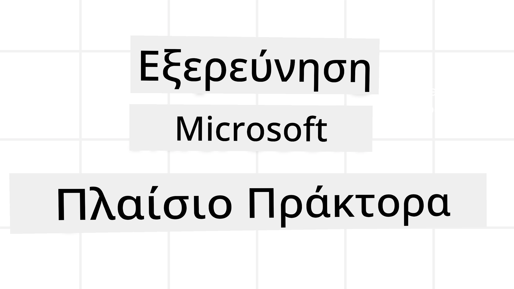
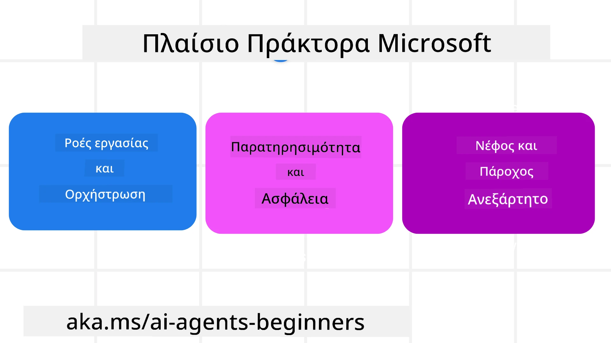
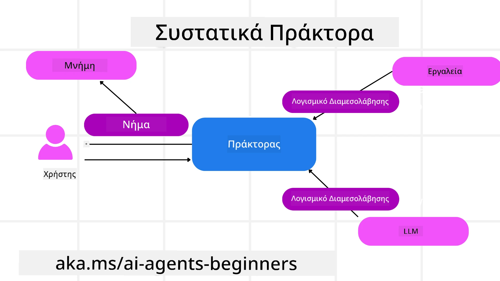

# Εξερεύνηση του Microsoft Agent Framework



### Εισαγωγή

Αυτό το μάθημα καλύπτει:

- Κατανόηση του Microsoft Agent Framework: Βασικά Χαρακτηριστικά και Αξία  
- Εξερεύνηση των Κύριων Εννοιών του Microsoft Agent Framework
- Προηγμένα Πρότυπα MAF: Ροές εργασίας, middleware και μνήμη

## Στόχοι Μάθησης

Μετά την ολοκλήρωση αυτού του μαθήματος, θα γνωρίζετε πώς να:

- Δημιουργείτε παραγωγικούς AI Agents χρησιμοποιώντας το Microsoft Agent Framework
- Εφαρμόζετε τα βασικά χαρακτηριστικά του Microsoft Agent Framework στις περιπτώσεις χρήσης του agent σας
- Χρησιμοποιείτε προηγμένα πρότυπα που περιλαμβάνουν ροές εργασίας, middleware και παρατηρησιμότητα

## Παραδείγματα Κώδικα

Παραδείγματα κώδικα για το [Microsoft Agent Framework (MAF)](https://aka.ms/ai-agents-beginners/agent-framework) μπορείτε να βρείτε σε αυτό το αποθετήριο, στα αρχεία `xx-python-agent-framework` και `xx-dotnet-agent-framework`.

## Κατανόηση του Microsoft Agent Framework



Το [Microsoft Agent Framework (MAF)](https://aka.ms/ai-agents-beginners/agent-framework) είναι το ενοποιημένο πλαίσιο της Microsoft για την κατασκευή AI agents. Προσφέρει την ευελιξία να αντιμετωπίσει τη μεγάλη ποικιλία περιπτώσεων χρήσης agent που συναντώνται τόσο σε παραγωγικά όσο και σε ερευνητικά περιβάλλοντα, όπως:

- **Ακολουθιακή ορχήστρωση Agent** σε σενάρια όπου απαιτούνται ροές εργασίας βήμα προς βήμα.
- **Ταυτόχρονη ορχήστρωση** σε σενάρια όπου οι agents πρέπει να ολοκληρώσουν εργασίες ταυτόχρονα.
- **Ορχήστρωση ομαδικής συνομιλίας** σε σενάρια όπου οι agents μπορούν να συνεργαστούν σε μία εργασία.
- **Ορχήστρωση μεταβίβασης** σε σενάρια όπου οι agents μεταβιβάζουν την εργασία μεταξύ τους καθώς ολοκληρώνονται τα υπο-εργασίες.
- **Μαγνητική Ορχήστρωση** σε σενάρια όπου ένας agent διαχειριστής δημιουργεί και τροποποιεί λίστα εργασιών και χειρίζεται το συντονισμό των υπο-agents για την ολοκλήρωση της εργασίας.

Για να παραδώσει AI Agents στην παραγωγή, το MAF περιλαμβάνει επίσης χαρακτηριστικά για:

- **Παρατηρησιμότητα** μέσω χρήσης του OpenTelemetry όπου κάθε ενέργεια του AI Agent περιλαμβάνει κλήση εργαλείων, βήματα ορχήστρωσης, ροές αιτιολόγησης και παρακολούθηση απόδοσης μέσω του Microsoft Foundry πίνακες εργαλείων.
- **Ασφάλεια** φιλοξενώντας τους agents εγγενώς στο Microsoft Foundry, που περιλαμβάνει ελέγχους ασφαλείας όπως η πρόσβαση βασισμένη σε ρόλους, διαχείριση ιδιωτικών δεδομένων και έμφυτη ασφάλεια περιεχομένου.
- **Ανθεκτικότητα** καθώς νήματα και ροές εργασίας των agents μπορούν να σταματήσουν, να συνεχιστούν και να ανακάμψουν από σφάλματα, επιτρέποντας μακρόχρονες διεργασίες.
- **Έλεγχος** καθώς υποστηρίζονται ροές εργασιών όπου απαιτείται ανθρώπινη έγκριση.

Το Microsoft Agent Framework εστιάζει επίσης στην διαλειτουργικότητα μέσω:

- **Ανεξαρτησίας από το cloud** - Οι agents μπορούν να τρέχουν σε containers, σε on-prem υποδομές και σε πολλαπλά διαφορετικά σύννεφα.
- **Ανεξαρτησίας από παρόχους** - Οι agents μπορούν να δημιουργηθούν μέσω του προτιμώμενου SDK σας, συμπεριλαμβανομένων Azure OpenAI και OpenAI.
- **Ενσωμάτωσης ανοικτών προτύπων** - Οι agents μπορούν να χρησιμοποιούν πρωτόκολλα όπως Agent-to-Agent (A2A) και Model Context Protocol (MCP) για να ανακαλύψουν και να χρησιμοποιήσουν άλλους agents και εργαλεία.
- **Plugins και Συνδετήρες** - Γίνονται συνδέσεις σε υπηρεσίες δεδομένων και μνήμης όπως Microsoft Fabric, SharePoint, Pinecone και Qdrant.

Ας δούμε πώς αυτά τα χαρακτηριστικά εφαρμόζονται σε μερικές βασικές έννοιες του Microsoft Agent Framework.

## Βασικές Έννοιες του Microsoft Agent Framework

### Agents



**Δημιουργία Agents**

Η δημιουργία agents γίνεται ορίζοντας την υπηρεσία συμπερασμού (LLM Provider), ένα  
σύνολο οδηγιών που ο AI Agent θα ακολουθεί, και ένα ανατεθειμένο `name`:

```python
agent = AzureOpenAIChatClient(credential=AzureCliCredential()).create_agent( instructions="You are good at recommending trips to customers based on their preferences.", name="TripRecommender" )
```
  
Το παραπάνω χρησιμοποιεί `Azure OpenAI` αλλά οι agents μπορούν να δημιουργηθούν χρησιμοποιώντας διάφορες υπηρεσίες, συμπεριλαμβανομένης της `Microsoft Foundry Agent Service`:

```python
AzureAIAgentClient(async_credential=credential).create_agent( name="HelperAgent", instructions="You are a helpful assistant." ) as agent
```
  
OpenAI `Responses`, `ChatCompletion` APIs

```python
agent = OpenAIResponsesClient().create_agent( name="WeatherBot", instructions="You are a helpful weather assistant.", )
```
  
```python
agent = OpenAIChatClient().create_agent( name="HelpfulAssistant", instructions="You are a helpful assistant.", )
```
  
ή [MiniMax](https://platform.minimaxi.com/), που παρέχει ένα API συμβατό με OpenAI με μεγάλα context windows (έως 204K tokens):

```python
agent = OpenAIChatClient(base_url="https://api.minimax.io/v1", api_key=os.environ["MINIMAX_API_KEY"], model_id="MiniMax-M3").create_agent( name="HelpfulAssistant", instructions="You are a helpful assistant.", )
```
  
ή απομακρυσμένους agents χρησιμοποιώντας το πρωτόκολλο A2A:

```python
agent = A2AAgent( name=agent_card.name, description=agent_card.description, agent_card=agent_card, url="https://your-a2a-agent-host" )
```
  
**Λειτουργία Agents**

Οι agents εκτελούνται χρησιμοποιώντας τις μεθόδους `.run` ή `.run_stream` για απαντήσεις χωρίς ή με ροή.

```python
result = await agent.run("What are good places to visit in Amsterdam?")
print(result.text)
```
  
```python
async for update in agent.run_stream("What are the good places to visit in Amsterdam?"):
    if update.text:
        print(update.text, end="", flush=True)

```
  
Κάθε εκτέλεση agent μπορεί επίσης να έχει επιλογές για προσαρμογή παραμέτρων όπως `max_tokens` που χρησιμοποιεί ο agent, `tools` που ο agent μπορεί να καλέσει, και ακόμη και το ίδιο το `model` που χρησιμοποιείται για τον agent.

Αυτό είναι χρήσιμο σε περιπτώσεις όπου απαιτούνται συγκεκριμένα μοντέλα ή εργαλεία για την ολοκλήρωση της εργασίας ενός χρήστη.

**Εργαλεία**

Τα εργαλεία μπορούν να οριστούν τόσο κατά τη δημιουργία του agent:

```python
def get_attractions( location: Annotated[str, Field(description="The location to get the top tourist attractions for")], ) -> str: """Get the top tourist attractions for a given location.""" return f"The top attractions for {location} are." 


# Όταν δημιουργείτε έναν ChatAgent απευθείας

agent = ChatAgent( chat_client=OpenAIChatClient(), instructions="You are a helpful assistant", tools=[get_attractions]

```
  
όσο και κατά την εκτέλεση του agent:

```python

result1 = await agent.run( "What's the best place to visit in Seattle?", tools=[get_attractions] # Εργαλείο παρεχόμενο μόνο για αυτήν την εκτέλεση )
```
  
**Νήματα Agent**

Τα Νήματα Agent χρησιμοποιούνται για τη διαχείριση συνομιλιών πολλαπλών γύρων. Τα νήματα μπορούν να δημιουργηθούν είτε με:

- Χρήση `get_new_thread()` που επιτρέπει την αποθήκευση του νήματος με το χρόνο
- Δημιουργία νήματος αυτόματα κατά την εκτέλεση ενός agent όπου το νήμα διαρκεί μόνο κατά τη διάρκεια της τρέχουσας εκτέλεσης.

Για να δημιουργήσετε ένα νήμα, ο κώδικας είναι:

```python
# Δημιουργήστε ένα νέο νήμα.
thread = agent.get_new_thread() # Εκτελέστε τον πράκτορα με το νήμα.
response = await agent.run("Hello, I am here to help you book travel. Where would you like to go?", thread=thread)

```
  
Μπορείτε στη συνέχεια να σειριοποιήσετε το νήμα για να αποθηκευτεί για μελλοντική χρήση:

```python
# Δημιουργήστε ένα νέο νήμα.
thread = agent.get_new_thread() 

# Εκτελέστε τον πράκτορα με το νήμα.

response = await agent.run("Hello, how are you?", thread=thread) 

# Σειριοποιήστε το νήμα για αποθήκευση.

serialized_thread = await thread.serialize() 

# Αποσειριοποιήστε την κατάσταση του νήματος μετά τη φόρτωση από την αποθήκευση.

resumed_thread = await agent.deserialize_thread(serialized_thread)
```
  
**Agent Middleware**

Οι agents αλληλεπιδρούν με εργαλεία και LLMs για την ολοκλήρωση εργασιών χρηστών. Σε ορισμένα σενάρια, θέλουμε να εκτελέσουμε ή να παρακολουθήσουμε ενδιάμεσα τις αλληλεπιδράσεις. Το middleware των agents μας επιτρέπει να το κάνουμε αυτό μέσω:

*Middleware Λειτουργιών (Function Middleware)*

Αυτό το middleware μας επιτρέπει να εκτελέσουμε μια ενέργεια μεταξύ του agent και μιας λειτουργίας/εργαλείου που θα κληθεί. Ένα παράδειγμα χρήσης είναι όταν θέλετε να κάνετε κάποια καταγραφή (logging) στην κλήση της λειτουργίας.

Στον κώδικα που ακολουθεί, το `next` καθορίζει αν θα εκτελεστεί το επόμενο middleware ή η ίδια η λειτουργία.

```python
async def logging_function_middleware(
    context: FunctionInvocationContext,
    next: Callable[[FunctionInvocationContext], Awaitable[None]],
) -> None:
    """Function middleware that logs function execution."""
    # Προεπεξεργασία: Καταγραφή πριν την εκτέλεση της συνάρτησης
    print(f"[Function] Calling {context.function.name}")

    # Συνέχεια στο επόμενο μεσαίο λογισμικό ή εκτέλεση συνάρτησης
    await next(context)

    # Μετα-επεξεργασία: Καταγραφή μετά την εκτέλεση της συνάρτησης
    print(f"[Function] {context.function.name} completed")
```
  
*Middleware Συνομιλίας (Chat Middleware)*

Αυτό το middleware μας επιτρέπει να εκτελέσουμε ή να καταγράψουμε μια ενέργεια μεταξύ του agent και των αιτημάτων μεταξύ του LLM.

Περιέχει σημαντικές πληροφορίες όπως τα `messages` που αποστέλλονται στην υπηρεσία AI.

```python
async def logging_chat_middleware(
    context: ChatContext,
    next: Callable[[ChatContext], Awaitable[None]],
) -> None:
    """Chat middleware that logs AI interactions."""
    # Προεπεξεργασία: Καταγραφή πριν την κλήση AI
    print(f"[Chat] Sending {len(context.messages)} messages to AI")

    # Συνέχισε στον επόμενο μεσαίο λογισμικό ή υπηρεσία AI
    await next(context)

    # Μετα-επεξεργασία: Καταγραφή μετά την απόκριση AI
    print("[Chat] AI response received")

```
  
**Μνήμη του Agent**

Όπως καλύφθηκε στο μάθημα `Agentic Memory`, η μνήμη είναι ένα σημαντικό στοιχείο που επιτρέπει στον agent να λειτουργεί σε διαφορετικά περιβάλλοντα. Το MAF προσφέρει διάφορους τύπους μνήμης:

*Μνήμη Εντός Μνήμης (In-Memory Storage)*

Αυτή η μνήμη αποθηκεύεται στις συνομιλίες κατά τη διάρκεια της λειτουργίας της εφαρμογής.

```python
# Δημιουργήστε ένα νέο νήμα.
thread = agent.get_new_thread() # Εκτελέστε τον πράκτορα με το νήμα.
response = await agent.run("Hello, I am here to help you book travel. Where would you like to go?", thread=thread)
```
  
*Επίμονες Μηνύματα (Persistent Messages)*

Αυτή η μνήμη χρησιμοποιείται για την αποθήκευση του ιστορικού συνομιλίας σε διάφορες συνεδρίες. Ορίζεται χρησιμοποιώντας το `chat_message_store_factory`:

```python
from agent_framework import ChatMessageStore

# Δημιουργήστε μια προσαρμοσμένη αποθήκη μηνυμάτων
def create_message_store():
    return ChatMessageStore()

agent = ChatAgent(
    chat_client=OpenAIChatClient(),
    instructions="You are a Travel assistant.",
    chat_message_store_factory=create_message_store
)

```
  
*Δυναμική Μνήμη (Dynamic Memory)*

Αυτή η μνήμη προστίθεται στο context πριν εκτελεστούν οι agents. Οι μνήμες αυτές μπορούν να αποθηκευτούν σε εξωτερικές υπηρεσίες όπως mem0:

```python
from agent_framework.mem0 import Mem0Provider

# Χρήση του Mem0 για προηγμένες δυνατότητες μνήμης
memory_provider = Mem0Provider(
    api_key="your-mem0-api-key",
    user_id="user_123",
    application_id="my_app"
)

agent = ChatAgent(
    chat_client=OpenAIChatClient(),
    instructions="You are a helpful assistant with memory.",
    context_providers=memory_provider
)

```
  
**Παρατηρησιμότητα Agent**

Η παρατηρησιμότητα είναι σημαντική για την κατασκευή αξιόπιστων και ευκολόχρηστων συστημάτων agent. Το MAF ενσωματώνεται με το OpenTelemetry για να παρέχει ιχνηλάτηση και μετρητές για καλύτερη παρατηρησιμότητα.

```python
from agent_framework.observability import get_tracer, get_meter

tracer = get_tracer()
meter = get_meter()
with tracer.start_as_current_span("my_custom_span"):
    # κάνε κάτι
    pass
counter = meter.create_counter("my_custom_counter")
counter.add(1, {"key": "value"})
```
  
### Ροές εργασίας

Το MAF προσφέρει ροές εργασίας, δηλαδή προκαθορισμένα βήματα για την ολοκλήρωση μιας εργασίας, που περιλαμβάνουν AI agents ως συνιστώσες σε αυτά τα βήματα.

Οι ροές εργασίας αποτελούνται από διάφορα στοιχεία που επιτρέπουν καλύτερο έλεγχο της ροής. Επιπλέον, επιτρέπουν **ορχήστρωση πολλαπλών agents** και **σημεία ελέγχου** (checkpointing) για αποθήκευση της κατάστασης της ροής εργασίας.

Τα βασικά στοιχεία μιας ροής εργασίας είναι:

**Εκτελεστές (Executors)**

Οι εκτελεστές λαμβάνουν εισερχόμενα μηνύματα, εκτελούν τις ανατεθειμένες εργασίες τους και παράγουν ένα εξερχόμενο μήνυμα. Αυτό ωθεί τη ροή εργασίας προς την ολοκλήρωση της μεγαλύτερης εργασίας. Οι εκτελεστές μπορεί να είναι είτε AI agents είτε προσαρμοσμένη λογική.

**Ακμές (Edges)**

Οι ακμές χρησιμοποιούνται για να ορίσουν τη ροή των μηνυμάτων σε μια ροή εργασίας. Ενδεικτικά:

*Άμεσες Ακμές* - Απλές συνδέσεις ένα προς ένα μεταξύ εκτελεστών:

```python
from agent_framework import WorkflowBuilder

builder = WorkflowBuilder()
builder.add_edge(source_executor, target_executor)
builder.set_start_executor(source_executor)
workflow = builder.build()
```
  
*Υπό όρους Ακμές* - Ενεργοποιούνται όταν πληρούται κάποια συνθήκη. Για παράδειγμα, όταν τα δωμάτια ξενοδοχείου δεν είναι διαθέσιμα, ένας εκτελεστής μπορεί να προτείνει άλλες επιλογές.

*Ακμές τύπου Switch-case* - Κατευθύνουν τα μηνύματα σε διαφορετικούς εκτελεστές βάσει ορισμένων συνθηκών. Για παράδειγμα, αν ένας πελάτης ταξιδιού έχει προτεραιότητα, οι εργασίες του θα χειριστούν μέσα από άλλη ροή εργασίας.

*Ακμές διακλάδωσης (Fan-out)* - Στέλνουν ένα μήνυμα σε πολλαπλούς προορισμούς.

*Ακμές σύγκλισης (Fan-in)* - Συλλέγουν πολλαπλά μηνύματα από διαφορετικούς εκτελεστές και τα στέλνουν σε έναν προορισμό.

**Γεγονότα (Events)**

Για να παρέχει καλύτερη παρατηρησιμότητα στις ροές εργασίας, το MAF προσφέρει ενσωματωμένα γεγονότα εκτέλεσης όπως:

- `WorkflowStartedEvent`  - Η εκτέλεση της ροής εργασίας ξεκινάει
- `WorkflowOutputEvent` - Η ροή εργασίας παράγει ένα αποτέλεσμα
- `WorkflowErrorEvent` - Η ροή εργασίας αντιμετωπίζει σφάλμα
- `ExecutorInvokeEvent`  - Ο εκτελεστής ξεκινά την επεξεργασία
- `ExecutorCompleteEvent`  -  Ο εκτελεστής ολοκληρώνει την επεξεργασία
- `RequestInfoEvent` - Εκδίδεται αίτημα

## Προηγμένα Πρότυπα MAF

Τα παραπάνω τμήματα καλύπτουν τις βασικές έννοιες του Microsoft Agent Framework. Καθώς δημιουργείτε πιο σύνθετους agents, εδώ είναι μερικά προηγμένα πρότυπα που μπορείτε να εξετάσετε:

- **Σύνθεση Middleware**: Αλύστε πολλαπλούς χειριστές middleware (logging, auth, rate-limiting) χρησιμοποιώντας function και chat middleware για λεπτομερή έλεγχο της συμπεριφοράς των agents.
- **Σημείωση Ελέγχου Ροής εργασίας**: Χρησιμοποιήστε γεγονότα ροής εργασίας και σειριοποίηση για αποθήκευση και επανεκκίνηση μακροχρόνιων διεργασιών agent.
- **Δυναμική Επιλογή Εργαλείων**: Συνδυάστε RAG πάνω στις περιγραφές εργαλείων με την εγγραφή εργαλείων του MAF για να παρουσιάσετε μόνο τα σχετικά εργαλεία ανά ερώτημα.
- **Μεταβίβαση Πολλαπλών Agents**: Χρησιμοποιήστε ακμές ροής εργασίας και υπό όρους δρομολόγηση για να ορχηστρώσετε μεταβιβάσεις μεταξύ εξειδικευμένων agents.

## Φιλοξενία LangChain / LangGraph Agents στο Microsoft Foundry

Το Microsoft Agent Framework είναι **διαλειτουργικό πλαίσιο** — δεν περιορίζεστε μόνο σε agents γραμμένους με MAF. Αν έχετε ήδη έναν agent φτιαγμένο με **LangChain** ή **LangGraph**, μπορείτε να τον τρέξετε ως **hosted agent στο Microsoft Foundry**, έτσι ώστε το Foundry να διαχειρίζεται το χρόνο εκτέλεσης, τις συνεδρίες, την κλιμάκωση, την ταυτότητα και τα τελικά σημεία πρωτοκόλλου για εσάς, ενώ η λογική του agent παραμένει στο LangGraph.

Αυτό γίνεται με το πακέτο `langchain_azure_ai.agents.hosting`, που εκθέτει ένα compiled LangGraph γράφημα μέσω των ίδιων πρωτοκόλλων που χρησιμοποιούν οι hosted agents του Foundry.

**1. Εγκαταστήστε το πρόσθετο hosting:**

```bash
pip install -U "langchain-azure-ai[hosting]>=1.2.4" azure-identity
```
  
Το πρόσθετο `hosting` εγκαθιστά τις βιβλιοθήκες πρωτοκόλλου Foundry: `azure-ai-agentserver-responses` (το OpenAI-συμβατό endpoint `/responses`) και `azure-ai-agentserver-invocations` (το γενικό endpoint `/invocations`).

**2. Επιλέξτε πρωτόκολλο φιλοξενίας:**

| Πρωτόκολλο | Κλάση φιλοξενίας | Endpoint | Χρήση |
|------------|------------------|----------|-------|
| **Responses** | `ResponsesHostServer` | `/responses` | Θέλετε OpenAI-συμβατή συνομιλία, streaming, ιστορικό απαντήσεων, και threading συνομιλιών — η προτεινόμενη επιλογή για agents συνομιλίας. |
| **Invocations** | `InvocationsHostServer` | `/invocations` | Χρειάζεστε προσαρμοσμένη δομή JSON, endpoint τύπου webhook, ή μη συνομιλιακή επεξεργασία. |

Επειδή το **Responses API είναι το κύριο API για ανάπτυξη agents σε Foundry**, ξεκινήστε με το `ResponsesHostServer` για τους περισσότερους agents.

**3. Διαμορφώστε τις μεταβλητές περιβάλλοντος** (`az login` πρώτα ώστε το `DefaultAzureCredential` να μπορεί να αυθεντικοποιηθεί):

```bash
export FOUNDRY_PROJECT_ENDPOINT="https://<resource>.services.ai.azure.com/api/projects/<project>"
export FOUNDRY_MODEL_NAME="gpt-4.1"
```
  
Όταν το agent εκτελείται αργότερα ως hosted agent σε Foundry, η πλατφόρμα εγχέει αυτόματα το `FOUNDRY_PROJECT_ENDPOINT`.

**4. Εκθέστε έναν LangGraph agent μέσω του Responses πρωτοκόλλου:**

```python
import os

from azure.ai.projects import AIProjectClient
from azure.identity import DefaultAzureCredential, get_bearer_token_provider
from langchain.agents import create_agent
from langchain_openai import ChatOpenAI
from langchain_azure_ai.agents.hosting import ResponsesHostServer

_AZURE_AI_SCOPE = "https://ai.azure.com/.default"


def build_chat_model() -> ChatOpenAI:
    project_endpoint = os.environ["FOUNDRY_PROJECT_ENDPOINT"].rstrip("/")
    deployment = os.environ.get("FOUNDRY_MODEL_NAME", "gpt-4.1")
    credential = DefaultAzureCredential()
    project = AIProjectClient(endpoint=project_endpoint, credential=credential)
    openai_client = project.get_openai_client()
    token_provider = get_bearer_token_provider(credential, _AZURE_AI_SCOPE)

    # Το ChatOpenAI εδώ στοχεύει στο συμβατό με OpenAI σημείο πρόσβασης (Responses) του έργου Foundry.
    return ChatOpenAI(
        model=deployment,
        base_url=str(openai_client.base_url),
        api_key=token_provider,
    )


def main() -> None:
    graph = create_agent(build_chat_model(), tools=[])
    port = int(os.environ.get("PORT", "8088"))
    ResponsesHostServer(graph).run(port=port)


if __name__ == "__main__":
    main()
```
  
Τρέξτε το τοπικά με `python main.py`, και στη συνέχεια στείλτε ένα αίτημα Responses στο `http://localhost:8088/responses`.

**Κύρια χαρακτηριστικά συμπεριφοράς:**

- **Συνομιλίες**: Οι πελάτες συνεχίζουν μια συνομιλία περνώντας `previous_response_id` ή ένα ID `conversation`. Αν το γράφημά σας είναι compiled με LangGraph checkpointer, το Foundry κλειδώνει την κατάσταση της συνομιλίας στο checkpoint (χρησιμοποιήστε έναν durable checkpointer στην παραγωγή· το `MemorySaver` είναι επαρκές για τοπικές δοκιμές).
- **Ανθρώπινη παρέμβαση (Human-in-the-loop)**: Αν το γράφημά σας χρησιμοποιεί LangGraph `interrupt()`, το `ResponsesHostServer` εμφανίζει την εκκρεμούσα διακοπή ως αντικείμενο `function_call` / `mcp_approval_request` του Responses, και οι πελάτες συνεχίζουν με το αντίστοιχο `function_call_output` / `mcp_approval_response`.
- **Ανάπτυξη σε Foundry**: Χρησιμοποιήστε το Azure Developer CLI — `azd ext install azure.ai.agents`, `azd ai agent init -m <manifest>`, `azd ai agent run` (τοπικά, απαιτεί Docker), μετά `azd provision` και `azd deploy`. Η ανάπτυξη hosted-agent απαιτεί τον ρόλο **Foundry Project Manager**.

Μια εκτελέσιμη έκδοση αυτού του παραδείγματος βρίσκεται στο [code-samples/14-langchain-hosted-agent.py](../../../14-microsoft-agent-framework/code-samples/14-langchain-hosted-agent.py). Για πλήρη οδηγό (πρωτόκολλο Invocations, προσαρμοσμένα σχήματα αιτημάτων, και αντιμετώπιση προβλημάτων), δείτε [Host LangGraph agents as Foundry hosted agents](https://learn.microsoft.com/azure/foundry/how-to/develop/langchain-hosted-agents).

## Παραδείγματα Κώδικα

Παραδείγματα κώδικα για το Microsoft Agent Framework μπορείτε να βρείτε σε αυτό το αποθετήριο, στα αρχεία `xx-python-agent-framework` και `xx-dotnet-agent-framework`.

## Έχετε Περισσότερες Ερωτήσεις για το Microsoft Agent Framework;

Εγγραφείτε στο [Microsoft Foundry Discord](https://discord.com/invite/ATgtXmAS5D) για να συναντήσετε άλλους μαθητές, να παρακολουθήσετε ώρες γραφείου και να πάρετε απαντήσεις στις ερωτήσεις σας για τους AI Agents.

---

<!-- CO-OP TRANSLATOR DISCLAIMER START -->
**Αποποίηση ευθυνών**:
Αυτό το έγγραφο έχει μεταφραστεί χρησιμοποιώντας την υπηρεσία μετάφρασης με τεχνητή νοημοσύνη [Co-op Translator](https://github.com/Azure/co-op-translator). Ενώ επιδιώκουμε την ακρίβεια, παρακαλούμε να έχετε υπόψη ότι οι αυτοματοποιημένες μεταφράσεις ενδέχεται να περιέχουν λάθη ή ανακρίβειες. Το πρωτότυπο έγγραφο στη μητρική του γλώσσα πρέπει να θεωρείται η αυθεντική πηγή. Για κρίσιμες πληροφορίες, συνιστάται επαγγελματική ανθρώπινη μετάφραση. Δεν φέρουμε ευθύνη για τυχόν παρεξηγήσεις ή λανθασμένες ερμηνείες που προκύπτουν από τη χρήση αυτής της μετάφρασης.
<!-- CO-OP TRANSLATOR DISCLAIMER END -->