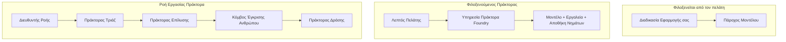
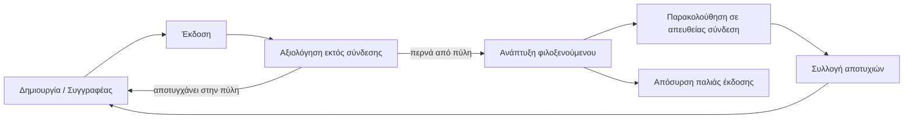
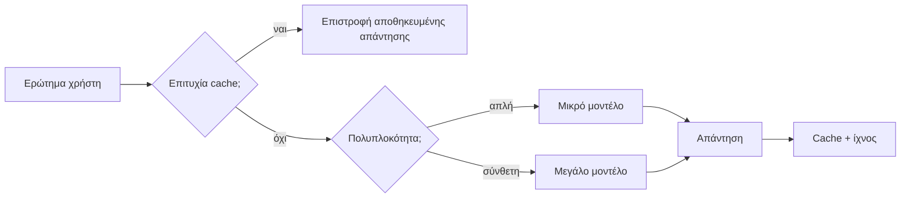
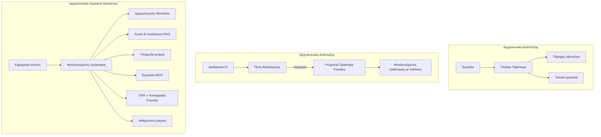

# Ανάπτυξη Κλιμακούμενων Πρακτόρων με το Microsoft Foundry


Μέχρι αυτό το σημείο του μαθήματος έχετε δημιουργήσει πράκτορες που τρέχουν στον φορητό υπολογιστή σας, μέσα σε ένα τετράδιο, με  οδήγηση από το `az login` και μερικές μεταβλητές περιβάλλοντος. Αυτή είναι ακριβώς η σωστή μέθοδος για να μάθετε. Δεν είναι ο σωστός τρόπος για να λειτουργήσει ένας πράκτορας από τον οποίο εξαρτώνται χιλιάδες πελάτες στις 3 π.μ.

Αυτό το μάθημα αφορά το χάσμα μεταξύ "λειτουργεί στη μηχανή μου" και "λειτουργεί, αξιόπιστα και οικονομικά, σε παραγωγή." Κλείνουμε αυτό το χάσμα χρησιμοποιώντας το **Microsoft Foundry** και την **Υπηρεσία Πρακτόρων Microsoft Foundry**, και το κάνουμε κατασκευάζοντας έναν πραγματικό πράκτορα υποστήριξης πελατών που διαθέτει εργαλεία, ανάκτηση, μνήμη, αξιολόγηση και παρακολούθηση.

## Εισαγωγή

Αυτό το μάθημα θα καλύψει:

- Τη διαφορά μεταξύ ενός **πρωτοτύπου πράκτορα** και ενός **αναπτυγμένου πράκτορα**, και γιατί η μετάβαση αφορά κυρίως τα πάντα *γύρω* από το μοντέλο.
- **Πρότυπα ανάπτυξης** για πράκτορες: φιλοξενούμενοι στον πελάτη, φιλοξενούμενοι ως υπηρεσία (Hosted Agents), και με ροές εργασίας.
- Ο **κύκλος ζωής του πράκτορα** στο Microsoft Foundry — δημιουργία, έκδοση, ανάπτυξη, αξιολόγηση, παρακολούθηση, απόσυρση.
- **Στρατηγικές κλιμάκωσης**: δρομολόγηση μοντέλου, προσωρινή μνήμη, ταυτόχρονη εκτέλεση, και σχεδίαση χωρίς κατάσταση.
- **Παρατηρησιμότητα** με OpenTelemetry και ιχνηλάτηση Foundry.
- **Βελτιστοποίηση κόστους** μέσω επιλογής μοντέλου, δρομολόγησης, και πύλες αξιολόγησης.
- **Επιχειρησιακοί παράγοντες**: διακυβέρνηση, ανθρώπινη έγκριση, και ασφαλής εκτέλεση διακομιστών MCP σε παραγωγή.

## Στόχοι Μάθησης

Μετά την ολοκλήρωση αυτού του μαθήματος, θα γνωρίζετε πώς να:

- Επιλέγετε το σωστό πρότυπο ανάπτυξης για ένα συγκεκριμένο φόρτο εργασίας πράκτορα.
- Αναπτύσσετε έναν πράκτορα στην Υπηρεσία Πρακτόρων Microsoft Foundry ώστε να είναι εκδομένο, ελεγχόμενο, και παρατηρήσιμο.
- Εξοπλίζετε έναν πράκτορα για ιχνηλάτηση και στήνετε μια γραμμή αξιολόγησης που εκτελείται πριν από κάθε κυκλοφορία.
- Εφαρμόζετε δρομολόγηση μοντέλου και προσωρινή μνήμη για να διατηρείτε τη λανθάνουσα κατάσταση και το κόστος υπό έλεγχο στην κλίμακα.
- Προσθέτετε μια πύλη ανθρώπινης έγκρισης για ενέργειες υψηλού κινδύνου και ενσωματώνετε έναν διακομιστή MCP με ασφαλή τρόπο παραγωγής.

## Προαπαιτούμενα

Αυτό το μάθημα προϋποθέτει ότι έχετε ολοκληρώσει τα προηγούμενα μαθήματα και είστε άνετοι με:

- Την κατασκευή πρακτόρων με το [Microsoft Agent Framework](../14-microsoft-agent-framework/README.md) (Μάθημα 14).
- Τη [Χρήση Εργαλείων](../04-tool-use/README.md) (Μάθημα 4) και το [Agentic RAG](../05-agentic-rag/README.md) (Μάθημα 5).
- Τη [Μνήμη Πράκτορα](../13-agent-memory/README.md) (Μάθημα 13) και τα [Agentic Protocols / MCP](../11-agentic-protocols/README.md) (Μάθημα 11).
- Την [Παρατηρησιμότητα και Αξιολόγηση](../10-ai-agents-production/README.md) (Μάθημα 10) — αυτό το μάθημα βασίζεται άμεσα σε αυτό.

Θα χρειαστείτε επίσης:

- Μια **εγγραφή Azure** και ένα **έργο Microsoft Foundry** με τουλάχιστον ένα αναπτυγμένο μοντέλο συνομιλίας.
- Το **Azure CLI** πιστοποιημένο (`az login`).
- Python 3.12+ και τα πακέτα στο αποθετήριο [`requirements.txt`](../../../requirements.txt).

## Από το Πρωτότυπο στην Παραγωγή: Τι Αλλάζει Πραγματικά

Ένας πράκτορας πρωτοτύπου και ένας πράκτορας παραγωγής μοιράζονται τον ίδιο βασικό βρόχο — συλλογισμός, κλήση εργαλείων, απόκριση. Αυτό που αλλάζει είναι τα πάντα γύρω από αυτόν τον βρόχο. Το μοντέλο ίσως αποτελεί το 20% ενός πράκτορα παραγωγής· το υπόλοιπο 80% είναι ο λειτουργικός σκελετός.

| Ζήτημα | Πρωτότυπο | Παραγωγή |
| --- | --- | --- |
| **Φιλοξενία** | Τρέχει στο τετράδιό σας | Τρέχει ως φιλοξενούμενη υπηρεσία, εκδομένη και κυκλοφορημένη |
| **Ταυτότητα** | Το `az login` διακριτικό σας | Διαχειριζόμενη ταυτότητα με περιορισμένο RBAC |
| **Κατάσταση** | Εντός μνήμης, χαμένο σε επανεκκίνηση | Εξωτερικοποιημένο (αποθήκη νημάτων, υπηρεσία μνήμης) |
| **Αποτυχία** | Βλέπετε το traceback | Επαναλήψεις, εναλλακτικές, dead-letter, ειδοποιήσεις |
| **Κόστος** | "Είναι λίγα λεπτά" | Παρακολουθείται ανά αίτημα, δρομολογείται, αποθηκεύεται, προϋπολογίζεται |
| **Ποιότητα** | Εξετάζετε το αποτέλεσμα | Αξιολογείται αυτόματα πριν από κάθε κυκλοφορία |
| **Εμπιστοσύνη** | Εγκρίνετε κάθε ενέργεια | Πολιτική + άνθρωπος ενδιάμεσα για επικίνδυνες ενέργειες |

Έχετε κατά νου αυτόν τον πίνακα. Κάθε ενότητα παρακάτω αντιστοιχεί σε μία από αυτές τις γραμμές.

## Πρότυπα Ανάπτυξης Πρακτόρων

Υπάρχουν τρία πρότυπα που θα χρησιμοποιείτε, συχνά σε συνδυασμό.

### 1. Πράκτορες Φιλοξενούμενοι στον Πελάτη

Το αντικείμενο πράκτορα ζει μέσα στη *δική σας* διαδικασία εφαρμογής. Ο κώδικάς σας καλεί απευθείας τον πάροχο μοντέλου· ο βρόχος συλλογισμού τρέχει στην υπηρεσία σας. Αυτό είναι που έκανε κάθε προηγούμενο μάθημα.

- **Χρησιμοποιήστε το όταν** χρειάζεστε πλήρη έλεγχο πάνω στον βρόχο, προσαρμοσμένο middleware, ή ενσωματώνετε τον πράκτορα μέσα σε υπάρχον backend.
- **Αντιπερισπασμός**: είστε υπεύθυνοι για κλιμάκωση, κατάσταση, και ανθεκτικότητα.

### 2. Φιλοξενούμενοι Πράκτορες (Υπηρεσία Foundry Agent)

Ο πράκτορας *καταχωρείται ως πόρος* στο Microsoft Foundry. Το Foundry φιλοξενεί τον βρόχο συλλογισμού, αποθηκεύει νήματα, επιβάλλει ασφάλεια περιεχομένου και RBAC, και κάνει τον πράκτορα ορατό στην πύλη Foundry. Η εφαρμογή σας γίνεται ένας ελαφρύς πελάτης που δημιουργεί νήματα και διαβάζει απαντήσεις.

- **Χρησιμοποιήστε το όταν** θέλετε ανθεκτικότητα, ενσωματωμένη παρατηρησιμότητα, διακυβέρνηση, και λιγότερη λειτουργική επιφάνεια.
- **Αντιπερισπασμός**: λιγότερος χαμηλού επιπέδου έλεγχος έναντι ενός διαχειριζόμενου χρόνου εκτέλεσης.

### 3. Ροές Εργασίας Πρακτόρων

Πολλοί πράκτορες (και εργαλεία) συντίθενται σε γράφο με ρητό έλεγχο ροής — διαδοχικά βήματα, διακλαδώσεις, κόμβοι ανθρώπινης έγκρισης, και ανθεκτικά σημεία ελέγχου που μπορούν να παγώσουν και να συνεχίσουν. Αυτή είναι η δυνατότητα **Workflows** του Microsoft Agent Framework που εφαρμόζεται σε κλίμακα ανάπτυξης.

- **Χρησιμοποιήστε το όταν** μια και μοναδική εργασία εκτείνεται σε αρκετούς εξειδικευμένους πράκτορες ή απαιτεί βήμα έγκρισης στη μέση.
- **Αντιπερισπασμός**: περισσότερα κινούμενα μέρη· απαιτεί παρατηρησιμότητα σε επίπεδο ορχήστρωσης.



## Ο Κύκλος Ζωής του Πράκτορα στο Microsoft Foundry

Η ανάπτυξη ενός πράκτορα δεν είναι μια μονομερής `push` ενέργεια. Είναι ένας βρόχος, και μοιάζει πολύ με έναν κύκλο κυκλοφορίας λογισμικού γιατί αυτό ακριβώς είναι.



Η βασική ιδέα, που προέρχεται από το [Μάθημα 10](../10-ai-agents-production/README.md): **η εκτός σύνδεσης αξιολόγηση είναι πύλη, όχι μετά σκέψη.** Μια νέα έκδοση πράκτορα δεν αποστέλλεται αν δεν περάσει τα όρια αξιολόγησής σας. Η παρατηρησιμότητα σε σύνδεση τροφοδοτεί μετά τα πραγματικά σφάλματα στον εκτός σύνδεσης σύνολο δοκιμών σας. Αυτός είναι ολόκληρος ο βρόχος.

## Στρατηγικές Κλιμάκωσης

Η κλιμάκωση ενός πράκτορα διαφέρει από την κλιμάκωση ενός web API χωρίς κατάσταση, επειδή κάθε αίτημα μπορεί να πυροδοτήσει πολλαπλές δαπανηρές κλήσεις σε μοντέλα και εργαλεία. Τέσσερις τεχνικές σηκώνουν το μεγαλύτερο φορτίο.

**Διαχείριση αιτήσεων χωρίς κατάσταση.** Μην κρατάτε κατάσταση ανά χρήστη στη μνήμη της διαδικασίας σας. Αποθηκεύστε τα νήματα συνομιλίας στην αποθήκη νημάτων Foundry ή σε μια υπηρεσία μνήμης ώστε οποιαδήποτε περίπτωση να μπορεί να χειριστεί κάθε αίτημα. Αυτό σας επιτρέπει να κλιμακώνετε οριζόντια — προσθέστε περιπτώσεις, χωρίς συνεδρίες τύπου sticky.

**Δρομολόγηση μοντέλου.** Δεν χρειάζεται κάθε αίτημα το πιο ικανό (και πιο ακριβό) μοντέλο σας. Δρομολογήστε απλά αιτήματα — ταξινόμηση προθέσεων, σύντομες πραγματικές απαντήσεις — σε ένα μικρό, γρήγορο μοντέλο, και κρατήστε το μεγάλο μοντέλο για πραγματική συλλογιστική. Ο **Δρομολογητής Μοντέλου** του Foundry μπορεί να το κάνει για εσάς, ή μπορείτε να υλοποιήσετε ελαφρύ ταξινομητή μόνοι σας. Θα κατασκευάσετε την έκδοση DIY στο εργαστήριο.

**Προσωρινή μνήμη απαντήσεων.** Πολλά ερωτήματα υποστήριξης είναι σχεδόν ίδια ("πώς επαναφέρω τον κωδικό μου;"). Κρατήστε στην προσωρινή μνήμη τις απαντήσεις σε συχνές ερωτήσεις και εξυπηρετήστε τις χωρίς να κάνετε κλήση στο μοντέλο. Ακόμα και ένα μέτριο ποσοστό πλήγματος στην προσωρινή μνήμη μειώνει σημαντικά κόστος και λανθάνουσα κατάσταση.

**Ταυτόχρονη εκτέλεση και πίεση επιστροφής.** Οι πάροχοι μοντέλων έχουν όρια ρυθμού. Περιορίστε την ταυτόχρονη εκτέλεση, χρησιμοποιήστε επαναλήψεις με εκθετική υποχώρηση, και αποτύχετε ευγενικά (μια ουρά "ασχολούμαστε με αυτό" ξεπερνά ένα σφάλμα 500).



## Παρατηρησιμότητα στην Παραγωγή

Δεν μπορείτε να λειτουργήσετε αυτό που δεν μπορείτε να δείτε. Όπως καλύφθηκε στο Μάθημα 10, το Microsoft Agent Framework εκπέμπει **OpenTelemetry** ιχνηλασίες εγγενώς — κάθε κλήση μοντέλου, εκτέλεση εργαλείου και βήμα ορχήστρωσης γίνεται ένα span. Σε παραγωγή εξάγετε αυτά τα spans στο Microsoft Foundry (ή σε οποιοδήποτε backend συμβατό με OTel) ώστε να μπορείτε να:

- Ιχνηλατήσετε μια και μοναδική παράπονο πελάτη από άκρο σε άκρο μέσα από κάθε κλήση μοντέλου και εργαλείου.
- Παρακολουθείτε την καθυστέρηση p50/p95 και το κόστος ανά αίτημα με το χρόνο.
- Ειδοποιείστε για αιχμές σφαλμάτων και ανωμαλίες κόστους πριν τις παρατηρήσουν οι χρήστες σας (ή η οικονομική σας ομάδα).

```python
from agent_framework.observability import get_tracer

tracer = get_tracer()

with tracer.start_as_current_span("support_request") as span:
    span.set_attribute("customer.tier", "enterprise")
    span.set_attribute("routed.model", "gpt-5-nano")
    # Η εκτέλεση του πράκτορα παρακολουθείται αυτόματα μέσα σε αυτό το εύρος
```

Χαρακτηριστικά όπως `customer.tier` και `routed.model` είναι αυτά που μετατρέπουν ένα τείχος από ιχνηλασίες σε απαντήσιμα ερωτήματα ("οι επιχειρησιακοί πελάτες δρομολογούνται πολύ συχνά στο μικρό μοντέλο;").

## Βελτιστοποίηση Κόστους

Το κόστος στους πράκτορες παραγωγής κυριαρχείται από tokens. Τρεις μοχλοί, κατά σειρά επιρροής:

1. **Επιλέξτε το σωστό μέγεθος μοντέλου.** Ένα μικρό μοντέλο που περνά την πύλη αξιολόγησής σας είναι σχεδόν πάντα φθηνότερο από ένα μεγάλο που επίσης περνά. Χρησιμοποιήστε την αξιολόγηση για να *αποδείξετε* ότι το μικρό μοντέλο είναι αρκετά καλό αντί να επιλέγετε το μεγαλύτερο εξ οικειότητας.
2. **Δρομολογήστε ανάλογα με την πολυπλοκότητα.** Όπως παραπάνω — πληρώστε για το μεγάλο μοντέλο μόνο για αιτήματα που απαιτούν συλλογισμό μεγάλου μοντέλου.
3. **Κρατήστε στην προσωρινή μνήμη επιθετικά.** Η φθηνότερη κλήση μοντέλου είναι αυτή που δεν κάνετε ποτέ.

Οι πύλες αξιολόγησης και ο έλεγχος κόστους είναι η ίδια πειθαρχία που προσεγγίζεται από δύο οπτικές: η αξιολόγηση σας δίνει το *πάτωμα ποιότητας*, η δρομολόγηση και η προσωρινή μνήμη σας κρατούν όσο το δυνατόν πιο κοντά στο *κόστος* αυτού του πατώματος.

## Επιχειρησιακές Προεκτάσεις Ανάπτυξης

**Διακυβέρνηση.** Οι Φιλοξενούμενοι Πράκτορες κληρονομούν το RBAC, την ασφάλεια περιεχομένου, και το audit logging του Foundry. Δώστε σε κάθε πράκτορα μια διαχειριζόμενη ταυτότητα με τα λιγότερα δικαιώματα που χρειάζεται — δικαιώματα μόνο για ανάγνωση της βάσης γνώσης, περιορισμένη πρόσβαση στο API εισιτηρίων, τίποτα παραπάνω.

**Άνθρωπος ενδιάμεσα.** Μερικές ενέργειες είναι πολύ σημαντικές για να αυτοματοποιηθούν πλήρως — όπως η χορήγηση επιστροφής χρημάτων, η διαγραφή λογαριασμού, η κλιμάκωση σε νομική ομάδα. Το Microsoft Agent Framework υποστηρίζει εργαλεία **που απαιτούν έγκριση**: ο πράκτορας προτείνει την ενέργεια, η εκτέλεση σταματά, ένας άνθρωπος εγκρίνει ή απορρίπτει, και η ροή εργασίας συνεχίζεται. Είδατε το πρωτόγονο αυτό στο [Μάθημα 6](../06-building-trustworthy-agents/README.md)· εδώ το αναπτύσσετε.

**MCP σε παραγωγή.** Το [MCP](../11-agentic-protocols/README.md) επιτρέπει στον πράκτορά σας να καταναλώνει εξωτερικά εργαλεία μέσω ενός τυποποιημένου interface. Σε παραγωγή, αντιμετωπίστε κάθε διακομιστή MCP ως μη αξιόπιστο όριο: κλειδώστε την έκδοση διακομιστή, τρέξτε το με μια περιορισμένη ταυτότητα, επικυρώστε τα αποτελέσματά του, και ποτέ μην εκθέτετε μυστικά σε αυτόν. Ένας διακομιστής MCP είναι εξάρτηση και οι εξαρτήσεις επιδιορθώνονται, ελεγχονται και περιορίζονται σε ρυθμό.



Αυτά τα τρία διαγράμματα — ανάπτυξη, λειτουργία, εκτέλεση — είναι ο ίδιος πράκτορας σε τρία στάδια της ζωής του. Το εργαστήριο που ακολουθεί σας καθοδηγεί στην κατασκευή του.

## Εργαστήριο: Ένας Πράκτορας Υποστήριξης Πελατών Έτοιμος για Παραγωγή

Ανοίξτε το [`code_samples/16-python-agent-framework.ipynb`](./code_samples/16-python-agent-framework.ipynb) και δουλέψτε το από την αρχή μέχρι το τέλος. Θα συναρμολογήσετε έναν **πράκτορα υποστήριξης πελατών Contoso** με κάθε παραγωγικό ζήτημα συνδεδεμένο:

1. **Κλήση εργαλείων** — αναζήτηση κατάστασης παραγγελίας και άνοιγμα αιτημάτων υποστήριξης.
2. **RAG** — απαντήσεις σε ερωτήσεις πολιτικής από μια βάση γνώσης (Azure AI Search, με fallback στη μνήμη ώστε το τετράδιο να τρέχει χωρίς πόρο Search).
3. **Μνήμη** — θυμάται τον πελάτη καθ' όλη τη διάρκεια της συνομιλίας.
4. **Δρομολόγηση μοντέλου** — ένας ταξινομητής πολυπλοκότητας δρομολογεί κάθε αίτημα σε μικρό ή μεγάλο μοντέλο.
5. **Προσωρινή μνήμη απαντήσεων** — οι επαναλαμβανόμενες ερωτήσεις εξυπηρετούνται από την προσωρινή μνήμη.
6. **Ανθρώπινη έγκριση** — επιστροφές χρημάτων πάνω από ένα όριο παύουν για ανθρώπινη υπογραφή.
7. **Γραμμή αξιολόγησης** — ένα μικρό σύνολο εκτός σύνδεσης δοκιμών βαθμολογεί τον πράκτορα και λειτουργεί ως πύλη κυκλοφορίας.
8. **Παρατηρησιμότητα** — ιχνηλάτηση OpenTelemetry γύρω από κάθε αίτημα.

### Περιήγηση

Το τετράδιο είναι οργανωμένο ώστε κάθε παραγωγική ανησυχία να είναι μια αυτοτελής, τρέξιμη ενότητα. Η καρδιά του είναι ο χειριστής αιτήσεων δρομολόγησης-προσθήκης στην προσωρινή μνήμη:

```python
async def handle_support_request(query: str, customer_id: str) -> str:
    # 1. Εξυπηρέτηση από την cache όταν είναι δυνατόν.
    cached = response_cache.get(normalize(query))
    if cached:
        return cached

    # 2. Δρομολόγηση κατά πολυπλοκότητα για τον έλεγχο του κόστους.
    model = "gpt-5-nano" if is_simple(query) else "gpt-5-mini"

    # 3. Εκτέλεση του πράκτορα μέσα σε ένα trace span για παρατηρησιμότητα.
    with tracer.start_as_current_span("support_request") as span:
        span.set_attribute("routed.model", model)
        span.set_attribute("customer.id", customer_id)
        response = await support_agent.run(query, model=model)

    # 4. Αποθήκευση στην cache και επιστροφή.
    response_cache.set(normalize(query), response.text)
    return response.text
```

Η πύλη αξιολόγησης που φυλάει μια κυκλοφορία μοιάζει έτσι:

```python
async def evaluation_gate(agent, test_cases, threshold: float = 0.8) -> bool:
    passed = 0
    for case in test_cases:
        result = await agent.run(case["input"])
        if score_response(result.text, case["expected"]) >= 0.8:
            passed += 1
    pass_rate = passed / len(test_cases)
    print(f"Evaluation pass rate: {pass_rate:.0%} (gate: {threshold:.0%})")
    return pass_rate >= threshold  # αναπτύξτε μόνο αν η πύλη περάσει
```

Διαβάστε κάθε γραμμή — το τετράδιο κρατά τα πρωτόγονα εσκεμμένα μικρά ώστε να μη λείπει τίποτα πίσω από κλήση framework.

## Επικύρωση Αναπτυγμένου Πράκτορα με Δοκιμές Καπνού

Η πύλη αξιολόγησης παραπάνω τρέχει *εκτός σύνδεσης* στο αντικείμενο του πράκτορα σας. Μόλις ο πράκτορας αναπτυχθεί ως Φιλοξενούμενος Πράκτορας, χρειάζεστε μια ακόμα πιο φθηνή δοκιμή: **απαντάει στ’ αλήθεια το αναπτυγμένο endpoint;**

Η "επιτυχημένη" ανάπτυξη μόνο αποδεικνύει ότι το επίπεδο ελέγχου αποδέχτηκε τον ορισμό — δεν αποδεικνύει ότι ο πράκτορας απαντά. Μια λανθασμένη εξάρτηση, μια κακή δρομολόγηση μοντέλου, ή μια ληγμένη σύνδεση μπορεί να αφήσει μια πράσινη ανάπτυξη που δεν επιστρέφει τίποτα. Μια **δοκιμή καπνού** το πιάνει σε δευτερόλεπτα, σε κάθε ανάπτυξη, χωρίς το κόστος μιας πλήρους αξιολόγησης.

Αυτό το αποθετήριο διαθέτει μια έτοιμη προς χρήση γραμμή δοκιμής καπνού βασισμένη στο GitHub Action [AI Smoke Test](https://github.com/marketplace/actions/ai-smoke-test):

- **Κατάλογος** — το [`tests/lesson-16-smoke-tests.json`](../../../tests/lesson-16-smoke-tests.json) περιέχει prompts και επαληθεύσεις για τον πράκτορα υποστήριξης Contoso (βασισμένες σε απαντήσεις πολιτικής, αναζήτηση παραγγελίας, παραμονή στο θέμα, και συνέχεια νήματος πολλαπλών στροφών). Κατάλογοι για πράκτορες άλλων μαθημάτων υπάρχουν δίπλα του — δείτε το [`tests/README.md`](../tests/README.md).
- **Ροή εργασίας** — το [`.github/workflows/smoke-test.yml`](../../../.github/workflows/smoke-test.yml) συνδέεται με Azure OIDC και στέλνει POST κάθε προτροπή στο endpoint Απαντήσεων του πράκτορα, αποτυγχάνοντας τη δουλειά σε οποιαδήποτε παράλειψη επαλήθευσης.

```yaml
- name: Smoke-test hosted agent
  uses: JFolberth/ai-smoketest@v1
  with:
    project_endpoint: ${{ inputs.project_endpoint }}
    agent_name: ContosoSupportAgent
    tests_file: tests/lesson-16-smoke-tests.json
```


Εκτελέστε το από την καρτέλα **Actions** μόλις αναπτυχθεί ο agent σας, παρέχοντας το endpoint του έργου Foundry και το όνομα του agent. Η ομοσπονδιακή ταυτότητα χρειάζεται τον ρόλο **Azure AI User** στο πεδίο του έργου Foundry. Σκεφτείτε τα επίπεδα ως μια πυραμίδα: τα smoke tests (είναι προσβάσιμα και ανταποκρίνονται;) εκτελούνται σε κάθε ανάπτυξη, η offline αξιολόγηση (είναι επαρκές για να διατεθεί;) εκτελείται πριν την προώθηση, και η online αξιολόγηση (πώς τα πάει στην πράξη;) εκτελείται συνεχώς.

## Έλεγχος Γνώσεων

Ελέγξτε την κατανόησή σας πριν προχωρήσετε στην άσκηση.

**1. Περίπου πόσο από έναν παραγωγικό agent είναι "το μοντέλο", και τι είναι το υπόλοιπο;**

<details>
<summary>Απάντηση</summary>

Το μοντέλο είναι η μειονότητα του συστήματος — συχνά αναφέρεται γύρω στο 20%. Το υπόλοιπο είναι ο λειτουργικός σκελετός: φιλοξενία και διαχείριση εκδόσεων, ταυτότητα και RBAC, εξωτερικοποιημένη κατάσταση, διαχείριση αποτυχίας, παρακολούθηση κόστους, αξιολόγηση, και έλεγχοι με ανθρώπινη παρέμβαση. Η μετάβαση στην παραγωγή αφορά κυρίως την κατασκευή όλων *γύρω από* τον βρόχο λογικής.
</details>

**2. Πότε θα επιλέγατε έναν Hosted Agent αντί για έναν agent φιλοξενούμενο από τον πελάτη;**

<details>
<summary>Απάντηση</summary>

Όταν θέλετε ένα διαχειριζόμενο runtime με ενσωματωμένη ανθεκτικότητα (νήματα που επιμένουν και μπορούν να συνεχιστούν), παρατηρησιμότητα, ασφάλεια περιεχομένου, και RBAC, και είστε πρόθυμοι να θυσιάσετε λίγο τον λεπτομερή έλεγχο του βρόχου λογικής για λιγότερο λειτουργικό φόρτο. Το client-hosted προτιμάται όταν χρειάζεστε πλήρη έλεγχο του βρόχου ή ενσωματώνετε τον agent σε υπάρχον backend.
</details>

**3. Γιατί ένας κλιμακούμενος agent πρέπει να είναι stateless στη δική του μνήμη διεργασίας;**

<details>
<summary>Απάντηση</summary>

Για να μπορεί οποιαδήποτε έκδοση να χειριστεί οποιοδήποτε αίτημα, κάτι που επιτρέπει οριζόντια κλιμάκωση χωρίς προσκολλημένες συνεδρίες (sticky sessions). Η κατάσταση της συνομιλίας ανά χρήστη εξωτερικεύεται σε αποθήκη νημάτων ή υπηρεσία μνήμης. Αν η κατάσταση ζούσε στη μνήμη διεργασίας, θα τη χανόσασταν σε επανεκκίνηση και δεν θα μπορούσατε να διανείμετε το φορτίο ελεύθερα.
</details>

**4. Ποιο πρόβλημα επιλύει η δρομολόγηση μοντέλων, και πώς σχετίζεται με την αξιολόγηση;**

<details>
<summary>Απάντηση</summary>

Η δρομολόγηση στέλνει απλά αιτήματα σε ένα μικρό, φθηνό, γρήγορο μοντέλο και κρατάει το μεγάλο μοντέλο για την αυθεντική λογική, ελέγχοντας τόσο την καθυστέρηση όσο και το κόστος. Σχετίζεται με την αξιολόγηση επειδή η αξιολόγηση είναι αυτή που *αποδεικνύει* ότι το μικρό μοντέλο είναι επαρκές για μια κατηγορία αιτημάτων — η δρομολόγηση χωρίς αξιολόγηση είναι εικασία.
</details>

**5. Τι είναι μια "πύλη αξιολόγησης" και πού τοποθετείται στον κύκλο ζωής;**

<details>
<summary>Απάντηση</summary>

Μια πύλη αξιολόγησης τρέχει ένα offline σύνολο δοκιμών σε μια νέα έκδοση agent και μπλοκάρει την ανάπτυξη εκτός αν το ποσοστό επιτυχίας ξεπεράσει ένα όριο. Τοποθετείται μεταξύ του "version" και "deploy" στον κύκλο ζωής, κάνοντας την ποιότητα προϋπόθεση για την έκδοση αντί για κάτι που ελέγχετε μετά την παράδοση.
</details>

**6. Γιατί ένας MCP server πρέπει να αντιμετωπίζεται ως μη έμπιστο όριο σε παραγωγή;**

<details>
<summary>Απάντηση</summary>

Επειδή είναι μια εξωτερική εξάρτηση στην οποία καλεί ο agent σας. Πρέπει να καρφιτσώσετε την έκδοσή του, να τον τρέχετε με scoped ταυτότητα, να επικυρώνετε τα αποτελέσματά του, να περιορίζετε τον ρυθμό πρόσβασης, και να μην εκθέτετε ποτέ μυστικά σε αυτόν — την ίδια πειθαρχία που εφαρμόζετε σε οποιαδήποτε τρίτη εξάρτηση. Τα αποτελέσματά του εισρέουν στη λογική του agent σας, οπότε η μη επικυρωμένη εμπιστοσύνη αποτελεί κίνδυνο ασφαλείας.
</details>

**7. Ποια αλλαγή συνήθως έχει το μεγαλύτερο αντίκτυπο στο κόστος ενός παραγωγικού agent, και γιατί;**

<details>
<summary>Απάντηση</summary>

Το σωστό μέγεθος του μοντέλου — χρησιμοποιώντας το μικρότερο μοντέλο που περνάει την πύλη αξιολόγησής σας. Το κόστος κυριαρχείται από tokens, και ένα μικρότερο μοντέλο που καλύπτει το επίπεδο ποιότητας είναι σχεδόν πάντα πιο φθηνό από ένα μεγαλύτερο. Η προσωρινή αποθήκευση και η δρομολόγηση μειώνουν περαιτέρω το κόστος, αλλά η επιλογή του σωστού βασικού μοντέλου έχει το μεγαλύτερο πρωταρχικό αποτέλεσμα.
</details>

**8. Τι ρόλο παίζουν τα attributes span όπως `customer.tier` και `routed.model` στην παρατηρησιμότητα;**

<details>
<summary>Απάντηση</summary>

Μετατρέπουν τα ακατέργαστα ίχνη σε επιχειρηματικές ερωτήσεις που μπορούν να απαντηθούν. Χωρίς attributes έχετε έναν τοίχο από spans· με αυτά μπορείτε να ρωτήσετε "οι επιχειρηματικοί πελάτες δρομολογούνται πολύ συχνά στο μικρό μοντέλο;" ή "ποιο μοντέλο χειρίζεται τα πιο αργά αιτήματά μας;" Τα attributes είναι ο τρόπος που χωρίζετε την τηλεμετρία στις διαστάσεις που έχουν σημασία για τη λειτουργία σας.
</details>

## Άσκηση

Πάρτε τον agent υποστήριξης πελατών από το εργαστήριο και ενισχύστε τον για ένα συγκεκριμένο σενάριο: **agent υποστήριξης χρεώσεων συνδρομής για μια εταιρεία SaaS.**

Η υποβολή σας θα πρέπει να:

1. **Αντικαταστήσετε τα εργαλεία** με εκείνα που σχετίζονται με χρεώσεις: `get_subscription_status`, `get_invoice`, και `issue_credit` (πιστώσεις πάνω από $50 απαιτούν ανθρώπινη έγκριση).
2. **Προσθέσετε τρία έγγραφα RAG** που καλύπτουν την πολιτική επιστροφών της εταιρείας, τον κύκλο χρεώσεων, και την πολιτική ακύρωσης.
3. **Επεκτείνετε το σύνολο αξιολόγησης** σε τουλάχιστον οκτώ περιπτώσεις, συμπεριλαμβανομένων τουλάχιστον δύο που *θα πρέπει* να πυροδοτήσουν το μονοπάτι ανθρώπινης έγκρισης, και επιβεβαιώστε ότι η πύλη αξιολόγησής σας περνά ή αποτυγχάνει σωστά.
4. **Προσθέστε μια αναφορά κόστους**: μετά από εκτέλεση δέκα μεικτών ερωτημάτων μέσω του agent, εκτυπώστε πόσα πήγαν στο μικρό μοντέλο, πόσα στο μεγάλο μοντέλο, και πόσα εξυπηρετήθηκαν από την προσωρινή αποθήκευση.

Γράψτε μια σύντομη παράγραφο (σε κελί markdown) που εξηγεί ποιον κανόνα δρομολόγησης μοντέλου επιλέξατε και πώς θα τον επικυρώνατε με πραγματική κίνηση. Δεν υπάρχει μια μοναδική σωστή απάντηση — η αξιολόγησή σας βασίζεται στο αν οι παραγωγικές ανησυχίες συνδέονται συνεκτικά.

## Σύνοψη

Σε αυτό το μάθημα μεταφέρατε έναν agent από πρωτότυπο στην παραγωγή με το Microsoft Foundry:

- Η μετάβαση στην παραγωγή αφορά κυρίως τον **λειτουργικό σκελετό** γύρω από το μοντέλο — φιλοξενία, ταυτότητα, κατάσταση, διαχείριση αποτυχίας, κόστος, ποιότητα, και εμπιστοσύνη.
- Μάθατε τα τρία **σχήματα ανάπτυξης** — client-hosted, Hosted Agents, και Agent Workflows — και πότε ταιριάζει το καθένα.
- Διήλθατε τον **κύκλο ζωής του agent**, όπου η offline **αξιολόγηση λειτουργεί ως πύλη έκδοσης** και η online παρατηρησιμότητα επιστρέφει τις αποτυχίες στο σύνολο δοκιμών.
- Εφαρμόσατε **στρατηγικές κλιμάκωσης** — stateless σχεδίαση, δρομολόγηση μοντέλων, προσωρινή αποθήκευση, και οριοθετημένη σύγχρονη εκτέλεση — και τις συνδέσατε με **βελτιστοποίηση κόστους**.
- Συνδέσατε **επιχειρηματικούς ελέγχους**: RBAC, ανθρώπινη έγκριση, και ασφαλή ενσωμάτωση MCP σε παραγωγή.
- Δημιουργήσατε έναν **παραγωγικό agent υποστήριξης πελατών** που συνδέει όλα αυτά τα ζητήματα σε εκτελέσιμο κώδικα.

Το επόμενο μάθημα κάνει το αντίθετο ταξίδι: αντί να κλιμακώνετε agents στο cloud, θα τα φέρετε *κάτω* σε έναν μόνο υπολογιστή προγραμματιστή και θα τα τρέξετε εντελώς τοπικά.

## Πρόσθετοι Πόροι

- <a href="https://learn.microsoft.com/azure/ai-foundry/what-is-azure-ai-foundry" target="_blank">Τεκμηρίωση Microsoft Foundry</a>
- <a href="https://learn.microsoft.com/azure/ai-foundry/agents/overview" target="_blank">Επισκόπηση Υπηρεσίας Agent Microsoft Foundry</a>
- <a href="https://learn.microsoft.com/en-us/agent-framework/overview/?wt.mc_id=youtube_26688_organicsocial_reactor&pivots=programming-language-python" target="_blank">Microsoft Agent Framework</a>
- <a href="https://learn.microsoft.com/azure/ai-foundry/concepts/model-router" target="_blank">Δρομολογητής Μοντέλων στο Microsoft Foundry</a>
- <a href="https://learn.microsoft.com/azure/search/search-what-is-azure-search" target="_blank">Azure AI Search</a>
- <a href="https://opentelemetry.io/" target="_blank">OpenTelemetry</a>
- <a href="https://github.com/marketplace/actions/ai-smoke-test" target="_blank">AI Smoke Test GitHub Action</a>
- <a href="https://modelcontextprotocol.io/" target="_blank">Πρωτόκολλο Πλαισίου Μοντέλου (MCP)</a>

## Προηγούμενο Μάθημα

[Κατασκευή Agents Χρήσης Υπολογιστή (CUA)](../15-browser-use/README.md)

## Επόμενο Μάθημα

[Δημιουργία Τοπικών AI Agents](../17-creating-local-ai-agents/README.md)

---

<!-- CO-OP TRANSLATOR DISCLAIMER START -->
**Αποποίηση ευθυνών**:
Αυτό το έγγραφο έχει μεταφραστεί χρησιμοποιώντας την υπηρεσία μετάφρασης με τεχνητή νοημοσύνη [Co-op Translator](https://github.com/Azure/co-op-translator). Ενώ επιδιώκουμε την ακρίβεια, παρακαλούμε να έχετε υπόψη ότι οι αυτοματοποιημένες μεταφράσεις ενδέχεται να περιέχουν λάθη ή ανακρίβειες. Το πρωτότυπο έγγραφο στη μητρική του γλώσσα πρέπει να θεωρείται η αυθεντική πηγή. Για κρίσιμες πληροφορίες, συνιστάται επαγγελματική ανθρώπινη μετάφραση. Δεν φέρουμε ευθύνη για τυχόν παρεξηγήσεις ή λανθασμένες ερμηνείες που προκύπτουν από τη χρήση αυτής της μετάφρασης.
<!-- CO-OP TRANSLATOR DISCLAIMER END -->