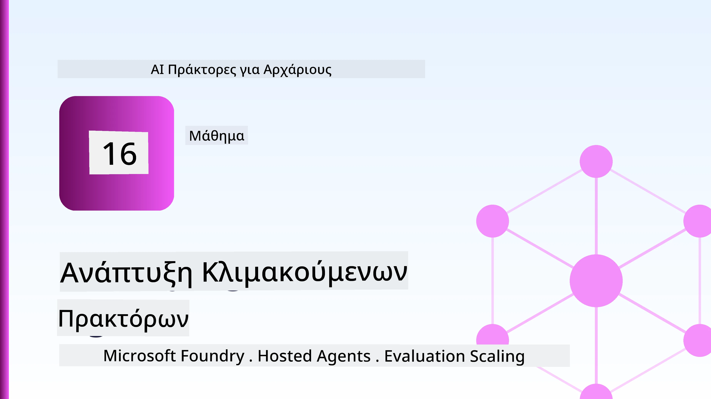
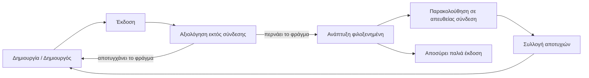
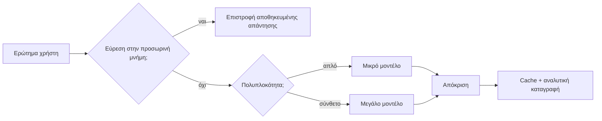
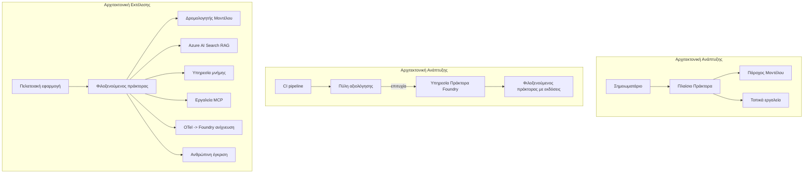

# Ανάπτυξη Κλιμακούμενων Πρακτόρων με το Microsoft Foundry



Μέχρι αυτό το σημείο στο μάθημα έχετε χτίσει πράκτορες που τρέχουν στο φορητό σας υπολογιστή, μέσα σε ένα σημειωματάριο, ενεργοποιούμενοι από το `az login` και μερικές μεταβλητές περιβάλλοντος. Αυτή είναι ακριβώς η σωστή μέθοδος για να μάθετε. Δεν είναι όμως ο κατάλληλος τρόπος να τρέχει ένας πράκτορας από τον οποίο εξαρτώνται χιλιάδες πελάτες στις 3 π.μ.

Αυτό το μάθημα αφορά το χάσμα ανάμεσα στο "δουλεύει στο μηχάνημά μου" και το "δουλεύει, αξιόπιστα και οικονομικά, στην παραγωγή." Κλείνουμε αυτό το χάσμα χρησιμοποιώντας το **Microsoft Foundry** και την **Υπηρεσία Πρακτόρων Microsoft Foundry**, και το κάνουμε χτίζοντας έναν πραγματικό πράκτορα υποστήριξης πελατών που διαθέτει εργαλεία, ανάκτηση, μνήμη, αξιολόγηση και παρακολούθηση.

## Εισαγωγή

Αυτό το μάθημα θα καλύψει:

- Τη διαφορά ανάμεσα σε έναν **πράκτορα πρωτοτύπου** και έναν **ανεπτυγμένο πράκτορα**, και γιατί η μετάβαση αφορά κυρίως όλα όσα *περιβάλλουν* το μοντέλο.
- **Πρότυπα ανάπτυξης** για πράκτορες: φιλοξενούμενοι από τον πελάτη, φιλοξενούμενοι από υπηρεσία (Hosted Agents), και ροές εργασίας με ορχήστρωση.
- Τον **κύκλο ζωής του πράκτορα** στο Microsoft Foundry — δημιουργία, έκδοση, ανάπτυξη, αξιολόγηση, παρατήρηση, απόσυρση.
- **Στρατηγικές κλιμάκωσης**: δρομολόγηση μοντέλου, προσωρινή αποθήκευση, ταυτόχρονη εκτέλεση και σχεδίαση χωρίς κατάσταση.
- **Παρατηρησιμότητα** με OpenTelemetry και καταγραφή Foundry.
- **Βελτιστοποίηση κόστους** μέσω επιλογής μοντέλου, δρομολόγησης και πινάκων αξιολόγησης.
- **Επιχειρησιακές προεκτάσεις**: διακυβέρνηση, ανθρώπινη έγκριση, και ασφαλής λειτουργία διακομιστών MCP στην παραγωγή.

## Στόχοι Μάθησης

Μετά την ολοκλήρωση αυτού του μαθήματος, θα γνωρίζετε πώς να:

- Επιλέξετε το κατάλληλο πρότυπο ανάπτυξης για ένα συγκεκριμένο φόρτο εργασίας πράκτορα.
- Αναπτύξετε έναν πράκτορα στην Υπηρεσία Πρακτόρων Microsoft Foundry ώστε να έχει έκδοση, διακυβέρνηση, και παρατηρησιμότητα.
- Εξοπλίσετε έναν πράκτορα για καταγραφή ιχνών και να συνδέσετε μια γραμμή αξιολόγησης που εκτελείται πριν από κάθε έκδοση.
- Εφαρμόσετε δρομολόγηση μοντέλου και προσωρινή αποθήκευση για να διατηρήσετε τη λανθάνουσα κατάσταση και το κόστος υπό έλεγχο στο κλίμακα.
- Προσθέσετε πύλη ανθρώπινης έγκρισης για ενέργειες υψηλού κινδύνου και να ενσωματώσετε έναν διακομιστή MCP με ασφάλεια στην παραγωγή.

## Προαπαιτούμενα

Αυτό το μάθημα προϋποθέτει ότι έχετε ολοκληρώσει τα προηγούμενα μαθήματα και είστε άνετοι με:

- Τη δημιουργία πρακτόρων με το [Microsoft Agent Framework](../14-microsoft-agent-framework/README.md) (Μάθημα 14).
- Τη [Χρήση Εργαλείων](../04-tool-use/README.md) (Μάθημα 4) και το [Agentic RAG](../05-agentic-rag/README.md) (Μάθημα 5).
- Τη [Μνήμη Πράκτορα](../13-agent-memory/README.md) (Μάθημα 13) και τα [Agentic Protocols / MCP](../11-agentic-protocols/README.md) (Μάθημα 11).
- Την [Παρατηρησιμότητα και Αξιολόγηση](../10-ai-agents-production/README.md) (Μάθημα 10) — αυτό το μάθημα βασίζεται απευθείας σε αυτό.

Θα χρειαστείτε επίσης:

- Μια **συνδρομή Azure** και ένα **έργο Microsoft Foundry** με τουλάχιστον ένα αναπτυγμένο μοντέλο συζήτησης.
- Το **Azure CLI** αυθεντικοποιημένο (`az login`).
- Python 3.12+ και τα πακέτα στο αποθετήριο [`requirements.txt`](../../../requirements.txt).

## Από το Πρωτότυπο στην Παραγωγή: Τι Αλλάζει Πραγματικά

Ένας πράκτορας πρωτοτύπου και ένας πράκτορας παραγωγής μοιράζονται τον ίδιο κύριο βρόχο — συλλογισμός, κλήση εργαλείων, απόκριση. Αυτό που αλλάζει είναι όλα όσα περιβάλλουν αυτόν τον βρόχο. Το μοντέλο αποτελεί ίσως το 20% ενός παραγωγικού πράκτορα· το υπόλοιπο 80% είναι το λειτουργικό πλαίσιο.

| Θέμα | Πρωτότυπο | Παραγωγή |
| --- | --- | --- |
| **Φιλοξενία** | Τρέχει στο σημειωματάριό σας | Τρέχει ως φιλοξενούμενη υπηρεσία, εκδομένη και αναπτυγμένη |
| **Ταυτότητα** | Το `az login` token σας | Διαχειριζόμενη ταυτότητα με scoped RBAC |
| **Κατάσταση** | Στην μνήμη, χάνεται σε επανεκκίνηση | Εξωτερικοποιημένη (κατάστημα νημάτων, υπηρεσία μνήμης) |
| **Σφάλμα** | Βλέπετε το traceback | Επαναλήψεις, fallback, dead-letter, ειδοποιήσεις |
| **Κόστος** | "Είναι μερικά λεπτά" | Παρακολουθείται ανά αίτημα, δρομολογείται, προσωρινή αποθήκευση, προϋπολογισμός |
| **Ποιότητα** | Κρίνετε το αποτέλεσμα με το μάτι | Αξιολογείται αυτόματα πριν από κάθε έκδοση |
| **Εμπιστοσύνη** | Εγκρίνετε κάθε ενέργεια | Πολιτική + άνθρωπος στη διαδικασία για επικίνδυνες ενέργειες |

Κρατήστε αυτόν τον πίνακα στο μυαλό σας. Κάθε ενότητα παρακάτω αντιστοιχεί σε μία από αυτές τις σειρές.

## Πρότυπα Ανάπτυξης Πρακτόρων

Υπάρχουν τρία πρότυπα που θα χρησιμοποιήσετε, συχνά σε συνδυασμό.

### 1. Πράκτορες Φιλοξενούμενοι από Πελάτη

Το αντικείμενο πράκτορα ζει μέσα στη *δική σας* διαδικασία εφαρμογής. Ο κώδικάς σας καλεί τον πάροχο μοντέλου απευθείας· ο βρόχος συλλογισμού τρέχει στην υπηρεσία σας. Αυτό έχει γίνει σε κάθε προηγούμενο μάθημα.

- **Χρησιμοποιήστε το όταν** χρειάζεστε πλήρη έλεγχο στον βρόχο, custom middleware, ή εμβαθύνετε τον πράκτορα μέσα σε υπάρχον backend.
- **Αντίβαρο**: εσείς αναλαμβάνετε το κλιμάκωμα, την κατάσταση, και την ανθεκτικότητα.

### 2. Φιλοξενούμενοι Πράκτορες (Foundry Agent Service)

Ο πράκτορας *καταχωρείται ως πόρος* στο Microsoft Foundry. Το Foundry φιλοξενεί τον βρόχο συλλογισμού, αποθηκεύει νημάτια, επιβάλλει ασφάλεια περιεχομένου και RBAC, και καθιστά τον πράκτορα ορατό στην πύλη Foundry. Η εφαρμογή σας γίνεται πελάτης-εκείνηδη που δημιουργεί νημάτια και διαβάζει απαντήσεις.

- **Χρησιμοποιήστε το όταν** θέλετε ανθεκτικότητα, ενσωματωμένη παρατηρησιμότητα, διακυβέρνηση, και λιγότερη λειτουργική επιφάνεια.
- **Αντίβαρο**: λιγότερος λεπτομερής έλεγχος με αντάλλαγμα μια διαχειριζόμενη χρονική εκτέλεση.

### 3. Ροές Εργασίας Πρακτόρων

Πολλοί πράκτορες (και εργαλεία) συντίθενται σε γράφημα με ρητό έλεγχο ροής — διαδοχικά βήματα, διακλαδώσεις, κόμβους ανθρώπινης έγκρισης, και ανθεκτικά σημεία ελέγχου που μπορούν να παύσουν και να συνεχιστούν. Αυτή είναι η δυνατότητα **Workflows** του Microsoft Agent Framework που εφαρμόζεται σε κλίμακα ανάπτυξης.

- **Χρησιμοποιήστε το όταν** μια μοναδική εργασία εκτείνεται σε πολλούς εξειδικευμένους πράκτορες ή απαιτεί βήμα έγκρισης στη μέση.
- **Αντίβαρο**: περισσότερα κινούμενα μέρη· απαιτεί παρατηρησιμότητα σε επίπεδο ορχήστρωσης.

```mermaid
flowchart TB
    subgraph P1[Φιλοξενούμενο από τον πελάτη]
        A1[Η διαδικασία της εφαρμογής σας] --> M1[Πάροχος μοντέλου]
    end
    subgraph P2[Φιλοξενούμενος πράκτορας]
        A2[Λεπτός πελάτης] --> F2[Υπηρεσία πράκτορα Foundry]
        F2 --> M2[Μοντέλο + Εργαλεία + Αποθήκη νημάτων]
    end
    subgraph P3[Ροή εργασίας πράκτορα]
        A3[Ορχηστρωτής] --> S1[Πράκτορας ταξινόμησης]
        S1 --> S2[Πράκτορας επίλυσης]
        S2 --> H[Κόμβος ανθρώπινης έγκρισης]
        H --> S3[Πράκτορας δράσης]
    end
```



## Ο Κύκλος Ζωής του Πράκτορα στο Microsoft Foundry

Η ανάπτυξη ενός πράκτορα δεν είναι μια μονομερής `push` ενέργεια. Είναι ένας βρόχος, και μοιάζει πολύ με κύκλο έκδοσης λογισμικού γιατί ακριβώς αυτό είναι.



Η βασική ιδέα, προερχόμενη από το [Μάθημα 10](../10-ai-agents-production/README.md): **η αξιολόγηση εκτός σύνδεσης είναι πύλη, όχι σκέψη εκ των υστέρων.** Μια νέα έκδοση πράκτορα δεν κυκλοφορεί αν δεν περάσει τα όρια αξιολόγησής σας. Η παρατηρησιμότητα σε πραγματικό χρόνο τροφοδοτεί τις πραγματικές αποτυχίες πίσω στο offline σετ δοκιμών. Αυτός είναι ο ολόκληρος βρόχος.

## Στρατηγικές Κλιμάκωσης

Η κλιμάκωση ενός πράκτορα διαφέρει από την κλιμάκωση μιας web API χωρίς κατάσταση, γιατί κάθε αίτημα μπορεί να ενεργοποιήσει πολλαπλές δαπανηρές κλήσεις μοντέλου και εργαλείων. Τέσσερις τεχνικές φέρουν το μεγαλύτερο φόρτο.

**Διαχείριση αιτημάτων χωρίς κατάσταση.** Μη διατηρείτε κατάσταση ανά χρήστη στη μνήμη της διαδικασίας. Αποθηκεύστε νήματα συνομιλίας στο κατάστημα νημάτων Foundry ή σε μια υπηρεσία μνήμης ώστε οποιαδήποτε παρουσία να μπορεί να χειριστεί οποιοδήποτε αίτημα. Αυτό επιτρέπει την οριζόντια κλιμάκωση — προσθέστε παρουσίες, χωρίς κολλημένες συνεδρίες.

**Δρομολόγηση μοντέλου.** Δεν χρειάζεται κάθε αίτημα το πιο ικανό (και ακριβό) μοντέλο σας. Δρομολογήστε απλά αιτήματα — κατηγοριοποίηση προθέσεων, σύντομες απαντήσεις — σε μικρό, γρήγορο μοντέλο, και κρατήστε το μεγάλο μοντέλο για πραγματικό συλλογισμό. Ο **Model Router** του Foundry μπορεί να το κάνει αυτό για εσάς, ή μπορείτε να υλοποιήσετε έναν δικό σας ελαφρύ ταξινομητή. Θα φτιάξετε την χειροποίητη έκδοση στο εργαστήριο.

**Προσωρινή αποθήκευση απαντήσεων.** Πολλές ερωτήσεις υποστήριξης είναι σχεδόν διπλότυπες ("πώς επαναφέρω τον κωδικό μου;"). Αποθηκεύστε απαντήσεις σε συχνές ερωτήσεις και εξυπηρετήστε τις χωρίς να καλέσετε το μοντέλο καθόλου. Ακόμη και ένα μέτριο ποσοστό επιτυχίας στην προσωρινή αποθήκευση μειώνει ουσιαστικά κόστος και καθυστέρηση.

**Ταυτόχρονη εκτέλεση και πίεση ροής.** Οι πάροχοι μοντέλων έχουν όρια ρυθμού. Περιορίστε την ταυτόχρονη εκτέλεση, χρησιμοποιήστε επαναλήψεις με εκθετική καθυστέρηση, και αποτύχετε ομαλά (μια ουρά "επεξεργαζόμαστε" υπερτερεί ενός σφάλματος 500).



## Παρατηρησιμότητα στην Παραγωγή

Δεν μπορείτε να λειτουργήσετε κάτι που δεν μπορείτε να δείτε. Όπως καλύφθηκε στο Μάθημα 10, το Microsoft Agent Framework εκπέμπει εγγενώς **OpenTelemetry** ίχνη — κάθε κλήση μοντέλου, εκκίνηση εργαλείου, και βήμα ορχήστρωσης γίνεται span. Στην παραγωγή εξάγετε αυτά τα spans στο Microsoft Foundry (ή οποιοδήποτε συμβατό backend OTel) ώστε να μπορείτε:

- Να ανιχνεύσετε μια μεμονωμένη καταγγελία πελάτη από άκρο σε άκρο σε κάθε κλήση μοντέλου και εργαλείου.
- Να παρακολουθείτε τα p50/p95 χρονικά διαστήματα αναμονής και το κόστος ανά αίτημα με την πάροδο του χρόνου.
- Να ειδοποιήστε για αιχμές σφαλμάτων και ανωμαλίες κόστους πριν τις παρατηρήσουν οι χρήστες σας (ή η οικονομική ομάδα σας).

```python
from agent_framework.observability import get_tracer

tracer = get_tracer()

with tracer.start_as_current_span("support_request") as span:
    span.set_attribute("customer.tier", "enterprise")
    span.set_attribute("routed.model", "gpt-5-nano")
    # η εκτέλεση του πράκτορα παρακολουθείται αυτόματα μέσα σε αυτό το διάστημα
```

Χαρακτηριστικά όπως `customer.tier` και `routed.model` μετατρέπουν έναν όγκο ιχνών σε απαντήσιμες ερωτήσεις ("κατευθύνονται πολύ συχνά οι πελάτες επιχειρήσεων στο μικρό μοντέλο;").

## Βελτιστοποίηση Κόστους

Το κόστος σε παραγωγικούς πράκτορες κυριαρχείται από τα tokens. Τρεις μοχλοί, κατά σειρά επιρροής:

1. **Επιλέξτε το σωστό μέγεθος μοντέλου.** Ένα μικρό μοντέλο που περνά την πύλη αξιολόγησης είναι σχεδόν πάντα φθηνότερο από ένα μεγάλο που επίσης περνά. Χρησιμοποιήστε την αξιολόγηση για να *αποδείξετε* ότι το μικρό μοντέλο είναι αρκετά καλό αντί να επιλέγετε το μεγαλύτερο από προφύλαξη.
2. **Δρομολογήστε ανάλογα με τη συνθετότητα.** Όπως παραπάνω — πληρώστε τιμή μεγάλου μοντέλου μόνο για αιτήματα που χρειάζονται συλλογισμό μεγάλου μοντέλου.
3. **Κάντε επιθετική προσωρινή αποθήκευση.** Η φθηνότερη κλήση μοντέλου είναι αυτή που δεν κάνετε ποτέ.

Οι πύλες αξιολόγησης και ο έλεγχος κόστους είναι η ίδια πειθαρχία που κοιτάζεται από δύο γωνίες: η αξιολόγηση δείχνει το *πάτωμα ποιότητας*, η δρομολόγηση και η προσωρινή αποθήκευση σας κρατούν όσο πιο κοντά γίνεται στο *κόστος* αυτού του πατώματος.

## Επιχειρησιακές Εκτιμήσεις Ανάπτυξης

**Διακυβέρνηση.** Οι Φιλοξενούμενοι Πράκτορες κληρονομούν το RBAC, την ασφάλεια περιεχομένου και το audit logging του Foundry. Δώστε σε κάθε πράκτορα διαχειριζόμενη ταυτότητα με τα λιγότερα προνόμια που χρειάζεται — δικαιώματα μόνο ανάγνωσης στη βάση γνώσης, οριοθετημένη πρόσβαση στο API εισιτηρίων, τίποτα παραπάνω.

**Άνθρωπος στη διαδικασία.** Ορισμένες ενέργειες είναι πολύ κρίσιμες για να αυτοματοποιηθούν πλήρως — έκδοση επιστροφής χρημάτων, διαγραφή λογαριασμού, κλιμάκωση σε νομική ομάδα. Το Microsoft Agent Framework υποστηρίζει **εργαλεία που απαιτούν έγκριση**: ο πράκτορας προτείνει την ενέργεια, η εκτέλεση παγώνει, ένας άνθρωπος εγκρίνει ή απορρίπτει, και η ροή εργασίας συνεχίζει. Είδατε τον πρωτόγονο αυτό μηχανισμό στο [Μάθημα 6](../06-building-trustworthy-agents/README.md); εδώ τον αναπτύσσετε.

**MCP στην παραγωγή.** Το [MCP](../11-agentic-protocols/README.md) επιτρέπει στον πράκτορά σας να καταναλώνει εξωτερικά εργαλεία μέσω ενός τυποποιημένου interface. Στην παραγωγή, αντιμετωπίστε κάθε διακομιστή MCP ως μη αξιόπιστο όριο: παγιώστε την έκδοση διακομιστή, τρέξτε τον με scoped identity, επικυρώστε τις εξόδους του, και μην εκθέτετε ποτέ μυστικά σε αυτόν. Ένας διακομιστής MCP είναι εξάρτηση, και οι εξαρτήσεις επιδιορθώνονται, ελέγχονται και περιορίζονται ρυθμικά.



Αυτά τα τρία διαγράμματα — ανάπτυξη, ανάπτυξη, χρόνος εκτέλεσης — είναι ο ίδιος πράκτορας σε τρία στάδια της ζωής του. Το εργαστήριο που ακολουθεί σας καθοδηγεί να τον χτίσετε.

## Πρακτικό Εργαστήριο: Πράκτορας Υποστήριξης Πελατών Έτοιμος για Παραγωγή

Ανοίξτε το [`code_samples/16-python-agent-framework.ipynb`](./code_samples/16-python-agent-framework.ipynb) και δουλέψτε το από την αρχή μέχρι το τέλος. Θα συναρμολογήσετε έναν **πράκτορα υποστήριξης πελατών Contoso** με κάθε ανησυχία παραγωγής συνδεδεμένη:

1. **Κλήση εργαλείων** — αναζητήστε κατάσταση παραγγελίας και ανοίξτε εισιτήρια υποστήριξης.
2. **RAG** — απαντήσεις σε ερωτήσεις πολιτικής από βάση γνώσης (Azure AI Search, με fallback στη μνήμη ώστε το σημειωματάριο να τρέχει χωρίς πόρο Search).
3. **Μνήμη** — θυμηθείτε τον πελάτη κατά τις γύρους της συνομιλίας.
4. **Δρομολόγηση μοντέλου** — ένας ταξινομητής συνθετότητας δρομολογεί κάθε αίτημα σε μικρό ή μεγάλο μοντέλο.
5. **Προσωρινή αποθήκευση απαντήσεων** — επαναλαμβανόμενες ερωτήσεις εξυπηρετούνται από cache.
6. **Ανθρώπινη έγκριση** — επιστροφές χρημάτων πάνω από ένα όριο παγώνουν για ανθρώπινη υπογραφή.
7. **Γραμμή αξιολόγησης** — ένα μικρό σετ offline δοκιμών βαθμολογεί τον πράκτορα και λειτουργεί ως πύλη έκδοσης.
8. **Παρατηρησιμότητα** — καταγραφή OpenTelemetry γύρω από κάθε αίτημα.

### Περιήγηση

Το σημειωματάριο είναι οργανωμένο ώστε κάθε ανησυχία παραγωγής να είναι μια αυτόνομη, εκτελέσιμη ενότητα. Η καρδιά του είναι ο χειριστής αιτημάτων με δρομολόγηση συν προσωρινή αποθήκευση:

```python
async def handle_support_request(query: str, customer_id: str) -> str:
    # 1. Εξυπηρετήστε από την cache όταν μπορούμε.
    cached = response_cache.get(normalize(query))
    if cached:
        return cached

    # 2. Δρομολογήστε ανάλογα με την πολυπλοκότητα για να ελέγξετε το κόστος.
    model = "gpt-5-nano" if is_simple(query) else "gpt-5-mini"

    # 3. Εκτελέστε τον πράκτορα μέσα σε ένα trace span για παρατηρησιμότητα.
    with tracer.start_as_current_span("support_request") as span:
        span.set_attribute("routed.model", model)
        span.set_attribute("customer.id", customer_id)
        response = await support_agent.run(query, model=model)

    # 4. Αποθηκεύστε στην cache και επιστρέψτε.
    response_cache.set(normalize(query), response.text)
    return response.text
```

Η πύλη αξιολόγησης που προστατεύει μια έκδοση μοιάζει έτσι:

```python
async def evaluation_gate(agent, test_cases, threshold: float = 0.8) -> bool:
    passed = 0
    for case in test_cases:
        result = await agent.run(case["input"])
        if score_response(result.text, case["expected"]) >= 0.8:
            passed += 1
    pass_rate = passed / len(test_cases)
    print(f"Evaluation pass rate: {pass_rate:.0%} (gate: {threshold:.0%})")
    return pass_rate >= threshold  # ανάπτυξη μόνο αν η πύλη περάσει
```

Διαβάστε κάθε γραμμή — το σημειωματάριο κρατά τις πρωτόγονες λειτουργίες επίτηδες μικρές ώστε να μην κρύβεται τίποτα πίσω από μια κλήση πλαισίου εργασίας.

## Επικύρωση Αναπτυγμένου Πράκτορα με Έλεγχους Καπνού

Η πύλη αξιολόγησης από πάνω τρέχει *εκτός σύνδεσης* ενάντια στο αντικείμενο πράκτορά σας. Μόλις ο πράκτορας αναπτυχθεί ως Φιλοξενούμενος Πράκτορας, χρειάζεστε έναν ακόμα, ακόμα πιο οικονομικό έλεγχο: **αν το αναπτυγμένο endpoint απαντά πραγματικά;**

Η «επιτυχής» ανάπτυξη αποδεικνύει μόνο ότι το επίπεδο ελέγχου αποδέχτηκε τον ορισμό — δεν αποδεικνύει ότι ο πράκτορας ανταποκρίνεται. Μια χαμένη εξάρτηση, μια κακή δρομολόγηση μοντέλου, ή μια ληγμένη σύνδεση μπορούν να αφήσουν μια πράσινη ανάπτυξη να μη δίνει τίποτα πίσω. Ένας **έλεγχος καπνού** το εντοπίζει μέσα σε δευτερόλεπτα, σε κάθε ανάπτυξη, χωρίς το κόστος πλήρους αξιολόγησης.

Αυτό το αποθετήριο παρέχει μια έτοιμη προς χρήση γραμμή ελέγχου καπνού βασισμένη στην GitHub Action [AI Smoke Test](https://github.com/marketplace/actions/ai-smoke-test):

- **Κατάλογος** — το [`tests/lesson-16-smoke-tests.json`](../../../tests/lesson-16-smoke-tests.json) περιέχει prompts και διατυπώσεις για τον πράκτορα υποστήριξης Contoso (στοιχειωμένες απαντήσεις πολιτικής, αναζήτηση παραγγελίας, παραμονή στο θέμα, και συνέχεια νήματος πολλαπλών γύρων). Κατάλογοι για πράκτορες άλλων μαθημάτων βρίσκονται δίπλα — δείτε το [`tests/README.md`](../tests/README.md).
- **Ροή εργασίας** — το [`.github/workflows/smoke-test.yml`](../../../.github/workflows/smoke-test.yml) συνδέεται με Azure OIDC και στέλνει POST κάθε prompt στο endpoint Responses του πράκτορα, αποτυγχάνοντας τη δουλειά σε κάθε λάθος διατύπωση.

```yaml
- name: Smoke-test hosted agent
  uses: JFolberth/ai-smoketest@v1
  with:
    project_endpoint: ${{ inputs.project_endpoint }}
    agent_name: ContosoSupportAgent
    tests_file: tests/lesson-16-smoke-tests.json
```


Εκτελέστε το από την καρτέλα **Actions** μόλις αναπτυχθεί ο agent σας, παρέχοντας το endpoint του έργου Foundry και το όνομα του agent. Η ομοσπονδιακή ταυτότητα χρειάζεται το ρόλο **Azure AI User** στο πεδίο έργου Foundry. Σκεφτείτε τα στρώματα σαν μια πυραμίδα: τα smoke tests (προσβάσιμα και ανταποκρίνονται;) τρέχουν σε κάθε ανάπτυξη, η εκτός σύνδεσης αξιολόγηση (αρκετά καλή για αποστολή;) τρέχει πριν την προώθηση, και η διαρκής αξιολόγηση (πώς τα πάει στον πραγματικό κόσμο;) τρέχει συνεχώς.

## Έλεγχος Γνώσης

Δοκιμάστε την κατανόησή σας πριν προχωρήσετε στην ανάθεση.

**1. Περίπου πόσο από έναν παραγωγικό agent είναι "το μοντέλο", και τι είναι το υπόλοιπο;**

<details>
<summary>Απάντηση</summary>

Το μοντέλο είναι μειονότητα του συστήματος — συχνά αναφέρεται περίπου στο 20%. Το υπόλοιπο είναι ο λειτουργικός σκελετός: φιλοξενία και έκδοση, ταυτότητα και RBAC, εξωτερική κατάσταση, διαχείριση αποτυχίας, παρακολούθηση κόστους, αξιολόγηση και έλεγχοι με ανθρώπινη παρέμβαση. Η μετάβαση σε παραγωγή αφορά κυρίως το χτίσιμο του περιβάλλοντος *γύρω* από τον βρόχο λογισμικού.
</details>

**2. Πότε θα επιλέγατε Hosted Agent αντί για client-hosted agent;**

<details>
<summary>Απάντηση</summary>

Όταν θέλετε ένα διαχειριζόμενο runtime με ενσωματωμένη ανθεκτικότητα (νήματα που παραμένουν και μπορούν να συνεχιστούν), παρατηρησιμότητα, ασφάλεια περιεχομένου και RBAC, και είστε διατεθειμένοι να θυσιάσετε κάποιον έλεγχο χαμηλού επιπέδου στον βρόχο λογισμικού για λιγότερη λειτουργική επιφάνεια. Client-hosted προτιμάται όταν χρειάζεστε πλήρη έλεγχο στον βρόχο ή ενσωματώνετε τον agent σε υπάρχον backend.
</details>

**3. Γιατί ένας κλιμακούμενος agent πρέπει να είναι stateless στη δική του μνήμη διεργασίας;**

<details>
<summary>Απάντηση</summary>

Έτσι οποιαδήποτε παρουσία μπορεί να διαχειριστεί οποιοδήποτε αίτημα, το οποίο επιτρέπει οριζόντια κλιμάκωση χωρίς συσχετιζόμενες συνεδρίες. Η κατάσταση συνομιλίας ανά χρήστη εξωτερικεύεται σε αποθήκη νημάτων ή υπηρεσία μνήμης. Εάν η κατάσταση ζούσε στη μνήμη διεργασίας, θα τη χάνατε στην επανεκκίνηση και δεν θα μπορούσατε να διανείμετε τον φόρτο ελεύθερα.
</details>

**4. Ποιο πρόβλημα λύνει το model routing, και πώς σχετίζεται με την αξιολόγηση;**

<details>
<summary>Απάντηση</summary>

Το routing στέλνει απλά αιτήματα σε μικρό, φθηνό, γρήγορο μοντέλο και διατηρεί το μεγάλο μοντέλο για πραγματική λογική σκέψη, ελέγχοντας τόσο τη λανθάνουσα κατάσταση όσο και το κόστος. Σχετίζεται με την αξιολόγηση γιατί αυτή *αποδεικνύει* ότι το μικρό μοντέλο είναι αρκετά καλό για μια κατηγορία αιτημάτων — το routing χωρίς αξιολόγηση είναι εικασία.
</details>

**5. Τι είναι μια "πύλη αξιολόγησης" και πού τοποθετείται στον κύκλο ζωής;**

<details>
<summary>Απάντηση</summary>

Μια πύλη αξιολόγησης εκτελεί ένα offline σύνολο δοκιμών σε νέα έκδοση agent και μπλοκάρει την ανάπτυξη αν το ποσοστό επιτυχίας δεν ξεπεράσει ένα όριο. Τοποθετείται ανάμεσα στο "version" και το "deploy" στον κύκλο ζωής, καθιστώντας την ποιότητα προαπαιτούμενο για κυκλοφορία αντί να ελέγχεται μετά την αποστολή.
</details>

**6. Γιατί ένας MCP server πρέπει να θεωρείται ως μη αξιόπιστο όριο σε παραγωγή;**

<details>
<summary>Απάντηση</summary>

Επειδή είναι εξωτερική εξάρτηση που καλεί ο agent σας. Πρέπει να πινάρετε την έκδοσή του, να τον τρέχετε με scoped ταυτότητα, να επικυρώνετε τις εξόδους, να περιορίζετε το ρυθμό, και να μην αποκαλύπτετε ποτέ μυστικά — την ίδια πειθαρχία που εφαρμόζετε σε κάθε τρίτο μέρος εξάρτησης. Οι έξοδοι του ρέουν στη λογική του agent σας, οπότε η μη επικυρωμένη εμπιστοσύνη είναι κίνδυνος ασφάλειας.
</details>

**7. Ποια μεμονωμένη αλλαγή έχει συνήθως τον μεγαλύτερο αντίκτυπο στο κόστος παραγωγικού agent, και γιατί;**

<details>
<summary>Απάντηση</summary>

Το σωστό μέγεθος του μοντέλου — χρησιμοποιώντας το μικρότερο μοντέλο που περνάει την πύλη αξιολόγησής σας. Το κόστος κυριαρχείται από τα tokens, και ένα μικρότερο μοντέλο που καλύπτει το επίπεδο ποιότητας είναι σχεδόν πάντα φθηνότερο από ένα μεγαλύτερο. Η αποθήκευση στην cache και το routing μειώνουν περαιτέρω το κόστος, αλλά η επιλογή του σωστού βασικού μοντέλου έχει τη μεγαλύτερη πρώτη επίδραση.
</details>

**8. Τι ρόλο παίζουν χαρακτηριστικά span όπως `customer.tier` και `routed.model` στην παρατηρησιμότητα;**

<details>
<summary>Απάντηση</summary>

Μετατρέπουν ωμές ιχνηλασίες σε απαντήσιμες επιχειρηματικές ερωτήσεις. Χωρίς χαρακτηριστικά έχετε έναν τοίχο από spans· με αυτά μπορείτε να ρωτήσετε "οι επιχειρηματικοί πελάτες κατευθύνονται πολύ συχνά στο μικρό μοντέλο;" ή "ποιο μοντέλο διαχειρίζεται τα πιο αργά αιτήματά μας;" Τα χαρακτηριστικά είναι ο τρόπος που τεμαχίζετε τη τηλεμετρία κατά τις διαστάσεις που έχουν σημασία για τη λειτουργία σας.
</details>

## Ανάθεση

Πάρτε τον agent υποστήριξης πελατών από το εργαστήριο και ενισχύστε τον για ένα συγκεκριμένο σενάριο: **agent υποστήριξης χρέωσης συνδρομών για μια εταιρεία SaaS.**

Η υποβολή σας πρέπει να:

1. **Αντικαταστήστε τα εργαλεία** με σχετικά με τη χρέωση: `get_subscription_status`, `get_invoice`, και `issue_credit` (πιστώσεις άνω των $50 απαιτούν ανθρώπινη έγκριση).
2. **Προσθέστε τρία RAG έγγραφα** που καλύπτουν την πολιτική επιστροφών της εταιρείας, τον κύκλο χρέωσης και την πολιτική ακύρωσης.
3. **Επεκτείνετε το σύνολο αξιολόγησης** σε τουλάχιστον οκτώ περιπτώσεις, συμπεριλαμβανομένων τουλάχιστον δύο που *πρέπει* να ενεργοποιήσουν τη διαδρομή ανθρώπινης έγκρισης, και επιβεβαιώστε ότι η πύλη αξιολόγησής σας περνά ή αποτυγχάνει σωστά.
4. **Προσθέστε μία αναφορά κόστους**: μετά την εκτέλεση δέκα μικτών ερωτημάτων μέσω του agent, εκτυπώστε πόσα πήγαν στο μικρό μοντέλο, πόσα στο μεγάλο μοντέλο και πόσα εξυπηρετήθηκαν από cache.

Γράψτε μια σύντομη παράγραφο (σε κελί markdown) που εξηγεί ποιον κανόνα δρομολόγησης μοντέλου επιλέξατε και πώς θα τον επικυρώνατε με πραγματική κίνηση. Δεν υπάρχει μία σωστή απάντηση — γίνεται αξιολόγηση αν οι ανησυχίες παραγωγής συνδέονται συνεκτικά.

## Σύνοψη

Σε αυτό το μάθημα μετακινήσατε έναν agent από πρωτότυπο σε παραγωγή με το Microsoft Foundry:

- Η μετάβαση σε παραγωγή αφορά κυρίως τον **λειτουργικό σκελετό** γύρω από το μοντέλο — φιλοξενία, ταυτότητα, κατάσταση, διαχείριση αποτυχίας, κόστος, ποιότητα και εμπιστοσύνη.
- Μάθατε τα τρία **πρότυπα ανάπτυξης** — client-hosted, Hosted Agents, και Agent Workflows — και πότε ισχύει το καθένα.
- Περπατήσατε τον **κύκλο ζωής του agent**, όπου η εκτός σύνδεσης **αξιολόγηση λειτουργεί ως πύλη απελευθέρωσης** και η ενεργή παρατηρησιμότητα τροφοδοτεί τις αποτυχίες πίσω στο σύνολο δοκιμών.
- Εφαρμόσατε **στρατηγικές κλιμάκωσης** — σχεδιασμό χωρίς κατάσταση, δρομολόγηση μοντέλου, caching, και περιορισμένη ταυτόχρονη εκτέλεση — και συνδέσατε τα με **βελτιστοποίηση κόστους**.
- Συνδέσατε **επιχειρηματικούς ελέγχους**: RBAC, ανθρώπινη έγκριση, και ασφαλή ενσωμάτωση MCP για παραγωγή.
- Δημιουργήσατε έναν **παραγωγής-έτοιμο agent υποστήριξης πελατών** που συνδέει όλες αυτές τις ανησυχίες σε εκτελέσιμο κώδικα.

Το επόμενο μάθημα κάνει το αντίθετο ταξίδι: αντί να κλιμακώνετε agents στο σύννεφο, θα τα κατεβάσετε σε ένα μόνο μηχάνημα προγραμματιστή και θα τα τρέξετε εντελώς τοπικά.

## Επιπλέον Πηγές

- <a href="https://learn.microsoft.com/azure/ai-foundry/what-is-azure-ai-foundry" target="_blank">Τεκμηρίωση Microsoft Foundry</a>
- <a href="https://learn.microsoft.com/azure/ai-foundry/agents/overview" target="_blank">Επισκόπηση Υπηρεσίας Agent Microsoft Foundry</a>
- <a href="https://learn.microsoft.com/en-us/agent-framework/overview/?wt.mc_id=youtube_26688_organicsocial_reactor&pivots=programming-language-python" target="_blank">Microsoft Agent Framework</a>
- <a href="https://learn.microsoft.com/azure/ai-foundry/concepts/model-router" target="_blank">Model Router στο Microsoft Foundry</a>
- <a href="https://learn.microsoft.com/azure/search/search-what-is-azure-search" target="_blank">Azure AI Search</a>
- <a href="https://opentelemetry.io/" target="_blank">OpenTelemetry</a>
- <a href="https://github.com/marketplace/actions/ai-smoke-test" target="_blank">AI Smoke Test GitHub Action</a>
- <a href="https://modelcontextprotocol.io/" target="_blank">Model Context Protocol (MCP)</a>

## Προηγούμενο Μάθημα

[Building Computer Use Agents (CUA)](../15-browser-use/README.md)

## Επόμενο Μάθημα

[Creating Local AI Agents](../17-creating-local-ai-agents/README.md)

---

<!-- CO-OP TRANSLATOR DISCLAIMER START -->
**Αποποίηση ευθυνών**:
Αυτό το έγγραφο έχει μεταφραστεί χρησιμοποιώντας την υπηρεσία μετάφρασης με τεχνητή νοημοσύνη [Co-op Translator](https://github.com/Azure/co-op-translator). Ενώ επιδιώκουμε την ακρίβεια, παρακαλούμε να έχετε υπόψη ότι οι αυτοματοποιημένες μεταφράσεις ενδέχεται να περιέχουν λάθη ή ανακρίβειες. Το πρωτότυπο έγγραφο στη μητρική του γλώσσα πρέπει να θεωρείται η αυθεντική πηγή. Για κρίσιμες πληροφορίες, συνιστάται επαγγελματική ανθρώπινη μετάφραση. Δεν φέρουμε ευθύνη για τυχόν παρεξηγήσεις ή λανθασμένες ερμηνείες που προκύπτουν από τη χρήση αυτής της μετάφρασης.
<!-- CO-OP TRANSLATOR DISCLAIMER END -->