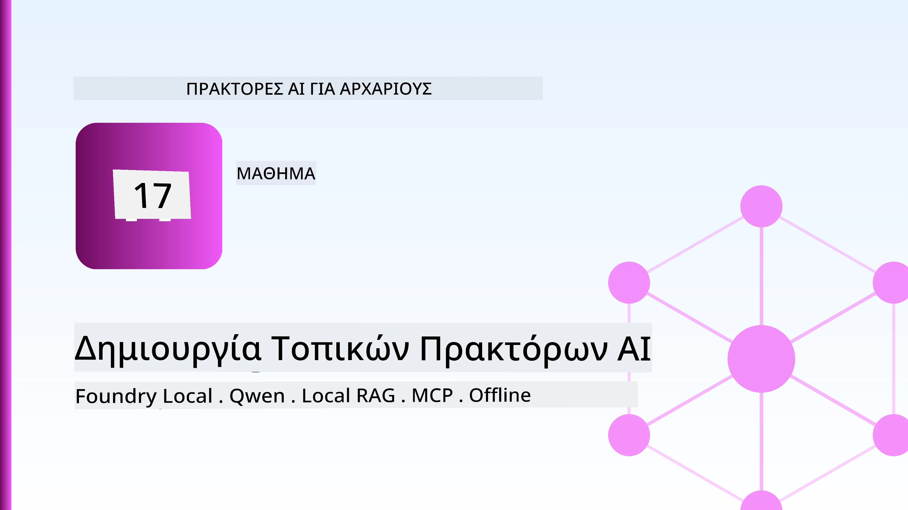
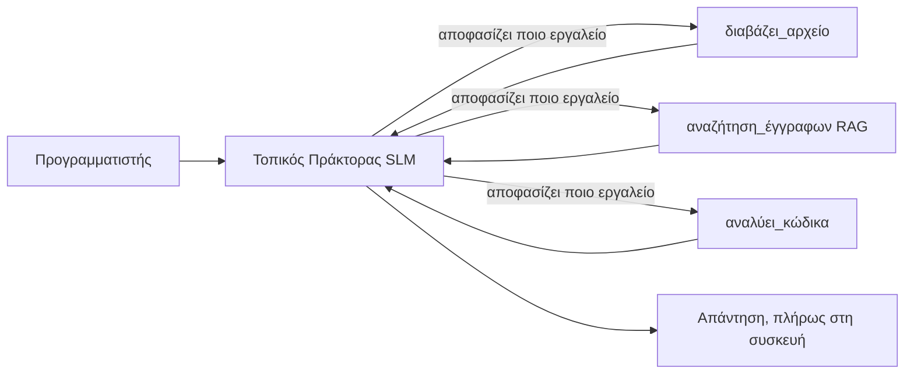
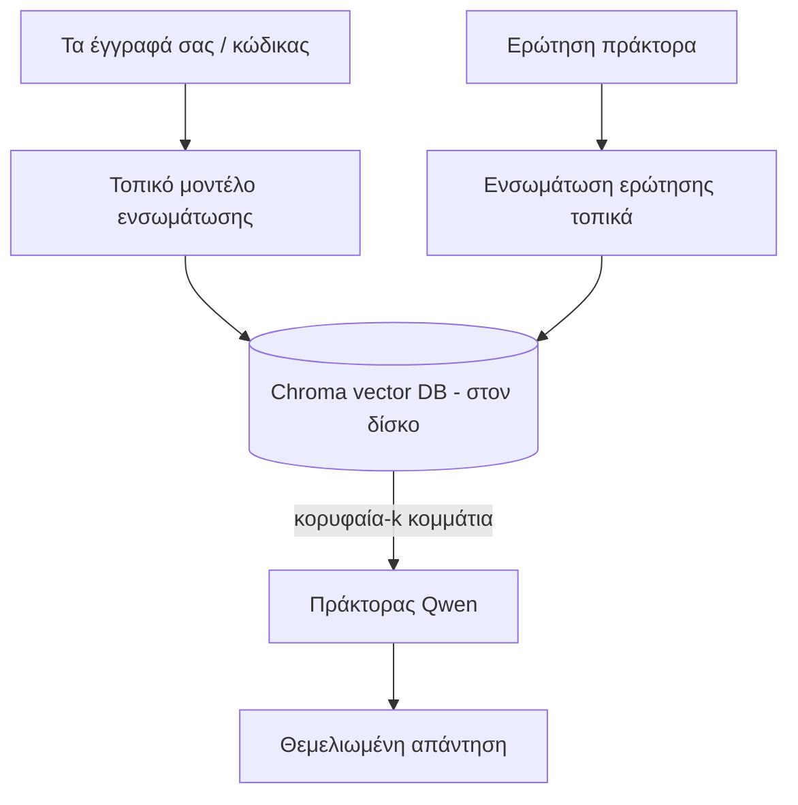
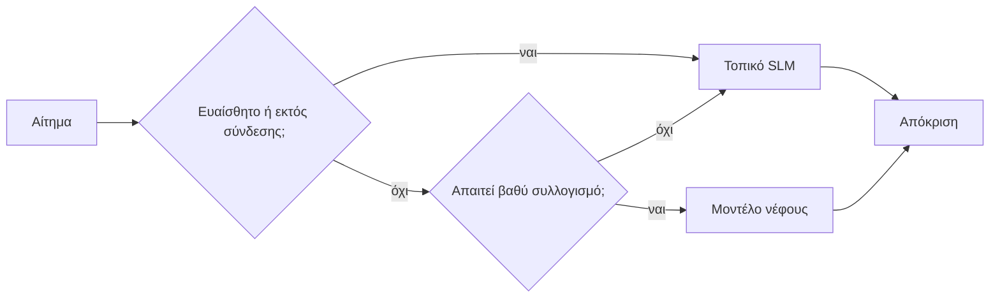

# Δημιουργία Τοπικών Πρακτόρων AI με τη Χρήση του Microsoft Foundry Local και Qwen



Το προηγούμενο μάθημα κλιμάκωσε τους πράκτορες *στον* νέφο. Αυτός τους φέρνει *κάτω* σε ένα μόνο μηχάνημα. Στο τέλος θα έχετε έναν λειτουργικό βοηθό μηχανικού που κάνει λογική, καλεί εργαλεία, διαβάζει τα αρχεία σας και αναζητά την τεκμηρίωσή σας — **χωρίς καμία κλήση συμπερασμού στο νέφος.**

Γιατί θα το θέλατε αυτό; Τρεις λόγοι που εμφανίζονται συνεχώς στην πραγματική μηχανική εργασία:

- **Απόρρητο.** Ο κώδικας και τα έγγραφα δεν απομακρύνονται ποτέ από το μηχάνημα. Δεν περνά καμία προτροπή, απόσπασμα ή δεδομένα πελάτη στο δίκτυο.
- **Κόστος.** Ο τοπικός συμπερασμός δεν έχει χρέωση ανά τοκέν. Μπορείτε να επαναλάβετε όλη μέρα με το κόστος του ηλεκτρικού.
- **Εκτός σύνδεσης.** Σε αεροπλάνο, σε ασφαλή εγκατάσταση ή κατά τη διάρκεια διακοπής, ο πράκτορας λειτουργεί ακόμα.

Η παγίδα είναι ότι ανταλλάσσετε ένα μοντέλο νέφους αιχμής με ένα **Μικρό Μοντέλο Γλώσσας (SLM)** που τρέχει στον CPU, GPU ή NPU σας. Αυτό το μάθημα αφορά τη δημιουργία πρακτόρων που είναι *καλοί* μέσα σε αυτό το περιορισμό αντί να προσποιούνται ότι ο περιορισμός δεν υπάρχει.

## Εισαγωγή

Αυτό το μάθημα θα καλύψει:

- **Μικρά Μοντέλα Γλώσσας (SLMs)** — τι είναι, πού ξεχωρίζουν και πού όχι.
- **Microsoft Foundry Local** — ένα runtime που κατεβάζει και εξυπηρετεί μοντέλα τοπικά μέσω ενός **OpenAI-συμβατού API**.
- **Μοντέλα κλήσης λειτουργιών Qwen** — SLMs που παράγουν αξιόπιστες κλήσεις εργαλείων, που κάνουν τους τοπικούς *πράκτορες* (όχι μόνο την τοπική συνομιλία) εφικτούς.
- **Τοπικά εργαλεία, τοπικό RAG, και τοπικό MCP** — δίνοντας στον πράκτορα δυνατότητα χωρίς το νέφος.
- **Υβριδικά μοτίβα** — πότε να διατηρούμε τα πράγματα τοπικά και πότε να απευθυνόμαστε στο νέφος.

## Στόχοι Μάθησης

Μετά την ολοκλήρωση αυτού του μαθήματος, θα γνωρίζετε πώς να:

- Εξηγείτε τις ανταλλαγές των SLMs και να επιλέγετε κατάλληλες περιπτώσεις χρήσης τοπικών πρακτόρων.
- Εξυπηρετείτε ένα μοντέλο Qwen τοπικά με Foundry Local και να συνδέεστε σε αυτό μέσω του OpenAI-συμβατού endpoint.
- Δημιουργείτε έναν πράκτορα κλήσης εργαλείων που τρέχει πλήρως στον υπολογιστή εργασίας σας.
- Προσθέτετε τοπικό RAG πάνω από τα δικά σας έγγραφα χρησιμοποιώντας μια τοπική βάση δεδομένων διανυσμάτων (Chroma).
- Συνδέετε τον πράκτορα με έναν τοπικό MCP server και να σκεφτείτε υβριδικούς τοπικούς/νέφους σχεδιασμούς.

## Προαπαιτούμενα

Αυτό το μάθημα υποθέτει ότι έχετε ολοκληρώσει τα προηγούμενα μαθήματα και είστε άνετοι με:

- [Χρήση Εργαλείων](../04-tool-use/README.md) (Μάθημα 4) και [Agentic RAG](../05-agentic-rag/README.md) (Μάθημα 5).
- [Agentic Πρωτόκολλα / MCP](../11-agentic-protocols/README.md) (Μάθημα 11).
- Το [Microsoft Agent Framework](../14-microsoft-agent-framework/README.md) (Μάθημα 14).

Θα χρειαστείτε επίσης:

- Έναν σταθμό εργασίας για προγραμματισμό. **8 GB RAM είναι ένα ρεαλιστικό ελάχιστο**· 16 GB+ είναι άνετα. Μια GPU ή NPU βοηθά αλλά δεν είναι υποχρεωτική.
- Εγκατεστημένο το **Microsoft Foundry Local** (βλέπε την ενότητα ρύθμισης παρακάτω).
- Python 3.12+ και τα πακέτα από το αποθετήριο [`requirements.txt`](../../../requirements.txt), μαζί με `foundry-local-sdk`, `openai`, και `chromadb` για αυτό το μάθημα.

## Μικρά Μοντέλα Γλώσσας: Το Σωστό Εργαλείο για Τοπική Εργασία

Ένα μοντέλο αιχμής νέφους έχει εκατοντάδες δισεκατομμύρια παραμέτρους και πίσω του ένα κέντρο δεδομένων. Ένα SLM έχει λίγα δισεκατομμύρια παραμέτρους και πρέπει να χωράει στη RAM του φορητού σας υπολογιστή. Αυτή η διαφορά θέτει σαφείς προσδοκίες.

**Τα SLMs είναι καλά σε:**

- Διαρθρωμένες, περιορισμένες εργασίες — ταξινόμηση, εξαγωγή, περίληψη γνωστού εγγράφου.
- **Κλήση εργαλείων** — απόφαση ποια λειτουργία να καλέσει και με ποια ορίσματα.
- Γρήγορη, φτηνή, ιδιωτική επανάληψη με τα δικά σας δεδομένα.

**Τα SLMs είναι πιο αδύναμα σε:**

- Ανοιχτού τύπου, πολυ-hop λογισμούς σε μεγάλο πλαίσιο.
- Ευρύτητας γνώση του κόσμου (έχουν δει λιγότερα και ξεχνούν περισσότερα).

Η νικηφόρα στρατηγική για τοπικούς πράκτορες είναι: **άφησε το SLM να συντονίζει και άφησε τα εργαλεία να κάνουν τη βαριά δουλειά.** Το μοντέλο δεν χρειάζεται να *γνωρίζει* τον κώδικά σου — χρειάζεται να ξέρει πότε να καλέσει `read_file` και `search_docs`. Αυτό παίζει κατευθείαν στα δυνατά σημεία ενός SLM.



## Microsoft Foundry Local

Το **Microsoft Foundry Local** είναι ένα ελαφρύ runtime που κατεβάζει, διαχειρίζεται και εξυπηρετεί μοντέλα εξ ολοκλήρου στο μηχάνημά σας. Το πιο σημαντικό χαρακτηριστικό για εμάς είναι ότι εκθέτει ένα **OpenAI-συμβατό HTTP endpoint** — που σημαίνει πως το OpenAI SDK και ο OpenAI client του Microsoft Agent Framework δουλεύουν εναντίον του απλά αλλάζοντας το `base_url`. Όλα όσα μάθατε για τη δημιουργία πρακτόρων μεταφέρονται απευθείας· μόνο το endpoint μετακινείται από το νέφος στο `localhost`.

Το Foundry Local επίσης επιλέγει αυτόματα την καλύτερη έκδοση ενός μοντέλου για το υλικό σας — μια CPU έκδοση, μια CUDA/GPU έκδοση ή μια NPU έκδοση — έτσι δεν χρειάζεται να βελτιστοποιείτε ανά μηχάνημα με το χέρι.

### Ρύθμιση

Εγκαταστήστε το Foundry Local (βλ. την [τεκμηρίωση](https://learn.microsoft.com/azure/ai-foundry/foundry-local/) για το λειτουργικό σας σύστημα), και μετά επιβεβαιώστε ότι λειτουργεί:

```bash
# Εγκαταστήστε (παράδειγμα· ακολουθήστε τα έγγραφα για την πλατφόρμα σας)
winget install Microsoft.FoundryLocal      # Windows
# brew install microsoft/foundrylocal/foundrylocal   # macOS

# Κατεβάστε και εκτελέστε ένα μοντέλο Qwen, στη συνέχεια ξεκινήστε την τοπική υπηρεσία
foundry model run qwen2.5-7b-instruct
foundry service status
```

Μόλις η υπηρεσία τρέχει έχετε ένα τοπικό, OpenAI-συμβατό endpoint (συνήθως `http://localhost:PORT/v1`). Το notebook χρησιμοποιεί το `foundry-local-sdk` για να ανακαλύψει αυτόματα το endpoint, έτσι δεν χρειάζεται να δηλώσετε τον αριθμό port χειροκίνητα.

## Κλήση Λειτουργιών Qwen: Γιατί Είναι Σημαντική

Ένας πράκτορας είναι πράκτορας μόνο αν μπορεί να καλέσει εργαλεία. Πολλά SLMs μπορούν να συνομιλήσουν αλλά παράγουν μη αξιόπιστες, κακώς μορφοποιημένες κλήσεις εργαλείων. Τα μοντέλα **Qwen** εκπαιδεύονται για κλήση λειτουργιών και εκπέμπουν καλά σχηματισμένες δομές κλήσεων εργαλείων με συνέπεια — και αυτό είναι που μετατρέπει ένα τοπικό μοντέλο συνομιλίας σε τοπικό *πράκτορα*.

Η ροή είναι ο τυπικός βρόχος κλήσης εργαλείων που ήδη γνωρίζετε, απλά τρέχει στη συσκευή:

```mermaid
sequenceDiagram
    participant U as Χρήστης
    participant A as Πράκτορας Qwen (τοπικός)
    participant T as Τοπικό Εργαλείο
    U->>A: "Τι κάνει το auth.py;"
    A->>A: Αποφάσισε: κάλεσε read_file
    A->>T: read_file("auth.py")
    T-->>A: περιεχόμενα αρχείου
    A->>A: Λογική επί των περιεχομένων
    A-->>U: Επεξήγηση
```

## Τοπικό RAG

Η αναζήτηση τεκμηρίωσης είναι το πού οι τοπικοί πράκτορες δικαιολογούν την αξία τους. Αντί να ελπίζουμε πως το SLM απομνημόνευσε τις τεκμηριώσεις του πλαισίου σας, ενσωματώνετε αυτά τα έγγραφα σε μια **τοπική βάση δεδομένων διανυσμάτων** και αφήνετε τον πράκτορα να ανακτήσει τα σχετικά τμήματα κατά ζήτηση.

Χρησιμοποιούμε το **Chroma**, μια ενσωματωμένη αποθήκη διανυσμάτων που τρέχει εντός διεργασίας χωρίς διακομιστή για διαχείριση. Η ροή είναι πλήρως τοπική: τοπικό μοντέλο ενσωμάτωσης → τοπικοί διανύσματα → τοπική ανάκτηση → τοπικό SLM.



Πρόκειται για το ίδιο μοτίβο Agentic RAG από το Μάθημα 5 — η μόνη αλλαγή είναι ότι κάθε στοιχείο τρέχει στο μηχάνημά σας.

## Τοπικοί MCP Servers

Το [MCP](../11-agentic-protocols/README.md) είναι μεταφορά, όχι υπηρεσία νέφους. Ένας MCP server μπορεί να τρέχει ως τοπική διεργασία στο `stdio`, εκθέτοντας εργαλεία στον πράκτορά σας μέσω του τυπικού πρωτοκόλλου. Αυτό σας επιτρέπει να επαναχρησιμοποιήσετε το συνεχώς αυξανόμενο οικοσύστημα MCP servers — πρόσβαση συστήματος αρχείων, λειτουργίες git, ερωτήματα βάσης δεδομένων — εντελώς εκτός σύνδεσης.

Η στάση ασφαλείας είναι διαφορετική από το νέφος, αλλά όχι ανύπαρκτη: ένας τοπικός MCP server τρέχει ακόμα με τα δικαιώματα του χρήστη σας, οπότε περιορίστε το τι μπορεί να αγγίξει (π.χ. έναν φάκελο έργου, όχι όλο το προσωπικό σας φάκελο) και αντιμετωπίστε τις εξόδους του ως εισόδους για έλεγχο.

## Υβριδικά Μοτίβα Νέφους και Τοπικά

Το τοπικό-πρώτα δεν σημαίνει μόνο τοπικό. Τα ώριμα συστήματα κατευθύνουν ανάλογα με την ευαισθησία και τη δυσκολία:

| Κατάσταση | Πού τρέχει |
| --- | --- |
| Ευαίσθητος κώδικας / δεδομένα, ή εκτός σύνδεσης | **Τοπικό SLM** |
| Απλή, περιορισμένη εργασία | **Τοπικό SLM** (φθηνό, γρήγορο) |
| Σύνθετος πολυ-hop λογισμός σε μη ευαίσθητα δεδομένα | **Μοντέλο νέφους** |
| Όλα, κατά τη διάρκεια διακοπής | **Τοπικό SLM** (ομαλή υποβάθμιση) |

Αυτό αντικατοπτρίζει την ιδέα της **δρομολόγησης μοντέλων** από το Μάθημα 16 — εκτός του ότι ένα από τα “μοντέλα” είναι τώρα το δικό σας μηχάνημα. Ένας ισχυρός σχεδιασμός επιστρέφει στο τοπικό όταν το νέφος δεν είναι διαθέσιμο, έτσι ο πράκτορας υποβαθμίζεται σε ποιότητα αντί να αποτύχει εντελώς.



## Πρακτική Άσκηση: Τοπικός Βοηθός Μηχανικού

Ανοίξτε το [`code_samples/17-local-agent-foundry-local.ipynb`](./code_samples/17-local-agent-foundry-local.ipynb) και δουλέψτε πάνω του. Θα δημιουργήσετε έναν **τοπικό βοηθό μηχανικού** που τρέχει πλήρως στον υπολογιστή σας και μπορεί να:

1. **Καλεί εργαλεία** — μέσω κλήσης λειτουργιών Qwen μέσα από Foundry Local.
2. **Εκτελεί τοπικές λειτουργίες αρχείων** — λίστα και ανάγνωση αρχείων σε φάκελο έργου.
3. **Αναλύει κώδικα** — αναφέρει βασικά μεγέθη σε αρχείο πηγαίου κώδικα.
4. **Ψάχνει τεκμηρίωση** — τοπικό RAG πάνω σε φάκελο εγγράφων με χρήση Chroma.
5. **Χρησιμοποιεί MCP** — συνδέεται σε τοπικό MCP server (με ομαλή παράλειψη αν δεν έχει διαμορφωθεί).

Δεν χρησιμοποιείται καμία κλήση συμπερασμού νέφους σε κανένα σημείο.

### Οδηγός Βήμα-βήμα

Ο βοηθός συνδέεται με το Foundry Local μέσω του OpenAI-συμβατού endpoint, οπότε ο κώδικας του πράκτορα μοιάζει σχεδόν ίδιος με τα μαθήματα νέφους — αλλάζει μόνο ο πελάτης:

```python
from foundry_local import FoundryLocalManager
from openai import OpenAI

# Το Foundry Local εντοπίζει/κατεβάζει το μοντέλο και μας παρέχει ένα τοπικό endpoint.
manager = FoundryLocalManager(\"qwen2.5-7b-instruct\")
client = OpenAI(base_url=manager.endpoint, api_key=manager.api_key)  # το api_key είναι ένας τοπικός δείκτης θέσης
```

Τα εργαλεία είναι απλές λειτουργίες Python περιορισμένες σε φάκελο έργου:

```python
def read_file(path: str) -> str:
    \"\"\"Read a file, but only inside the sandboxed project directory.\"\"\"
    full = (PROJECT_ROOT / path).resolve()
    if PROJECT_ROOT not in full.parents and full != PROJECT_ROOT:
        return \"Access denied: path is outside the project directory.\"
    return full.read_text(encoding=\"utf-8\")
```

Σημειώστε τον έλεγχο sandbox — ακόμα και τοπικά, ένα εργαλείο που διαβάζει αυθαίρετες διαδρομές είναι ρίσκο. Το notebook κρατά κάθε εργαλείο περιορισμένο σε μία μόνο ρίζα έργου.

## Έλεγχος Γνώσεων

Ελέγξτε την κατανόησή σας πριν προχωρήσετε στην ανάθεση.

**1. Δώστε δύο συγκεκριμένους λόγους για να τρέξει ένας πράκτορας τοπικά αντί στο νέφος.**

<details>
<summary>Απάντηση</summary>

Οποιοιδήποτε δύο από: **απόρρητο** (ο κώδικας και τα δεδομένα δεν φεύγουν ποτέ από το μηχάνημα), **κόστος** (χωρίς χρέωση ανά τοκέν συμπερασμού), και **δυνατότητα εκτός σύνδεσης** (λειτουργεί χωρίς δίκτυο — σε αεροπλάνο, σε ασφαλή εγκατάσταση ή κατά τη διάρκεια διακοπής). Περιορισμοί κανονιστικής συμμόρφωσης που απαγορεύουν την αποστολή δεδομένων εκτός συσκευής είναι συχνός λόγος για το απόρρητο.
</details>

**2. Ποια είναι η συνιστώμενη κατανομή εργασίας μεταξύ του SLM και των εργαλείων του σε έναν τοπικό πράκτορα, και γιατί;**

<details>
<summary>Απάντηση</summary>

Αφήστε το SLM να **συντονίζει** (να αποφασίζει ποιο εργαλείο να καλέσει και με ποια ορίσματα) και αφήστε τα **εργαλεία να κάνουν τη βαριά δουλειά** (ανάγνωση αρχείων, ανάκτηση εγγράφων, υπολογισμό αποτελεσμάτων). Τα SLMs είναι δυνατά σε περιορισμένες αποφάσεις επιλογής εργαλείων αλλά πιο αδύναμα σε ευρεία γνώση και μακροσκελή πολυ-hop λογισμό, οπότε η στήριξη στα εργαλεία αξιοποιεί τις δυνάμεις τους.
</details>

**3. Τι κάνει εφικτή την επανάχρηση του κώδικα πράκτορα νέφους με το Foundry Local;**

<details>
<summary>Απάντηση</summary>

Το Foundry Local εκθέτει ένα **OpenAI-συμβατό HTTP endpoint**. Το OpenAI SDK και ο πελάτης OpenAI του Agent Framework δουλεύουν εναντίον του αλλάζοντας μόνο το `base_url` (και χρησιμοποιώντας ένα τοπικό placeholder API key). Όλα τα άλλα στον κώδικα του πράκτορα παραμένουν τα ίδια.
</details>

**4. Γιατί χρησιμοποιούμε συγκεκριμένα ένα μοντέλο κλήσης λειτουργιών Qwen αντί οποιουδήποτε SLM;**

<details>
<summary>Απάντηση</summary>

Επειδή ένας πράκτορας πρέπει να παράγει αξιόπιστες, καλά σχηματισμένες **κλήσεις εργαλείων**. Πολλά SLMs μπορούν να συνομιλήσουν αλλά εκπέμπουν κακοσχηματισμένες ή ασυνεπείς δομές κλήσης εργαλείων. Τα μοντέλα Qwen εκπαιδεύονται για την κλήση λειτουργιών και παράγουν συνεπείς κλήσεις εργαλείων, που μετατρέπουν το τοπικό μοντέλο συνομιλίας σε λειτουργικό τοπικό πράκτορα.
</details>

**5. Στην τοπική ροή RAG, ποια στοιχεία τρέχουν στο μηχάνημα;**

<details>
<summary>Απάντηση</summary>

Όλα: το μοντέλο ενσωμάτωσης, η βάση διανυσμάτων (Chroma, στον δίσκο), το βήμα ανάκτησης και το SLM. Τα έγγραφα ενσωματώνονται τοπικά, αποθηκεύονται τοπικά, ανακτώνται τοπικά και αναλύονται από τοπικό μοντέλο — κανένα στοιχείο δεν αγγίζει το νέφος.
</details>

**6. Ένας τοπικός MCP server τρέχει στο μηχάνημά σας. Το κάνει αυτόματα ασφαλή; Τι προφύλαξη πρέπει να λάβετε;**

<details>
<summary>Απάντηση</summary>

Όχι. Ένας τοπικός MCP server τρέχει με τα δικαιώματα του χρήστη σας, οπότε μπορεί να αγγίξει ό,τι μπορείτε κι εσείς. Περιορίστε τον στο τι χρειάζεται (π.χ. έναν φάκελο έργου αντί για όλο το προσωπικό σας φάκελο) και αντιμετωπίστε τις εξόδους του ως εισόδους για έλεγχο πριν δράσετε.
</details>

**7. Περιγράψτε έναν λογικό κανόνα υβριδικής δρομολόγησης που να συμπεριλαμβάνει τοπικό μοντέλο.**

<details>
<summary>Απάντηση</summary>

Δρομολογήστε ευαίσθητα ή εκτός σύνδεσης αιτήματα στο τοπικό SLM· δρομολογήστε απλές περιορισμένες εργασίες στο τοπικό SLM για ταχύτητα και κόστος· δρομολογήστε σκληρό πολυ-hop λογισμό σε μη ευαίσθητα δεδομένα σε μοντέλο νέφους· και επιστρέψτε στο τοπικό SLM αν το νέφος δεν είναι διαθέσιμο ώστε ο πράκτορας να υποβαθμίζεται ομαλά αντί να αποτυγχάνει. Αυτή είναι η δρομολόγηση μοντέλου (Μάθημα 16) με το τοπικό μηχάνημα ως ένα από τα μοντέλα.
</details>

**8. Ποιο είναι ένα ρεαλιστικό ελάχιστο μέγεθος RAM για το τρέξιμο του τοπικού πράκτορα σε αυτό το μάθημα, και τι κερδίζετε με περισσότερη RAM;**

<details>
<summary>Απάντηση</summary>

Περίπου **8 GB** είναι ρεαλιστικό ελάχιστο· 16 GB+ είναι άνετο. Περισσότερη RAM σας επιτρέπει να τρέξετε μεγαλύτερα, πιο ικανά μοντέλα και να κρατήσετε περισσότερο συμφραζόμενο στη μνήμη. Μια GPU ή NPU επιταχύνει το συμπερασμό αλλά δεν είναι υποχρεωτική — το Foundry Local επιλέγει έκδοση CPU όταν δεν υπάρχει επιταχυντής.
</details>

## Ανάθεση

Επεκτείνετε τον τοπικό βοηθό μηχανικού σε έναν **τοπικό αναθεωρητή τεκμηρίωσης** για ένα μικρό έργο της επιλογής σας (χρησιμοποιήστε ένα από τους φακέλους μαθημάτων αυτού του αποθετηρίου αν θέλετε).

Η εργασία σας πρέπει να:

1. **Δημιουργήσει ευρετήριο ενός πραγματικού φακέλου docs/code** στο Chroma (τουλάχιστον πέντε αρχεία).
2. **Προσθέσει ένα εργαλείο `find_todos`** που σκανάρει το έργο για σχόλια `TODO`/`FIXME` και τα επιστρέφει μαζί με το αρχείο και τον αριθμό γραμμής — κρατώντας τον ίδιο έλεγχο sandbox όπως στο `read_file`.

3. **Κάντε τρεις ερωτήσεις στον πράκτορα** που τον αναγκάζουν να συνδυάσει εργαλεία: μία καθαρή ερώτηση RAG, μία που απαιτεί ανάγνωση συγκεκριμένου αρχείου, και μία που απαιτεί να βρει TODOs.
4. **Μετρήστε το**: χρονομετρήστε κάθε μία από τις τρεις απαντήσεις και σημειώστε τα σε ένα κελί markdown. Σχολιάστε αν η καθυστέρηση είναι αποδεκτή για τη ροή εργασίας που επιδιώκετε.

Στη συνέχεια γράψτε μια σύντομη παράγραφο για το **τι θα μεταφέρατε στο cloud και τι θα κρατούσατε τοπικά** για αυτόν τον αξιολογητή, και γιατί. Η αξιολόγηση βασίζεται στο αν τα τοπικά στοιχεία είναι σωστά διασυνδεδεμένα και αν η υβριδική λογική σας είναι σωστή — όχι στην ποιότητα του μοντέλου.

## Περίληψη

Σε αυτό το μάθημα δημιουργήσατε έναν πράκτορα που εκτελείται εξ ολοκλήρου στον δικό σας υπολογιστή:

- Τα **SLMs** θυσιάζουν το εύρος υπέρ της ιδιωτικότητας, του κόστους και της λειτουργίας εκτός σύνδεσης — και ξεχωρίζουν όταν **ορχηστρώνουν εργαλεία** αντί να φέρουν όλη τη γνώση οι ίδιοι.
- Το **Foundry Local** εξυπηρετεί μοντέλα στη συσκευή πίσω από ένα **OpenAI-συμβατό endpoint**, έτσι ώστε ο κώδικας του πράκτορα cloud να μεταφέρεται με μία αλλαγή γραμμής.
- Τα **Qwen μοντέλα με κλήση λειτουργιών** καθιστούν δυνατή την αξιόπιστη τοπική κλήση εργαλείων — και επομένως τοπικών *πρακτόρων*.
- Το **Local RAG** (Chroma) και το **τοπικό MCP** δίνουν στον πράκτορα δυνατότητα χωρίς να αφήνει τη συσκευή.
- Τα **υβριδικά πρότυπα** σας επιτρέπουν να δρομολογείτε ανά ευαισθησία και δυσκολία, με τοπική επιλογή ως κομψό fallback.

Αυτό ολοκληρώνει την καμπύλη ανάπτυξης: Το Μάθημα 16 ανέβασε τους πράκτορες στο Microsoft Foundry, και αυτό το μάθημα τους κατέβασε σε έναν μόνο σταθμό εργασίας. Το επόμενο μάθημα ασχολείται με τη διατήρηση της ασφάλειας των αναπτυγμένων πρακτόρων.

## Πρόσθετοι Πόροι

- <a href="https://learn.microsoft.com/azure/ai-foundry/foundry-local/" target="_blank">Τεκμηρίωση Microsoft Foundry Local</a>
- <a href="https://learn.microsoft.com/azure/ai-foundry/what-is-azure-ai-foundry" target="_blank">Τεκμηρίωση Microsoft Foundry</a>
- <a href="https://learn.microsoft.com/en-us/agent-framework/overview/?wt.mc_id=youtube_26688_organicsocial_reactor&pivots=programming-language-python" target="_blank">Microsoft Agent Framework</a>
- <a href="https://qwen.readthedocs.io/en/latest/framework/function_call.html" target="_blank">Τεκμηρίωση κλήσης λειτουργιών Qwen</a>
- <a href="https://modelcontextprotocol.io/" target="_blank">Πρωτόκολλο Περιβάλλοντος Μοντέλου (MCP)</a>
- <a href="https://docs.trychroma.com/" target="_blank">Βάση δεδομένων διανυσμάτων Chroma</a>

## Προηγούμενο Μάθημα

[Ανάπτυξη Κλιμακούμενων Πρακτόρων](../16-deploying-scalable-agents/README.md)

## Επόμενο Μάθημα

[Ασφάλιση Πρακτόρων AI](../18-securing-ai-agents/README.md)

---

<!-- CO-OP TRANSLATOR DISCLAIMER START -->
**Αποποίηση ευθυνών**:
Αυτό το έγγραφο έχει μεταφραστεί χρησιμοποιώντας την υπηρεσία μετάφρασης με τεχνητή νοημοσύνη [Co-op Translator](https://github.com/Azure/co-op-translator). Ενώ επιδιώκουμε την ακρίβεια, παρακαλούμε να έχετε υπόψη ότι οι αυτοματοποιημένες μεταφράσεις ενδέχεται να περιέχουν λάθη ή ανακρίβειες. Το πρωτότυπο έγγραφο στη μητρική του γλώσσα πρέπει να θεωρείται η αυθεντική πηγή. Για κρίσιμες πληροφορίες, συνιστάται επαγγελματική ανθρώπινη μετάφραση. Δεν φέρουμε ευθύνη για τυχόν παρεξηγήσεις ή λανθασμένες ερμηνείες που προκύπτουν από τη χρήση αυτής της μετάφρασης.
<!-- CO-OP TRANSLATOR DISCLAIMER END -->