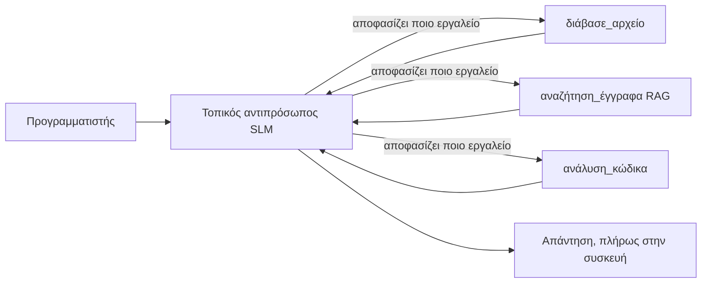
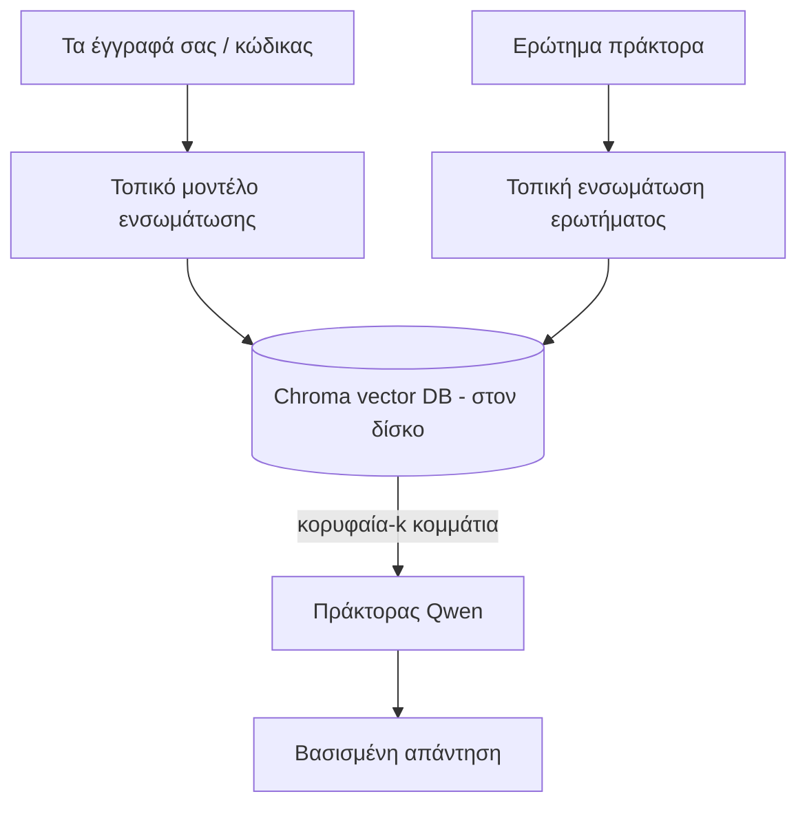
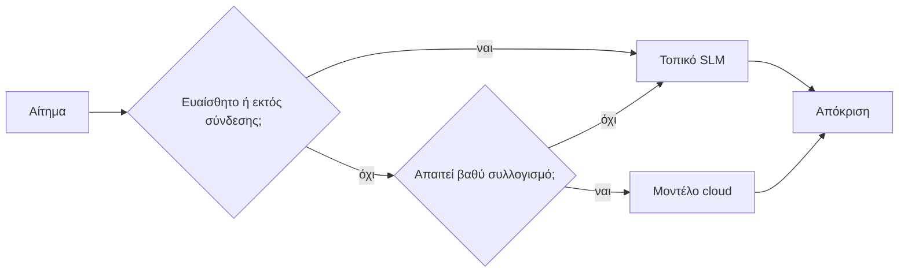

# Δημιουργία Τοπικών Πρακτόρων Τεχνητής Νοημοσύνης Χρησιμοποιώντας το Microsoft Foundry Local και Qwen


Το προηγούμενο μάθημα κλιμάκωσε τους πράκτορες *πάνω* στο σύννεφο. Αυτό τους φέρνει *κάτω* σε ένα μόνο μηχάνημα. Στο τέλος θα έχετε έναν λειτουργικό βοηθό μηχανικού που σκέφτεται, καλεί εργαλεία, διαβάζει τα αρχεία σας και αναζητά την τεκμηρίωσή σας — **χωρίς καμία κλήση συμπερασμάτων από το σύννεφο.**

Γιατί θα θέλατε αυτό; Τρεις λόγοι που ανακύπτουν συνεχώς στην πραγματική μηχανική εργασία:

- **Απόρρητο.** Ο κώδικας και τα έγγραφα δεν φεύγουν ποτέ από το μηχάνημα. Καμία εντολή, κανένα απόσπασμα, κανένα δεδομένο πελάτη δεν περνά τα όρια του δικτύου.
- **Κόστος.** Η τοπική συμπεραστική διαδικασία δεν έχει κόστος ανά token. Μπορείτε να επαναλάβετε όλη μέρα με κόστος μόνο το ρεύμα.
- **Εκτός δικτύου.** Σε αεροπλάνο, σε ασφαλές χώρο ή κατά τη διάρκεια διακοπής, ο πράκτορας εξακολουθεί να λειτουργεί.

Το ζήτημα είναι ότι ανταλλάσσετε ένα κορυφαίο μοντέλο σύννεφου με ένα **Μικρό Μοντέλο Γλώσσας (SLM)** που τρέχει στον CPU, GPU ή NPU σας. Αυτό το μάθημα αφορά την κατασκευή πρακτόρων που είναι *καλοί* μέσα σε αυτόν τον περιορισμό αντί να προσποιούνται ότι ο περιορισμός δεν υπάρχει.

## Εισαγωγή

Αυτό το μάθημα θα καλύψει:

- **Μικρά Μοντέλα Γλώσσας (SLMs)** — τι είναι, πού διαπρέπουν και πού όχι.
- **Microsoft Foundry Local** — ένα περιβάλλον εκτέλεσης που κατεβάζει και εξυπηρετεί μοντέλα στη συσκευή μέσω **OpenAI-συμβατού API**.
- **Μοντέλα κλήσης συναρτήσεων Qwen** — SLMs που παράγουν αξιόπιστα κλήσεις εργαλείων, καθιστώντας δυνατούς τους τοπικούς *πράκτορες* (και όχι μόνο τη τοπική συνομιλία).
- **Τοπικά εργαλεία, τοπικό RAG και τοπικό MCP** — δίνοντας στον πράκτορα ικανότητα χωρίς το σύννεφο.
- **Υβριδικά μοτίβα** — πότε να κρατάμε τα πράγματα τοπικά και πότε να απευθυνόμαστε στο σύννεφο.

## Στόχοι Μάθησης

Μετά την ολοκλήρωση αυτού του μαθήματος, θα ξέρετε πώς να:

- Εξηγείτε τις ανταλλαγές των SLMs και να επιλέγετε κατάλληλες περιπτώσεις χρήσης τοπικών πρακτόρων.
- Εξυπηρετείτε ένα μοντέλο Qwen τοπικά με το Foundry Local και να συνδέεστε σε αυτό μέσω του OpenAI-συμβατού endpoint.
- Κατασκευάζετε έναν πράκτορα κλήσης εργαλείων που τρέχει εξ ολοκλήρου στον workstation σας.
- Προσθέτετε τοπικό RAG πάνω από τα δικά σας έγγραφα χρησιμοποιώντας μια τοπική βάση δεδομένων διανυσμάτων (Chroma).
- Συνδέετε τον πράκτορα σε τοπικό MCP server και αξιολογείτε υβριδικές τοπικές/σύννεφων σχεδιάσεις.

## Προαπαιτούμενα

Αυτό το μάθημα υποθέτει ότι έχετε ολοκληρώσει τα προηγούμενα μαθήματα και είστε άνετοι με:

- [Χρήση εργαλείων](../04-tool-use/README.md) (Μάθημα 4) και [Agentic RAG](../05-agentic-rag/README.md) (Μάθημα 5).
- [Agentic Protocols / MCP](../11-agentic-protocols/README.md) (Μάθημα 11).
- Το [Microsoft Agent Framework](../14-microsoft-agent-framework/README.md) (Μάθημα 14).

Θα χρειαστείτε επίσης:

- Έναν σταθμό εργασίας προγραμματιστή. **8 GB RAM είναι ρεαλιστικό ελάχιστο**· 16 GB+ είναι άνετο. Μια GPU ή NPU βοηθάει αλλά δεν είναι απαραίτητη.
- **Εγκαταστημένο το Microsoft Foundry Local** (δείτε την ενότητα εγκατάστασης παρακάτω).
- Python 3.12+ και τα πακέτα στο αποθετήριο [`requirements.txt`](../../../requirements.txt), συν `foundry-local-sdk`, `openai`, και `chromadb` για αυτό το μάθημα.

## Μικρά Μοντέλα Γλώσσας: Το Κατάλληλο Εργαλείο για Τοπική Εργασία

Ένα κορυφαίο μοντέλο σύννεφου έχει εκατοντάδες δισεκατομμύρια παραμέτρους και ένα κέντρο δεδομένων πίσω του. Ένα SLM έχει μερικά δισεκατομμύρια παραμέτρους και πρέπει να χωράει στη μνήμη RAM του φορητού σας υπολογιστή. Αυτή η διαφορά θέτει σαφείς προσδοκίες.

**Τα SLMs είναι καλά σε:**

- Δομημένες, οριοθετημένες εργασίες — ταξινόμηση, εξαγωγή, περίληψη γνωστού εγγράφου.
- **Κλήση εργαλείων** — απόφαση ποια λειτουργία να καλέσει και με ποια ορίσματα.
- Γρήγορη, φτηνή και ιδιωτική επανάληψη στα δικά σας δεδομένα.

**Τα SLMs είναι πιο αδύναμα σε:**

- Ανοιχτόχρωμο, πολυβηματικό συλλογισμό σε μεγάλο πλαίσιο.
- Ευρεία γνώση κόσμου (έχουν δει λιγότερα και ξεχνούν περισσότερα).

Η νικητήρια στρατηγική για τοπικούς πράκτορες είναι λοιπόν: **άφησε το SLM να ορχηστρώσει, και τα εργαλεία να κάνουν τη βαριά δουλειά.** Το μοντέλο δεν χρειάζεται να *γνωρίζει* τον κώδικά σας — πρέπει να ξέρει πότε να καλέσει `read_file` και `search_docs`. Αυτό παίζει ακριβώς στα δυνατά σημεία ενός SLM.



## Microsoft Foundry Local

**Το Microsoft Foundry Local** είναι ένα ελαφρύ περιβάλλον εκτέλεσης που κατεβάζει, διαχειρίζεται και εξυπηρετεί μοντέλα εξ ολοκλήρου στη μηχανή σας. Το πιο σημαντικό χαρακτηριστικό για εμάς είναι ότι εκθέτει ένα **OpenAI-συμβατό HTTP endpoint** — που σημαίνει ότι το OpenAI SDK και ο OpenAI client του Microsoft Agent Framework λειτουργούν εναντίον του με μόνο αλλαγή στο `base_url`. Όλα όσα μάθατε για την κατασκευή πρακτόρων μεταφέρονται άμεσα· μόνο το endpoint μετακινείται από το σύννεφο στο `localhost`.

Το Foundry Local επιλέγει επίσης αυτόματα την καλύτερη έκδοση ενός μοντέλου για το υλικό σας — μια έκδοση για CPU, μία για CUDA/GPU ή μία για NPU — ώστε να μην χρειάζεται να βελτιστοποιείτε χειροκίνητα ανά μηχάνημα.

### Ρύθμιση

Εγκαταστήστε το Foundry Local (δείτε την [τεκμηρίωση](https://learn.microsoft.com/azure/ai-foundry/foundry-local/) για το λειτουργικό σας) και επιβεβαιώστε ότι λειτουργεί:

```bash
# Εγκατάσταση (π.χ. ακολουθήστε την τεκμηρίωση για την πλατφόρμα σας)
winget install Microsoft.FoundryLocal      # Windows
# brew install microsoft/foundrylocal/foundrylocal   # macOS

# Κατεβάστε και τρέξτε ένα μοντέλο Qwen, στη συνέχεια ξεκινήστε την τοπική υπηρεσία
foundry model run qwen2.5-7b-instruct
foundry service status
```

Μόλις η υπηρεσία τρέχει, έχετε ένα τοπικό, OpenAI-συμβατό endpoint (συνήθως `http://localhost:PORT/v1`). Το notebook χρησιμοποιεί το `foundry-local-sdk` για να ανακαλύπτει το endpoint αυτόματα, οπότε δεν χρειάζεται να κωδικοποιήσετε χειροκίνητα τη θύρα.

## Κλήση Συνάρτησης Qwen: Γιατί Έχει Σημασία

Ένας πράκτορας είναι πράκτορας μόνο αν μπορεί να καλεί εργαλεία. Πολλά SLMs μπορούν να συνομιλούν, αλλά παράγουν αναξιόπιστες, στρεβλές κλήσεις εργαλείων. Τα μοντέλα **Qwen** έχουν εκπαιδευτεί για κλήση συναρτήσεων και παράγουν συνεπείς και καλά διαμορφωμένες δομές κλήσης εργαλείων — αυτό ακριβώς μετατρέπει το τοπικό μοντέλο συνομιλίας σε τοπικό *πράκτορα*.

Η ροή είναι ο τυπικός βρόχος κλήσης εργαλείων που ήδη γνωρίζετε, απλώς τρέχει στη συσκευή:

```mermaid
sequenceDiagram
    participant U as Χρήστης
    participant A as Πράκτορας Qwen (τοπικός)
    participant T as Τοπικό Εργαλείο
    U->>A: "Τι κάνει το auth.py;"
    A->>A: Απόφαση: κλήση read_file
    A->>T: read_file("auth.py")
    T-->>A: περιεχόμενο αρχείου
    A->>A: Σκέψη πάνω στο περιεχόμενο
    A-->>U: Εξήγηση
```

## Τοπικό RAG

Η αναζήτηση τεκμηρίωσης είναι εκεί που οι τοπικοί πράκτορες δικαιολογούν την παρουσία τους. Αντί να ελπίζετε ότι ο SLM απομνημόνευσε την τεκμηρίωση του πλαισίου σας, ενσωματώνετε εκείνη την τεκμηρίωση σε μια **τοπική βάση δεδομένων διανυσμάτων** και αφήνετε τον πράκτορα να ανακτήσει τα σχετικά τμήματα κατόπιν αιτήματος.

Χρησιμοποιούμε το **Chroma**, ένα ενσωματωμένο κατάστημα διανυσμάτων που τρέχει στη διαδικασία χωρίς διακομιστή για διαχείριση. Η ροή είναι πλήρως τοπική: τοπικό μοντέλο ενσωμάτωσης → τοπικά διανύσματα → τοπική ανάκτηση → τοπικό SLM.



Αυτό είναι το ίδιο μοτίβο Agentic RAG από το Μάθημα 5 — η μόνη αλλαγή είναι ότι κάθε στοιχείο τρέχει στη μηχανή σας.

## Τοπικοί MCP Servers

Το [MCP](../11-agentic-protocols/README.md) είναι μέσο μεταφοράς, όχι υπηρεσία νέφους. Ένας MCP server μπορεί να τρέξει ως τοπική διαδικασία στο `stdio`, εκθέτοντας εργαλεία στον πράκτορά σας μέσω του τυποποιημένου πρωτοκόλλου. Αυτό σας επιτρέπει να επαναχρησιμοποιήσετε το αυξανόμενο οικοσύστημα MCP servers — πρόσβαση στο σύστημα αρχείων, εντολές git, ερωτήματα βάσεων δεδομένων — εντελώς εκτός δικτύου.

Η στάση ασφάλειας διαφέρει από το σύννεφο, αλλά δεν απουσιάζει: ένας τοπικός MCP server τρέχει ακόμη με τα δικαιώματα του χρήστη σας, οπότε περιορίστε το τι μπορεί να αγγίξει (ένα φάκελο έργου, όχι ολόκληρο τον προσωπικό σας φάκελο) και θεωρείστε τις εξόδους του ως εισόδους για επικύρωση.

## Υβριδικά Μοτίβα Νέφους και Τοπικού

Τοπικά πρώτα δεν σημαίνει μόνο τοπικά. Οι ώριμες λύσεις δρομολογούν ανάλογα με την ευαισθησία και τη δυσκολία:

| Κατάσταση | Πού τρέχει |
| --- | --- |
| Ευαίσθητος κώδικας / δεδομένα, ή εκτός δικτύου | **Τοπικό SLM** |
| Απλή, οριοθετημένη εργασία | **Τοπικό SLM** (φθηνό, γρήγορο) |
| Δύσκολος πολυβηματικός συλλογισμός σε μη ευαίσθητα δεδομένα | **Μοντέλο νέφους** |
| Όλα, κατά τη διάρκεια διακοπής | **Τοπικό SLM** (ομαλή υποβάθμιση) |

Αυτό αντικατοπτρίζει την ιδέα της **δρομολόγησης μοντέλου** από το Μάθημα 16 — εκτός από το ότι ένα από τα "μοντέλα" είναι τώρα το δικό σας μηχάνημα. Μια στιβαρή σχεδίαση επιστρέφει τοπικά όταν το σύννεφο δεν είναι διαθέσιμο, ώστε ο πράκτορας να φθείρεται σε ποιότητα αντί να αποτυγχάνει πλήρως.



## Εργαστήριο: Ένας Τοπικός Βοηθός Μηχανικού

Ανοίξτε το [`code_samples/17-local-agent-foundry-local.ipynb`](./code_samples/17-local-agent-foundry-local.ipynb) και δουλέψτε πάνω σε αυτό. Θα κατασκευάσετε έναν **τοπικό βοηθό μηχανικού** που τρέχει εξ ολοκλήρου στον σταθμό εργασίας σας και μπορεί να:

1. **Καλεί εργαλεία** — μέσω κλήσης συναρτήσεων Qwen μέσω Foundry Local.
2. **Εκτελεί τοπικές λειτουργίες αρχείων** — καταλογίζει και διαβάζει αρχεία σε φάκελο έργου.
3. **Αναλύει κώδικα** — δίνει βασικά μετρικά σε ένα αρχείο πηγής.
4. **Αναζητά τεκμηρίωση** — τοπικό RAG σε φάκελο εγγράφων με χρήση Chroma.
5. **Χρησιμοποιεί MCP** — συνδέεται σε τοπικό MCP server (απλοϊκή παράλειψη αν δεν υπάρχει ρυθμισμένος).

Δεν χρησιμοποιείται καμία συμπερασματική λειτουργία νέφους σε κανένα σημείο.

### Οδηγός

Ο βοηθός συνδέεται στο Foundry Local μέσω του OpenAI-συμβατού endpoint, έτσι ο κώδικας του πράκτορα μοιάζει σχεδόν ίδιος με τα μαθήματα νέφους — μόνο ο client αλλάζει:

```python
from foundry_local import FoundryLocalManager
from openai import OpenAI

# Το Foundry Local εντοπίζει/κατεβάζει το μοντέλο και μας παρέχει ένα τοπικό σημείο πρόσβασης.
manager = FoundryLocalManager(\"qwen2.5-7b-instruct\")
client = OpenAI(base_url=manager.endpoint, api_key=manager.api_key)  # Το api_key είναι ένας τοπικός προσωρινός δείκτης.
```

Τα εργαλεία είναι απλές συναρτήσεις Python με εύρος σε φάκελο έργου:

```python
def read_file(path: str) -> str:
    \"\"\"Read a file, but only inside the sandboxed project directory.\"\"\"
    full = (PROJECT_ROOT / path).resolve()
    if PROJECT_ROOT not in full.parents and full != PROJECT_ROOT:
        return \"Access denied: path is outside the project directory.\"
    return full.read_text(encoding=\"utf-8\")
```

Σημειώστε τον έλεγχο sandbox — ακόμη και τοπικά, ένα εργαλείο που διαβάζει αυθαίρετα μονοπάτια είναι ρίσκο. Το notebook διατηρεί κάθε εργαλείο περιορισμένο σε ένα μόνο φάκελο έργου.

## Έλεγχος Γνώσης

Ελέγξτε την κατανόησή σας πριν προχωρήσετε στην ανάθεση.

**1. Δώστε δύο συγκεκριμένους λόγους για να τρέξετε έναν πράκτορα τοπικά αντί στο σύννεφο.**

<details>
<summary>Απάντηση</summary>

Κάποιοι από: **απόρρητο** (ο κώδικας και τα δεδομένα δεν φεύγουν ποτέ από το μηχάνημα), **κόστος** (δεν υπάρχει χρέωση ανά token για συμπεραστική λειτουργία), και **λειτουργία εκτός δικτύου** (λειτουργεί χωρίς δίκτυο — σε αεροπλάνο, σε ασφαλή χώρο ή κατά τη διάρκεια διακοπής). Οι κανονισμοί/περιορισμοί που απαγορεύουν την αποστολή δεδομένων εκτός συσκευής είναι συχνή αιτία για το απόρρητο.
</details>

**2. Ποια είναι η προτεινόμενη κατανομή εργασίας μεταξύ ενός SLM και των εργαλείων του σε έναν τοπικό πράκτορα, και γιατί;**

<details>
<summary>Απάντηση</summary>

Αφήστε το SLM να **ορχηστρώσει** (να αποφασίσει ποιο εργαλείο θα καλέσει και με ποια ορίσματα) και αφήστε τα **εργαλεία να κάνουν τη βαριά δουλειά** (διάβασμα αρχείων, ανάκτηση τεκμηρίωσης, υπολογισμούς αποτελεσμάτων). Τα SLMs είναι δυνατά σε οριοθετημένες αποφάσεις όπως η επιλογή εργαλείων αλλά πιο αδύναμα σε ευρεία γνώση και μακροβηματικό συλλογισμό, οπότε η στήριξη σε εργαλεία αξιοποιεί τα δυνατά τους σημεία.
</details>

**3. Τι κάνει δυνατή την επαναχρησιμοποίηση του κώδικα πρακτόρων νέφους με το Foundry Local;**

<details>
<summary>Απάντηση</summary>

Το Foundry Local εκθέτει ένα **OpenAI-συμβατό HTTP endpoint**. Το OpenAI SDK και ο OpenAI client του Agent Framework λειτουργούν εναντίον του αλλάζοντας μόνο το `base_url` (και χρησιμοποιώντας τοπικό κλειδί API placeholder). Όλα τα άλλα στον κώδικα πράκτορα μένουν ίδια.
</details>

**4. Γιατί χρησιμοποιούμε συγκεκριμένα ένα μοντέλο κλήσης συναρτήσεων Qwen αντί για οποιοδήποτε SLM;**

<details>
<summary>Απάντηση</summary>

Επειδή ένας πράκτορας πρέπει να παράγει αξιόπιστες, καλά διαμορφωμένες **κλήσεις εργαλείων**. Πολλά SLMs μπορούν να συνομιλούν αλλά παράγουν στρεβλές ή ασυνεπείς δομές κλήσης εργαλείων. Τα μοντέλα Qwen εκπαιδεύονται για κλήση συναρτήσεων και παράγουν συνεπείς κλήσεις εργαλείων, που είναι αυτό που μετατρέπει ένα τοπικό μοντέλο συνομιλίας σε ένα λειτουργικό τοπικό πράκτορα.
</details>

**5. Στη ροή τοπικού RAG, ποια από τα στοιχεία τρέχουν στο μηχάνημα;**

<details>
<summary>Απάντηση</summary>

Όλα: το μοντέλο ενσωμάτωσης, η βάση διανυσμάτων (Chroma, στο δίσκο), το βήμα ανάκτησης και το SLM. Τα έγγραφα ενσωματώνονται τοπικά, αποθηκεύονται τοπικά, ανακτώνται τοπικά και αξιολογούνται από τοπικό μοντέλο — κανένα στοιχείο δεν αγγίζει το σύννεφο.
</details>

**6. Ένας τοπικός MCP server τρέχει στο μηχάνημά σας. Σημαίνει αυτό αυτόματα ότι είναι ασφαλής; Ποια προφύλαξη πρέπει να λάβετε;**

<details>
<summary>Απάντηση</summary>

Όχι. Ένας τοπικός MCP server τρέχει με τα δικαιώματα του χρήστη σας, επομένως μπορεί να αγγίξει οτιδήποτε μπορεί και εσείς. Περιορίστε το σε ό,τι χρειάζεται (π.χ. ένα φάκελο έργου και όχι ολόκληρο τον προσωπικό φάκελο) και θεωρείστε τις εξόδους του ως εισόδους για επικύρωση πριν ενεργήσετε πάνω τους.
</details>

**7. Περιγράψτε έναν λογικό υβριδικό κανόνα δρομολόγησης που περιλαμβάνει ένα τοπικό μοντέλο.**

<details>
<summary>Απάντηση</summary>

Δρομολογήστε ευαίσθητα ή εκτός δικτύου αιτήματα στο τοπικό SLM· δρομολογήστε απλές οριοθετημένες εργασίες στο τοπικό SLM για ταχύτητα και κόστος· δρομολογήστε δύσκολο, πολυβηματικό συλλογισμό σε μη ευαίσθητα δεδομένα σε μοντέλο νέφους· και επιστρέψτε στο τοπικό SLM αν το σύννεφο δεν είναι διαθέσιμο, ώστε ο πράκτορας να υποβαθμιστεί ομαλά αντί να αποτύχει. Αυτή είναι η δρομολόγηση μοντέλου (Μάθημα 16) με το τοπικό μηχάνημα ως ένα από τα μοντέλα.
</details>

**8. Ποιος είναι ένας ρεαλιστικός ελάχιστος αριθμός RAM για την εκτέλεση του τοπικού πράκτορα σε αυτό το μάθημα, και τι κερδίζετε με περισσότερη RAM;**

<details>
<summary>Απάντηση</summary>

Περίπου **8 GB** είναι ρεαλιστικό ελάχιστο· 16 GB+ είναι άνετο. Περισσότερη RAM σας επιτρέπει να τρέχετε μεγαλύτερα, πιο ικανά μοντέλα και να διατηρείτε περισσότερο πλαίσιο στη μνήμη. Μια GPU ή NPU επιταχύνει τη συμπερασματική διαδικασία αλλά δεν είναι υποχρεωτική — το Foundry Local επιλέγει έκδοση CPU αν δεν υπάρχει επιταχυντής διαθέσιμος.
</details>

## Ανάθεση

Επεκτείνετε τον τοπικό βοηθό μηχανικού σε έναν **τοπικό αναθεωρητή τεκμηρίωσης** για ένα μικρό έργο της επιλογής σας (μπορείτε να χρησιμοποιήσετε έναν από τους φακέλους μαθημάτων αυτού του αποθετηρίου αν θέλετε).

Η υποβολή σας θα πρέπει:

1. Να **ευρετηριάσει έναν πραγματικό φάκελο εγγράφων/κώδικα** στο Chroma (τουλάχιστον πέντε αρχεία).
2. Να **προσθέσει εργαλείο `find_todos`** που σαρώνει το έργο για σχόλια `TODO`/`FIXME` και τα επιστρέφει με το αρχείο και τον αριθμό γραμμής — διατηρώντας τον ίδιο έλεγχο sandbox όπως το `read_file`.

3. **Κάντε τρεις ερωτήσεις στον πράκτορα** που τον αναγκάζουν να συνδυάσει εργαλεία: μία καθαρή ερώτηση RAG, μία που απαιτεί ανάγνωση ενός συγκεκριμένου αρχείου και μία που απαιτεί εύρεση TODOs.
4. **Μετρήστε το**: μετρήστε τον χρόνο για καθεμία από τις τρεις απαντήσεις και καταγράψτε τον σε ένα κελί markdown. Σχολιάστε αν η καθυστέρηση είναι αποδεκτή για την προτεινόμενη ροή εργασίας σας.

Έπειτα γράψτε μια σύντομη παράγραφο για το **τι θα μεταφέρατε στο cloud και τι θα κρατούσατε τοπικά** για αυτόν τον κριτή, και γιατί. Αξιολογείστε κατά πόσο τα τοπικά στοιχεία είναι σωστά συνδεδεμένα μεταξύ τους και αν η υβριδική λογική σας είναι ορθή — όχι την ποιότητα του μοντέλου.

## Περίληψη

Σε αυτό το μάθημα κατασκευάσατε έναν πράκτορα που τρέχει εξ ολοκλήρου στο δικό σας μηχάνημα:

- Οι **SLMs** θυσιάζουν το εύρος γνώσης υπέρ απορρήτου, κόστους και λειτουργίας offline — και διαπρέπουν όταν **ορχηστρώνουν εργαλεία** αντί να φέρουν όλη τη γνώση οι ίδιοι.
- Το **Foundry Local** εξυπηρετεί μοντέλα στη συσκευή πίσω από ένα **OpenAI-συμβατό endpoint**, ώστε ο κώδικας του cloud agent σας να μεταφέρεται με μια γραμμή αλλαγής.
- Τα **Qwen μοντέλα με λειτουργία κλήσεων** καθιστούν την αξιόπιστη τοπική κλήση εργαλείων — και συνεπώς τοπικών *πρακτόρων* — εφικτή.
- Το **Local RAG** (Chroma) και **local MCP** δίνουν στον πράκτορα ικανότητες χωρίς να φύγει από το μηχάνημα.
- Τα **Υβριδικά πρότυπα** επιτρέπουν δρομολόγηση ανά ευαισθησία και δυσκολία, με το τοπικό να λειτουργεί ως κομψή εφεδρεία.

Αυτό ολοκληρώνει την τροχιά ανάπτυξης: Το Μάθημα 16 κλιμάκωσε τους πράκτορες στο Microsoft Foundry, και αυτό το μάθημα τους κλιμάκωσε σε έναν μόνο σταθμό εργασίας. Το επόμενο μάθημα ασχολείται με το πώς να διατηρούνται ασφαλείς οι αναπτυγμένοι πράκτορες.

## Πρόσθετοι Πόροι

- <a href="https://learn.microsoft.com/azure/ai-foundry/foundry-local/" target="_blank">Τεκμηρίωση Microsoft Foundry Local</a>
- <a href="https://learn.microsoft.com/azure/ai-foundry/what-is-azure-ai-foundry" target="_blank">Τεκμηρίωση Microsoft Foundry</a>
- <a href="https://learn.microsoft.com/en-us/agent-framework/overview/?wt.mc_id=youtube_26688_organicsocial_reactor&pivots=programming-language-python" target="_blank">Microsoft Agent Framework</a>
- <a href="https://qwen.readthedocs.io/en/latest/framework/function_call.html" target="_blank">Τεκμηρίωση κλήσεων λειτουργιών Qwen</a>
- <a href="https://modelcontextprotocol.io/" target="_blank">Πρωτόκολλο Πλαισίου Μοντέλου (MCP)</a>
- <a href="https://docs.trychroma.com/" target="_blank">Βάση δεδομένων διανυσμάτων Chroma</a>

## Προηγούμενο Μάθημα

[Ανάπτυξη Κλιμακούμενων Πρακτόρων](../16-deploying-scalable-agents/README.md)

## Επόμενο Μάθημα

[Ασφάλεια Πρακτόρων AI](../18-securing-ai-agents/README.md)

---

<!-- CO-OP TRANSLATOR DISCLAIMER START -->
**Αποποίηση ευθυνών**:
Αυτό το έγγραφο έχει μεταφραστεί χρησιμοποιώντας την υπηρεσία μετάφρασης με τεχνητή νοημοσύνη [Co-op Translator](https://github.com/Azure/co-op-translator). Ενώ επιδιώκουμε την ακρίβεια, παρακαλούμε να έχετε υπόψη ότι οι αυτοματοποιημένες μεταφράσεις ενδέχεται να περιέχουν λάθη ή ανακρίβειες. Το πρωτότυπο έγγραφο στη μητρική του γλώσσα πρέπει να θεωρείται η αυθεντική πηγή. Για κρίσιμες πληροφορίες, συνιστάται επαγγελματική ανθρώπινη μετάφραση. Δεν φέρουμε ευθύνη για τυχόν παρεξηγήσεις ή λανθασμένες ερμηνείες που προκύπτουν από τη χρήση αυτής της μετάφρασης.
<!-- CO-OP TRANSLATOR DISCLAIMER END -->