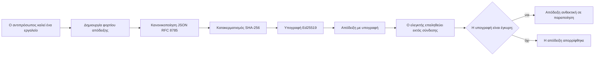
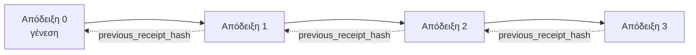

[Watch the lesson video: Ασφάλεια των Πρακτόρων Τεχνητής Νοημοσύνης με Κρυπτογραφικές Αποδείξεις](https://youtu.be/PLACEHOLDER_VIDEO_ID)

> _(Το βίντεο μαθήματος και η μικρογραφία θα προστεθούν από την ομάδα περιεχομένου της Microsoft μετά τη συγχώνευση, ταιριάζοντας στο μοτίβο των μαθημάτων 14 / 15.)_

# Ασφάλεια των Πρακτόρων Τεχνητής Νοημοσύνης με Κρυπτογραφικές Αποδείξεις

## Εισαγωγή

Αυτό το μάθημα θα καλύψει:

- Γιατί τα αρχεία ελέγχου για τους πράκτορες ΤΝ είναι σημαντικά για συμμόρφωση, εντοπισμό σφαλμάτων και εμπιστοσύνη.
- Τι είναι μια κρυπτογραφική απόδειξη και πώς διαφέρει από μια μη υπογεγραμμένη γραμμή καταγραφής.
- Πώς να παράγετε μια υπογεγραμμένη απόδειξη για μια κλήση εργαλείου του πράκτορα σε απλή Python.
- Πώς να επαληθεύσετε μια απόδειξη εκτός σύνδεσης και να ανιχνεύσετε παραποίηση.
- Πώς να αλυσιδώνετε αποδείξεις ώστε η αφαίρεση ή η αλλαγή σειράς μιας να σπάει την αλυσίδα.
- Τι αποδεικνύουν οι αποδείξεις και τι ρητά ΔΕΝ αποδεικνύουν.

## Στόχοι Μάθησης

Μετά την ολοκλήρωση αυτού του μαθήματος, θα γνωρίζετε πώς να:

- Εντοπίζετε τους τρόπους αποτυχίας που κινητοποιούν την κρυπτογραφική προέλευση για τις ενέργειες πρακτόρα.
- Παράγετε μια υπογραφή Ed25519 πάνω σε ένα κανονικοποιημένο φορτίο JSON.
- Επαληθεύετε μια απόδειξη ανεξάρτητα χρησιμοποιώντας μόνο το δημόσιο κλειδί του υπογράφοντα.
- Ανιχνεύετε παραποίηση εκτελώντας ξανά την επαλήθευση σε τροποποιημένη απόδειξη.
- Κατασκευάζετε μια αλυσίδα αποδείξεων με συνδεδεμένο hash και εξηγείτε γιατί η αλυσίδα έχει σημασία.
- Αναγνωρίζετε τα όρια μεταξύ αυτών που οι αποδείξεις αποδεικνύουν (απόδοση, ακεραιότητα, σειρά) και αυτών που δεν αποδεικνύουν (ορθότητα της ενέργειας, ορθότητα της πολιτικής).

## Το Πρόβλημα: Το Αρχείο Ελέγχου του Πράκτορά σας

Φανταστείτε ότι έχετε αναπτύξει έναν πράκτορα ΤΝ για την Contoso Travel. Ο πράκτορας διαβάζει αιτήματα πελατών, καλεί ένα API πτήσεων για να βρει επιλογές, και κλείνει θέσεις εκ μέρους του πελάτη. Το προηγούμενο τρίμηνο, ο πράκτορας επεξεργάστηκε 50.000 κρατήσεις.

Σήμερα έρχεται ένας ελεγκτής. Κάνει απλή ερώτηση: "Δείξτε μου τι έκανε ο πράκτοράς σας."

Παραδίδετε τα αρχεία καταγραφής σας. Ο ελεγκτής τα κοιτάζει και κάνει την πιο δύσκολη ερώτηση: "Πώς ξέρω ότι αυτά τα αρχεία δεν έχουν υποστεί επεξεργασία;"

Αυτό είναι το πρόβλημα του αρχείου ελέγχου. Οι περισσότερες αναπτύξεις πρακτόρων σήμερα βασίζονται σε:

- **Αρχεία καταγραφής εφαρμογής**: γραμμένα από τον ίδιο τον πράκτορα, επεξεργάσιμα από οποιονδήποτε με πρόσβαση στο σύστημα αρχείων.
- **Υπηρεσίες καταγραφής στο σύννεφο**: αποδεικνύουν παραποίηση σε επίπεδο πλατφόρμας αλλά μόνο εάν ο ελεγκτής εμπιστεύεται τον πάροχο της πλατφόρμας.
- **Αρχεία καταγραφής συναλλαγών βάσης δεδομένων**: κατάλληλα για αλλαγές στη βάση δεδομένων, όχι για αυθαίρετες κλήσεις εργαλείων.

Κανένα από αυτά δεν μπορεί να απαντήσει στην ερώτηση του ελεγκτή χωρίς να απαιτείται να εμπιστεύεται κάποιος (εσάς, τον πάροχο του cloud, τον προμηθευτή της βάσης δεδομένων). Για εσωτερική χρήση, αυτή η εμπιστοσύνη συνήθως είναι αποδεκτή. Για ρυθμιζόμενα φορτία εργασίας (χρηματοοικονομικά, υγεία, οτιδήποτε υπόκειται στον Κανονισμό ΤΝ της ΕΕ) δεν είναι.

Οι κρυπτογραφικές αποδείξεις λύνουν αυτό το πρόβλημα καθιστώντας κάθε ενέργεια πράκτορα ανεξάρτητα επαληθεύσιμη. Ο ελεγκτής δεν χρειάζεται να σας εμπιστεύεται. Χρειάζεται μόνο το δημόσιο κλειδί σας και την ίδια την απόδειξη.

## Τι είναι μια Κρυπτογραφική Απόδειξη;

Μια απόδειξη είναι ένα αντικείμενο JSON που καταγράφει τι έκανε ένας πράκτορας, υπογεγραμμένο με ψηφιακή υπογραφή.



Μια ελάχιστη απόδειξη μοιάζει έτσι:

```json
{
  "type": "agent.tool_call.v1",
  "agent_id": "contoso-travel-bot",
  "tool_name": "lookup_flights",
  "tool_args_hash": "sha256:a3f9c1...",
  "result_hash": "sha256:7b2e1d...",
  "policy_id": "contoso-travel-policy-v3",
  "timestamp": "2026-04-25T14:30:00Z",
  "sequence": 47,
  "previous_receipt_hash": "sha256:9d4e6a...",
  "signature": {
    "alg": "EdDSA",
    "sig": "c5af83...",
    "public_key": "8f3b2c..."
  }
}
```

Τρεις ιδιότητες κάνουν τη δουλειά:

1. **Η υπογραφή**. Η απόδειξη υπογράφεται από την πύλη του πράκτορα χρησιμοποιώντας ένα ιδιωτικό κλειδί Ed25519. Οποιοσδήποτε έχει το αντίστοιχο δημόσιο κλειδί μπορεί να επαληθεύσει την υπογραφή εκτός σύνδεσης. Η παραποίηση οποιουδήποτε πεδίου ακυρώνει την υπογραφή.

2. **Κανονικοποιημένη κωδικοποίηση**. Πριν από την υπογραφή, η απόδειξη σειριοποιείται χρησιμοποιώντας το JSON Canonicalization Scheme (JCS, RFC 8785). Αυτό διασφαλίζει ότι δύο υλοποιήσεις που παράγουν την ίδια λογική απόδειξη παράγουν byte-ταυτόσημη έξοδο. Χωρίς την κανονικοποίηση, διαφορετικοί σειριοποιητές JSON θα παράγουν διαφορετικές υπογραφές για το ίδιο περιεχόμενο.

3. **Αλυσιδωτή καταχώρηση hash**. Το πεδίο `previous_receipt_hash` συνδέει κάθε απόδειξη με την προηγούμενη. Η αφαίρεση ή η αλλαγή σειράς μιας απόδειξης σπάει κάθε απόδειξη που ακολουθεί. Η παραποίηση καθίσταται ορατή σε επίπεδο αλυσίδας ακόμα κι αν παρακαμφθούν μεμονωμένες υπογραφές.

Μαζί αυτές οι ιδιότητες παρέχουν τρεις εγγυήσεις:

- **Απόδοση**: αυτό το κλειδί υπέγραψε αυτό το περιεχόμενο.
- **Ακεραιότητα**: το περιεχόμενο δεν έχει αλλάξει από την υπογραφή.
- **Σειρά**: αυτή η απόδειξη ήρθε μετά από εκείνη την απόδειξη στην αλυσίδα.

## Παράγωγη Απόδειξης σε Python

Δεν χρειάζεστε ειδική βιβλιοθήκη για να παράγετε μια απόδειξη. Οι κρυπτογραφικές πρωτόγονες λειτουργίες είναι ευρέως διαθέσιμες και η λογική είναι μερικές δεκάδες γραμμές Python.

Οι πρακτικές ασκήσεις στο `code_samples/18-signed-receipts.ipynb` σας καθοδηγούν σε όλη τη διαδικασία. Η συνοπτική έκδοση:

```python
import json
import hashlib
import base64
from nacl import signing
from jcs import canonicalize  # Πρότυπο JSON κανονικοποιημένο σύμφωνα με το RFC 8785

def b64url_nopad(data: bytes) -> str:
    return base64.urlsafe_b64encode(data).decode("ascii").rstrip("=")

def sha256_canonical(obj) -> str:
    """SHA-256 of a Python object's JCS-canonical JSON form."""
    return f"sha256:{hashlib.sha256(canonicalize(obj)).hexdigest()}"

# Δημιουργήστε ή φορτώστε ένα κλειδί υπογραφής (στην παραγωγή, αποθηκεύστε το σε θησαυροφυλάκιο κλειδιών)
signing_key = signing.SigningKey.generate()
verify_key = signing_key.verify_key

# Δημιουργήστε το φορτίο απόδειξης (χωρίς υπογραφή ακόμα)
tool_args = {"origin": "SYD", "destination": "LAX"}
tool_result = [{"flight": "QF11", "price": 1850, "stops": 0}]

payload = {
    "type": "agent.tool_call.v1",
    "agent_id": "contoso-travel-bot",
    "tool_name": "lookup_flights",
    "tool_args_hash": sha256_canonical(tool_args),
    "result_hash": sha256_canonical(tool_result),
    "policy_id": "contoso-travel-policy-v3",
    "timestamp": "2026-04-25T14:30:00Z",
    "sequence": 0,
    "previous_receipt_hash": None,
}

# Κανονικοποιήστε, δημιουργήστε κατακερματισμό, υπογράψτε.
canonical_bytes = canonicalize(payload)
message_hash = hashlib.sha256(canonical_bytes).digest()
signature_bytes = signing_key.sign(message_hash).signature

# Επισυνάψτε ένα δομημένο αντικείμενο υπογραφής.
receipt = {
    **payload,
    "signature": {
        "alg": "EdDSA",
        "sig": b64url_nopad(signature_bytes),
        "public_key": b64url_nopad(bytes(verify_key)),
    },
}
```

Αυτή είναι ολόκληρη η ροή υπογραφής. Οι ασκήσεις στο σημειωματάριο ακολουθούν κάθε βήμα.

## Επαλήθευση Απόδειξης και Ανίχνευση Παραποίησης

Η επαλήθευση είναι η αντίστροφη λειτουργία:

```python
import base64
import hashlib
from nacl import signing
from nacl.exceptions import BadSignatureError
from jcs import canonicalize

def b64url_decode(s: str) -> bytes:
    padding = "=" * ((4 - len(s) % 4) % 4)
    return base64.urlsafe_b64decode(s + padding)

def verify_receipt(receipt: dict) -> bool:
    # Η υπογραφή είναι ένα δομημένο αντικείμενο: {"alg", "sig", "public_key"}.
    sig_obj = receipt.get("signature")
    if not sig_obj or sig_obj.get("alg") != "EdDSA":
        return False

    # Ανακατασκευάστε το φορτίο που υπογράφηκε πραγματικά (όλα εκτός της υπογραφής).
    payload = {k: v for k, v in receipt.items() if k != "signature"}

    canonical_bytes = canonicalize(payload)
    message_hash = hashlib.sha256(canonical_bytes).digest()

    try:
        verify_key = signing.VerifyKey(b64url_decode(sig_obj["public_key"]))
        verify_key.verify(message_hash, b64url_decode(sig_obj["sig"]))
        return True
    except BadSignatureError:
        return False
```

Αυτή η συνάρτηση παίρνει μια απόδειξη και επιστρέφει `True` αν η υπογραφή είναι έγκυρη, `False` αλλιώς. Χωρίς κλήσεις δικτύου, χωρίς εξάρτηση από υπηρεσίες, χωρίς ανάγκη εμπιστοσύνης σε τρίτους.

Για να δείτε την ανίχνευση παραποίησης σε δράση, το σημειωματάριο περνάει από:

1. Τη δημιουργία μιας έγκυρης απόδειξης και την επιβεβαίωση ότι επαληθεύεται.
2. Την τροποποίηση ενός byte στο πεδίο `tool_args_hash`.
3. Την επανεκτέλεση της επαλήθευσης και την αποτυχία της.

Αυτή είναι η πρακτική απόδειξη ότι οι αποδείξεις είναι ανιχνεύσιμες σε παραποίηση: οποιαδήποτε τροποποίηση, όσο μικρή κι αν είναι, ακυρώνει την υπογραφή.

## Αλυσιδωτή Σύνδεση Αποδείξεων για Πράκτορες Πολλαπλών Βημάτων

Μια υπογεγραμμένη απόδειξη προστατεύει μία ενέργεια. Μια αλυσίδα αποδείξεων προστατεύει μια ακολουθία.



Κάθε απόδειξη καταγράφει το hash της προηγούμενης απόδειξης. Για να αφαιρέσει σιωπηλά κάποιος την απόδειξη 2, θα χρειαζόταν:

- Είτε να τροποποιήσει το πεδίο `previous_receipt_hash` της απόδειξης 3 (ακυρώνει την υπογραφή της απόδειξης 3), Ή
- Να υπογράψει ψεύτικα τη νέα τροποποιημένη απόδειξη 3 (απαιτεί το ιδιωτικό κλειδί του πράκτορα).

Αν το ιδιωτικό κλειδί φυλάσσεται σε ένα hardware key vault και δημοσιεύετε το δημόσιο κλειδί με κάθε απόδειξη, καμία από αυτές τις επιθέσεις δεν είναι εφικτή χωρίς ανίχνευση.

Το σημειωματάριο περνάει από:

1. Την κατασκευή μιας αλυσίδας τριών αποδείξεων.
2. Την επαλήθευση ότι το `previous_receipt_hash` κάθε απόδειξης ταιριάζει με το πραγματικό hash της προηγούμενης απόδειξης.
3. Την παραποίηση μιας απόδειξης στη μέση και την παρακολούθηση ότι η αλυσίδα σπάει ακριβώς εκεί.

Αυτός είναι ο τρόπος να παραχθεί ένα αρχείο ελέγχου που ένας εξωτερικός ελεγκτής μπορεί να επαληθεύσει χωρίς να χρειάζεται να σας εμπιστευτεί.

## Τι Αποδεικνύουν οι Αποδείξεις (και Τι Δεν Αποδεικνύουν)

Αυτή είναι η πιο σημαντική ενότητα αυτού του μαθήματος. Οι αποδείξεις είναι ισχυρές αλλά η ισχύς τους έχει όρια.

**Οι αποδείξεις αποδεικνύουν τρία πράγματα:**

1. **Απόδοση**: ένα συγκεκριμένο κλειδί υπέγραψε ένα συγκεκριμένο φορτίο.
2. **Ακεραιότητα**: το φορτίο δεν έχει αλλάξει από την υπογραφή.
3. **Σειρά**: αυτή η απόδειξη ήρθε μετά από εκείνη την απόδειξη στην αλυσίδα hash.

**Οι αποδείξεις ΔΕΝ αποδεικνύουν:**

1. **Ορθότητα**: ότι η ενέργεια του πράκτορα ήταν η σωστή ενέργεια. Μια απόδειξη μπορεί να υπογραφεί και για λάθος απάντηση εξίσου καθαρά όσο και για σωστή.
2. **Συμμόρφωση με πολιτική**: ότι η πολιτική που αναφέρεται στο `policy_id` αξιολογήθηκε πραγματικά, ή ότι θα επέτρεπε αυτή την ενέργεια αν είχε ελεγχθεί. Η απόδειξη καταγράφει τι δήλωσε, όχι τι επιβλήθηκε.
3. **Ταυτότητα πέρα από το κλειδί**: η απόδειξη λέει "αυτό το κλειδί υπέγραψε αυτό το περιεχόμενο." Δεν λέει "αυτός ο άνθρωπος εξουσιοδότησε αυτό." Η σύνδεση κλειδιού με πρόσωπο ή οργανισμό απαιτεί ξεχωριστή ταυτότητα (κατάλογος, μητρώο δημόσιων κλειδιών κ.λπ.).
4. **Αλήθεια των εισροών**: αν ο πράκτορας λάβει παραποιημένη υπόδειξη και ενεργήσει βάσει αυτής, η απόδειξη καταγράφει την ενέργεια με ακρίβεια. Οι αποδείξεις είναι επακόλουθες της επικύρωσης εισόδων, όχι υποκατάστατό της.

Αυτό το όριο έχει σημασία για δύο λόγους:

- Σας λέει για τι είναι χρήσιμες οι αποδείξεις: να κάνουν τη συμπεριφορά του πράκτορα ελέγξιμη και ανιχνεύσιμη σε παραποίηση, ακόμα και ανάμεσα σε οργανισμούς.
- Σας λέει ποια επιπρόσθετα επίπεδα χρειάζεστε ακόμη: επικύρωση εισόδων (Μάθημα 6), επιβολή πολιτικής (που καλύπτεται συνοπτικά πιο κάτω) και υποδομή ταυτότητας (εκτός πεδίου αυτού του μαθήματος).

Συχνό λάθος είναι να υποθέσετε ότι "έχουμε αποδείξεις" σημαίνει "είμαστε ρυθμιζόμενοι". Δεν σημαίνει. Οι αποδείξεις είναι θεμέλιο. Η διακυβέρνηση είναι το σύστημα που χτίζετε από πάνω.

## Παραπομπές Παραγωγής

Ο κώδικας Python σε αυτό το μάθημα είναι σκόπιμα ελάχιστος ώστε να μπορείτε να διαβάσετε κάθε γραμμή και να καταλάβετε ακριβώς τι συμβαίνει. Σε περιβάλλον παραγωγής, έχετε δύο επιλογές:

1. **Κατασκευή απευθείας πάνω στις κρυπτογραφικές πρωτόγονες λειτουργίες.** Οι 50 γραμμές που είδατε παραπάνω επαρκούν για πολλές περιπτώσεις χρήσης. Οι PyNaCl (Ed25519) και το πακέτο `jcs` (κανονικό JSON) είναι καλά συντηρημένες και ελεγμένες βιβλιοθήκες.

2. **Χρήση βιβλιοθήκης απόδειξης παραγωγής.** Πολλά έργα ανοικτού κώδικα υλοποιούν το ίδιο πρότυπο με πρόσθετα χαρακτηριστικά (περιστροφή κλειδιών, επαύξηση παρτίδων, διανομή συνόλου JWK, ενσωμάτωση με μηχανές πολιτικής):
   - Η μορφή απόδειξης που χρησιμοποιείται σε αυτό το μάθημα ακολουθεί ένα προσχέδιο IETF (`draft-farley-acta-signed-receipts`) που βρίσκεται στη διαδικασία προτύπων.
   - Το Microsoft Agent Governance Toolkit συνθέτει αποδείξεις με αποφάσεις πολιτικής βασισμένες σε Cedar· δείτε το Tutorial 33 σε αυτό το αποθετήριο για ολοκληρωμένο παράδειγμα.
   - Τα πακέτα `protect-mcp` (npm) και `@veritasacta/verify` (npm) παρέχουν Node-based υλοποίηση για υπογραφή αποδείξεων και επαλήθευση εκτός σύνδεσης, σχεδιασμένα για να τυλίγουν οποιονδήποτε MCP server με αλυσίδα αρχείου ελέγχου ανιχνεύσιμης παραποίησης.
   - Το **[nobulex](https://github.com/arian-gogani/nobulex)** Python SDK (`pip install nobulex`) παρέχει το ίδιο πρότυπο υπογραφής Ed25519 + JCS σε Python με ενσωματώσεις LangChain και CrewAI, συμπεριλαμβανομένων δημοσιευμένων διασταυρούμενων δοκιμαστικών διανυσμάτων και ενός χάρτη συμμόρφωσης που συνεισέφερε μέσω του [OWASP PR #2210](https://github.com/OWASP/CheatSheetSeries/pull/2210).

Η επιλογή μεταξύ συγγραφής δικής σας βιβλιοθήκης και χρήσης έτοιμης είναι ανάλογη της επιλογής μεταξύ υλοποίησης δικής σας JWT βιβλιοθήκης και χρήσης μιας δοκιμασμένης: και οι δύο λογικές· η βιβλιοθήκη εξοικονομεί χρόνο και μειώνει το πεδίο ελέγχου· η υλοποίηση από την αρχή σας αναγκάζει να κατανοήσετε κάθε πρωτόγονο λειτουργικό. Αυτό το μάθημα διδάσκει την προσέγγιση από το μηδέν ώστε να έχετε τα θεμέλια για οποιαδήποτε επιλογή.

## Έλεγχος Γνώσεων

Δοκιμάστε την κατανόησή σας πριν προχωρήσετε στην πρακτική άσκηση.

**1. Μια απόδειξη υπογράφεται με το ιδιωτικό κλειδί Ed25519 του πράκτορα. Ο ελεγκτής έχει μόνο το δημόσιο κλειδί. Μπορεί ο ελεγκτής να επαληθεύσει την απόδειξη εκτός σύνδεσης;**

<details>
<summary>Απάντηση</summary>

Ναι. Η επαλήθευση Ed25519 απαιτεί μόνο το δημόσιο κλειδί και τα υπογεγραμμένα bytes. Δεν χρειάζεται δικτυακή κλήση ούτε εξάρτηση υπηρεσίας. Αυτή είναι η ιδιότητα που κάνει τις αποδείξεις χρήσιμες σε περιβάλλοντα με διαχωρισμό δικτύου, πολλαπλών οργανισμών ή χαμηλής εμπιστοσύνης.
</details>

**2. Ένας επιτιθέμενος τροποποιεί το πεδίο `policy_id` μιας απόδειξης για να ισχυριστεί ότι κυβερνιόταν από πιο επιεική πολιτική. Η υπογραφή ήταν πάνω στο αρχικό φορτίο. Τι συμβαίνει κατά την επαλήθευση;**

<details>
<summary>Απάντηση</summary>

Η επαλήθευση αποτυγχάνει. Η υπογραφή υπολογίστηκε πάνω στα κανονικά bytes του αρχικού φορτίου· η τροποποίηση οποιουδήποτε πεδίου αλλάζει τα κανονικά bytes, άρα και το SHA-256 hash, καθιστώντας την υπογραφή άκυρη. Ο επιτιθέμενος θα χρειαστεί το ιδιωτικό κλειδί για να παράγει νέα έγκυρη υπογραφή, το οποίο δεν διαθέτει.
</details>

**3. Γιατί η απόδειξη περιλαμβάνει `tool_args_hash` και `result_hash` αντί για τα ακατέργαστα επιχειρήματα και αποτελέσματα;**

<details>
<summary>Απάντηση</summary>

Για δύο λόγους. Πρώτον, η απόδειξη μπορεί να χρειαστεί αποθήκευση ή μετάδοση σε περιβάλλοντα όπου η διαρροή ακατέργαστου περιεχομένου (Προσωπικά Δεδομένα, επιχειρηματικά δεδομένα) αποτελεί πρόβλημα. Το hashing κρατά την απόδειξη μικρή και το περιεχόμενο ιδιωτικό· ο ελεγκτής επαληθεύει ότι το hash ταιριάζει με ξεχωριστά αποθηκευμένο αντίγραφο του πραγματικού περιεχομένου. Δεύτερον, τα hashes έχουν σταθερό μέγεθος· μια απόδειξη με hashes έχει περιορισμένο μέγεθος ανεξάρτητα από το πόσο μεγάλα ήταν τα εισροές και τα αποτελέσματα.
</details>

**4. Το πεδίο `previous_receipt_hash` συνδέει κάθε απόδειξη με την προηγούμενή της. Αν ένας επιτιθέμενος αφαιρέσει σιωπηλά μια απόδειξη από τη μέση της αλυσίδας, τι καθίσταται άκυρο;**

<details>
<summary>Απάντηση</summary>

Κάθε απόδειξη που ακολούθησε την αφαιρεθείσα. Τα πεδία `previous_receipt_hash` τους δεν ταιριάζουν πλέον με την πραγματική αλυσίδα (επειδή η απόδειξη που αναφερόταν δεν υπάρχει πια ή η αλυσίδα δείχνει σε διαφορετικό πρόγονο). Για να κρύψει την αφαίρεση, ο επιτιθέμενος θα πρέπει να υπογράψει ξανά κάθε επόμενη απόδειξη, κάτι που απαιτεί το ιδιωτικό κλειδί.
</details>

**5. Μια απόδειξη επαληθεύεται καθαρά. Αυτό αποδεικνύει ότι η ενέργεια του πράκτορα ήταν σωστή, ορθή ή σύμφωνα με την πολιτική;**

<details>
<summary>Απάντηση</summary>

Όχι. Μια έγκυρη απόδειξη αποδεικνύει τρία πράγματα: απόδοση (αυτό το κλειδί υπέγραψε αυτό το περιεχόμενο), ακεραιότητα (το περιεχόμενο δεν άλλαξε) και σειρά (αυτή η απόδειξη ήρθε μετά από εκείνη). Δεν αποδεικνύει ότι η ενέργεια ήταν σωστή, ότι η πολιτική στο `policy_id` αξιολογήθηκε ή ότι ο πράκτορας ακολούθησε όλους τους κανόνες. Οι αποδείξεις καθιστούν τη συμπεριφορά του πράκτορα ελέγξιμη, όχι αναγκαστικά ορθή. Αυτό είναι το πιο σημαντικό όριο στο μάθημα.
</details>

## Πρακτική Άσκηση

Ανοίξτε το `code_samples/18-signed-receipts.ipynb` και ολοκληρώστε και τις τέσσερις ενότητες:

1. **Ενότητα 1**: Υπογράψτε την πρώτη σας απόδειξη και επαληθεύστε τη.
2. **Ενότητα 2**: Παραποιήστε την απόδειξη και παρατηρήστε την αποτυχία επαλήθευσης.
3. **Ενότητα 3**: Κατασκευάστε μια αλυσίδα με τρεις αποδείξεις και επαληθεύστε την ακεραιότητα της αλυσίδας.
4. **Ενότητα 4**: Εφαρμόστε το πρότυπο σε πράκτορα κατασκευασμένο με το Microsoft Agent Framework: τυλίξτε μια κλήση εργαλείου με υπογραφή απόδειξης, στη συνέχεια επαληθεύστε την απόδειξη ανεξάρτητα.
**Πρόκληση επέκτασης 1:** επεκτείνετε το σχήμα απόδειξης με ένα επιπλέον πεδίο της επιλογής σας (για παράδειγμα, ένα αναγνωριστικό αίτησης για ιχνηλάτηση), ενημερώστε τη λογική της κανονικής υπογραφής για να το συμπεριλάβετε και επιβεβαιώστε ότι η απόδειξη συνεχίζει να περνάει τον έλεγχο επαλήθευσης. Στη συνέχεια τροποποιήστε το πεδίο μετά την υπογραφή και επιβεβαιώστε ότι η επαλήθευση αποτυγχάνει. Αυτό σας αναγκάζει να κατανοήσετε πώς κάθε byte της κανονικής κωδικοποίησης συμβάλλει στην υπογραφή.

**Πρόκληση επέκτασης 2:** κάντε SHA-256 hash δύο από τις αποδείξεις σας μαζί (συνενώστε τις κανονικές bytes τους με καθορισμένη σειρά) και ενσωματώστε το προκύπτον digest ως νέο πεδίο σε μια τρίτη απόδειξη πριν την υπογράψετε. Επιβεβαιώστε ότι και οι τρεις αποδείξεις εξακολουθούν να περνούν τον έλεγχο. Μόλις δημιουργήσατε μια απόδειξη ενσωμάτωσης ενός βήματος: όποιος κατέχει την τρίτη απόδειξη μπορεί να αποδείξει ότι οι δύο πρώτες υπήρχαν τη στιγμή που υπογράφηκε, χωρίς να χρειάζεται να αποκαλύψει το περιεχόμενό τους. Αυτό είναι το πρότυπο που χρησιμοποιούν οι αποδείξεις επιλεκτικής αποκάλυψης σε μεγάλη κλίμακα (δεσμεύσεις Merkle, RFC 6962).

## Συμπέρασμα

Οι κρυπτογραφικές αποδείξεις παρέχουν στους AI agents ένα ίχνος ελέγχου που είναι:

- **Ανεξάρτητα επαληθεύσιμο:** οποιοσδήποτε διαθέτει το δημόσιο κλειδί μπορεί να ελέγξει, χωρίς εξάρτηση από υπηρεσίες.
- **Εύκολο να ανιχνευθεί παραποίηση:** οποιαδήποτε τροποποίηση ακυρώνει την υπογραφή.
- **Φορητό:** μια απόδειξη είναι ένα μικρό αρχείο JSON· μπορεί να αρχειοθετηθεί, να μεταδοθεί και να επαληθευτεί οπουδήποτε.
- **Συμβατό με πρότυπα:** βασίζεται σε Ed25519 (RFC 8032), JCS (RFC 8785) και SHA-256, όλα ευρέως διαδεδομένες βιβλιοθήκες.

Δεν αποτελούν υποκατάστατο για την επικύρωση εισόδου, εφαρμογή πολιτικής ή υποδομή ταυτότητας. Αποτελούν τη βάση για αυτά τα επίπεδα. Όταν αναπτύσσετε agents σε ρυθμιζόμενα φορτία εργασίας, workflows πολλών οργανισμών ή σε οποιοδήποτε περιβάλλον όπου ένας μελλοντικός ελεγκτής δεν μπορεί να θεωρηθεί αξιόπιστος, οι αποδείξεις είναι ο τρόπος να κάνετε το ίχνος ελέγχου αξιόπιστο.

Το πιο σημαντικό συμπέρασμα: οι αποδείξεις αποδεικνύουν ποιος είπε τι και πότε. Δεν αποδεικνύουν ότι αυτό που ειπώθηκε ήταν αληθινό ή σωστό. Κρατήστε αυτήν την διάκριση καλά. Είναι η διαφορά ανάμεσα σε ένα έντιμο σύστημα προέλευσης και ένα παραπλανητικό.

## Λίστα ελέγχου παραγωγής

Όταν είστε έτοιμοι να προχωρήσετε από το μάθημα σε ανάπτυξη agents με υπογραφή απόδειξης σε πραγματικό περιβάλλον:

- [ ] **Μετακινήστε το κλειδί υπογραφής εκτός του φορητού υπολογιστή του προγραμματιστή.** Χρησιμοποιήστε Azure Key Vault, AWS KMS ή υλικό ασφάλειας (hardware security module). Το ιδιωτικό κλειδί που υπογράφει τις αποδείξεις δεν πρέπει ποτέ να ζει σε έλεγχο πηγής ή σε απλό κείμενο σε μηχανές εφαρμογής.
- [ ] **Δημοσιεύστε το δημόσιο κλειδί επαλήθευσης.** Οι ελεγκτές το χρειάζονται για επαλήθευση εκτός σύνδεσης. Το τυπικό πρότυπο είναι ένα JWK Set σε μια γνωστή URL (RFC 7517), π.χ., `https://your-org.example.com/.well-known/agent-keys.json`.
- [ ] **Αγκυρώστε την αλυσίδα εξωτερικά.** Περιοδικά καταγράψτε το hash της κεφαλής της αλυσίδας σε ένα αρχείο διαφάνειας (Sigstore Rekor, RFC 3161 χρονικό σήμα, ή ένα δεύτερο εσωτερικό σύστημα) ώστε ένα εξωτερικό μέρος να επιβεβαιώσει "η αλυσίδα αυτή υπήρχε τη συγκεκριμένη στιγμή."
- [ ] **Αποθηκεύστε τις αποδείξεις αμετάβλητα.** Αποθήκευση blob μόνο με προσθήκη (Azure Storage με πολιτικές αμεταβλητότητας, AWS S3 Object Lock) αποτρέπει τον εσωτερικό χρήστη από την επανεγγραφή του ιστορικού στο επίπεδο αποθήκευσης.
- [ ] **Καθορίστε την πολιτική διατήρησης.** Πολλά καθεστώτα συμμόρφωσης απαιτούν πολυετή διατήρηση. Προγραμματίστε την αύξηση των αποδείξεων (κάθε απόδειξη είναι ~500 bytes· ένας agent που κάνει 10.000 κλήσεις ημερησίως παράγει ~1,8 GB ανά έτος).
- [ ] **Καταγράψτε τι δεν καλύπτουν οι αποδείξεις.** Οι αποδείξεις αποδεικνύουν απόδοση, ακεραιότητα και σειρά. Το εγχειρίδιό σας πρέπει να αναφέρει ρητά ποιοι επιπρόσθετοι έλεγχοι (επικύρωση εισόδου, επιβολή πολιτικής, περιορισμός ρυθμού, υποδομή ταυτότητας) συνοδεύουν τις αποδείξεις στη διακυβέρνησή σας.

### Έχετε περισσότερες ερωτήσεις για την ασφάλεια των AI agents;

Γίνετε μέλος του [Microsoft Foundry Discord](https://aka.ms/ai-agents/discord) για να συναντήσετε άλλους μαθητές, να παρακολουθήσετε ώρες γραφείου και να λάβετε απαντήσεις για θέματα AI Agents.

## Πέρα από αυτό το μάθημα

Αυτό το μάθημα καλύπτει υπογραφή μονής απόδειξης και αλληλουχίες με αλυσίδα hash. Τα ίδια στοιχεία συνθέτουν αρκετά πιο εξελιγμένα πρότυπα που μπορεί να συναντήσετε καθώς ωριμάζει η στάση διακυβέρνησής σας:

- **Επιλεκτική αποκάλυψη.** Όταν τα πεδία μιας απόδειξης δεσμεύονται ανεξάρτητα (δέντρο Merkle τύπου RFC 6962), μπορείτε να αποκαλύψετε συγκεκριμένα πεδία σε συγκεκριμένους ελεγκτές και να αποδείξετε ότι τα υπόλοιπα δεν έχουν αλλάξει χωρίς να τα εκθέσετε. Χρήσιμο όταν η ίδια απόδειξη πρέπει να ικανοποιεί τόσο έναν πλήρη έλεγχο (που θέλει πληρότητα) όσο και κανονισμούς ελαχιστοποίησης δεδομένων όπως το GDPR (που θέλουν ο ελεγκτής να δει όσο το δυνατόν λιγότερα).
- **Ανάκληση αποδείξεων.** Αν ένα κλειδί υπογραφής παραβιαστεί, χρειάζεστε έναν τρόπο να θεωρήσετε όλες τις αποδείξεις υπογεγραμμένες με αυτό το κλειδί ως μη αξιόπιστες από συγκεκριμένη χρονική στιγμή και μετά. Τυπικά πρότυπα: κλειδιά υπογραφής βραχυχρόνιας διάρκειας και δημοσιευμένοι κατάλογοι ανάκλησης, ή αρχείο διαφάνειας με καταχωρήσεις ανάκλησης.
- **Αμφίδρομες / αποδείξεις με διαιρεμένη υπογραφή.** Ορισμένες υλοποιήσεις χωρίζουν το υπογεγραμμένο φορτίο σε πρό-εκτέλεσης (`authorization_*`) και μετά-εκτέλεσης (`result_*`) με ανεξάρτητες υπογραφές, χρήσιμο όταν η απόφαση εξουσιοδότησης και το παρατηρούμενο αποτέλεσμα παράγονται από διαφορετικούς φορείς ή σε διαφορετικές χρονικές στιγμές. Αυτό προστίθεται επαυξητικά πάνω στη μορφή απόδειξης που διδάχτηκε σε αυτό το μάθημα.
- **Σύνθεση φορτίου.** Μια απόδειξη σφραγίζει όποια bytes βάλετε στο `result_hash`. Τα πραγματικά φορτία είναι συχνά πλουσιότερα από το αποτέλεσμα μιας ενιαίας κλήσης εργαλείου: η σκέψη πριν τη λήψη απόφασης (πρόβλεψη μοντέλου, επιλογές που εξετάστηκαν, αποδεικτικά στοιχεία και η πληρότητά τους, στάση κινδύνου, αλυσίδα λογοδοσίας, αποτέλεσμα πύλης) μπορούν όλα να ζουν μέσα στο φορτίο, σφραγισμένα από μια μόνο απόδειξη. Αυτό διατηρεί τη μορφή απόδειξης ελάχιστη ενώ αφήνει τα σχήματα φορτίων να εξελίσσονται ανά πεδίο.
- **Συμβατότητα πολλαπλών υλοποιήσεων.** Πολλές ανεξάρτητες υλοποιήσεις της ίδιας μορφής απόδειξης (Python, TypeScript, Rust, Go) επαληθεύουν διασταυρωμένα βάσει κοινών διανυσμάτων δοκιμών. Αν κατασκευάσετε τη δική σας υλοποίηση, η επικύρωση απέναντι σε δημοσιευμένα διανύσματα επιβεβαιώνει συμβατότητα στο πρωτόκολλο.
- **Μετάβαση μετά την κβαντική εποχή.** Το Ed25519 χρησιμοποιείται ευρέως σήμερα αλλά δεν είναι ανθεκτικό στην κβαντική κρυπτογραφία. Η μορφή απόδειξης μπορεί να προσαρμοστεί αλγοριθμικά: το πεδίο `signature.alg` μπορεί να μεταφέρει `ML-DSA-65` (το πρότυπο υπογραφής μετά την κβαντική εποχή του NIST) όταν χρειαστεί να γίνει μετάβαση. Προγραμματίστε μια περίοδο μετάβασης όπου οι αποδείξεις είναι διπλά υπογεγραμμένες.

## Επιπλέον Πόροι

- <a href="https://datatracker.ietf.org/doc/draft-farley-acta-signed-receipts/" target="_blank">IETF Internet-Draft: Υπογεγραμμένες Αποδείξεις Αποφάσεων για Έλεγχο Πρόσβασης Μηχανής-σε-Μηχανή</a>
- <a href="https://learn.microsoft.com/azure/ai-studio/responsible-use-of-ai-overview" target="_blank">Επισκόπηση Υπεύθυνης AI (Azure AI)</a>
- <a href="https://datatracker.ietf.org/doc/html/rfc8032" target="_blank">RFC 8032: Αλγόριθμος Ψηφιακής Υπογραφής Καμπύλης Edwards (EdDSA)</a>
- <a href="https://datatracker.ietf.org/doc/html/rfc8785" target="_blank">RFC 8785: Σχήμα Κανονικοποίησης JSON (JCS)</a>
- <a href="https://datatracker.ietf.org/doc/html/rfc6962" target="_blank">RFC 6962: Διαφάνεια Πιστοποιητικών</a> (κατασκευή δέντρου Merkle που χρησιμοποιούν οι αποδείξεις επιλεκτικής αποκάλυψης)
- <a href="https://github.com/microsoft/agent-governance-toolkit/blob/main/docs/tutorials/33-offline-verifiable-receipts.md" target="_blank">Microsoft Agent Governance Toolkit, Μαθημα 33: Υπογεγραμμένες Αποδείξεις με Offline Επαλήθευση</a>
- <a href="https://github.com/ScopeBlind/agent-governance-testvectors" target="_blank">Διανύσματα δοκιμών διασταυρωμένης συμβατότητας για τη μορφή απόδειξης που χρησιμοποιείται σε αυτό το μάθημα (Apache-2.0)</a>
- <a href="https://pynacl.readthedocs.io/" target="_blank">Τεκμηρίωση PyNaCl</a> (Ed25519 σε Python)

## Προηγούμενο μάθημα

[Κατασκευή Agents για Χρήση Υπολογιστή (CUA)](../15-browser-use/README.md)

## Επόμενο μάθημα

_(Θα καθοριστεί από τους υπεύθυνους του προγράμματος σπουδών)_

---

<!-- CO-OP TRANSLATOR DISCLAIMER START -->
**Αποποίηση ευθυνών**:
Αυτό το έγγραφο έχει μεταφραστεί χρησιμοποιώντας την υπηρεσία μετάφρασης με τεχνητή νοημοσύνη [Co-op Translator](https://github.com/Azure/co-op-translator). Ενώ επιδιώκουμε την ακρίβεια, παρακαλούμε να έχετε υπόψη ότι οι αυτοματοποιημένες μεταφράσεις ενδέχεται να περιέχουν λάθη ή ανακρίβειες. Το πρωτότυπο έγγραφο στη μητρική του γλώσσα πρέπει να θεωρείται η αυθεντική πηγή. Για κρίσιμες πληροφορίες, συνιστάται επαγγελματική ανθρώπινη μετάφραση. Δεν φέρουμε ευθύνη για τυχόν παρεξηγήσεις ή λανθασμένες ερμηνείες που προκύπτουν από τη χρήση αυτής της μετάφρασης.
<!-- CO-OP TRANSLATOR DISCLAIMER END -->