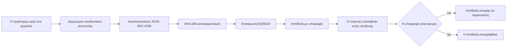
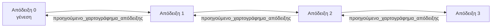

[Παρακολουθήστε το βίντεο μαθήματος: Ασφάλεια των Πρακτόρων AI με Κρυπτογραφικές Αποδείξεις](https://youtu.be/PLACEHOLDER_VIDEO_ID)

> _(Το βίντεο μαθήματος και η μικρογραφία θα προστεθούν από την ομάδα περιεχομένου της Microsoft μετά τη συγχώνευση, σύμφωνα με το πρότυπο των μαθημάτων 14 / 15.)_

# Ασφάλεια των Πρακτόρων AI με Κρυπτογραφικές Αποδείξεις

## Εισαγωγή

Αυτό το μάθημα θα καλύψει:

- Γιατί τα ίχνη ελέγχου για πράκτορες AI είναι σημαντικά για τη συμμόρφωση, την αποσφαλμάτωση και την εμπιστοσύνη.
- Τι είναι μια κρυπτογραφική απόδειξη και πώς διαφέρει από μια μη υπογεγραμμένη γραμμή καταγραφής.
- Πώς να παράγετε μια υπογεγραμμένη απόδειξη για μια κλήση εργαλείου ενός πράκτορα σε απλό Python.
- Πώς να επαληθεύσετε μια απόδειξη εκτός σύνδεσης και να ανιχνεύσετε παραποίηση.
- Πώς να αλυσσοδέσετε αποδείξεις ώστε η αφαίρεση ή η αναδιάταξη μίας να σπάει την αλυσίδα.
- Τι αποδεικνύουν οι αποδείξεις και τι ρητά δεν αποδεικνύουν.

## Στόχοι Μάθησης

Μετά την ολοκλήρωση αυτού του μαθήματος, θα γνωρίζετε πώς να:

- Αναγνωρίσετε τους τρόπους αποτυχίας που ωθούν στην κρυπτογραφική προέλευση των ενεργειών του πράκτορα.
- Παράγετε μια υπογεγραμμένη απόδειξη Ed25519 πάνω σε ένα κανονικοποιημένο φορτίο JSON.
- Επαληθεύετε μια απόδειξη ανεξάρτητα χρησιμοποιώντας μόνο το δημόσιο κλειδί του υπογράφοντα.
- Αντιληφθείτε την παραποίηση εκτελώντας ξανά την επαλήθευση σε μια τροποποιημένη απόδειξη.
- Δημιουργήσετε μια αλυσοδεμένη με κατακερματισμούς σειρά αποδείξεων και να εξηγήσετε γιατί η αλυσίδα έχει σημασία.
- Αναγνωρίσετε το όριο μεταξύ του τι αποδεικνύουν οι αποδείξεις (απόδοση, ακεραιότητα, χρονική σειρά) και τι δεν αποδεικνύουν (σωστότητα ενέργειας, εγκυρότητα πολιτικής).

## Το Πρόβλημα: Το Ίχνος Ελέγχου του Πράκτορά σας

Φανταστείτε ότι έχετε αναπτύξει έναν πράκτορα AI για την Contoso Travel. Ο πράκτορας διαβάζει αιτήματα πελατών, καλεί ένα API πτήσεων για να βρει επιλογές και κλείνει θέσεις για λογαριασμό του πελάτη. Το προηγούμενο τρίμηνο, ο πράκτορας επεξεργάστηκε 50.000 κρατήσεις.

Σήμερα έρχεται ένας επιθεωρητής. Κάνει μια απλή ερώτηση: «Δείξτε μου τι έκανε ο πράκτοράς σας.»

Εσείς παραδίδετε τα αρχεία καταγραφής. Ο επιθεωρητής τα κοιτάζει και κάνει την πιο δύσκολη ερώτηση: «Πώς ξέρω ότι αυτά τα αρχεία καταγραφής δεν τροποποιήθηκαν;»

Αυτό είναι το πρόβλημα του ίχνους ελέγχου. Στις περισσότερες αναπτύξεις πρακτόρων σήμερα χρησιμοποιούνται:

- **Αρχεία καταγραφής εφαρμογής**: γραμμένα από τον ίδιο τον πράκτορα, επεξεργάσιμα από οποιονδήποτε έχει πρόσβαση στο σύστημα αρχείων.
- **Υπηρεσίες καταγραφής cloud**: εμφανίζουν παραποίηση σε επίπεδο πλατφόρμας αλλά μόνο εάν ο επιθεωρητής εμπιστεύεται τον πάροχο της πλατφόρμας.
- **Αρχεία καταγραφής συναλλαγών βάσης δεδομένων**: κατάλληλα για αλλαγές βάσης δεδομένων αλλά όχι για αυθαίρετες κλήσεις εργαλείων.

Κανένα από αυτά δεν μπορεί να απαντήσει στην ερώτηση του επιθεωρητή χωρίς να απαιτεί από τον επιθεωρητή να εμπιστευτεί κάποιον (εσάς, τον πάροχο cloud, τον προμηθευτή βάσης δεδομένων). Για εσωτερική χρήση, αυτή η εμπιστοσύνη είναι συνήθως αποδεκτή. Για ρυθμιζόμενα φορτία εργασίας (χρηματοοικονομικά, υγειονομική περίθαλψη, οτιδήποτε υπόκειται στον Κανονισμό για την AI της ΕΕ), δεν είναι.

Οι κρυπτογραφικές αποδείξεις λύνουν αυτό το πρόβλημα κάνοντας κάθε ενέργεια πράκτορα ανεξάρτητα επαληθεύσιμη. Ο επιθεωρητής δεν χρειάζεται να σας εμπιστευτεί. Χρειάζεται μόνο το δημόσιο κλειδί σας και την ίδια την απόδειξη.

## Τι είναι μια Κρυπτογραφική Απόδειξη;

Μια απόδειξη είναι ένα αντικείμενο JSON που καταγράφει τι έκανε ένας πράκτορας, υπογεγραμμένο με ψηφιακή υπογραφή.



Μια ελάχιστη απόδειξη μοιάζει έτσι:

```json
{
  "type": "agent.tool_call.v1",
  "agent_id": "contoso-travel-bot",
  "tool_name": "lookup_flights",
  "tool_args_hash": "sha256:a3f9c1...",
  "result_hash": "sha256:7b2e1d...",
  "policy_id": "contoso-travel-policy-v3",
  "timestamp": "2026-04-25T14:30:00Z",
  "sequence": 47,
  "previous_receipt_hash": "sha256:9d4e6a...",
  "signature": {
    "alg": "EdDSA",
    "sig": "c5af83...",
    "public_key": "8f3b2c..."
  }
}
```

Τρεις ιδιότητες κάνουν τη δουλειά:

1. **Η υπογραφή.** Η απόδειξη υπογράφεται από την πύλη του πράκτορα χρησιμοποιώντας ένα ιδιωτικό κλειδί Ed25519. Οποιοσδήποτε με το αντίστοιχο δημόσιο κλειδί μπορεί να επαληθεύσει την υπογραφή εκτός σύνδεσης. Η παραποίηση οποιουδήποτε πεδίου ακυρώνει την υπογραφή.

2. **Κανονικοποιημένη κωδικοποίηση.** Πριν από την υπογραφή, η απόδειξη σειριοποιείται χρησιμοποιώντας το JSON Canonicalization Scheme (JCS, RFC 8785). Αυτό εξασφαλίζει ότι δύο υλοποιήσεις που παράγουν την ίδια λογική απόδειξη παράγουν και ακριβώς ίδια σε bytes έξοδο. Χωρίς κανονικοποίηση, διαφορετικοί σειριοποιητές JSON θα παρήγαγαν διαφορετικές υπογραφές για το ίδιο περιεχόμενο.

3. **Αλυσοδεμένος κατακερματισμός.** Το πεδίο `previous_receipt_hash` συνδέει κάθε απόδειξη με την προηγούμενη. Η αφαίρεση ή η αναδιάταξη μιας απόδειξης σπάει κάθε απόδειξη που ακολουθεί. Η παραποίηση γίνεται ορατή σε επίπεδο αλυσίδας ακόμη κι αν ξεπεραστούν ξεχωριστές υπογραφές.

Μαζί αυτές οι ιδιότητες παρέχουν τρεις εγγυήσεις:

- **Απόδοση**: αυτό το κλειδί υπέγραψε αυτό το περιεχόμενο.
- **Ακεραιότητα**: το περιεχόμενο δεν έχει αλλάξει από την υπογραφή.
- **Χρονική σειρά**: αυτή η απόδειξη ήρθε μετά την προηγούμενη στην αλυσίδα.

## Παραγωγή Απόδειξης σε Python

Δεν χρειάζεστε ειδική βιβλιοθήκη για να παράγετε μια απόδειξη. Οι κρυπτογραφικές πρωτόγονες λειτουργίες είναι ευρέως διαθέσιμες και η λογική είναι μερικές δεκάδες γραμμές Python.

Οι πρακτικές ασκήσεις στο `code_samples/18-signed-receipts.ipynb` περιγράφουν ολόκληρη τη ροή. Η συνοπτική έκδοση:

```python
import json
import hashlib
import base64
from nacl import signing
from jcs import canonicalize  # Πρότυπο RFC 8785 για κανονικό JSON

def b64url_nopad(data: bytes) -> str:
    return base64.urlsafe_b64encode(data).decode("ascii").rstrip("=")

def sha256_canonical(obj) -> str:
    """SHA-256 of a Python object's JCS-canonical JSON form."""
    return f"sha256:{hashlib.sha256(canonicalize(obj)).hexdigest()}"

# Δημιουργήστε ή φορτώστε ένα κλειδί υπογραφής (στην παραγωγή, αποθηκεύστε το σε θησαυροφυλάκιο κλειδιών)
signing_key = signing.SigningKey.generate()
verify_key = signing_key.verify_key

# Δημιουργήστε το φορτίο της απόδειξης (χωρίς υπογραφή ακόμα)
tool_args = {"origin": "SYD", "destination": "LAX"}
tool_result = [{"flight": "QF11", "price": 1850, "stops": 0}]

payload = {
    "type": "agent.tool_call.v1",
    "agent_id": "contoso-travel-bot",
    "tool_name": "lookup_flights",
    "tool_args_hash": sha256_canonical(tool_args),
    "result_hash": sha256_canonical(tool_result),
    "policy_id": "contoso-travel-policy-v3",
    "timestamp": "2026-04-25T14:30:00Z",
    "sequence": 0,
    "previous_receipt_hash": None,
}

# Κανονικοποιήστε, κάντε κατακερματισμό, υπογράψτε.
canonical_bytes = canonicalize(payload)
message_hash = hashlib.sha256(canonical_bytes).digest()
signature_bytes = signing_key.sign(message_hash).signature

# Επισυνάψτε ένα δομημένο αντικείμενο υπογραφής.
receipt = {
    **payload,
    "signature": {
        "alg": "EdDSA",
        "sig": b64url_nopad(signature_bytes),
        "public_key": b64url_nopad(bytes(verify_key)),
    },
}
```

Αυτή είναι ολόκληρη η διαδικασία υπογραφής. Οι ασκήσεις στο σημειωματάριο περνάνε από κάθε βήμα.

## Επαλήθευση Απόδειξης και Ανίχνευση Παραποίησης

Η επαλήθευση είναι η αντίστροφη διαδικασία:

```python
import base64
import hashlib
from nacl import signing
from nacl.exceptions import BadSignatureError
from jcs import canonicalize

def b64url_decode(s: str) -> bytes:
    padding = "=" * ((4 - len(s) % 4) % 4)
    return base64.urlsafe_b64decode(s + padding)

def verify_receipt(receipt: dict) -> bool:
    # Η υπογραφή είναι ένα δομημένο αντικείμενο: {"alg", "sig", "public_key"}.
    sig_obj = receipt.get("signature")
    if not sig_obj or sig_obj.get("alg") != "EdDSA":
        return False

    # Ανασυνθέστε το περιεχόμενο που υπογράφτηκε πραγματικά (όλα εκτός από την υπογραφή).
    payload = {k: v for k, v in receipt.items() if k != "signature"}

    canonical_bytes = canonicalize(payload)
    message_hash = hashlib.sha256(canonical_bytes).digest()

    try:
        verify_key = signing.VerifyKey(b64url_decode(sig_obj["public_key"]))
        verify_key.verify(message_hash, b64url_decode(sig_obj["sig"]))
        return True
    except BadSignatureError:
        return False
```

Αυτή η συνάρτηση παίρνει μια απόδειξη και επιστρέφει `True` εάν η υπογραφή είναι έγκυρη, `False` διαφορετικά. Χωρίς κλήση δικτύου, χωρίς εξάρτηση από υπηρεσία, χωρίς να απαιτείται εμπιστοσύνη σε τρίτο μέρος.

Για να δείτε την ανίχνευση παραποίησης σε δράση, το σημειωματάριο περνάει τα εξής:

1. Παραγωγή έγκυρης απόδειξης και επιβεβαίωση ότι επαληθεύεται.
2. Τροποποίηση ενός byte στο πεδίο `tool_args_hash`.
3. Επανεκτέλεση της επαλήθευσης και παρατήρηση αποτυχίας.

Αυτή είναι η πρακτική απόδειξη ότι οι αποδείξεις είναι ανιχνεύσιμες παραποίηση: οποιαδήποτε τροποποίηση, όσο μικρή κι αν είναι, σπάει την υπογραφή.

## Αλυσοδεμένες Αποδείξεις για Πράκτορες Πολλαπλών Βημάτων

Μια υπογεγραμμένη απόδειξη προστατεύει μια ενέργεια. Μια αλυσίδα αποδείξεων προστατεύει μια ακολουθία.



Κάθε απόδειξη καταγράφει το κατακερματισμένο της προηγούμενης απόδειξης. Για να αφαιρέσει ένας επιτιθέμενος την απόδειξη 2 αθόρυβα, θα έπρεπε είτε να:

- Τροποποιήσει το πεδίο `previous_receipt_hash` της απόδειξης 3 (σπάει την υπογραφή της απόδειξης 3), ή
- Πλαστογραφήσει μια νέα υπογραφή σε τροποποιημένη απόδειξη 3 (απαιτεί το ιδιωτικό κλειδί του πράκτορα).

Εάν το ιδιωτικό κλειδί είναι σε υλικό θησαυροφυλάκιο και δημοσιεύετε το δημόσιο κλειδί με κάθε απόδειξη, καμία από αυτές τις επιθέσεις δεν είναι εφικτή χωρίς ανίχνευση.

Το σημειωματάριο περνάει:

1. Δημιουργία αλυσίδας τριών αποδείξεων.
2. Επαλήθευση ότι το `previous_receipt_hash` κάθε απόδειξης ταιριάζει με τον πραγματικό κατακερματισμό της προηγούμενης.
3. Παραποίηση μίας απόδειξης στη μέση και παρατήρηση ότι σπάει η αλυσίδα ακριβώς εκεί.

Έτσι παράγετε ένα ίχνος ελέγχου που μπορεί να επαληθεύσει εξωτερικός επιθεωρητής χωρίς να σας εμπιστευτεί.

## Τι Αποδεικνύουν οι Αποδείξεις (και Τι Δεν Αποδεικνύουν)

Αυτή είναι η πιο σημαντική ενότητα αυτού του μαθήματος. Οι αποδείξεις είναι ισχυρές αλλά η ισχύς τους έχει όρια.

**Οι αποδείξεις αποδεικνύουν τρία πράγματα:**

1. **Απόδοση**: ένα συγκεκριμένο κλειδί υπέγραψε ένα συγκεκριμένο φορτίο.
2. **Ακεραιότητα**: το φορτίο δεν έχει αλλάξει από την υπογραφή.
3. **Χρονική σειρά**: αυτή η απόδειξη ήρθε μετά από εκείνη στην αλυσίδα κατακερματισμού.

**Οι αποδείξεις ΔΕΝ αποδεικνύουν:**

1. **Σωστότητα**: ότι η ενέργεια του πράκτορα ήταν η σωστή ενέργεια. Μια απόδειξη μπορεί να υπογραφεί για λάθος απάντηση το ίδιο καθαρά όσο και για σωστή.
2. **Συμμόρφωση με πολιτική**: ότι η πολιτική που αναφέρεται στο `policy_id` αξιολογήθηκε πράγματι ή ότι θα επέτρεπε αυτήν την ενέργεια αν ελεγχόταν. Η απόδειξη καταγράφει τι ισχυρίστηκε, όχι τι επιβλήθηκε.
3. **Ταυτότητα πέρα από το κλειδί**: η απόδειξη λέει "αυτό το κλειδί υπέγραψε αυτό το περιεχόμενο." Δεν λέει "αυτό το άτομο εξουσιοδότησε αυτό." Η σύνδεση κλειδιού με άτομο ή οργανισμό απαιτεί ξεχωριστή υποδομή ταυτότητας (κατάλογο, μητρώο δημόσιων κλειδιών κ.λπ.).
4. **Αλήθεια των εισόδων**: αν ο πράκτορας λάβει προσχέδιο με παραποίηση και ενεργήσει, η απόδειξη καταγράφει πιστά την ενέργεια. Οι αποδείξεις είναι κάτω από τον έλεγχο εισόδου, όχι υποκατάστατό του.

Αυτά τα όρια έχουν σημασία για δύο λόγους:

- Σας λένε για τι είναι χρήσιμες οι αποδείξεις: να κάνουν τη συμπεριφορά του πράκτορα ελέγξιμη και ανιχνεύσιμη, ακόμη και μεταξύ οργανισμών.
- Σας λένε τι επιπλέον στρώματα χρειάζεστε: έλεγχο εισόδου (Μάθημα 6), επιβολή πολιτικής (σύντομα παρακάτω) και υποδομή ταυτότητας (έξω από το πεδίο αυτού του μαθήματος).

Ένα συνηθισμένο λάθος είναι να υποθέτετε ότι «έχουμε αποδείξεις» σημαίνει «έχουμε διακυβέρνηση». Δεν ισχύει. Οι αποδείξεις είναι η βάση. Η διακυβέρνηση είναι το σύστημα που χτίζετε από πάνω.

## Αναφορές Παραγωγής

Ο κώδικας Python σε αυτό το μάθημα είναι σκόπιμα ελάχιστος ώστε να διαβάζετε κάθε γραμμή και να κατανοείτε ακριβώς τι συμβαίνει. Σε παραγωγή, έχετε δύο επιλογές:

1. **Να βασιστείτε απευθείας στις κρυπτογραφικές πρωτόγονες συναρτήσεις.** Οι 50 γραμμές που είδατε παραπάνω είναι επαρκείς για πολλές χρήσεις. Οι βιβλιοθήκες PyNaCl (Ed25519) και το πακέτο `jcs` (κανονικό JSON) είναι καλά συντηρημένες και ελεγμένες.

2. **Να χρησιμοποιήσετε βιβλιοθήκη παραγωγής αποδείξεων.** Πολλά ανοιχτού κώδικα έργα εφαρμόζουν το ίδιο πρότυπο με επιπρόσθετα χαρακτηριστικά (περιστροφή κλειδιών, ομαδική επαλήθευση, διανομή JWK Set, ενσωμάτωση με μηχανές πολιτικής):
   - Η μορφή απόδειξης που χρησιμοποιείται εδώ ακολουθεί ένα IETF Internet-Draft (`draft-farley-acta-signed-receipts`) που βρίσκεται στη διαδικασία στάνταρ.
   - Το Microsoft Agent Governance Toolkit συνθέτει αποδείξεις με αποφάσεις πολιτικής βασισμένες σε Cedar· δείτε το Tutorial 33 σε εκείνη την αποθήκη για παράδειγμα πλήρους ροής.
   - Τα πακέτα `protect-mcp` (npm) και `@veritasacta/verify` (npm) παρέχουν Node υλοποίηση υπογραφής και επαλήθευσης αποδείξεων εκτός σύνδεσης, για την τυλίγηση οποιουδήποτε MCP server με ένα ίχνος ελέγχου ανιχνεύσιμο παραποίησης.

Η απόφαση μεταξύ του να φτιάξετε τη δική σας λύση ή να χρησιμοποιήσετε βιβλιοθήκη μιμείται την απόφαση μεταξύ συγγραφής δικής σας βιβλιοθήκης JWT και χρήσης δοκιμασμένης: και οι δύο είναι λογικές· η βιβλιοθήκη εξοικονομεί χρόνο και μειώνει την επιφάνεια ελέγχου· η λύση από το μηδέν σας αναγκάζει να καταλάβετε κάθε primitive. Αυτό το μάθημα διδάσκει τον δρόμο από το μηδέν ώστε να έχετε τη βάση για οποιαδήποτε επιλογή.

## Έλεγχος Γνώσης

Ελέγξτε την κατανόησή σας πριν προχωρήσετε στην πρακτική άσκηση.

**1. Μια απόδειξη υπογράφεται με το ιδιωτικό κλειδί Ed25519 του πράκτορα. Ο επιθεωρητής έχει μόνο το δημόσιο κλειδί. Μπορεί ο επιθεωρητής να επαληθεύσει την απόδειξη εκτός σύνδεσης;**

<details>
<summary>Απάντηση</summary>

Ναι. Η επαλήθευση Ed25519 απαιτεί μόνο το δημόσιο κλειδί και τα υπογεγραμμένα bytes. Χωρίς κλήση δικτύου, χωρίς εξάρτηση από υπηρεσία. Αυτό είναι το χαρακτηριστικό που κάνει τις αποδείξεις χρήσιμες σε απομονωμένα, πολυ-οργανωσιακά ή περιβάλλοντα χαμηλής εμπιστοσύνης ελέγχου.
</details>

**2. Ένας επιτιθέμενος τροποποιεί το πεδίο `policy_id` μιας απόδειξης για να υποστηρίξει ότι κυβερνήθηκε από πιο επιεική πολιτική. Η υπογραφή ήταν πάνω στο αρχικό φορτίο. Τι συμβαίνει κατά την επαλήθευση;**

<details>
<summary>Απάντηση</summary>

Η επαλήθευση αποτυγχάνει. Η υπογραφή υπολογίστηκε πάνω στα κανονικά bytes του αρχικού φορτίου· η τροποποίηση οποιουδήποτε πεδίου αλλάζει τα κανονικά bytes, που αλλάζει και τον κατακερματισμό SHA-256, καθιστώντας την υπογραφή άκυρη. Ο επιτιθέμενος θα χρειαζόταν το ιδιωτικό κλειδί για να παράγει νέα έγκυρη υπογραφή, την οποία δεν έχει.
</details>

**3. Γιατί η απόδειξη περιλαμβάνει `tool_args_hash` και `result_hash` αντί για τις ακατέργαστες παραμέτρους και το αποτέλεσμα;**

<details>
<summary>Απάντηση</summary>

Δύο λόγοι. Πρώτον, η απόδειξη μπορεί να χρειαστεί να αρχειοθετηθεί ή να μεταδοθεί σε περιβάλλοντα όπου η διαρροή ακατέργαστου περιεχομένου (PII, επιχειρηματικά δεδομένα) αποτελεί πρόβλημα. Ο κατακερματισμός διατηρεί την απόδειξη μικρή και το περιεχόμενο ιδιωτικό· ο επιθεωρητής επαληθεύει ότι ο κατακερματισμός ταιριάζει με ανεξάρτητα αποθηκευμένο αντίγραφο του πραγματικού περιεχομένου. Δεύτερον, οι κατακερματισμοί έχουν σταθερό μέγεθος· μια απόδειξη με κατακερματισμούς έχει περιορισμένο μέγεθος ανεξαρτήτως του πόσο μεγάλα ήταν τα εισαγωγικά και εξαγωγικά δεδομένα.
</details>

**4. Το πεδίο `previous_receipt_hash` συνδέει κάθε απόδειξη με την προηγούμενή της. Αν ένας επιτιθέμενος διαγράψει αθόρυβα μια απόδειξη από τη μέση αλυσίδας, τι καθίσταται άκυρο;**

<details>
<summary>Απάντηση</summary>

Κάθε απόδειξη που ακολουθεί την διαγραμμένη. Τα πεδία `previous_receipt_hash` τους δεν ταιριάζουν πια με την πραγματική αλυσίδα (επειδή η απόδειξη που αναφέρονταν δεν υπάρχει ή η αλυσίδα τώρα δείχνει σε άλλο προκάτοχο). Για να αποκρύψει τη διαγραφή, ο επιτιθέμενος θα έπρεπε να υπογράψει ξανά κάθε επόμενη απόδειξη, που απαιτεί το ιδιωτικό κλειδί.
</details>

**5. Μια απόδειξη επαληθεύεται κανονικά. Αποδεικνύει αυτό ότι η ενέργεια του πράκτορα ήταν σωστή, ορθή ή συμμόρφωση με πολιτική;**

<details>
<summary>Απάντηση</summary>

Όχι. Μια έγκυρη απόδειξη αποδεικνύει τρία πράγματα: απόδοση (αυτό το κλειδί υπέγραψε αυτό το περιεχόμενο), ακεραιότητα (το περιεχόμενο δεν άλλαξε) και χρονική σειρά (αυτή η απόδειξη ήρθε μετά την προηγούμενη). ΔΕΝ αποδεικνύει ότι η ενέργεια ήταν σωστή, ότι η πολιτική στο `policy_id` αξιολογήθηκε πράγματι ή ότι ο πράκτορας ακολούθησε κάθε κανόνα. Οι αποδείξεις κάνουν τη συμπεριφορά του πράκτορα ελέγξιμη, όχι απαραίτητα σωστή. Αυτό είναι το πιο σημαντικό όριο στο μάθημα.
</details>

## Πρακτική Άσκηση

Ανοίξτε το `code_samples/18-signed-receipts.ipynb` και ολοκληρώστε και τις τέσσερις ενότητες:

1. **Ενότητα 1**: Υπογράψτε την πρώτη σας απόδειξη και επαληθεύστε την.
2. **Ενότητα 2**: Παραποιήστε την απόδειξη και παρακολουθήστε την αποτυχία επαλήθευσης.
3. **Ενότητα 3**: Δημιουργήστε αλυσίδα τριών αποδείξεων και επαληθεύστε την ακεραιότητα της αλυσίδας.
4. **Ενότητα 4**: Εφαρμόστε το πρότυπο σε πράκτορα κατασκευασμένο με το Microsoft Agent Framework: τυλίξτε μια κλήση εργαλείου με υπογραφή απόδειξης, στη συνέχεια επαληθεύστε την απόδειξη ανεξάρτητα.

**Πρόκληση επιπλέον 1:** επεκτείνετε το σχήμα απόδειξης με ένα επιπρόσθετο πεδίο της επιλογής σας (π.χ. ένα ID αιτήματος για ιχνηλάτηση), ενημερώστε τη λογική κανονικής υπογραφής να το συμπεριλαμβάνει, και επιβεβαιώστε ότι η απόδειξη περνάει ξανά την επαλήθευση. Μετά τροποποιήστε το πεδίο μετά την υπογραφή και επιβεβαιώστε ότι η επαλήθευση αποτυγχάνει. Αυτό σας αναγκάζει να κατανοήσετε πώς κάθε byte της κανονικής κωδικοποίησης συμβάλλει στην υπογραφή.
**Πρόκληση επέκτασης 2:** Δημιουργήστε SHA-256 hash δύο αποδείξεών σας μαζί (συνδέστε τα κανονικά bytes τους με έναν καθοριστικό τρόπο) και ενσωματώστε το προκύπτον digest ως νέο πεδίο σε μια τρίτη απόδειξη προτού την υπογράψετε. Επαληθεύστε ότι και οι τρεις αποδείξεις παραμένουν πλήρως ελεγμένες και επαληθεύσιμες. Μόλις δημιουργήσατε μια απόδειξη ενσωμάτωσης ενός βήματος: οποιοσδήποτε έχει την τρίτη απόδειξη μπορεί να αποδείξει ότι οι δύο πρώτες υπήρχαν τη στιγμή που υπογράφηκε, χωρίς να χρειαστεί να αποκαλύψει το περιεχόμενό τους. Αυτό είναι το μοτίβο που χρησιμοποιούν σε μεγάλη κλίμακα οι αποδείξεις με επιλεκτική αποκάλυψη (Merkle commitments, RFC 6962).

## Συμπέρασμα

Οι κρυπτογραφικές αποδείξεις παρέχουν στους πράκτορες AI ένα ίχνος ελέγχου που είναι:

- **Ανεξάρτητα επαληθεύσιμο:** οποιοδήποτε μέρος με το δημόσιο κλειδί μπορεί να επαληθεύσει, χωρίς εξάρτηση από υπηρεσία.
- **Ενδεικτικό παραβίασης:** οποιαδήποτε τροποποίηση ακυρώνει την υπογραφή.
- **Φορητό:** μια απόδειξη είναι ένα μικρό αρχείο JSON· μπορεί να αρχειοθετηθεί, να μεταδοθεί και να επαληθευτεί οπουδήποτε.
- **Συμβατό με πρότυπα:** βασίζεται σε Ed25519 (RFC 8032), JCS (RFC 8785) και SHA-256, όλα ευρέως διαδεδομένα πρωτόκολλα.

Δεν είναι υποκατάστατο της επαλήθευσης εισόδου, της επιβολής πολιτικής ή της υποδομής ταυτότητας. Είναι το θεμέλιο για αυτές τις στρώσεις. Όταν αναπτύσσετε πράκτορες σε ελεγχόμενα εργασιακά φορτία, πολυ-οργανωτικά ροή εργασίας ή οποιοδήποτε περιβάλλον όπου ένας μελλοντικός ελεγκτής δεν μπορεί να υποτεθεί ότι σας εμπιστεύεται, οι αποδείξεις είναι ο τρόπος με τον οποίο κάνετε ειλικρινές το ίχνος ελέγχου.

Το πιο σημαντικό συμπέρασμα: οι αποδείξεις αποδεικνύουν ποιος είπε τι, πότε. Δεν αποδεικνύουν ότι αυτό που ειπώθηκε ήταν αληθινό ή σωστό. Κρατήστε αυτή τη διάκριση αυστηρά. Είναι η διαφορά μεταξύ ενός έντιμου συστήματος προέλευσης και ενός παραπλανητικού.

## Λίστα Ελέγχου Παραγωγής

Όταν είστε έτοιμοι να προχωρήσετε από αυτό το μάθημα στην ανάπτυξη πρακτόρων με υπογεγραμμένες αποδείξεις σε πραγματικό περιβάλλον:

- [ ] **Μετακινήστε το κλειδί υπογραφής μακριά από το φορητό υπολογιστή του προγραμματιστή.** Χρησιμοποιήστε Azure Key Vault, AWS KMS ή ένα υλικό ασφαλείας. Το ιδιωτικό κλειδί που υπογράφει τις αποδείξεις σας δεν πρέπει ποτέ να ζει σε έλεγχο πηγαίου κώδικα ή σε απλό κείμενο σε μηχανές εφαρμογών.
- [ ] **Δημοσιεύστε το δημόσιο κλειδί επαλήθευσης.** Οι ελεγκτές το χρειάζονται για επαλήθευση εκτός σύνδεσης. Το πρότυπο είναι ένα σύνολο JWK σε γνωστή διεύθυνση URL (RFC 7517), π.χ. `https://your-org.example.com/.well-known/agent-keys.json`.
- [ ] **Αγκυρώστε την αλυσίδα εξωτερικά.** Περιοδικά γράψτε το τελευταίο hash της αλυσίδας σε ένα διάφανο μητρώο (Sigstore Rekor, RFC 3161 αρχή σφραγίδας χρονικού σήματος, ή δεύτερο εσωτερικό σύστημα) έτσι ώστε ένα εξωτερικό μέρος να μπορεί να επιβεβαιώσει "ότι αυτή η αλυσίδα υπήρχε κατά αυτήν την ώρα."
- [ ] **Αποθηκεύστε τις αποδείξεις αμετάβλητα.** Αποθήκευση τύπου append-only (Azure Storage με πολιτικές αμετακίνησης, AWS S3 Object Lock) αποτρέπει κάποιον εσωτερικό από το να ξαναγράψει το ιστορικό σε επίπεδο αποθήκευσης.
- [ ] **Αποφασίστε για την διατήρηση.** Πολλοί κανονισμοί συμμόρφωσης απαιτούν διατήρηση ετών. Προγραμματίστε την ανάπτυξη των αποδείξεων (κάθε απόδειξη είναι ~500 bytes· ένας πράκτορας που κάνει 10.000 κλήσεις την ημέρα παράγει ~1.8 GB ανά έτος).
- [ ] **Τεκμηριώστε τι δεν καλύπτουν οι αποδείξεις.** Οι αποδείξεις αποδεικνύουν την απόδοση, την ακεραιότητα και τη σειρά. Το εγχειρίδιό σας πρέπει να αναφέρει ρητά ποιους επιπλέον ελέγχους (επαλήθευση εισόδου, επιβολή πολιτικής, περιορισμός ρυθμού, υποδομή ταυτότητας) συνοδεύουν τις αποδείξεις στη διακυβέρνησή σας.

### Έχετε περισσότερες ερωτήσεις σχετικά με την ασφάλεια των πρακτόρων AI;

Ενταχθείτε στο [Microsoft Foundry Discord](https://aka.ms/ai-agents/discord) για να συναντήσετε άλλους εκπαιδευόμενους, να παρακολουθήσετε ώρες γραφείου και να λύσετε τις απορίες σας για τους Πράκτορες AI.

## Πέρα από αυτό το μάθημα

Αυτό το μάθημα καλύπτει μονή υπογραφή απόδειξης και αλυσίδες με hash. Οι ίδιες πρωτόκολλες συνθέτουν πολλά πιο προχωρημένα μοτίβα που μπορεί να συναντήσετε καθώς αναπτύσσεται η διακυβέρνησή σας:

- **Επιλεκτική αποκάλυψη.** Όταν τα πεδία μιας απόδειξης δεσμεύονται ανεξάρτητα (δέντρο Merkle τύπου RFC 6962), μπορείτε να αποκαλύψετε συγκεκριμένα πεδία σε συγκεκριμένους ελεγκτές και να αποδείξετε ότι τα υπόλοιπα δεν έχουν αλλάξει χωρίς να τα εκθέσετε. Χρήσιμο όταν η ίδια απόδειξη πρέπει να ικανοποιεί και πλήρη έλεγχο (που απαιτεί πληρότητα) και κανονισμούς ελάχιστης συλλογής δεδομένων όπως το GDPR (που θέλουν ο ελεγκτής να βλέπει όσο το δυνατόν λιγότερα).
- **Ακύρωση απόδειξης.** Εάν ένα κλειδί υπογραφής παραβιαστεί, χρειάζεστε έναν τρόπο να χαρακτηρίσετε όλες τις αποδείξεις υπογεγραμμένες από αυτό το κλειδί ως μη αξιόπιστες από μια στιγμή και μετά. Τυπικά μοτίβα: σύντομα κλειδιά υπογραφής και δημοσιευμένη λίστα ακύρωσης, ή μητρώο διαφάνειας με καταχωρήσεις ακύρωσης.
- **Διμερής / αποδείξεις με διαχωρισμένη υπογραφή.** Μερικές υλοποιήσεις χωρίζουν το υπογεγραμμένο payload σε πριν την εκτέλεση (`authorization_*`) και μετά την εκτέλεση (`result_*`) με ανεξάρτητες υπογραφές, χρήσιμο όταν η απόφαση εξουσιοδότησης και το παρατηρούμενο αποτέλεσμα προέρχονται από διαφορετικούς φορείς ή χρονικές στιγμές. Προστίθεται επικάλυψη πάνω στη μορφή απόδειξης που διδάχθηκε σε αυτό το μάθημα.
- **Σύνθεση payload.** Μια απόδειξη κλειδώνει όποια bytes βάζετε στο `result_hash`. Πραγματικά δεδομένα είναι συχνά πλουσιότερα από το αποτέλεσμα μιας μόνο κλήσης εργαλείου: προεκτιμήσεις (μοντέλο, επιλογές που εξετάστηκαν, αποδεικτικά στοιχεία και η πληρότητά τους, στάση κινδύνου, αλυσίδα υπευθυνότητας, αποτέλεσμα πυλών) μπορούν να ζουν μέσα στο payload, κλειδωμένα από μία μόνο απόδειξη. Έτσι η μορφή της απόδειξης παραμένει ελάχιστη ενώ τα schema payload εξελίσσονται ανά τομέα.
- **Διασταυρούμενη συμμόρφωση υλοποιήσεων.** Πολλές ανεξάρτητες υλοποιήσεις της ίδιας μορφής απόδειξης (Python, TypeScript, Rust, Go) επαληθεύουν διασταυρωμένα με κοινές δοκιμαστικές διανύσματα. Αν φτιάξετε δική σας υλοποίηση, η επαλήθευση με δημοσιευμένους διανύσματα επιβεβαιώνει συμβατότητα σύρματος.
- **Μετάβαση μετά-κβαντικής.** Το Ed25519 είναι ευρέως αναπτυγμένο σήμερα αλλά δεν είναι ανθεκτικό στους κβαντικούς υπολογιστές. Η μορφή απόδειξης είναι ευέλικτη αλγορίθμου: το πεδίο `signature.alg` μπορεί να μεταφέρει `ML-DSA-65` (το πρότυπο υπογραφής μετά-κβαντικής του NIST) όταν χρειαστείτε μετάβαση. Προγραμματίστε μια περίοδο μετάβασης όπου οι αποδείξεις θα έχουν διπλές υπογραφές.

## Πρόσθετοι Πόροι

- <a href="https://datatracker.ietf.org/doc/draft-farley-acta-signed-receipts/" target="_blank">IETF Internet-Draft: Signed Decision Receipts for Machine-to-Machine Access Control</a>
- <a href="https://learn.microsoft.com/azure/ai-studio/responsible-use-of-ai-overview" target="_blank">Υπεύθυνη χρήση AI (Azure AI)</a>
- <a href="https://datatracker.ietf.org/doc/html/rfc8032" target="_blank">RFC 8032: Αλγόριθμος Ψηφιακής Υπογραφής Edwards-Curve (EdDSA)</a>
- <a href="https://datatracker.ietf.org/doc/html/rfc8785" target="_blank">RFC 8785: JSON Canonicalization Scheme (JCS)</a>
- <a href="https://datatracker.ietf.org/doc/html/rfc6962" target="_blank">RFC 6962: Διαφάνεια Πιστοποιητικών</a> (Κατασκευή δέντρου Merkle που χρησιμοποιούν οι αποδείξεις επιλεκτικής αποκάλυψης)
- <a href="https://github.com/microsoft/agent-governance-toolkit/blob/main/docs/tutorials/33-offline-verifiable-receipts.md" target="_blank">Microsoft Agent Governance Toolkit, Tutorial 33: Επαληθεύσιμες Εκτός Δικτύου Αποφάσεις με Αποδείξεις</a>
- <a href="https://github.com/ScopeBlind/agent-governance-testvectors" target="_blank">Διασταυρούμενη συμμόρφωση υλοποιήσεων διανύσματα δοκιμών</a> για τη μορφή απόδειξης που χρησιμοποιείται σε αυτό το μάθημα (Apache-2.0)
- <a href="https://pynacl.readthedocs.io/" target="_blank">Τεκμηρίωση PyNaCl</a> (Ed25519 σε Python)

## Προηγούμενο Μάθημα

[Building Computer Use Agents (CUA)](../15-browser-use/README.md)

## Επόμενο Μάθημα

_(Θα καθοριστεί από τους συντηρητές του προγράμματος σπουδών)_

---

<!-- CO-OP TRANSLATOR DISCLAIMER START -->
**Αποποίηση ευθυνών**:
Αυτό το έγγραφο έχει μεταφραστεί χρησιμοποιώντας την υπηρεσία μετάφρασης με τεχνητή νοημοσύνη [Co-op Translator](https://github.com/Azure/co-op-translator). Ενώ επιδιώκουμε την ακρίβεια, παρακαλούμε να έχετε υπόψη ότι οι αυτοματοποιημένες μεταφράσεις ενδέχεται να περιέχουν λάθη ή ανακρίβειες. Το πρωτότυπο έγγραφο στη μητρική του γλώσσα πρέπει να θεωρείται η αυθεντική πηγή. Για κρίσιμες πληροφορίες, συνιστάται επαγγελματική ανθρώπινη μετάφραση. Δεν φέρουμε ευθύνη για τυχόν παρεξηγήσεις ή λανθασμένες ερμηνείες που προκύπτουν από τη χρήση αυτής της μετάφρασης.
<!-- CO-OP TRANSLATOR DISCLAIMER END -->