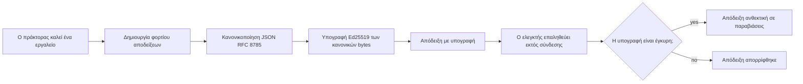
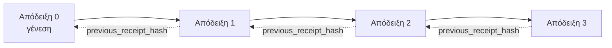

[Παρακολουθήστε το βίντεο του μαθήματος: Ασφάλεια των Αντιπροσώπων AI με Κρυπτογραφικές Αποδείξεις](https://youtu.be/PLACEHOLDER_VIDEO_ID)

> _(Το βίντεο του μαθήματος και η μικρογραφία θα προστεθούν από την ομάδα περιεχομένου της Microsoft μετά τη συγχώνευση, σύμφωνα με το μοτίβο του μαθήματος 14 / 15.)_

# Ασφάλεια των Αντιπροσώπων AI με Κρυπτογραφικές Αποδείξεις

## Εισαγωγή

Αυτό το μάθημα θα καλύψει:

- Γιατί τα ίχνη ελέγχου για τους αντιπροσώπους AI έχουν σημασία για τη συμμόρφωση, τον αποσφαλματωτή και την εμπιστοσύνη.
- Τι είναι μια κρυπτογραφική απόδειξη και πώς διαφέρει από μια μη υπογεγραμμένη γραμμή καταγραφής.
- Πώς να δημιουργήσετε μια υπογεγραμμένη απόδειξη για κλήση εργαλείου ενός αντιπροσώπου σε απλό Python.
- Πώς να επαληθεύσετε μια απόδειξη εκτός σύνδεσης και να ανιχνεύσετε παραποίηση.
- Πώς να αλυσιδωθείτε αποδείξεις έτσι ώστε η αφαίρεση ή η αναδιάταξη μιας να διακόπτει την αλυσίδα.
- Τι αποδεικνύουν οι αποδείξεις και τι ρητά δεν αποδεικνύουν.

## Στόχοι Μάθησης

Μετά την ολοκλήρωση αυτού του μαθήματος, θα γνωρίζετε πώς να:

- Αναγνωρίσετε τους τρόπους αποτυχίας που κινητοποιούν την κρυπτογραφική προέλευση για τις ενέργειες των αντιπροσώπων.
- Παράγετε μια υπογεγραμμένη Ed25519 απόδειξη πάνω σε ένα κανονικό φορτίο JSON.
- Επαληθεύσετε μια απόδειξη ανεξάρτητα χρησιμοποιώντας μόνο το δημόσιο κλειδί του υπογράφοντα.
- Ανιχνεύσετε παραποίηση ξανακοιτώντας την επαλήθευση σε μια τροποποιημένη απόδειξη.
- Δημιουργήσετε μια αλυσιδωτή ακολουθία αποδείξεων με κατακερματισμό και να εξηγήσετε γιατί η αλυσίδα έχει σημασία.
- Αναγνωρίσετε τα όρια μεταξύ του τι αποδεικνύουν οι αποδείξεις (απόδοση, ακεραιότητα, σειρά) και του τι δεν κάνουν (ορθότητα της ενέργειας, ορθότητα της πολιτικής).

## Το Πρόβλημα: Το Ιχνος Ελέγχου του Αντιπροσώπου σας

Φανταστείτε ότι έχετε αναπτύξει έναν αντιπρόσωπο AI για την Contoso Travel. Ο αντιπρόσωπος διαβάζει αιτήματα πελατών, καλεί API πτήσεων για να αναζητήσει επιλογές, και κλείνει θέσεις εκ μέρους του πελάτη. Το προηγούμενο τρίμηνο, ο αντιπρόσωπος επεξεργάστηκε 50.000 κρατήσεις.

Σήμερα έρχεται ένας ελεγκτής. Κάνει μια απλή ερώτηση: "Δείξε μου τι έκανε ο αντιπρόσωπός σου."

Παραδίδετε τα αρχεία καταγραφής σας. Ο ελεγκτής τα κοιτάζει και κάνει την πιο δύσκολη ερώτηση: "Πώς ξέρω ότι αυτά τα αρχεία καταγραφής δεν τροποποιήθηκαν;"

Αυτό είναι το πρόβλημα του ιχνού ελέγχου. Οι περισσότερες σημερινές αναπτύξεις αντιπροσώπων βασίζονται σε:

- **Αρχεία καταγραφής εφαρμογής**: γραμμένα από τον ίδιο τον αντιπρόσωπο, επεξεργάσιμα από οποιονδήποτε έχει πρόσβαση στο σύστημα αρχείων.
- **Υπηρεσίες καταγραφής νέφους**: ανιχνεύσιμες παραποιήσεις σε επίπεδο πλατφόρμας, αλλά μόνο αν ο ελεγκτής εμπιστεύεται τον χειριστή της πλατφόρμας.
- **Αρχεία καταγραφής συναλλαγών βάσης δεδομένων**: κατάλληλα για αλλαγές στη βάση αλλά όχι για αυθαίρετες κλήσεις εργαλείων.

Κανένα από αυτά δεν μπορεί να απαντήσει στην ερώτηση του ελεγκτή χωρίς να απαιτείται εμπιστοσύνη σε κάποιον (εσάς, τον πάροχο νέφους σας, τον προμηθευτή της βάσης δεδομένων σας). Για εσωτερική χρήση, αυτή η εμπιστοσύνη είναι συχνά αποδεκτή. Για ρυθμιζόμενα φορτία εργασίας (οικονομικά, υγεία, οτιδήποτε υπόκειται στον κανονισμό AI της ΕΕ), δεν είναι.

Οι κρυπτογραφικές αποδείξεις λύνουν αυτό το πρόβλημα καθιστώντας κάθε ενέργεια αντιπροσώπου ανεξάρτητα επαληθεύσιμη. Ο ελεγκτής δεν χρειάζεται να σας εμπιστευτεί. Χρειάζεται μόνο το δημόσιο κλειδί σας και την ίδια την απόδειξη.

## Τι είναι μια Κρυπτογραφική Απόδειξη;

Μια απόδειξη είναι ένα αντικείμενο JSON που καταγράφει τι έκανε ένας αντιπρόσωπος, υπογεγραμμένο με ψηφιακή υπογραφή.


```mermaid
flowchart LR
    A[Ο πράκτορας καλεί ένα εργαλείο] --> B[Δημιουργία φορτίου αποδείξεων]
    B --> C[Κανονικοποίηση JSON RFC 8785]
    C --> E[Υπογραφή Ed25519 των κανονικών bytes]
    E --> F[Απόδειξη με υπογραφή]
    F --> G[Ο ελεγκτής επαληθεύει εκτός σύνδεσης]
    G --> H{Η υπογραφή είναι έγκυρη;}
    H -- yes --> I[Απόδειξη ανθεκτική σε παραβιάσεις]
    H -- no --> J[Απόδειξη απορρίφθηκε]
```

Μια ελάχιστη απόδειξη μοιάζει έτσι:

```json
{
  "type": "agent.tool_call.v1",
  "agent_id": "contoso-travel-bot",
  "tool_name": "lookup_flights",
  "tool_args_hash": "sha256:a3f9c1...",
  "result_hash": "sha256:7b2e1d...",
  "policy_id": "contoso-travel-policy-v3",
  "timestamp": "2026-04-25T14:30:00Z",
  "sequence": 47,
  "previous_receipt_hash": "sha256:9d4e6a...",
  "signature": {
    "alg": "EdDSA",
    "sig": "c5af83...",
    "public_key": "8f3b2c..."
  }
}
```

Τρεις ιδιότητες κάνουν τη δουλειά:

1. **Η υπογραφή**. Η απόδειξη υπογράφεται από την πύλη του αντιπροσώπου χρησιμοποιώντας ένα ιδιωτικό κλειδί Ed25519. Οποιοσδήποτε με το αντίστοιχο δημόσιο κλειδί μπορεί να επαληθεύσει την υπογραφή εκτός σύνδεσης. Η παραποίηση σε οποιοδήποτε πεδίο ακυρώνει την υπογραφή.

2. **Κανόνιικός κωδικοποιητής**. Πριν την υπογραφή, η απόδειξη σειριοποιείται χρησιμοποιώντας το Σχήμα Κανόνικης JSON (JCS, RFC 8785). Αυτό διασφαλίζει ότι δύο υλοποιήσεις που παράγουν την ίδια λογική απόδειξη παράγουν ακριβώς το ίδιο byte-output. Χωρίς κανόνικοποίηση, διαφορετικοί σειριοποιητές JSON θα παρήγαγαν διαφορετικές υπογραφές για το ίδιο περιεχόμενο.

3. **Αλυσιδωτός κατακερματισμός**. Το πεδίο `previous_receipt_hash` συνδέει κάθε απόδειξη με την προηγούμενη. Η αφαίρεση ή αναδιάταξη μιας απόδειξης διακόπτει κάθε απόδειξη που ακολουθεί. Η παραποίηση γίνεται ορατή σε επίπεδο αλυσίδας ακόμα και αν παρακαμφθούν οι μεμονωμένες υπογραφές.

Μαζί, αυτές οι ιδιότητες παρέχουν τρεις εγγυήσεις:

- **Απόδοση**: αυτό το κλειδί υπέγραψε αυτό το περιεχόμενο.
- **Ακεραιότητα**: το περιεχόμενο δεν έχει αλλάξει μετά την υπογραφή.
- **Σειροθέτηση**: αυτή η απόδειξη ήρθε μετά από εκείνη την απόδειξη στην αλυσίδα.

## Δημιουργία Απόδειξης σε Python

Δεν χρειάζεστε ειδική βιβλιοθήκη για να δημιουργήσετε μια απόδειξη. Τα κρυπτογραφικά πρωτόκολλα είναι ευρέως διαθέσιμα και η λογική είναι λίγες δεκάδες γραμμές Python.

Οι πρακτικές ασκήσεις στο `code_samples/18-signed-receipts.ipynb` περνούν όλη τη ροή. Η συνοπτική έκδοση:

```python
import json
import hashlib
import base64
from nacl import signing
from jcs import canonicalize  # RFC 8785 κανονικό JSON

def b64url_nopad(data: bytes) -> str:
    return base64.urlsafe_b64encode(data).decode("ascii").rstrip("=")

def sha256_canonical(obj) -> str:
    """SHA-256 of a Python object's JCS-canonical JSON form."""
    return f"sha256:{hashlib.sha256(canonicalize(obj)).hexdigest()}"

# Δημιουργήστε ή φορτώστε ένα κλειδί υπογραφής (στην παραγωγή, αποθηκεύστε το σε θόλο κλειδιών)
signing_key = signing.SigningKey.generate()
verify_key = signing_key.verify_key

# Δημιουργήστε το περιεχόμενο της απόδειξης (χωρίς υπογραφή ακόμα)
tool_args = {"origin": "SYD", "destination": "LAX"}
tool_result = [{"flight": "QF11", "price": 1850, "stops": 0}]

payload = {
    "type": "agent.tool_call.v1",
    "agent_id": "contoso-travel-bot",
    "tool_name": "lookup_flights",
    "tool_args_hash": sha256_canonical(tool_args),
    "result_hash": sha256_canonical(tool_result),
    "policy_id": "contoso-travel-policy-v3",
    "timestamp": "2026-04-25T14:30:00Z",
    "sequence": 0,
    "previous_receipt_hash": None,
}

# Κανονικοποιήστε και υπογράψτε απευθείας τα bytes του JCS. Το PureEdDSA κάνει hashing εσωτερικά.
canonical_bytes = canonicalize(payload)
signature_bytes = signing_key.sign(canonical_bytes).signature

# Προσαρτήστε ένα δομημένο αντικείμενο υπογραφής.
receipt = {
    **payload,
    "signature": {
        "alg": "EdDSA",
        "sig": b64url_nopad(signature_bytes),
        "public_key": b64url_nopad(bytes(verify_key)),
    },
}
```

Αυτή είναι όλη η διαδικασία υπογραφής. Οι ασκήσεις στο σημειωματάριο εξηγούν κάθε βήμα.

## Επαλήθευση Απόδειξης και Ανίχνευση Παραποίησης

Η επαλήθευση είναι η αντίστροφη λειτουργία:

```python
import base64
import hashlib
from nacl import signing
from nacl.exceptions import BadSignatureError
from jcs import canonicalize

def b64url_decode(s: str) -> bytes:
    padding = "=" * ((4 - len(s) % 4) % 4)
    return base64.urlsafe_b64decode(s + padding)

def verify_receipt(receipt: dict) -> bool:
    # Η υπογραφή είναι ένα δομημένο αντικείμενο: {"alg", "sig", "public_key"}.
    sig_obj = receipt.get("signature")
    if not sig_obj or sig_obj.get("alg") != "EdDSA":
        return False

    # Ανακατασκευάστε το περιεχόμενο που υπογράφηκε πράγματι (όλα εκτός της υπογραφής).
    payload = {k: v for k, v in receipt.items() if k != "signature"}

    canonical_bytes = canonicalize(payload)

    try:
        verify_key = signing.VerifyKey(b64url_decode(sig_obj["public_key"]))
        verify_key.verify(canonical_bytes, b64url_decode(sig_obj["sig"]))
        return True
    except BadSignatureError:
        return False
```

Αυτή η συνάρτηση παίρνει μια απόδειξη και επιστρέφει `True` αν η υπογραφή είναι έγκυρη, `False` αλλιώς. Χωρίς κλήση δικτύου, χωρίς εξάρτηση υπηρεσίας, χωρίς εμπιστοσύνη σε τρίτο μέρος.

Για να δείτε την ανίχνευση παραποίησης σε δράση, το σημειωματάριο περνάει:

1. Την παραγωγή μιας έγκυρης απόδειξης και την επιβεβαίωση της επαλήθευσής της.
2. Την τροποποίηση ενός byte στο πεδίο `tool_args_hash`.
3. Τη νέα εκτέλεση της επαλήθευσης και τον εντοπισμό αποτυχίας.

Αυτή είναι η πρακτική επίδειξη ότι οι αποδείξεις είναι ανιχνεύσιμες για παραποίηση: οποιαδήποτε τροποποίηση, όσο μικρή και αν είναι, διακόπτει την υπογραφή.

## Αλυσιδωτές Αποδείξεις για Αντιπροσώπους Πολλαπλών Βημάτων

Μια υπογεγραμμένη απόδειξη προστατεύει μια ενέργεια. Μια αλυσίδα αποδείξεων προστατεύει μια σειρά ενεργειών.


```mermaid
flowchart LR
    R0[Απόδειξη 0<br/>γένεση] --> R1[Απόδειξη 1]
    R1 --> R2[Απόδειξη 2]
    R2 --> R3[Απόδειξη 3]
    R1 -. previous_receipt_hash .-> R0
    R2 -. previous_receipt_hash .-> R1
    R3 -. previous_receipt_hash .-> R2
```

Κάθε απόδειξη καταγράφει το κατακερματισμό της προηγούμενης απόδειξης. Για να αφαιρεθεί απαρατήρητα η απόδειξη 2, ένας επιτιθέμενος θα πρέπει είτε:

- Να τροποποιήσει το πεδίο `previous_receipt_hash` της απόδειξης 3 (παραβιάζει την υπογραφή της απόδειξης 3), Ή
- Να παραποιήσει μια νέα υπογραφή στην τροποποιημένη απόδειξη 3 (απαιτεί το ιδιωτικό κλειδί του αντιπροσώπου).

Αν το ιδιωτικό κλειδί βρίσκεται σε θησαυροφυλάκιο υλικού και δημοσιεύετε το δημόσιο κλειδί με κάθε απόδειξη, καμία επίθεση δεν είναι εφικτή χωρίς να εντοπιστεί.

Το σημειωματάριο περνάει:

1. Τη δημιουργία αλυσίδας τριών αποδείξεων.
2. Την επαλήθευση ότι το `previous_receipt_hash` κάθε απόδειξης ταιριάζει με τον πραγματικό κατακερματισμό της προηγούμενης απόδειξης.
3. Την παραποίηση μιας απόδειξης στη μέση και τον εντοπισμό της διακοπής της αλυσίδας ακριβώς εκεί.

Αυτός είναι ο τρόπος που δημιουργείτε ένα ίχνος ελέγχου που μπορεί να επαληθεύσει ένας εξωτερικός ελεγκτής χωρίς να σας εμπιστευτεί.

## Τι Αποδεικνύουν οι Αποδείξεις (και Τι Δεν Αποδεικνύουν)

Αυτή είναι η πιο σημαντική ενότητα αυτού του μαθήματος. Οι αποδείξεις είναι ισχυρές αλλά η ισχύς τους έχει όρια.

**Οι αποδείξεις αποδεικνύουν τρία πράγματα:**

1. **Απόδοση**: ένα συγκεκριμένο κλειδί υπέγραψε ένα συγκεκριμένο φορτίο.
2. **Ακεραιότητα**: το φορτίο δεν έχει αλλάξει μετά την υπογραφή.
3. **Σειροθέτηση**: αυτή η απόδειξη ήρθε μετά από εκείνη την απόδειξη στην αλυσίδα κατακερματισμού.

**Οι αποδείξεις ΔΕΝ αποδεικνύουν:**

1. **Ορθότητα**: ότι η ενέργεια του αντιπροσώπου ήταν η σωστή ενέργεια. Μια απόδειξη μπορεί να υπογραφεί για μια λανθασμένη απάντηση όπως ακριβώς και για μια σωστή.
2. **Συμμόρφωση με πολιτική**: ότι η πολιτική που αναφέρεται στο `policy_id` αξιολογήθηκε πραγματικά ή ότι θα είχε επιτρέψει αυτή την ενέργεια αν ελεγχόταν. Η απόδειξη καταγράφει τι ισχυρίστηκε, όχι τι επιβλήθηκε.
3. **Ταυτότητα πέρα από το κλειδί**: η απόδειξη λέει "αυτό το κλειδί υπέγραψε αυτό το περιεχόμενο." Δεν λέει "Αυτός ο άνθρωπος ενέκρινε αυτό." Η σύνδεση ενός κλειδιού με ένα άτομο ή οργανισμό απαιτεί ξεχωριστή υποδομή ταυτότητας (κατάλογο, μητρώο δημόσιων κλειδιών κ.λπ.).
4. **Αλήθεια των εισόδων**: αν ο αντιπρόσωπος λαμβάνει μια παραποιημένη εντολή και ενεργεί βάσει αυτής, η απόδειξη καταγράφει πιστά την ενέργεια. Οι αποδείξεις είναι ρεύμα μετά τον έλεγχο εισόδων, όχι υποκατάστατο αυτού.

Αυτό το όριο έχει σημασία για δύο λόγους:

- Σας λέει για τι είναι χρήσιμες οι αποδείξεις: για να κάνουν τη συμπεριφορά του αντιπροσώπου ελεγξιμη και ανιχνεύσιμη για παραποίηση, ακόμη και πέρα από οργανωτικά όρια.
- Σας λέει τι επιπλέον στρώματα χρειάζεστε ακόμα: έλεγχο εισόδων (Μάθημα 6), εφαρμογή πολιτικής (περιληπτικά παρακάτω), και υποδομή ταυτότητας (εκτός σκοπού αυτού του μαθήματος).

Ένα συνηθισμένο λάθος είναι να υποθέσετε ότι «έχουμε αποδείξεις» σημαίνει «κυβερνούμαστε». Δεν σημαίνει. Οι αποδείξεις είναι η βάση. Η διακυβέρνηση είναι το σύστημα που χτίζετε από πάνω.

## Απόδειξη ότι Ένας Άνθρωπος Ενέκρινε την Ακριβή Ενέργεια

Το στοιχείο 3 παραπάνω αξίζει ξεχωριστή ενότητα: μια απόδειξη ενέργειας λέει "αυτό το κλειδί υπέγραψε αυτό το περιεχόμενο," ποτέ "ένας άνθρωπος ενέκρινε αυτό." Για ενέργειες υψηλού κινδύνου (επιστροφές χρημάτων, διαγραφές, μεταφορές χρημάτων), τα πλαίσια διακυβέρνησης απαιτούν ολοένα και περισσότερο ακριβώς αυτή τη λείπουσα δήλωση, και μπορεί να παραχθεί με τα ίδια πρωτόκολλα που ήδη κατασκευάσατε σε αυτό το μάθημα.

Το ακόλουθο σημειωματάριο `code_samples/human-authorization-receipts.ipynb` προσθέτει ένα δεύτερο τύπο απόδειξης, `human.approval.v1`, με το ίδιο σχήμα φακέλου όπως οι αποδείξεις του μαθήματος (ένα τυποποιημένο φορτίο υπογεγραμμένο με Ed25519 πάνω στα κανονικά JCS bytes, με το αντικείμενο `signature` έξω από τα υπογεγραμμένα bytes). Ένας ονομασμένος εγκριτής υπογράφει την **πλήρη κανονική ενέργεια και το κατακερματισμό της** πριν από την εκτέλεση· η απόδειξη της ενέργειας του αντιπροσώπου φέρει τον **ίδιο κατακερματισμό ενέργειας** και μία `parent_approval_ref`, το `receipt_hash` της έγκρισης, την ίδια σύμβαση όπως το `previous_receipt_hash` στην αλυσίδα που δημιουργήσατε παραπάνω. Μία `verify_chain` διατρέχει και τα δύο αντικείμενα κάτω από **ξεχωριστά μητρώα καρφιτσωμένων κλειδιών** (κλειδιά εγκριτών έναντι κλειδιών αντιπροσώπων), οπότε η διαδρομή κώδικα είναι κοινή αλλά οι αρχές ποτέ δεν γίνονται.

Η ιδιότητα που αγοράζει αυτό, διατυπωμένη προσεκτικά: *ο άνθρωπος ενέκρινε αυτή την ακριβή ενέργεια, και ο αντιπρόσωπος εκτέλεσε ακριβώς εκείνη την εγκεκριμένη ενέργεια.* Τα fixtures άρνησης του σημειωματαρίου είναι αυτά που κάνουν την ιδιότητα πραγματική και όχι απλώς ισχυρισμένη:

- το κλασικό σετ: παραποίηση, μπερδεμένος εκπρόσωπος, επανεκτέλεση, πλαστογραφημένα κλειδιά και από τις δύο πλευρές, παραμορφωμένη είσοδος;
- **παρωχημένη εξουσία**: μια υπογραφή που ακόμα επαληθεύεται, απορρίπτεται όμως επειδή η έκδοση πολιτικής άλλαξε, το κλειδί εγκριτή αφαιρέθηκε από το μητρώο, ή η έγκριση έληξε πριν την εκτέλεση;
- **αντικατάσταση κατακερματισμού**: έγκυρη υπογεγραμμένη απόδειξη ενέργειας που δείχνει σε μια *πραγματική* έγκριση που δεσμεύει μια *διαφορετική* κανονική ενέργεια.

Κάθε αποτυχία απορρίπτει με ξεχωριστό λόγο, έτσι ένας ελεγκτής που διαβάζει μια άρνηση μπορεί να πει αν η αρχή παρωχήθηκε ή αν η εκτελεσμένη ενέργεια άλλαξε. Ο κανόνας που διδάσκει το σημειωματάριο: μια υπογεγραμμένη έγκριση δεν είναι αυθεντία από μόνη της. Αυθεντία υπάρχει μόνο αν και οι δύο αποδείξεις δεσμεύουν την ίδια κανονική ενέργεια κατά τον χρόνο εκτέλεσης. Η απόδειξη ανθρώπινης έγκρισης είναι μια εκπαιδευτική σύνθεση που ορίζεται από αυτό το μάθημα, όχι ένας τύπος απόδειξης που ορίζεται από το `draft-farley-acta-signed-receipts`.

## Παραπομπές Παραγωγής

Ο κώδικας Python σε αυτό το μάθημα είναι σκόπιμα ελάχιστος ώστε να μπορείτε να διαβάσετε κάθε γραμμή και να κατανοήσετε ακριβώς τι συμβαίνει. Στην παραγωγή, έχετε δύο επιλογές:

1. **Κατασκευάστε απευθείας πάνω στα κρυπτογραφικά πρωτόκολλα.** Οι 50 γραμμές που είδατε παραπάνω είναι αρκετές για πολλές χρήσεις. Οι PyNaCl (Ed25519) και το πακέτο `jcs` (κανόνικο JSON) είναι καλά συντηρημένες και ελεγμένες βιβλιοθήκες.

2. **Χρησιμοποιήστε μια βιβλιοθήκη παραγωγής αποδείξεων.** Πολλά έργα ανοιχτού κώδικα υλοποιούν το ίδιο μοτίβο με επιπλέον δυνατότητες (περιστροφή κλειδιών, μαζική επαλήθευση, διανομή συνόλου JWK, ενσωμάτωση με μηχανές πολιτικής):
   - Η διαδικασία υπογραφής χρησιμοποιεί τα πρότυπα JCS και υπογραφής σε ανεξάρτητο IETF Internet-Draft ([`draft-farley-acta-signed-receipts`](https://datatracker.ietf.org/doc/draft-farley-acta-signed-receipts/), αναθεώρηση 02). Η επίπεδη εκπαιδευτική απόδειξη αυτού του μαθήματος διαφέρει από το φάκελο `{payload, signature}` του προσχεδίου και δεν παρουσιάζεται ως συμβατή υλοποίηση. Το προσχέδιο δημοσιεύει έναν κοινό πίνακα συμβατότητας ([agent-governance-testvectors](https://github.com/ScopeBlind/agent-governance-testvectors)) για υλοποιήσεις που στοχεύουν στο φορμάτ καλωδίωσης του.
   - Το Microsoft Agent Governance Toolkit συνθέτει αποδείξεις με αποφάσεις πολιτικής βασισμένες σε Cedar· δείτε το Tutorial 33 σε αυτό το αποθετήριο για ένα παράδειγμα από άκρη σε άκρη.
   - Τα πακέτα `protect-mcp` (npm) και `@veritasacta/verify` (npm) παρέχουν υλοποίηση σε Node για υπογραφή αποδείξεων και επαλήθευση εκτός σύνδεσης, προοριζόμενα για την περιτύλιξη οποιουδήποτε διακομιστή MCP με ίχνος ελέγχου ανιχνεύσιμο για παραποίηση, συμπεριλαμβανομένης ροής κοινής υπογραφής όπου μια παύση σε ενέργεια εκπέμπει απόδειξη έγκρισης συνδεδεμένη με το κατακερματισμό της ενέργειας (υποστηριζόμενο με WebAuthn στη ροή επιφάνειας εργασίας), το ίδιο μοτίβο έγκρισης-απόδειξης όπως στο σημειωματάριο ανθρώπινης εξουσιοδότησης παραπάνω.
   - Το **[nobulex](https://github.com/arian-gogani/nobulex)** SDK Python (`pip install nobulex`) παρέχει το ίδιο μοτίβο υπογραφής Ed25519 + JCS σε Python με ενσωματώσεις LangChain και CrewAI, συμπεριλαμβανομένων δημοσιευμένων διανυκτερεύσεων διασταύρωσης και χαρτογράφησης συμμόρφωσης που συνεισέφερε μέσω [OWASP PR #2210](https://github.com/OWASP/CheatSheetSeries/pull/2210).

Η επιλογή μεταξύ υλοποίησης από το μηδέν και χρήσης βιβλιοθήκης αντικατοπτρίζει την επιλογή μεταξύ της γραφής δικής σας JWT βιβλιοθήκης και της χρήσης μιας ελεγμένης: και οι δύο είναι λογικές· η βιβλιοθήκη εξοικονομεί χρόνο και μειώνει το εύρος ελέγχου· η προσέγγιση από το μηδέν σας αναγκάζει να κατανοήσετε κάθε πρωτόκολλο. Αυτό το μάθημα διδάσκει το μονοπάτι από το μηδέν ώστε να έχετε τη βάση για οποιαδήποτε επιλογή.

## Έλεγχος Γνώσης

Ελέγξτε την κατανόησή σας πριν προχωρήσετε στην πρακτική άσκηση.

**1. Μια απόδειξη υπογράφεται με το ιδιωτικό κλειδί Ed25519 του αντιπροσώπου. Ο ελεγκτής έχει μόνο το δημόσιο κλειδί. Μπορεί ο ελεγκτής να επαληθεύσει την απόδειξη εκτός σύνδεσης;**

<details>
<summary>Απάντηση</summary>

Ναι. Η επαλήθευση Ed25519 απαιτεί μόνο το δημόσιο κλειδί και τα υπογεγραμμένα bytes. Χωρίς κλήση δικτύου, χωρίς εξάρτηση υπηρεσίας. Αυτή είναι η ιδιότητα που κάνει τις αποδείξεις χρήσιμες σε απομονωμένα δίκτυα, πολυοργανωτικές ή χαμηλής εμπιστοσύνης ρυθμίσεις ελέγχου.
</details>

**2. Ένας επιτιθέμενος τροποποιεί το πεδίο `policy_id` μιας απόδειξης για να ισχυριστεί ότι υπάγεται σε πιο επιεική πολιτική. Η υπογραφή έγινε πάνω στο αρχικό φορτίο. Τι συμβαίνει κατά την επαλήθευση;**

<details>
<summary>Απάντηση</summary>


Η επαλήθευση αποτυγχάνει. Η υπογραφή υπολογίστηκε πάνω στα κανονικά bytes του αρχικού φορτίου· η τροποποίηση οποιουδήποτε πεδίου αλλάζει αυτά τα bytes, κάτι που καθιστά την υπογραφή άκυρη. Ο επιτιθέμενος θα χρειαζόταν το ιδιωτικό κλειδί για να παράγει μια νέα έγκυρη υπογραφή, το οποίο δεν διαθέτει.
</details>

**3. Γιατί η απόδειξη περιλαμβάνει `tool_args_hash` και `result_hash` αντί για τα ακατέργαστα επιχειρήματα και το αποτέλεσμα;**

<details>
<summary>Απάντηση</summary>

Υπάρχουν δύο λόγοι. Πρώτον, η απόδειξη μπορεί να χρειαστεί να αρχειοθετηθεί ή να μεταδοθεί σε περιβάλλοντα όπου η διαρροή του ακατέργαστου περιεχομένου (προσωπικά δεδομένα, επιχειρησιακά δεδομένα) αποτελεί πρόβλημα. Η κατακερματισμός διατηρεί την απόδειξη μικρή και το περιεχόμενο ιδιωτικό· ο ελεγκτής επαληθεύει ότι ο κατακερματισμός ταιριάζει με ένα ξεχωριστά αποθηκευμένο αντίγραφο του πραγματικού περιεχομένου. Δεύτερον, οι κατακερματισμοί έχουν σταθερό μέγεθος· μια απόδειξη με κατακερματισμούς έχει περιορισμένο μέγεθος ανεξαρτήτως του πόσο μεγάλα ήταν τα εισαγωγικά και εξαγωγικά δεδομένα.
</details>

**4. Το πεδίο `previous_receipt_hash` συνδέει κάθε απόδειξη με τον προκάτοχό της. Αν ένας επιτιθέμενος διαγράψει αθόρυβα μια απόδειξη από το μέσο μιας αλυσίδας, τι γίνεται άκυρο;**

<details>
<summary>Απάντηση</summary>

Κάθε απόδειξη που ήρθε μετά από αυτή που διαγράφηκε. Τα πεδία `previous_receipt_hash` τους δεν ταιριάζουν πλέον με την πραγματική αλυσίδα (επειδή η απόδειξη που αναφέρονταν δεν υπάρχει πια ή επειδή η αλυσίδα τώρα δείχνει σε διαφορετικό προκάτοχο). Για να κρύψει τη διαγραφή, ο επιτιθέμενος θα έπρεπε να υπογράψει εκ νέου κάθε μεταγενέστερη απόδειξη, κάτι που απαιτεί το ιδιωτικό κλειδί.
</details>

**5. Μια απόδειξη επαληθεύεται καθαρά. Αποδεικνύει αυτό ότι η δράση του πράκτορα ήταν σωστή, ακριβής ή συμβατή με την πολιτική;**

<details>
<summary>Απάντηση</summary>

Όχι. Μια έγκυρη απόδειξη αποδεικνύει τρία πράγματα: ανάθεση (αυτό το κλειδί υπέγραψε αυτό το περιεχόμενο), ακεραιότητα (το περιεχόμενο δεν έχει αλλάξει) και σειρά (αυτή η απόδειξη ήρθε μετά από εκείνη). ΔΕΝ αποδεικνύει ότι η ενέργεια ήταν σωστή, ότι η πολιτική που ονομάζεται στο `policy_id` αξιολογήθηκε όντως ή ότι ο πράκτορας ακολούθησε κάθε κανόνα. Οι αποδείξεις καθιστούν τη συμπεριφορά του πράκτορα ελεγχόμενη, όχι αναγκαστικά σωστή. Αυτό είναι το πιο σημαντικό όριο στο μάθημα.
</details>

## Πρακτική Άσκηση

Ανοίξτε το `code_samples/18-signed-receipts.ipynb` και συμπληρώστε όλα τα τέσσερα τμήματα:

1. **Τμήμα 1**: Υπογράψτε την πρώτη σας απόδειξη και επαληθεύστε τη.
2. **Τμήμα 2**: Παραποιήστε την απόδειξη και παρατηρήστε την αποτυχία της επαλήθευσης.
3. **Τμήμα 3**: Δημιουργήστε μια αλυσίδα τριών αποδείξεων και επαληθεύστε την ακεραιότητα της αλυσίδας.
4. **Τμήμα 4**: Εφαρμόστε το πρότυπο σε έναν πράκτορα που έχει δημιουργηθεί με το Microsoft Agent Framework: περιτυλίξτε μια κλήση εργαλείου με υπογραφή απόδειξης και στη συνέχεια επαληθεύστε την απόδειξη ανεξάρτητα.

**Διάπλατη πρόκληση 1:** επεκτείνετε το σχήμα της απόδειξης με ένα επιπλέον πεδίο της επιλογής σας (για παράδειγμα, ένα αναγνωριστικό αιτήματος για ιχνηλάτηση), ενημερώστε τη λογική κανονικής υπογραφής για να το συμπεριλάβετε και επιβεβαιώστε ότι η απόδειξη εξακολουθεί να δίνει κύκλο επαλήθευσης. Στη συνέχεια, τροποποιήστε το πεδίο μετά την υπογραφή και επιβεβαιώστε ότι η επαλήθευση αποτυγχάνει. Αυτό σας αναγκάζει να κατανοήσετε πώς κάθε byte της κανονικής κωδικοποίησης συμβάλλει στην υπογραφή.

**Διάπλατη πρόκληση 2:** Κάντε κατακερματισμό SHA-256 δύο αποδείξεών σας μαζί (συνδέστε τα κανονικά bytes τους με ένα καθορισμένο τρόπο) και ενσωματώστε το αποτέλεσμα ως νέο πεδίο σε μια τρίτη απόδειξη πριν την υπογράψετε. Επαληθεύστε ότι και οι τρεις αποδείξεις εξακολουθούν να δίνουν κύκλο επαλήθευσης. Έχετε μόλις δημιουργήσει μια απόδειξη ένταξης ενός βήματος: οποιοσδήποτε κατέχει την τρίτη απόδειξη μπορεί να αποδείξει ότι οι δύο πρώτες υπήρχαν τη στιγμή της υπογραφής, χωρίς να χρειάζεται να αποκαλύψει το περιεχόμενό τους. Αυτή είναι η προσέγγιση που χρησιμοποιούν οι αποδείξεις επιλεκτικής αποκάλυψης σε μεγάλη κλίμακα (δεσμεύσεις Merkle, RFC 6962).

## Συμπέρασμα

Οι κρυπτογραφικές αποδείξεις δίνουν στους πράκτορες AI ένα ίχνος ελέγχου που είναι:

- **Ανεξάρτητα επαληθεύσιμο**: οποιοδήποτε μέρος με το δημόσιο κλειδί μπορεί να επαληθεύσει, χωρίς εξάρτηση από υπηρεσία.
- **Ανθεκτικό σε παραποίηση**: οποιαδήποτε τροποποίηση καθιστά την υπογραφή άκυρη.
- **Φορητό**: μια απόδειξη είναι ένα μικρό αρχείο JSON· μπορεί να αρχειοθετηθεί, μεταδοθεί και επαληθευτεί οπουδήποτε.
- **Συμβατό με πρότυπα**: βασισμένο στο Ed25519 (RFC 8032), JCS (RFC 8785) και SHA-256, όλα ευρέως χρησιμοποιούμενα πρωτόκολλα.

Δεν υποκαθιστούν την επικύρωση εισόδου, την επιβολή πολιτικής ή την υποδομή ταυτότητας. Είναι η βάση για αυτές τις στρώσεις. Όταν αναπτύσσετε πράκτορες σε ρυθμιζόμενα περιβάλλοντα, ροές εργασίας πολλαπλών οργανώσεων ή οποιαδήποτε κατάσταση όπου ένας μελλοντικός ελεγκτής δεν μπορεί να θεωρηθεί αξιόπιστος, οι αποδείξεις είναι ο τρόπος να κάνετε το ίχνος ελέγχου έντιμο.

Το πιο σημαντικό συμπέρασμα: οι αποδείξεις αποδεικνύουν ποιος είπε τι και πότε. Δεν αποδεικνύουν ότι αυτό που ειπώθηκε ήταν αληθινό ή σωστό. Κρατήστε αυτή τη διάκριση αυστηρά. Είναι η διαφορά μεταξύ ενός έντιμου συστήματος καταγωγής και ενός παραπλανητικού.

## Λίστα Ελέγχου Παραγωγής

Όταν είστε έτοιμοι να περάσετε από αυτό το μάθημα στην ανάπτυξη πρακτόρων με υπογεγραμμένες αποδείξεις σε πραγματικό περιβάλλον:

- [ ] **Μετακινήστε το κλειδί υπογραφής εκτός του λάπτοπ του προγραμματιστή.** Χρησιμοποιήστε Azure Key Vault, AWS KMS ή μια συσκευή υλικού ασφάλειας. Το ιδιωτικό κλειδί που υπογράφει τις αποδείξεις σας δεν πρέπει ποτέ να βρίσκεται σε σύστημα ελέγχου πηγαίου κώδικα ή σε απλό κείμενο σε μηχανές εφαρμογών.
- [ ] **Δημοσιεύστε το δημόσιο κλειδί επαλήθευσης.** Οι ελεγκτές το χρειάζονται για επαλήθευση εκτός σύνδεσης. Το τυπικό πρότυπο είναι ένα σύνολο JWK σε μια γνωστή διεύθυνση URL (RFC 7517), π.χ., `https://your-org.example.com/.well-known/agent-keys.json`.
- [ ] **Αγκυρώστε την αλυσίδα εξωτερικά.** Περιοδικά γράψτε το πιο πρόσφατο hash κεφαλής της αλυσίδας σε ένα διαφανές αρχείο καταγραφής (Sigstore Rekor, έμπιστη χρονική σήμανση RFC 3161 ή ένα δεύτερο εσωτερικό σύστημα) ώστε ένα εξωτερικό μέρος να μπορεί να επιβεβαιώσει ότι «αυτή η αλυσίδα υπήρχε αυτή τη στιγμή».
- [ ] **Αποθηκεύστε τις αποδείξεις αμετάβλητα.** Η αποθήκευση με προσθήκες μόνο (Azure Storage με πολιτικές αμεταβλητότητας, AWS S3 Object Lock) αποτρέπει την εσωτερική αναγραφή της ιστορίας στο επίπεδο αποθήκευσης.
- [ ] **Αποφασίστε για τη διατήρηση.** Πολλοί κανονισμοί απαιτούν πολυετή διατήρηση. Προγραμματίστε την αύξηση των αποδείξεων (κάθε απόδειξη είναι ~500 bytes· ένας πράκτορας που κάνει 10.000 κλήσεις την ημέρα παράγει ~1,8 GB ετησίως).
- [ ] **Καταγράψτε τι δεν καλύπτουν οι αποδείξεις.** Οι αποδείξεις αποδεικνύουν ανάθεση, ακεραιότητα και σειρά. Το εγχειρίδιό σας πρέπει να απαριθμεί ρητά ποιοι επιπλέον έλεγχοι (επικύρωση εισόδου, επιβολή πολιτικής, περιορισμός ρυθμού, υποδομή ταυτότητας) συνοδεύουν τις αποδείξεις στην πολιτική διακυβέρνησής σας.

### Έχετε Περισσότερες Ερωτήσεις για την Ασφάλεια των Πρακτόρων AI;

Εγγραφείτε στο [Microsoft Foundry Discord](https://aka.ms/ai-agents/discord) για να συναντήσετε άλλους μαθητές, να παρακολουθήσετε ωράρια γραφείου και να λάβετε απαντήσεις στις ερωτήσεις σας για τους Πράκτορες AI.

## Πέρα από αυτό το Μάθημα

Αυτό το μάθημα καλύπτει την υπογραφή μεμονωμένης απόδειξης και αλυσιδωτές ακολουθίες κατακερματισμών. Τα ίδια πρωτόκολλα συνθέτουν αρκετά πιο προηγμένα πρότυπα που μπορεί να συναντήσετε καθώς ωριμάζει η πολιτική διακυβέρνησής σας:

- **Επιλεκτική αποκάλυψη.** Όταν τα πεδία μιας απόδειξης έχουν δεσμευτεί ανεξάρτητα (Merkle δέντρο τύπου RFC 6962), μπορείτε να αποκαλύψετε συγκεκριμένα πεδία σε συγκεκριμένους ελεγκτές και να αποδείξετε ότι τα υπόλοιπα είναι αμετάβλητα χωρίς να τα εκθέσετε. Χρήσιμο όταν η ίδια απόδειξη πρέπει να ικανοποιεί τόσο έναν ολοκληρωμένο έλεγχο (που θέλει πληρότητα) όσο και κανονισμούς για ελαχιστοποίηση δεδομένων όπως ο GDPR (που θέλουν ο ελεγκτής να δει όσο το δυνατόν λιγότερα).
- **Ανάκληση αποδείξεων.** Αν ένα κλειδί υπογραφής διαρρεύσει, χρειάζεστε τρόπο να χαρακτηρίσετε όλες τις αποδείξεις που υπέγραψε αυτό το κλειδί ως μη αξιόπιστες από μια χρονική στιγμή και μετά. Πρότυπα: βραχυπρόθεσμα κλειδιά υπογραφής συν μια δημοσιευμένη λίστα ανάκλησης, ή ένα διαφανές αρχείο καταγραφής με εγγραφές ανάκλησης.
- **Διμερής / αποδείξεις με διαιρεμένη υπογραφή.** Κάποιες υλοποιήσεις διαχωρίζουν το υπογεγραμμένο φορτίο σε προ-εκτέλεσης (`authorization_*`) και μετα-εκτέλεσης (`result_*`) μισά με ανεξάρτητες υπογραφές, χρήσιμες όταν η απόφαση εξουσιοδότησης και το παρατηρούμενο αποτέλεσμα παράγονται από διαφορετικούς φορείς ή σε διαφορετικούς χρόνους. Αυτό συνδυάζεται επιπρόσθετα πάνω από το φορμάτ απόδειξης που διδάσκεται σε αυτό το μάθημα.
- **Σύνθεση φορτίου.** Μια απόδειξη σφραγίζει όποια bytes βάλετε στο `result_hash`. Τα πραγματικά φορτία συνήθως είναι πλουσιότερα από ένα απλό αποτέλεσμα κλήσης εργαλείου: η λογική πριν την απόφαση (πρόβλεψη μοντέλου, επιλογές που εξετάστηκαν, αποδείξεις και η πληρότητά τους, στάση ρίσκου, αλυσίδα λογοδοσίας, αποτέλεσμα φίλτρου) μπορούν όλα να ζουν μέσα στο φορτίο, σφραγισμένα από μια μόνη απόδειξη. Αυτό κρατά το φορμάτ απόδειξης ελάχιστο ενώ επιτρέπει την εξέλιξη σχημάτων φορτίου ανά τομέα.
- **Συμμόρφωση μεταξύ υλοποιήσεων.** Πολλές ανεξάρτητες υλοποιήσεις του ίδιου φορμάτ απόδειξης (Python, TypeScript, Rust, Go) επαληθεύουν μεταξύ τους με κοινά διανύσματα δοκιμών. Αν δημιουργήσετε τη δική σας υλοποίηση, η επικύρωση απέναντι στα δημοσιευμένα διανύσματα επιβεβαιώνει τη συμβατότητα των δεδομένων.
- **Μετάβαση μετά την κβαντική εποχή.** Το Ed25519 είναι ευρέως διαδεδομένο σήμερα αλλά δεν είναι ανθεκτικό στην κβαντική υπολογιστική. Το φορμάτ απόδειξης είναι αλγοριθμικά ευέλικτο: το πεδίο `signature.alg` μπορεί να φέρει το `ML-DSA-65` (το πρότυπο υπογραφής μετά την κβαντική εποχή του NIST) όταν χρειάζεται μετάβαση. Προγραμματίστε μια μεταβατική περίοδο όπου οι αποδείξεις υπογράφονται διπλά.

## Πρόσθετοι Πόροι

- <a href="https://datatracker.ietf.org/doc/draft-farley-acta-signed-receipts/" target="_blank">IETF Internet-Draft: Signed Decision Receipts for Machine-to-Machine Access Control</a>
- <a href="https://learn.microsoft.com/azure/ai-studio/responsible-use-of-ai-overview" target="_blank">Ανασκόπηση Υπεύθυνης Χρήσης AI (Azure AI)</a>
- <a href="https://datatracker.ietf.org/doc/html/rfc8032" target="_blank">RFC 8032: Αλγόριθμος Ψηφιακής Υπογραφής Καμπύλης Edwards (EdDSA)</a>
- <a href="https://datatracker.ietf.org/doc/html/rfc8785" target="_blank">RFC 8785: Σχέδιο Κανονικοποίησης JSON (JCS)</a>
- <a href="https://datatracker.ietf.org/doc/html/rfc6962" target="_blank">RFC 6962: Διαφάνεια Πιστοποιητικών</a> (Κατασκευή δέντρου Merkle που χρησιμοποιείται από αποδείξεις επιλεκτικής αποκάλυψης)
- <a href="https://github.com/microsoft/agent-governance-toolkit/blob/main/docs/tutorials/33-offline-verifiable-receipts.md" target="_blank">Microsoft Agent Governance Toolkit, Μάθημα 33: Αποδείξεις Απόφασης Επαληθεύσιμες Εκτός Σύνδεσης</a>
- <a href="https://github.com/ScopeBlind/agent-governance-testvectors" target="_blank">Διανύσματα δοκιμών συμβατότητας μεταξύ υλοποιήσεων</a> για το φορμάτ απόδειξης που χρησιμοποιείται σε αυτό το μάθημα (Apache-2.0)
- <a href="https://pynacl.readthedocs.io/" target="_blank">Τεκμηρίωση PyNaCl</a> (Ed25519 για Python)

## Προηγούμενο Μάθημα

[Δημιουργία Τοπικών Πρακτόρων AI](../17-creating-local-ai-agents/README.md)

---

<!-- CO-OP TRANSLATOR DISCLAIMER START -->
**Αποποίηση ευθυνών**:
Αυτό το έγγραφο έχει μεταφραστεί χρησιμοποιώντας την υπηρεσία μετάφρασης με τεχνητή νοημοσύνη [Co-op Translator](https://github.com/Azure/co-op-translator). Ενώ επιδιώκουμε την ακρίβεια, παρακαλούμε να έχετε υπόψη ότι οι αυτοματοποιημένες μεταφράσεις ενδέχεται να περιέχουν λάθη ή ανακρίβειες. Το πρωτότυπο έγγραφο στη μητρική του γλώσσα πρέπει να θεωρείται η αυθεντική πηγή. Για κρίσιμες πληροφορίες, συνιστάται επαγγελματική ανθρώπινη μετάφραση. Δεν φέρουμε ευθύνη για τυχόν παρεξηγήσεις ή λανθασμένες ερμηνείες που προκύπτουν από τη χρήση αυτής της μετάφρασης.
<!-- CO-OP TRANSLATOR DISCLAIMER END -->