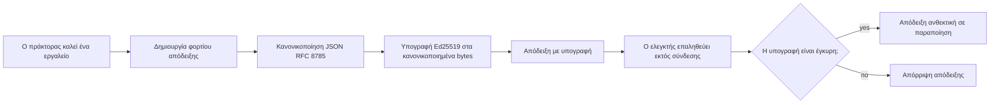
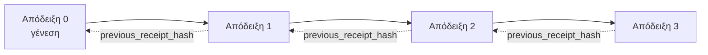

[Παρακολουθήστε το βίντεο μαθήματος: Ασφάλεια Πρακτόρων AI με Κρυπτογραφικές Αποδείξεις](https://youtu.be/PLACEHOLDER_VIDEO_ID)

> _(Το βίντεο μαθήματος και το μικρογραφικό θα προστεθούν από την ομάδα περιεχομένου της Microsoft μετά τη συγχώνευση, ταιριάζοντας στο μοτίβο μάθημα 14 / 15.)_

# Ασφάλεια Πρακτόρων AI με Κρυπτογραφικές Αποδείξεις

## Εισαγωγή

Αυτό το μάθημα θα καλύψει:

- Γιατί τα ίχνη ελέγχου για πράκτορες AI έχουν σημασία για τη συμμόρφωση, τον εντοπισμό σφαλμάτων και την εμπιστοσύνη.
- Τι είναι μια κρυπτογραφική απόδειξη και πώς διαφέρει από μια μη υπογεγραμμένη γραμμή καταγραφής.
- Πώς να παράγετε μια υπογεγραμμένη απόδειξη για την κλήση εργαλείου ενός πράκτορα σε απλό Python.
- Πώς να επαληθεύσετε μια απόδειξη εκτός σύνδεσης και να ανιχνεύσετε παραποίηση.
- Πώς να αλυσιδωθούν οι αποδείξεις ώστε η αφαίρεση ή η αναδιάταξη μιας να διακόπτει την αλυσίδα.
- Τι αποδεικνύουν οι αποδείξεις και τι ρητά δεν αποδεικνύουν.

## Στόχοι Μάθησης

Μετά την ολοκλήρωση αυτού του μαθήματος, θα γνωρίζετε πώς να:

- Αναγνωρίζετε τις τρόπους αποτυχίας που ωθούν την κρυπτογραφική προέλευση για τις ενέργειες των πρακτόρων.
- Παράγετε μια Ed25519 υπογεγραμμένη απόδειξη πάνω σε ένα κανονικό φορτίο JSON.
- Επαληθεύετε μια απόδειξη ανεξάρτητα χρησιμοποιώντας μόνο το δημόσιο κλειδί του υπογράφοντα.
- Ανιχνεύετε παραποίηση επανεκτελώντας την επαλήθευση σε τροποποιημένη απόδειξη.
- Δημιουργείτε μια αλυσίδα αλληλοσυνδεόμενων αποδείξεων και εξηγείτε γιατί η αλυσίδα έχει σημασία.
- Αναγνωρίζετε τα όρια μεταξύ αυτών που αποδεικνύουν οι αποδείξεις (απόδοση, ακεραιότητα, σειρά) και αυτών που δεν αποδεικνύουν (σωστότητα της ενέργειας, ορθότητα της πολιτικής).

## Το Πρόβλημα: Το Ίχνος Ελέγχου του Πράκτορά σας

Φανταστείτε ότι έχετε αναπτύξει έναν πράκτορα AI για την Contoso Travel. Ο πράκτορας διαβάζει αιτήματα πελατών, καλεί ένα API πτήσεων για να αναζητήσει επιλογές και κάνει κρατήσεις θέσεων εκ μέρους του πελάτη. Το προηγούμενο τρίμηνο, ο πράκτορας επεξεργάστηκε 50.000 κρατήσεις.

Σήμερα φτάνει ένας ελεγκτής. Κάνει μια απλή ερώτηση: "Δείξτε μου τι έκανε ο πράκτοράς σας."

Παραδίδετε τα αρχεία καταγραφής σας. Ο ελεγκτής τα κοιτάζει και θέτει την πιο δύσκολη ερώτηση: "Πώς ξέρω ότι αυτά τα αρχεία δεν έχουν τροποποιηθεί;"

Αυτό είναι το πρόβλημα του ίχνους ελέγχου. Οι περισσότερες υλοποιήσεις πρακτόρων σήμερα βασίζονται σε:

- **Καταγραφές εφαρμογής**: γραμμένες από τον ίδιο τον πράκτορα, επεξεργάσιμες από οποιονδήποτε έχει πρόσβαση στο σύστημα αρχείων.
- **Υπηρεσίες καταγραφής στο cloud**: ανιχνεύουν παραποίηση σε επίπεδο πλατφόρμας, μόνο αν ο ελεγκτής εμπιστεύεται τον πάροχο πλατφόρμας.
- **Καταγραφές συναλλαγών βάσης δεδομένων**: κατάλληλες για αλλαγές βάσης δεδομένων, αλλά όχι για αυθαίρετες κλήσεις εργαλείων.

Κανένα από αυτά δεν μπορεί να απαντήσει την ερώτηση του ελεγκτή χωρίς να απαιτεί από τον ελεγκτή να εμπιστευτεί κάποιον (εσάς, τον πάροχο cloud σας, τον προμηθευτή της βάσης δεδομένων σας). Για εσωτερική χρήση, αυτή η εμπιστοσύνη είναι συχνά αποδεκτή. Για εργασίες με κανονιστικές απαιτήσεις (χρηματοοικονομικά, υγεία, οτιδήποτε υπόκειται στον Κανονισμό για την Τεχνητή Νοημοσύνη της ΕΕ), δεν είναι.

Οι κρυπτογραφικές αποδείξεις λύνουν αυτό το πρόβλημα καθιστώντας κάθε ενέργεια του πράκτορα ανεξάρτητα επαληθεύσιμη. Ο ελεγκτής δεν χρειάζεται να σας εμπιστευτεί. Χρειάζεται μόνο το δημόσιο κλειδί σας και την ίδια την απόδειξη.

## Τι είναι μια Κρυπτογραφική Απόδειξη;

Μια απόδειξη είναι ένα αντικείμενο JSON που καταγράφει τι έκανε ένας πράκτορας, υπογεγραμμένο με ψηφιακή υπογραφή.


```mermaid
flowchart LR
    A[Ο πράκτορας καλεί ένα εργαλείο] --> B[Δημιουργία φορτίου απόδειξης]
    B --> C[Κανoνικοποίηση JSON RFC 8785]
    C --> E[Υπογραφή Ed25519 στα κανονικοποιημένα bytes]
    E --> F[Απόδειξη με υπογραφή]
    F --> G[Ο ελεγκτής επαληθεύει εκτός σύνδεσης]
    G --> H{Η υπογραφή είναι έγκυρη;}
    H -- yes --> I[Απόδειξη ανθεκτική σε παραποίηση]
    H -- no --> J[Απόρριψη απόδειξης]
```

Μια ελάχιστη απόδειξη μοιάζει ως εξής:

```json
{
  "type": "agent.tool_call.v1",
  "agent_id": "contoso-travel-bot",
  "tool_name": "lookup_flights",
  "tool_args_hash": "sha256:a3f9c1...",
  "result_hash": "sha256:7b2e1d...",
  "policy_id": "contoso-travel-policy-v3",
  "timestamp": "2026-04-25T14:30:00Z",
  "sequence": 47,
  "previous_receipt_hash": "sha256:9d4e6a...",
  "signature": {
    "alg": "EdDSA",
    "sig": "c5af83...",
    "public_key": "8f3b2c..."
  }
}
```

Τρεις ιδιότητες κάνουν τη δουλειά:

1. **Η υπογραφή**. Η απόδειξη υπογράφεται από την πύλη του πράκτορα χρησιμοποιώντας ένα ιδιωτικό κλειδί Ed25519. Οποιοσδήποτε έχει το αντίστοιχο δημόσιο κλειδί μπορεί να επαληθεύσει την υπογραφή εκτός σύνδεσης. Η παραποίηση οποιουδήποτε πεδίου καθιστά την υπογραφή μη έγκυρη.

2. **Κανoνική κωδικοποίηση**. Πριν την υπογραφή, η απόδειξη σειριοποιείται χρησιμοποιώντας το Σχήμα Κανoνικοποίησης JSON (JCS, RFC 8785). Αυτό διασφαλίζει ότι δύο υλοποιήσεις που παράγουν την ίδια λογική απόδειξη παράγουν ακριβώς τα ίδια bytes. Χωρίς κανoνικοποίηση, διαφορετικοί σειριοποιητές JSON θα παράγουν διαφορετικές υπογραφές για το ίδιο περιεχόμενο.

3. **Αλυσιδωτή κατακερματισμός (hash chaining)**. Το πεδίο `previous_receipt_hash` συνδέει κάθε απόδειξη με την προηγούμενη. Η αφαίρεση ή η αναδιάταξη μιας απόδειξης διακόπτει κάθε επόμενη απόδειξη. Η παραποίηση γίνεται ορατή σε επίπεδο αλυσίδας ακόμη και αν παρακαμφθούν μεμονωμένες υπογραφές.

Μαζί αυτές οι ιδιότητες παρέχουν τρεις εγγυήσεις:

- **Απόδοση**: αυτό το κλειδί υπέγραψε αυτό το περιεχόμενο.
- **Ακεραιότητα**: το περιεχόμενο δεν έχει αλλάξει από την υπογραφή.
- **Σειρά**: αυτή η απόδειξη ήρθε μετά από την προηγούμενη στην αλυσίδα.

## Παραγωγή Απόδειξης σε Python

Δεν χρειάζεστε ειδική βιβλιοθήκη για να παράγετε μια απόδειξη. Τα κρυπτογραφικά στοιχεία είναι ευρέως διαθέσιμα και η λογική είναι λίγες δεκάδες γραμμές Python.

Οι πρακτικές ασκήσεις στο `code_samples/18-signed-receipts.ipynb` οδηγούν στη διαδικασία πλήρους ροής. Η συνοπτική εκδοχή:

```python
import json
import hashlib
import base64
from nacl import signing
from jcs import canonicalize  # RFC 8785 κανονικό JSON

def b64url_nopad(data: bytes) -> str:
    return base64.urlsafe_b64encode(data).decode("ascii").rstrip("=")

def sha256_canonical(obj) -> str:
    """SHA-256 of a Python object's JCS-canonical JSON form."""
    return f"sha256:{hashlib.sha256(canonicalize(obj)).hexdigest()}"

# Δημιουργήστε ή φορτώστε ένα κλειδί υπογραφής (στην παραγωγή, αποθηκεύστε το σε θησαυροφυλάκιο κλειδιών)
signing_key = signing.SigningKey.generate()
verify_key = signing_key.verify_key

# Δημιουργήστε το περιεχόμενο της απόδειξης (χωρίς υπογραφή ακόμα)
tool_args = {"origin": "SYD", "destination": "LAX"}
tool_result = [{"flight": "QF11", "price": 1850, "stops": 0}]

payload = {
    "type": "agent.tool_call.v1",
    "agent_id": "contoso-travel-bot",
    "tool_name": "lookup_flights",
    "tool_args_hash": sha256_canonical(tool_args),
    "result_hash": sha256_canonical(tool_result),
    "policy_id": "contoso-travel-policy-v3",
    "timestamp": "2026-04-25T14:30:00Z",
    "sequence": 0,
    "previous_receipt_hash": None,
}

# Κανονικοποιήστε και υπογράψτε απευθείας τα byte JCS. Το PureEdDSA δημιουργεί κατακερματισμούς εσωτερικά.
canonical_bytes = canonicalize(payload)
signature_bytes = signing_key.sign(canonical_bytes).signature

# Προσθέστε ένα δομημένο αντικείμενο υπογραφής.
receipt = {
    **payload,
    "signature": {
        "alg": "EdDSA",
        "sig": b64url_nopad(signature_bytes),
        "public_key": b64url_nopad(bytes(verify_key)),
    },
}
```

Αυτή είναι ολόκληρη η αλυσίδα υπογραφής. Οι ασκήσεις στο σημειωματάριο εξηγούν κάθε βήμα.

## Επαλήθευση Απόδειξης και Ανίχνευση Παραποίησης

Η επαλήθευση είναι η αντίστροφη διαδικασία:

```python
import base64
import hashlib
from nacl import signing
from nacl.exceptions import BadSignatureError
from jcs import canonicalize

def b64url_decode(s: str) -> bytes:
    padding = "=" * ((4 - len(s) % 4) % 4)
    return base64.urlsafe_b64decode(s + padding)

def verify_receipt(receipt: dict) -> bool:
    # Η υπογραφή είναι ένα δομημένο αντικείμενο: {"alg", "sig", "public_key"}.
    sig_obj = receipt.get("signature")
    if not sig_obj or sig_obj.get("alg") != "EdDSA":
        return False

    # Ανασυνθέστε το φόρτωμα που υπογράφηκε πραγματικά (όλα εκτός από την υπογραφή).
    payload = {k: v for k, v in receipt.items() if k != "signature"}

    canonical_bytes = canonicalize(payload)

    try:
        verify_key = signing.VerifyKey(b64url_decode(sig_obj["public_key"]))
        verify_key.verify(canonical_bytes, b64url_decode(sig_obj["sig"]))
        return True
    except BadSignatureError:
        return False
```

Αυτή η συνάρτηση δέχεται μια απόδειξη και επιστρέφει `True` αν η υπογραφή είναι έγκυρη, `False` αλλιώς. Χωρίς κλήση δικτύου, χωρίς εξάρτηση υπηρεσίας, χωρίς εμπιστοσύνη σε τρίτο μέρος.

Για να δείτε την ανίχνευση παραποίησης σε δράση, το σημειωματάριο εξετάζει:

1. Παραγωγή μιας έγκυρης απόδειξης και επιβεβαίωση ότι επαληθεύεται.
2. Τροποποίηση ενός byte στο πεδίο `tool_args_hash`.
3. Επανεκτέλεση της επαλήθευσης και παρακολούθηση αποτυχίας.

Αυτή είναι η πρακτική απόδειξη ότι οι αποδείξεις είναι ανιχνεύσιμες παραποίηση: κάθε τροποποίηση, όσο μικρή κι αν είναι, σπάει την υπογραφή.

## Αλυσιδωτές Αποδείξεις για Πράκτορες με Πολλαπλά Βήματα

Μια μεμονωμένη υπογεγραμμένη απόδειξη προστατεύει μία ενέργεια. Μια αλυσίδα αποδείξεων προστατεύει μια ακολουθία.


```mermaid
flowchart LR
    R0[Απόδειξη 0<br/>γένεση] --> R1[Απόδειξη 1]
    R1 --> R2[Απόδειξη 2]
    R2 --> R3[Απόδειξη 3]
    R1 -. previous_receipt_hash .-> R0
    R2 -. previous_receipt_hash .-> R1
    R3 -. previous_receipt_hash .-> R2
```

Κάθε απόδειξη καταγράφει το hash της προηγούμενης απόδειξης. Για να αφαιρεθεί αθόρυβα η απόδειξη 2, ένας επιτιθέμενος θα πρέπει είτε να:

- Τροποποιήσει το πεδίο `previous_receipt_hash` της απόδειξης 3 (σπάει η υπογραφή της απόδειξης 3), Ή
- Πλαστογραφήσει μια νέα υπογραφή σε τροποποιημένη απόδειξη 3 (απαιτεί το ιδιωτικό κλειδί του πράκτορα).

Αν το ιδιωτικό κλειδί βρίσκεται σε θόλο αποθήκευσης κλειδιών υλικού και δημοσιεύετε το δημόσιο κλειδί με κάθε απόδειξη, καμία από τις επιθέσεις δεν είναι εφικτή χωρίς ανίχνευση.

Το σημειωματάριο εξηγεί:

1. Δημιουργία αλυσίδας τριών αποδείξεων.
2. Επαλήθευση ότι το `previous_receipt_hash` κάθε απόδειξης ταιριάζει με το πραγματικό hash της προηγούμενης απόδειξης.
3. Παραποίηση σε μία απόδειξη στη μέση και παρακολούθηση διακοπής της αλυσίδας ακριβώς εκεί.

Έτσι παράγετε ένα ίχνος ελέγχου που μπορεί να επαληθεύσει εξωτερικός ελεγκτής χωρίς να σας εμπιστεύεται.

## Τι Αποδεικνύουν οι Αποδείξεις (και Τι Δεν Αποδεικνύουν)

Αυτή είναι η πιο σημαντική ενότητα αυτού του μαθήματος. Οι αποδείξεις είναι ισχυρές αλλά η ισχύς τους είναι περιορισμένη.

**Οι αποδείξεις αποδεικνύουν τρία πράγματα:**

1. **Απόδοση**: ένα συγκεκριμένο κλειδί υπέγραψε ένα συγκεκριμένο φορτίο.
2. **Ακεραιότητα**: το φορτίο δεν έχει αλλάξει από την υπογραφή.
3. **Σειρά**: αυτή η απόδειξη ήρθε μετά από εκείνη στην αλυσίδα κατακερματισμού.

**Οι αποδείξεις ΔΕΝ αποδεικνύουν:**

1. **Σωστότητα**: ότι η ενέργεια του πράκτορα ήταν η σωστή. Μια απόδειξη μπορεί να υπογραφεί για λάθος απάντηση εξίσου καθαρά όσο και για σωστή.
2. **Συμμόρφωση πολιτικής**: ότι η πολιτική που αναφέρεται στο `policy_id` αξιολογήθηκε πραγματικά, ή ότι θα επέτρεπε αυτή την ενέργεια αν ελεγχόταν. Η απόδειξη καταγράφει τι δηλώθηκε, όχι τι εφαρμόστηκε.
3. **Ταυτότητα πέρα από το κλειδί**: η απόδειξη λέει "αυτό το κλειδί υπέγραψε αυτό το περιεχόμενο." Δεν λέει "αυτός ο άνθρωπος ενέκρινε αυτό." Η σύνδεση κλειδιού με πρόσωπο ή οργανισμό απαιτεί ξεχωριστή υποδομή ταυτότητας (κατάλογο, μητρώο δημόσιων κλειδιών κλπ).
4. **Αλήθεια των εισόδων**: αν ο πράκτορας λάβει χειραγωγημένο prompt και ενεργήσει σύμφωνα με αυτό, η απόδειξη καταγράφει πιστά την ενέργεια. Οι αποδείξεις είναι μετά τον έλεγχο εισόδων, όχι υποκατάστατό του.

Αυτό το όριο έχει σημασία για δύο λόγους:

- Σας λέει για τι είναι χρήσιμες οι αποδείξεις: για να καθιστούν τη συμπεριφορά του πράκτορα επιθεωρήσιμη και ανιχνεύσιμη παραποίηση, ακόμη και μεταξύ οργανωτικών ορίων.
- Σας λέει ποιες επιπλέον στρώσεις χρειάζεστε ακόμα: έλεγχο εισόδων (Μάθημα 6), επιβολή πολιτικής (που καλύπτεται σύντομα πιο κάτω) και υποδομή ταυτότητας (εκτός πεδίου αυτού του μαθήματος).

Το κοινό λάθος είναι να υποθέσετε ότι "έχουμε αποδείξεις" σημαίνει "διακυβερνούμαστε." Δεν ισχύει. Οι αποδείξεις είναι θεμέλιο. Η διακυβέρνηση είναι το σύστημα που χτίζετε από πάνω.

## Απόδειξη Ανθρώπινης Έγκρισης της Ακριβούς Ενέργειας

Το σημείο 3 παραπάνω αξίζει δική του ενότητα: μια απόδειξη ενέργειας λέει "αυτό το κλειδί υπέγραψε αυτό το περιεχόμενο," ποτέ "ένας άνθρωπος ενέκρινε αυτό." Για ενέργειες υψηλού κινδύνου (επιστροφές, διαγραφές, μεταφορές χρημάτων), τα πλαίσια διακυβέρνησης απαιτούν ολοένα και περισσότερο αυτή την ελλείπουσα δήλωση, και είναι παραγόμενη με τα ίδια στοιχεία που ήδη κατασκευάσατε σε αυτό το μάθημα.

Το επόμενο σημειωματάριο `code_samples/human-authorization-receipts.ipynb` προσθέτει δεύτερο τύπο απόδειξης, `human.approval.v1`, στην ίδια μορφή φακέλου όπως οι αποδείξεις του μαθήματος (ένα τυποποιημένο φορτίο υπογεγραμμένο με Ed25519 πάνω στα κανονικά bytes JCS, με το αντικείμενο `signature` έξω από τα υπογεγραμμένα bytes). Ένας ονομασμένος εγκριτής υπογράφει την **πλήρη κανονική ενέργεια και τη σύνοψή της** πριν από την εκτέλεση· η απόδειξη ενέργειας του πράκτορα φέρει την **ίδια σύνοψη ενέργειας** και ένα `parent_approval_ref`, το `receipt_hash` της έγκρισης, με την ίδια σύμβαση όπως το `previous_receipt_hash` στην αλυσίδα που φτιάξατε παραπάνω. Μια `verify_chain` ελέγχει και τα δύο αντικείμενα κάτω από **ξεχωριστά μητρώα στερεωμένων κλειδιών** (κλειδιά εγκριτών έναντι κλειδιών πρακτόρων), έτσι ο κώδικας είναι κοινός, αλλά οι αρχές δεν επικαλύπτονται ποτέ.

Το χαρακτηριστικό που κερδίζει αυτό, ορισμένο προσεκτικά: *ο άνθρωπος ενέκρινε αυτή ακριβώς την ενέργεια, και ο πράκτορας εκτέλεσε ακριβώς αυτήν την εγκεκριμένη ενέργεια.* Τα σενάρια άρνησης του σημειωματαρίου είναι αυτά που κάνουν αυτή την ιδιότητα πραγματική και όχι απλώς δηλωμένη:

- το κλασικό σύνολο: παραποίηση, μπερδεμένος υπεύθυνος, επανεκτέλεση, πλαστές υπογραφές και στις δύο πλευρές, κακοσχηματισμένη είσοδος·
- **λεπτή εξουσία**: υπογραφή που επαληθεύεται, αλλά απορρίπτεται επειδή η έκδοση της πολιτικής άλλαξε, το κλειδί εγκριτή αφαιρέθηκε από το μητρώο ή η έγκριση έληξε πριν την εκτέλεση·
- **αντικατάσταση σύνοψης**: μια έγκυρη υπογεγραμμένη απόδειξη ενέργειας που δείχνει σε *πραγματική* έγκριση που δεσμεύει μια *διαφορετική* κανονική ενέργεια.

Κάθε αποτυχία αρνείται για διαφορετικό λόγο, έτσι ένας ελεγκτής διαβάζοντας μια άρνηση μπορεί να καταλάβει αν η εξουσία έγινε παλαιά ή αν η εκτελεσθείσα ενέργεια άλλαξε. Ο κανόνας που διδάσκει το σημειωματάριο: μια υπογεγραμμένη έγκριση δεν είναι η εξουσία από μόνη της. Η εξουσία υπάρχει μόνο αν και οι δύο αποδείξεις δεσμεύονται στην ίδια κανονική ενέργεια κατά την εκτέλεση. Η απόδειξη ανθρώπινης έγκρισης είναι μια εκπαιδευτική σύνθεση ορισμένη από αυτό το μάθημα, όχι τύπος απόδειξης ορισμένος από το `draft-farley-acta-signed-receipts`.

## Αναφορές Παραγωγής

Ο κώδικας Python σε αυτό το μάθημα είναι σκόπιμα ελάχιστος ώστε να μπορείτε να διαβάσετε κάθε γραμμή και να καταλάβετε ακριβώς τι συμβαίνει. Σε παραγωγή, έχετε δύο επιλογές:

1. **Να χτίσετε απευθείας πάνω στα κρυπτογραφικά στοιχεία.** Οι 50 γραμμές που είδατε παραπάνω είναι αρκετές για πολλές χρήσεις. Οι βιβλιοθήκες PyNaCl (Ed25519) και το πακέτο `jcs` (κανoνικό JSON) είναι καλά διατηρημένες και ελεγμένες.

2. **Να χρησιμοποιήσετε μια βιβλιοθήκη αποδείξεων παραγωγής.** Πολλά έργα ανοιχτού κώδικα υλοποιούν το ίδιο μοτίβο με επιπλέον χαρακτηριστικά (περιστροφή κλειδιών, ομαδική επαλήθευση, διανομή συνόλου JWK, ενσωμάτωση με μηχανές πολιτικής):
   - Η αλυσίδα υπογραφής χρησιμοποιεί τις σύμβασεις JCS και υπογραφής-εύρους σε ανεξάρτητο Internet-Draft του IETF ([`draft-farley-acta-signed-receipts`](https://datatracker.ietf.org/doc/draft-farley-acta-signed-receipts/), αναθεώρηση 02). Η επίπεδη εκπαιδευτική απόδειξη αυτού του μαθήματος διαφέρει από το φάκελο `{payload, signature}` στο draft και δεν παρουσιάζεται ως συμμορφούμενη υλοποίηση. Το draft δημοσιεύει κοινό σύνολο ελέγχου συμμόρφωσης ([agent-governance-testvectors](https://github.com/ScopeBlind/agent-governance-testvectors)) για υλοποιήσεις που στοχεύουν τη μορφή καλωδίου του.
   - Το Microsoft Agent Governance Toolkit συνθέτει αποδείξεις με αποφάσεις πολιτικής με βάση το Cedar· δείτε το Tutorial 33 σε αυτό το αποθετήριο για παράδειγμα από άκρο σε άκρο.
   - Τα πακέτα `protect-mcp` (npm) και `@veritasacta/verify` (npm) παρέχουν υλοποίηση υπογραφής αποδείξεων και επαλήθευσης εκτός σύνδεσης σε Node, για περιτύλιξη κάθε MCP διακομιστή με ίχνος ελέγχου που ανιχνεύει παραποίηση, συμπεριλαμβανομένης ροής κράτησης για συνυπογραφή όπου μια παύση δράσης εκπέμπει απόδειξη έγκρισης δεμένη με τη σύνοψη της δράσης (υποστηριζόμενη από WebAuthn στη ροή επιφάνειας εργασίας), το ίδιο πρότυπο απόδειξης έγκρισης-ανθρώπινης εξουσιοδότησης με στο προηγούμενο σημειωματάριο.
   - Το **[nobulex](https://github.com/arian-gogani/nobulex)** Python SDK (`pip install nobulex`) παρέχει το ίδιο μοτίβο υπογραφής Ed25519 + JCS σε Python με ενσωματώσεις LangChain και CrewAI, συμπεριλαμβανομένων δημοσιευμένων διανύσματος ελέγχου διασταύρωσης και χαρτογράφησης συμμόρφωσης που συνεισφέρει μέσω [OWASP PR #2210](https://github.com/OWASP/CheatSheetSeries/pull/2210).

Η απόφαση μεταξύ της κατασκευής της δικής σας λύσης και της χρήσης μιας βιβλιοθήκης αντανακλά την απόφαση μεταξύ της συγγραφής δικής σας βιβλιοθήκης JWT και της χρήσης μιας επαληθευμένης: και οι δύο είναι λογικές· η βιβλιοθήκη εξοικονομεί χρόνο και μειώνει την επιφάνεια ελέγχου· η προσέγγιση από το μηδέν σας αναγκάζει να καταλάβετε κάθε στοιχείο. Αυτό το μάθημα διδάσκει την προσέγγιση από το μηδέν ώστε να έχετε τη βάση για οποιαδήποτε επιλογή.

## Έλεγχος Γνώσεων

Δοκιμάστε την κατανόησή σας πριν προχωρήσετε στις πρακτικές ασκήσεις.

**1. Μια απόδειξη υπογράφεται με το ιδιωτικό κλειδί Ed25519 του πράκτορα. Ο ελεγκτής έχει μόνο το δημόσιο κλειδί. Μπορεί ο ελεγκτής να επαληθεύσει την απόδειξη εκτός σύνδεσης;**

<details>
<summary>Απάντηση</summary>

Ναι. Η επαλήθευση Ed25519 απαιτεί μόνο το δημόσιο κλειδί και τα υπογεγραμμένα bytes. Χωρίς κλήση δικτύου, χωρίς εξάρτηση από υπηρεσία. Αυτή είναι η ιδιότητα που καθιστά τις αποδείξεις χρήσιμες σε περιβάλλοντα ελέγχου με απομόνωση, πολλαπλές οργανώσεις ή χαμηλή εμπιστοσύνη.
</details>

**2. Ένας επιτιθέμενος τροποποιεί το πεδίο `policy_id` μιας απόδειξης για να ισχυριστεί ότι υπαγόταν σε πιο επιεική πολιτική. Η υπογραφή έγινε πάνω στο αρχικό φορτίο. Τι συμβαίνει κατά την επαλήθευση;**

<details>
<summary>Απάντηση</summary>


Η επαλήθευση αποτυγχάνει. Η υπογραφή υπολογίστηκε πάνω στα κανονικά bytes του αρχικού φορτίου· η τροποποίηση οποιουδήποτε πεδίου αλλάζει αυτά τα bytes, καθιστώντας την υπογραφή άκυρη. Ο εισβολέας θα χρειαζόταν το ιδιωτικό κλειδί για να παράγει μια νέα έγκυρη υπογραφή, το οποίο όμως δεν έχει.
</details>

**3. Γιατί το απόδειξη περιλαμβάνει `tool_args_hash` και `result_hash` αντί των ακατέργαστων ορισμάτων και αποτελέσματος;**

<details>
<summary>Απάντηση</summary>

Δύο λόγοι. Πρώτον, το απόδειγμα μπορεί να χρειαστεί να αρχειοθετηθεί ή να μεταδοθεί σε περιβάλλοντα όπου η διαρροή του ακατέργαστου περιεχομένου (Προσωπικά Δεδομένα, επιχειρηματικά δεδομένα) αποτελεί πρόβλημα. Η κατακερματισμός διατηρεί το απόδειγμα μικρό και το περιεχόμενο ιδιωτικό· ο ελεγκτής επαληθεύει ότι ο κατακερματισμός ταιριάζει με ένα χωριστά αποθηκευμένο αντίγραφο του πραγματικού περιεχομένου. Δεύτερον, οι κατακερματισμοί έχουν σταθερό μέγεθος· ένα απόδειγμα με κατακερματισμούς έχει περιορισμένο μέγεθος ανεξάρτητα από το πόσο μεγάλα ήταν τα εισερχόμενα και εξερχόμενα δεδομένα.
</details>

**4. Το πεδίο `previous_receipt_hash` συνδέει κάθε απόδειξη με την προγενέστερή της. Αν ένας επιτιθέμενος διαγράψει σιωπηρά μία απόδειξη από τη μέση μιας αλυσίδας, τι γίνεται άκυρο;**

<details>
<summary>Απάντηση</summary>

Κάθε απόδειξη που ήρθε μετά από αυτήν που διαγράφηκε. Τα πεδία `previous_receipt_hash` τους δεν ταιριάζουν πλέον με την πραγματική αλυσίδα (επειδή η απόδειξη στην οποία αναφέρονταν δεν υπάρχει πλέον ή η αλυσίδα τώρα δείχνει σε διαφορετικό προγενέστερο). Για να κρύψει τη διαγραφή, ο επιτιθέμενος θα έπρεπε να ξανα-υπογράψει κάθε επόμενη απόδειξη, κάτι που απαιτεί το ιδιωτικό κλειδί.
</details>

**5. Μια απόδειξη επαληθεύεται καθαρά. Αποδεικνύει αυτό ότι η ενέργεια του πράκτορα ήταν σωστή, ορθή ή σύμφωνα με την πολιτική;**

<details>
<summary>Απάντηση</summary>

Όχι. Μια έγκυρη απόδειξη αποδεικνύει τρία πράγματα: απόδοση (αυτό το κλειδί υπέγραψε αυτό το περιεχόμενο), ακεραιότητα (το περιεχόμενο δεν έχει αλλάξει), και σειρά (αυτή η απόδειξη ήρθε μετά από αυτήν). ΔΕΝ αποδεικνύει ότι η ενέργεια ήταν σωστή, ότι η πολιτική που αναφέρεται στο `policy_id` αξιολογήθηκε πράγματι, ή ότι ο πράκτορας ακολούθησε κάθε κανόνα. Οι αποδείξεις κάνουν τη συμπεριφορά του πράκτορα ελέγξιμη, όχι απαραίτητα σωστή. Αυτό είναι το πιο σημαντικό όριο στο μάθημα.
</details>

## Άσκηση Πρακτικής

Ανοίξτε το `code_samples/18-signed-receipts.ipynb` και ολοκληρώστε και τις τέσσερις ενότητες:

1. **Ενότητα 1**: Υπογράψτε την πρώτη σας απόδειξη και επαληθεύστε την.
2. **Ενότητα 2**: Παραποιήστε την απόδειξη και παρατηρήστε αποτυχία επαλήθευσης.
3. **Ενότητα 3**: Δημιουργήστε μια αλυσίδα τριών αποδείξεων και επαληθεύστε την ακεραιότητα της αλυσίδας.
4. **Ενότητα 4**: Εφαρμόστε το μοτίβο σε έναν πράκτορα που κατασκευάζεται με το Microsoft Agent Framework: περιβάλτε μια κλήση εργαλείου με υπογραφή απόδειξης, και στη συνέχεια επαληθεύστε την απόδειξη ανεξάρτητα.

**Πρόκληση επέκτασης 1:** επεκτείνετε το σχήμα απόδειξης με ένα επιπλέον πεδίο της επιλογής σας (για παράδειγμα, ένα αίτημα ID για παρακολούθηση), ενημερώστε τη λογική κανονικής υπογραφής ώστε να το συμπεριλάβει, και επιβεβαιώστε ότι η απόδειξη περνάει κανονικά την επαλήθευση. Στη συνέχεια τροποποιήστε το πεδίο μετά την υπογραφή και επιβεβαιώστε ότι η επαλήθευση αποτυγχάνει. Αυτό σας αναγκάζει να κατανοήσετε πώς κάθε byte της κανονικής κωδικοποίησης συμβάλλει στην υπογραφή.

**Πρόκληση επέκτασης 2:** κατακερματίστε SHA-256 δύο από τις αποδείξεις σας μαζί (συγκολλώντας τα κανονικά bytes με μια καθορισμένη σειρά) και ενσωματώστε το προκύπτον άθροισμα ως νέο πεδίο σε μια τρίτη απόδειξη πριν την υπογράψετε. Επαληθεύστε ότι και οι τρεις αποδείξεις περνούν την επαλήθευση. Μόλις δημιουργήσατε μια απόδειξη ενσωμάτωσης ενός βήματος: όποιος έχει την τρίτη απόδειξη μπορεί να αποδείξει ότι οι δύο πρώτες υπήρχαν τη στιγμή της υπογραφής, χωρίς να χρειάζεται να αποκαλύψει το περιεχόμενό τους. Αυτό είναι το μοτίβο που χρησιμοποιούν οι αποδείξεις εκλεκτικής αποκάλυψης σε μεγάλη κλίμακα (Merkle commitments, RFC 6962).

## Συμπέρασμα

Οι κρυπτογραφικές αποδείξεις δίνουν στους πράκτορες AI ένα ιστορικό ελέγχου που είναι:

- **Ανεξάρτητα επαληθεύσιμο**: οποιοσδήποτε με το δημόσιο κλειδί μπορεί να επαληθεύσει, χωρίς εξάρτηση από υπηρεσία.
- **Αποδεικνύει παραποίηση**: οποιαδήποτε τροποποίηση καθιστά την υπογραφή άκυρη.
- **Φορητό**: μια απόδειξη είναι ένα μικρό αρχείο JSON· μπορεί να αρχειοθετηθεί, μεταδοθεί και επαληθευτεί οπουδήποτε.
- **Σύμφωνο με πρότυπα**: βασίζεται σε Ed25519 (RFC 8032), JCS (RFC 8785), και SHA-256, όλα ευρέως διαδεδομένα πρωτόκολλα.

Δεν αποτελούν υποκατάστατο για επικύρωση εισόδου, επιβολή πολιτικής ή υποδομή ταυτότητας. Αποτελούν τη βάση για αυτά τα στρώματα. Όταν αναπτύσσετε πράκτορες σε ελεγχόμενα περιβάλλοντα, ροές εργασίας πολλαπλών οργανισμών ή οπουδήποτε δεν μπορεί να υποτεθεί εμπιστοσύνη από μελλοντικό ελεγκτή, οι αποδείξεις κάνουν το ιστορικό ελέγχου τίμιο.

Το πιο σημαντικό συμπέρασμα: οι αποδείξεις αποδεικνύουν ποιος είπε τι και πότε. Δεν αποδεικνύουν ότι όσα ειπώθηκαν ήταν αληθή ή σωστά. Κρατήστε αυτή τη διάκριση στενά. Είναι η διαφορά ανάμεσα σε ένα τίμιο σύστημα προέλευσης και ένα παραπλανητικό.

## Λίστα Ελέγχου για Παραγωγή

Όταν είστε έτοιμοι να προχωρήσετε από αυτό το μάθημα στην ανάπτυξη πρακτόρων με υπογραφή αποδείξεων σε πραγματικό περιβάλλον:

- [ ] **Μετακινήστε το κλειδί υπογραφής μακριά από το φορητό υπολογιστή του προγραμματιστή.** Χρησιμοποιήστε Azure Key Vault, AWS KMS ή μια μονάδα ασφάλειας υλικού. Το ιδιωτικό κλειδί που υπογράφει τις αποδείξεις σας δεν πρέπει ποτέ να ζει σε έλεγχο πηγαίου κώδικα ή σε απλό κείμενο σε μηχανές εφαρμογής.
- [ ] **Δημοσιεύστε το δημόσιο κλειδί επαλήθευσης.** Οι ελεγκτές το χρειάζονται για επαλήθευση εκτός σύνδεσης. Το πρότυπο μοτίβο είναι ένα JWK Set σε μια γνωστή διεύθυνση URL (RFC 7517), π.χ., `https://your-org.example.com/.well-known/agent-keys.json`.
- [ ] **Αγκυρώστε την αλυσίδα εξωτερικά.** Περιοδικά γράφετε το τελευταίο hash κεφαλής αλυσίδας σε ένα διαφανές αρχείο καταγραφής (Sigstore Rekor, RFC 3161 αρχή χρονοσήμανσης ή ένα δεύτερο εσωτερικό σύστημα) ώστε ένα εξωτερικό μέρος να επιβεβαιώνει ότι "αυτή η αλυσίδα υπήρχε αυτή τη στιγμή".
- [ ] **Αποθηκεύστε τις αποδείξεις αμετάβλητα.** Μόνο προσθήκη blob storage (Azure Storage με πολιτικές αμεταβλητότητας, AWS S3 Object Lock) αποτρέπει εσωτερική παραποίηση ιστορικού στο επίπεδο αποθήκευσης.
- [ ] **Αποφασίστε για την διατήρηση.** Πολλά καθεστώτα συμμόρφωσης απαιτούν πολυετή διατήρηση. Σχεδιάστε για αύξηση των αποδείξεων (κάθε απόδειξη είναι ~500 bytes· ένας πράκτορας που κάνει 10K κλήσεις την ημέρα παράγει ~1.8 GB ετησίως).
- [ ] **Καταγράψτε τι δεν καλύπτουν οι αποδείξεις.** Οι αποδείξεις αποδεικνύουν απόδοση, ακεραιότητα και σειρά. Το εγχειρίδιο λειτουργίας σας πρέπει ρητά να αναφέρει ποιοι επιπλέον έλεγχοι (επικύρωση εισόδου, επιβολή πολιτικής, περιορισμός ρυθμού, υποδομή ταυτότητας) συνοδεύουν τις αποδείξεις στη στάση διακυβέρνησής σας.

### Έχετε περισσότερες ερωτήσεις για την ασφάλεια των πρακτόρων AI;

Εγγραφείτε στο [Microsoft Foundry Discord](https://aka.ms/ai-agents/discord) για να συναντήσετε άλλους εκπαιδευόμενους, να παρακολουθήσετε ώρες γραφείου και να λάβετε απαντήσεις στις ερωτήσεις σας για τους Πράκτορες AI.

## Πέρα από αυτό το μάθημα

Αυτό το μάθημα καλύπτει μεμονωμένη υπογραφή απόδειξης και αλληλουχίες αλυσίδας κατακερματισμού. Τα ίδια πρωτόκολλα συνθέτουν αρκετά πιο προχωρημένα μοτίβα που μπορεί να συναντήσετε καθώς ωριμάζει η στάση διακυβέρνησής σας:

- **Εκλεκτική αποκάλυψη.** Όταν τα πεδία μιας απόδειξης δεσμεύονται ανεξάρτητα (με Merkle tree τύπου RFC 6962), μπορείτε να αποκαλύψετε συγκεκριμένα πεδία σε συγκεκριμένους ελεγκτές και να αποδείξετε ότι τα υπόλοιπα δεν άλλαξαν χωρίς να τα εκθέσετε. Χρήσιμο όταν η ίδια απόδειξη πρέπει να ικανοποιήσει τόσο έναν πλήρη έλεγχο (που θέλει πληρότητα) όσο και κανονισμούς ελαχιστοποίησης δεδομένων όπως ο GDPR (που θέλουν ο ελεγκτής να βλέπει όσο το δυνατόν λιγότερα).
- **Ακύρωση αποδείξεων.** Αν ένα κλειδί υπογραφής συμβιβαστεί, χρειάζεστε τρόπο να χαρακτηρίσετε όλες τις αποδείξεις που υπέγραψε ως μη αξιόπιστες από ένα σημείο και μετά. Πρότυπα μοτίβα: βραχυχρόνια κλειδιά υπογραφής με δημοσιευμένη λίστα ανάκλησης ή διαφανές αρχείο καταγραφής με εγγραφές ανάκλησης.
- **Απόδειξη με αμφίπλευρη / διαιρεμένη υπογραφή.** Κάποιες υλοποιήσεις χωρίζουν το υπογεγραμμένο φορτίο σε μισά προ-εκτέλεσης (`authorization_*`) και μετά-εκτέλεσης (`result_*`) με ανεξάρτητες υπογραφές, χρήσιμες όταν η απόφαση εξουσιοδότησης και το παρατηρούμενο αποτέλεσμα παράγονται από διαφορετικούς παράγοντες ή σε διαφορετικές στιγμές. Αυτό συντίθεται επαυξητικά πάνω στη μορφή απόδειξης που διδάσκεται σε αυτό το μάθημα.
- **Σύνθεση φορτίου.** Μια απόδειξη σφραγίζει όποια bytes βάλετε στο `result_hash`. Πραγματικά φορτία είναι συχνά πλουσιότερα από ένα απλό αποτέλεσμα κλήσης εργαλείου: προ-απόφασης συλλογισμός (πρόβλεψη μοντέλου, εξεταζόμενες επιλογές, αποδείξεις και η πληρότητά τους, στάση κινδύνου, αλυσίδα λογοδοσίας, αποτέλεσμα πύλης) μπορεί όλα να ζουν μέσα στο φορτίο, σφραγισμένα από μια μόνο απόδειξη. Αυτό κρατά τη μορφή απόδειξης ελάχιστη επιτρέποντας ενωσιακά εξελίξεις σε σχήματα φορτίου ανά τομέα.
- **Συμβατότητα μεταξύ υλοποιήσεων.** Πολλές ανεξάρτητες υλοποιήσεις της ίδιας μορφής απόδειξης (Python, TypeScript, Rust, Go) επαληθεύουν διασταυρωτά έναντι κοινών δοκιμαστικών διανυσμάτων. Αν κατασκευάσετε δική σας υλοποίηση, η επικύρωση έναντι δημοσιευμένων διανυσμάτων επιβεβαιώνει συμβατότητα ασύρματης επικοινωνίας.
- **Μετάβαση μετά-κβαντικής κρυπτογραφίας.** Το Ed25519 σήμερα είναι ευρέως χρησιμοποιούμενο αλλά δεν είναι ανθεκτικό σε κβαντικούς υπολογιστές. Η μορφή της απόδειξης είναι αλγοριθμικά ευέλικτη: το πεδίο `signature.alg` μπορεί να φέρει `ML-DSA-65` (το πρότυπο υπογραφής μετά-κβαντικής της NIST) όταν χρειαστεί να γίνει μετάβαση. Σχεδιάστε μια μεταβατική περίοδο όπου οι αποδείξεις υπογράφονται διπλά.

## Πρόσθετοι Πόροι

- <a href="https://datatracker.ietf.org/doc/draft-farley-acta-signed-receipts/" target="_blank">IETF Internet-Draft: Signed Decision Receipts for Machine-to-Machine Access Control</a>
- <a href="https://learn.microsoft.com/azure/ai-studio/responsible-use-of-ai-overview" target="_blank">Επισκόπηση Υπεύθυνης Χρήσης AI (Azure AI)</a>
- <a href="https://datatracker.ietf.org/doc/html/rfc8032" target="_blank">RFC 8032: Προσδιορισμός Ψηφιακής Υπογραφής Καμπύλης Edwards (EdDSA)</a>
- <a href="https://datatracker.ietf.org/doc/html/rfc8785" target="_blank">RFC 8785: Σχέδιο Κανονικοποίησης JSON (JCS)</a>
- <a href="https://datatracker.ietf.org/doc/html/rfc6962" target="_blank">RFC 6962: Διαφάνεια Πιστοποιητικού</a> (Κατασκευή δέντρων Merkle που χρησιμοποιείται από τις αποδείξεις εκλεκτικής αποκάλυψης)
- <a href="https://github.com/microsoft/agent-governance-toolkit/blob/main/docs/tutorials/33-offline-verifiable-receipts.md" target="_blank">Microsoft Agent Governance Toolkit, Εκμάθηση 33: Αποδείξεις Αποφάσεων Επαληθεύσιμες Εκτός Σύνδεσης</a>
- <a href="https://github.com/ScopeBlind/agent-governance-testvectors" target="_blank">Διανύσματα δοκιμών συμβατότητας μεταξύ υλοποιήσεων</a> για τη μορφή απόδειξης που χρησιμοποιείται σε αυτό το μάθημα (Apache-2.0)
- <a href="https://pynacl.readthedocs.io/" target="_blank">Τεκμηρίωση PyNaCl</a> (Ed25519 σε Python)

## Προηγούμενο Μάθημα

[Δημιουργία Τοπικών Πρακτόρων AI](../17-creating-local-ai-agents/README.md)

---

<!-- CO-OP TRANSLATOR DISCLAIMER START -->
**Αποποίηση ευθυνών**:
Αυτό το έγγραφο έχει μεταφραστεί χρησιμοποιώντας την υπηρεσία μετάφρασης με τεχνητή νοημοσύνη [Co-op Translator](https://github.com/Azure/co-op-translator). Ενώ επιδιώκουμε την ακρίβεια, παρακαλούμε να έχετε υπόψη ότι οι αυτοματοποιημένες μεταφράσεις ενδέχεται να περιέχουν λάθη ή ανακρίβειες. Το πρωτότυπο έγγραφο στη μητρική του γλώσσα πρέπει να θεωρείται η αυθεντική πηγή. Για κρίσιμες πληροφορίες, συνιστάται επαγγελματική ανθρώπινη μετάφραση. Δεν φέρουμε ευθύνη για τυχόν παρεξηγήσεις ή λανθασμένες ερμηνείες που προκύπτουν από τη χρήση αυτής της μετάφρασης.
<!-- CO-OP TRANSLATOR DISCLAIMER END -->