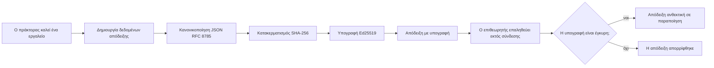
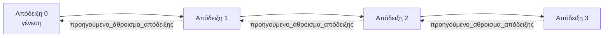

[Παρακολουθήστε το βίντεο μαθήματος: Ασφαλής εντοπισμός AI πρακτόρων με κρυπτογραφικές αποδείξεις](https://youtu.be/PLACEHOLDER_VIDEO_ID)

> _(Το βίντεο μαθήματος και η μικρογραφία θα προστεθούν από την ομάδα περιεχομένου της Microsoft μετά τη συγχώνευση, σύμφωνα με το πρότυπο των μαθημάτων 14 / 15.)_

# Ασφαλής εντοπισμός AI πρακτόρων με κρυπτογραφικές αποδείξεις

## Εισαγωγή

Αυτό το μάθημα θα καλύψει:

- Γιατί τα αρχεία ελέγχου για AI πράκτορες έχουν σημασία για τη συμμόρφωση, τον εντοπισμό σφαλμάτων και την εμπιστοσύνη.
- Τι είναι μια κρυπτογραφική απόδειξη και πώς διαφέρει από μια μη υπογεγραμμένη γραμμή καταγραφής.
- Πώς να παράγετε μια υπογεγραμμένη απόδειξη για μια κλήση εργαλείου πράκτορα σε απλό Python.
- Πώς να επαληθεύσετε μια απόδειξη εκτός σύνδεσης και να ανιχνεύσετε παραποίηση.
- Πώς να αλυσσοδεθείτε αποδείξεις έτσι ώστε η αφαίρεση ή αλλαγή της σειράς μιας να σπάει την αλυσίδα.
- Τι αποδεικνύουν οι αποδείξεις και τι ρητώς δεν αποδεικνύουν.

## Στόχοι Μάθησης

Μετά την ολοκλήρωση αυτού του μαθήματος, θα γνωρίζετε πώς να:

- Αναγνωρίζετε τις αποτυχίες που καθιστούν απαραίτητη την κρυπτογραφική προέλευση για τις ενέργειες των πρακτόρων.
- Παράγετε μια υπογεγραμμένη με Ed25519 απόδειξη πάνω σε ένα κανονικοποιημένο φορτίο JSON.
- Επαληθεύετε μια απόδειξη ανεξάρτητα χρησιμοποιώντας μόνο το δημόσιο κλειδί του υπογράφοντα.
- Ανιχνεύετε παραποίηση επανεκτελώντας την επαλήθευση σε τροποποιημένη απόδειξη.
- Δημιουργείτε μια αλυσίδα αποδείξεων με αλυσιδωτό κατακερματισμό και εξηγείτε γιατί η αλυσίδα έχει σημασία.
- Αναγνωρίζετε τα όρια μεταξύ του τι αποδεικνύουν οι αποδείξεις (απόδοση, ακεραιότητα, σειρά) και τι δεν αποδεικνύουν (ορθότητα της ενέργειας, εγκυρότητα της πολιτικής).

## Το Πρόβλημα: Το Αρχείο Ελέγχου του Πράκτορά σας

Φανταστείτε ότι έχετε αναπτύξει έναν AI πράκτορα για την Contoso Travel. Ο πράκτορας διαβάζει αιτήματα πελατών, καλεί ένα API πτήσεων για να αναζητήσει επιλογές και κάνει κρατήσεις θέσεων εκ μέρους του πελάτη. Το προηγούμενο τρίμηνο, ο πράκτορας διεκπεραίωσε 50.000 κρατήσεις.

Σήμερα, φτάνει ένας ελεγκτής. Θέτει ένα απλό ερώτημα: "Δείξτε μου τι έκανε ο πράκτοράς σας."

Παραδίδετε τα αρχεία καταγραφής σας. Ο ελεγκτής τα εξετάζει και θέτει την πιο δύσκολη ερώτηση: "Πώς ξέρω ότι αυτά τα αρχεία δεν έχουν τροποποιηθεί;"

Αυτό είναι το πρόβλημα της καταγραφής ελέγχου. Οι περισσότερες αναπτύξεις πρακτόρων σήμερα βασίζονται σε:

- **Καταγραφές εφαρμογής**: γραμμένες από τον ίδιο τον πράκτορα, τροποποιήσιμες από οποιονδήποτε έχει πρόσβαση στο σύστημα αρχείων.
- **Υπηρεσίες καταγραφής cloud**: με ορατότητα παραποίησης σε επίπεδο πλατφόρμας, αλλά μόνο αν ο ελεγκτής εμπιστεύεται τον πάροχο της πλατφόρμας.
- **Καταγραφές συναλλαγών βάσης δεδομένων**: κατάλληλες για αλλαγές βάσης δεδομένων, όχι όμως για αυθαίρετες κλήσεις εργαλείων.

Καμία από αυτές δεν μπορεί να απαντήσει στο ερώτημα του ελεγκτή χωρίς να απαιτεί εμπιστοσύνη σε κάποιον (εσάς, τον πάροχο cloud, τον προμηθευτή βάσης δεδομένων σας). Για εσωτερική χρήση, αυτή η εμπιστοσύνη συχνά είναι αποδεκτή. Για ρυθμιζόμενα φορτία εργασίας (χρηματοοικονομικά, υγειονομική περίθαλψη, οτιδήποτε υπόκειται στον Κώδικα AI της ΕΕ), δεν είναι.

Οι κρυπτογραφικές αποδείξεις λύνουν αυτό το ζήτημα κάνοντας κάθε δράση πράκτορα ανεξάρτητα επαληθεύσιμη. Ο ελεγκτής δεν χρειάζεται να εμπιστευτεί εσάς. Χρειάζεται μόνο το δημόσιο κλειδί σας και την ίδια την απόδειξη.

## Τι είναι μια Κρυπτογραφική Απόδειξη;

Μια απόδειξη είναι ένα αντικείμενο JSON που καταγράφει τι έκανε ένας πράκτορας, υπογεγραμμένο με ψηφιακή υπογραφή.


```mermaid
flowchart LR
    A[Ο πράκτορας καλεί ένα εργαλείο] --> B[Δημιουργία δεδομένων απόδειξης]
    B --> C[Κανoνικοποίηση JSON RFC 8785]
    C --> D[Κατακερματισμός SHA-256]
    D --> E[Υπογραφή Ed25519]
    E --> F[Απόδειξη με υπογραφή]
    F --> G[Ο επιθεωρητής επαληθεύει εκτός σύνδεσης]
    G --> H{Η υπογραφή είναι έγκυρη;}
    H -- ναι --> I[Απόδειξη ανθεκτική σε παραποίηση]
    H -- όχι --> J[Η απόδειξη απορρίφθηκε]
```

Μια ελάχιστη απόδειξη μοιάζει ως εξής:

```json
{
  "type": "agent.tool_call.v1",
  "agent_id": "contoso-travel-bot",
  "tool_name": "lookup_flights",
  "tool_args_hash": "sha256:a3f9c1...",
  "result_hash": "sha256:7b2e1d...",
  "policy_id": "contoso-travel-policy-v3",
  "timestamp": "2026-04-25T14:30:00Z",
  "sequence": 47,
  "previous_receipt_hash": "sha256:9d4e6a...",
  "signature": {
    "alg": "EdDSA",
    "sig": "c5af83...",
    "public_key": "8f3b2c..."
  }
}
```

Τρεις ιδιότητες κάνουν τη δουλειά:

1. **Η υπογραφή**. Η απόδειξη υπογράφεται από το gateway του πράκτορα χρησιμοποιώντας ιδιωτικό κλειδί Ed25519. Οποιοσδήποτε διαθέτει το αντίστοιχο δημόσιο κλειδί μπορεί να επαληθεύσει την υπογραφή εκτός σύνδεσης. Οποιαδήποτε παραποίηση πεδίου ακυρώνει την υπογραφή.

2. **Κανονικοποιημένη κωδικοποίηση**. Πριν την υπογραφή, η απόδειξη σειριοποιείται χρησιμοποιώντας το JSON Canonicalization Scheme (JCS, RFC 8785). Αυτό διασφαλίζει ότι δύο υλοποιήσεις που παράγουν την ίδια λογική απόδειξη, παράγουν ίδια ακριβώς ακολουθία bytes. Χωρίς κανονικοποίηση, διαφορετικά JSON serializers θα παρήγαγαν διαφορετικές υπογραφές για το ίδιο περιεχόμενο.

3. **Αλυσιδωτός κατακερματισμός**. Το πεδίο `previous_receipt_hash` συνδέει κάθε απόδειξη με την προηγούμενη. Η αφαίρεση ή η αλλαγή σειράς απόδειξης σπάει κάθε απόδειξη που ακολουθούσε. Η παραποίηση γίνεται ορατή σε επίπεδο αλυσίδας ακόμα και αν παρακαμφθούν μεμονωμένες υπογραφές.

Μαζί, αυτές οι ιδιότητες παρέχουν τρεις εγγυήσεις:

- **Ταυτοποίηση**: αυτό το κλειδί υπέγραψε αυτό το περιεχόμενο.
- **Ακεραιότητα**: το περιεχόμενο δεν έχει αλλάξει από την υπογραφή.
- **Σειρά**: αυτή η απόδειξη εμφανίστηκε μετά από εκείνη στην αλυσίδα.

## Παράγωγη Απόδειξης σε Python

Δεν χρειάζεστε ειδική βιβλιοθήκη για να παράγετε μια απόδειξη. Τα κρυπτογραφικά πρωτόκολλα είναι ευρέως διαθέσιμα και η λογική είναι μερικές δεκάδες γραμμές Python.

Οι πρακτικές ασκήσεις στο `code_samples/18-signed-receipts.ipynb` περιγράφουν ολόκληρη τη ροή. Η συνοπτική εκδοχή:

```python
import json
import hashlib
import base64
from nacl import signing
from jcs import canonicalize  # RFC 8785 κανονικό JSON

def b64url_nopad(data: bytes) -> str:
    return base64.urlsafe_b64encode(data).decode("ascii").rstrip("=")

def sha256_canonical(obj) -> str:
    """SHA-256 of a Python object's JCS-canonical JSON form."""
    return f"sha256:{hashlib.sha256(canonicalize(obj)).hexdigest()}"

# Δημιουργήστε ή φορτώστε ένα κλειδί υπογραφής (σε παραγωγή, αποθηκεύστε το σε θησαυροφυλάκιο κλειδιών)
signing_key = signing.SigningKey.generate()
verify_key = signing_key.verify_key

# Δημιουργήστε το φορτίο απόδειξης (χωρίς υπογραφή ακόμη)
tool_args = {"origin": "SYD", "destination": "LAX"}
tool_result = [{"flight": "QF11", "price": 1850, "stops": 0}]

payload = {
    "type": "agent.tool_call.v1",
    "agent_id": "contoso-travel-bot",
    "tool_name": "lookup_flights",
    "tool_args_hash": sha256_canonical(tool_args),
    "result_hash": sha256_canonical(tool_result),
    "policy_id": "contoso-travel-policy-v3",
    "timestamp": "2026-04-25T14:30:00Z",
    "sequence": 0,
    "previous_receipt_hash": None,
}

# Κανονικοποιήστε, κάντε κατακερματισμό, υπογράψτε.
canonical_bytes = canonicalize(payload)
message_hash = hashlib.sha256(canonical_bytes).digest()
signature_bytes = signing_key.sign(message_hash).signature

# Επισυνάψτε ένα δομημένο αντικείμενο υπογραφής.
receipt = {
    **payload,
    "signature": {
        "alg": "EdDSA",
        "sig": b64url_nopad(signature_bytes),
        "public_key": b64url_nopad(bytes(verify_key)),
    },
}
```

Αυτή είναι ολόκληρη η γραμμή υπογραφής. Οι ασκήσεις στο τετράδιο εξηγούν κάθε βήμα.

## Επαλήθευση Απόδειξης και Ανιχνεύοντας Παραποίηση

Η επαλήθευση είναι η αντίστροφη διαδικασία:

```python
import base64
import hashlib
from nacl import signing
from nacl.exceptions import BadSignatureError
from jcs import canonicalize

def b64url_decode(s: str) -> bytes:
    padding = "=" * ((4 - len(s) % 4) % 4)
    return base64.urlsafe_b64decode(s + padding)

def verify_receipt(receipt: dict) -> bool:
    # Η υπογραφή είναι μια δομημένη οντότητα: {"alg", "sig", "public_key"}.
    sig_obj = receipt.get("signature")
    if not sig_obj or sig_obj.get("alg") != "EdDSA":
        return False

    # Ανασυνθέστε το περιεχόμενο που υπογράφηκε πραγματικά (τα πάντα εκτός της υπογραφής).
    payload = {k: v for k, v in receipt.items() if k != "signature"}

    canonical_bytes = canonicalize(payload)
    message_hash = hashlib.sha256(canonical_bytes).digest()

    try:
        verify_key = signing.VerifyKey(b64url_decode(sig_obj["public_key"]))
        verify_key.verify(message_hash, b64url_decode(sig_obj["sig"]))
        return True
    except BadSignatureError:
        return False
```

Αυτή η συνάρτηση παίρνει μια απόδειξη και επιστρέφει `True` αν η υπογραφή είναι έγκυρη, `False` αλλιώς. Χωρίς κλήση δικτύου, χωρίς εξάρτηση από υπηρεσία, χωρίς εμπιστοσύνη σε τρίτους.

Για να δείτε τον εντοπισμό παραποίησης σε δράση, το τετράδιο περνάει από:

1. Παράγωγη έγκυρης απόδειξης και επιβεβαίωση επαλήθευσής της.
2. Τροποποίηση ενός byte στο πεδίο `tool_args_hash`.
3. Επανεκτέλεση της επαλήθευσης και αποτυχία.

Αυτή είναι η πρακτική απόδειξη ότι οι αποδείξεις είναι ανθεκτικές στην παραποίηση: κάθε τροποποίηση, όσο μικρή και αν είναι, σπάει την υπογραφή.

## Αλυσιδόδεση Αποδείξεων για Πράκτορες Πολλαπλών Βημάτων

Μια μοναδική υπογεγραμμένη απόδειξη προστατεύει μία ενέργεια. Μια αλυσίδα αποδείξεων προστατεύει μια ακολουθία.


```mermaid
flowchart LR
    R0[Απόδειξη 0<br/>γένεση] --> R1[Απόδειξη 1]
    R1 --> R2[Απόδειξη 2]
    R2 --> R3[Απόδειξη 3]
    R1 -. προηγούμενο_άθροισμα_απόδειξης .-> R0
    R2 -. προηγούμενο_άθροισμα_απόδειξης .-> R1
    R3 -. προηγούμενο_άθροισμα_απόδειξης .-> R2
```

Κάθε απόδειξη καταγράφει τον κατακερματισμό της προηγούμενης απόδειξης. Για να αφαιρεθεί σιωπηλά η απόδειξη 2, ο επιτιθέμενος θα πρέπει είτε:

- Να τροποποιήσει το πεδίο `previous_receipt_hash` της απόδειξης 3 (σπάει την υπογραφή της απόδειξης 3), ή
- Να παραποιήσει νέα υπογραφή σε τροποποιημένη απόδειξη 3 (απαιτεί το ιδιωτικό κλειδί του πράκτορα).

Αν το ιδιωτικό κλειδί φυλάσσεται σε ένα hardware key vault και δημοσιεύετε το δημόσιο κλειδί με κάθε απόδειξη, καμία από τις επιθέσεις δεν είναι εφικτή χωρίς ανίχνευση.

Το τετράδιο περνάει από:

1. Δημιουργία μιας αλυσίδας τριών αποδείξεων.
2. Επαλήθευση ότι το `previous_receipt_hash` κάθε απόδειξης ταιριάζει με τον πραγματικό κατακερματισμό της προγενέστερης απόδειξης.
3. Παραποίηση μιας απόδειξης στο μέσο και παρακολούθηση που σπάει η αλυσίδα ακριβώς στο σημείο αυτό.

Έτσι παράγετε ένα αρχείο ελέγχου που μπορεί να επαληθευτεί από εξωτερικό ελεγκτή χωρίς να σας εμπιστευτεί.

## Τι Αποδεικνύουν οι Αποδείξεις (και Τι Δεν Αποδεικνύουν)

Αυτή είναι η πιο σημαντική ενότητα αυτού του μαθήματος. Οι αποδείξεις είναι ισχυρές αλλά η ισχύς τους είναι περιορισμένη.

**Οι αποδείξεις αποδεικνύουν τρία πράγματα:**

1. **Ταυτοποίηση**: ένα συγκεκριμένο κλειδί υπέγραψε ένα συγκεκριμένο φορτίο.
2. **Ακεραιότητα**: το φορτίο δεν έχει αλλάξει από την υπογραφή.
3. **Σειρά**: αυτή η απόδειξη εμφανίστηκε μετά την προηγούμενη στην αλυσιδωτή ακολουθία.

**Οι αποδείξεις ΔΕΝ αποδεικνύουν:**

1. **Ορθότητα**: ότι η ενέργεια του πράκτορα ήταν η σωστή επιλογή. Μια απόδειξη μπορεί να υπογραφεί για λανθασμένη απάντηση το ίδιο εύκολα με τη σωστή.
2. **Συμμόρφωση με πολιτική**: ότι η πολιτική αναφερόμενη στο `policy_id` αξιολογήθηκε πράγματι ή ότι αυτή θα είχε επιτρέψει την ενέργεια αν είχε ελεγχθεί. Η απόδειξη καταγράφει μόνο τι ισχυρίστηκε, όχι τι επιβλήθηκε.
3. **Ταυτότητα πέρα από το κλειδί**: η απόδειξη λέει "αυτό το κλειδί υπέγραψε αυτό το περιεχόμενο." Δεν λέει "αυτός ο άνθρωπος εξουσιοδότησε αυτό." Η σύνδεση κλειδιού με πρόσωπο ή οργανισμό απαιτεί ξεχωριστή υποδομή ταυτότητας (κατάλογο, μητρώο δημόσιων κλειδιών κ.ά.).
4. **Αληθοφάνεια των εισόδων**: αν ο πράκτορας λάβει παραποιημένη προτροπή και ενεργήσει βάσει αυτής, η απόδειξη καταγράφει πιστά την ενέργεια. Οι αποδείξεις είναι εκροές της επικύρωσης εισόδου, όχι υποκατάστατό της.

Αυτό το όριο είναι σημαντικό για δύο λόγους:

- Σας λέει για τι είναι χρήσιμες οι αποδείξεις: για να κάνετε τη συμπεριφορά πράκτορα ελέγξιμη και ανιχνεύσιμη ακόμα και μεταξύ οργανωτικών ορίων.
- Σας λέει ποιες επιπλέον στρώσεις χρειάζεστε: επικύρωση εισόδου (Μάθημα 6), επιβολή πολιτικής (αναφέρεται σύντομα παρακάτω) και υποδομή ταυτότητας (εκτός πεδίου αυτού του μαθήματος).

Συχνό λάθος είναι να υποθέσετε ότι «έχουμε αποδείξεις» σημαίνει «είμαστε υπό διακυβέρνηση.» Δεν είναι. Οι αποδείξεις είναι βάση. Η διακυβέρνηση είναι το σύστημα που χτίζετε πάνω τους.

## Παραπομπές Παραγωγής

Ο κώδικας Python σε αυτό το μάθημα είναι σκόπιμα ελάχιστος ώστε να μπορείτε να διαβάσετε κάθε γραμμή και να καταλάβετε ακριβώς τι συμβαίνει. Στην παραγωγή, έχετε δύο επιλογές:

1. **Χρησιμοποιήστε απευθείας τα κρυπτογραφικά primitives.** Οι 50 γραμμές που είδατε παραπάνω είναι επαρκείς για πολλές περιπτώσεις. Οι βιβλιοθήκες PyNaCl (Ed25519) και το πακέτο `jcs` (πρωτόκολλο canonical JSON) είναι καλά συντηρημένες και έχουν ελεγχθεί.

2. **Χρησιμοποιήστε βιβλιοθήκη παραγωγής αποδείξεων.** Πολλά έργα ανοιχτού κώδικα υλοποιούν το ίδιο πρότυπο με επιπλέον δυνατότητες (περιστροφή κλειδιών, ομαδική επαλήθευση, διανομή ταμείου δημόσιων κλειδιών JWK Set, ολοκλήρωση με μηχανές πολιτικής):
   - Η μορφή απόδειξης που χρησιμοποιείται εδώ ακολουθεί IETF Internet-Draft (`draft-farley-acta-signed-receipts`) που βρίσκεται σε διαδικασία προτύπων.
   - Το Microsoft Agent Governance Toolkit συνθέτει αποδείξεις με αποφάσεις πολιτικής βασισμένες στο Cedar· δείτε το Εκπαιδευτικό Βίντεο 33 σε αυτό το αποθετήριο για παράδειγμα από άκρο σε άκρο.
   - Τα πακέτα `protect-mcp` (npm) και `@veritasacta/verify` (npm) παρέχουν Node-βασισμένη υλοποίηση υπογραφής και αποσύνδεσης υπογραφής, για την περιτύλιξη οποιουδήποτε MCP server με ανιχνεύσιμο αρχείο ελέγχου.
   - Ο **[nobulex](https://github.com/arian-gogani/nobulex)** SDK Python (`pip install nobulex`) προσφέρει το ίδιο πρότυπο υπογραφής Ed25519 + JCS σε Python με ενσωματώσεις LangChain και CrewAI, συμπεριλαμβανομένων δημοσιευμένων διανύσματος διασταυρούμενης επικύρωσης και αντιστοιχίσεων συμμόρφωσης μέσω [OWASP PR #2210](https://github.com/OWASP/CheatSheetSeries/pull/2210).

Η επιλογή μεταξύ δημιουργίας από την αρχή και χρήσης βιβλιοθήκης αντιστοιχεί στην επιλογή μεταξύ συγγραφής δικής σας βιβλιοθήκης JWT και χρήσης ήδη ελεγχόμενης: και οι δύο επιλογές είναι λογικές. Η βιβλιοθήκη εξοικονομεί χρόνο και μειώνει την επιφάνεια ελέγχου· η προσέγγιση από το μηδέν σας αναγκάζει να κατανοήσετε κάθε primitive. Αυτό το μάθημα διδάσκει την προσέγγιση από το μηδέν ώστε να έχετε τη βάση για οποιαδήποτε επιλογή.

## Έλεγχος Γνώσης

Δοκιμάστε την κατανόησή σας πριν προχωρήσετε στην πρακτική άσκηση.

**1. Η απόδειξη υπογράφεται με το ιδιωτικό κλειδί Ed25519 του πράκτορα. Ο ελεγκτής διαθέτει μόνο το δημόσιο κλειδί. Μπορεί ο ελεγκτής να επαληθεύσει την απόδειξη εκτός σύνδεσης;**

<details>
<summary>Απάντηση</summary>

Ναι. Η επαλήθευση Ed25519 απαιτεί μόνο το δημόσιο κλειδί και τα υπογεγραμμένα bytes. Χωρίς κλήση δικτύου, χωρίς εξάρτηση από υπηρεσία. Αυτό είναι το χαρακτηριστικό που καθιστά τις αποδείξεις χρήσιμες σε περιβάλλοντα χωρίς σύνδεση (air-gapped), πολλαπλών οργανισμών ή χαμηλής εμπιστοσύνης.
</details>

**2. Ένας επιτιθέμενος τροποποιεί το πεδίο `policy_id` μιας απόδειξης για να ισχυριστεί ότι ρυθμιζόταν από πιο επιεική πολιτική. Η υπογραφή ήταν πάνω στο αρχικό φορτίο. Τι συμβαίνει κατά την επαλήθευση;**

<details>
<summary>Απάντηση</summary>

Η επαλήθευση αποτυγχάνει. Η υπογραφή υπολογίστηκε πάνω σε κανονικοποιημένα bytes του αρχικού φορτίου· η τροποποίηση οποιουδήποτε πεδίου αλλάζει τα κανονικοποιημένα bytes, αλλάζει τον κατακερματισμό SHA-256, κάνοντας την υπογραφή άκυρη. Ο επιτιθέμενος χρειάζεται το ιδιωτικό κλειδί για να παράγει νέα έγκυρη υπογραφή, κάτι που δεν έχει.
</details>

**3. Γιατί η απόδειξη περιλαμβάνει `tool_args_hash` και `result_hash` αντί για τα ακατέργαστα ορίσματα και αποτέλεσμα;**

<details>
<summary>Απάντηση</summary>

Δύο λόγοι. Πρώτον, η απόδειξη μπορεί να χρειαστεί να αρχειοθετηθεί ή να μεταδοθεί σε περιβάλλοντα όπου η διαρροή ωμού περιεχομένου (PII, επιχειρηματικά δεδομένα) αποτελεί πρόβλημα. Ο κατακερματισμός κρατά την απόδειξη μικρή και το περιεχόμενο ιδιωτικό· ο ελεγκτής επαληθεύει ότι ο κατακερματισμός ταιριάζει με ξεχωριστά αποθηκευμένο αντίγραφό του πραγματικού περιεχομένου. Δεύτερον, οι κατακερματισμοί έχουν σταθερό μέγεθος· η απόδειξη με κατακερματισμούς έχει περιορισμένο μέγεθος ανεξάρτητα από το μέγεθος των εισόδων και εξόδων.
</details>

**4. Το πεδίο `previous_receipt_hash` συνδέει κάθε απόδειξη με τον προκάτοχό της. Αν ένας επιτιθέμενος διαγράψει σιωπηλά μια απόδειξη από τη μέση μιας αλυσίδας, τι καθίσταται άκυρο;**

<details>
<summary>Απάντηση</summary>

Κάθε απόδειξη που ακολουθούσε την διαγραμμένη. Τα πεδία `previous_receipt_hash` τους δεν αντιστοιχούν πλέον με την πραγματική αλυσίδα (επειδή η απόδειξη που αναφερόταν δεν υπάρχει πλέον, ή η αλυσίδα πλέον δείχνει σε διαφορετικό προκάτοχο). Για να κρύψει τη διαγραφή, ο επιτιθέμενος θα έπρεπε να ξαναυπογράψει κάθε επόμενη απόδειξη, κάτι που απαιτεί το ιδιωτικό κλειδί.
</details>

**5. Μια απόδειξη επαληθεύεται σωστά. Αυτό αποδεικνύει ότι η ενέργεια του πράκτορα ήταν ορθή, εύλογη ή συμμορφούμενη με την πολιτική;**

<details>
<summary>Απάντηση</summary>

Όχι. Μια έγκυρη απόδειξη αποδεικνύει τρία πράγματα: ταυτοποίηση (αυτό το κλειδί υπέγραψε αυτό το περιεχόμενο), ακεραιότητα (το περιεχόμενο δεν έχει αλλάξει) και σειρά (η απόδειξη αυτή ήρθε μετά από εκείνη). ΔΕΝ αποδεικνύει ότι η ενέργεια ήταν σωστή, ότι η πολιτική στο `policy_id` αξιολογήθηκε πράγματι ή ότι ο πράκτορας ακολούθησε όλους τους κανόνες. Οι αποδείξεις καθιστούν τη συμπεριφορά του πράκτορα ελέγξιμη, όχι απαραίτητα ορθή. Αυτό είναι το πιο σημαντικό όριο στο μάθημα.
</details>

## Πρακτική Άσκηση

Ανοίξτε το `code_samples/18-signed-receipts.ipynb` και ολοκληρώστε και τις τέσσερις ενότητες:

1. **Ενότητα 1**: Υπογράψτε την πρώτη σας απόδειξη και επαληθεύστε την.
2. **Ενότητα 2**: Παραποιήστε την απόδειξη και παρατηρήστε την αποτυχία επαλήθευσης.
3. **Ενότητα 3**: Δημιουργήστε μια αλυσίδα τριών αποδείξεων και επαληθεύστε την ακεραιότητα της αλυσίδας.
4. **Ενότητα 4**: Εφαρμόστε το πρότυπο σε πράκτορα που χτίστηκε με το Microsoft Agent Framework: περιβάλλετε μια κλήση εργαλείου με υπογραφή απόδειξης και στη συνέχεια επαληθεύστε την απόδειξη ανεξάρτητα.
**Πρόκληση επέκτασης 1:** επέκτεινε το σχήμα απόδειξης με ένα επιπλέον πεδίο της επιλογής σου (για παράδειγμα, ένα αίτημα ID για ιχνηλάτηση), ενημέρωσε τη λογική της κανονικής υπογραφής ώστε να το συμπεριλάβει, και επιβεβαίωσε ότι η απόδειξη εξακολουθεί να περνάει την επαλήθευση (round-trip). Στη συνέχεια τροποποίησε το πεδίο μετά την υπογραφή και επιβεβαίωσε ότι η επαλήθευση αποτυγχάνει. Αυτό σε αναγκάζει να καταλάβεις πώς κάθε byte της κανονικής κωδικοποίησης συμβάλλει στην υπογραφή.

**Πρόκληση επέκτασης 2:** υπολόγισε το SHA-256 hash δύο αποδείξεων σου μαζί (συνένωσε τα κανονικά bytes τους με μια ντετερμινιστική σειρά) και ενσωμάτωσε το προκύπτον digest ως νέο πεδίο σε μια τρίτη απόδειξη πριν την υπογράψεις. Επαλήθευσε ότι και οι τρεις αποδείξεις εξακολουθούν να περνάνε την επαλήθευση. Μόλις έχτισες μια απόδειξη ενclusion σε ένα βήμα: όποιος κατέχει την τρίτη απόδειξη μπορεί να αποδείξει ότι οι δύο πρώτες υπήρχαν τη χρονική στιγμή που υπογράφηκε, χωρίς να χρειάζεται να αποκαλύψει το περιεχόμενό τους. Αυτό είναι το πρότυπο που χρησιμοποιούν οι αποδείξεις με επιλεκτική αποκάλυψη σε ευρεία κλίμακα (Merkle commitments, RFC 6962).

## Συμπέρασμα

Οι κρυπτογραφικές αποδείξεις παρέχουν στους πράκτορες AI ένα ιστορικό ελέγχου το οποίο είναι:

- **Ανεξάρτητα επαληθεύσιμο:** οποιοδήποτε μέρος με το δημόσιο κλειδί μπορεί να επαληθεύσει, χωρίς εξάρτηση από υπηρεσία.
- **Ανθεκτικό σε παραποίηση:** οποιαδήποτε τροποποίηση ακυρώνει την υπογραφή.
- **Φορητό:** μια απόδειξη είναι ένα μικρό αρχείο JSON· μπορεί να αρχειοθετηθεί, να μεταδοθεί και να επαληθευτεί οπουδήποτε.
- **Συμβατό με πρότυπα:** βασίζεται σε Ed25519 (RFC 8032), JCS (RFC 8785) και SHA-256, όλα ευρέως υλοποιημένα πρωτόκολλα.

Δεν αντικαθιστούν την επικύρωση εισόδου, την επιβολή πολιτικών ή την υποδομή ταυτότητας. Είναι θεμέλιο για αυτές τις στρώσεις. Όταν αναπτύσσεις πράκτορες σε ρυθμιζόμενα φορτία εργασίας, ροές εργασίας πολλαπλών οργανώσεων, ή σε οποιοδήποτε περιβάλλον όπου ένας μελλοντικός ελεγκτής δεν μπορεί να θεωρηθεί αξιόπιστος, οι αποδείξεις είναι ο τρόπος να κάνεις το ιστορικό ελέγχου ειλικρινές.

Το πιο σημαντικό συμπέρασμα: οι αποδείξεις αποδεικνύουν ποιος είπε τι και πότε. Δεν αποδεικνύουν ότι αυτό που ειπώθηκε ήταν αληθές ή σωστό. Διατήρησε αυστηρά αυτή τη διάκριση. Είναι η διαφορά ανάμεσα σε ένα τίμιο σύστημα προέλευσης και σε ένα παραπλανητικό.

## Λίστα Ελέγχου Παραγωγής

Όταν είσαι έτοιμος να προχωρήσεις από αυτό το μάθημα στην ανάπτυξη πρακτόρων που υπογράφουν αποδείξεις σε ένα πραγματικό περιβάλλον:

- [ ] **Μετακίνησε το κλειδί υπογραφής εκτός του φορητού υπολογιστή προγραμματιστή.** Χρησιμοποίησε Azure Key Vault, AWS KMS ή μια συσκευή ασφάλειας υλικού. Το ιδιωτικό κλειδί που υπογράφει τις αποδείξεις σου δεν πρέπει ποτέ να ζει σε έλεγχο πηγαίου κώδικα ή σε απλό κείμενο σε μηχανές εφαρμογών.
- [ ] **Δημοσίευσε το δημόσιο κλειδί επαλήθευσης.** Οι ελεγκτές το χρειάζονται για επαλήθευση εκτός σύνδεσης. Το πρότυπο είναι ένα JWK Set σε μια γνωστή διεύθυνση URL (RFC 7517), π.χ., `https://your-org.example.com/.well-known/agent-keys.json`.
- [ ] **Αγκύρωσε την αλυσίδα εξωτερικά.** Περιοδικά γράφε το τελευταίο hash της κορυφής της αλυσίδας σε ένα διαφανές ημερολόγιο (Sigstore Rekor, RFC 3161 timestamp authority ή δεύτερο εσωτερικό σύστημα) ώστε ένα εξωτερικό μέρος να επιβεβαιώσει "αυτή η αλυσίδα υπήρχε αυτήν την χρονική στιγμή".
- [ ] **Αποθήκευσε τις αποδείξεις με αμεταβλητό τρόπο.** Αποθήκευση μόνο με προσθήκες (Azure Storage με πολιτικές αμεταβλητότητας, AWS S3 Object Lock) αποτρέπει έναν εσωτερικό να ξαναγράψει το ιστορικό στο επίπεδο αποθήκευσης.
- [ ] **Πρόσφερε απόφαση διατήρησης.** Πολλοί κανονισμοί συμμόρφωσης απαιτούν διατήρηση πολλών ετών. Σχεδίασε για την αύξηση του μεγέθους αποδείξεων (κάθε απόδειξη είναι ~500 bytes· ένας πράκτορας που κάνει 10.000 κλήσεις ημερησίως παράγει περίπου ~1,8 GB ανά έτος).
- [ ] **Τεκμηρίωσε τι δεν καλύπτουν οι αποδείξεις.** Οι αποδείξεις αποδεικνύουν αναφορά, ακεραιότητα και σειρά. Το εγχειρίδιό σου πρέπει ρητώς να περιλαμβάνει ποια επιπλέον μέσα ελέγχου (επικύρωση εισόδου, επιβολή πολιτικών, περιορισμός ρυθμού, υποδομή ταυτότητας) λειτουργούν παράλληλα με τις αποδείξεις στη στάση διακυβέρνησής σου.

### Έχεις Περισσότερες Ερωτήσεις για την Ασφάλεια Πρακτόρων AI;

Έλα στο [Microsoft Foundry Discord](https://aka.ms/ai-agents/discord) για να συναντήσεις άλλους μαθητές, να παρακολουθήσεις ώρες γραφείου και να πάρεις απαντήσεις στις ερωτήσεις σου για τους Πράκτορες AI.

## Πέρα από Αυτό το Μάθημα

Το μάθημα καλύπτει την υπογραφή μίας απόδειξης και αλυσιδωτές ακολουθίες κατακερματισμού. Τα ίδια πρωτόκολλα συνθέτουν αρκετά πιο προηγμένα πρότυπα που μπορεί να συναντήσεις καθώς ωριμάζει η στάση διακυβέρνησής σου:

- **Επιλεκτική αποκάλυψη.** Όταν τα πεδία μιας απόδειξης δεσμεύονται ανεξάρτητα (Merkle δέντρο τύπου RFC 6962), μπορείς να αποκαλύψεις συγκεκριμένα πεδία σε συγκεκριμένους ελεγκτές και να αποδείξεις ότι τα υπόλοιπα δεν έχουν αλλάξει χωρίς να τα εκθέσεις. Χρήσιμο όταν η ίδια απόδειξη πρέπει να ικανοποιήσει τόσο έναν πλήρη έλεγχο (που ζητά πληρότητα) όσο και κανονισμούς ελαχιστοποίησης δεδομένων όπως ο GDPR (που θέλουν ο ελεγκτής να δει όσο το δυνατόν λιγότερα).
- **Ανάκληση αποδείξεων.** Αν ένα κλειδί υπογραφής παραβιαστεί, χρειάζεσαι τρόπο να χαρακτηρίσεις όλες τις αποδείξεις που υπέγραψε εκείνο το κλειδί ως μη αξιόπιστες από ένα συγκεκριμένο χρόνο και μετά. Πρότυπα: βραχύβια κλειδιά υπογραφής συν δημοσιευμένη λίστα ανάκλησης, ή διαφανές ημερολόγιο με εγγραφές ανάκλησης.
- **Αμφοτερόπλευρες / αποδείξεις με διαιρεμένη υπογραφή.** Κάποιες υλοποιήσεις χωρίζουν το υπογεγραμμένο φορτίο σε προ-εκτέλεση (`authorization_*`) και μετα-εκτέλεση (`result_*`) με ανεξάρτητες υπογραφές, χρήσιμο όταν η απόφαση εξουσιοδότησης και το παρατηρούμενο αποτέλεσμα δημιουργούνται από διαφορετικούς παράγοντες ή σε διαφορετικούς χρόνους. Αυτό προστίθεται επικολλητικά πάνω στο σχήμα απόδειξης που διδάχθηκε εδώ.
- **Σύνθεση φορτίου.** Μια απόδειξη σφραγίζει όποια bytes τοποθετήσεις στο `result_hash`. Τα πραγματικά φορτία είναι συχνά πιο σύνθετα από το αποτέλεσμα μιας μόνο κλήσης εργαλείου: προ-απόφαση συλλογιστική (πρόβλεψη μοντέλου, ληφθείσες επιλογές, στοιχεία και η πληρότητά τους, στάση κινδύνου, αλυσίδα λογοδοσίας, αποτέλεσμα ελέγχου) μπορούν όλα να ζουν μέσα στο φορτίο, σφραγισμένα από μία μόνο απόδειξη. Αυτό κρατά το φορμάτ απόδειξης απλό αφήνοντας τα σχήματα φορτίου να εξελίσσονται ανά τομέα.
- **Διασχίσεις συμμόρφωσης υλοποιήσεων.** Πολλές ανεξάρτητες υλοποιήσεις του ιδίου φορμάτ απόδειξης (Python, TypeScript, Rust, Go) κάνουν διασταυρούμενη επαλήθευση με κοινά διανύσματα δοκιμών. Αν φτιάξεις δική σου υλοποίηση, η επικύρωση με δημοσιευμένα διανύσματα επιβεβαιώνει συμβατότητα ασύρματης μετάδοσης.
- **Μετάβαση μετά-κβαντικής εποχής.** Το Ed25519 είναι ευρέως σε χρήση σήμερα αλλά δεν είναι κβαντικώς ανθεκτικό. Το φορμάτ απόδειξης είναι αλγοριθμο-ελαστικό: το πεδίο `signature.alg` μπορεί να φέρει `ML-DSA-65` (το πρότυπο NIST για υπογραφές μετά-κβαντικής εποχής) όταν χρειαστείς μετάβαση. Σχεδίασε μια περίοδο μεταβατική όπου οι αποδείξεις υπογράφονται διπλά.

## Πρόσθετοι Πόροι

- <a href="https://datatracker.ietf.org/doc/draft-farley-acta-signed-receipts/" target="_blank">IETF Internet-Draft: Signed Decision Receipts for Machine-to-Machine Access Control</a>
- <a href="https://learn.microsoft.com/azure/ai-studio/responsible-use-of-ai-overview" target="_blank">Επισκόπηση Υπεύθυνης Χρήσης Τεχνητής Νοημοσύνης (Azure AI)</a>
- <a href="https://datatracker.ietf.org/doc/html/rfc8032" target="_blank">RFC 8032: Αλγόριθμος Ψηφιακής Υπογραφής Καμπύλης Edwards (EdDSA)</a>
- <a href="https://datatracker.ietf.org/doc/html/rfc8785" target="_blank">RFC 8785: Σχέδιο Κανονικοποίησης JSON (JCS)</a>
- <a href="https://datatracker.ietf.org/doc/html/rfc6962" target="_blank">RFC 6962: Διαφάνεια Πιστοποιητικών</a> (Merkle δέντρο που χρησιμοποιείται από αποδείξεις επιλεκτικής αποκάλυψης)
- <a href="https://github.com/microsoft/agent-governance-toolkit/blob/main/docs/tutorials/33-offline-verifiable-receipts.md" target="_blank">Microsoft Agent Governance Toolkit, Μαθηματικό 33: Αποδείξεις Αποφάσεων με Επαλήθευση Εκτός Σύνδεσης</a>
- <a href="https://github.com/ScopeBlind/agent-governance-testvectors" target="_blank">Διασχίζουσες διανύσματα δοκιμών συμμόρφωσης υλοποιήσεων</a> για το φορμάτ απόδειξης που χρησιμοποιήθηκε σε αυτό το μάθημα (Apache-2.0)
- <a href="https://pynacl.readthedocs.io/" target="_blank">Τεκμηρίωση PyNaCl</a> (Ed25519 σε Python)

## Προηγούμενο Μάθημα

[Κατασκευή Πρακτόρων Χρήσης Υπολογιστή (CUA)](../15-browser-use/README.md)

---

<!-- CO-OP TRANSLATOR DISCLAIMER START -->
**Αποποίηση ευθυνών**:
Αυτό το έγγραφο έχει μεταφραστεί χρησιμοποιώντας την υπηρεσία μετάφρασης με τεχνητή νοημοσύνη [Co-op Translator](https://github.com/Azure/co-op-translator). Ενώ επιδιώκουμε την ακρίβεια, παρακαλούμε να έχετε υπόψη ότι οι αυτοματοποιημένες μεταφράσεις ενδέχεται να περιέχουν λάθη ή ανακρίβειες. Το πρωτότυπο έγγραφο στη μητρική του γλώσσα πρέπει να θεωρείται η αυθεντική πηγή. Για κρίσιμες πληροφορίες, συνιστάται επαγγελματική ανθρώπινη μετάφραση. Δεν φέρουμε ευθύνη για τυχόν παρεξηγήσεις ή λανθασμένες ερμηνείες που προκύπτουν από τη χρήση αυτής της μετάφρασης.
<!-- CO-OP TRANSLATOR DISCLAIMER END -->